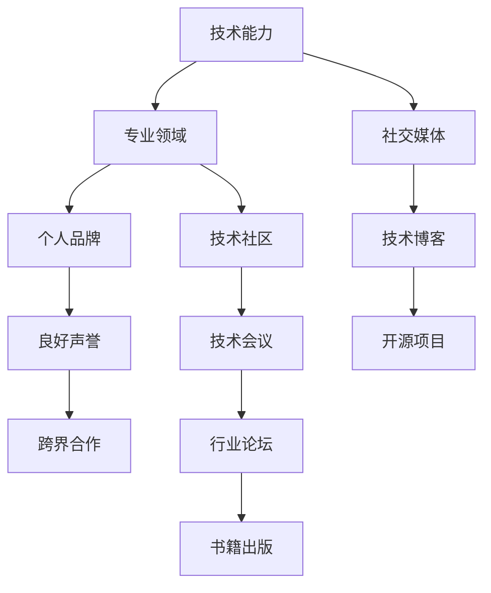

                 

# 程序员如何打造个人影响力

## 1. 背景介绍

在数字化和信息化飞速发展的今天，程序员个人的影响力正变得日益重要。无论是初创公司还是大型企业，无论是技术团队还是产品经理，程序员的影响力贯穿于产品开发、技术架构、项目管理和商业决策的每一个环节。然而，要真正成为行业中的佼佼者，打造个人影响力并非易事。本文将深入探讨程序员如何通过提升技术能力、拓展专业领域、构建个人品牌和维护良好声誉，来塑造个人影响力。

## 2. 核心概念与联系

### 2.1 核心概念概述

为更好地理解程序员个人影响力的构建，本文将介绍几个关键概念及其相互联系：

- **技术能力**：指程序员在编程语言、开发框架、算法设计等方面的专业知识和实际应用能力。技术能力是程序员基础，也是影响力的核心支撑。
- **专业领域**：指程序员在某一特定技术方向或行业应用的深入研究与实践。专业化是程序员差异化竞争的关键，也是建立权威地位的基石。
- **个人品牌**：指程序员通过社交媒体、技术博客、开源项目等方式，展示自身技术观点和实践成果，形成独特的个人形象和市场认知。个人品牌是程序员影响力的外在表现。
- **良好声誉**：指程序员在同行和业界内的信任度、认可度与美誉度。良好的声誉是程序员影响力的内在保障，是行业内外长期信任的基础。
- **跨界合作**：指程序员跨越技术、产品、管理等不同领域的合作与交流，拓展视野和知识面，提升影响力的广度和深度。

这些概念共同构成了程序员影响力的基础框架，理解并践行这些概念将帮助程序员在职业道路上获得持续发展和卓越成就。

### 2.2 核心概念原理和架构的 Mermaid 流程图(Mermaid 流程节点中不要有括号、逗号等特殊字符)

此流程图展示了技术能力如何通过专业化、个人品牌、良好声誉和跨界合作，逐步构建起程序员的个人影响力。

## 3. 核心算法原理 & 具体操作步骤

### 3.1 算法原理概述

程序员个人影响力的构建，本质上是一种多目标优化问题。其核心在于如何通过技术能力提升、专业领域拓展、个人品牌建设与良好声誉维护，达到影响力的最大化。

具体来说，可以将影响力的提升拆解为以下几个关键步骤：

1. **技术能力提升**：持续学习新技术，通过编程实践和项目经验积累技术深度和广度。
2. **专业领域拓展**：选择有潜力的技术方向或行业应用，深入研究，形成独特的专业见解。
3. **个人品牌建设**：通过社交媒体、技术博客、开源项目等方式，展示专业技能，分享技术观点，与同行交流互动。
4. **良好声誉维护**：通过持续贡献高质量代码、解决技术难题、参与开源社区等行为，建立和维护行业内外的良好口碑。
5. **跨界合作拓展**：积极参与跨领域的合作与交流，如与产品经理、项目经理、销售人员等合作，提升综合影响力。

### 3.2 算法步骤详解

以下详细介绍每一个关键步骤的具体操作方法和注意事项。

#### 3.2.1 技术能力提升

**步骤一：持续学习新技术**
- **在线课程**：利用Coursera、Udacity、edX等平台，学习前沿技术课程。
- **专业书籍**：阅读经典的编程书籍和技术手册，如《算法导论》、《深入理解计算机系统》等。
- **技术博客**：定期阅读知名技术博客，如Medium、CSDN等，了解行业动态和最新技术。

**步骤二：编程实践与项目经验**
- **开源项目**：参与或主导开源项目，贡献代码，解决技术难题，积累实践经验。
- **技术练手**：定期进行技术练手，如LeetCode、HackerRank等平台上的算法练习。
- **技术会议**：参加技术会议，听取专家讲座，拓展视野。

#### 3.2.2 专业领域拓展

**步骤一：选择有前景的技术方向**
- **行业趋势**：关注行业报告、研究论文、技术报告等，了解当前和未来技术趋势。
- **领域专家**：与领域内的专家进行交流，获取专业建议和指导。
- **个人兴趣**：选择既符合市场需求又有个人兴趣的技术方向，如云计算、大数据、人工智能等。

**步骤二：深入研究和实践**
- **理论学习**：深入学习相关领域的理论知识，如算法、数据结构、设计模式等。
- **项目实践**：在实际项目中应用所学知识，解决实际问题，提升技术深度。
- **论文发表**：撰写技术论文，发布到顶级会议或期刊，提升专业影响力。

#### 3.2.3 个人品牌建设

**步骤一：社交媒体展示**
- **GitHub**：在GitHub上维护个人代码库，定期更新项目进展，展示技术实力。
- **Twitter**：在Twitter上分享技术观点、参与讨论，建立专业声誉。
- **LinkedIn**：在LinkedIn上发布技术文章、项目经历，扩展行业人脉。

**步骤二：技术博客写作**
- **技术博客**：在博客平台上发布技术文章，分享编程心得和行业见解。
- **内容优化**：优化博客内容，提高可读性和搜索引擎排名。
- **读者互动**：积极回应读者评论，与同行交流互动。

**步骤三：开源项目贡献**
- **GitHub项目**：选择开源项目，积极贡献代码，解决Bug，改进功能。
- **社区参与**：加入技术社区，如Stack Overflow、Reddit等，参与技术讨论和问题解答。
- **项目领导**：担任开源项目领导，组织团队协作，提升项目管理能力。

#### 3.2.4 良好声誉维护

**步骤一：高质量代码贡献**
- **代码质量**：编写高质量、可维护的代码，注重代码规范和注释。
- **代码审查**：积极参与代码审查，提出有建设性的建议，提升团队代码质量。
- **持续改进**：不断改进已有代码，修复Bug，提升性能。

**步骤二：技术难题解决**
- **社区互动**：在技术社区中主动解答他人问题，提供技术支持。
- **开源贡献**：在开源项目中积极解决问题，贡献代码，建立良好声誉。
- **技术分享**：在技术分享会上展示技术难题的解决过程，分享技术见解。

**步骤三：积极参与开源社区**
- **社区贡献**：积极参与开源社区，贡献代码，解决Bug，提出改进建议。
- **社区反馈**：关注社区反馈，改进贡献方式，提升社区贡献度。
- **社区领导**：担任开源项目领导，组织团队协作，提升项目管理能力。

#### 3.2.5 跨界合作拓展

**步骤一：跨领域交流**
- **团队合作**：与产品经理、项目经理、销售人员等跨领域同事合作，了解业务需求，提升综合能力。
- **外部沟通**：与客户、合作伙伴、供应商等外部利益相关者进行沟通，建立良好关系。
- **跨领域学习**：学习市场营销、产品管理、项目管理等跨领域知识，提升综合素质。

**步骤二：跨领域项目实践**
- **产品需求理解**：深入理解产品需求，设计合理的技术方案。
- **项目管理**：积极参与项目管理，提升项目管理和团队协作能力。
- **项目交付**：确保项目按时按质交付，提升项目交付能力。

## 4. 数学模型和公式 & 详细讲解 & 举例说明

### 4.1 数学模型构建

在程序员个人影响力的构建过程中，可以将其视为一个多目标优化问题，目标是最大化技术能力、专业领域、个人品牌、良好声誉和跨界合作的影响力。设 $I_1$、$I_2$、$I_3$、$I_4$、$I_5$ 分别代表技术能力、专业领域、个人品牌、良好声誉和跨界合作的影响力，则优化模型为：

$$
\max_{X} \quad \sum_{i=1}^{5} \omega_i I_i(X)
$$

其中 $X$ 表示所有可能的行动集合，$\omega_i$ 表示各目标权重。

### 4.2 公式推导过程

#### 4.2.1 技术能力影响度的计算

技术能力的影响度可以通过以下公式计算：

$$
I_1 = f_{技术}(p, e, c)
$$

其中 $p$ 表示编程实践频率，$e$ 表示技术经验，$c$ 表示项目贡献度。

#### 4.2.2 专业领域影响度的计算

专业领域影响度的计算公式为：

$$
I_2 = f_{专业}(d, r, p)
$$

其中 $d$ 表示领域专深度，$r$ 表示研究论文发表数量，$p$ 表示项目实践经验。

#### 4.2.3 个人品牌影响度的计算

个人品牌影响度的计算公式为：

$$
I_3 = f_{品牌}(s, w, c)
$$

其中 $s$ 表示社交媒体活跃度，$w$ 表示技术博客质量，$c$ 表示开源项目贡献度。

#### 4.2.4 良好声誉影响度的计算

良好声誉影响度的计算公式为：

$$
I_4 = f_{声誉}(b, c, e)
$$

其中 $b$ 表示高质量代码贡献，$c$ 表示技术难题解决数量，$e$ 表示社区参与度。

#### 4.2.5 跨界合作影响度的计算

跨界合作影响度的计算公式为：

$$
I_5 = f_{合作}(t, o, p)
$$

其中 $t$ 表示跨领域交流频率，$o$ 表示跨领域项目参与度，$p$ 表示项目管理能力。

### 4.3 案例分析与讲解

**案例一：开源贡献者的影响力提升**

某开源贡献者A，技术能力较强，但在个人品牌和良好声誉方面表现一般。为提升影响力，A决定重点提升社交媒体展示和个人品牌建设。具体措施如下：

1. **社交媒体展示**：在GitHub和Twitter上定期更新代码库和技术观点，积极参与技术讨论，提升活跃度。
2. **技术博客写作**：开设个人技术博客，发布高质量技术文章，定期更新，优化SEO。
3. **开源项目贡献**：选择热门开源项目，积极贡献代码，解决Bug，提升贡献度。

经过半年努力，A的个人品牌影响力显著提升，在开源社区内获得了高度认可，成功获得了知名公司的技术岗位邀请。

**案例二：技术经理的影响力构建**

某技术经理B，具有良好的项目管理能力和跨界合作经验，但在技术能力和专业领域拓展方面有待提升。为提升影响力，B决定重点提升技术能力和专业领域拓展。具体措施如下：

1. **技术能力提升**：利用在线课程和专业书籍持续学习新技术，定期参与技术练手和开源项目。
2. **专业领域拓展**：选择云计算和大数据等有前景的技术方向，深入研究，发表技术论文，提升专业深度。
3. **跨界合作拓展**：积极与产品经理、项目经理合作，了解业务需求，提升综合素质。

经过一年的努力，B在技术能力、专业领域和跨界合作方面都有了显著提升，成功被提升为技术总监，带领团队完成了多个重大项目，影响力进一步提升。

## 5. 项目实践：代码实例和详细解释说明

### 5.1 开发环境搭建

**步骤一：选择编程语言和工具**
- **编程语言**：选择Python、Java、C++等主流编程语言，根据项目需求选择。
- **开发工具**：安装Visual Studio、Eclipse、IntelliJ IDEA等开发环境，配置版本控制工具如Git、SVN等。

**步骤二：建立开发环境**
- **虚拟机**：搭建虚拟机，如VirtualBox、VMware等，安装操作系统和开发环境。
- **云服务**：使用云服务如AWS、Azure、Google Cloud等，快速搭建开发环境。

**步骤三：版本控制**
- **Git使用**：学习Git基本命令和分支管理，建立本地仓库和远程仓库，实现代码版本控制。
- **持续集成**：配置CI/CD工具如Jenkins、Travis CI等，实现代码自动构建和测试。

### 5.2 源代码详细实现

**步骤一：项目初始化**
- **创建项目**：创建新项目，如使用Maven、Gradle等构建工具，配置项目依赖和配置文件。
- **版本控制**：初始化Git仓库，添加远程仓库，提交代码和文档。

**步骤二：代码实现**
- **模块划分**：根据项目需求，将代码划分为多个模块，如业务逻辑、数据处理、UI界面等。
- **编码实现**：编写代码，遵循编程规范，使用注释和文档解释代码功能。
- **单元测试**：编写单元测试，使用JUnit、pytest等测试框架，确保代码正确性。

**步骤三：持续集成和部署**
- **构建自动化**：配置CI/CD工具，实现代码自动构建和测试，生成可执行文件。
- **部署自动化**：配置自动化部署脚本，如使用Docker、Kubernetes等，实现代码自动部署。
- **持续监控**：配置监控工具，如Prometheus、Grafana等，实时监控代码运行状态。

### 5.3 代码解读与分析

**代码解读**：
- **代码规范**：遵循PEP 8、Google Code Style等编程规范，确保代码整洁、易读。
- **注释和文档**：编写清晰的代码注释和API文档，帮助他人理解代码功能。
- **错误处理**：编写完整的错误处理机制，确保代码健壮性。

**代码分析**：
- **代码审查**：通过代码审查工具如SonarQube、CodeClimate等，检测代码质量，提出改进建议。
- **性能优化**：通过性能分析工具如JProfiler、VisualVM等，优化代码性能，提升系统响应速度。
- **安全性检查**：通过安全扫描工具如OWASP ZAP、Snyk等，检测代码安全漏洞，提升系统安全性。

### 5.4 运行结果展示

**运行结果展示**：
- **性能指标**：展示代码运行时间、响应时间、吞吐量等性能指标。
- **质量指标**：展示代码错误率、代码复杂度、代码覆盖率等质量指标。
- **安全指标**：展示代码安全漏洞数量、代码审查次数、代码规范遵循度等安全指标。

## 6. 实际应用场景

### 6.1 开源社区贡献者

**应用场景一：开源项目贡献**
- **项目选择**：选择开源项目，如GitHub上的Terraform、Kubernetes等，选择符合自己技术兴趣和擅长的项目。
- **代码贡献**：积极提交代码，修复Bug，改进功能，与项目维护者合作，提升代码质量。
- **社区互动**：积极参与项目讨论，提出建议，解决社区成员问题，提升社区贡献度。

**应用场景二：技术博客写作**
- **博客平台**：选择Medium、CSDN等博客平台，发布技术文章，分享编程心得和行业见解。
- **内容优化**：优化博客内容，提高可读性和SEO，增加博客访问量。
- **读者互动**：积极回应读者评论，与同行交流互动，提升博客影响力。

### 6.2 技术经理

**应用场景一：项目管理**
- **项目规划**：制定项目计划，明确项目目标、里程碑和交付时间。
- **团队协作**：组织团队协作，分配任务，定期进行项目进度汇报。
- **问题解决**：积极解决项目中的技术难题，确保项目按时按质交付。

**应用场景二：跨界合作**
- **团队合作**：与产品经理、项目经理、销售人员等跨领域同事合作，了解业务需求，提升综合能力。
- **外部沟通**：与客户、合作伙伴、供应商等外部利益相关者进行沟通，建立良好关系。
- **跨领域项目实践**：积极参与跨领域项目，如金融领域的数据分析项目、医疗领域的信息系统项目等，提升综合素质。

## 7. 工具和资源推荐

### 7.1 学习资源推荐

**编程语言**：
- **Python**：学习Python基础语法、常用库（如NumPy、Pandas、Scikit-Learn等）、数据科学框架（如TensorFlow、PyTorch等）。
- **Java**：学习Java基础语法、常用框架（如Spring、Hibernate等）、微服务架构。
- **C++**：学习C++基础语法、常用库（如STL、Boost等）、高性能编程技术。

**开发工具**：
- **IDE**：使用Visual Studio、Eclipse、IntelliJ IDEA等IDE工具，提高开发效率。
- **版本控制**：学习Git基本命令和分支管理，建立本地仓库和远程仓库，实现代码版本控制。

**学习平台**：
- **在线课程**：利用Coursera、Udacity、edX等平台，学习前沿技术课程。
- **技术博客**：阅读知名技术博客，如Medium、CSDN等，了解行业动态和最新技术。
- **开源社区**：参与GitHub等开源社区，学习开源项目，提升编程能力。

**学习书籍**：
- **经典编程书籍**：如《算法导论》、《深入理解计算机系统》、《代码大全》等。
- **前沿技术书籍**：如《机器学习实战》、《深度学习》、《数据科学导论》等。

### 7.2 开发工具推荐

**IDE**：
- **Visual Studio**：强大的集成开发环境，支持多种语言和框架，如C#、Java、Python等。
- **Eclipse**：开源的IDE工具，支持Java、Python、JavaScript等语言。
- **IntelliJ IDEA**：强大的IDE工具，支持Java、Kotlin、Python等语言。

**版本控制**：
- **Git**：广泛使用的版本控制工具，支持多人协作和代码版本管理。
- **SVN**：传统的版本控制工具，支持集中式管理，适用于小型项目。
- **GitHub**：代码托管平台，支持代码版本控制、协作开发和代码审查。

**性能优化工具**：
- **JProfiler**：Java应用程序性能分析工具，支持内存分析、线程分析等。
- **VisualVM**：Java应用程序性能分析工具，支持内存分析、线程分析等。
- **SonarQube**：代码质量管理工具，支持代码质量检测、代码审查和持续集成。

**安全性检查工具**：
- **OWASP ZAP**：开源的网络安全测试工具，支持漏洞扫描和渗透测试。
- **Snyk**：代码安全扫描工具，支持代码安全漏洞检测和修复。

### 7.3 相关论文推荐

**前沿技术**：
- **Transformer**：论文《Attention is All You Need》，提出Transformer模型，开启大语言模型时代。
- **BERT**：论文《BERT: Pre-training of Deep Bidirectional Transformers for Language Understanding》，提出BERT模型，提升语言理解能力。
- **LoRA**：论文《LoRA: Low-Rank Adaptation of Large Language Models for Efficient Machine Learning》，提出LoRA方法，实现低秩适应性微调。

**知识图谱**：
- **知识图谱构建**：论文《Knowledge Graphs》，介绍知识图谱的构建方法和应用场景。
- **知识图谱推理**：论文《Knowledge Graph Reasoning》，介绍知识图谱的推理方法和技术。

**深度学习**：
- **深度学习框架**：论文《TensorFlow: A System for Large-Scale Machine Learning》，介绍TensorFlow深度学习框架。
- **深度学习应用**：论文《Deep Learning》，介绍深度学习在图像识别、自然语言处理等领域的广泛应用。

## 8. 总结：未来发展趋势与挑战

### 8.1 研究成果总结

本文通过分析程序员个人影响力构建的核心概念和技术框架，详细阐述了如何通过提升技术能力、拓展专业领域、构建个人品牌和维护良好声誉，打造个人影响力。结合案例分析和实践指导，本文提供了系统、全面的解决方案。

### 8.2 未来发展趋势

未来，程序员个人影响力构建将呈现以下几个发展趋势：
- **技术能力进一步提升**：随着AI、大数据、云计算等技术的普及，程序员需要持续学习新技术，提升技术深度和广度。
- **专业领域进一步拓展**：跨领域技术融合成为趋势，程序员需要具备多领域知识和技能，提升综合竞争力。
- **个人品牌进一步增强**：社交媒体、技术博客、开源项目等影响力渠道不断发展，程序员可以通过这些平台展示自身专业技能，提升个人品牌。
- **良好声誉进一步树立**：高质量代码贡献、技术难题解决、跨界合作等行为将进一步提升程序员在行业内的认可度。
- **跨界合作进一步深化**：跨领域协作和项目实践成为主流，程序员需要具备跨领域知识，提升综合素质。

### 8.3 面临的挑战

程序员个人影响力构建仍面临诸多挑战：
- **技术更新迅速**：技术更新速度快，程序员需要不断学习新知识，保持技术领先。
- **跨领域协作复杂**：跨领域协作难度大，需要具备多领域知识，提升沟通能力。
- **个人品牌维护困难**：社交媒体、技术博客等影响力渠道竞争激烈，需要持续维护和优化。
- **良好声誉易受损害**：代码质量、技术难题解决等行为需要持续保持高标准，避免负面影响。
- **跨界合作需加强**：跨界合作需要时间和资源投入，需要加强团队协作和项目管理能力。

### 8.4 研究展望

未来的研究需要在以下几个方面进一步深入：
- **技术深度和广度**：如何通过系统化的学习路径，提升程序员的技术深度和广度，实现全面发展。
- **跨领域协作**：如何建立有效的跨领域沟通机制，提升协作效率，实现资源共享。
- **个人品牌塑造**：如何通过社交媒体、技术博客等渠道，提升程序员的个人品牌，建立行业认知。
- **良好声誉维护**：如何通过高质量代码贡献、技术难题解决等行为，持续维护良好声誉，增强行业信任。
- **跨界合作拓展**：如何通过跨领域项目实践，提升程序员的综合素质，实现跨领域应用。

## 9. 附录：常见问题与解答

**Q1: 如何提升编程技能？**

A: 编程技能的提升需要系统学习和实践。可以通过以下方法：
- **在线课程**：利用Coursera、Udacity等平台，学习编程课程。
- **开源项目**：参与开源项目，贡献代码，解决技术难题。
- **技术博客**：开设个人技术博客，发布编程心得和行业见解。

**Q2: 如何拓展跨界合作？**

A: 跨界合作的拓展需要建立良好的人脉关系和团队协作能力。可以通过以下方法：
- **团队合作**：与产品经理、项目经理等跨领域同事合作，了解业务需求。
- **外部沟通**：与客户、合作伙伴、供应商等外部利益相关者进行沟通。
- **跨领域项目实践**：参与跨领域项目，提升综合素质。

**Q3: 如何维护良好的声誉？**

A: 良好的声誉需要持续的高质量贡献和技术难题解决。可以通过以下方法：
- **高质量代码贡献**：编写高质量、可维护的代码，注重代码规范和注释。
- **技术难题解决**：在技术社区中主动解答他人问题，提供技术支持。
- **社区参与**：积极参与开源社区，贡献代码，解决Bug，提出改进建议。

**Q4: 如何提升个人品牌？**

A: 个人品牌的提升需要系统的展示和技术积累。可以通过以下方法：
- **社交媒体展示**：在GitHub和Twitter上定期更新代码库和技术观点，提升活跃度。
- **技术博客写作**：开设个人技术博客，发布高质量技术文章，分享编程心得和行业见解。
- **开源项目贡献**：选择热门开源项目，积极贡献代码，解决Bug，提升贡献度。

**Q5: 如何构建跨领域团队？**

A: 跨领域团队的构建需要多领域的知识和技能。可以通过以下方法：
- **团队多样性**：招聘来自不同领域的成员，确保团队的多样性。
- **沟通机制**：建立有效的跨领域沟通机制，如每周例会、技术讨论等。
- **项目管理**：采用敏捷项目管理方法，提升团队协作和项目交付能力。

---

作者：禅与计算机程序设计艺术 / Zen and the Art of Computer Programming

