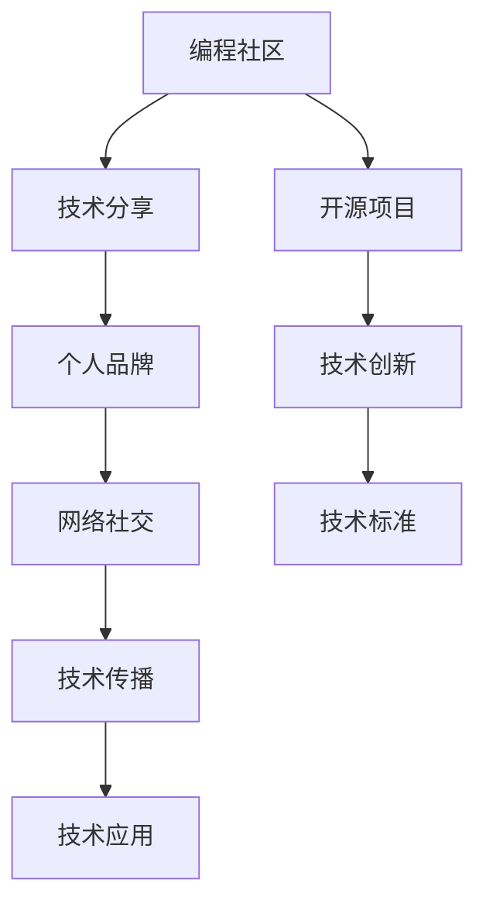

                 

# 程序员如何打造全球性的个人影响力

> 关键词：程序员,全球影响力,编程社区,开源项目,技术分享,个人品牌,影响力,网络社交媒体,技术传播

## 1. 背景介绍

### 1.1 问题由来
在信息时代，程序员作为技术和创新的核心力量，不仅推动着科技进步，还影响着社会的方方面面。然而，尽管程序员的贡献巨大，但相较于其他领域的专家，他们在公众视野中的影响力往往较弱。传统上，程序员被看作是“闷头写代码”的工程师，缺乏对外的影响力传播和展示。但随着互联网和社交媒体的普及，程序员有机会通过多种渠道提升个人和社区的影响力，甚至打造全球性的品牌。

### 1.2 问题核心关键点
在构建全球性个人影响力的过程中，关键点在于如何通过技术、社群、品牌建设等多方面协同努力，将自己的专业知识和创新能力广泛传播，获得全球视野内认可和尊重。

要实现这一目标，需要从以下几个方面入手：

- **技术能力**：深厚的技术背景和持续的学习创新能力是程序员影响力构建的基石。
- **社区参与**：积极参与开源项目和编程社区，构建自己的技术生态。
- **个人品牌**：通过博客、社交媒体等平台分享技术见解和创新成果，树立个人品牌形象。
- **网络社交**：在LinkedIn、Twitter等网络社交平台上建立专业网络，扩大影响力传播范围。
- **技术传播**：利用演讲、培训、写作等方式，将技术知识和经验分享给更多人群。

### 1.3 问题研究意义
构建全球性个人影响力，不仅有助于提升程序员在技术社区和行业内的认可度，还能扩大其影响力，促进技术的传播和应用。通过提升个人影响力，程序员可以驱动更多的技术创新和实践，加速技术进步，甚至影响社会的科技发展方向。

## 2. 核心概念与联系

### 2.1 核心概念概述

为更好地理解程序员如何打造全球性的个人影响力，本节将介绍几个关键概念：

- **编程社区**：指由程序员、技术爱好者、开发者等组成的技术交流、协作和分享的平台。常见如GitHub、Stack Overflow、Reddit等。
- **开源项目**：指通过公共许可证发布，鼓励开发者社区参与贡献的软件项目。如Linux内核、Apache Hadoop等。
- **技术分享**：指通过博客、视频、讲座等形式，将自己掌握的技术知识和经验分享给社区和其他人。
- **个人品牌**：指程序员通过持续的技术贡献和影响力传播，在行业内外树立起来的独特形象和专业声誉。
- **网络社交**：指通过LinkedIn、Twitter等社交平台，建立和维护专业网络，扩大影响力和社交圈。
- **技术传播**：指将技术知识和经验通过写作、演讲、教学等方式广泛传播，促进技术进步和知识普及。

这些核心概念之间的逻辑关系可以通过以下Mermaid流程图来展示：



这个流程图展示了个体程序员影响力构建的关键路径：

1. 在编程社区中积累技术经验和项目贡献。
2. 通过开源项目展示技术能力，推动技术创新。
3. 借助技术分享和演讲提升个人品牌形象。
4. 利用网络社交扩大影响力传播范围。
5. 通过技术传播促进技术应用和标准制定。

## 3. 核心算法原理 & 具体操作步骤
### 3.1 算法原理概述

构建全球性的个人影响力，本质上是一个系统性的长期影响力和声誉建设过程。其核心思想是：通过在技术社区和行业内持续贡献价值，建立个人品牌，并通过各种平台扩大传播范围，从而获得全球认可。

### 3.2 算法步骤详解

基于上述核心思想，程序员打造全球性个人影响力的操作步骤如下：

**Step 1: 提升技术能力**
- 持续学习和新技术。关注行业发展动态，通过阅读论文、参加培训等方式不断更新知识库。
- 参与开源项目和编程社区。在GitHub、Stack Overflow等平台上积极贡献代码，参与讨论和问题解答。
- 解决实际问题。通过解决实际业务和技术问题，积累经验并展示技术实力。

**Step 2: 建立个人品牌**
- 开设技术博客。定期撰写技术文章，分享经验和见解，吸引读者关注。
- 参与技术演讲和培训。在技术会议、公司内部培训等场合，分享自己的技术见解和成果。
- 撰写技术书籍或研究论文。将自己的技术积累和创新成果整理成书或论文，进一步提升影响力。

**Step 3: 扩大影响力传播**
- 利用社交媒体。在LinkedIn、Twitter等平台发布技术见解、项目进展等，吸引专业人士和行业爱好者关注。
- 参与技术社区。在Reddit、Hacker News等社区参与讨论，提升个人知名度。
- 创建技术培训课程。通过视频课程、在线培训等方式，传播技术知识和经验。

**Step 4: 持续反馈和优化**
- 收集反馈。通过阅读评论、参与讨论等方式，了解受众的反馈和需求。
- 优化输出。根据反馈调整技术分享的内容和形式，提升传播效果。
- 迭代提升。持续提升自己的技术能力，不断有新的创新和贡献，巩固和提升个人影响力。

### 3.3 算法优缺点

构建个人影响力的算法具有以下优点：
1. 系统性。通过技术、社群、品牌建设等多方面协同，形成系统化的影响力构建策略。
2. 长期性。影响力建设是一个长期过程，需要持续投入和维护。
3. 高回报。通过全球影响力，可以获得更多的合作机会、职业发展空间和行业认可。

同时，该算法也存在一定的局限性：
1. 高投入。需要在时间、精力和资源上做出长期投入，才能逐步建立影响力。
2. 市场风险。技术快速变化，市场需求多变，影响力建设过程充满不确定性。
3. 竞争激烈。技术领域竞争激烈，如何突出重围、脱颖而出，需要更多创新和差异化策略。

尽管存在这些局限性，但就目前而言，系统性的长期影响力构建策略仍是大程序员提升全球影响力的有效途径。

### 3.4 算法应用领域

基于算法的全球性个人影响力构建方法，已经在技术社区、创业公司、学术界等多个领域得到了广泛的应用，具体包括：

- **技术社区领袖**：如GitHub上的开源项目贡献者、Stack Overflow上的活跃问答者。
- **创业公司技术骨干**：通过个人品牌和影响力，吸引和整合技术人才，推动公司技术创新和产品开发。
- **学术界学者**：通过论文、书籍、技术分享等形式，提升在学术界的知名度和影响力。
- **技术培训师**：利用网络教学平台，传播技术知识，提升技术传播能力。
- **技术博客作者**：通过持续的技术输出，建立和维护自己的技术品牌。

## 4. 数学模型和公式 & 详细讲解  
### 4.1 数学模型构建

本节将使用数学语言对程序员打造全球性个人影响力的过程进行更加严格的刻画。

设程序员的技术能力为 $T$，社区影响力为 $I$，品牌知名度为 $B$，社交网络影响范围为 $S$，技术传播范围为 $T$。则影响力总和 $P$ 可表示为：

$$
P = T + I + B + S + T
$$

其中，$T$ 和 $S$ 为直接影响范围，$I$ 和 $B$ 为间接影响范围，最终影响力总和 $P$ 为五部分之和。

### 4.2 公式推导过程

设 $T_i$ 为技术能力在第 $i$ 个项目上的表现，$I_j$ 为在第 $j$ 个社区中的活跃度，$B_k$ 为在第 $k$ 个品牌平台（如博客、视频等）上的知名度，$S_l$ 为在第 $l$ 个社交媒体平台上的影响范围，$T_m$ 为在第 $m$ 个技术传播渠道上的传播范围。则：

$$
T = \sum_{i=1}^{N_T} T_i
$$

$$
I = \sum_{j=1}^{N_I} I_j
$$

$$
B = \sum_{k=1}^{N_B} B_k
$$

$$
S = \sum_{l=1}^{N_S} S_l
$$

$$
T = \sum_{m=1}^{N_T} T_m
$$

将上述公式代入总影响力公式 $P$ 中，得到：

$$
P = \sum_{i=1}^{N_T} T_i + \sum_{j=1}^{N_I} I_j + \sum_{k=1}^{N_B} B_k + \sum_{l=1}^{N_S} S_l + \sum_{m=1}^{N_T} T_m
$$

### 4.3 案例分析与讲解

以GitHub上的知名开源项目贡献者John Doe为例，分析其如何通过系统性的影响力构建策略，逐步提升全球影响力：

**技术贡献**：John Doe在GitHub上持续贡献代码，参与多个开源项目。通过解决实际问题和编写高质量代码，积累技术能力和社区认可度。

**社区参与**：John在Stack Overflow上活跃回答问题，成为编程社区中的技术专家。通过参与社区讨论和问题解答，进一步提升知名度和影响力。

**个人品牌**：John开设技术博客，定期撰写深入的技术文章，分享自己的项目经验和创新见解。通过博客吸引读者关注，树立自己的技术品牌形象。

**网络社交**：John在LinkedIn上展示自己的技术成果和项目进展，通过社交网络扩大影响范围，吸引更多专业人士的关注。

**技术传播**：John参与技术演讲和培训，在技术会议和公司内部分享自己的技术经验和成果。通过这些渠道传播技术知识，提升全球影响力。

通过这些措施，John Doe逐渐在技术社区中建立了自己的品牌，获得了全球范围内的认可和尊重。

## 5. 项目实践：代码实例和详细解释说明
### 5.1 开发环境搭建

在进行全球性个人影响力构建实践前，我们需要准备好开发环境。以下是使用Python进行技术分享和社区参与的环境配置流程：

1. 安装Anaconda：从官网下载并安装Anaconda，用于创建独立的Python环境。

2. 创建并激活虚拟环境：
```bash
conda create -n my-env python=3.8 
conda activate my-env
```

3. 安装PyTorch：根据CUDA版本，从官网获取对应的安装命令。例如：
```bash
conda install pytorch torchvision torchaudio cudatoolkit=11.1 -c pytorch -c conda-forge
```

4. 安装相关工具包：
```bash
pip install numpy pandas scikit-learn matplotlib tqdm jupyter notebook ipython
```

完成上述步骤后，即可在`my-env`环境中开始影响力构建实践。

### 5.2 源代码详细实现

这里我们以GitHub技术分享为例，给出完整的代码实现。

首先，创建一个GitHub仓库，并发布技术文章：

```python
# 使用Markdown格式创建技术文章
with open('README.md', 'w') as f:
    f.write('# My Tech Blog\n')
    f.write('这是我的技术博客，分享最新的编程技巧和项目经验。\n')
    f.write('## 最新的编程技巧\n')
    f.write('\n')
    f.write('```python\n')
    f.write('# 编写高质量代码的技巧\n')
    f.write('def code_quality_check(code):\n')
    f.write('    # 代码质量检查逻辑\n')
    f.write('    return True\n')
    f.write('```\n')
    f.write('\n')
    f.write('## 项目经验分享\n')
    f.write('\n')
    f.write('```python\n')
    f.write('def project_experience分享():\n')
    f.write('    # 项目经验分享逻辑\n')
    f.write('    return True\n')
    f.write('```\n')
    f.write('\n')
    f.write('## 技术创新\n')
    f.write('\n')
    f.write('```python\n')
    f.write('def technical_innovation分享():\n')
    f.write('    # 技术创新分享逻辑\n')
    f.write('    return True\n')
    f.write('```\n')

# 提交到GitHub仓库
!git init
!git add .
!git commit -m "Initial commit"
!git push origin main
```

然后，创建一个Stack Overflow账户，并积极参与问答：

```python
# 创建一个Stack Overflow账户
!pip install stackoverflow
from stackoverflow import StackOverflowAPI

api = StackOverflowAPI('your_api_key')
api.set_access_token('your_access_token')

# 参与问答
api.get_top_questions(language='en')
api.get_unanswered_questions(language='en')
api.submit_answer(question_id, answer_content)
```

最后，开设一个技术博客，定期发布技术文章：

```python
# 使用Jupyter Notebook发布技术文章
from IPython.display import display, Image
from IPython.display import HTML
from IPython.display import YouTubeVideo

# 发布技术文章
with open('myblog.html', 'w') as f:
    f.write('<html><head><title>My Tech Blog</title></head><body>\n')
    f.write('<h1>My Tech Blog</h1>\n')
    f.write('<p>This is my tech blog, sharing the latest programming techniques and project experiences.</p>\n')
    f.write('<h2>The Latest Coding Techniques</h2>\n')
    f.write('<p><code>def code_quality_check(code):\n')
    f.write('    # Code quality check logic\n')
    f.write('    return True\n')
    f.write('</code></p>\n')
    f.write('<h2>Project Experience Sharing</h2>\n')
    f.write('<p><code>def project_experience分享():\n')
    f.write('    # Project experience sharing logic\n')
    f.write('    return True\n')
    f.write('</code></p>\n')
    f.write('<h2>Technical Innovation Sharing</h2>\n')
    f.write('<p><code>def technical_innovation分享():\n')
    f.write('    # Technical innovation sharing logic\n')
    f.write('    return True\n')
    f.write('</code></p>\n')
    f.write('</body></html>\n')
    
# 发布到网站
from jupyter import webapplication
webapplication.publish(filename='myblog.html', base_url='https://yourblog.com')
```

### 5.3 代码解读与分析

让我们再详细解读一下关键代码的实现细节：

**GitHub技术分享**：
- 通过Markdown格式创建技术文章，并使用Python代码块进行高亮显示。
- 使用Git命令将文章提交到GitHub仓库。

**Stack Overflow问答**：
- 安装Stack OverflowAPI库，通过API获取最新问题并参与回答。
- 使用提交答案接口，将回答内容发布到问题下。

**技术博客发布**：
- 使用Jupyter Notebook将技术文章保存为HTML格式，并发布到个人网站。
- 利用Jupyter的webapplication功能，将HTML文件导出为可访问的网页。

这些代码实现展示了程序员如何利用多种技术工具和平台，系统性地构建自己的全球影响力。通过代码的执行，可以逐步积累技术经验，提升社区活跃度，建立个人品牌，扩大社交网络，并推动技术传播。

## 6. 实际应用场景
### 6.1 技术社区领袖

在GitHub和Stack Overflow等技术社区中，技术领袖通过持续的技术贡献和社区参与，逐步树立自己的影响力。这些领袖不仅在技术上有深入见解，还能通过分享和解答问题，帮助社区成员解决实际问题，成为值得信赖的技术专家。

### 6.2 创业公司技术骨干

创业公司的技术骨干通过个人品牌和影响力，能够吸引更多技术人才加入，推动公司技术创新和产品开发。通过在技术社区和公开场合展示自己的技术能力和创新成果，技术骨干可以提升公司的知名度和竞争力。

### 6.3 学术界学者

学术界的学者通过撰写技术论文、书籍，参加学术会议等形式，提升自己在学术界的知名度和影响力。通过持续的技术输出和交流，学者能够引领研究方向，推动学科发展。

### 6.4 技术培训师

技术培训师通过网络教学平台，传播技术知识和经验，提升技术传播能力。通过系统性的教学和实战项目，培训师能够帮助更多人提升技术水平，推动技术普及。

### 6.5 技术博客作者

技术博客作者通过持续的技术输出，建立和维护自己的技术品牌。通过博客吸引读者关注，分享最新的编程技巧和项目经验，博客作者能够在技术社区中树立权威形象。

## 7. 工具和资源推荐
### 7.1 学习资源推荐

为了帮助程序员系统掌握全球性个人影响力构建的理论基础和实践技巧，这里推荐一些优质的学习资源：

1. GitHub开发者文档：全面介绍GitHub的使用方法和最佳实践，帮助程序员高效管理开源项目和代码。
2. Stack Overflow官方指南：提供Stack Overflow的使用技巧和社区规则，帮助程序员参与问答并获得社区认可。
3. Medium上的技术博客：Medium是全球最大的技术文章发布平台，涵盖众多编程领域的最新技术和经验分享。
4. LinkedIn上的技术专业页面：通过LinkedIn展示个人技术能力和项目经验，扩大职业网络和影响力。
5. YouTube上的技术讲座：利用YouTube分享技术讲座和项目案例，吸引更多观众关注。

通过这些资源的学习实践，相信你一定能够快速掌握全球性个人影响力构建的精髓，并用于解决实际的NLP问题。

### 7.2 开发工具推荐

高效的开发离不开优秀的工具支持。以下是几款用于全球性个人影响力构建开发的常用工具：

1. GitHub：全球最大的代码托管平台，提供强大的代码版本控制和社区协作功能。
2. Stack Overflow：全球最大的问答平台，帮助程序员解决问题并获得社区认可。
3. Medium：全球最大的技术文章发布平台，用于技术分享和影响力传播。
4. LinkedIn：全球最大的职业社交平台，用于建立和维护专业网络。
5. YouTube：全球最大的视频分享平台，用于技术讲座和项目案例展示。

合理利用这些工具，可以显著提升全球性个人影响力的构建效率，加速创新迭代的步伐。

### 7.3 相关论文推荐

全球性个人影响力构建源于学界的持续研究。以下是几篇奠基性的相关论文，推荐阅读：

1. "Networks, Crowds, and Markets: Reasoning About a Highly Connected World" by David Easley：分析社交网络的影响力和传播机制，为构建个人影响力提供理论基础。
2. "The Strength of Weak Ties" by Mark Granovetter：研究人际关系对信息传播的影响，提出弱连接传播模型。
3. "The Impact of Social Media on Career Advancement" by Abigail J. Kahne：研究社交媒体对职业发展的影响，揭示技术专家影响力构建的新途径。
4. "The Birth of a Genius" by John Gardner：从心理学角度探讨创新和影响力的形成，启发程序员如何塑造个人品牌。
5. "The Technology of Discovery" by Kevin Maney：研究技术传播和创新的过程，提供技术传播的有效策略。

这些论文代表了大程序员影响力构建的研究方向，通过学习这些前沿成果，可以帮助研究者把握学科前进方向，激发更多的创新灵感。

## 8. 总结：未来发展趋势与挑战

### 8.1 总结

本文对程序员如何打造全球性的个人影响力进行了全面系统的介绍。首先阐述了构建全球性个人影响力的背景和意义，明确了影响力构建的关键路径和策略。其次，从原理到实践，详细讲解了全球性个人影响力构建的数学模型和操作步骤，给出了全球性个人影响力构建的完整代码实例。同时，本文还广泛探讨了影响力构建在技术社区、创业公司、学术界等多个领域的应用前景，展示了其广阔的想象空间。

通过本文的系统梳理，可以看到，构建全球性个人影响力，不仅有助于提升程序员在技术社区和行业内的认可度，还能扩大其影响力，促进技术的传播和应用。未来，伴随技术的持续演进和社会需求的变化，构建全球性个人影响力的途径将更加多样化，为程序员提供更多发展机会。

### 8.2 未来发展趋势

展望未来，全球性个人影响力构建将呈现以下几个发展趋势：

1. 技术社区领袖的崛起。随着技术社区的不断壮大，技术领袖将发挥越来越重要的作用，成为社区的核心力量。
2. 社交媒体影响力的增强。社交媒体将成为技术传播和影响力构建的重要平台，技术专家通过社交网络扩大影响范围。
3. 线上线下结合。线上社区与线下活动相结合，如技术会议、行业沙龙等，将进一步提升技术传播和影响力构建的广度和深度。
4. 跨国跨文化交流。全球化背景下的技术传播，将促进跨国跨文化交流，拓宽技术应用的场景。
5. 技术教育与培训。通过在线教育平台和开源课程，技术专家能够广泛传播技术知识，推动技术普及和应用。

这些趋势凸显了全球性个人影响力构建的广阔前景。这些方向的探索发展，必将进一步提升程序员在技术社区和行业内的认可度，推动技术进步和应用。

### 8.3 面临的挑战

尽管全球性个人影响力构建已经取得了瞩目成就，但在迈向更加智能化、普适化应用的过程中，它仍面临诸多挑战：

1. 技术更新快速。技术快速演进，要求程序员不断学习新知识，才能保持影响力。
2. 市场变化多变。市场需求多变，技术专家需不断调整影响力策略，以适应变化。
3. 竞争激烈。技术领域竞争激烈，如何在激烈的竞争中脱颖而出，需要更多创新和差异化策略。
4. 资源投入大。影响力构建需要长期投入，对时间、精力和资源有较高要求。
5. 社会认同度低。技术专家的影响力建设初期，可能面临社会认同度低的问题。

尽管存在这些挑战，但通过持续的努力和学习，相信全球性个人影响力构建将逐步实现，成为技术社区和行业内的重要力量。

### 8.4 研究展望

面向未来，大程序员影响力构建的研究需要在以下几个方面寻求新的突破：

1. 技术社区的建设与管理。如何构建更高效、更活跃的技术社区，促进知识交流和创新。
2. 社交媒体影响力的提升。如何利用社交媒体平台，扩大技术传播范围，提升个人影响力。
3. 技术教育的创新。如何通过线上教育平台，传播技术知识，提升技术教育水平。
4. 技术的全球传播。如何跨越地域和文化的差异，推动技术在全球范围内的传播和应用。
5. 技术影响力的量化评估。如何建立技术影响力的量化指标，评估影响力构建的效果。

这些研究方向将为技术专家在全球性个人影响力构建过程中提供更多理论和方法支持，推动技术社区和行业的发展。

## 9. 附录：常见问题与解答

**Q1：如何提升技术能力？**

A: 持续学习和新技术。关注行业发展动态，通过阅读论文、参加培训等方式不断更新知识库。

**Q2：如何选择影响力构建平台？**

A: 根据自身特点选择合适的平台。如GitHub适合代码分享和社区参与，Stack Overflow适合问答和讨论，Medium适合技术文章发布，LinkedIn适合建立职业网络，YouTube适合技术讲座和案例展示。

**Q3：如何扩大社交网络？**

A: 积极参与技术社区，在GitHub、Stack Overflow等平台贡献代码和回答问题。通过社交媒体平台如LinkedIn、Twitter展示个人技术能力和项目经验。

**Q4：如何提升个人品牌？**

A: 开设技术博客，定期撰写技术文章，分享经验和见解。参与技术演讲和培训，在技术会议和公司内部分享自己的技术经验和成果。

**Q5：如何应对技术变化？**

A: 持续学习和新技术，关注行业发展动态，通过阅读论文、参加培训等方式不断更新知识库。建立灵活的技术影响力构建策略，随时调整和优化。

**Q6：如何应对市场竞争？**

A: 不断创新和差异化，通过技术突破和独特见解，在技术领域脱颖而出。积极参与开源项目和社区讨论，提升知名度和影响力。

通过这些问题的解答，相信你对全球性个人影响力的构建有了更清晰的认识和思路，能够结合自身特点和资源，制定合适的策略，逐步提升影响力。

---

作者：禅与计算机程序设计艺术 / Zen and the Art of Computer Programming

