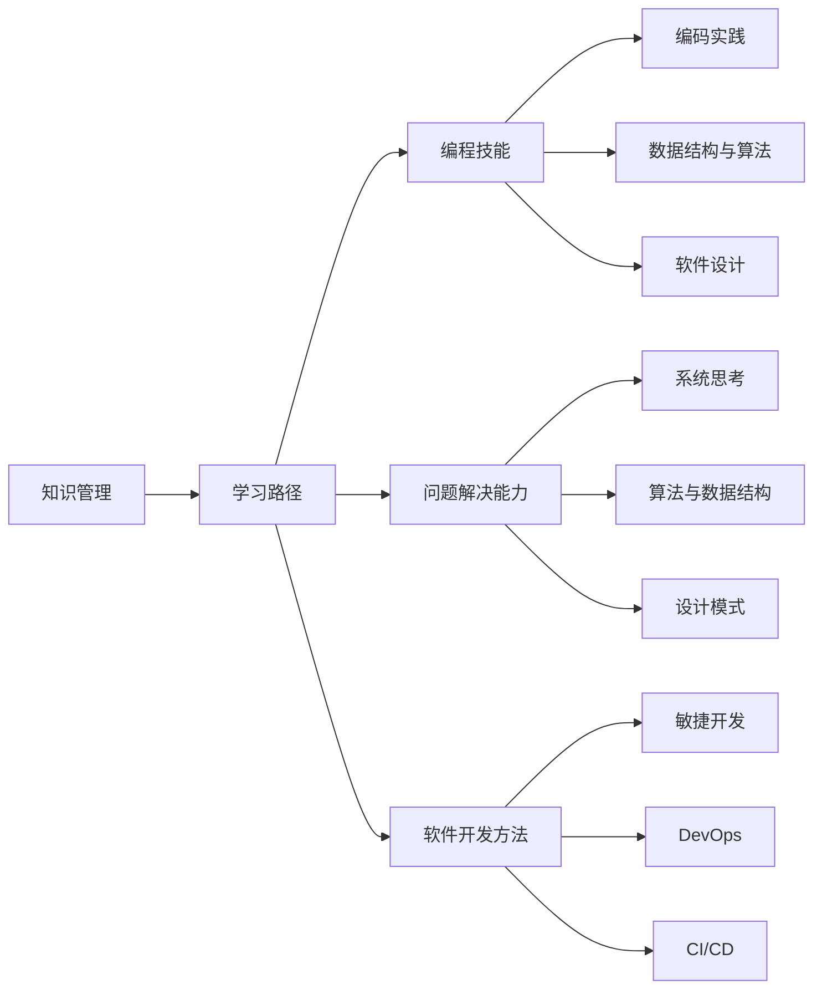

                 

# 程序员如何构建个人知识体系

> 关键词：知识管理, 学习路径, 编程技能, 问题解决能力, 软件开发方法

## 1. 背景介绍

### 1.1 问题由来

随着信息技术的发展，程序员面临的职业环境越来越复杂。知识更新迭代速度加快，新技术、新工具层出不穷。如何在海量信息中提炼出关键的知识，并将其整合为自身的能力，成为每位程序员必须面对的挑战。

### 1.2 问题核心关键点

知识体系的构建，不是简单的知识点的累积，而是一个系统化、结构化的学习过程。它要求程序员不仅要掌握扎实的技术基础，还需要有良好的问题解决能力、逻辑思维能力、项目管理能力等软技能。核心关键点包括：

- 识别知识盲点：识别并填补自身知识体系中的空白。
- 构建知识架构：将零散的知识串联成有逻辑的结构。
- 实践与反思：通过实践不断验证和完善知识体系，通过反思总结提升自我认知。
- 终身学习：知识体系不是一成不变的，需要持续学习、更新迭代。

## 2. 核心概念与联系

### 2.1 核心概念概述

- **知识管理(Knowledge Management)**：通过科学的方法管理和组织知识，使知识能够被高效利用和传播。
- **学习路径(Learning Path)**：根据个人的职业目标和发展阶段，规划合理的学习计划和路径。
- **编程技能(Programming Skills)**：基础的编码技能、数据结构与算法、软件设计等。
- **问题解决能力(Problem Solving)**：通过系统化的方法和技术，找出问题的本质，并设计解决方案。
- **软件开发方法(Software Development Methodology)**：敏捷开发、DevOps、持续集成(CI)、持续部署(CD)等方法论。

通过这些概念的相互结合，构建一个全面的个人知识体系。

### 2.2 核心概念原理和架构的 Mermaid 流程图



这个流程图展示了核心概念之间的联系：知识管理是构建学习路径的基础，学习路径涵盖了编程技能、问题解决能力和软件开发方法等多个方面。编程技能包括编码实践、数据结构与算法、软件设计等，问题解决能力涉及系统思考、算法与数据结构、设计模式等，而软件开发方法则包括敏捷开发、DevOps、CI/CD等。

## 3. 核心算法原理 & 具体操作步骤

### 3.1 算法原理概述

构建个人知识体系的过程，本质上是一个迭代优化、自我提升的过程。其核心算法包括：

- **目标设定**：明确知识体系的目标，设定合理的短期和长期目标。
- **资源规划**：评估自身资源（时间、精力、资金等），选择合适的学习资源。
- **路径规划**：根据目标和资源，设计一条合理的学习路径。
- **执行与反馈**：按照学习路径执行，并根据执行情况进行反馈和调整。
- **迭代优化**：持续评估学习效果，不断优化学习路径和策略。

### 3.2 算法步骤详解

**Step 1: 目标设定**

- 确定职业目标：如晋升、转行、技术领先等。
- 分析知识需求：识别实现职业目标所需的知识和技能。
- 设定具体目标：如掌握某项技术、完成某个项目等。

**Step 2: 资源规划**

- 评估时间资源：每日可用时间、周工作时间等。
- 评估学习资源：书籍、课程、网络资源、导师等。
- 评估经济资源：购买书籍、参加培训、购买软件等。

**Step 3: 路径规划**

- 梳理知识体系：从编程基础、算法与数据结构、软件开发方法等梳理知识结构。
- 制定学习计划：根据目标和资源，规划学习路径和时间节点。
- 选择学习资源：选择适合的教材、课程、工具等资源。

**Step 4: 执行与反馈**

- 按照计划执行：遵循学习路径，按计划学习。
- 记录学习进展：通过笔记、日志、项目等方式记录学习过程。
- 定期评估效果：通过测试、项目实践等方式评估学习效果。

**Step 5: 迭代优化**

- 总结经验教训：根据评估结果，总结经验教训。
- 调整学习路径：根据评估结果，调整学习路径和策略。
- 持续学习提升：保持持续学习的习惯，不断优化知识体系。

### 3.3 算法优缺点

构建个人知识体系的算法具有以下优点：

- 系统化：通过目标设定、路径规划、执行反馈等步骤，构建系统化的知识体系。
- 可操作性强：步骤清晰，可操作性强，适合自我管理。
- 灵活性高：根据实际情况，灵活调整学习路径和策略。

同时，也存在一些缺点：

- 对自驱力要求高：需要较强的自我管理能力，容易受到外界干扰。
- 时间成本高：需要投入大量时间进行规划和执行。
- 适应性有限：对于特定领域或技术栈的适应性可能有限。

### 3.4 算法应用领域

构建个人知识体系的算法不仅适用于程序员，也可以应用于其他专业人士。在软件开发、系统架构、项目管理、人工智能等领域都有广泛应用。

- **软件开发**：掌握编程技能、设计模式、软件开发方法等。
- **系统架构**：学习架构设计、系统分析、技术选型等。
- **项目管理**：掌握项目管理、敏捷开发、DevOps等方法。
- **人工智能**：学习机器学习、深度学习、自然语言处理等技术。

## 4. 数学模型和公式 & 详细讲解 & 举例说明

### 4.1 数学模型构建

构建个人知识体系的数学模型可以表示为：

$$
K_{\text{total}} = K_{\text{base}} + \sum_{i=1}^{n} K_{i}
$$

其中：
- $K_{\text{total}}$ 为个人知识体系。
- $K_{\text{base}}$ 为编程基础、数据结构与算法等基础知识。
- $K_i$ 为第 $i$ 个领域的专业知识，如软件开发方法、问题解决能力等。

### 4.2 公式推导过程

- **目标设定**：
  - 明确职业目标 $T$，如：
    $$
    T = \text{技术领先}
    $$
  - 识别知识需求 $D$，如：
    $$
    D = \{\text{算法与数据结构}, \text{软件开发方法}\}
    $$
  - 设定具体目标 $G_i$，如：
    $$
    G_1 = \text{掌握某项技术}
    $$

- **资源规划**：
  - 评估时间资源 $T_{\text{time}}$，如：
    $$
    T_{\text{time}} = \sum_{i=1}^{N} t_i
    $$
  - 评估学习资源 $R$，如：
    $$
    R = \{\text{书籍}, \text{在线课程}, \text{导师}\}
    $$

- **路径规划**：
  - 梳理知识体系 $K_{\text{base}}$，如：
    $$
    K_{\text{base}} = \{\text{编程语言}, \text{数据结构}, \text{算法}\}
    $$
  - 制定学习计划 $P$，如：
    $$
    P = \{\text{学习周期}, \text{学习阶段}, \text{学习资源}\}
    $$

- **执行与反馈**：
  - 执行学习计划 $E$，如：
    $$
    E = \{\text{学习任务}, \text{执行时间}\}
    $$
  - 记录学习进展 $R$，如：
    $$
    R = \{\text{笔记}, \text{日志}, \text{项目}\}
    $$

- **迭代优化**：
  - 总结经验教训 $S$，如：
    $$
    S = \{\text{成功经验}, \text{失败教训}\}
  $$
  - 调整学习路径 $P'$，如：
    $$
    P' = P - S + \text{新资源}
    $$

### 4.3 案例分析与讲解

**案例：成为一名高级前端开发工程师**

- **目标设定**：
  - 职业目标：成为一名高级前端开发工程师。
  - 知识需求：掌握React、Vue、Node.js等技术。
  - 具体目标：
    - 掌握React框架
    - 掌握Vue框架
    - 掌握Node.js后端开发

- **资源规划**：
  - 时间资源：每日可用时间4小时，每周40小时。
  - 学习资源：
    - 书籍：《React官方文档》、《Vue官方文档》、《Node.js实战》
    - 在线课程：Coursera上的React课程、Vue课程、Node.js课程
    - 项目实践：GitHub上的开源项目

- **路径规划**：
  - 知识体系：
    - 编程基础：HTML、CSS、JavaScript
    - React框架
    - Vue框架
    - Node.js后端开发
  - 学习计划：
    - 阶段1：基础阶段，学习HTML、CSS、JavaScript
    - 阶段2：React阶段，学习React框架
    - 阶段3：Vue阶段，学习Vue框架
    - 阶段4：Node.js阶段，学习Node.js后端开发

- **执行与反馈**：
  - 执行学习计划：
    - 阶段1：每周4小时学习基础，共4周
    - 阶段2：每周8小时学习React，共6周
    - 阶段3：每周8小时学习Vue，共6周
    - 阶段4：每周8小时学习Node.js，共8周
  - 记录学习进展：
    - 笔记：每周记录学习笔记，总结重点知识
    - 日志：每日记录学习日志，记录学习感受和问题
    - 项目：参与GitHub上的开源项目，实践所学技术

- **迭代优化**：
  - 总结经验教训：
    - 成功经验：每周总结笔记和日志，分享学习心得
    - 失败教训：分析代码中的错误，总结问题所在
  - 调整学习路径：
    - 添加新的资源：增加新的书籍和课程
    - 优化学习计划：根据学习进展调整每周学习时间

## 5. 项目实践：代码实例和详细解释说明

### 5.1 开发环境搭建

为了更好地进行知识体系的构建，我们需要使用一些开发工具和资源。以下是常用的工具和资源：

1. **GitHub**：一个代码托管平台，可以存储和管理个人代码库。
2. **Jupyter Notebook**：一个交互式编程环境，适合记录和分享学习笔记。
3. **Google Scholar**：一个学术搜索引擎，可以查找相关的学术论文和技术文档。

### 5.2 源代码详细实现

**代码实例：记录学习笔记**

```python
# 导入必要的库
import os
import pandas as pd

# 初始化笔记目录
notes_dir = 'notes'
if not os.path.exists(notes_dir):
    os.makedirs(notes_dir)

# 记录笔记
def record_note(title, content):
    note_file = os.path.join(notes_dir, f'{title}.md')
    with open(note_file, 'w') as f:
        f.write('# ' + title + '\n\n' + content)

# 记录日志
def record_log(date, content):
    log_file = os.path.join(notes_dir, f'{date}.log')
    with open(log_file, 'a') as f:
        f.write(f'{date}: {content}\n')

# 示例
record_note('React学习笔记', '今天学习了React组件的生命周期函数，理解了组件的状态管理')
record_log('2023-03-01', '今天学习了React组件的生命周期函数，理解了组件的状态管理')
```

**代码解读与分析**：

- **代码结构**：代码包含三个函数，分别用于记录笔记和日志。其中，`record_note`用于记录详细的笔记内容，`record_log`用于记录日常学习日志。
- **实现细节**：
  - `record_note`函数接受两个参数：`title`和`content`，分别表示笔记的标题和内容。函数将笔记内容写入以日期为名的markdown文件。
  - `record_log`函数接受两个参数：`date`和`content`，分别表示日志的日期和内容。函数将日志内容写入以日期为名的文本文件。
- **示例**：在示例中，使用`record_note`记录了React学习笔记，使用`record_log`记录了学习日志。

### 5.3 运行结果展示

运行上述代码后，我们可以在`notes`目录下生成一系列的笔记文件和日志文件。例如，记录的笔记文件可能包括`React学习笔记.md`、`Vue学习笔记.md`等，日志文件可能包括`2023-03-01.log`、`2023-03-02.log`等。这些文件可以方便地用于回顾和总结学习进度。

## 6. 实际应用场景

### 6.1 软件开发

构建个人知识体系在软件开发中的应用，主要体现在以下几个方面：

- **项目规划**：通过构建知识体系，合理规划项目需求和任务，提高项目管理和开发效率。
- **技术选型**：基于知识体系，选择适合项目的技术栈和工具，提升技术实现的可行性。
- **代码审查**：通过知识体系指导代码审查，提高代码质量和技术水平。

**案例：开发一个电商平台**

- **目标设定**：
  - 职业目标：成为资深前端开发工程师。
  - 知识需求：掌握React、Node.js、MongoDB等技术。
  - 具体目标：
    - 掌握React框架
    - 掌握Node.js后端开发
    - 掌握MongoDB数据库

- **资源规划**：
  - 时间资源：每日可用时间4小时，每周40小时。
  - 学习资源：
    - 书籍：《React官方文档》、《Node.js实战》、《MongoDB实战》
    - 在线课程：Coursera上的React课程、Node.js课程、MongoDB课程
    - 项目实践：GitHub上的开源项目

- **路径规划**：
  - 知识体系：
    - 编程基础：HTML、CSS、JavaScript
    - React框架
    - Node.js后端开发
    - MongoDB数据库
  - 学习计划：
    - 阶段1：基础阶段，学习HTML、CSS、JavaScript
    - 阶段2：React阶段，学习React框架
    - 阶段3：Node.js阶段，学习Node.js后端开发
    - 阶段4：MongoDB阶段，学习MongoDB数据库

- **执行与反馈**：
  - 执行学习计划：
    - 阶段1：每周4小时学习基础，共4周
    - 阶段2：每周8小时学习React，共6周
    - 阶段3：每周8小时学习Node.js后端开发，共6周
    - 阶段4：每周8小时学习MongoDB，共6周
  - 记录学习进展：
    - 笔记：每周记录学习笔记，总结重点知识
    - 日志：每日记录学习日志，记录学习感受和问题
    - 项目：参与GitHub上的开源项目，实践所学技术

- **迭代优化**：
  - 总结经验教训：
    - 成功经验：每周总结笔记和日志，分享学习心得
    - 失败教训：分析代码中的错误，总结问题所在
  - 调整学习路径：
    - 添加新的资源：增加新的书籍和课程
    - 优化学习计划：根据学习进展调整每周学习时间

### 6.2 系统架构

构建个人知识体系在系统架构中的应用，主要体现在以下几个方面：

- **架构设计**：通过构建知识体系，掌握系统架构设计的核心原则和最佳实践。
- **技术选型**：基于知识体系，选择合适的架构和技术方案，提升系统性能和可靠性。
- **问题解决**：通过构建知识体系，提升问题分析和解决能力，优化系统设计。

**案例：设计一个分布式系统**

- **目标设定**：
  - 职业目标：成为资深系统架构师。
  - 知识需求：掌握微服务、Docker、Kubernetes等技术。
  - 具体目标：
    - 掌握微服务架构
    - 掌握Docker容器化
    - 掌握Kubernetes集群管理

- **资源规划**：
  - 时间资源：每日可用时间4小时，每周40小时。
  - 学习资源：
    - 书籍：《微服务设计》、《Docker实战》、《Kubernetes实战》
    - 在线课程：Coursera上的微服务课程、Docker课程、Kubernetes课程
    - 项目实践：GitHub上的开源项目

- **路径规划**：
  - 知识体系：
    - 架构设计：分布式系统、微服务架构
    - 技术选型：Docker容器化、Kubernetes集群管理
    - 问题解决：系统设计、性能优化
  - 学习计划：
    - 阶段1：基础阶段，学习架构设计
    - 阶段2：微服务阶段，学习微服务架构
    - 阶段3：Docker阶段，学习Docker容器化
    - 阶段4：Kubernetes阶段，学习Kubernetes集群管理

- **执行与反馈**：
  - 执行学习计划：
    - 阶段1：每周4小时学习基础，共4周
    - 阶段2：每周8小时学习微服务架构，共6周
    - 阶段3：每周8小时学习Docker容器化，共6周
    - 阶段4：每周8小时学习Kubernetes，共6周
  - 记录学习进展：
    - 笔记：每周记录学习笔记，总结重点知识
    - 日志：每日记录学习日志，记录学习感受和问题
    - 项目：参与GitHub上的开源项目，实践所学技术

- **迭代优化**：
  - 总结经验教训：
    - 成功经验：每周总结笔记和日志，分享学习心得
    - 失败教训：分析代码中的错误，总结问题所在
  - 调整学习路径：
    - 添加新的资源：增加新的书籍和课程
    - 优化学习计划：根据学习进展调整每周学习时间

### 6.3 项目管理

构建个人知识体系在项目管理中的应用，主要体现在以下几个方面：

- **项目管理**：通过构建知识体系，掌握项目管理的基本理论和实践方法。
- **团队协作**：基于知识体系，提高团队成员的协作能力和沟通效率。
- **问题解决**：通过构建知识体系，提升项目管理和问题解决能力。

**案例：管理一个跨部门项目**

- **目标设定**：
  - 职业目标：成为资深项目经理。
  - 知识需求：掌握敏捷开发、DevOps、持续集成(CI)、持续部署(CD)等技术。
  - 具体目标：
    - 掌握敏捷开发
    - 掌握DevOps
    - 掌握CI/CD

- **资源规划**：
  - 时间资源：每日可用时间4小时，每周40小时。
  - 学习资源：
    - 书籍：《敏捷开发》、《DevOps实践指南》、《CI/CD实战》
    - 在线课程：Coursera上的敏捷开发课程、DevOps课程、CI/CD课程
    - 项目实践：GitHub上的开源项目

- **路径规划**：
  - 知识体系：
    - 项目管理：敏捷开发、DevOps
    - 团队协作：沟通技巧、协作工具
    - 问题解决：问题分析和解决
  - 学习计划：
    - 阶段1：基础阶段，学习项目管理
    - 阶段2：敏捷开发阶段，学习敏捷开发
    - 阶段3：DevOps阶段，学习DevOps
    - 阶段4：CI/CD阶段，学习CI/CD

- **执行与反馈**：
  - 执行学习计划：
    - 阶段1：每周4小时学习基础，共4周
    - 阶段2：每周8小时学习敏捷开发，共6周
    - 阶段3：每周8小时学习DevOps，共6周
    - 阶段4：每周8小时学习CI/CD，共6周
  - 记录学习进展：
    - 笔记：每周记录学习笔记，总结重点知识
    - 日志：每日记录学习日志，记录学习感受和问题
    - 项目：参与GitHub上的开源项目，实践所学技术

- **迭代优化**：
  - 总结经验教训：
    - 成功经验：每周总结笔记和日志，分享学习心得
    - 失败教训：分析项目中的问题，总结经验
  - 调整学习路径：
    - 添加新的资源：增加新的书籍和课程
    - 优化学习计划：根据学习进展调整每周学习时间

## 7. 工具和资源推荐

### 7.1 学习资源推荐

为了帮助开发者系统掌握构建个人知识体系的理论基础和实践技巧，这里推荐一些优质的学习资源：

1. **《知识管理与组织》**：一本系统介绍知识管理理论和实践的书籍，适合深入学习。
2. **Coursera上的《编程与软件基础》**：一个在线学习平台，提供各种编程语言和技术的学习课程。
3. **Udacity上的《软件工程基础》**：一个在线学习平台，提供软件开发和系统设计的学习课程。
4. **Google Scholar**：一个学术搜索引擎，可以查找相关的学术论文和技术文档。
5. **Stack Overflow**：一个程序员问答社区，可以查找编程相关的问题和解决方案。

### 7.2 开发工具推荐

构建个人知识体系的实践离不开良好的工具支持。以下是几款用于知识体系构建的常用工具：

1. **GitHub**：一个代码托管平台，可以存储和管理个人代码库。
2. **Jupyter Notebook**：一个交互式编程环境，适合记录和分享学习笔记。
3. **Google Scholar**：一个学术搜索引擎，可以查找相关的学术论文和技术文档。
4. **Anki**：一款基于间隔重复算法的记忆软件，适合学习和复习知识点。
5. **Trello**：一款项目管理工具，可以规划和跟踪学习计划。

### 7.3 相关论文推荐

构建个人知识体系的研究源于学界的持续研究。以下是几篇奠基性的相关论文，推荐阅读：

1. **《知识管理：从理论上分析知识的整合、获取和应用》**：探讨了知识管理的理论基础和实践方法。
2. **《构建个人知识体系：一种基于认知心理学的方法》**：研究了个人知识体系构建的心理过程和方法。
3. **《敏捷开发：个人和团队的实践指南》**：介绍了敏捷开发的基本理论和实践方法。
4. **《DevOps实践指南：持续集成和持续部署》**：介绍了DevOps的基本理论和实践方法。
5. **《持续学习的理论基础和方法》**：研究了持续学习的理论基础和方法。

## 8. 总结：未来发展趋势与挑战

### 8.1 总结

本文对构建个人知识体系的流程和方法进行了系统介绍。通过明确目标、合理规划、持续执行和迭代优化，可以帮助程序员构建全面、系统、实用的个人知识体系。知识体系的构建不仅是技术层面的积累，更是心理层面的自我管理与提升。

### 8.2 未来发展趋势

构建个人知识体系的趋势如下：

- **技术化**：随着技术的不断进步，新工具、新方法层出不穷，知识体系的构建将更加技术化。
- **智能化**：通过AI技术，如自然语言处理、机器学习等，自动推荐学习资源和优化学习路径。
- **定制化**：根据个人兴趣和职业目标，定制个性化的学习路径和资源。
- **社会化**：知识体系不再局限于个人，更多地融入到团队和社会中，共享和学习。

### 8.3 面临的挑战

尽管构建个人知识体系有很多好处，但也会面临以下挑战：

- **时间成本高**：构建知识体系需要大量时间和精力，可能影响其他工作和生活。
- **学习资源有限**：高质量的学习资源有限，尤其是前沿技术的学习资源。
- **自我管理困难**：需要较强的自我驱动力和自律性，容易受到外界干扰。

### 8.4 研究展望

未来的研究需要在以下几个方面寻求新的突破：

- **自动化推荐**：利用AI技术，自动推荐学习资源和路径。
- **多领域融合**：将知识体系与其他学科和领域进行融合，形成跨学科的知识体系。
- **社会化学习**：将知识体系融入到社会化学习中，形成学习共同体。

## 9. 附录：常见问题与解答

**Q1：如何构建一个有效的个人知识体系？**

A: 构建个人知识体系需要明确目标、合理规划、持续执行和迭代优化。具体步骤包括：
1. 设定职业目标，识别知识需求。
2. 评估自身资源，选择合适的学习资源。
3. 制定学习计划，分解学习任务。
4. 记录学习进展，定期评估效果。
5. 总结经验教训，调整学习路径。

**Q2：构建个人知识体系需要多长时间？**

A: 构建个人知识体系的时间因人而异，通常需要持续几个月到几年不等。关键在于保持持续学习的习惯，不断优化学习路径和策略。

**Q3：如何保持持续学习的动力？**

A: 保持持续学习的动力可以通过以下方法：
1. 设定短期和长期目标，不断激励自己。
2. 找到学习兴趣点，保持好奇心。
3. 与他人分享学习心得，获得反馈和支持。
4. 定期总结和反思，找到学习中的乐趣。

**Q4：如何管理时间，平衡学习与其他工作？**

A: 管理时间需要以下方法：
1. 制定优先级，安排学习任务。
2. 利用碎片时间，高效利用零散时间。
3. 减少干扰，提高专注力。
4. 定期回顾和调整学习计划，保持学习效率。

**Q5：构建知识体系的过程中如何避免信息过载？**

A: 避免信息过载需要以下方法：
1. 选择优质学习资源，避免杂乱无章的信息。
2. 设定学习优先级，选择关键的知识点进行学习。
3. 定期整理和回顾学习内容，巩固知识点。
4. 利用工具，如Anki，进行系统化复习。

**Q6：如何评估个人知识体系的构建效果？**

A: 评估个人知识体系的构建效果需要以下方法：
1. 设定明确的评估指标，如技能掌握程度、项目实践能力等。
2. 通过测试和项目实践，检验知识点的掌握情况。
3. 定期总结学习成果，反思不足。
4. 对比前后变化，评估提升效果。

通过不断学习、总结和优化，构建一个全面、系统、实用的个人知识体系，是程序员职业发展的关键所在。愿每位程序员都能在这条道路上不断前进，不断提升自我，实现职业目标。

---

作者：禅与计算机程序设计艺术 / Zen and the Art of Computer Programming

