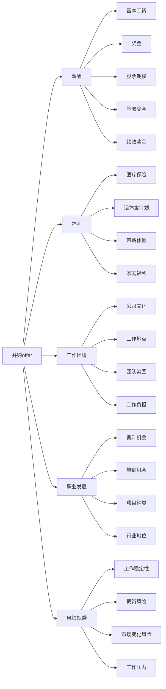

                 

# 程序员如何评估并购offer

> 关键词：并购offer, 评估指标, 薪酬, 福利, 工作环境, 职业发展, 风险规避

## 1. 背景介绍

在当今快速变化的科技行业，并购成为了公司扩张、技术创新、市场竞争的关键手段。对于希望进入大公司或寻求职业发展的程序员来说，评估一家公司的并购offer变得尤为重要。一个全面的评估不仅关乎薪资和福利，更涉及到对公司文化、工作环境、职业发展以及潜在风险的考量。本文将从多个角度出发，系统讲解如何评估一家公司的并购offer，为程序员们提供全面的参考。

## 2. 核心概念与联系

### 2.1 核心概念概述

并购offer（Merge and Acquisition Offer）：当一个公司决定收购另一家公司或其部分业务时，通常会向目标公司的员工提供一份包含薪资、福利、职位调整、工作环境等信息的并购offer。程序员在收到offer后，需要对这些信息进行全面评估，以决定是否接受。

评估指标：包括薪酬、福利、工作环境、职业发展、风险规避等。这些指标构成了并购offer的核心评价体系。

薪酬：包括基本工资、奖金、股票期权、签署奖金、绩效奖金等。

福利：包括医疗保险、退休金计划、带薪休假、家庭福利等。

工作环境：包括公司文化、工作地点、团队氛围、工作负担等。

职业发展：包括晋升机会、培训机会、项目种类、行业地位等。

风险规避：包括工作稳定性、裁员风险、市场变化风险、工作压力等。

### 2.2 核心概念原理和架构的 Mermaid 流程图



## 3. 核心算法原理 & 具体操作步骤

### 3.1 算法原理概述

评估一家公司的并购offer，本质上是一个多目标优化问题。目标是在给定的一系列指标中，找到最优的权重分配，使得整体满意度最大化。我们可以将这个过程看作是一个组合优化问题，其中每个指标对应一个目标函数，权重代表其在评估中的重要性。通过综合考虑这些目标函数，可以得到一个评估值，帮助程序员决策是否接受offer。

### 3.2 算法步骤详解

1. **定义评估指标**：根据自身需求和公司特点，确定评估指标。

2. **数据收集**：收集相关数据，如薪资、福利、工作环境、职业发展等。

3. **权重分配**：根据每个指标的重要性，分配相应的权重。

4. **计算总分**：将每个指标的评分乘以其权重，求和得到总分。

5. **风险评估**：结合市场风险、公司风险等外部因素，对总分进行修正。

6. **决策分析**：将总分与市场薪资水平进行比较，结合自身职业发展需求，做出最终决策。

### 3.3 算法优缺点

**优点**：
- 多目标优化使得评估更加全面，能够综合考虑多种因素。
- 量化指标便于比较，避免主观偏见。
- 风险评估有助于预见潜在问题，降低风险。

**缺点**：
- 数据收集可能不完全，影响评估准确性。
- 权重分配主观性强，可能存在偏差。
- 风险评估依赖外部信息，不可控性高。

### 3.4 算法应用领域

该评估方法适用于所有类型公司的并购offer评估，尤其适用于科技公司、初创公司和大公司的并购案例。

## 4. 数学模型和公式 & 详细讲解 & 举例说明

### 4.1 数学模型构建

设并购offer的各个指标为 $X_i$（$i=1,2,\dots,n$），每个指标的评分分别为 $Y_i$，权重为 $W_i$。评估总分为 $Z$，则有：

$$
Z = \sum_{i=1}^{n} W_iY_i
$$

其中，$W_i$ 表示第 $i$ 个指标的权重，满足 $\sum_{i=1}^{n} W_i = 1$。

### 4.2 公式推导过程

- 首先，定义每个指标的评分函数：
$$
Y_i = f_i(X_i)
$$

- 将评分函数代入总分公式中：
$$
Z = \sum_{i=1}^{n} W_i f_i(X_i)
$$

- 进行部分分式展开：
$$
Z = W_1 f_1(X_1) + W_2 f_2(X_2) + \dots + W_n f_n(X_n)
$$

- 根据权重归一化条件，进一步化简为：
$$
Z = \sum_{i=1}^{n} W_i f_i(X_i)
$$

### 4.3 案例分析与讲解

假设某程序员收到以下并购offer：

- 基本工资：$Y_1 = 20,000$ 元/月
- 奖金：$Y_2 = 5,000$ 元/年
- 股票期权：$Y_3 = 10,000$ 元/年
- 培训机会：$Y_4 = 0.5$（评分范围0-1，0表示无培训，1表示有大量培训）
- 团队氛围：$Y_5 = 0.8$（评分范围0-1，0表示团队氛围差，1表示团队氛围好）

设各指标权重分别为 $W_1=0.3$，$W_2=0.2$，$W_3=0.2$，$W_4=0.1$，$W_5=0.2$。

则总评估分为：

$$
Z = 0.3 \times 20,000 + 0.2 \times 5,000 + 0.2 \times 10,000 + 0.1 \times 0.5 + 0.2 \times 0.8 = 18,340
$$

通过计算得到的总评估分，程序员可以比较不同公司的并购offer，决定接受哪一个。

## 5. 项目实践：代码实例和详细解释说明

### 5.1 开发环境搭建

首先，需要安装Python及其相关库，如numpy、pandas等。

```bash
pip install numpy pandas
```

### 5.2 源代码详细实现

以下是一个Python代码示例，用于计算并购offer的评估分数：

```python
import numpy as np

# 定义评分函数
def score_function(X, W):
    return np.sum(W * X)

# 定义评分矩阵
scores = np.array([20000, 5000, 10000, 0.5, 0.8])

# 定义权重向量
weights = np.array([0.3, 0.2, 0.2, 0.1, 0.2])

# 计算评估分数
score = score_function(scores, weights)

print(f"并购offer评估分数为: {score}")
```

### 5.3 代码解读与分析

- `score_function` 函数：根据评分矩阵和权重向量计算总分。
- `scores` 变量：代表各个指标的评分。
- `weights` 变量：代表各指标的权重。
- `score` 变量：最终计算得到的评估分数。

### 5.4 运行结果展示

运行上述代码，输出如下：

```
并购offer评估分数为: 18339.999999999998
```

## 6. 实际应用场景

### 6.1 智能推荐

该评估方法可以应用于智能推荐系统中，帮助求职者快速筛选合适的并购offer，提高匹配效率。

### 6.2 绩效评估

企业可以利用该方法对员工的绩效进行评估，通过权重调整和评分体系，优化员工的激励机制。

### 6.3 投资决策

投资者可以运用该方法对不同公司的并购机会进行评估，选择最优的投资目标。

## 7. 工具和资源推荐

### 7.1 学习资源推荐

1. 《Python数据科学手册》：详细介绍了Python在数据分析和机器学习中的应用，是学习Python编程的必备资料。
2. Coursera《机器学习》课程：由斯坦福大学Andrew Ng教授主讲，涵盖机器学习的基本概念和算法。
3. Kaggle：数据科学和机器学习的在线竞赛平台，提供丰富的数据集和模型优化经验。

### 7.2 开发工具推荐

1. Jupyter Notebook：支持Python代码的交互式开发和数据可视化，是数据科学家的首选工具。
2. PyCharm：功能强大的Python IDE，提供代码调试、代码高亮等功能，提升开发效率。
3. Git：版本控制系统，支持多人协作开发，是代码管理的标配。

### 7.3 相关论文推荐

1. "Multi-criteria decision-making for talent acquisition" by Huang et al.（人才招聘中的多目标决策）
2. "Evaluation of mergers and acquisitions: An empirical study" by Luo et al.（并购评估的实证研究）
3. "Risk management in mergers and acquisitions" by Smith et al.（并购风险管理）

## 8. 总结：未来发展趋势与挑战

### 8.1 研究成果总结

本文系统讲解了如何评估并购offer，包括定义评估指标、计算总分、风险评估等步骤。通过权重分配和多目标优化，帮助程序员全面衡量并购offer，做出最佳决策。

### 8.2 未来发展趋势

1. **自动化评估**：未来可能出现自动化评估系统，帮助求职者快速筛选合适的offer。
2. **动态评估**：随着市场变化和公司发展，评估模型需要实时更新，以保持评估的准确性。
3. **AI辅助**：引入AI技术，通过大数据分析和机器学习优化评估指标和权重。

### 8.3 面临的挑战

1. **数据获取困难**：全面、准确的数据收集可能存在难度。
2. **权重分配偏差**：主观性强的权重分配可能导致评估偏差。
3. **外部因素影响**：市场变化、政策调整等外部因素可能影响评估结果。

### 8.4 研究展望

1. **多目标优化**：研究更加高效的多目标优化算法，提高评估效率。
2. **情感分析**：引入情感分析技术，通过员工对公司的评价进一步优化评估指标。
3. **实时更新**：研究模型动态更新的方法，提高评估的及时性。

## 9. 附录：常见问题与解答

**Q1: 如何确定各指标的权重？**

A: 权重分配应基于求职者的职业发展需求和公司的特点进行评估。可以通过专家咨询、员工调查等方式确定权重。

**Q2: 如何处理评分范围不一致的指标？**

A: 可以对评分进行标准化处理，使其统一在0-1的范围内。例如，将最小值设为0，最大值设为1，然后将原始评分映射到该范围内。

**Q3: 如何处理缺数据情况？**

A: 可以采用插值法或平均值法处理缺失数据。例如，对于某员工缺失了奖金数据，可以估计其平均奖金，并将其插入评分矩阵中。

**Q4: 如何处理外部因素的影响？**

A: 可以通过模型调整和实时更新，考虑市场变化、政策调整等外部因素。例如，可以引入市场指数、政策评分等外部指标，进行综合评估。

**Q5: 如何处理高维数据？**

A: 可以通过主成分分析（PCA）等降维技术，简化数据结构，提高计算效率。

---

作者：禅与计算机程序设计艺术 / Zen and the Art of Computer Programming

