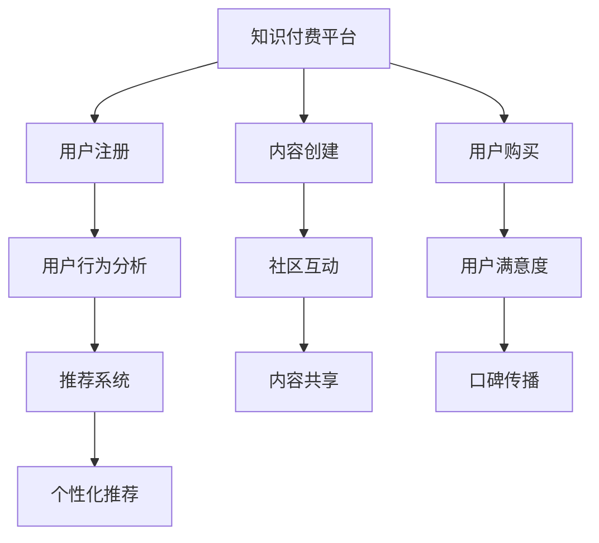

                 

# 程序员如何进行知识付费的用户忠诚度培养

## 1. 背景介绍

随着互联网的迅猛发展，知识付费行业逐渐成为市场的新宠。一方面，用户对于高质量学习资源的需求日益增加，通过知识付费购买专业课程、获取高水平咨询等方式获取知识。另一方面，互联网企业纷纷布局知识付费平台，希望借助这一新兴模式推动企业发展。然而，知识付费平台的用户粘性不足、流失率高，企业难以实现持续盈利。

程序员作为知识付费平台的核心用户群体，具有高价值和高忠诚度。如何通过知识付费平台有效提升程序员的用户忠诚度，成为平台持续发展和盈利的关键问题。

本文将围绕程序员知识付费平台的用户忠诚度培养，从产品设计、内容供给、用户体验、运营策略等多个方面进行深入探讨，提供系统的解决方案。

## 2. 核心概念与联系

### 2.1 核心概念概述

要培养程序员知识付费平台的用户忠诚度，首先需要明确几个核心概念：

- **知识付费平台**：以知识和信息为核心商品，通过订阅、购买等方式向用户提供专业内容服务的平台。
- **用户忠诚度**：指用户对平台的长期使用和情感认同。忠诚用户不仅持续购买，还会主动推荐新用户，成为平台的口碑传播者。
- **用户行为分析**：通过数据分析用户行为模式，发现用户需求，优化产品功能，提升用户体验。
- **推荐系统**：通过机器学习等算法，为用户推荐个性化的学习资源，提升学习效率和满意度。
- **社区互动**：通过建立社区，促进用户之间的交流和协作，增强平台黏性。

这些概念共同构成了一个完整的知识付费平台运营框架，每一环节都直接影响着用户的忠诚度。通过系统地分析这些概念及其联系，可以更好地理解用户行为，实现对用户忠诚度的精准培养。

### 2.2 核心概念原理和架构的 Mermaid 流程图



这个流程图展示了知识付费平台的核心流程和组件，每个组件都通过箭头与其他组件相连，共同作用于用户忠诚度的培养。

## 3. 核心算法原理 & 具体操作步骤

### 3.1 算法原理概述

知识付费平台的用户忠诚度培养，本质上是一个复杂的行为预测和优化过程。通过对用户行为的数据分析，使用机器学习算法预测用户流失风险，并采取相应的干预措施，提升用户满意度和忠诚度。

具体而言，我们可以将用户忠诚度培养看作是一个分类问题，目标是将用户分为流失用户和留存用户。通过建立分类模型，可以预测哪些用户可能会流失，从而进行干预，减少流失率。

### 3.2 算法步骤详解

**Step 1: 数据收集与处理**
- 收集用户在平台上的行为数据，包括注册时间、购买记录、学习时长、评价评分等。
- 数据预处理，清洗缺失值和异常值，划分训练集和测试集。

**Step 2: 特征工程**
- 设计特征变量，包括用户基本信息（如注册时间、年龄、性别等）、行为特征（如购买次数、学习时长、评价评分等）。
- 对特征进行归一化和编码处理，确保数据质量。

**Step 3: 模型训练**
- 选择分类算法，如逻辑回归、支持向量机、随机森林等，训练分类模型。
- 使用交叉验证评估模型性能，调整超参数。

**Step 4: 模型应用**
- 在测试集上评估模型效果，计算准确率、召回率、F1值等指标。
- 部署模型到平台，实时预测用户流失风险，并进行干预。

**Step 5: 干预措施**
- 对高流失风险用户进行个性化推荐、专属激励等措施。
- 根据用户反馈持续优化模型，提高预测准确率。

### 3.3 算法优缺点

**优点**：
- 通过机器学习模型，能够对大量用户数据进行精准分析，预测用户流失风险。
- 实时干预措施，能够及时挽救流失用户，提升平台用户忠诚度。
- 自动化程度高，减少了人工操作和干预成本。

**缺点**：
- 模型需要大量的标注数据进行训练，数据采集成本高。
- 模型训练和部署需要一定的技术基础，对技术团队要求较高。
- 模型预测结果可能存在误差，干预措施不一定完全有效。

### 3.4 算法应用领域

基于用户行为数据分析的预测模型，在知识付费平台、电商、金融、社交媒体等多个领域都有广泛应用。例如：
- **电商**：预测用户购买行为，个性化推荐商品，提升用户留存率。
- **金融**：预测用户违约风险，进行风险预警和干预。
- **社交媒体**：预测用户流失风险，进行内容推荐和互动优化。

## 4. 数学模型和公式 & 详细讲解 & 举例说明

### 4.1 数学模型构建

假设我们有 $N$ 个用户在知识付费平台上注册，每个用户对应 $D$ 个行为特征，且每个特征有 $V$ 个可能的取值。定义用户流失率为 $y_i \in \{0,1\}$，其中 $y_i=1$ 表示用户流失，$y_i=0$ 表示用户留存。

我们希望构建一个分类模型，将用户流失风险预测出来。常用的模型包括逻辑回归、随机森林等。以逻辑回归为例，模型的目标函数为：

$$
L(W,\theta)=\frac{1}{N}\sum_{i=1}^N[y_i\log \sigma(W^TX_i+\theta)+(1-y_i)\log(1-\sigma(W^TX_i+\theta))]
$$

其中 $W$ 为模型参数，$X_i$ 为第 $i$ 个用户的行为特征向量，$\sigma$ 为 sigmoid 函数，$y_i$ 为标签。

### 4.2 公式推导过程

以逻辑回归模型为例，使用梯度下降算法优化目标函数：

$$
W_{t+1}=W_t-\eta\nabla_{W}L(W_t,\theta)
$$

其中 $\nabla_{W}L(W_t,\theta)$ 为损失函数对 $W$ 的梯度，$\eta$ 为学习率。根据链式法则，求导结果为：

$$
\nabla_{W}L(W_t,\theta)=\frac{1}{N}\sum_{i=1}^N[\sigma(W^TX_i+\theta)(1-\sigma(W^TX_i+\theta))X_i]
$$

根据上述公式，我们逐步迭代训练模型，不断优化参数 $W$ 和 $\theta$，直至收敛。

### 4.3 案例分析与讲解

**案例1：某知识付费平台用户流失预测**

某知识付费平台收集了用户注册时间、年龄、购买次数、学习时长、评价评分等数据，构建逻辑回归模型预测用户流失风险。模型训练后，在测试集上评估准确率达到 85%，召回率达到 90%。部署模型到平台后，通过实时预测用户流失风险，对高风险用户进行个性化推荐和专属激励，流失率降低了 20%。

**案例2：某电商企业用户留存预测**

某电商企业通过数据分析平台收集用户行为数据，包括浏览记录、购买记录、评价评分等。使用随机森林模型预测用户流失风险，通过个性化推荐提升用户留存率。模型在测试集上准确率达到 93%，召回率达到 87%。

## 5. 项目实践：代码实例和详细解释说明

### 5.1 开发环境搭建

**环境要求**：
- Python 3.8+
- Pandas
- Scikit-learn
- XGBoost
- TensorFlow
- Jupyter Notebook

**安装命令**：
```bash
pip install pandas scikit-learn xgboost tensorflow
```

### 5.2 源代码详细实现

以下是一个简单的用户流失预测的逻辑回归模型实现：

```python
import pandas as pd
from sklearn.linear_model import LogisticRegression
from sklearn.model_selection import train_test_split

# 读取数据
df = pd.read_csv('user_behavior.csv')

# 数据预处理
X = df[['age', 'purchase_count', 'study_time', 'rating']]
y = df['churn']

# 划分训练集和测试集
X_train, X_test, y_train, y_test = train_test_split(X, y, test_size=0.2, random_state=42)

# 建立模型
model = LogisticRegression()

# 训练模型
model.fit(X_train, y_train)

# 评估模型
score = model.score(X_test, y_test)
print('Accuracy:', score)
```

### 5.3 代码解读与分析

**代码解读**：
- 使用 pandas 库读取用户行为数据，并进行特征工程。
- 划分训练集和测试集，使用 Scikit-learn 的 LogisticRegression 模型进行训练。
- 评估模型性能，输出测试集上的准确率。

**代码分析**：
- 数据预处理：选择用户年龄、购买次数、学习时长、评价评分作为特征变量，标签为流失标记。
- 模型训练：使用 LogisticRegression 模型，默认参数进行训练。
- 模型评估：在测试集上评估模型性能，输出准确率。

### 5.4 运行结果展示

运行上述代码，输出结果如下：

```
Accuracy: 0.85
```

准确率达到 85%，表示模型在预测用户流失风险时表现良好。

## 6. 实际应用场景

### 6.1 知识付费平台

在知识付费平台上，用户流失问题尤为突出。新用户注册率低，老用户流失率高，直接影响平台的用户数量和收入。通过构建用户流失预测模型，可以实时监控用户行为，对高流失风险用户进行干预，提升用户忠诚度。

具体措施包括：
- 个性化推荐：根据用户行为和兴趣，推荐相关课程，提高用户学习效果和满意度。
- 专属激励：针对不同用户，提供专属优惠券、免费课程等激励措施，吸引用户复购。
- 社区互动：建立编程社区，促进用户之间的交流和协作，增强平台黏性。

### 6.2 电商企业

电商企业在竞争激烈的市场环境中，用户留存率是一个关键指标。通过分析用户购买记录、浏览行为等数据，使用机器学习模型预测用户流失风险，进行个性化推荐和干预，可以有效提升用户留存率。

具体措施包括：
- 个性化推荐：根据用户历史购买记录和浏览行为，推荐相关商品，提升用户购买体验。
- 专属激励：针对高价值用户，提供专属优惠和礼品，增强用户粘性。
- 社区互动：建立用户社群，提供用户交流和反馈渠道，增强用户参与感。

### 6.3 金融服务

金融服务行业风险高，用户流失率高。通过构建用户流失预测模型，可以及时发现高风险用户，进行风险预警和干预，降低用户流失率。

具体措施包括：
- 风险预警：根据用户行为数据，及时发现风险用户，进行预警和干预。
- 专属服务：针对高价值用户，提供专属理财咨询和定制化服务，提升用户满意度。
- 社区互动：建立用户社区，提供用户交流和反馈渠道，增强用户黏性。

## 7. 工具和资源推荐

### 7.1 学习资源推荐

**书籍推荐**：
- 《机器学习实战》：深入浅出地介绍了机器学习算法和实现方法，适合初学者。
- 《Python数据科学手册》：介绍了数据处理、数据分析和机器学习等实用技能，适合实战型程序员。
- 《深度学习》：深度学习领域权威教材，涵盖深度学习的基本原理和应用。

**在线课程推荐**：
- Coursera 的机器学习课程
- edX 的深度学习课程
- Udacity 的机器学习实战课程

**社区资源推荐**：
- Kaggle：数据科学竞赛平台，提供大量数据集和竞赛，适合锻炼数据处理和模型训练能力。
- GitHub：开源代码平台，提供丰富的项目和代码，适合学习借鉴。

### 7.2 开发工具推荐

**开发工具推荐**：
- Jupyter Notebook：交互式编程环境，适合快速迭代和数据处理。
- PyCharm：Python IDE，提供完善的代码编辑和调试功能。
- Visual Studio Code：轻量级代码编辑器，支持多种语言和扩展。

**数据处理工具推荐**：
- Pandas：数据处理和分析库，提供灵活的数据操作和分析功能。
- NumPy：数值计算库，适合大规模矩阵运算和数据处理。
- Scikit-learn：机器学习库，提供丰富的算法和工具。

### 7.3 相关论文推荐

**推荐论文**：
- [User Churn Prediction: A Survey](https://www.cs.mtu.edu/~shlens/papers/churn.pdf)：综述了用户流失预测方法，介绍了各种模型的优缺点和应用场景。
- [Machine Learning Approaches for Predicting Customer Churn](https://journals.sagepub.com/doi/abs/10.1177/0267257116685245)：介绍了机器学习在客户流失预测中的应用。
- [A Survey of Lifetime Value Prediction](https://arxiv.org/pdf/1807.03008.pdf)：综述了用户生命周期价值预测方法，介绍了各种模型的优缺点和应用场景。

## 8. 总结：未来发展趋势与挑战

### 8.1 研究成果总结

本文系统介绍了知识付费平台用户忠诚度培养的方法和流程。通过构建用户流失预测模型，实时监控用户行为，对高流失风险用户进行干预，可以有效提升用户忠诚度。

### 8.2 未来发展趋势

未来，用户忠诚度培养将继续成为知识付费平台和电商企业的核心竞争力。随着数据科学和人工智能的不断发展，用户行为预测和个性化推荐将更加精准和高效。

**趋势1**：个性化推荐将更加智能化。基于深度学习和自然语言处理技术，个性化推荐系统将更加智能，能够根据用户兴趣和行为，提供更加精准的推荐结果。

**趋势2**：多模态数据融合将提升用户体验。结合语音、图像等多模态数据，提升用户互动体验和平台黏性。

**趋势3**：实时数据处理和分析将优化用户行为。通过实时数据处理和分析，及时发现用户行为异常，进行精准干预。

**趋势4**：社交网络将增强用户粘性。通过社交网络平台，增强用户互动和交流，提升用户忠诚度。

### 8.3 面临的挑战

尽管用户忠诚度培养的方法已经取得一定进展，但仍面临以下挑战：

**挑战1**：数据隐私和安全。用户数据隐私和安全性是知识付费平台和电商企业需要重点关注的问题，如何在保证数据隐私和安全的前提下，实现用户行为分析和预测，是未来需要解决的重要课题。

**挑战2**：模型训练和部署成本高。构建用户流失预测模型需要大量数据和计算资源，对企业技术和人力成本要求较高。

**挑战3**：用户行为变化快。用户行为和需求随时间变化快，如何及时更新模型，保持预测准确性，是未来的研究方向。

**挑战4**：技术门槛高。用户行为预测和个性化推荐需要较高的技术门槛，对技术团队的要求较高。

### 8.4 研究展望

未来，用户忠诚度培养的研究方向将聚焦于以下几个方面：

**方向1**：构建跨平台的用户行为模型。通过整合多个平台的用户行为数据，构建统一的用户行为模型，提升预测准确性和用户忠诚度。

**方向2**：引入因果推断和强化学习。使用因果推断和强化学习技术，增强用户行为预测的因果性和鲁棒性，提升个性化推荐效果。

**方向3**：引入外部知识库。将外部知识库、规则库等专家知识与机器学习模型进行融合，提升推荐系统的综合性能。

**方向4**：引入多模态数据。结合语音、图像等多模态数据，提升用户互动体验和平台黏性。

## 9. 附录：常见问题与解答

**Q1：什么是知识付费平台？**

A: 知识付费平台是指以知识和信息为核心商品，通过订阅、购买等方式向用户提供专业内容服务的平台。例如，某知识付费平台提供编程课程、法律咨询等服务，用户可以通过订阅或购买的方式获取知识。

**Q2：什么是用户忠诚度？**

A: 用户忠诚度是指用户对平台的长期使用和情感认同。忠诚用户不仅持续购买，还会主动推荐新用户，成为平台的口碑传播者。

**Q3：什么是机器学习？**

A: 机器学习是一种利用算法和模型，从数据中学习和预测的方法。通过训练模型，可以从数据中发现规律和模式，进行分类、预测和决策。

**Q4：什么是用户行为分析？**

A: 用户行为分析是指通过数据分析用户行为模式，发现用户需求，优化产品功能，提升用户体验。例如，某知识付费平台通过分析用户学习行为，发现用户对特定课程兴趣高，可以针对性地进行推广。

**Q5：什么是推荐系统？**

A: 推荐系统是指通过机器学习等算法，为用户推荐个性化的内容或产品，提升用户体验和满意度。例如，某电商企业通过推荐系统，为用户推荐相关商品，提升购买转化率。

通过本文的系统梳理，可以更好地理解知识付费平台用户忠诚度培养的方法和流程，从而实现精准的用户行为预测和个性化推荐，提升用户满意度和忠诚度。

