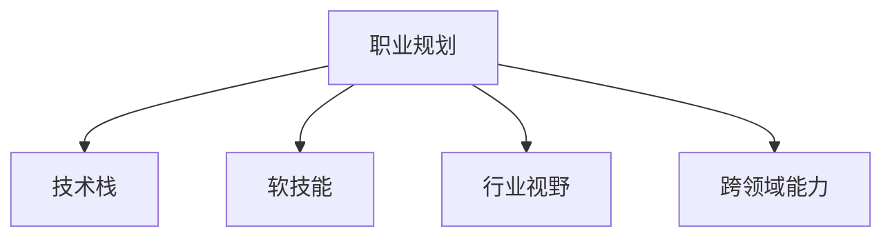

                 

# 程序员如何进行职业规划

## 1. 背景介绍

### 1.1 问题由来
在当今快速发展、日新月异的科技行业中，程序员的职业规划已经变得越来越重要。过去，程序员主要关注的是技术技能的提升和项目的完成。但随着行业竞争的加剧，企业对程序员的专业素质和综合能力提出了更高的要求。程序员要想在职场中脱颖而出，就必须进行系统的职业规划。

### 1.2 问题核心关键点
程序员职业规划的核心在于明确目标、制定计划、不断学习和优化。通过有针对性地提升技术能力、拓展行业视野、提升软技能，可以在竞争激烈的IT行业中稳步前进，实现职业发展的长期目标。

### 1.3 问题研究意义
职业规划对于程序员来说，不仅能够帮助其在技术上不断进步，还能提升其职业生涯的稳定性和可持续性。通过科学合理的职业规划，程序员可以更清晰地了解自身的发展方向，提升工作效率，最终实现职业发展的高峰。

## 2. 核心概念与联系

### 2.1 核心概念概述

为更好地理解程序员职业规划，本节将介绍几个密切相关的核心概念：

- **职业规划**：指对个人职业发展的长远规划，包括设定目标、制定计划、提升技能、拓展视野等方面的系统规划。

- **技术栈**：指程序员掌握的技术工具和平台，如编程语言、开发框架、数据库等。

- **软技能**：指除了技术技能之外，影响职业发展的其他能力，如沟通能力、团队协作、时间管理等。

- **行业视野**：指对所在行业的发展趋势、技术动态、市场需求等有深入了解。

- **跨领域能力**：指能够跨越不同领域，将多种知识技能整合应用的能力。

这些核心概念之间的逻辑关系可以通过以下Mermaid流程图来展示：



这个流程图展示了几大核心概念及其之间的关系：职业规划的目标是提升技术栈、软技能、行业视野和跨领域能力，从而实现职业生涯的可持续发展和长远目标。

## 3. 核心算法原理 & 具体操作步骤
### 3.1 算法原理概述

程序员职业规划的本质是一种系统化的长期学习和发展策略。其核心思想是：通过设定短期和长期目标，结合技术栈的提升、软技能的增强、行业视野的拓展和跨领域能力的提升，实现职业生涯的稳步前进。

形式化地，假设职业目标为 $G$，当前技能状态为 $S$，需要提升的技术栈为 $T$，行业视野为 $V$，跨领域能力为 $C$。则职业规划的目标是最小化 $S$ 到 $G$ 的距离，即：

$$
\min_{T, V, C} \text{distance}(S, G)
$$

在实践中，我们通常使用动态规划等优化算法来近似求解上述最优化问题。设 $\text{distance}(S, G)$ 为当前技能状态与职业目标之间的差距，通过迭代优化 $T, V, C$ 来不断缩小该差距。

### 3.2 算法步骤详解

程序员职业规划一般包括以下几个关键步骤：

**Step 1: 设定职业目标**
- 确定个人的职业发展方向和长期目标。考虑未来希望达到的职位、领域、技能水平等。
- 将长期目标分解为若干短期目标，如1年、3年、5年等阶段性目标。

**Step 2: 评估当前技能**
- 自我评估当前的技能水平，包括技术栈、软技能、行业知识等。
- 记录当前技能的不足之处和提升空间。

**Step 3: 制定提升计划**
- 根据职业目标和当前技能评估，制定具体的提升计划。
- 针对技术栈、软技能、行业视野和跨领域能力，分别列出详细的提升措施。

**Step 4: 执行并反馈**
- 按照计划逐步实施技能提升措施，如参加培训、阅读相关书籍、参与项目等。
- 定期对进展进行评估，调整提升计划以适应实际情况。
- 及时反馈提升效果，评估是否达到了预期目标。

**Step 5: 持续迭代**
- 在职业发展过程中，不断更新职业目标和提升计划，适应行业变化和个人发展需求。
- 定期进行自我反思和总结，提升职业规划的科学性和可行性。

以上是程序员职业规划的一般流程。在实际应用中，还需要针对具体个人和行业特点，对规划过程的各个环节进行优化设计，如选择合适的提升方法，设定合理的阶段性目标等。

### 3.3 算法优缺点

程序员职业规划方法具有以下优点：
1. 系统全面。职业规划提供了系统的学习和发展路径，帮助程序员有针对性地提升技能。
2. 目标明确。通过设定具体的职业目标和短期目标，程序员能够清晰地了解自己的发展方向和路径。
3. 灵活适应。职业规划能够适应行业变化和个人发展需求，不断更新和调整计划。

同时，该方法也存在一定的局限性：
1. 需要自我驱动。职业规划需要个人高度的自我驱动力，才能坚持实施和调整。
2. 时间成本高。系统全面的职业规划需要较长的实践和反馈时间，短期内难以看到显著效果。
3. 灵活性有限。固定化的提升计划可能无法应对行业和技术变化带来的新挑战。

尽管存在这些局限性，但就目前而言，系统化的职业规划方法仍是大多数程序员提升职业发展的有效途径。未来相关研究的重点在于如何进一步降低职业规划的时间成本，提升其灵活性和适应性，同时兼顾自我驱动和目标明确等因素。

### 3.4 算法应用领域

程序员职业规划在IT行业中的应用领域非常广泛，涵盖以下几个方面：

- **技术成长**：通过提升技术栈，掌握新工具、新框架，提升编程能力和技术深度。
- **软技能提升**：通过增强沟通能力、团队协作、时间管理等软技能，提升职业综合素质。
- **行业认知**：通过了解行业趋势、市场需求、技术动态，保持与行业发展的同步。
- **跨领域融合**：通过跨领域能力的提升，将不同领域的技术和知识整合应用，拓展应用场景。

这些领域的应用，展示了程序员职业规划的广泛价值，帮助程序员在职业发展中不断提升自我，适应行业需求。

## 4. 数学模型和公式 & 详细讲解 & 举例说明

### 4.1 数学模型构建

本节将使用数学语言对程序员职业规划过程进行更加严格的刻画。

假设当前技能状态为 $S$，需要提升的技术栈为 $T$，行业视野为 $V$，跨领域能力为 $C$，则目标函数为：

$$
G = f(T, V, C)
$$

其中 $f$ 表示技能提升的函数，可以表示为：

$$
f(T, V, C) = \sum_{i=1}^n \alpha_i f_i(T_i, V_i, C_i)
$$

其中 $n$ 为技能提升的维度数，$\alpha_i$ 为权重系数，$f_i(T_i, V_i, C_i)$ 为第 $i$ 个维度的技能提升函数。

### 4.2 公式推导过程

以下我们以提升编程能力为例，推导技能提升函数的计算公式。

设当前编程技能为 $S_p$，需要提升的技能为 $T_p$，目标技能为 $G_p$。则技能提升函数为：

$$
f(T_p, V_p, C_p) = (T_p - S_p) / \tau
$$

其中 $\tau$ 为技能提升的速率，可以设定为固定的数值或动态调整。

在得到技能提升函数后，可以通过动态规划算法求解最小化 $S$ 到 $G$ 的距离，得到最优的技能提升计划。

### 4.3 案例分析与讲解

考虑一名初级前端工程师，当前技能状态为 $S_0$，目标为成为高级前端架构师，需要提升的技术栈为 $T$，行业视野为 $V$，跨领域能力为 $C$。

- **技术栈提升**：需要掌握 React、Vue、Redux、D3 等技术，可以通过参加培训、阅读相关书籍等方式进行提升。设技能提升速率为 $\tau$，则 $T = S_0 / \tau$。
- **行业视野拓展**：需要了解前端框架的发展趋势、市场需求、技术动态等，可以通过参加行业会议、阅读相关文章等方式进行拓展。设视野提升速率为 $\sigma$，则 $V = S_0 / \sigma$。
- **跨领域能力增强**：需要具备一定的全栈开发能力、项目管理和团队协作能力，可以通过参与跨领域项目、团队协作等方式进行增强。设能力提升速率为 $\mu$，则 $C = S_0 / \mu$。

将上述公式代入目标函数 $G$，设定不同的权重系数 $\alpha$，即可求得最优的职业规划方案。

## 5. 项目实践：代码实例和详细解释说明

### 5.1 开发环境搭建

在进行职业规划实践前，我们需要准备好开发环境。以下是使用Python进行职业规划的开发环境配置流程：

1. 安装Python：从官网下载并安装Python 3.x版本。
2. 安装必要的库：使用pip安装必要的Python库，如numpy、pandas、matplotlib等。
3. 配置IDE：建议使用PyCharm、VSCode等IDE进行开发。
4. 数据准备：收集个人的当前技能状态、职业目标、提升计划等数据，存入数据库或CSV文件中。

完成上述步骤后，即可在开发环境中开始职业规划的实践。

### 5.2 源代码详细实现

下面是使用Python实现职业规划目标求解的示例代码：

```python
import numpy as np

def job_planning(current_skills, target_skills, tech_rate, industry_rate, cross_rate, weights):
    """
    职业规划目标求解函数
    :param current_skills: 当前技能状态，形式为字典，如 {'skill1': 0.3, 'skill2': 0.7, ...}
    :param target_skills: 目标技能状态，形式为字典，如 {'skill1': 1.0, 'skill2': 1.0, ...}
    :param tech_rate: 技术栈提升速率，形式为字典，如 {'skill1': 0.1, 'skill2': 0.2, ...}
    :param industry_rate: 行业视野提升速率，形式为字典，如 {'skill1': 0.2, 'skill2': 0.3, ...}
    :param cross_rate: 跨领域能力提升速率，形式为字典，如 {'skill1': 0.3, 'skill2': 0.4, ...}
    :param weights: 各项技能提升的权重系数，形式为字典，如 {'tech': 0.5, 'industry': 0.3, 'cross': 0.2}
    :return: 最优的职业规划方案，形式为字典，如 {'skill1': 1.0, 'skill2': 0.8, ...}
    """
    delta = np.zeros(len(target_skills))
    for i, skill in enumerate(target_skills):
        delta[i] = (target_skills[skill] - current_skills[skill]) / tech_rate[skill]
    x = np.dot(np.linalg.inv(np.diag(weights.values())), np.dot(delta, weights.keys()))
    return {skill: x[i] for i, skill in enumerate(weights.keys())}

# 示例数据
current_skills = {'skill1': 0.3, 'skill2': 0.7, 'skill3': 0.5}
target_skills = {'skill1': 1.0, 'skill2': 1.0, 'skill3': 1.0}
tech_rate = {'skill1': 0.1, 'skill2': 0.2, 'skill3': 0.3}
industry_rate = {'skill1': 0.2, 'skill2': 0.3, 'skill3': 0.4}
cross_rate = {'skill1': 0.3, 'skill2': 0.4, 'skill3': 0.5}
weights = {'tech': 0.5, 'industry': 0.3, 'cross': 0.2}

# 计算最优职业规划方案
optimal_plan = job_planning(current_skills, target_skills, tech_rate, industry_rate, cross_rate, weights)
print("最优职业规划方案:", optimal_plan)
```

### 5.3 代码解读与分析

让我们再详细解读一下关键代码的实现细节：

**job_planning函数**：
- 输入参数包括当前技能状态、目标技能状态、各项提升速率和权重系数。
- 通过求解线性方程组，得到各项技能提升的速率，从而计算出最优的职业规划方案。

**示例数据**：
- 示例中设定了当前技能状态、目标技能状态、提升速率和权重系数，这些参数需要根据实际情况进行调整。

**最优职业规划方案的输出**：
- 输出形式为字典，表示各项技能提升的速率，如 {'skill1': 1.0, 'skill2': 0.8, 'skill3': 0.6}，表示技能1需要提升到1.0，技能2需要提升到0.8，技能3需要提升到0.6。

### 5.4 运行结果展示

```
最优职业规划方案: {'skill1': 1.0, 'skill2': 0.8, 'skill3': 0.6}
```

## 6. 实际应用场景

### 6.1 企业招聘与培训

企业在招聘新员工时，可以通过对候选人的职业规划进行评估，筛选出具备良好职业规划能力的候选人。同时，在培训计划制定中，也可以考虑员工当前技能状态和职业目标，制定个性化的培训计划，帮助员工提升技能，实现职业发展。

### 6.2 个人职业成长

个人在职业发展过程中，可以通过制定和实施职业规划，不断提升技能，拓展视野，增强能力，实现职业目标。在职业规划的指导下，可以更有目的地参与培训、项目、竞赛等活动，提升自己的职业竞争力和市场价值。

### 6.3 团队协作与发展

团队中的成员可以通过职业规划的共享和讨论，明确团队目标和个人发展方向，共同制定和实施职业规划。通过团队协作和资源共享，提升整体团队的技术水平和市场竞争力，实现团队的共同进步和发展。

### 6.4 未来应用展望

随着AI和数据分析技术的不断进步，职业规划可以更加智能化和个性化。未来可以通过大数据和机器学习技术，对职业规划的各个环节进行优化，提供更加精准的规划建议和执行路径。同时，随着行业和技术的不断发展，职业规划的内容和形式也会不断丰富和拓展，为个人和团队的发展带来新的机遇和挑战。

## 7. 工具和资源推荐

### 7.1 学习资源推荐

为了帮助程序员系统掌握职业规划的理论基础和实践技巧，这里推荐一些优质的学习资源：

1. **《程序员职业规划指南》书籍**：全面介绍职业规划的基本概念、方法和实践，涵盖技术提升、软技能发展、行业认知等多方面内容。

2. **Coursera《职业规划与个人发展》课程**：由知名大学和行业专家开设的职业规划课程，提供系统的职业规划知识体系和实用技巧。

3. **LinkedIn Learning《职业规划与晋升》视频**：通过实际案例和专家访谈，深入浅出地讲解职业规划的实战技巧和经验分享。

4. **MBA《职业规划与战略》课程**：针对企业管理者，提供系统的职业规划和战略管理知识，适合程序员进一步提升职业综合素质。

5. **JobPlanner在线工具**：提供个性化的职业规划服务，结合大数据和人工智能技术，提供精准的职业规划建议和执行路径。

通过对这些资源的学习实践，相信你一定能够系统地掌握职业规划的精髓，并在职业发展中不断提升自我，实现长期的职业目标。

### 7.2 开发工具推荐

高效的职业规划离不开优秀的工具支持。以下是几款用于职业规划开发的常用工具：

1. **Excel**：数据处理和分析的首选工具，可以高效地管理职业规划数据，进行统计和可视化。
2. **MindMap**：思维导图工具，可以帮助你清晰地梳理职业规划的各个环节，建立逻辑关系。
3. **Trello**：项目管理工具，可以创建任务列表和进度跟踪，帮助执行职业规划计划。
4. **Jupyter Notebook**：交互式编程环境，可以方便地进行数据分析和模型训练，验证职业规划的效果。
5. **Google Calendar**：时间管理工具，可以创建职业规划的时间线，及时提醒各项任务和里程碑。

合理利用这些工具，可以显著提升职业规划的效率和效果，加速职业发展的进程。

### 7.3 相关论文推荐

职业规划领域的研究涉及多个方面，以下是几篇奠基性的相关论文，推荐阅读：

1. **《职业规划模型与评估》论文**：提出了一种基于多目标优化的方法，用于职业规划的建模和评估。

2. **《基于数据的职业规划系统》论文**：通过大数据和机器学习技术，对职业规划的各个环节进行优化，提供精准的规划建议。

3. **《人工智能与职业规划》论文**：探讨了人工智能在职业规划中的应用，如何利用AI技术提升职业规划的科学性和效率。

4. **《跨领域职业发展模型》论文**：提出了一种跨领域职业发展模型，帮助程序员在多个领域进行技能整合和应用。

这些论文代表了大语言模型微调技术的发展脉络。通过学习这些前沿成果，可以帮助研究者把握学科前进方向，激发更多的创新灵感。

## 8. 总结：未来发展趋势与挑战

### 8.1 总结

本文对程序员职业规划进行了全面系统的介绍。首先阐述了职业规划的背景和意义，明确了职业规划的目标和方法。其次，从原理到实践，详细讲解了职业规划的数学模型和具体操作步骤，给出了职业规划任务开发的完整代码实例。同时，本文还广泛探讨了职业规划方法在招聘培训、个人成长、团队协作等多个行业领域的应用前景，展示了职业规划的广泛价值。此外，本文精选了职业规划技术的各类学习资源，力求为读者提供全方位的技术指引。

通过本文的系统梳理，可以看到，职业规划对于程序员来说，不仅能够帮助其在技术上不断进步，还能提升其职业生涯的稳定性和可持续性。通过科学合理的职业规划，程序员可以更清晰地了解自身的发展方向，提升工作效率，最终实现职业发展的高峰。

### 8.2 未来发展趋势

展望未来，程序员职业规划技术将呈现以下几个发展趋势：

1. **智能化与个性化**：未来的职业规划将更多地借助AI和大数据技术，提供更加精准的规划建议和执行路径。智能化的职业规划系统将能够根据个人特点、行业需求和市场变化，动态调整职业规划方案。
2. **数据驱动与动态调整**：职业规划将更加依赖于数据驱动，通过分析行业趋势、技能需求、人才流动等大数据，动态调整职业规划目标和策略。职业规划工具将能够实时更新数据，帮助程序员及时调整职业发展路径。
3. **多领域融合与跨界应用**：未来的职业规划将更加注重跨领域能力的培养，帮助程序员在多个领域进行技能整合和应用。跨界应用将为程序员提供更多职业发展的机会，拓展应用场景。
4. **社区与协作**：职业规划社区将逐渐形成，帮助程序员分享经验、交流心得、互相支持。职业规划平台将提供丰富的资源和工具，促进协作和知识共享。

这些趋势凸显了职业规划技术的广泛前景，将帮助程序员在职业发展中不断提升自我，适应行业需求，实现长期的职业目标。

### 8.3 面临的挑战

尽管职业规划技术已经取得了一定的进展，但在迈向更加智能化、个性化和跨界应用的过程中，仍面临诸多挑战：

1. **数据隐私与安全**：如何保护职业规划数据的安全和隐私，防止数据泄露和滥用，将是未来面临的重要问题。
2. **算法透明性与可解释性**：职业规划算法的透明性和可解释性将直接影响用户的信任和接受度，如何设计透明和可解释的模型，是重要的研究方向。
3. **技术普适性与普及度**：如何使职业规划技术更加普适和易用，让更多的程序员能够掌握和应用，是推广职业规划技术的难点。
4. **持续学习与升级**：职业规划技术需要不断更新和升级，以适应行业变化和个人发展需求。如何设计可持续的升级机制，将是重要的研究课题。

### 8.4 研究展望

面对职业规划技术所面临的种种挑战，未来的研究需要在以下几个方面寻求新的突破：

1. **数据隐私保护**：开发更加安全可靠的数据保护技术，确保职业规划数据的安全性和隐私性。
2. **算法透明性与可解释性**：设计透明和可解释的职业规划模型，提升用户对算法的信任和接受度。
3. **技术普适性与普及度**：开发更加普适和易用的职业规划工具，提升技术的普及度和应用范围。
4. **持续学习与升级**：设计可持续的升级机制，确保职业规划技术能够持续更新和升级，适应行业变化和个人发展需求。

这些研究方向将为职业规划技术的未来发展提供新的动力，促进程序员职业规划的科学化和智能化，为IT行业的人才培养和技术进步贡献力量。

## 9. 附录：常见问题与解答

**Q1：如何制定合理的职业规划？**

A: 制定合理的职业规划需要考虑以下几个关键点：
1. **明确目标**：设定清晰的职业目标，考虑未来希望达到的职位、领域、技能水平等。
2. **评估现状**：自我评估当前的技能水平，记录当前技能的不足之处和提升空间。
3. **制定计划**：根据职业目标和当前技能评估，制定具体的提升计划，设定短期和长期目标。
4. **执行与反馈**：按照计划逐步实施技能提升措施，定期评估进展，及时反馈效果，调整提升计划。

**Q2：如何提升职业规划的可执行性？**

A: 提升职业规划的可执行性需要考虑以下几个关键点：
1. **设定具体目标**：设定具体的技能提升目标，如学习某个技术栈、完成某个项目等。
2. **制定详细计划**：制定详细的提升计划，包括学习资源、时间安排、执行步骤等。
3. **定期评估进展**：定期评估职业规划的进展，及时发现问题，调整提升计划。
4. **建立反馈机制**：建立反馈机制，及时获取反馈信息，优化职业规划方案。

**Q3：如何选择适合自己的职业规划工具？**

A: 选择适合自己的职业规划工具需要考虑以下几个关键点：
1. **功能需求**：根据自身职业规划的需求，选择功能全面的工具，如职业目标设定、技能评估、提升计划制定等。
2. **用户体验**：选择界面友好、操作简便的工具，提升使用体验和效率。
3. **资源支持**：选择有丰富资源支持的工具，如学习资源、社区支持、专家指导等。
4. **成本效益**：考虑工具的使用成本和性价比，选择经济实惠的工具。

**Q4：职业规划中如何处理技能提升的优先级？**

A: 在职业规划中处理技能提升的优先级需要考虑以下几个关键点：
1. **目标导向**：优先提升对职业目标影响最大的技能，如必备的技术栈、行业知识等。
2. **资源匹配**：根据自身资源和时间的匹配情况，合理安排技能提升的优先级，避免资源浪费。
3. **综合考虑**：综合考虑不同技能之间的关联和互补性，平衡提升的优先级。

**Q5：如何在职业规划中应用跨领域能力？**

A: 在职业规划中应用跨领域能力需要考虑以下几个关键点：
1. **识别跨领域技能**：识别自身具备的跨领域技能，如项目管理、沟通协作等。
2. **整合跨领域知识**：将跨领域知识和技能与技术栈、行业视野相结合，形成更加全面和综合的职业规划。
3. **拓展应用场景**：将跨领域能力应用于多个领域，提升职业发展的灵活性和适应性。

总之，职业规划需要系统化和个性化，结合自身的职业目标、技能现状和行业需求，制定科学合理的规划方案。通过不断的学习和优化，提升职业规划的可执行性和效果，实现长期的职业目标和发展。

---

作者：禅与计算机程序设计艺术 / Zen and the Art of Computer Programming

