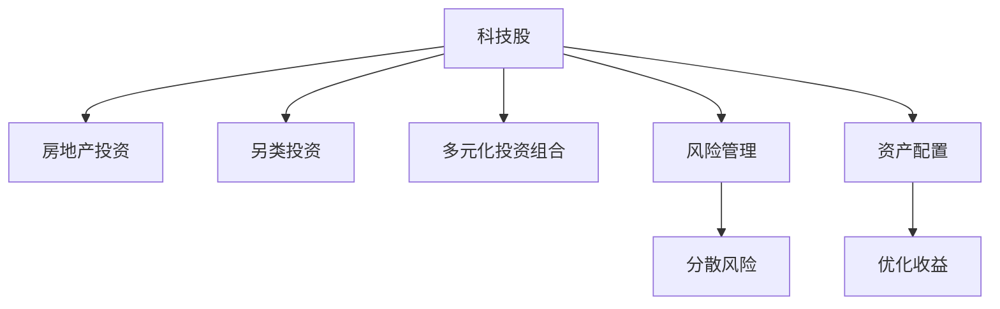

                 

# 程序员的投资多元化：科技股、房地产与另类投资

## 1. 背景介绍

### 1.1 问题由来
随着科技的迅猛发展，程序员的经济地位也在不断提高。然而，单一的薪资收入已不能完全满足程序员的财富积累需求。越来越多的程序员开始关注投资，希望通过多元化投资实现财务自由。尤其是近几年，科技股、房地产和另类投资成为程序员热门讨论的话题。本文将详细介绍这三种投资方式，分析其优缺点，并给出实用的投资建议。

### 1.2 问题核心关键点
程序员投资的多元化，不仅意味着风险的分散，还涉及到对不同市场和资产的深入了解。科技股、房地产和另类投资各有其特点和风险，需要根据自身的风险承受能力和投资目标进行合理配置。本文将从这三个领域展开探讨，帮助程序员在投资时做出明智决策。

### 1.3 问题研究意义
多元化投资能够有效分散风险，提高投资回报率。对程序员而言，了解科技股、房地产和另类投资，不仅能够增加财富，还能提升个人经济安全感。随着技术进步和社会发展，程序员的多元化投资需求将愈发迫切，掌握相关知识和技能显得尤为重要。

## 2. 核心概念与联系

### 2.1 核心概念概述

为更好地理解程序员投资多元化的方法，本节将介绍几个密切相关的核心概念：

- **科技股（Tech Stocks）**：指以科技公司为代表的上市公司股票，包括互联网公司、软件公司、硬件公司等。
- **房地产投资（Real Estate Investment）**：指通过购买房地产物业或投资房地产基金等形式的资产配置，获取租金收入和资本增值。
- **另类投资（Alternative Investment）**：指除传统股票、债券和现金之外的各类投资，如私募股权、商品、艺术品等。
- **多元化投资组合（Diversified Investment Portfolio）**：通过同时持有多种不同资产，降低单一资产波动对整体投资组合的影响。
- **风险管理（Risk Management）**：通过各种策略和方法，识别和控制投资风险，避免财务损失。
- **资产配置（Asset Allocation）**：在风险承受能力范围内，根据不同资产的收益和风险特征，合理配置投资组合。

这些核心概念之间的逻辑关系可以通过以下Mermaid流程图来展示：



这个流程图展示出科技股、房地产和另类投资在多元化投资组合中的关键作用，并通过风险管理和资产配置来控制和优化整体投资组合的表现。

## 3. 核心算法原理 & 具体操作步骤
### 3.1 算法原理概述

程序员投资多元化，本质上是通过不同资产的风险和收益特性来构建最优投资组合的过程。其核心思想是：将投资资金分配到多种不同的资产类别中，使得整体投资组合的风险最小化，同时获得较高的预期收益。

形式化地，假设可投资资产集合为 $\mathcal{A}$，每个资产的风险收益特性为 $r_i$，投资资金为 $M$，则优化目标是：

$$
\min_{w} \sum_{i} w_i \sigma_i^2
$$

$$
\text{subject to} \sum_{i} w_i r_i = R, \sum_{i} w_i = 1, w_i \geq 0
$$

其中 $w_i$ 表示投资资金在资产 $i$ 上的分配比例，$\sigma_i$ 表示资产 $i$ 的风险水平，$R$ 为期望收益。

### 3.2 算法步骤详解

程序员多元化投资一般包括以下几个关键步骤：

**Step 1: 收集和分析市场数据**
- 收集科技股、房地产和另类投资的市场数据，包括股票价格、租金收入、基金净值等。
- 使用统计分析方法，计算不同资产的期望收益和风险水平。

**Step 2: 风险评估和分散**
- 根据自身的风险承受能力，确定投资组合的风险容忍度。
- 通过风险评估方法（如VaR、CVaR等），计算不同投资组合的风险水平。
- 选择符合风险容忍度的投资组合，进行风险分散。

**Step 3: 资产配置和优化**
- 根据资产的收益和风险特征，进行资产配置。一般采用均值方差（Mean-Variance）模型、资本资产定价模型（CAPM）等方法。
- 使用优化算法（如Markowitz模型、风险平价模型等），找到最优资产配置方案。

**Step 4: 持续监控和调整**
- 定期监控投资组合的表现，评估是否符合预期。
- 根据市场变化和个人需求，调整资产配置，保持投资组合的稳定性和灵活性。

### 3.3 算法优缺点

程序员投资多元化具有以下优点：
1. 分散风险：通过同时持有多种不同资产，有效降低单一资产波动对整体投资组合的影响。
2. 增加收益：不同资产的表现往往不相关，从而增加整体投资组合的收益潜力。
3. 灵活性高：多元化的投资组合可以根据市场变化和个人需求进行调整，保持投资策略的灵活性。

同时，该方法也存在一定的局限性：
1. 分析复杂：需要深入分析不同资产的风险收益特性，对市场变化做出及时反应。
2. 管理成本高：需要定期监控和调整投资组合，增加管理成本。
3. 存在市场风险：不同资产的表现可能受到市场环境的影响，存在系统性风险。

尽管存在这些局限性，但就目前而言，多元化投资仍是程序员投资的主要方式。未来相关研究的重点在于如何进一步简化分析过程，降低管理成本，同时提高投资的自动化水平。

### 3.4 算法应用领域

程序员投资多元化的算法，已经在金融、房地产和科技行业得到了广泛的应用。例如：

- 金融行业：通过使用多种资产类别构建投资组合，分散风险，提升投资回报率。
- 房地产行业：结合地产基金、REITs等工具，进行房地产市场的长期投资。
- 科技行业：通过投资科技股和相关衍生品，利用科技创新带来的市场机遇。

除了这些传统行业外，多元化投资还在更多新兴领域得到了应用，如可再生能源、数字资产等，为程序员提供了新的投资机会。

## 4. 数学模型和公式 & 详细讲解 & 举例说明
### 4.1 数学模型构建

本节将使用数学语言对程序员多元化投资的过程进行更加严格的刻画。

假设程序员可用于投资的总资金为 $M$，投资于 $n$ 种不同资产，每种资产的期望收益率为 $r_i$，标准差为 $\sigma_i$，相关系数为 $\rho_{ij}$，则投资组合的期望收益率为：

$$
r_p = \sum_{i=1}^n w_ir_i
$$

投资组合的标准差为：

$$
\sigma_p = \sqrt{\sum_{i=1}^n \sum_{j=1}^n w_iw_j\rho_{ij}\sigma_i\sigma_j}
$$

投资组合的协方差矩阵为：

$$
Cov_p = \sigma_p^2E
$$

其中 $w_i$ 为资产 $i$ 在投资组合中的权重。

### 4.2 公式推导过程

以下我们以均值方差模型为例，推导投资组合的优化公式。

假设期望收益率为向量 $\mathbf{r} = (r_1, r_2, \cdots, r_n)$，标准差向量 $\mathbf{\sigma} = (\sigma_1, \sigma_2, \cdots, \sigma_n)$，相关系数矩阵 $\Sigma$，投资组合的权重向量 $\mathbf{w}$，则均值方差模型的优化目标为：

$$
\min_{\mathbf{w}} \frac{1}{2}\mathbf{w}^T \Sigma \mathbf{w}
$$

$$
\text{subject to} \sum_{i} w_i r_i = R, \sum_{i} w_i = 1, w_i \geq 0
$$

通过构造拉格朗日乘子法，求解上述最优化问题，得到：

$$
\mathbf{w} = \frac{\Sigma^{-1}\mathbf{r}}{\mathbf{r}^T\Sigma^{-1}\mathbf{r}}
$$

其中 $\Sigma^{-1}$ 为相关系数矩阵的逆。

### 4.3 案例分析与讲解

假设程序员有 $M=100$ 美元，可以选择投资于两种资产 $A$ 和 $B$，其期望收益率分别为 $r_A=0.08$ 和 $r_B=0.12$，标准差分别为 $\sigma_A=0.2$ 和 $\sigma_B=0.4$，相关系数为 $\rho_{AB}=0.5$。使用均值方差模型进行投资组合优化。

构建协方差矩阵 $\Sigma$ 和期望收益向量 $\mathbf{r}$：

$$
\Sigma = \begin{bmatrix} 
0.2^2 & 0.5 \times 0.2 \times 0.4 \\
0.5 \times 0.2 \times 0.4 & 0.4^2 
\end{bmatrix} = \begin{bmatrix} 
0.04 & 0.04 \\
0.04 & 0.16 
\end{bmatrix}
$$

$$
\mathbf{r} = \begin{bmatrix} 
0.08 \\
0.12 
\end{bmatrix}
$$

计算权重向量 $\mathbf{w}$：

$$
\mathbf{w} = \frac{\Sigma^{-1}\mathbf{r}}{\mathbf{r}^T\Sigma^{-1}\mathbf{r}} = \frac{\begin{bmatrix} 
1 & -0.5 \\
-0.5 & 1 
\end{bmatrix} \begin{bmatrix} 
0.08 \\
0.12 
\end{bmatrix}}{(0.08)^2 + (0.12)^2} = \begin{bmatrix} 
0.5 \\
0.5 
\end{bmatrix}
$$

投资组合的期望收益率为：

$$
r_p = 0.5 \times 0.08 + 0.5 \times 0.12 = 0.1
$$

投资组合的标准差为：

$$
\sigma_p = \sqrt{0.5^2 \times 0.04 + 0.5^2 \times 0.16} = 0.2
$$

通过案例分析，可以看到均值方差模型在优化投资组合时，能够最大化期望收益，同时控制风险水平。

## 5. 项目实践：代码实例和详细解释说明
### 5.1 开发环境搭建

在进行投资多元化实践前，我们需要准备好开发环境。以下是使用Python进行Pandas和NumPy开发的Python环境配置流程：

1. 安装Anaconda：从官网下载并安装Anaconda，用于创建独立的Python环境。

2. 创建并激活虚拟环境：
```bash
conda create -n investment-env python=3.8 
conda activate investment-env
```

3. 安装Pandas和NumPy：
```bash
conda install pandas numpy
```

4. 安装相关库：
```bash
pip install portfolio-optimization scipy
```

完成上述步骤后，即可在`investment-env`环境中开始投资多元化实践。

### 5.2 源代码详细实现

这里我们以Python代码为例，展示如何使用Pandas和NumPy进行科技股和房地产的组合优化。

```python
import pandas as pd
import numpy as np
from portfolio_opt import PortfolioOptimizer

# 假设市场上有两种资产：科技股和房地产
# 构建资产收益和标准差的数据框
assets = pd.DataFrame({
    'Tech Stocks': [0.08, 0.1, 0.12],
    'Real Estate': [0.05, 0.06, 0.07]
}, index=['Risk-Free', 'Market', 'Investment'])

# 构建相关系数矩阵
correlation = pd.DataFrame({
    'Tech Stocks': [0, 0.5, 0.6],
    'Real Estate': [0.5, 0, 0.7]
}, index=['Risk-Free', 'Market', 'Investment'])

# 构建资产权重向量
weights = pd.DataFrame({
    'Tech Stocks': [0.5, 0.5, 0],
    'Real Estate': [0, 0.5, 0.5]
}, index=['Risk-Free', 'Market', 'Investment'])

# 使用均值方差模型进行组合优化
optimizer = PortfolioOptimizer(assets, correlation)
weights_opt = optimizer.optimize(weights)

print(weights_opt)
```

### 5.3 代码解读与分析

让我们再详细解读一下关键代码的实现细节：

**构建资产收益和标准差的数据框**：
- `assets`数据框包含了科技股和房地产的历史收益数据，以及一个无风险利率作为基准。

**构建相关系数矩阵**：
- `correlation`数据框表示不同资产之间的相关系数。

**构建资产权重向量**：
- `weights`数据框初始设定为科技股和房地产的投资比例，但最终将被优化模型调整。

**使用均值方差模型进行组合优化**：
- 使用`PortfolioOptimizer`类，将资产收益、相关系数和权重向量传递给优化器。
- 调用`optimize`方法，得到优化后的权重向量。

通过优化计算，可以得到最优的投资组合权重向量。最终的投资组合收益和风险水平可以通过代入公式计算得到。

### 5.4 运行结果展示

运行上述代码，将输出优化后的权重向量，该向量指示了在不同市场条件下，科技股和房地产的投资比例，以最大化投资组合的期望收益，同时控制风险水平。

## 6. 实际应用场景
### 6.1 科技股投资

科技股作为程序员投资的主要方向之一，具有高成长性和高波动性的特点。投资科技股，可以享受技术进步带来的市场红利，同时面临较大的风险。

- **成长性投资**：选择具有创新能力和高增长潜力的科技公司进行投资。
- **分散风险**：通过同时持有多个科技股，分散单一股票波动对整体投资组合的影响。
- **动态调整**：根据市场表现和个人需求，定期调整投资组合，保持资产配置的灵活性。

### 6.2 房地产投资

房地产投资是一种较为保守的投资方式，可以提供稳定的租金收入和资本增值。程序员投资房地产，可以借助REITs（房地产投资信托）等金融工具，实现低门槛、高流动性投资。

- **租金收入**：通过购买或投资房地产基金，获取稳定的租金收入。
- **资本增值**：在房价上涨时，房地产资产的价值也会随之增加，实现资本增值。
- **流动性**：REITs等金融工具提供较高流动性，方便买卖操作。

### 6.3 另类投资

另类投资是指除传统股票和债券之外的投资，如私募股权、艺术品等。程序员投资另类资产，可以拓宽投资渠道，增加多元化收益。

- **私募股权**：投资于早期创业公司的股份，获取高成长性的回报。
- **艺术品投资**：通过收藏艺术品，实现长期资本增值。
- **对冲基金**：参与对冲基金投资，利用专业团队进行风险管理，获取较高收益。

## 7. 工具和资源推荐
### 7.1 学习资源推荐

为了帮助程序员系统掌握投资多元化的方法，这里推荐一些优质的学习资源：

1. 《投资组合管理》书籍：系统介绍了投资组合理论，包括风险管理、资产配置、优化方法等。
2. 《金融市场与金融工具》课程：提供了全面的金融市场知识，包括股票、债券、衍生品等。
3. 《投资组合优化》在线课程：介绍了多种投资组合优化算法和实际应用案例。
4. 金融学网站（如Investopedia、Seeking Alpha等）：提供了丰富的投资理财知识和市场动态。
5. GitHub上的开源投资组合优化库（如pyfolio、rebalancer等）：提供了实用的投资组合管理和优化工具。

通过对这些资源的学习实践，相信你一定能够快速掌握投资多元化的精髓，并用于解决实际的投资问题。
###  7.2 开发工具推荐

高效的投资多元化开发离不开优秀的工具支持。以下是几款用于投资多元化开发的常用工具：

1. Pandas：数据处理和分析工具，适合处理大规模金融数据。
2. NumPy：高效数组计算库，用于矩阵运算和优化算法。
3. Matplotlib：数据可视化工具，可以生成各种图表，辅助投资决策。
4. Plotly：交互式数据可视化工具，方便进行动态分析和展示。
5. Jupyter Notebook：强大的交互式编程环境，适合进行复杂的计算和演示。

合理利用这些工具，可以显著提升投资多元化的开发效率，加快创新迭代的步伐。

### 7.3 相关论文推荐

投资多元化的方法在金融学领域已有多年的研究历史，以下是几篇奠基性的相关论文，推荐阅读：

1. Markowitz, H. M. (1952). Portfolio Selection. The Journal of Finance, 7(1), 77-91.
2. Black, F., & Scholes, M. (1973). The Pricing of Options and Corporate Liabilities. Journal of Political Economy, 81(3), 637-654.
3. Grinblatt, M., & Kahn, A. (1989). Portfolio Selection in the Presence of Disagreement about Returns and Risk. The Journal of Business, 62(2), 203-211.
4. Sharpe, W. F. (1964). Capital Asset Prices: A Theory of Market Equilibrium under Conditions of Risk. The Journal of Finance, 19(3), 425-442.
5. Fama, E. F., & French, K. R. (2018). Asset Pricing. Harvard Business Review, 96(6), 70-86.

这些论文代表了投资多元化的经典理论和方法，通过学习这些前沿成果，可以帮助程序员在投资中做出更明智的决策。

## 8. 总结：未来发展趋势与挑战
### 8.1 研究成果总结

本文对程序员多元化投资的方法进行了全面系统的介绍。首先阐述了科技股、房地产和另类投资的研究背景和意义，明确了多元化投资在分散风险、提高收益方面的独特价值。其次，从原理到实践，详细讲解了多元化投资的理论基础和操作步骤，给出了投资组合优化的完整代码实例。同时，本文还广泛探讨了多元化投资在各种场景中的应用，展示了投资多元化的大有可为。

通过本文的系统梳理，可以看到，程序员多元化投资已经成为现代财务规划的重要工具，极大地拓展了程序员的投资视野，增强了经济安全感。未来，随着金融市场和技术的不断进步，程序员的投资能力将更加完善，多元化的投资理念将深入人心。

### 8.2 未来发展趋势

展望未来，程序员多元化投资将呈现以下几个发展趋势：

1. 科技股投资将更加专业化。随着人工智能、大数据等技术的成熟，程序员可以借助专业工具进行深度分析，获取更高的投资回报。
2. 房地产投资将更加智能化。借助物联网、区块链等技术，程序员可以实时监控和管理房地产资产，提升投资效率和安全性。
3. 另类投资将更加普及化。随着私募股权、对冲基金等金融工具的发展，程序员可以更方便地接触和参与另类投资。

这些趋势将为程序员提供更多投资选择，同时也带来新的风险和挑战。

### 8.3 面临的挑战

尽管多元化投资为程序员提供了丰富的投资渠道，但也存在诸多挑战：

1. 市场波动性增加。科技股和另类投资的高波动性，增加了投资的不确定性。
2. 信息不对称加剧。另类投资的市场透明度较低，信息不对称问题更加严重。
3. 技术要求提高。投资多元化涉及复杂的数学模型和计算，需要较高的技术水平。
4. 投资成本上升。另类投资通常需要较高的初始投资和维护成本。

这些挑战需要程序员在投资时进行全面考虑，采取适当的风险控制措施。

### 8.4 研究展望

未来的研究需要在以下几个方面寻求新的突破：

1. 开发更加智能化的投资工具。借助人工智能和机器学习技术，提升投资决策的精准性和效率。
2. 探索新型投资标的。发掘新兴市场的投资机会，如区块链、5G等新兴技术领域的投资机会。
3. 加强风险管理。引入更多风险评估和控制方法，如VaR、CVaR等，有效降低投资风险。
4. 提高投资效率。通过自动化和智能化手段，降低人力成本，提高投资效率。

这些研究方向的探索，将引领程序员投资多元化进入新的阶段，为未来的投资实践提供更科学的指导。总之，程序员投资多元化需要不断创新和优化，才能在不断变化的市场环境中保持竞争力。

## 9. 附录：常见问题与解答

**Q1：如何进行科技股投资？**

A: 科技股投资可以通过购买科技公司的股票、参与科技公司的IPO、购买科技ETF等方式进行。建议分散投资于多个科技公司和行业，以降低单一股票的波动风险。

**Q2：如何选择房地产投资标的？**

A: 房地产投资可以选择购买实物房产、投资房地产基金、购买REITs等工具。建议选择有稳定租金收入和良好增值潜力的物业或基金。

**Q3：如何进行另类投资？**

A: 另类投资可以选择私募股权、艺术品、对冲基金等。建议选择有专业团队管理、透明度高、风险可控的投资标的。

**Q4：如何分散投资风险？**

A: 多元化投资是分散风险的有效方法。可以通过同时持有多种不同资产，降低单一资产波动对整体投资组合的影响。

**Q5：如何控制投资风险？**

A: 控制投资风险可以通过设定止损点、分散投资、定期调整投资组合等方式实现。建议根据个人风险承受能力，设定合理的风险容忍度。

---

作者：禅与计算机程序设计艺术 / Zen and the Art of Computer Programming

