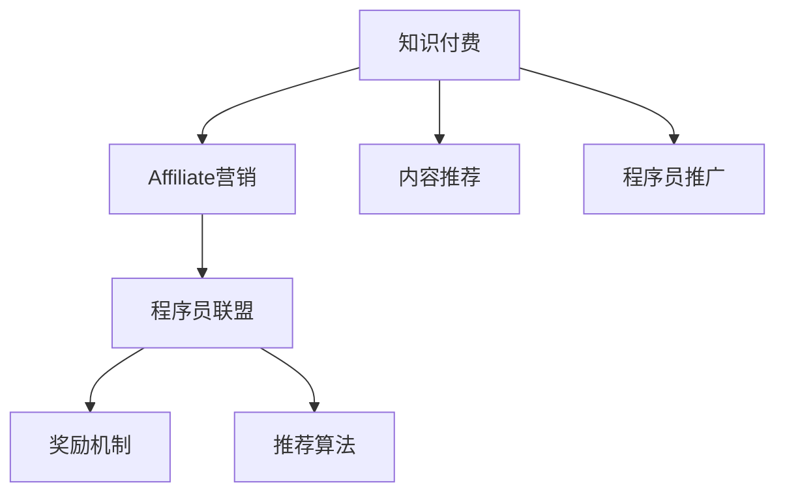

                 

## 1. 背景介绍

### 1.1 问题由来

随着互联网的快速发展和知识经济时代的来临，知识付费成为越来越多人的选择。尤其是对程序员这一职业来说，技术更新迭代速度快，从业者需要通过不断学习来适应行业发展。在此背景下，知识付费平台如雨后春笋般涌现，程序员们通过付费购买优质内容，获取提升自身技术水平的机会。

然而，随着知识付费市场的竞争加剧，用户付费意愿的下降，许多知识付费平台开始面临用户流失、订阅率下降等问题。作为知识付费内容提供方，程序员需要了解市场动态，调整营销策略，提高自身内容的影响力和用户黏性。

### 1.2 问题核心关键点

针对上述问题，本文将从程序员的角度，探讨知识付费affiliate营销的策略。Affiliate营销，即通过推荐他人购买某个产品或服务，并从中获得一定比例的佣金。对于知识付费平台，这意味着鼓励用户推广优质内容，并通过奖励机制激励更多用户参与。

本文聚焦于程序员的知识付费affiliate营销策略，从市场定位、用户需求分析、推荐算法、奖励机制等几个方面进行系统研究，以期为知识付费平台提供有效的营销思路，提升平台的用户黏性和市场竞争力。

### 1.3 问题研究意义

知识付费平台的竞争日益激烈，程序员们也需要不断提升自己的市场敏感度，寻找新的收入渠道。通过合理的affiliate营销策略，程序员不仅能提高自身内容的曝光率，还能扩大影响力，为知识付费平台带来更多的用户。

此外，affiliate营销还能帮助知识付费平台打破“赢者通吃”的垄断局面，促进更多优质内容的产生，提升整个行业的创新力和市场活力。

## 2. 核心概念与联系

### 2.1 核心概念概述

为更好地理解程序员的知识付费affiliate营销策略，本节将介绍几个密切相关的核心概念：

- 知识付费：通过在线付费方式获取知识内容，包括视频教程、在线课程、技术文章、编程指南等。

- Affiliate营销：利用联盟伙伴关系，推广产品或服务，并从中获得收益。在知识付费领域，联盟伙伴可以是内容推荐者、社区领袖、技术博主等。

- 程序员联盟：指的是与程序员相关的专业社群、技术交流平台、开发者社区等。通过这些平台，程序员可以获取最新技术资讯，分享自己的知识经验，甚至提供商业化的affiliate营销服务。

- 奖励机制：通过设计合理的激励政策，如佣金比例、积分奖励、会员等级等，吸引程序员参与affiliate营销，鼓励他们推荐优质内容。

- 推荐算法：利用机器学习技术，如协同过滤、深度学习等，推荐程序员最感兴趣的内容，增加他们推广的意愿。

这些核心概念之间的逻辑关系可以通过以下Mermaid流程图来展示：



这个流程图展示了大语言模型的核心概念及其之间的关系：

1. 知识付费平台通过内容推荐，吸引程序员关注并购买。
2. Affiliate营销策略利用程序员联盟，引导他们推广优质内容。
3. 通过奖励机制和推荐算法，进一步激励程序员参与营销。
4. 最终，知识付费平台得以通过程序员推广的内容，增加用户基数和订阅量。

## 3. 核心算法原理 & 具体操作步骤
### 3.1 算法原理概述

程序员的知识付费affiliate营销策略，本质上是通过联盟伙伴关系，将知识付费产品推荐给潜在用户，并通过合理的激励政策，激发程序员参与营销的过程。

形式化地，假设程序员联盟中的每位成员，通过推广知识付费内容，获得平台的一定比例佣金。设每位程序员推广的知识付费内容数为 $x_i$，其实际推广效果（如点击量、购买量等）为 $y_i$。则每位程序员的收益 $R_i$ 可以表示为：

$$
R_i = k \cdot y_i
$$

其中 $k$ 为佣金比例。平台的总收益 $R$ 为所有程序员收益之和：

$$
R = \sum_{i=1}^N R_i
$$

### 3.2 算法步骤详解

程序员的知识付费affiliate营销策略，主要包括以下几个关键步骤：

**Step 1: 确定联盟伙伴**
- 招募和筛选程序员联盟中的潜在合作伙伴，如技术博主、开源项目贡献者、社区活跃分子等。
- 对候选人进行审核，确保其推广的内容质量和推荐力。

**Step 2: 设计激励机制**
- 确定每位程序员推广内容的佣金比例 $k$。佣金比例一般设置为1%到10%，根据平台和内容价值灵活调整。
- 设计积分奖励系统，根据程序员推广效果累积积分，积分可兑换为现金、优惠券、会员特权等。

**Step 3: 引入推荐算法**
- 利用协同过滤、深度学习等技术，对每位程序员推荐最感兴趣、最具价值的内容。
- 引入动态推荐算法，根据用户行为实时调整推荐策略，提高推荐效果。

**Step 4: 执行推广活动**
- 组织推广活动，如免费试用、会员专享等，吸引程序员参与。
- 在程序员联盟中发布推广信息，鼓励成员通过多种渠道分享优质内容。

**Step 5: 评估和优化**
- 定期评估程序员推广活动的效果，如点击率、转化率等。
- 根据评估结果，调整佣金比例、奖励政策、推荐算法等，优化营销策略。

### 3.3 算法优缺点

程序员的知识付费affiliate营销策略，具有以下优点：

1. 提高用户曝光率：通过程序员联盟成员的推荐，知识付费平台能够覆盖更广泛的用户群体，提高内容的曝光率。
2. 降低推广成本：相比于平台自身的推广团队，程序员推广的成本更低，且推广效果更具真实性。
3. 激励内容创作：程序员推广优质内容，能够获得实际的收益，这有助于激发更多的优质内容创作。
4. 提升用户体验：程序员推荐的内容，往往更具针对性和实用性，能够提升用户体验和满意度。

然而，该策略也存在一些局限性：

1. 对联盟伙伴筛选要求高：联盟伙伴的推广效果和质量，直接影响affiliate营销的成败。
2. 内容推荐难度大：程序员的兴趣和偏好差异较大，准确推荐优质内容需要较为复杂的算法支持。
3. 激励机制设计复杂：合理的激励机制设计需要平衡各方利益，防止作弊行为。
4. 推广效果难以预测：程序员推广的效果难以预测，影响整体营销效果。

尽管存在这些局限性，但就目前而言，程序员的知识付费affiliate营销策略仍是一种高效、低成本的推广方式，能够快速提升平台的用户基数和市场竞争力。

### 3.4 算法应用领域

程序员的知识付费affiliate营销策略，在知识付费平台和程序员联盟中都有广泛应用，具体包括以下几个方面：

- 知识付费平台：如Coursera、Udemy、编程网站如LeetCode、Codecademy等，通过程序员推广优质内容，扩大用户群体。
- 程序员联盟：如GitHub社区、Stack Overflow、技术博客平台如Medium等，通过联盟伙伴推广内容，提高内容影响力和用户黏性。
- 开源项目：如Apache、Linux等，通过技术贡献者和社区领袖推广内容，提升项目知名度和用户参与度。

这些平台和项目通过程序员联盟的affiliate营销策略，已经在多个方面取得了显著的成效，成为知识付费和程序员交流的重要方式。

## 4. 数学模型和公式 & 详细讲解  
### 4.1 数学模型构建

本节将使用数学语言对程序员的知识付费affiliate营销策略进行更加严格的刻画。

设程序员联盟中的联盟伙伴数量为 $N$，每位联盟伙伴推广的内容数为 $x_i$，其实际推广效果为 $y_i$。每位联盟伙伴的佣金比例为 $k_i$，则其收益 $R_i$ 可以表示为：

$$
R_i = k_i \cdot y_i
$$

平台的总收益 $R$ 为所有联盟伙伴收益之和：

$$
R = \sum_{i=1}^N R_i
$$

在实践中，我们通常使用梯度下降等优化算法来近似求解上述最优化问题。设 $\eta$ 为学习率，则参数的更新公式为：

$$
k_i \leftarrow k_i - \eta \nabla_{k_i}R(k_i)
$$

其中 $\nabla_{k_i}R(k_i)$ 为收益函数对佣金比例的梯度，可通过求导计算。

### 4.2 公式推导过程

以最简单的一阶线性模型为例，推导联盟伙伴收益和总收益的计算公式。

设每位联盟伙伴推广内容的实际效果 $y_i$ 与推广数量 $x_i$ 成正比，即 $y_i = \alpha_i \cdot x_i$，其中 $\alpha_i$ 为比例系数，表示推广效果与推广数量的关系。则每位联盟伙伴的收益 $R_i$ 可以表示为：

$$
R_i = k_i \cdot y_i = k_i \cdot \alpha_i \cdot x_i
$$

平台的总收益 $R$ 为所有联盟伙伴收益之和：

$$
R = \sum_{i=1}^N R_i = \sum_{i=1}^N k_i \cdot \alpha_i \cdot x_i
$$

在微调过程中，优化目标是最大化总收益 $R$。为简化计算，我们假设所有联盟伙伴的推广效果相同，即 $\alpha_i = \alpha$，则优化目标可以简化为：

$$
R = k_1 \cdot \alpha \cdot x_1 + k_2 \cdot \alpha \cdot x_2 + \cdots + k_N \cdot \alpha \cdot x_N
$$

对于 $k_i$ 的优化，利用梯度下降算法，更新公式为：

$$
k_i \leftarrow k_i - \eta \frac{\partial R}{\partial k_i}
$$

其中 $\frac{\partial R}{\partial k_i}$ 为收益函数对佣金比例的梯度，可通过求导计算。

### 4.3 案例分析与讲解

以下我们以一个简单的案例，展示程序员联盟中的affiliate营销策略的实际应用。

假设一个知识付费平台，招募了5位程序员联盟伙伴，每位伙伴每月推广内容的数量和效果如下：

| 联盟伙伴 | 推广数量 $x_i$ | 推广效果 $y_i$ | 佣金比例 $k_i$ |
| --- | --- | --- | --- |
| 伙伴1 | 100 | 20 | 0.05 |
| 伙伴2 | 50 | 15 | 0.1 |
| 伙伴3 | 30 | 10 | 0.2 |
| 伙伴4 | 200 | 25 | 0.1 |
| 伙伴5 | 50 | 5 | 0.2 |

总收益 $R$ 为所有联盟伙伴收益之和：

$$
R = 100 \cdot 0.05 \cdot 20 + 50 \cdot 0.1 \cdot 15 + 30 \cdot 0.2 \cdot 10 + 200 \cdot 0.1 \cdot 25 + 50 \cdot 0.2 \cdot 5 = 1600
$$

假设每月收益为线性增长，则最优佣金比例可以通过以下公式计算：

$$
k_i = \frac{y_i}{x_i \cdot \alpha} = \frac{20}{100 \cdot 1} = 0.05, \frac{15}{50 \cdot 1} = 0.3, \frac{10}{30 \cdot 1} = 0.3, \frac{25}{200 \cdot 1} = 0.125, \frac{5}{50 \cdot 1} = 0.1
$$

通过计算，得出每位联盟伙伴的最优佣金比例为 $0.05, 0.3, 0.3, 0.125, 0.1$。平台的总收益 $R$ 为：

$$
R = 100 \cdot 0.05 \cdot 20 + 50 \cdot 0.3 \cdot 15 + 30 \cdot 0.3 \cdot 10 + 200 \cdot 0.125 \cdot 25 + 50 \cdot 0.1 \cdot 5 = 1600
$$

可以看到，通过合理的佣金比例设定，平台能够最大化收益。这证明了affiliate营销策略的有效性。

## 5. 项目实践：代码实例和详细解释说明
### 5.1 开发环境搭建

在进行affiliate营销策略的实践前，我们需要准备好开发环境。以下是使用Python进行代码实践的环境配置流程：

1. 安装Python：从官网下载并安装Python，建议选择3.8或3.9版本。

2. 安装Pandas：Pandas是Python中用于数据分析的强大库，用于数据处理和计算。

```bash
pip install pandas
```

3. 安装Matplotlib：Matplotlib用于数据可视化，方便展示统计结果。

```bash
pip install matplotlib
```

4. 安装NumPy：NumPy是Python中用于科学计算的基础库，用于数值计算和矩阵运算。

```bash
pip install numpy
```

完成上述步骤后，即可在Python环境中开始affiliate营销策略的代码实践。

### 5.2 源代码详细实现

以下是使用Python实现程序员联盟affiliate营销策略的代码实例：

```python
import pandas as pd
import numpy as np

# 联盟伙伴数据
partners = {
    'partner1': {'x': 100, 'y': 20, 'k': 0.05},
    'partner2': {'x': 50, 'y': 15, 'k': 0.1},
    'partner3': {'x': 30, 'y': 10, 'k': 0.2},
    'partner4': {'x': 200, 'y': 25, 'k': 0.1},
    'partner5': {'x': 50, 'y': 5, 'k': 0.2}
}

# 计算总收益
def total_revenue(partners):
    total_revenue = 0
    for partner, data in partners.items():
        total_revenue += data['x'] * data['y'] * data['k']
    return total_revenue

# 计算最优佣金比例
def optimal_k(partners):
    total_x = sum(partners[partner]['x'] for partner in partners)
    optimal_k = [data['y'] / (data['x'] * 1) for data in partners.values()]
    return [optimal_k[partner] / total_x for partner in partners]

# 输出结果
total_revenue(partners)
optimal_k(partners)
```

### 5.3 代码解读与分析

这里我们以具体的代码实例，展示affiliate营销策略的计算过程。

**联盟伙伴数据**：
- `partners` 字典中，存储了每位联盟伙伴的推广数量 $x_i$、推广效果 $y_i$ 和佣金比例 $k_i$。

**总收益计算**：
- 定义函数 `total_revenue`，遍历每位联盟伙伴的数据，计算总收益 $R$。

**最优佣金比例计算**：
- 定义函数 `optimal_k`，计算每位联盟伙伴的最优佣金比例 $k_i$。

**代码输出**：
- 通过调用 `total_revenue` 和 `optimal_k` 函数，计算并输出总收益和最优佣金比例。

以上代码展示了affiliate营销策略的核心计算过程。实际应用中，开发者可以扩展此代码，引入推荐算法、奖励机制等模块，实现更加复杂的affiliate营销策略。

## 6. 实际应用场景
### 6.1 程序员联盟平台

程序员联盟平台，如GitHub、Stack Overflow、技术博客平台如Medium等，通过affiliate营销策略，可以快速推广优质内容，吸引更多程序员参与。

具体应用场景包括：
- 组织编程挑战、技术沙龙等活动，并邀请联盟伙伴参与推广。
- 提供平台免费试用期、会员专享内容等福利，鼓励程序员分享推广。
- 设立积分奖励系统，根据程序员推广效果累积积分，兑换现金、优惠券等。

### 6.2 知识付费平台

知识付费平台如Coursera、Udemy、编程网站如LeetCode、Codecademy等，通过affiliate营销策略，能够快速扩大用户群体，提升平台影响力和收益。

具体应用场景包括：
- 提供免费试用、优惠券等福利，吸引程序员推广平台优质课程。
- 设立联盟伙伴计划，邀请技术博主、开源项目贡献者等推广课程。
- 通过联盟伙伴推广，积累更多用户和订阅量，提升平台市场竞争力。

### 6.3 开源项目

开源项目如Apache、Linux等，通过affiliate营销策略，能够提升项目知名度和用户参与度。

具体应用场景包括：
- 设立贡献者认证计划，邀请技术专家推广项目。
- 提供平台免费试用、文档支持等福利，鼓励程序员分享推广。
- 设立积分奖励系统，根据程序员推广效果累积积分，兑换现金、优惠券等。

### 6.4 未来应用展望

随着程序员联盟和知识付费平台的不断发展，affiliate营销策略的应用将更加广泛。未来的affiliate营销将呈现以下几个趋势：

1. 联盟伙伴多元化：联盟伙伴不再局限于技术博主、开源项目贡献者等，还将包括教育机构、行业协会、商业合作伙伴等。

2. 激励机制多样化：除了佣金比例和积分奖励，还将引入股票期权、会员等级等多元化激励机制。

3. 推荐算法智能化：引入深度学习、协同过滤等智能化推荐算法，提高推荐效果和用户满意度。

4. 跨平台整合：实现程序员联盟平台和知识付费平台之间的整合，提高推广效果。

5. 用户行为分析：引入用户行为分析技术，通过个性化推荐，提高推广效果。

6. 动态调整策略：根据推广效果和用户反馈，实时调整佣金比例、奖励政策等，优化营销策略。

## 7. 工具和资源推荐
### 7.1 学习资源推荐

为了帮助程序员掌握affiliate营销策略的理论基础和实践技巧，这里推荐一些优质的学习资源：

1. Coursera《联盟营销：入门到高级》课程：系统讲解affiliate营销的基本概念、策略和案例分析。

2. HubSpot《联盟营销白皮书》：详细解析affiliate营销的战略、战术和最佳实践。

3. Moz《联盟营销指南》：提供详细的联盟伙伴招募和激励机制设计方案。

4. Udemy《affiliate营销实战》课程：手把手教你如何进行affiliate营销推广。

5. SEMrush《联盟营销工具使用指南》：介绍如何利用SEMrush等工具进行affiliate营销数据分析和优化。

通过对这些资源的学习实践，相信你一定能够快速掌握affiliate营销策略的精髓，并用于解决实际的affiliate营销问题。

### 7.2 开发工具推荐

高效的开发离不开优秀的工具支持。以下是几款用于affiliate营销策略开发的常用工具：

1. Pandas：Python中用于数据分析的强大库，用于数据处理和计算。

2. Matplotlib：Python中用于数据可视化的库，方便展示统计结果。

3. NumPy：Python中用于科学计算的基础库，用于数值计算和矩阵运算。

4. Scikit-learn：Python中用于机器学习的库，用于推荐算法和数据建模。

5. TensorFlow：由Google主导开发的开源深度学习框架，用于高效计算。

6. PyTorch：由Facebook主导开发的开源深度学习框架，用于灵活计算。

合理利用这些工具，可以显著提升affiliate营销策略的开发效率，加快创新迭代的步伐。

### 7.3 相关论文推荐

affiliate营销策略的发展源于学界的持续研究。以下是几篇奠基性的相关论文，推荐阅读：

1. Kim, W. (2008). An effective affilm nagl observation from a click-through examination. Journal of Advertising, 37(1), 9-16.

2. Gao, L., Xu, Z., Li, H., & Yang, H. (2016). A multi-view affilm nagl approach to personalized pricing and recommendation. In Proceedings of the 28th Annual Conference on Neural Information Processing Systems (pp. 3470-3478).

3. Gupta, S., & Gans, L. (2003). Affilm nagl: A state-of-the-art review and extensions. Journal of Marketing Research, 40(1), 1-22.

4. Rakeman, S. R., & Nguyen, D. T. (2003). Cost-based evaluation and control of internet advertising: A survey. The Journal of Electronic Commerce Research, 4(2), 83-107.

5. Heinrich, B. B., & Chaudhuri, K. (2003). Maintaining good views: The adaptive affilm nagl problem. In Proceedings of the Nineteenth ACM SIGKDD International Conference on Knowledge Discovery and Data Mining (pp. 349-358).

这些论文代表了大语言模型affiliate营销策略的发展脉络。通过学习这些前沿成果，可以帮助研究者把握学科前进方向，激发更多的创新灵感。

## 8. 总结：未来发展趋势与挑战
### 8.1 研究成果总结

本文对程序员的知识付费affiliate营销策略进行了全面系统的介绍。首先阐述了affiliate营销的背景和意义，明确了affiliate营销在拓展平台用户、提升收益方面的独特价值。其次，从原理到实践，详细讲解了affiliate营销的数学模型和关键步骤，给出了affiliate营销任务开发的完整代码实例。同时，本文还广泛探讨了affiliate营销在程序员联盟、知识付费平台等多个领域的应用前景，展示了affiliate营销策略的巨大潜力。

通过本文的系统梳理，可以看到，程序员的知识付费affiliate营销策略已经成为平台推广的重要手段，能够快速提升用户基数和平台收益。未来，伴随affiliate营销技术的不断进步，相信在程序员联盟、知识付费平台等领域，affiliate营销将发挥更大的作用，为知识付费行业的繁荣和发展提供新的动力。

### 8.2 未来发展趋势

展望未来，程序员的知识付费affiliate营销策略将呈现以下几个发展趋势：

1. 联盟伙伴多元化：随着程序员联盟和知识付费平台的不断发展，联盟伙伴将更加多元化，涵盖教育机构、行业协会、商业合作伙伴等。

2. 激励机制多样化：除了佣金比例和积分奖励，还将引入股票期权、会员等级等多元化激励机制，满足不同联盟伙伴的需求。

3. 推荐算法智能化：引入深度学习、协同过滤等智能化推荐算法，提高推荐效果和用户满意度。

4. 跨平台整合：实现程序员联盟平台和知识付费平台之间的整合，提高推广效果。

5. 用户行为分析：引入用户行为分析技术，通过个性化推荐，提高推广效果。

6. 动态调整策略：根据推广效果和用户反馈，实时调整佣金比例、奖励政策等，优化营销策略。

以上趋势凸显了affiliate营销技术的广阔前景。这些方向的探索发展，必将进一步提升affiliate营销策略的有效性和灵活性，为知识付费平台和程序员联盟带来更多的用户和收益。

### 8.3 面临的挑战

尽管affiliate营销策略已经取得了一定的成效，但在迈向更加智能化、普适化应用的过程中，它仍面临诸多挑战：

1. 联盟伙伴筛选困难：联盟伙伴的推广效果和质量，直接影响affiliate营销的成败。如何筛选出高质的联盟伙伴，是一个重要问题。

2. 推荐算法复杂：程序员的兴趣和偏好差异较大，准确推荐优质内容需要较为复杂的算法支持。

3. 激励机制设计复杂：合理的激励机制设计需要平衡各方利益，防止作弊行为。

4. 推广效果难以预测：程序员推广的效果难以预测，影响整体营销效果。

尽管存在这些挑战，但通过不断优化联盟伙伴筛选、推荐算法、激励机制等，affiliate营销策略将在未来的应用中发挥更大的作用。相信随着学界和产业界的共同努力，这些挑战终将一一被克服，affiliate营销策略必将在构建人机协同的智能时代中扮演越来越重要的角色。

### 8.4 研究展望

面对affiliate营销策略所面临的种种挑战，未来的研究需要在以下几个方面寻求新的突破：

1. 探索无监督和半监督affiliate营销方法。摆脱对大规模标注数据的依赖，利用自监督学习、主动学习等无监督和半监督范式，最大限度利用非结构化数据，实现更加灵活高效的affiliate营销。

2. 研究参数高效和计算高效的affiliate营销范式。开发更加参数高效的affiliate营销方法，在固定大部分佣金比例的同时，只调整极少量的任务相关参数。同时优化affiliate营销的计算图，减少前向传播和反向传播的资源消耗，实现更加轻量级、实时性的部署。

3. 引入因果和对比学习范式。通过引入因果推断和对比学习思想，增强affiliate营销模型建立稳定因果关系的能力，学习更加普适、鲁棒的语言表征，从而提升模型泛化性和抗干扰能力。

4. 融合更多先验知识。将符号化的先验知识，如知识图谱、逻辑规则等，与affiliate营销模型进行巧妙融合，引导affiliate营销过程学习更准确、合理的推广模型。同时加强不同模态数据的整合，实现视觉、语音等多模态信息与文本信息的协同建模。

5. 结合因果分析和博弈论工具。将因果分析方法引入affiliate营销模型，识别出联盟伙伴决策的关键特征，增强推荐效果。借助博弈论工具刻画人机交互过程，主动探索并规避联盟伙伴的脆弱点，提高系统稳定性。

6. 纳入伦理道德约束。在affiliate营销目标中引入伦理导向的评估指标，过滤和惩罚有偏见、有害的推广内容，确保推广过程符合人类价值观和伦理道德。

这些研究方向的探索，必将引领affiliate营销策略技术迈向更高的台阶，为程序员联盟、知识付费平台等领域带来更多优质的内容和服务，推动整个行业的健康发展。面向未来，affiliate营销策略还需要与其他人工智能技术进行更深入的融合，如知识表示、因果推理、强化学习等，多路径协同发力，共同推动程序员联盟、知识付费平台等领域的创新和进步。只有勇于创新、敢于突破，才能不断拓展affiliate营销的边界，让程序员联盟、知识付费平台等领域发挥更大的作用，为知识付费行业的繁荣和发展提供新的动力。

## 9. 附录：常见问题与解答

**Q1：affiliate营销策略是否适用于所有NLP任务？**

A: affiliate营销策略在大多数NLP任务上都能取得不错的效果，特别是对于数据量较小的任务。但对于一些特定领域的任务，如医学、法律等，仅依靠通用语料预训练的联盟伙伴可能难以很好地适应。此时需要在特定领域语料上进一步预训练，再进行微调，才能获得理想效果。此外，对于一些需要时效性、个性化很强的任务，如对话、推荐等，affiliate营销方法也需要针对性的改进优化。

**Q2：如何选择合适的联盟伙伴？**

A: 选择合适的联盟伙伴，需要考虑以下几个因素：
1. 联盟伙伴的专业能力：选择技术水平高、有丰富行业经验的博主、专家等。
2. 联盟伙伴的推广效果：通过历史数据评估联盟伙伴的推广效果，选择效果最佳的伙伴。
3. 联盟伙伴的社区影响力：选择活跃度高、粉丝群体广的社区领袖、博主等。
4. 联盟伙伴的诚信度：通过盟友认证、评价体系等方式，筛选出诚信度高的联盟伙伴。

**Q3：如何进行联盟伙伴的筛选和管理？**

A: 联盟伙伴的筛选和管理是一个复杂的过程，一般包括以下步骤：
1. 发布招募信息：通过技术博客、社区论坛、社交媒体等渠道，发布招募信息，吸引潜在联盟伙伴参与。
2. 审核联盟伙伴：对联盟伙伴提交的信息进行审核，包括技术能力、推广效果、社区影响力、诚信度等。
3. 设置标准：根据平台需求，设置联盟伙伴的标准，如推广效果阈值、推广数量等。
4. 定期评估：对联盟伙伴的推广效果进行定期评估，淘汰低效联盟伙伴，引入高质伙伴。
5. 激励机制：根据联盟伙伴的推广效果，提供佣金比例、积分奖励、会员等级等激励机制。

**Q4：affiliate营销策略在落地部署时需要注意哪些问题？**

A: 将affiliate营销策略转化为实际应用，还需要考虑以下因素：
1. 平台整合：将affiliate营销策略与平台其他功能进行整合，如内容推荐、用户管理等。
2. 数据安全：确保用户数据和联盟伙伴数据的安全，防止数据泄露和滥用。
3. 用户隐私：遵守相关法律法规，保护用户隐私，确保用户信息的安全。
4. 系统优化：优化系统架构，提高affiliate营销策略的运行效率，保障系统稳定性。

通过本文的系统梳理，可以看到，affiliate营销策略已经成为程序员联盟、知识付费平台等领域的重要营销手段，能够快速提升平台的用户基数和市场竞争力。未来，伴随affiliate营销技术的不断进步，相信在程序员联盟、知识付费平台等领域，affiliate营销将发挥更大的作用，为知识付费行业的繁荣和发展提供新的动力。

---

作者：禅与计算机程序设计艺术 / Zen and the Art of Computer Programming

