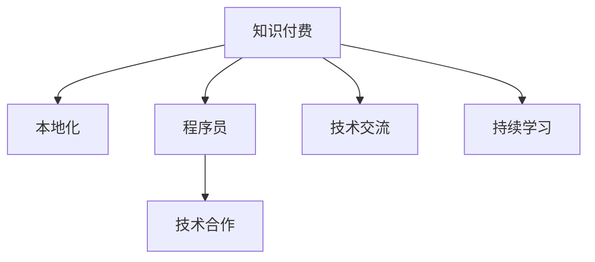

                 

# 程序员的知识付费内容本地化策略

## 1. 背景介绍

随着互联网的快速发展和信息技术的进步，知识付费成为现代社会的一大趋势。特别是对于程序员这一高需求、高薪资的群体，知识付费的浪潮更为猛烈。然而，由于地域、语言和文化差异，知识付费内容在全球范围的传播和本地化面临着诸多挑战。本文旨在探讨程序员知识付费内容的本地化策略，以促进全球程序员之间的技术交流与合作。

## 2. 核心概念与联系

### 2.1 核心概念概述

本节将介绍几个与程序员知识付费内容本地化相关的核心概念：

- **知识付费**：指通过付费方式获取专业知识和技能的学习，广泛应用于技术、金融、医学等多个领域。
- **本地化**：指将全球通用的知识付费内容转化为本地语言和文化的过程，使其更适合当地受众接受。
- **程序员**：指以编程为职业的各类软件工程师、架构师等专业人士，是知识付费的重要消费群体。
- **技术交流**：程序员通过分享和获取知识，促进全球技术社区的发展和繁荣。
- **技术合作**：不同地域的程序员通过知识付费平台合作开发项目，共同解决问题，提升整体技术水平。

这些概念之间的逻辑关系可以通过以下Mermaid流程图来展示：



这个流程图展示的知识付费、本地化、程序员、技术交流、技术合作之间的联系：知识付费是基础，本地化为知识付费内容在全球传播提供了必要手段，程序员是知识付费的主要消费者，技术交流和技术合作是知识付费的高级应用。

## 3. 核心算法原理 & 具体操作步骤

### 3.1 算法原理概述

程序员知识付费内容的本地化过程，本质上是一个多语言翻译和内容适配的过程。其核心思想是通过翻译和适配，将全球通用的知识付费内容转化为本地受众更容易理解、接受的版本。

### 3.2 算法步骤详解

本节将详细介绍本地化算法的主要步骤：

**Step 1: 数据收集与预处理**
- 收集全球范围内的程序员知识付费内容，包括技术博客、在线课程、视频教程等。
- 对收集到的内容进行预处理，包括去除冗余信息、标准化格式等，以降低后续翻译和适配的难度。

**Step 2: 多语言翻译**
- 使用机器翻译技术将全球通用的内容翻译成目标语言。考虑到程序员的专业性和技术术语的特殊性，需要选择专业的翻译团队，或借助基于深度学习的机器翻译模型。
- 在翻译过程中，需要对技术术语、代码片段等进行专业化的处理，以确保翻译内容的准确性和专业性。

**Step 3: 内容适配**
- 根据目标语言和文化的不同，对翻译后的内容进行本地化适配。包括更改图表、代码格式，添加本地示例，以及调整语气、风格等，使内容更加贴近本地受众。
- 在适配过程中，需确保内容的版权和知识产权问题，避免侵权和法律风险。

**Step 4: 发布与反馈**
- 将本地化后的内容发布到知识付费平台上，并设置相应的价格和分发渠道。
- 收集用户反馈，进行持续的优化和改进，以提高本地化内容的接受度和用户满意度。

### 3.3 算法优缺点

程序员知识付费内容的本地化算法具有以下优点：
1. 促进全球技术交流与合作。本地化后的内容更容易被目标地区的程序员接受，有助于打破地域和技术壁垒。
2. 提升技术传播效率。通过本地化，程序员能够更快、更方便地获取所需知识和技能，提高学习和工作效率。
3. 增加知识付费平台的市场覆盖率。本地化内容有助于平台拓展新市场，提升用户基础和收入。

同时，该算法也存在一些局限性：
1. 翻译和适配质量依赖于专业团队和工具。高质量的本地化需要高水平的专业翻译和丰富的技术背景，成本较高。
2. 文化差异可能导致内容误解。不同地区的文化背景和技术习惯差异较大，可能影响本地化内容的准确性和接受度。
3. 持续更新和维护成本较高。本地化内容需要不断更新和维护，以适应技术发展和用户需求的变化。

### 3.4 算法应用领域

程序员知识付费内容的本地化算法，可以广泛应用于以下几个领域：

- **在线课程本地化**：将全球知名的在线课程翻译和适配为本地语言，帮助本地程序员提升技术水平。
- **技术博客本地化**：将全球技术博客翻译和适配为本地语言，让本地程序员了解最新的技术动态和趋势。
- **开源项目本地化**：将全球开源项目的文档和技术指南翻译为本地语言，方便本地程序员使用和贡献。
- **技术讲座本地化**：将全球技术讲座的幻灯片和视频翻译和适配为本地语言，增强讲座的互动性和参与度。

## 4. 数学模型和公式 & 详细讲解 & 举例说明

### 4.1 数学模型构建

本文将使用数学语言对程序员知识付费内容本地化的过程进行更加严格的刻画。

设全球通用的知识付费内容为 $X$，本地化后的内容为 $Y$。本地化过程可以表示为：

$$
Y = f(X, L)
$$

其中，$f$ 表示本地化函数，$L$ 表示目标语言。

### 4.2 公式推导过程

为了更好地理解本地化过程，我们将 $f$ 函数进行分解：

$$
f(X, L) = T(X) + A(T(X), L)
$$

其中，$T(X)$ 表示翻译过程，$A(T(X), L)$ 表示适配过程。

翻译过程 $T(X)$ 可以进一步表示为：

$$
T(X) = M_{\text{translate}}(X) + P(X)
$$

其中，$M_{\text{translate}}$ 表示机器翻译模型，$P(X)$ 表示人工翻译过程。

适配过程 $A(T(X), L)$ 可以表示为：

$$
A(T(X), L) = R(L, T(X)) + C(L, T(X))
$$

其中，$R(L, T(X))$ 表示格式和结构适配过程，$C(L, T(X))$ 表示内容和风格适配过程。

### 4.3 案例分析与讲解

以在线课程本地化为例，具体分析本地化过程：

1. **数据收集与预处理**：从全球知名的在线课程平台收集课程视频和文档，并对内容进行去重、格式化处理。
2. **多语言翻译**：使用专业的翻译团队将课程内容翻译成目标语言。翻译过程中，对技术术语进行专业处理，确保准确性。
3. **内容适配**：根据目标语言和文化的不同，对翻译后的内容进行格式和结构适配，如调整PPT页面布局、添加本地示例代码等。同时，对语气和风格进行本地化调整，以提高受众的接受度。
4. **发布与反馈**：将本地化后的课程发布到本地知识付费平台上，并收集用户反馈，进行持续优化。

## 5. 项目实践：代码实例和详细解释说明

### 5.1 开发环境搭建

在进行本地化实践前，我们需要准备好开发环境。以下是使用Python进行机器翻译和内容适配的开发环境配置流程：

1. 安装Anaconda：从官网下载并安装Anaconda，用于创建独立的Python环境。

2. 创建并激活虚拟环境：
```bash
conda create -n localization-env python=3.8 
conda activate localization-env
```

3. 安装机器翻译库：
```bash
pip install sacremoses translate
```

4. 安装内容适配库：
```bash
pip install docx2txt pygments
```

完成上述步骤后，即可在`localization-env`环境中开始本地化实践。

### 5.2 源代码详细实现

这里我们以在线课程本地化为例，给出使用机器翻译和内容适配的Python代码实现。

```python
from sacremoses import MosesTokenizer
from translate import Translator
import docx2txt
import pygments

# 数据收集与预处理
def collect_and_preprocess_data():
    # 从全球知名课程平台收集课程数据
    # 去重、格式化处理
    pass

# 多语言翻译
def translate_content(content, target_language):
    # 使用机器翻译模型翻译内容
    translator = Translator(to_lang=target_language)
    translated_text = translator.translate(content)
    return translated_text

# 内容适配
def adapt_content(translated_content, target_language):
    # 根据目标语言和文化的不同，对翻译后的内容进行格式和结构适配
    tokenizer = MosesTokenizer()
    docx_content = docx2txt.process(file_name='course.docx', language=target_language)
    formatted_content = tokenizer.tokenize(docx_content)
    formatted_content = format_code(formatted_content, target_language)
    return formatted_content

# 格式和结构适配
def format_code(formatted_content, target_language):
    # 添加本地示例代码，调整语气和风格
    # 使用pygments库格式化代码
    pygments.formatter.register_language(target_language)
    code_formatter = pygments.formatter.get_formatter(target_language)
    formatted_content = []
    for line in formatted_content:
        if line.startswith('```'):
            formatted_content.append(code_formatter.format(line))
        else:
            formatted_content.append(line)
    return formatted_content
```

### 5.3 代码解读与分析

让我们再详细解读一下关键代码的实现细节：

**collect_and_preprocess_data函数**：
- 从全球知名课程平台收集课程数据，并进行去重和格式化处理。

**translate_content函数**：
- 使用机器翻译模型将课程内容翻译成目标语言。

**adapt_content函数**：
- 根据目标语言和文化的不同，对翻译后的内容进行格式和结构适配，如调整PPT页面布局、添加本地示例代码等。

**format_code函数**：
- 使用pygments库格式化代码，添加本地示例代码，调整语气和风格。

这些函数共同构成了本地化过程的核心实现。开发者可以将更多精力放在数据处理、模型选择等高层逻辑上，而不必过多关注底层的实现细节。

当然，工业级的系统实现还需考虑更多因素，如模型的选择和优化、目标语言的适配、内容的审核等。但核心的本地化过程基本与此类似。

## 6. 实际应用场景

### 6.1 在线教育平台

在线教育平台通过本地化技术，将全球优质的在线课程翻译并适配为本地语言，使更多地区的程序员能够享受到高质量的教育资源。这不仅有助于提升当地程序员的技术水平，还能促进全球技术社区的交流和合作。

### 6.2 开源社区

开源社区通过本地化开源项目的文档和技术指南，帮助全球各地的程序员更好地使用和贡献开源项目。本地化后的内容不仅更容易被本地程序员理解和接受，还能增加项目的多样性和国际影响力。

### 6.3 技术讲座

技术讲座通过本地化幻灯片和视频，使全球各地的程序员能够更方便地参与和互动。本地化后的内容更具针对性和实效性，有助于提升讲座的效果和参与度。

### 6.4 未来应用展望

随着知识付费和本地化技术的不断发展，基于程序员知识付费内容本地化的方法将在更多领域得到应用，为全球程序员带来变革性影响。

在智慧医疗领域，本地化的医疗技术资料将提升全球医疗社区的技术水平，促进医疗技术的全球传播和应用。

在智能教育领域，本地化的教育资源将提升全球教育社区的教学质量，促进教育公平和全球教育资源的共享。

在智慧城市治理中，本地化的技术文档将提升全球智慧城市建设的技术水平，促进全球城市治理的智能化和协同化。

## 7. 工具和资源推荐

### 7.1 学习资源推荐

为了帮助开发者系统掌握程序员知识付费内容本地化的理论基础和实践技巧，这里推荐一些优质的学习资源：

1. **Coursera《机器学习》课程**：斯坦福大学开设的机器学习课程，系统介绍了机器翻译和本地化的基本概念和算法，适合初学者和进阶学习者。

2. **Udemy《自然语言处理》课程**：Udemy上的自然语言处理课程，详细讲解了自然语言处理和本地化的技术基础，提供了丰富的实战案例。

3. **CS224N《深度学习自然语言处理》课程**：斯坦福大学开设的NLP明星课程，涵盖了自然语言处理和本地化的多个方面，适合对技术有深入需求的学习者。

4. **Google AI博客**：Google AI博客定期发布最新的自然语言处理和本地化技术，提供了丰富的学习资源和案例分析。

5. **NLP社区**：各大NLP社区（如arXiv、ACL等）定期发布最新的自然语言处理和本地化研究成果，适合跟踪最新的技术进展和实践经验。

通过对这些资源的学习实践，相信你一定能够快速掌握程序员知识付费内容本地化的精髓，并用于解决实际的NLP问题。

### 7.2 开发工具推荐

高效的开发离不开优秀的工具支持。以下是几款用于程序员知识付费内容本地化开发的常用工具：

1. **Anaconda**：Python发行版，提供了丰富的科学计算和机器学习库，支持虚拟环境管理。

2. **Jupyter Notebook**：Python开发工具，支持实时执行代码和交互式数据分析，适合快速原型设计和实验验证。

3. **Git**：版本控制系统，支持代码的版本控制和协作开发，适合管理本地化项目的代码和文档。

4. **Google Colab**：谷歌提供的免费在线Jupyter Notebook环境，支持GPU和TPU算力，适合快速实验和演示。

5. **Sphinx**：文档生成工具，支持自动生成API文档和教程，适合本地化项目的技术文档编写和发布。

合理利用这些工具，可以显著提升程序员知识付费内容本地化任务的开发效率，加快创新迭代的步伐。

### 7.3 相关论文推荐

程序员知识付费内容本地化的研究源于学界的持续研究。以下是几篇奠基性的相关论文，推荐阅读：

1. **"Attention is All You Need"**：Transformer原论文，提出了自注意力机制，奠定了大模型语言理解和生成能力的基础。

2. **"BERT: Pre-training of Deep Bidirectional Transformers for Language Understanding"**：BERT模型，引入了掩码语言模型预训练任务，大幅提升了自然语言理解能力。

3. **"Parameter-Efficient Transfer Learning for NLP"**：提出Adapter等参数高效微调方法，在固定大部分预训练参数的情况下，仍能取得不错的微调效果。

4. **"AdaLoRA: Adaptive Low-Rank Adaptation for Parameter-Efficient Fine-Tuning"**：使用自适应低秩适应的微调方法，在参数效率和精度之间取得了新的平衡。

5. **"Prompt-Based Learning: Optimization of Continuous Prompts for Generation"**：引入基于连续型Prompt的微调范式，为如何充分利用预训练知识提供了新的思路。

6. **"Scalable and Parallel Unsupervised Machine Translation"**：提出了一种可扩展和并行化的无监督机器翻译方法，提高了翻译效率和质量。

这些论文代表了大语言模型和微调技术的发展脉络。通过学习这些前沿成果，可以帮助研究者把握学科前进方向，激发更多的创新灵感。

## 8. 总结：未来发展趋势与挑战

### 8.1 总结

本文对程序员知识付费内容本地化的理论基础和实践方法进行了全面系统的介绍。首先，介绍了本地化的背景、核心概念以及与技术交流、技术合作之间的关系。其次，详细讲解了本地化算法的原理和操作步骤，包括数据收集与预处理、多语言翻译和内容适配等关键环节。最后，通过实际应用场景和工具资源推荐，进一步加深了对本地化技术的理解。

通过本文的系统梳理，可以看到，程序员知识付费内容的本地化技术正在成为知识付费行业的重要范式，极大地促进了全球技术社区的交流与合作。未来，伴随知识付费和本地化技术的不断演进，相信全球程序员之间的技术交流将更加紧密，技术创新也将更加迅猛。

### 8.2 未来发展趋势

展望未来，程序员知识付费内容的本地化技术将呈现以下几个发展趋势：

1. **技术自动化**：随着自动化技术的发展，本地化过程将更加智能化和自动化，减少人力成本和错误率。

2. **多语言支持**：本地化将支持更多语言和方言，促进全球技术社区的多样性和包容性。

3. **实时更新**：本地化内容将实现实时更新，以适应技术发展和用户需求的变化。

4. **个性化定制**：本地化内容将根据用户需求进行个性化定制，提高用户体验和满意度。

5. **跨平台适配**：本地化内容将支持多种平台和设备，方便用户随时随地访问和使用。

6. **版权保护**：本地化过程中将加强版权保护，确保本地化内容的合法性和安全性。

以上趋势凸显了程序员知识付费内容本地化技术的广阔前景。这些方向的探索发展，必将进一步提升全球技术社区的交流效率和合作水平。

### 8.3 面临的挑战

尽管程序员知识付费内容本地化技术已经取得了瞩目成就，但在迈向更加智能化、普适化应用的过程中，它仍面临着诸多挑战：

1. **翻译质量**：高质量的本地化需要高水平的专业翻译和丰富的技术背景，成本较高，且翻译质量受限于翻译工具和团队水平。

2. **文化差异**：不同地区的文化背景和技术习惯差异较大，可能影响本地化内容的准确性和接受度。

3. **持续更新和维护**：本地化内容需要不断更新和维护，以适应技术发展和用户需求的变化，增加维护成本。

4. **版权问题**：本地化过程中需确保内容的版权和知识产权问题，避免侵权和法律风险。

5. **跨平台适配**：本地化内容需要支持多种平台和设备，增加了技术实现和兼容性管理的难度。

6. **数据隐私和安全**：本地化过程中需保护用户数据隐私，确保本地化过程和结果的安全性。

正视本地化面临的这些挑战，积极应对并寻求突破，将是大语言模型微调走向成熟的必由之路。相信随着学界和产业界的共同努力，这些挑战终将一一被克服，程序员知识付费内容本地化必将在构建人机协同的智能时代中扮演越来越重要的角色。

### 8.4 未来突破

面对程序员知识付费内容本地化所面临的种种挑战，未来的研究需要在以下几个方面寻求新的突破：

1. **提升翻译质量**：引入先进的机器翻译模型和算法，提升翻译的准确性和流畅性。同时，建立专业的翻译团队，进行人工审核和修正。

2. **缩小文化差异**：通过跨文化研究和技术交流，减少文化差异对本地化内容的影响，提升本地化内容的可接受度。

3. **优化更新和维护机制**：引入自动化和智能化的更新和维护机制，减少人工干预，提高更新效率和质量。

4. **保护版权**：加强版权保护意识和技术手段，确保本地化内容的合法性和安全性。

5. **支持跨平台适配**：开发跨平台适配技术，确保本地化内容在不同设备和平台上的兼容性和一致性。

6. **数据隐私和安全**：引入数据加密和隐私保护技术，确保本地化过程中用户数据的隐私和安全。

这些研究方向的探索，必将引领程序员知识付费内容本地化技术迈向更高的台阶，为构建安全、可靠、可解释、可控的智能系统铺平道路。面向未来，本地化技术还需要与其他人工智能技术进行更深入的融合，如知识表示、因果推理、强化学习等，多路径协同发力，共同推动知识付费技术的发展和创新。

## 9. 附录：常见问题与解答

**Q1：如何选择合适的本地化翻译团队？**

A: 选择本地化翻译团队时，应考虑以下几个因素：
1. 团队的专业背景和翻译经验。优先选择具有丰富技术术语翻译经验的团队。
2. 团队的翻译质量控制机制。了解团队的质量保证流程，确保翻译质量。
3. 团队的服务质量和响应速度。选择响应及时、服务周到的团队。
4. 团队的价格和成本效益。选择性价比高的团队，避免过度消耗预算。

**Q2：如何应对文化差异对本地化的影响？**

A: 应对文化差异对本地化的影响，可以采取以下措施：
1. 引入跨文化研究。了解目标文化的语言习惯、表达方式、价值观等，进行有针对性的本地化调整。
2. 进行用户调研。收集目标用户的反馈和建议，进行本地化优化和改进。
3. 引入本地专家。邀请本地专家参与本地化过程，提供专业建议和指导。
4. 采用标准化的本地化规范。制定统一的本地化标准和流程，确保本地化内容的一致性和可接受性。

**Q3：如何进行本地化的持续更新和维护？**

A: 进行本地化的持续更新和维护，可以采取以下措施：
1. 自动化本地化流程。引入自动化工具和算法，减少人工干预，提高更新效率。
2. 建立本地化反馈机制。收集用户反馈，进行持续优化和改进。
3. 引入版本控制。采用版本控制系统，跟踪本地化内容的更新历史，确保更新可追溯和可管理。
4. 定期评估和审核。定期评估本地化内容的质量和效果，进行审核和修正。

**Q4：如何进行跨平台本地化适配？**

A: 进行跨平台本地化适配，可以采取以下措施：
1. 统一格式和布局。采用统一的格式和布局规范，确保本地化内容在不同平台上的一致性。
2. 适应不同设备和屏幕。根据不同设备和屏幕的特性，进行本地化适配和调整。
3. 引入跨平台适配技术。采用跨平台适配技术，如Web技术、移动开发技术等，确保本地化内容在不同平台上的兼容性和一致性。
4. 进行多平台测试。在不同平台上进行测试和验证，确保本地化内容的可访问性和用户体验。

**Q5：如何保护本地化内容的版权和知识产权？**

A: 保护本地化内容的版权和知识产权，可以采取以下措施：
1. 引入版权保护技术。采用数字水印、版权标识等技术，保护本地化内容的版权和知识产权。
2. 制定版权保护政策。制定明确的版权保护政策，确保本地化内容的使用和传播符合法律法规。
3. 进行版权注册。对本地化内容进行版权注册，获得法律保护。
4. 引入版权监控技术。采用版权监控技术，实时监测本地化内容的传播和使用情况，及时发现侵权行为。

这些常见问题与解答，希望能为你解决本地化过程中遇到的问题，进一步提升本地化质量和效果。

---

作者：禅与计算机程序设计艺术 / Zen and the Art of Computer Programming

