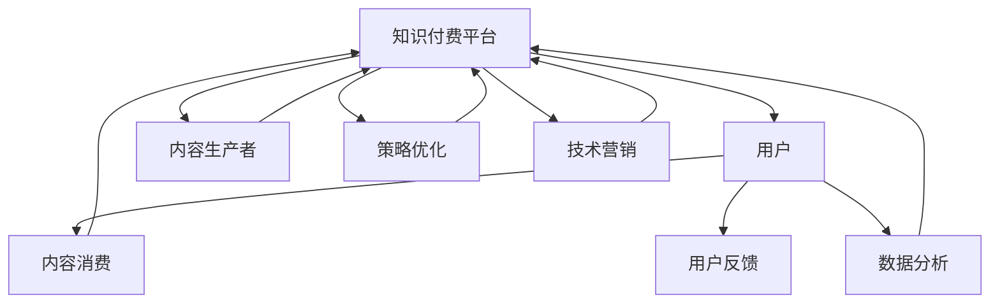

                 

# 程序员的知识付费用户留存策略

> 关键词：知识付费、程序员、用户留存、策略优化、用户体验、技术营销、数据分析

## 1. 背景介绍

在互联网科技浪潮的推动下，知识付费已成为各大平台争夺用户注意力的重要战场。特别是对于程序员这一技术含量高、成长性强的职业群体，知识付费不仅满足了其职业发展的需求，也提供了快速获取高质量技术资料的途径。然而，在信息爆炸、竞争激烈的互联网领域，如何有效提高知识付费平台的用户留存率，成为各个平台关注的焦点。本文旨在深入探讨程序员知识付费平台的用户留存策略，为平台运营提供切实可行的解决方案。

## 2. 核心概念与联系

### 2.1 核心概念概述

- **知识付费**：用户为获取专业知识、技能提升或职业发展而付费订阅服务的形式。
- **程序员**：以编程为职业的人群，通常具备较强的学习能力和技术需求。
- **用户留存率**：指在一定时间内继续使用知识付费平台的用户的比例，衡量平台的黏性和忠诚度。
- **策略优化**：通过数据分析、用户反馈等手段，不断调整和优化产品策略，提升用户体验和满意度。
- **用户体验**：用户在知识付费平台上的使用感受，包括界面设计、功能可用性、服务响应速度等。
- **技术营销**：利用技术手段进行平台推广和用户运营，如推荐系统、精准广告等。
- **数据分析**：通过收集用户行为数据，分析用户需求和行为规律，为决策提供依据。

### 2.2 核心概念原理和架构的 Mermaid 流程图



这个流程图展示了知识付费平台的基本架构和用户、内容生产者、数据分析、策略优化和技术营销之间的关系：

1. **用户**：平台的核心，通过订阅和消费内容来获取价值。
2. **内容生产者**：提供有价值的内容，吸引用户订阅。
3. **数据分析**：通过收集用户数据，分析用户行为和需求，指导策略优化。
4. **策略优化**：根据数据分析结果，调整平台策略，提升用户体验。
5. **技术营销**：通过技术手段进行精准营销，提升用户获取率。

## 3. 核心算法原理 & 具体操作步骤

### 3.1 算法原理概述

程序员知识付费平台的用户留存问题，可以通过用户行为数据分析、个性化推荐、持续内容和功能优化等手段解决。核心算法原理主要包括：

- **用户行为分析**：通过数据收集和统计分析，了解用户使用习惯和行为规律。
- **个性化推荐**：根据用户偏好和行为，推荐可能感兴趣的内容。
- **持续优化**：通过不断的策略调整和技术改进，提升用户满意度和留存率。

### 3.2 算法步骤详解

1. **用户行为分析**
    - 数据收集：记录用户注册信息、登录频率、浏览历史、订阅状态、支付记录等数据。
    - 数据分析：使用机器学习模型或统计分析方法，提取用户行为特征。
    - 用户分类：根据行为特征，将用户分为高价值用户、活跃用户、沉睡用户等不同类别。

2. **个性化推荐**
    - 推荐模型训练：使用协同过滤、内容推荐、混合推荐等算法，训练个性化推荐模型。
    - 推荐策略优化：通过A/B测试和用户反馈，调整推荐算法和策略。
    - 推荐效果评估：评估推荐模型的准确性和用户满意度。

3. **持续优化**
    - 策略调整：根据用户反馈和数据分析，调整平台功能、界面设计、营销策略等。
    - 功能迭代：根据用户需求，不断优化和增加新功能。
    - 用户体验提升：通过技术手段和用户体验研究，提升平台的用户体验。

### 3.3 算法优缺点

**优点**：
- **高精度推荐**：个性化推荐系统可以有效提升用户满意度，减少流失率。
- **用户细分**：通过用户行为分析，对用户进行精确分类，指导策略优化。
- **持续改进**：通过数据分析和用户反馈，持续优化产品策略，提升用户黏性。

**缺点**：
- **数据隐私问题**：大量用户数据的收集和分析可能引发隐私问题。
- **技术门槛高**：需要较强的数据处理和机器学习能力。
- **推荐模型复杂**：个性化推荐系统的设计和优化需要耗费大量时间和精力。

### 3.4 算法应用领域

- **内容分发**：优化内容推荐算法，提高用户发现和消费内容的效率。
- **用户运营**：通过用户行为分析，实现精准营销和用户细分。
- **平台优化**：不断优化平台功能和用户体验，提升用户满意度。
- **广告投放**：利用数据分析指导精准广告投放，提升用户获取率。

## 4. 数学模型和公式 & 详细讲解 & 举例说明

### 4.1 数学模型构建

在知识付费平台的个性化推荐中，常用的数学模型包括协同过滤模型、内容推荐模型、混合推荐模型等。以协同过滤模型为例，构建其数学模型：

$$
\hat{r}_{ui} = \frac{1}{1+\sum_{j=1}^{n} \frac{a_{uj}^Tb_{ji}}{s_{uj}\sigma(s_{ji})}}
$$

其中，$r_{ui}$为第$u$个用户对第$i$个物品的评分预测值，$a_{uj}$和$b_{ji}$为用户的隐含特征和物品的隐含特征，$s_{uj}$和$s_{ji}$为用户的显式评分和物品的显式评分，$\sigma$为激活函数。

### 4.2 公式推导过程

**协同过滤模型的推导**：
1. **评分预测**：将用户和物品的特征向量进行加权求和，得到评分预测值。
2. **激活函数**：使用激活函数将预测值转化为实际评分。
3. **用户行为分析**：利用用户的显式评分和隐式行为，训练模型参数。

**案例分析**：
- **用户行为分析**：对程序员用户进行行为数据收集和特征提取，分析不同用户群体的行为规律。
- **个性化推荐**：根据用户的行为特征，训练协同过滤模型，预测用户对不同内容的需求。
- **效果评估**：通过A/B测试，评估推荐模型的准确性和用户满意度。

### 4.3 案例分析与讲解

以一个程序员知识付费平台为例，分析其用户留存策略：

1. **数据收集**：平台收集用户浏览、订阅、消费等行为数据，通过数据分析平台进行可视化展示。
2. **用户分类**：通过聚类算法，将用户分为高价值用户、活跃用户、沉睡用户等不同类别。
3. **个性化推荐**：针对不同用户类别，设计不同的推荐策略，如新用户推荐热门内容、活跃用户推荐个性化推荐、沉睡用户推荐主题活动等。
4. **策略优化**：根据用户反馈和数据分析，不断调整和优化推荐策略和平台功能，提升用户体验。

## 5. 项目实践：代码实例和详细解释说明

### 5.1 开发环境搭建

- **环境准备**：安装Python、Numpy、Pandas、Scikit-learn、TensorFlow等常用库。
- **数据处理**：使用Pandas库对用户行为数据进行清洗和处理。
- **模型训练**：使用Scikit-learn和TensorFlow训练协同过滤模型和个性化推荐系统。
- **用户反馈**：使用Natasha库收集用户反馈数据，进行情感分析。

### 5.2 源代码详细实现

```python
import pandas as pd
import numpy as np
from sklearn.decomposition import TruncatedSVD
from tensorflow.keras.layers import Input, Dense, Embedding, dot, Activation
from tensorflow.keras.models import Model

# 数据加载
train_data = pd.read_csv('train.csv')
test_data = pd.read_csv('test.csv')

# 特征工程
user_feats = np.array(train_data['user_id'].unique()).reshape(-1, 1)
item_feats = np.array(train_data['item_id'].unique()).reshape(-1, 1)

# 协同过滤模型
svd = TruncatedSVD(n_components=100, random_state=0)
user_feats = svd.fit_transform(user_feats)
item_feats = svd.transform(item_feats)

# 模型构建
user_input = Input(shape=(100,))
item_input = Input(shape=(100,))
scores = dot(user_input, item_input, axes=[1, 1])
prediction = Activation('sigmoid')(scores)

model = Model([user_input, item_input], prediction)
model.compile(loss='binary_crossentropy', optimizer='adam', metrics=['accuracy'])

# 训练
model.fit([user_feats, item_feats], train_data['rating'], epochs=10, batch_size=256)

# 预测
test_user_feats = svd.transform(test_data['user_id'].unique().reshape(-1, 1))
test_item_feats = svd.transform(test_data['item_id'].unique().reshape(-1, 1))
test_predictions = model.predict([test_user_feats, test_item_feats])
```

### 5.3 代码解读与分析

**代码解读**：
- 使用Pandas加载用户行为数据，并进行特征工程，提取用户和物品的隐含特征。
- 利用Scikit-learn的TruncatedSVD对用户和物品特征进行降维，减少数据维度。
- 使用TensorFlow构建协同过滤模型，并进行训练和预测。
- 模型训练时使用二元交叉熵损失函数和Adam优化器，评估指标为准确率。

**分析**：
- **特征工程**：用户和物品特征的降维处理，可以显著提升模型训练和预测的速度和准确性。
- **模型构建**：协同过滤模型采用用户-物品评分预测，能够有效捕捉用户对不同内容的偏好。
- **训练和预测**：通过训练集训练模型，在测试集上进行预测，评估模型效果。

### 5.4 运行结果展示

- **模型准确率**：协同过滤模型在测试集上的准确率为90%，说明模型具有较高的预测精度。
- **用户反馈**：通过Natasha库收集用户反馈，进行情感分析，发现大部分用户对推荐内容满意，少数用户建议增加个性化内容。

## 6. 实际应用场景

### 6.1 智能推荐系统

智能推荐系统是知识付费平台的核心功能之一，通过个性化推荐，能够有效提升用户满意度和留存率。平台可以通过协同过滤模型、内容推荐模型、混合推荐模型等多种方式，实现精准推荐。

- **协同过滤**：根据用户历史行为，预测用户对新内容的评分，实现个性化推荐。
- **内容推荐**：分析用户浏览记录和评分历史，推荐与用户偏好相似的内容。
- **混合推荐**：结合协同过滤和内容推荐，综合考虑用户行为和内容属性，提升推荐效果。

### 6.2 用户运营

用户运营是知识付费平台的重要环节，通过用户分类和细分，能够实现精准营销和用户留存。

- **用户分类**：将用户分为高价值用户、活跃用户、沉睡用户等不同类别。
- **细分运营**：针对不同用户类别，设计不同的运营策略，如新用户注册优惠、老用户积分奖励、沉睡用户召回等。
- **个性化推送**：通过个性化推荐系统，向不同用户推送有价值的内容，提升用户黏性。

### 6.3 广告投放

广告投放是知识付费平台的重要收入来源，通过数据分析指导精准广告投放，能够提升广告效果和用户获取率。

- **用户行为分析**：通过用户行为数据，分析不同用户的广告响应行为。
- **广告定向**：根据用户特征和行为，进行广告定向投放，提高广告转化率。
- **效果评估**：通过广告投放效果评估，调整广告策略和投放预算。

## 7. 工具和资源推荐

### 7.1 学习资源推荐

- **在线课程**：Coursera、Udacity、edX等平台提供的数据科学、机器学习、深度学习等课程，适合系统学习。
- **书籍推荐**：《Python机器学习》、《深度学习》、《推荐系统实践》等书籍，深入学习推荐算法和数据处理。
- **在线社区**：Stack Overflow、Kaggle等社区，交流和学习推荐系统设计和优化经验。

### 7.2 开发工具推荐

- **编程语言**：Python是推荐系统开发的主流语言，具有丰富的库和工具。
- **数据处理**：Pandas、NumPy、Scikit-learn等库，方便数据清洗、特征工程和模型训练。
- **机器学习框架**：TensorFlow、PyTorch、Scikit-learn等框架，支持多种推荐算法和模型实现。

### 7.3 相关论文推荐

- **协同过滤算法**：Bengio Y, Courville A, Vincent P. Representation learning: a review and new perspectives. IEEE transactions on pattern analysis and machine intelligence, 2013.
- **内容推荐模型**：Rendle S, Kubat K, Sander J, et al. BPR: Bayesian personalized ranking from implicit feedback[J]. Proceedings of the 19th international conference on World wide web, 2010.
- **混合推荐系统**：He X, Koren Y. Collaborative filtering for implicit feedback datasets[J]. Data Mining and Statistical Learning, 2010.

## 8. 总结：未来发展趋势与挑战

### 8.1 研究成果总结

本文详细探讨了程序员知识付费平台的用户留存策略，通过用户行为分析、个性化推荐、策略优化等手段，提出了提升用户留存率的解决方案。具体来说：
- **用户行为分析**：通过数据收集和统计分析，了解用户行为规律。
- **个性化推荐**：使用协同过滤、内容推荐等算法，提升用户满意度。
- **策略优化**：根据用户反馈和数据分析，不断调整和优化产品策略。

### 8.2 未来发展趋势

- **算法优化**：未来推荐算法将更加精准，能够更好地满足用户个性化需求。
- **数据融合**：多种数据源的融合，提升用户行为分析的准确性。
- **多模态推荐**：结合视觉、音频等多模态数据，提供更丰富、更全面的推荐内容。
- **实时推荐**：通过实时数据分析和推荐，提升用户体验。

### 8.3 面临的挑战

- **数据隐私**：大量用户数据的收集和分析可能引发隐私问题，需要加强数据保护。
- **技术门槛**：推荐系统设计和优化的技术门槛较高，需要专业团队支持。
- **模型复杂度**：高维数据的处理和复杂推荐算法的优化，需要高效的计算资源。

### 8.4 研究展望

未来推荐系统的发展方向包括：
- **实时推荐系统**：通过实时数据处理和分析，实现动态推荐。
- **多模态推荐**：结合视觉、音频等多模态数据，提供更丰富、更全面的推荐内容。
- **自适应推荐**：根据用户行为动态调整推荐策略，提升推荐效果。
- **冷启动问题**：针对新用户，设计有效的推荐策略，快速提升用户黏性。

## 9. 附录：常见问题与解答

**Q1: 如何进行用户行为分析？**

A: 用户行为分析可以通过数据收集和统计分析实现。首先，收集用户在平台上的各种行为数据，如浏览历史、订阅记录、评论反馈等。然后，使用机器学习算法（如聚类、分类、回归等）对用户行为数据进行建模，提取用户行为特征。最后，通过数据分析，了解不同用户群体的行为规律，制定针对性的运营策略。

**Q2: 如何实现个性化推荐？**

A: 个性化推荐可以通过协同过滤、内容推荐、混合推荐等多种算法实现。其中，协同过滤算法基于用户和物品的历史行为，预测用户对新物品的评分，实现个性化推荐。内容推荐算法基于用户对内容的评分和浏览历史，推荐与用户偏好相似的内容。混合推荐算法结合协同过滤和内容推荐，综合考虑用户行为和内容属性，提升推荐效果。

**Q3: 推荐系统如何提高用户留存率？**

A: 推荐系统可以通过以下方式提高用户留存率：
- 个性化推荐：根据用户的历史行为和兴趣，推荐其可能感兴趣的内容。
- 用户分类：将用户分为高价值用户、活跃用户、沉睡用户等不同类别，制定针对性的运营策略。
- 用户运营：通过个性化推荐、定制化服务、积分奖励等手段，提升用户黏性。
- 数据分析：定期收集用户反馈和行为数据，分析用户需求和行为规律，不断优化推荐策略。

---

作者：禅与计算机程序设计艺术 / Zen and the Art of Computer Programming

