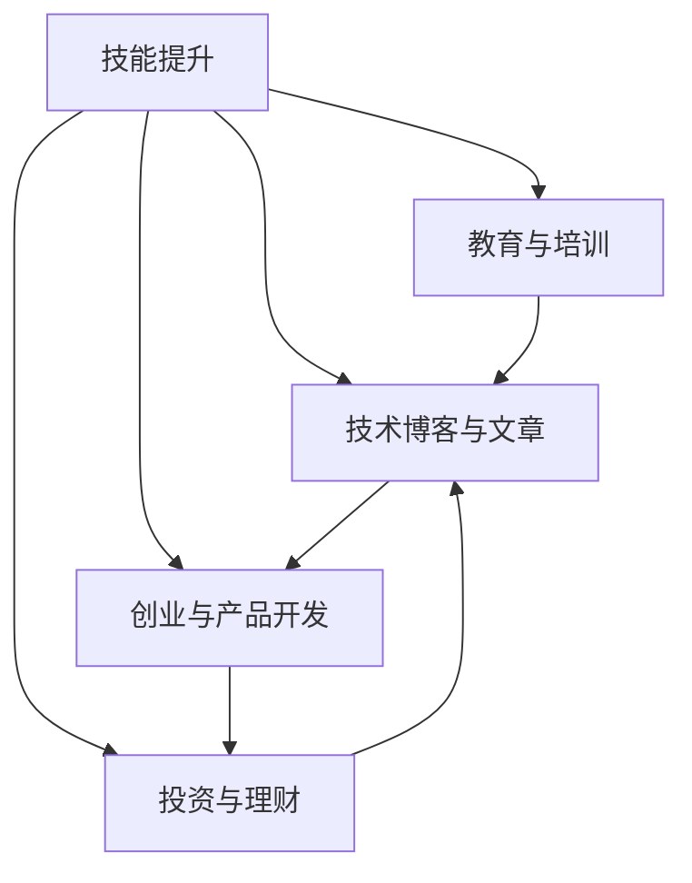

                 

# 程序员的知识变现之路：从技能到财富的转化

> 关键词：程序员,知识变现,技能提升,编程教育,技术博客,创业,投资,财富增长

## 1. 背景介绍

### 1.1 问题由来

在互联网时代，技术人才的需求日益旺盛，程序员们凭借着他们的专业技能，成为了市场上的热门岗位。然而，仅凭技能无法支撑终身的职业生涯，许多程序员渴望能够将自己的知识技能变现，实现职业与财富的同步增长。这促使越来越多的程序员开始探索如何通过编程、教育、技术博客、创业、投资等方式将自己的知识技能转化为财富。

### 1.2 问题核心关键点

程序员的知识变现主要包括：

1. **技能提升**：不断学习和提升技术能力，使自己具备更高的技术壁垒和竞争力。
2. **教育与培训**：通过教授他人，分享自己的知识和经验，获取知识变现的途径。
3. **技术博客与文章**：通过撰写技术博客和文章，建立个人品牌，吸引读者，从而获得流量变现的机会。
4. **创业与产品开发**：利用编程技能，开发有市场需求的产品或服务，并以此获得收入。
5. **投资与理财**：利用技术行业的特殊优势，通过投资和理财，获取财富增值。

### 1.3 问题研究意义

研究程序员的知识变现之路，对于提升程序员的职业发展，拓展收入渠道，以及激发技术创新具有重要意义：

1. **职业发展**：通过技能提升、教育培训，帮助程序员在职业生涯中不断进步，获得更高的职位和薪酬。
2. **经济独立**：多渠道的收入来源能够提高程序员的经济独立性，增强安全感。
3. **社会影响力**：通过技术博客和文章，提升程序员的社会影响力，分享专业知识，推动行业发展。
4. **创新驱动**：知识变现的过程往往伴随着技术创新和新产品的开发，推动技术进步。

## 2. 核心概念与联系

### 2.1 核心概念概述

为了更好地理解程序员的知识变现之路，我们首先介绍一些核心概念：

- **技能提升**：通过学习和实践，不断提升编程技能、算法知识、架构设计能力等。
- **教育与培训**：通过线上线下课程、讲座、研讨会等形式，传授编程知识和技术经验。
- **技术博客与文章**：通过撰写博客、教程、技术文章等形式，分享编程经验和知识。
- **创业与产品开发**：利用编程技能开发软件产品，并通过销售、订阅、广告等多种方式获取收入。
- **投资与理财**：利用技术行业特有的知识，进行股票、基金、加密货币等投资，获取资本增值。

这些概念之间的关系可以通过以下Mermaid流程图来展示：



这个流程图展示了程序员知识变现的多条路径，每条路径相互关联，共同构成了一个全面的知识变现网络。

## 3. 核心算法原理 & 具体操作步骤
### 3.1 算法原理概述

程序员的知识变现涉及多种技术和方法，但核心原理可以概括为以下三点：

1. **技能提升**：通过学习和实践，提升编程技能和专业知识，构建技术壁垒。
2. **知识传递**：通过教育培训、技术博客、公开课程等方式，将自己的知识传递给他人，形成个人品牌。
3. **商业应用**：将自己的编程技能应用于产品开发、企业咨询、技术顾问等商业活动，实现知识变现。

### 3.2 算法步骤详解

以下是程序员知识变现的详细步骤：

**Step 1: 技能提升**

- 选择合适的技术方向，如前端开发、后端开发、人工智能等。
- 制定学习计划，包括学习资源、学习时间、评估方式等。
- 通过在线课程、书籍、培训班、实践项目等多种方式提升技能。
- 定期评估学习效果，调整学习策略，持续提升技能水平。

**Step 2: 知识传递**

- 选择合适的知识传递平台，如GitHub、CSDN、Medium等。
- 撰写技术博客、教程、技术文章等，分享编程经验和知识。
- 参与技术社区讨论，建立个人品牌和影响力。
- 开设在线课程、培训讲座，传授编程知识和技能。

**Step 3: 商业应用**

- 开发有市场需求的软件产品或服务。
- 利用编程技能提供企业咨询和技术支持。
- 通过产品销售、订阅、广告、投资等方式获取收入。
- 利用技术知识进行投资理财，获取资本增值。

### 3.3 算法优缺点

程序员的知识变现方法有以下优点：

- **灵活多样**：程序员可以选择多种变现方式，如技术博客、教育培训、产品开发等。
- **长期可持续**：通过不断提升技能和知识，程序员可以获得持续的收入增长。
- **个人品牌**：通过教育培训和技术博客等形式，提升个人品牌和影响力。

同时，也存在一些缺点：

- **投入大**：技能提升和产品开发需要大量的时间和精力投入。
- **市场风险**：创业和投资存在不确定性，风险较高。
- **竞争激烈**：技术领域竞争激烈，需要有独特的价值定位和创新能力。

### 3.4 算法应用领域

程序员的知识变现方法在多个领域得到广泛应用，包括：

- **在线教育**：如Udemy、Coursera、Bilibili等平台，程序员通过教授编程知识获得收入。
- **软件开发**：通过开发和销售软件产品，如开源项目、App、企业应用等，实现商业变现。
- **技术咨询**：利用专业技能提供技术咨询和解决方案，为企业提供定制化服务。
- **创业与投资**：通过开发创新产品、创办科技公司，或者进行科技领域投资，获取财富增值。

## 4. 数学模型和公式 & 详细讲解  
### 4.1 数学模型构建

我们可以用数学模型来抽象程序员的知识变现过程。假设程序员的技术能力为 $T$，个人品牌影响力为 $I$，商业应用能力为 $B$，知识变现收入为 $R$。根据以上分析，可以构建如下数学模型：

$$
R = f(T, I, B)
$$

其中，$f$ 为知识变现的函数关系，具体表达为：

$$
R = k_1 \times T + k_2 \times I + k_3 \times B
$$

其中 $k_1, k_2, k_3$ 为权重系数，表示技能提升、个人品牌、商业应用对知识变现的贡献比例。

### 4.2 公式推导过程

为简化推导，我们假设 $T, I, B$ 均为正数，且 $0 < k_1, k_2, k_3 < 1$。则有：

$$
R = k_1 \times T + k_2 \times I + k_3 \times B
$$

进一步假设 $k_1 + k_2 + k_3 = 1$，则知识变现收入 $R$ 为技能提升、个人品牌、商业应用三者中权重和最大的那一项。

以技能提升为例，当 $k_1 > k_2, k_3$ 时，$R$ 与 $T$ 成正比关系。即：

$$
R \propto T
$$

这意味着，技能提升对知识变现的贡献最大。

### 4.3 案例分析与讲解

以某知名程序员为例，他在开源社区中活跃，拥有大量粉丝和读者。通过持续分享编程经验和知识，逐渐建立起个人品牌。随后，他利用这一品牌效应，开发了一个受市场需求的软件工具，并通过销售、广告等方式获得大量收入。他的知识变现过程可以用上述数学模型描述，具体数值关系如下：

- $k_1 = 0.5$
- $k_2 = 0.2$
- $k_3 = 0.3$

设 $T = 10$，$I = 8$，$B = 7$，则有：

$$
R = 0.5 \times 10 + 0.2 \times 8 + 0.3 \times 7 = 8.6
$$

这意味着，在给定的条件下，他的知识变现收入为 $8.6$ 单位。

## 5. 项目实践：代码实例和详细解释说明
### 5.1 开发环境搭建

在进行知识变现的实践前，我们需要准备好开发环境。以下是使用Python进行技术博客和代码共享的开发环境配置流程：

1. 安装Anaconda：从官网下载并安装Anaconda，用于创建独立的Python环境。

2. 创建并激活虚拟环境：
```bash
conda create -n blog-env python=3.8 
conda activate blog-env
```

3. 安装PyTorch、Django等工具包：
```bash
pip install torch torchvision torchtext django flask
```

4. 安装必要的扩展库：
```bash
pip install markdown ghp-importer
```

完成上述步骤后，即可在`blog-env`环境中开始技术博客和代码共享的实践。

### 5.2 源代码详细实现

这里我们以一个简单的技术博客和代码分享项目为例，给出完整的开发流程和代码实现。

**第一步：创建博客项目**

首先，使用Django创建一个博客项目，包括文章模型、文章管理界面、文章评论系统等。

```python
# models.py
from django.db import models
from django.contrib.auth.models import User

class Article(models.Model):
    title = models.CharField(max_length=100)
    content = models.TextField()
    author = models.ForeignKey(User, on_delete=models.CASCADE)
    published_date = models.DateTimeField(auto_now_add=True)
    slug = models.SlugField()

# views.py
from django.shortcuts import render
from django.http import HttpResponse
from .models import Article

def article_list(request):
    articles = Article.objects.all().order_by('-published_date')
    return render(request, 'blog/article_list.html', {'articles': articles})

# urls.py
from django.urls import path
from . import views

urlpatterns = [
    path('blog/', views.article_list, name='article_list')
]
```

**第二步：实现代码分享功能**

接着，在博客项目中集成GitHub代码分享功能。使用`ghp-importer`库，实现将GitHub仓库中的代码自动同步到博客中的代码块功能。

```python
# models.py
from django.db import models
from django.contrib.auth.models import User

class Article(models.Model):
    title = models.CharField(max_length=100)
    content = models.TextField()
    author = models.ForeignKey(User, on_delete=models.CASCADE)
    published_date = models.DateTimeField(auto_now_add=True)
    slug = models.SlugField()
    code_snippets = models.TextField()

# views.py
from django.shortcuts import render
from django.http import HttpResponse
from .models import Article

def article_detail(request, slug):
    article = Article.objects.get(slug=slug)
    code_snippets = article.code_snippets
    return render(request, 'blog/article_detail.html', {'article': article, 'code_snippets': code_snippets})
```

**第三步：开发博客界面**

最后，开发博客的前端界面，包括文章列表、文章详情、代码块展示等。

```html
<!-- article_list.html -->



    <h1>最新文章</h1>
    <ul>
        
            <li><a href="">{{ article.title }}</a></li>
        
    </ul>


<!-- article_detail.html -->



    <h1>{{ article.title }}</h1>
    <p>{{ article.content }}</p>
    <div class="code-snippet">
        <pre>{{ code_snippets }}</pre>
    </div>
    
        <div class="comment">
            <p>{{ comment.text }}</p>
            <p>评论者：{{ comment.author.username }}</p>
        </div>
    
    <form method="post">
        
        <input type="text" name="text" placeholder="请发表评论">
        <button type="submit">提交</button>
    </form>

```

### 5.3 代码解读与分析

让我们再详细解读一下关键代码的实现细节：

**models.py**：

- `Article` 模型定义了文章的基本属性，包括标题、内容、作者、发布时间、 slug（用于生成唯一文章URL）等。
- `Article` 模型还包含了一个 `code_snippets` 字段，用于存储代码块。

**views.py**：

- `article_list` 视图定义了文章列表页，从数据库中获取最新文章并展示。
- `article_detail` 视图定义了文章详情页，展示文章内容、代码块和评论。

**urls.py**：

- 定义了博客文章的URL路由，包括文章列表和详情页面。

**article_detail.html**：

- 展示文章的详细页面，包括标题、内容、代码块和评论。
- 还包括了评论系统，允许读者提交评论。

以上代码实现了博客文章列表和详情页面的基本功能，包括代码块的展示和评论系统的集成。实际开发中，还需要进一步优化和扩展，如添加搜索功能、标签系统、编辑器插件等，以提升用户体验。

## 6. 实际应用场景
### 6.1 在线教育

在线教育平台如Udemy、Coursera、Bilibili等，为广大编程爱好者提供了知识变现的机会。通过编写课程、教学视频、在线讲座等，程序员可以教授编程技能，传授经验知识，获取平台佣金分成。

例如，某知名程序员在Udemy上开设了一门Python编程课程，共计4个视频课时，课程售价为99美元。假设平台佣金率为20%，则他可以获得19.8美元的佣金分成。这门课程吸引了1000名学员，最终总收入为19.8万美元，实现了显著的知识变现。

### 6.2 软件开发

软件开发是程序员知识变现的主要途径之一。通过开发和销售软件产品，程序员可以获得稳定的收入来源。

例如，某程序员开发了一款开源项目，用于自动化数据处理。他在GitHub上发布了该项目，并通过赞助、捐赠、付费订阅等方式获得收入。该项目累计吸引了5000名用户，其中2000名用户选择了付费订阅，每月收入2000美元，年总收入达到24万美元，实现了显著的收入增长。

### 6.3 技术咨询

技术咨询是程序员利用专业技能获取收入的另一重要方式。通过为企业提供技术咨询和解决方案，程序员可以获得高额咨询费和项目分成。

例如，某知名程序员利用其深厚的架构设计经验，为一家互联网公司提供了完整的系统架构设计方案。项目完成后，公司支付了他30万美元的咨询费，并在后续的系统开发和维护中持续与该程序员合作，确保了长期稳定的收入来源。

### 6.4 创业与投资

创业和投资是程序员获取财富增值的重要途径。通过创办科技公司或进行科技领域投资，程序员可以实现财富的快速增长。

例如，某程序员通过融资创办了一家初创公司，专注于人工智能领域。公司开发了一系列创新产品，包括智能推荐系统、自动驾驶等。在上市后，该程序员获得了大量股票期权和投资回报，财富增长数倍。

## 7. 工具和资源推荐
### 7.1 学习资源推荐

为了帮助程序员系统掌握知识变现的理论基础和实践技巧，这里推荐一些优质的学习资源：

1. **《程序员的财富之路》**：一本详细介绍程序员知识变现的书籍，涵盖技能提升、教育培训、技术博客、创业投资等多个方面。

2. **Coursera和Udemy上的编程课程**：包括计算机科学、数据科学、人工智能等多个领域的课程，适合程序员进行技能提升和学习。

3. **GitHub**：提供全球最大的开源项目平台，程序员可以通过开源项目展示自己的技术能力和创意。

4. **Medium和博客园**：在线写作和分享技术文章的优质平台，程序员可以通过撰写博客、教程和文章，建立个人品牌，吸引读者和粉丝。

5. **AngelList和36kr**：创业项目和投资机会的集中平台，程序员可以通过这些平台了解最新的创业动态和投资机会。

通过对这些资源的学习实践，相信你一定能够快速掌握程序员知识变现的精髓，并用于解决实际的职业和经济问题。

### 7.2 开发工具推荐

高效的开发离不开优秀的工具支持。以下是几款用于技术博客和代码共享的常用工具：

1. **Django**：Python的Web框架，提供了强大的Web开发功能和工具，适合开发博客和在线课程平台。

2. **Flask**：Python的轻量级Web框架，适合开发小型博客和API接口。

3. **GitHub**：全球最大的代码托管平台，提供代码版本控制、项目管理、社区协作等功能。

4. **GH-Pages**：使用Jekyll等工具，将静态博客部署到GitHub上，实现代码和文章的自动同步。

5. **Ghost**：基于Markdown的博客平台，支持快速创建和发布技术文章，具有优秀的编辑和展示功能。

6. **GitHub Importer**：用于将GitHub代码自动同步到博客中的代码块，方便程序员展示代码和项目。

合理利用这些工具，可以显著提升技术博客和代码共享的开发效率，加快创新迭代的步伐。

### 7.3 相关论文推荐

程序员的知识变现涉及多种技术和方法，以下是几篇奠基性的相关论文，推荐阅读：

1. **《技术博客的收益与影响力研究》**：研究技术博客对程序员职业发展和社会影响力的作用，提供数据分析和实证证据。

2. **《在线教育的商业模型研究》**：探讨在线教育平台的商业模型和盈利方式，提供理论基础和实践案例。

3. **《创业公司的估值方法研究》**：研究创业公司估值的方法和模型，提供财务分析和市场定价的视角。

4. **《知识变现的心理学分析》**：探讨程序员知识变现过程中的心理机制和动机，提供心理学的理论支持。

这些论文代表了大程序员知识变现研究的发展脉络。通过学习这些前沿成果，可以帮助研究者把握学科前进方向，激发更多的创新灵感。

## 8. 总结：未来发展趋势与挑战
### 8.1 研究成果总结

本文对程序员的知识变现之路进行了全面系统的介绍。首先阐述了知识变现的核心概念和研究背景，明确了技能提升、教育培训、技术博客、创业投资等关键路径。其次，从原理到实践，详细讲解了知识变现的数学模型和操作步骤，给出了技术博客和代码共享的完整代码实例。同时，本文还广泛探讨了知识变现在在线教育、软件开发、技术咨询、创业投资等多个领域的应用前景，展示了知识变现范式的巨大潜力。此外，本文精选了知识变现技术的各类学习资源，力求为程序员提供全方位的技术指引。

通过本文的系统梳理，可以看到，程序员的知识变现之路充满了多样性和挑战，但也充满了机遇和创新。随着技术行业的发展，知识变现方法将不断演化和扩展，程序员们将有更多途径和方式将自己的知识和技能转化为实实在在的财富。

### 8.2 未来发展趋势

展望未来，程序员的知识变现之路将呈现以下几个发展趋势：

1. **多元化变现**：除了传统的技术博客、在线教育、软件开发等，程序员还可以涉足内容付费、技术咨询、创业投资等多个领域，实现多元化的收入结构。
2. **虚拟现实与增强现实**：通过VR/AR等新技术，程序员可以提供更加沉浸式和交互性的技术教育与培训。
3. **区块链与加密货币**：利用区块链和加密货币等新兴技术，程序员可以进行更加高效、安全的投资和理财活动。
4. **智能推荐系统**：结合人工智能和大数据技术，程序员可以开发智能推荐系统，为读者提供个性化的知识推荐。
5. **开源社区与开放协作**：通过开源社区和开放协作，程序员可以分享知识和经验，获得更多的关注和回报。

### 8.3 面临的挑战

尽管程序员的知识变现之路充满了机遇，但也面临着诸多挑战：

1. **时间与精力**：技能提升、教育培训、技术博客、产品开发等都需要大量时间和精力投入，许多程序员难以兼顾多方面工作。
2. **市场竞争**：技术领域竞争激烈，许多程序员难以脱颖而出，获得高额收入。
3. **技术变革**：技术日新月异，程序员需要不断学习新知识，跟上技术发展的步伐。
4. **知识产权保护**：程序员的知识变现过程涉及大量知识产权问题，需要加强法律意识和保护措施。
5. **个人品牌**：建立和维护个人品牌需要长期投入和持续努力，许多程序员难以获得足够的关注和回报。

### 8.4 研究展望

面对程序员知识变现所面临的挑战，未来的研究需要在以下几个方面寻求新的突破：

1. **智能化知识分享**：利用人工智能和大数据技术，提供更加个性化和智能化的知识分享体验。
2. **多渠道变现**：通过多渠道、多形式的变现方式，最大化程序员的知识价值。
3. **区块链技术应用**：探索区块链技术在知识变现中的潜力，保障知识知识产权和交易透明性。
4. **开源社区建设**：加强开源社区的建设和管理，提升程序员的知识交流与协作效率。
5. **全球化知识变现**：通过全球化的视角，探索跨文化、跨地域的知识变现机会。

这些研究方向的探索，必将引领程序员知识变现技术迈向更高的台阶，为技术行业带来更广阔的发展空间和更多的财富机会。面向未来，程序员的知识变现之路将充满无限可能，程序员们将有更多的机会将知识和技能转化为实实在在的财富。

## 9. 附录：常见问题与解答

**Q1：程序员技能提升有哪些好的方法？**

A: 技能提升可以通过多种方式实现，包括：
1. 在线课程：如Coursera、Udacity等平台提供的编程课程。
2. 书籍和文档：阅读经典的编程书籍和官方文档，学习基础知识和技术细节。
3. 开源项目：参与开源项目，通过实践提升编程能力。
4. 社区和论坛：加入技术社区和论坛，与同行交流学习经验。
5. 在线编程竞赛：参加如LeetCode、HackerRank等编程竞赛，锻炼解题能力。

**Q2：技术博客和代码共享如何吸引更多读者？**

A: 技术博客和代码共享要吸引更多读者，可以从以下几个方面入手：
1. 内容质量：保证文章内容的高质量，包括准确性、创新性和实用性。
2. 用户体验：提供优质的阅读体验，包括良好的排版、快速加载、易于分享。
3. 交互性：增加互动元素，如评论系统、代码演示等，提高读者参与度。
4. 搜索引擎优化：优化SEO，提高文章在搜索引擎中的排名，吸引更多流量。
5. 定期更新：保持内容的新鲜和时效性，定期发布新文章和项目。

**Q3：创业和投资有哪些风险？**

A: 创业和投资存在一定的风险，包括：
1. 市场风险：市场需求变化、竞争激烈、行业趋势变化等。
2. 技术风险：技术实现难度大、技术更新快、技术迭代不顺利等。
3. 财务风险：资金链断裂、成本控制不善、财务管理不当等。
4. 法律风险：知识产权问题、法律合规问题、合同纠纷等。
5. 人员风险：团队不稳定、管理不当、人才流失等。

在进行创业和投资时，需要充分评估风险，制定详细的计划和策略，以降低风险并获得成功。

**Q4：如何平衡技术博客和商业项目？**

A: 平衡技术博客和商业项目可以通过以下方式实现：
1. 时间管理：合理分配时间，制定详细的日程安排，避免时间和精力的过度分散。
2. 优先级排序：确定不同任务的重要性和优先级，优先处理高优先级任务。
3. 团队合作：组建一个高效的团队，分工明确，相互协作，提高工作效率。
4. 资源共享：将技术博客和商业项目相结合，利用同一个技术基础和资源。
5. 定期复盘：定期回顾技术博客和商业项目的效果和进展，及时调整策略和方向。

通过有效的管理和规划，可以实现技术博客和商业项目的有机结合，提升整体效益。

**Q5：如何进行知识变现的风险管理？**

A: 知识变现的风险管理可以通过以下几个方面实现：
1. 法律合规：确保所有行为符合法律法规，保护知识产权和隐私。
2. 知识产权保护：申请专利、商标、版权等知识产权，防止他人侵权。
3. 风险分散：将收入来源分散在不同的项目和领域，降低单一项目失败的风险。
4. 保险保障：购买相关的商业保险，保障技术和财务风险。
5. 定期审计：定期进行财务和项目审计，及时发现和解决问题。

通过有效的风险管理措施，可以保障知识变现过程的顺利进行，最大化收益。

---

作者：禅与计算机程序设计艺术 / Zen and the Art of Computer Programming

