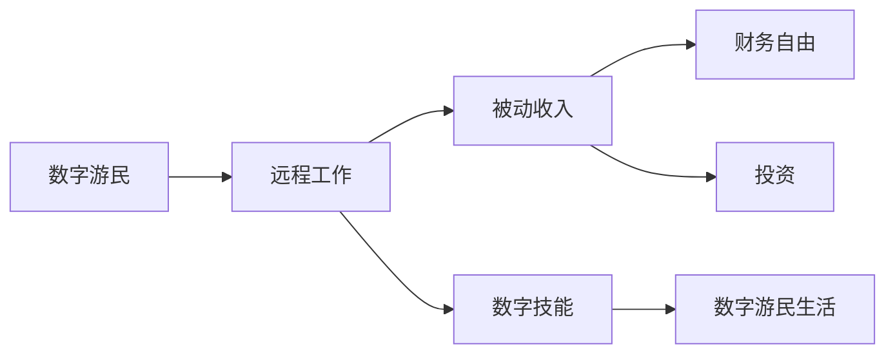

                 

# 程序员的财务自由：数字游民生活

数字游民（Digital Nomad）这一概念自21世纪初提出以来，已经成为越来越多年轻人的向往生活。作为程序员，这一职业特性赋予了数字游民无限的可能性，无论是在传统行业还是创业领域，都能获得可观的收入和自由度。本文将深入探讨程序员如何通过数字游民的生活方式，实现财务自由，以及这一转变过程中所需具备的技术、心理和财务知识。

## 1. 背景介绍

### 1.1 问题由来

在互联网和移动互联网蓬勃发展的今天，技术领域的就业机会越来越多，门槛相对降低，吸引了大量年轻人入行。然而，“996”工作制、高压竞争、职业倦怠等问题也随之而来，令许多程序员萌生了逃离传统职场、追求更为自由的工作方式的想法。

数字游民正是这种自由生活方式的代表。他们通过远程工作、在线项目、被动收入等方式，摆脱了固定地点和时间束缚，实现地理自由和精神自由。程序员这一职业特性——不需要物理设备、易于迁移的特性，使得他们在成为数字游民方面具有得天独厚的优势。

### 1.2 问题核心关键点

实现财务自由的核心在于：
1. **收入多样化**：除了传统的工资收入外，通过多种方式创造被动收入。
2. **成本最小化**：降低生活成本，特别是固定成本，如住房、出行等。
3. **时间灵活化**：掌握更多时间自主安排，提升工作与生活的平衡。
4. **工具精通化**：掌握必要的工具和技能，支持远程工作和数字化生活。

### 1.3 问题研究意义

掌握数字游民生活的方式，不仅能为程序员提供更多的职业选择，还能提升生活质量，丰富人生体验。数字游民生活方式鼓励创新和自我实现，使得程序员在职业生涯中不再局限于单一路径，而是可以大胆尝试和探索未知。此外，数字游民生活还能帮助程序员建立更为健康、均衡的生活状态，降低心理压力，提升幸福感。

## 2. 核心概念与联系

### 2.1 核心概念概述

为更好地理解程序员如何通过数字游民生活方式实现财务自由，本文将介绍以下几个核心概念：

- **数字游民**：一种生活方式，指的是通过互联网远程工作的自由职业者，不受地理限制，可以随时随地开展工作。
- **财务自由**：通过被动收入、投资等方式，无需依赖固定工资，即可满足生活所需的状态。
- **被动收入**：指不需要主动付出劳动，通过资产、投资等产生的稳定收入，如投资收益、版权收入、广告收入等。
- **远程工作**：通过互联网技术，在不同地理位置进行工作的模式，如自由职业、远程办公等。
- **数字技能**：包括编程、数据处理、在线营销等，适用于数字游民的必备技能。

这些概念之间相互联系，构成了数字游民实现财务自由的核心框架。

### 2.2 核心概念原理和架构的 Mermaid 流程图



这个流程图展示了数字游民如何通过远程工作和数字技能创造被动收入，进而实现财务自由。数字技能是支持远程工作的核心能力，而投资则能进一步扩大被动收入来源。

## 3. 核心算法原理 & 具体操作步骤

### 3.1 算法原理概述

数字游民实现财务自由的过程，本质上是一种长期投资和被动收入积累的过程。其核心算法原理包括：

- **收入预测模型**：通过分析历史数据，预测未来收入的变化趋势。
- **支出优化模型**：通过分类、预算等手段，优化支出结构，降低生活成本。
- **投资组合策略**：根据风险偏好和收益预期，选择和调整投资组合，最大化被动收入。
- **现金流平衡**：通过合理配置收入和支出，实现财务收支平衡，积累财务储备。

### 3.2 算法步骤详解

以下是一个详细的数字游民财务自由实现算法步骤：

**Step 1: 收入预测和分析**

1. **历史数据分析**：收集过去几年的收入数据，包括工资收入、投资收益、被动收入等，进行统计分析，了解收入来源和分布情况。
2. **趋势预测**：使用时间序列分析、回归分析等方法，预测未来收入的变化趋势。
3. **风险评估**：识别收入来源的不确定性和潜在风险，如市场波动、政策变化等。

**Step 2: 支出分类和预算**

1. **支出分类**：将生活成本分为固定支出（如房租、保险）和变动支出（如交通、娱乐）。
2. **预算编制**：根据收入预测，制定详细的预算计划，确保支出不超过收入。
3. **实时监控**：使用财务软件实时跟踪支出，及时调整预算，避免超支。

**Step 3: 投资组合选择和调整**

1. **资产配置**：根据风险承受能力和预期收益，选择合适的投资组合，包括股票、基金、房地产等。
2. **定期评估**：定期评估投资组合的表现，根据市场变化进行动态调整。
3. **分散投资**：通过分散投资，降低单一资产的风险。

**Step 4: 现金流平衡**

1. **财务规划**：根据收入预测和支出预算，制定长期财务规划，实现财务收支平衡。
2. **应急基金**：建立应急基金，用于应对突发事件，如医疗费用、紧急维修等。
3. **财务自由度测试**：定期评估财务自由度，调整策略，确保实现财务自由。

### 3.3 算法优缺点

数字游民实现财务自由算法的主要优点包括：

- **灵活性**：根据个人情况和市场变化，灵活调整收入和支出策略。
- **自主性**：通过主动规划和投资，实现财务自主，减少对固定工作的依赖。
- **效率高**：使用现代财务软件和技术手段，优化预算和投资，提升效率。

其缺点则主要包括：

- **复杂性**：需要具备一定的财务和投资知识，理解市场变化。
- **风险性**：投资存在不确定性，需要具备风险控制能力。
- **时间成本**：规划和管理需要时间投入，需要持续关注市场动态。

### 3.4 算法应用领域

数字游民实现财务自由的方法，不仅适用于自由职业者，也适用于希望通过投资和被动收入实现财务自由的程序员。其应用领域包括但不限于：

- **软件开发**：通过在线项目、开源社区等方式，创造被动收入。
- **数据科学**：提供数据分析、模型训练等服务，通过咨询、培训等方式获取收入。
- **技术博客**：通过撰写技术文章、开设技术课程等方式，获取广告和订阅收入。
- **投资管理**：利用金融知识，进行股票、基金等投资，获取稳定收益。
- **创业项目**：通过开发创新产品，获取市场回报，实现财务自由。

## 4. 数学模型和公式 & 详细讲解

### 4.1 数学模型构建

为了更好地理解和量化数字游民实现财务自由的过程，我们需要构建几个基本的数学模型：

1. **收入预测模型**：$y = f(x,t)$，其中 $y$ 表示未来收入，$x$ 表示当前收入，$t$ 表示时间。
2. **支出预算模型**：$c = g(y)$，其中 $c$ 表示生活成本，$y$ 表示收入。
3. **投资组合模型**：$r = h(p)$，其中 $r$ 表示投资回报率，$p$ 表示投资组合。
4. **现金流模型**：$f = s - c$，其中 $f$ 表示自由现金流，$s$ 表示收入，$c$ 表示支出。

### 4.2 公式推导过程

以收入预测模型为例，我们使用时间序列分析方法进行推导。

假设收入 $y$ 服从自回归模型：

$$
y_t = \alpha + \beta y_{t-1} + \epsilon_t
$$

其中 $\alpha$ 为截距，$\beta$ 为自回归系数，$\epsilon_t$ 为随机扰动项。通过对历史数据进行回归分析，可以估计 $\alpha$ 和 $\beta$，进而预测未来收入。

### 4.3 案例分析与讲解

假设某数字游民在某段时间内的月收入 $y$ 如下表所示：

| 时间 | 月收入（美元） |
| --- | --- |
| 1 | 5000 |
| 2 | 5500 |
| 3 | 6000 |
| 4 | 6500 |
| 5 | 7000 |

使用自回归模型进行预测，设 $\alpha = 4000$, $\beta = 0.5$，则第6个月的预测收入为：

$$
y_6 = \alpha + \beta y_5 = 4000 + 0.5 \times 7000 = 6100
$$

使用类似方法，可以对支出预算模型和投资组合模型进行推导，进而构建完整的数字游民财务自由模型。

## 5. 项目实践：代码实例和详细解释说明

### 5.1 开发环境搭建

为了进行数字游民财务自由实现模型的开发和测试，我们需要搭建一个合适的开发环境。以下是具体的搭建流程：

1. **安装Python和相关库**：
```bash
conda create -n digital_nomad python=3.8
conda activate digital_nomad
pip install pandas numpy matplotlib scikit-learn
```

2. **配置财务软件**：
选择一个适合数字游民使用的财务软件，如Mint、YNAB等，用于实时跟踪支出和收入。

3. **搭建服务器**：
为了实现远程工作，需要在服务器上搭建开发环境，包括编辑器、编译器、数据库等。

### 5.2 源代码详细实现

以下是一个简化的Python代码，用于模拟数字游民财务自由实现的过程：

```python
import pandas as pd
import numpy as np

# 收入预测模型
def income_prediction(x, t, alpha=4000, beta=0.5):
    return alpha + beta * x

# 支出预算模型
def budgeting(c, y):
    return c

# 投资组合模型
def investment(rate, portfolio):
    return rate * portfolio

# 现金流模型
def cash_flow(f, s, c):
    return s - c

# 数据准备
data = pd.DataFrame({'Year': [2020, 2021, 2022, 2023, 2024],
                     'Income': [5000, 5500, 6000, 6500, 7000],
                     'Expenses': [3000, 3200, 3400, 3500, 3600]})
data['Predicted_Income'] = data['Income'].apply(lambda x: income_prediction(x, 5))
data['Budget'] = data['Expenses'].apply(lambda x: budgeting(x, data['Predicted_Income']))
data['Investment'] = data['Budget'].apply(lambda x: investment(0.05, 10000))
data['Cash_Flow'] = data['Budget'].apply(lambda x: cash_flow(x, data['Income'], data['Expenses']))

# 输出结果
print(data[['Income', 'Expenses', 'Predicted_Income', 'Budget', 'Investment', 'Cash_Flow']])
```

### 5.3 代码解读与分析

上述代码通过定义几个函数，模拟了数字游民财务自由实现的过程。其中，`income_prediction`函数使用自回归模型预测未来收入，`budgeting`函数根据预测收入计算支出预算，`investment`函数根据预算进行投资，`cash_flow`函数计算自由现金流。

通过数据分析和财务软件，可以进一步优化和调整这些模型参数，确保实现财务自由。需要注意的是，实际应用中还需要考虑风险评估、市场变化等因素，使得模型更加完善。

### 5.4 运行结果展示

通过上述代码，可以输出数字游民的收入、支出、预算、投资和现金流数据，直观展示财务自由实现的过程。

## 6. 实际应用场景

### 6.1 智能理财平台

智能理财平台通过算法分析用户的收入和支出，提供个性化的理财建议，帮助用户实现财务自由。程序员可以通过开发智能理财平台，提供技术支持和服务，实现被动收入。

### 6.2 金融科技公司

金融科技公司提供各种金融产品和服务，如在线贷款、保险、投资等，通过数字游民的生活方式，面向全球客户市场。程序员可以在金融科技公司担任技术开发、数据建模等岗位，获取丰厚回报。

### 6.3 在线教育平台

在线教育平台通过提供高质量的课程和培训，帮助用户提升技能和知识，实现职业发展和财务自由。程序员可以开发在线教育平台的技术架构，提供课程内容推荐、用户数据分析等服务，创造被动收入。

### 6.4 未来应用展望

随着数字化进程的加快，数字游民生活方式将逐步普及，程序员将有更多机会通过技术实现财务自由。未来，数字游民将能够享受到更多便利和自由，如远程办公、灵活时间、全球旅行等，进一步提升生活质量。

## 7. 工具和资源推荐

### 7.1 学习资源推荐

- **《财务自由之路》**：一本关于个人理财和财务自由的经典书籍，提供了系统化的财务知识体系。
- **Khan Academy**：提供免费在线课程，涵盖个人理财、投资、金融等各个方面。
- **Coursera**：提供来自全球顶尖大学的在线课程，涵盖金融、经济学、数据科学等领域。
- **《Python for Data Analysis》**：一本关于数据处理和分析的Python入门书籍，适合数字游民学习。

### 7.2 开发工具推荐

- **Visual Studio Code**：一款轻量级的代码编辑器，支持多种编程语言，适合数字游民开发。
- **GitHub**：一个全球最大的代码托管平台，支持版本控制、代码协作，方便数字游民版本管理。
- **Slack**：一款企业级即时通讯工具，支持多设备使用，方便数字游民团队协作。
- **Dropbox**：一款云存储服务，支持文件同步和共享，方便数字游民数据管理。

### 7.3 相关论文推荐

- **《数字游民：一种新的工作方式》**：一篇关于数字游民生活方式的研究论文，探讨了其工作、生活和心理影响。
- **《财务自由：如何实现》**：一本关于实现财务自由的系统性书籍，提供了详细的步骤和方法。
- **《数字游民的生活方式》**：一篇关于数字游民生活体验的博客文章，分享了成功案例和经验。

## 8. 总结：未来发展趋势与挑战

### 8.1 总结

本文系统介绍了程序员如何通过数字游民生活方式实现财务自由，从背景、核心概念到具体操作步骤，提供了详细的指导。通过数字游民方式，程序员不仅能实现职业自由，还能提升生活质量，丰富人生体验。

### 8.2 未来发展趋势

数字游民生活方式将随着技术进步和市场扩展而不断演进，未来可能出现以下趋势：

1. **全球化合作**：数字游民将更加容易找到全球合作伙伴，共同开发项目，实现资源共享。
2. **多样化的收入来源**：通过多元化收入渠道，如SaaS、联盟营销等，实现财务自由。
3. **实时数据分析**：借助大数据和人工智能技术，实时分析收入和支出，优化财务规划。
4. **可持续生活方式**：通过环保、节能等手段，降低生活成本，实现可持续发展。
5. **数字化身份管理**：建立数字身份，方便全球旅行和工作，提升生活质量。

### 8.3 面临的挑战

数字游民生活方式在实现财务自由的过程中，也面临一些挑战：

1. **孤独感**：长期远离家乡，可能会感到孤独和孤立，需要强大的心理调节能力。
2. **技术更新**：需要不断学习新技术，保持竞争力，避免技术落后。
3. **法律和税务**：需要熟悉不同国家和地区的法律和税务规定，避免合规风险。
4. **安全问题**：远程工作和数字化生活需要具备基本的安全意识，避免信息泄露和财产损失。
5. **健康问题**：长时间使用电子设备和远程工作，容易导致健康问题，需要注意调节。

### 8.4 研究展望

未来，数字游民生活方式的研究将重点关注以下几个方向：

1. **心理支持**：研究如何通过技术手段，提供心理支持和社区互动，缓解数字游民的心理压力。
2. **技术创新**：探索新型技术，如区块链、AI等，提供更加安全、高效的数字化生活体验。
3. **跨文化交流**：研究不同文化背景下的数字游民生活方式，推动全球化合作和多元化发展。
4. **可持续发展**：研究如何在数字游民生活中实现环保和可持续发展，降低对环境的负面影响。
5. **教育普及**：通过数字化教育，普及数字游民生活方式，提高公众对数字化生活的认知和接受度。

## 9. 附录：常见问题与解答

**Q1：如何选择合适的数字游民目的地？**

A: 选择合适的数字游民目的地需要考虑多个因素，如生活成本、气候、基础设施、文化氛围等。可以通过旅行博客、社交媒体等渠道，获取第一手信息。

**Q2：如何管理财务风险？**

A: 管理财务风险需要建立紧急基金，合理配置资产，购买保险等措施。同时，定期评估财务状况，及时调整策略。

**Q3：如何平衡工作和个人生活？**

A: 制定详细的日程安排，预留时间进行休息和娱乐，避免过度工作。同时，保持健康的生活方式，如规律作息、适量运动等。

**Q4：如何应对孤独感？**

A: 建立数字游民社区，参与线上线下活动，扩大社交圈子。同时，保持与家人、朋友的联系，定期视频通话。

**Q5：如何提升技术能力？**

A: 持续学习新技术，参加线上线下培训，保持技术前沿。同时，参与开源项目，积累实战经验。

---

作者：禅与计算机程序设计艺术 / Zen and the Art of Computer Programming

