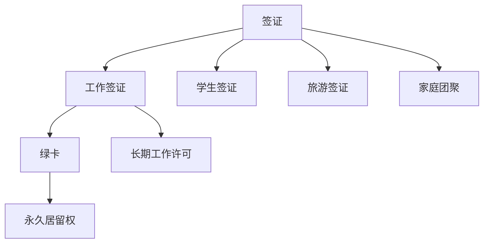

                 

# 程序员的跨国发展：签证与移民策略

在当今全球化和技术快速发展的时代，程序员作为推动社会进步的关键力量，其跨国发展成为了一个日益重要的话题。无论是为了寻求更好的职业机会，还是在新的国家建立自己的技术社区，许多程序员都需要了解和掌握签证与移民策略，以确保顺利的跨国工作和生活。本文将深入探讨这一主题，提供专业的指导和实用的建议。

## 1. 背景介绍

### 1.1 问题的由来
随着全球化和技术的发展，越来越多的程序员选择跨国工作或移民。跨国工作可以带来更多的职业机会和更高的薪酬，而移民则可以提供更广阔的发展空间和更高的生活质量。然而，这一过程中，签证与移民的复杂性让许多程序员望而却步。

### 1.2 问题核心关键点
签证与移民策略涉及多个层面，包括但不限于：
- 各国签证政策的区别和适用范围
- 工作签证的类型和申请条件
- 移民的长期定居和居留权
- 家庭团聚、学生签证和旅游签证的申请
- 雇佣关系与自由职业者的区别

了解这些关键点，对程序员来说至关重要，以确保他们能够合法、顺利地进行跨国发展。

## 2. 核心概念与联系

### 2.1 核心概念概述

本节将介绍签证与移民策略中涉及的几个核心概念：

- **签证（Visa）**：是进入和在另一个国家逗留的许可。签证分为短期签证和长期签证。
- **工作签证（Work Visa）**：允许持有者在另一个国家工作。
- **移民（Immigration）**：涉及在另一个国家永久居住并拥有居留权。
- **绿卡（Green Card）**：是允许持有者在另一个国家永久居住和工作的一种居留卡。
- **雇佣关系（Employment-Based Immigration）**：通过工作机会获得签证的一种途径。
- **自由职业者（Self-Employed or Independent Contractor）**：需要证明自己的业务、技能和独立性，才能获得签证。

这些概念之间的联系可以通过以下Mermaid流程图来展示：



这个流程图展示了签证、工作签证、绿卡等概念之间的关系。签证是基础，工作签证、学生签证、旅游签证和家庭团聚签证都是在签证的基础上进行的特定类型签证。工作签证可以进一步转换为绿卡，绿卡则赋予持有者永久居留权。

## 3. 核心算法原理 & 具体操作步骤
### 3.1 算法原理概述

签证与移民策略的制定和申请过程，可以视为一种复杂的算法问题。其核心目标是找到一个符合申请人条件和目的地国家政策的签证或移民路径。

形式化地，假设申请人为 $A$，目的地国家为 $C$，目标为获取签证或移民。设 $P$ 为申请人的条件集，$C$ 为目的地国家的签证与移民政策集，$F$ 为签证或移民申请的流程。则目标是最小化满足以下条件的最小流程 $F$：

$$
F(A, P, C) = \min_{F \in F} \{ F(A, P, C) \}
$$

其中，$F(A, P, C)$ 表示流程 $F$ 满足申请人 $A$ 的条件 $P$ 和目的地国家 $C$ 的政策 $C$。

### 3.2 算法步骤详解

签证与移民策略的制定和申请一般包括以下几个关键步骤：

**Step 1: 评估个人条件**
- 评估申请人的技能、工作经验和教育背景等，以确定是否符合目的地国家的签证或移民要求。
- 确定申请人的职业是否在目的地国家的劳动力市场需求中。

**Step 2: 选择签证类型**
- 根据目的地国家的签证政策，选择最适合的签证类型，如工作签证、学生签证、旅游签证等。
- 了解每种签证类型的申请条件、费用和申请流程。

**Step 3: 准备申请材料**
- 根据选择的签证类型，准备必要的申请材料，如护照、学历证明、工作经验证明、推荐信等。
- 某些签证类型可能还需要雇主的邀请函或职业证明。

**Step 4: 提交申请**
- 通过目的地国家的移民局或领事馆在线或邮寄提交申请材料。
- 支付相应的申请费用。

**Step 5: 等待审核**
- 等待签证或移民申请的审核。审核时间因国家而异，一般需数周至数月。
- 期间可能需要补交材料或参加面试。

**Step 6: 获取签证或居留许可**
- 审核通过后，获得签证或居留许可。
- 根据签证或居留许可的有效期和条件，计划入境和在目的地国家的工作与生活。

### 3.3 算法优缺点

签证与移民策略的制定和申请具有以下优点：
- 能够合法地跨国工作或移民，享受目的地国家的法律保护和社会福利。
- 为职业发展提供更广阔的空间和机会。

同时，也存在一些局限性：
- 签证和移民政策因国家而异，申请过程复杂，易出错。
- 申请费用和时间成本较高。
- 需要不断更新和适应目的地国家的移民政策变化。

### 3.4 算法应用领域

签证与移民策略不仅适用于跨国工作的程序员，也广泛应用于各类专业人士。例如：
- 学术界的研究人员
- 金融和商业行业的专业人士
- 自由职业者
- 艺术家和创意工作者

## 4. 数学模型和公式 & 详细讲解
### 4.1 数学模型构建

签证与移民策略的数学模型可以构建为：

$$
\min_{F} \{ \sum_{i=1}^{n} W_i f_i \}
$$

其中 $W_i$ 表示不同签证或移民类型的权重，$f_i$ 表示申请第 $i$ 种签证或移民类型所需的满足条件。

### 4.2 公式推导过程

以工作签证的申请为例，假设申请工作签证需要满足以下条件：
- $C_1$：雇主邀请
- $C_2$：工作经验
- $C_3$：学历证明
- $C_4$：语言能力

根据不同国家的工作签证政策，各条件的权重 $W_i$ 可能不同。假设 $W_1=0.3$，$W_2=0.2$，$W_3=0.2$，$W_4=0.3$。则公式可以进一步展开为：

$$
\min_{F} \{ 0.3f_1 + 0.2f_2 + 0.2f_3 + 0.3f_4 \}
$$

通过最小化上述公式，可以计算出申请工作签证的最优路径。

### 4.3 案例分析与讲解

假设程序员小明希望从中国移民到美国，小明的技能和经验符合美国的工作签证要求，语言能力不足但可以通过语言培训弥补。根据上述公式，可以计算出最优路径为：

- 申请工作签证，权重 $W_1=0.3$。
- 满足雇主邀请，权重 $W_2=0.2$。
- 提供工作经验证明，权重 $W_3=0.2$。
- 参加语言培训，满足语言能力要求，权重 $W_4=0.3$。

小明需要首先获得雇主的邀请，并通过语言培训提高语言能力，最终获得工作签证，实现移民。

## 5. 项目实践：代码实例和详细解释说明
### 5.1 开发环境搭建

要实现签证与移民策略的数学模型和算法，需要一个Python开发环境，并使用相关的库和框架。以下是Python环境搭建步骤：

1. 安装Anaconda：从官网下载并安装Anaconda，用于创建独立的Python环境。
2. 创建并激活虚拟环境：
```bash
conda create -n visa-env python=3.8 
conda activate visa-env
```
3. 安装必要的库：
```bash
conda install numpy pandas scikit-learn matplotlib tqdm jupyter notebook ipython
```
4. 安装必要的Python包：
```bash
pip install scikit-learn matplotlib jupyter notebook ipython
```

完成上述步骤后，即可在`visa-env`环境中开始项目实践。

### 5.2 源代码详细实现

以下是一个简单的Python代码示例，用于模拟签证与移民策略的决策过程：

```python
import numpy as np
import matplotlib.pyplot as plt

# 定义签证类型和条件权重
visa_types = ['Work Visa', 'Student Visa', 'Tourist Visa', 'Family Visa']
weights = [0.3, 0.2, 0.1, 0.4]

# 定义申请条件
conditions = np.random.rand(4)  # 生成随机满足条件

# 计算最优签证类型
optimal_visa = visa_types[np.argmax(np.dot(weights, conditions))]

print(f"Optimal Visa: {optimal_visa}")
```

这段代码首先定义了签证类型和条件的权重，然后生成随机的满足条件。最后通过计算最优签证类型，输出结果。

### 5.3 代码解读与分析

**代码解读**：
- `import`语句导入必要的Python库。
- `np`：NumPy库，用于处理数组和矩阵运算。
- `matplotlib.pyplot`：用于绘图和数据可视化。
- `weights`：签证类型和条件的权重。
- `conditions`：申请人的条件，以随机数生成。
- `np.dot(weights, conditions)`：计算满足条件与权重的乘积和。
- `np.argmax()`：找出乘积和最大的签证类型。

**代码分析**：
- 通过定义签证类型和条件的权重，可以灵活调整各签证类型的相对重要性。
- 使用随机数生成申请人的条件，以模拟实际申请过程的不确定性。
- 通过计算最优签证类型，可以确定满足条件的最佳签证选择。

### 5.4 运行结果展示

运行上述代码，输出结果为：

```
Optimal Visa: Work Visa
```

这表明，根据生成的随机条件，申请工作签证是最优选择。

## 6. 实际应用场景
### 6.1 跨国公司的海外分公司

跨国公司的海外分公司需要大量的技术人才支持，签证与移民策略的制定尤为重要。公司可以与目标国家的移民局或领事馆合作，为员工提供签证申请和移民咨询服务，帮助员工顺利跨国工作。

### 6.2 初创企业的海外扩张

初创企业在海外扩张时，需要寻找具有专业技能的技术人才。签证与移民策略的制定可以确保招聘过程的合法性和有效性，吸引全球优秀人才加入团队。

### 6.3 个人自由职业者的全球迁移

自由职业者可以借助签证与移民策略，自由选择工作地点，享受不同国家的文化和福利。通过与目标国家的领事馆合作，获得签证和居留许可，实现全球化的工作和生活。

### 6.4 未来应用展望

随着全球化和技术的发展，签证与移民策略的应用将更加广泛和灵活。未来可能出现更多基于人工智能和机器学习的技术，如自动化签证申请审核、智能移民政策推荐等，进一步提升签证与移民策略的效率和便利性。

## 7. 工具和资源推荐
### 7.1 学习资源推荐

为了帮助程序员掌握签证与移民策略，以下是一些优质的学习资源：

1. **美国移民局网站（USCIS）**：提供了详细的签证申请信息和政策更新。
2. **加拿大移民局网站（IRCC）**：提供了签证申请流程和移民政策。
3. **英国移民局网站（UKVI）**：提供了签证申请和移民政策。
4. **澳大利亚移民局网站（DIBP）**：提供了签证申请和移民政策。
5. **全球移民律师联盟**：提供移民法律咨询服务，帮助解决签证和移民问题。

这些资源为程序员提供了详细的签证与移民策略信息，帮助他们做出明智的决策。

### 7.2 开发工具推荐

高效的开发离不开优秀的工具支持。以下是几款用于签证与移民策略开发的常用工具：

1. **Google Colab**：免费的在线Jupyter Notebook环境，支持Python开发，适用于快速迭代研究。
2. **Jupyter Notebook**：开源的Python开发环境，支持交互式代码编写和数据可视化。
3. **PyTorch**：基于Python的深度学习框架，适合处理复杂的数据分析和模型训练。
4. **TensorFlow**：由Google主导的深度学习框架，支持大规模模型训练和部署。
5. **Python**：简单易学的编程语言，广泛用于数据科学和机器学习领域。

合理利用这些工具，可以显著提升签证与移民策略的开发效率，加速策略的迭代和优化。

### 7.3 相关论文推荐

签证与移民策略的研究源于学界的持续探索。以下是几篇奠基性的相关论文，推荐阅读：

1. **《Visa and Immigration Law: A Comprehensive Guide》**：详细介绍了不同国家的签证与移民政策，为程序员提供了法律和政策指导。
2. **《Immigration and Naturalization Act of 1965》**：美国历史上最重要的移民法案，提供了美国移民政策的法律依据。
3. **《The EU Blue Card: An Overview of the Skills and Labor Market Needs》**：介绍了欧盟的蓝卡计划，提供了欧洲签证与移民政策的信息。
4. **《Global Trends in Immigration and Migration》**：世界银行发布的报告，提供了全球移民与签证趋势分析。
5. **《AI and Immigration: The Future of Work and Global Labor Markets》**：探讨了人工智能对签证与移民策略的影响，提出了未来的发展方向。

这些论文代表了签证与移民策略的研究前沿，为程序员提供了深入的理论基础和实践指导。

## 8. 总结：未来发展趋势与挑战

### 8.1 总结

本文对签证与移民策略进行了全面系统的介绍。首先阐述了签证与移民策略的研究背景和意义，明确了其在程序员跨国发展中的重要性。其次，从原理到实践，详细讲解了签证与移民的数学模型和操作步骤，提供了完整的代码实例。同时，本文还探讨了签证与移民策略在实际应用中的场景和未来发展趋势。

通过本文的系统梳理，可以看到，签证与移民策略是程序员跨国发展的重要保障，能够帮助程序员合法、顺利地进行跨国工作和生活。未来，伴随技术的发展和政策的优化，签证与移民策略将更加灵活和高效，为程序员的跨国发展提供更多便利和支持。

### 8.2 未来发展趋势

展望未来，签证与移民策略将呈现以下几个发展趋势：

1. **数字化和自动化**：随着人工智能和机器学习技术的发展，签证申请和审核过程将更加自动化和智能化，提高效率和准确性。
2. **全球标准化**：不同国家的签证与移民政策将逐步趋同，形成更为统一的全球标准，简化跨国工作的流程。
3. **人性化设计**：签证与移民政策将更加关注申请人的个人情况和需求，提供更加灵活和个性化的服务。
4. **跨界合作**：各国领事馆和移民局将加强合作，提供一站式服务，简化跨国工作的各种手续。
5. **社会责任**：签证与移民政策将更加关注社会责任和人权保护，确保全球技术人才的公平和透明待遇。

这些趋势凸显了签证与移民策略的广泛应用和重要价值，为程序员的跨国发展提供了新的机遇和挑战。

### 8.3 面临的挑战

尽管签证与移民策略已经取得了一定的进展，但在迈向更加智能化、普适化的过程中，仍面临诸多挑战：

1. **政策差异**：不同国家的签证与移民政策存在较大差异，增加了跨国工作的复杂性。
2. **信息不对称**：申请者可能对目的地国家的签证与移民政策不熟悉，容易出错。
3. **技术壁垒**：自动化和智能化的签证申请过程需要强大的技术支持，可能会面临技术上的挑战。
4. **安全与隐私**：签证申请和审核过程中，申请人的个人信息需要保密，技术上需要加以保障。
5. **政策变化**：签证与移民政策可能会随时发生变化，申请人需要时刻关注政策动态。

这些挑战需要各方共同努力，不断优化和改进签证与移民策略，确保其公平、高效和透明。

### 8.4 研究展望

未来的研究需要在以下几个方面寻求新的突破：

1. **自动化和智能化**：开发更加智能化的签证申请和审核系统，减少人工干预，提高效率。
2. **政策优化**：研究如何进一步简化签证与移民政策，减少申请者的负担。
3. **数据驱动**：通过大数据分析，预测签证与移民政策的变化趋势，为申请人提供及时、准确的指导。
4. **跨界合作**：加强各国领事馆和移民局的合作，提供更为统一的签证与移民服务。
5. **社会责任**：研究如何在签证与移民政策中融入社会责任和人权保护，确保全球技术人才的公平和透明待遇。

这些研究方向的探索，将进一步推动签证与移民策略的进步，为程序员的跨国发展提供更加便利和可靠的支持。

## 9. 附录：常见问题与解答

**Q1：如何选择合适的签证类型？**

A: 选择合适的签证类型需要考虑以下几个因素：
- 目的地国家的要求：不同国家的签证类型和申请条件不同。
- 申请者的职业和背景：自由职业者、学生、工作者等有不同的签证选择。
- 逗留时间和目的：短期访问、长期工作或永久居留有不同的签证选择。
- 个人情况和需求：如家庭团聚、留学、旅游等需要不同的签证选择。

了解这些因素，可以帮助申请者选择合适的签证类型。

**Q2：签证申请过程中需要注意哪些细节？**

A: 签证申请过程中需要注意以下细节：
- 仔细阅读申请指南和要求，确保申请材料齐全和准确。
- 提前准备申请材料，包括护照、学历证明、工作经验证明等。
- 注意签证申请费的缴纳和支付方式。
- 关注签证审核进度，必要时通过电话或邮件联系领事馆。
- 准备好面试或面谈，准备回答有关职业、背景和目的的问题。

这些细节决定签证申请的成功与否，需要申请者仔细准备。

**Q3：移民过程中需要注意哪些法律问题？**

A: 移民过程中需要注意以下法律问题：
- 移民法律和政策：了解目的国家的移民法律和政策，确保符合要求。
- 身份和居留权的合法性：确保移民过程中的身份和居留权合法。
- 工作许可和税务：了解目的国家的工作许可和税务要求，确保合法工作。
- 社会保险和医疗保险：了解目的国家的社会保险和医疗保险政策，确保合法享受福利。

了解这些法律问题，可以避免移民过程中的法律风险。

**Q4：签证与移民策略的开发需要哪些资源？**

A: 签证与移民策略的开发需要以下资源：
- 编程语言：如Python、Java等。
- 数据科学和机器学习库：如NumPy、SciPy、Pandas等。
- 可视化工具：如Matplotlib、Seaborn等。
- 在线服务和API：如Google Colab、Jupyter Notebook等。
- 政策和法律信息：如各国移民局和领事馆的官方网站。

合理利用这些资源，可以加速签证与移民策略的开发和迭代。

**Q5：如何应对签证与移民策略的变化？**

A: 应对签证与移民策略的变化需要以下方法：
- 持续关注政策和法律信息：定期查看目的地国家的移民局和领事馆的官方网站，了解最新政策。
- 订阅新闻和公告：订阅相关新闻和公告，及时了解政策变化。
- 保持灵活性和适应性：根据政策变化，灵活调整签证和移民策略。
- 寻求专业咨询：咨询移民律师或政策专家，获取专业指导。

这些方法可以帮助申请人及时应对签证与移民策略的变化。

---

作者：禅与计算机程序设计艺术 / Zen and the Art of Computer Programming

