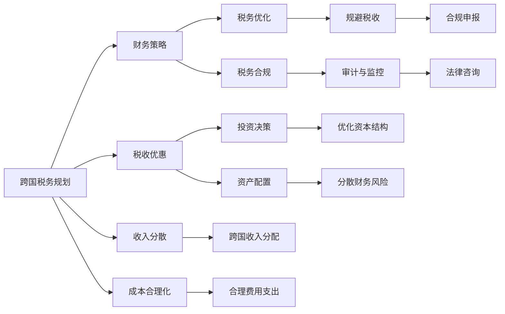

                 

# 程序员的跨国税务规划指南

> 关键词：跨国税务规划, 税务优化, 税收优惠, 财务策略, 税务合规

## 1. 背景介绍

在数字经济时代，全球化信息技术的发展使得程序员的工作边界变得模糊，跨国企业和远程工作的兴起让程序员的收入不再局限于单一国家。然而，这种跨国收入的特征也带来了一系列税务问题。程序员作为技术专家，对财务知识可能不够熟悉，往往对如何合理规划跨国税务策略感到困惑。本文将为程序员提供一份全面的跨国税务规划指南，帮助他们合法合理地优化税务负担，确保财务合规，提升自身财务竞争力。

## 2. 核心概念与联系

### 2.1 核心概念概述

为了更好地理解跨国税务规划，本文将介绍几个关键概念及其相互之间的联系：

- **跨国税务规划（Cross-border Tax Planning）**：指通过合法的方式调整收入、资产、费用等财务要素，降低企业或个人在多个国家的税负，从而达到税务优化目的。

- **税收优惠（Tax Incentives）**：各国政府为促进经济活动，会提供税收减免、抵扣、优惠税率等激励措施。跨国企业或个人可以充分利用这些优惠，降低税负。

- **财务策略（Financial Strategy）**：涵盖企业或个人的财务行为，包括投资决策、资产配置、税务规划等，旨在最大化财务收益和降低财务风险。

- **税务合规（Tax Compliance）**：确保企业或个人的财务行为符合所在国家的税法规定，避免税务违规，降低法律风险。

- **税务优化（Tax Optimization）**：通过合理避税、利用税收优惠、分散收入等手段，合法地降低税负。

这些核心概念构成了跨国税务规划的基本框架，程序员需要掌握这些概念，才能进行有效的跨国税务规划。

### 2.2 核心概念原理和架构的 Mermaid 流程图



此流程图展示了跨国税务规划中各概念的相互关系：跨国税务规划通过财务策略中的收入分散、成本合理化等手段，利用税收优惠中的投资决策、资产配置等策略，通过税务优化中的规避税收等方法，确保税务合规中的审计与监控，最终实现税务优化和财务策略的双重目标。

## 3. 核心算法原理 & 具体操作步骤

### 3.1 算法原理概述

跨国税务规划的本质是通过合法手段优化税务结构，最小化税负。其核心算法原理基于税务差异和税收优惠，通过合理配置收入、费用、资产等财务要素，利用税率差异、税收减免、抵扣等政策，最大化税务收益。

### 3.2 算法步骤详解

1. **识别税法差异**：了解不同国家的税法规定，识别其中的税收优惠和税种差异。例如，不同国家对股息、利息、特许权使用费等的税率可能不同。

2. **收入分配**：合理分配跨国收入，避免高税率的收入集中于某国，例如将部分收入转移到税率较低的国家。

3. **成本合理化**：将合理成本费用转移到税率较低的国家，降低综合税负。例如，将部分业务转移到低税国家，避免在税率较高的国家承担全部成本。

4. **利用税收优惠**：充分了解并利用各国提供的税收优惠政策，如研发费用抵扣、就业税减免等，降低实际税负。

5. **审计与监控**：建立内部审计机制，确保税务合规，避免因税务违规导致的法律风险和罚款。

### 3.3 算法优缺点

**优点**：
- **合法合规**：通过合法手段优化税务结构，避免税务违规风险。
- **税负降低**：合理利用税收优惠和税率差异，有效降低税负。
- **灵活性高**：全球化的税法变化和税务政策更新，为跨国税务规划提供了灵活性。

**缺点**：
- **复杂性高**：涉及多个国家和地区的税法差异，规划过程复杂。
- **需要专业知识**：需要对各国的税法和税务政策有深入了解，难以自行完成。
- **潜在风险**：操作不当可能导致税务违规，带来法律风险。

### 3.4 算法应用领域

跨国税务规划在跨国企业、自由职业者和远程工作者的税务优化中均有广泛应用。特别是在跨国企业中，通过合理的税务规划，可以有效降低整体税负，提升企业竞争力。在自由职业者和远程工作者中，通过合理配置收入和成本，可以有效降低个人税负，提高财务收益。

## 4. 数学模型和公式 & 详细讲解 & 举例说明

### 4.1 数学模型构建

假设某程序员在全球A、B两个国家有收入，其中A国税率为40%，B国税率为20%。设该程序员在A国的收入为X，B国的收入为Y。

定义总税负函数为 $T(X, Y)$，则有：

$$ T(X, Y) = 0.4X + 0.2Y $$

其中，税率已经考虑了抵扣和减免等优惠政策。

### 4.2 公式推导过程

将总收入I视为常数，即 $I = X + Y$。则可以将总税负函数改写为：

$$ T(X, Y) = 0.4X + 0.2Y = 0.4X + 0.2(I - X) = 0.2I + 0.2X $$

通过上述推导，我们可以看到总税负函数为总收入I的线性函数，且税负在A国的比例为0.4。

### 4.3 案例分析与讲解

假设该程序员总收入为100万元，分别为A国60万元和B国40万元。

- **不规划**：直接根据各国税率计算总税负：
  - A国税负：$0.4 \times 60 = 24$万元
  - B国税负：$0.2 \times 40 = 8$万元
  - 总税负：$24 + 8 = 32$万元

- **规划优化**：考虑将部分收入转移到税率较低的国家。

  1. **收入分配**：将40万元收入从A国转移到B国。
  - A国新收入：$60 - 40 = 20$万元
  - B国新收入：$40 + 40 = 80$万元
  - 总收入不变：$20 + 80 = 100$万元

  2. **成本合理化**：将部分成本费用转移到税率较低的国家。

  假设总成本费用为50万元，其中20万元的成本费用转移至B国，30万元留在A国。
  - A国新成本：$30$万元
  - B国新成本：$20 + 30 = 50$万元
  - 总收入不变：$20 + 80 = 100$万元

  3. **计算总税负**：
  - A国税负：$0.4 \times 20 = 8$万元
  - B国税负：$0.2 \times 80 = 16$万元
  - 总税负：$8 + 16 = 24$万元

通过优化收入和成本的分配，总税负从32万元降低到24万元，有效降低了税负。

## 5. 项目实践：代码实例和详细解释说明

### 5.1 开发环境搭建

跨国税务规划涉及多个国家的税法，需要一个集中化的平台来处理复杂的财务数据。可以搭建一个基于Web的税务规划系统，使用Python、Flask等技术进行开发。

1. **安装Python**：确保系统上安装了Python 3.x版本，建议使用虚拟环境（如virtualenv）。

2. **安装Flask**：
  ```bash
  pip install flask
  ```

3. **搭建Flask应用**：
  ```python
  from flask import Flask, request, jsonify

  app = Flask(__name__)

  @app.route('/tax_planning', methods=['POST'])
  def tax_planning():
      data = request.json
      income_A = data['income_A']
      income_B = data['income_B']
      tax_rate_A = data['tax_rate_A']
      tax_rate_B = data['tax_rate_B']
      total_income = income_A + income_B
      total_tax = (tax_rate_A * income_A) + (tax_rate_B * income_B)
      optimal_income_A = total_income * tax_rate_B / (tax_rate_A + tax_rate_B)
      optimal_income_B = total_income - optimal_income_A
      optimal_tax = (tax_rate_A * optimal_income_A) + (tax_rate_B * optimal_income_B)
      return jsonify({'optimal_income_A': optimal_income_A, 'optimal_income_B': optimal_income_B, 'optimal_tax': optimal_tax})

  if __name__ == '__main__':
      app.run(debug=True)
  ```

4. **部署环境**：可以使用云服务提供商如AWS、GCP等，快速搭建Web应用，支持高并发访问。

### 5.2 源代码详细实现

**税负计算函数**：

```python
def calculate_tax(income_A, income_B, tax_rate_A, tax_rate_B):
    total_income = income_A + income_B
    total_tax = (tax_rate_A * income_A) + (tax_rate_B * income_B)
    optimal_income_A = total_income * tax_rate_B / (tax_rate_A + tax_rate_B)
    optimal_income_B = total_income - optimal_income_A
    optimal_tax = (tax_rate_A * optimal_income_A) + (tax_rate_B * optimal_income_B)
    return optimal_income_A, optimal_income_B, optimal_tax
```

**Web应用接口**：

```python
from flask import Flask, request, jsonify

app = Flask(__name__)

@app.route('/tax_planning', methods=['POST'])
def tax_planning():
    data = request.json
    income_A = data['income_A']
    income_B = data['income_B']
    tax_rate_A = data['tax_rate_A']
    tax_rate_B = data['tax_rate_B']
    optimal_income_A, optimal_income_B, optimal_tax = calculate_tax(income_A, income_B, tax_rate_A, tax_rate_B)
    return jsonify({'optimal_income_A': optimal_income_A, 'optimal_income_B': optimal_income_B, 'optimal_tax': optimal_tax})

if __name__ == '__main__':
    app.run(debug=True)
```

### 5.3 代码解读与分析

**税负计算函数**：

- `calculate_tax`函数接收四个参数：A国收入、B国收入、A国税率、B国税率。
- 首先计算总收入和总税负。
- 然后根据税率差异，计算最优的A、B两国收入分配，确保税负最低。
- 最后计算最优的总税负。

**Web应用接口**：

- `/tax_planning`接口接收包含收入、税率等信息的JSON数据。
- 调用`calculate_tax`函数计算最优的收入分配和税负。
- 返回JSON格式的计算结果。

### 5.4 运行结果展示

通过Web应用接口，程序员可以输入A、B两国的收入和税率，得到最优的收入分配方案和预期税负。

## 6. 实际应用场景

### 6.1 跨国企业

跨国企业在全球运营，涉及多个国家和地区的税务问题。合理的税务规划有助于降低整体税负，提升企业竞争力。

**案例**：一家全球化的科技公司，年收入为1亿美元，其中A国收入为5000万美元，B国收入为5000万美元。

- **不规划**：根据各国税率计算总税负：
  - A国税负：$0.4 \times 5000 = 2000$万美元
  - B国税负：$0.2 \times 5000 = 1000$万美元
  - 总税负：$2000 + 1000 = 3000$万美元

- **规划优化**：考虑将部分收入转移到税率较低的国家。

  1. **收入分配**：将2500万美元收入从A国转移到B国。
  - A国新收入：$2500$万美元
  - B国新收入：$2500 + 2500 = 5000$万美元
  - 总收入不变：$2500 + 5000 = 7500$万美元

  2. **成本合理化**：将部分成本费用转移到税率较低的国家。

  假设总成本费用为4000万美元，其中1500万美元的成本费用转移至B国，2500万美元留在A国。
  - A国新成本：$2500$万美元
  - B国新成本：$1500 + 2500 = 4000$万美元
  - 总收入不变：$2500 + 5000 = 7500$万美元

  3. **计算总税负**：
  - A国税负：$0.4 \times 2500 = 1000$万美元
  - B国税负：$0.2 \times 5000 = 1000$万美元
  - 总税负：$1000 + 1000 = 2000$万美元

通过优化收入和成本的分配，总税负从3000万美元降低到2000万美元，有效降低了税负。

### 6.2 自由职业者

自由职业者和远程工作者往往面临多国收入的税务问题。合理的税务规划可以帮助他们降低个人税负，提高财务收益。

**案例**：一位自由职业者，年收入为50万美元，其中A国收入为20万美元，B国收入为30万美元。

- **不规划**：根据各国税率计算总税负：
  - A国税负：$0.4 \times 20 = 8$万美元
  - B国税负：$0.2 \times 30 = 6$万美元
  - 总税负：$8 + 6 = 14$万美元

- **规划优化**：考虑将部分收入转移到税率较低的国家。

  1. **收入分配**：将10万美元收入从A国转移到B国。
  - A国新收入：$10$万美元
  - B国新收入：$30 + 10 = 40$万美元
  - 总收入不变：$10 + 40 = 50$万美元

  2. **成本合理化**：将部分成本费用转移到税率较低的国家。

  假设总成本费用为15万美元，其中5万美元的成本费用转移至B国，10万美元留在A国。
  - A国新成本：$10$万美元
  - B国新成本：$5 + 10 = 15$万美元
  - 总收入不变：$10 + 40 = 50$万美元

  3. **计算总税负**：
  - A国税负：$0.4 \times 10 = 4$万美元
  - B国税负：$0.2 \times 40 = 8$万美元
  - 总税负：$4 + 8 = 12$万美元

通过优化收入和成本的分配，总税负从14万美元降低到12万美元，有效降低了税负。

## 7. 工具和资源推荐

### 7.1 学习资源推荐

1. **《跨国税务规划实战指南》**：详细介绍跨国税务规划的原理和技巧，提供大量实际案例分析。

2. **《国际税务会计》**：系统讲解不同国家税务会计的方法和标准，有助于理解各国税法差异。

3. **《税务审计与风险管理》**：介绍税务审计的方法和工具，确保税务合规。

4. **在线税务规划课程**：如Coursera上的“国际税务规划”课程，提供系统的理论知识和实践指导。

5. **税务软件工具**：如TaxAct、TurboTax等，提供税务计算和规划的实用工具。

### 7.2 开发工具推荐

1. **Python**：作为税务规划计算的核心语言，Python的简洁和易用性使其成为理想的选择。

2. **Flask**：用于搭建Web税务规划系统，支持HTTP请求和JSON数据处理。

3. **SQLite**：轻量级数据库，适用于税务数据的存储和管理。

4. **Git**：版本控制工具，便于团队协作和代码管理。

### 7.3 相关论文推荐

1. **《跨国公司税务规划策略研究》**：分析跨国公司的税务规划策略，提供丰富的案例分析。

2. **《自由职业者的税务优化方法》**：介绍自由职业者如何利用税务策略降低税负，提升财务收益。

3. **《国际税收协定的影响》**：探讨不同国际税收协定对税务规划的影响，帮助理解复杂的税法环境。

## 8. 总结：未来发展趋势与挑战

### 8.1 研究成果总结

本文通过系统介绍跨国税务规划的核心概念和具体操作步骤，结合实际案例，详细讲解了如何在不同国家优化税负。通过实践代码实例，帮助程序员理解和应用税务规划方法。通过工具和资源推荐，提供了学习和实践的路径。

### 8.2 未来发展趋势

1. **数字化税务服务**：随着数字技术的发展，税务服务将更加智能化、个性化，税务规划工具将更加便捷易用。

2. **跨境税务合规**：全球化和数字化加速了跨境交易的增长，跨境税务合规将成为未来税务规划的重要方向。

3. **实时税务优化**：基于区块链和大数据技术，税务规划将更加实时和动态，能够快速应对税法变化。

4. **税务合规与风险管理**：税务合规和风险管理将成为未来税务规划的核心内容，确保企业或个人税务合规，降低法律风险。

5. **人工智能在税务规划中的应用**：利用人工智能技术，如自然语言处理和机器学习，提高税务规划的效率和精度。

### 8.3 面临的挑战

1. **税法复杂性**：不同国家的税法差异巨大，理解和应用这些税法需要专业的税务知识。

2. **跨境税务合规**：跨境交易的复杂性增加了税务合规的难度，需要确保每个国家税务合规。

3. **技术变革**：数字化和人工智能的发展，对税务规划工具和技术提出了新的要求，需要持续学习和更新。

4. **政策变化**：各国税法政策变化频繁，需要实时跟进，确保税务规划的合规性。

5. **税务审计**：税务审计的复杂性和风险性增加，需要建立有效的内部审计机制。

### 8.4 研究展望

未来，跨国税务规划的研究将更加深入和全面，包括以下方向：

1. **税务策略优化**：结合税法变化和市场环境，动态优化税务策略，降低长期税负。

2. **税收优惠利用**：深度挖掘各国的税收优惠政策，最大化利用，降低实际税负。

3. **多国税务协同**：通过多国税务协同，实现最优的跨国税务规划。

4. **税务风险管理**：建立税务风险管理体系，确保税务合规，降低法律风险。

5. **人工智能辅助**：利用人工智能技术，提升税务规划的自动化和智能化水平。

跨国税务规划是程序员不可忽视的重要领域，掌握相关知识和技能，能够合法合理地优化税负，提升财务收益，确保税务合规。未来，随着技术和政策的不断进步，跨国税务规划将更加科学和高效，为程序员带来更多的财务机会和挑战。

---

作者：禅与计算机程序设计艺术 / Zen and the Art of Computer Programming

