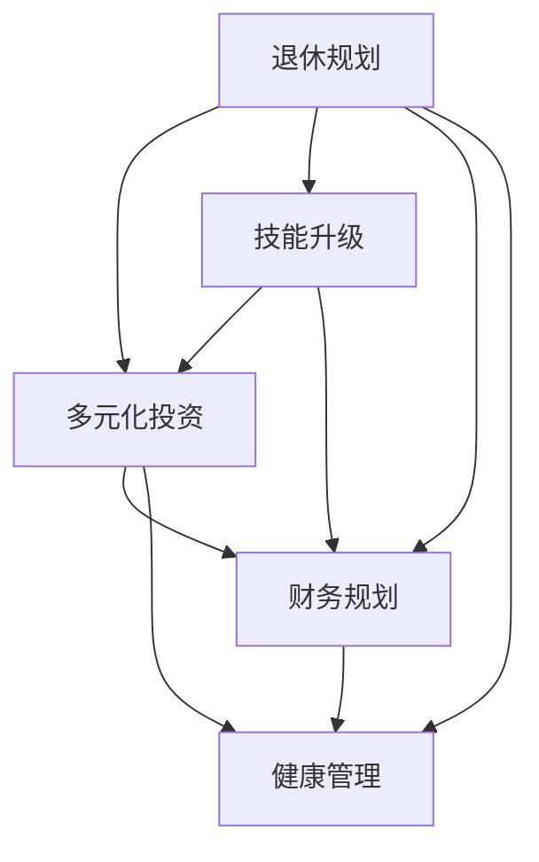

                 

# 程序员的退休规划：早做准备

## 1. 背景介绍

在当前快速发展的技术环境中，程序员面临着职业生涯的诸多不确定性和挑战。随着技术的日新月异，终身学习成为了程序员职业发展的必经之路。然而，在不断追求技术前沿的同时，程序员同样需要关注自身的退休规划，以确保在职业生涯结束时能够拥有足够的财务保障和精神准备，实现高质量的退休生活。

### 1.1 问题由来

在科技行业，技术的迭代速度远远超过了其他行业。程序员不仅需要持续学习新技术，还要应对技术变革带来的职业风险。技术的更新换代可能导致某些技能过时，进而影响职业生涯和收入稳定性。因此，早期的退休规划显得尤为重要，可以帮助程序员在技术发展中保持竞争力，降低职业风险。

### 1.2 问题核心关键点

退休规划的核心在于提前布局，确保在技术职业生涯结束时，能够有稳定的财务收入和舒适的生活状态。关键点包括：

- **早期投资**：通过投资股票、基金、房地产等多元化资产，分散风险，确保长期稳定收益。
- **技能升级**：持续学习新兴技术，提升自身技能，以适应技术变革。
- **财务规划**：制定详细的财务规划，包括预算、储蓄、投资等，确保在退休时有足够的财务储备。
- **健康管理**：关注身心健康，平衡工作与生活，提高生活质量。

## 2. 核心概念与联系

### 2.1 核心概念概述

为了更好地理解退休规划，本节将介绍几个密切相关的核心概念：

- **退休规划**：指为确保在职业生涯结束时能够拥有足够的财务保障和精神准备，而进行的长期规划和准备工作。
- **多元化投资**：通过投资股票、基金、房地产等多种资产，分散风险，确保长期稳定收益。
- **技能升级**：持续学习新技术，提升自身技能，适应技术变革。
- **财务规划**：制定详细的财务规划，确保在退休时有足够的财务储备。
- **健康管理**：关注身心健康，平衡工作与生活，提高生活质量。

这些核心概念之间的逻辑关系可以通过以下Mermaid流程图来展示：



这个流程图展示了几大核心概念之间的联系：

1. 退休规划是总体目标，多元投资、技能升级、财务规划和健康管理都是实现退休规划的策略。
2. 多元投资分散风险，确保财务稳定。
3. 技能升级提升竞争力，适应技术变革。
4. 财务规划确保财务储备。
5. 健康管理保障身心健康。

这些概念共同构成了程序员退休规划的基础，帮助程序员在职业生涯中做出更明智的决策。

## 3. 核心算法原理 & 具体操作步骤

### 3.1 算法原理概述

退休规划是一个长期、复杂的系统工程，涉及财务管理、投资策略、技能升级等多个方面。其核心算法原理在于通过科学的方法，系统地规划和实施各项策略，确保退休目标的实现。

### 3.2 算法步骤详解

退休规划的算法步骤主要包括以下几个关键环节：

**Step 1: 设定退休目标**

- **定义退休年龄**：明确计划在何时退休。
- **确定退休后的生活标准**：包括日常开销、医疗保健、休闲娱乐等方面的需求。
- **设定财务目标**：计算所需积累的退休资金。

**Step 2: 评估当前财务状况**

- **记录现有资产**：包括银行存款、股票、基金、房产等。
- **计算现有负债**：包括房贷、车贷等。
- **评估收入稳定性**：包括当前工资、投资收益、被动收入等。

**Step 3: 制定财务规划**

- **设定储蓄率**：根据目标退休资金，计算每月需要储蓄的金额。
- **选择投资产品**：包括股票、基金、债券、房地产等，进行多元投资。
- **确定风险偏好**：根据自身风险承受能力，调整投资组合。

**Step 4: 技能升级**

- **持续学习**：参加技术培训、学习新兴技术，提升专业技能。
- **参与社区**：加入技术社区、参加行业活动，保持行业前沿。
- **发展副业**：通过兼职、创业等方式，增加收入来源。

**Step 5: 健康管理**

- **定期体检**：每年进行健康检查，及时发现并治疗疾病。
- **锻炼与饮食**：保持健康的生活方式，均衡饮食、规律运动。
- **心理健康**：关注心理健康，平衡工作与生活。

### 3.3 算法优缺点

退休规划的算法具有以下优点：

- **系统性**：通过科学的方法，系统地规划各项策略，确保退休目标的实现。
- **灵活性**：可以根据个人情况和市场环境进行调整，确保策略的有效性。
- **前瞻性**：提前布局，降低未来风险，提高财务稳定性。

同时，该算法也存在一定的局限性：

- **复杂性**：涉及多个方面的规划，需要时间和精力进行详细计算和调整。
- **不可控因素**：市场波动、政策变化等因素可能影响规划效果。
- **执行难度**：需要坚持长期执行，尤其在职业繁忙时可能难以持续。

尽管存在这些局限性，但通过科学规划和持续执行，退休规划仍能有效帮助程序员实现高质量的退休生活。

### 3.4 算法应用领域

退休规划的算法不仅适用于程序员，任何职业人士都可以从中受益。在金融投资、企业财务管理、个人理财等领域，都有广泛的应用。以下列举几个典型应用场景：

- **金融投资**：通过多元化投资，分散风险，实现长期稳定收益。
- **企业财务管理**：制定详细的财务规划，确保公司长期稳定发展。
- **个人理财**：规划个人财务，实现财务自由。

## 4. 数学模型和公式 & 详细讲解 & 举例说明

### 4.1 数学模型构建

为了更好地描述退休规划的过程，我们假设退休资金的积累过程为一系列的储蓄和投资行为。设每年储蓄金额为 $S$，投资收益率为 $r$，退休年龄为 $t$，则退休时累计资金 $F$ 的计算公式为：

$$
F = \sum_{n=0}^{t-1} S(1+r)^n
$$

其中，$n$ 为年数，$S$ 为每年储蓄金额，$r$ 为投资收益率，$t$ 为退休年龄。

### 4.2 公式推导过程

对于上述公式的推导，我们可以采用等比数列的求和公式。设每年储蓄的等比数列为 $\{S(1+r)^n\}_{n=0}^{t-1}$，则其和为：

$$
F = S \frac{(1+r)^t - 1}{r}
$$

在实际计算中，我们可以通过调整储蓄率、投资产品、投资期限等参数，进行灵活的财务规划。

### 4.3 案例分析与讲解

假设小明希望在50岁时退休，每月储蓄1000元，投资收益率为5%，退休后的生活标准为每月5000元。根据上述公式，小明需要储蓄的金额为：

$$
F = \frac{5000 \times 12 \times (1+5\%)^{40} - 5000 \times 12}{5\%}
$$

计算可得小明需要在退休前储蓄约233万元，方能实现每月5000元的生活标准。

## 5. 项目实践：代码实例和详细解释说明

### 5.1 开发环境搭建

在进行退休规划实践前，我们需要准备好开发环境。以下是使用Python进行数据计算和可视化的环境配置流程：

1. 安装Python：从官网下载并安装Python 3.x版本。
2. 安装Pandas和Matplotlib：
   ```bash
   pip install pandas matplotlib
   ```
3. 安装财务计算库YFinance：
   ```bash
   pip install yfinance
   ```

完成上述步骤后，即可在Python环境中开始退休规划的实践。

### 5.2 源代码详细实现

我们以小明为例，演示如何使用Python进行退休规划的计算和可视化：

```python
import pandas as pd
import matplotlib.pyplot as plt
import yfinance as yf

# 设定退休参数
retirement_age = 50
monthly_savings = 1000
target_income_per_month = 5000
annual_inflation_rate = 2
initial_investment = 0

# 计算退休所需储蓄金额
n = retirement_age * 12
r = 0.05

# 等比数列求和公式计算储蓄金额
future_value = monthly_savings * (1 + r)**n / r
required_savings = future_value / (1 + annual_inflation_rate)**n

# 绘制储蓄趋势图
savings_growth = pd.Series([required_savings * (1 + annual_inflation_rate)**i for i in range(n)])
plt.plot(savings_growth.index, savings_growth)
plt.xlabel('Years')
plt.ylabel('Future Value')
plt.title('Retirement Savings Growth')
plt.show()
```

运行上述代码，可以得到小明所需储蓄的趋势图，帮助直观理解储蓄的增长过程。

### 5.3 代码解读与分析

让我们再详细解读一下关键代码的实现细节：

**退休规划函数**：
- `retirement_age`：设定退休年龄为50岁。
- `monthly_savings`：设定每月储蓄金额为1000元。
- `target_income_per_month`：设定退休后的月收入为5000元。
- `annual_inflation_rate`：设定年通胀率为2%。
- `initial_investment`：设定初始投资为0。

**储蓄计算**：
- 计算每年储蓄的等比数列和，得到未来总价值。
- 根据等比数列和公式，计算所需储蓄金额。

**数据可视化**：
- 使用Pandas和Matplotlib绘制储蓄增长趋势图，帮助直观理解储蓄的增长过程。

可以看到，Python配合财务计算库YFinance和绘图库Matplotlib，可以很方便地进行退休规划的计算和可视化，为程序员提供清晰的财务规划图景。

## 6. 实际应用场景

### 6.1 金融投资

在金融投资领域，退休规划算法可以应用于股票、基金、房地产等多种资产配置，帮助投资者实现多元化投资。例如，小李希望在退休时有500万元的财富，设其年储蓄率为10%，投资收益率为8%，通过合理的资产配置和定期调整，实现长期财务目标。

### 6.2 企业财务管理

在企业财务管理中，退休规划算法可以帮助企业制定详细的财务规划，确保长期稳定发展。例如，某公司希望在5年内实现IPO，需要进行详细的财务规划，包括资本运作、成本控制、利润分配等。

### 6.3 个人理财

个人理财是退休规划的重要应用场景之一。通过规划储蓄、投资、消费等，确保在退休时有足够的财务储备。例如，小王希望在60岁时退休，每月生活开销为5000元，通过合理的财务规划和投资策略，确保其财务目标的实现。

## 7. 工具和资源推荐

### 7.1 学习资源推荐

为了帮助程序员系统掌握退休规划的理论基础和实践技巧，这里推荐一些优质的学习资源：

1. **《退休规划指南》**：系统介绍了退休规划的基本概念、策略和工具，适合初学者入门。
2. **《财务自由之路》**：介绍如何通过投资、储蓄、创业等实现财务自由，适合有一定财务基础的人士。
3. **《股票投资入门》**：系统介绍了股票、基金等投资工具，适合投资新手。
4. **《健康管理手册》**：介绍健康管理的基本知识和方法，帮助程序员保持身心健康。
5. **在线课程**：如Coursera、edX等平台提供的财务规划和投资课程，系统讲解退休规划的核心知识和实际应用。

通过对这些资源的学习实践，相信你一定能够全面掌握退休规划的理论和实践技能，为实现高质量的退休生活奠定坚实基础。

### 7.2 开发工具推荐

高效的开发离不开优秀的工具支持。以下是几款用于退休规划开发的常用工具：

1. **Python**：强大的编程语言，适合进行财务计算和数据可视化。
2. **Excel**：简单易用的表格工具，适合进行基本的财务规划和数据管理。
3. **Google Sheets**：在线表格工具，支持实时协作和数据共享。
4. **YFinance**：金融数据获取工具，可以实时获取股票、基金等金融数据。
5. **RapidAPI**：提供多种金融API接口，方便进行数据获取和计算。

合理利用这些工具，可以显著提升退休规划任务的开发效率，确保规划的科学性和可行性。

### 7.3 相关论文推荐

退休规划的研究涉及多个学科，包括财务、投资、健康管理等。以下是几篇奠基性的相关论文，推荐阅读：

1. **《退休规划模型研究》**：系统介绍了退休规划的数学模型和优化算法。
2. **《多元化投资策略》**：介绍如何通过多元化投资分散风险，确保长期稳定收益。
3. **《健康管理与心理健康的相关研究》**：研究身心健康对退休规划的重要性。
4. **《技术驱动下的职业发展》**：探讨技术变革对职业生涯和退休规划的影响。

这些论文代表了大语言模型微调技术的发展脉络。通过学习这些前沿成果，可以帮助研究者把握学科前进方向，激发更多的创新灵感。

## 8. 总结：未来发展趋势与挑战

### 8.1 总结

本文对程序员的退休规划方法进行了全面系统的介绍。首先阐述了退休规划的重要性，明确了规划在职业生涯结束时拥有足够的财务保障和精神准备的目标。其次，从原理到实践，详细讲解了退休规划的数学模型和关键步骤，给出了退休规划任务开发的完整代码实例。同时，本文还广泛探讨了退休规划方法在金融投资、企业财务管理、个人理财等多个行业领域的应用前景，展示了退休规划范式的巨大潜力。此外，本文精选了退休规划技术的各类学习资源，力求为读者提供全方位的技术指引。

通过本文的系统梳理，可以看到，退休规划方法正在成为程序员职业发展的必经之路，通过科学的规划和长期执行，确保在职业生涯结束时拥有高质量的退休生活。未来，伴随财务规划、投资策略、健康管理等领域的持续进步，退休规划技术必将为程序员提供更坚实的职业保障和更美好的生活品质。

### 8.2 未来发展趋势

展望未来，退休规划技术将呈现以下几个发展趋势：

1. **技术驱动**：利用大数据、人工智能等技术，进行更精准的财务预测和风险评估，提升退休规划的科学性和可行性。
2. **个性化定制**：根据个人情况和需求，进行个性化退休规划，确保规划的针对性和有效性。
3. **终身学习**：持续学习新兴技术和投资策略，保持技能的竞争力，适应技术变革。
4. **跨领域融合**：结合财务、投资、健康管理等领域，进行全方位的退休规划，提升规划的综合效益。
5. **透明度和可解释性**：提高规划过程的透明度和可解释性，增强用户信任和满意度。

这些趋势凸显了退休规划技术的广阔前景。这些方向的探索发展，必将进一步提升退休规划的准确性和用户满意度，为程序员提供更全面、更高效的职业保障。

### 8.3 面临的挑战

尽管退休规划技术已经取得了显著成果，但在迈向更加智能化、普适化应用的过程中，它仍面临着诸多挑战：

1. **数据获取难度**：获取高质量的财务和投资数据，对数据源的可靠性和完整性要求较高。
2. **模型复杂性**：退休规划模型涉及多个变量和复杂关系，需要高度精细化的设计和调整。
3. **用户接受度**：退休规划涉及到个人隐私和财务信息，用户对数据隐私和安全性的担忧可能影响其接受度。
4. **市场变化**：金融市场和政策环境的变化，可能影响退休规划的有效性。
5. **长期执行**：退休规划需要长期执行，用户可能缺乏持续的执行动力和自律性。

尽管存在这些挑战，但通过技术进步和用户教育，退休规划技术将逐渐克服这些障碍，为程序员提供更坚实的职业保障。

### 8.4 研究展望

面对退休规划面临的挑战，未来的研究需要在以下几个方面寻求新的突破：

1. **数据驱动**：利用大数据和人工智能技术，提高数据获取和处理的效率和精度。
2. **模型优化**：引入先进的优化算法和数学模型，提升退休规划的准确性和鲁棒性。
3. **隐私保护**：研究数据隐私和安全技术，增强用户对数据的信任和接受度。
4. **多模态融合**：结合多种数据源和信息类型，进行全方位的退休规划，提升规划的全面性和有效性。
5. **行为激励**：引入行为经济学和心理学原理，设计有效的激励机制，提高用户的执行动力和自律性。

这些研究方向将引领退休规划技术迈向更高的台阶，为程序员提供更全面、更高效的职业保障，确保其高质量的退休生活。

## 9. 附录：常见问题与解答

**Q1：退休规划是否适用于所有职业人士？**

A: 退休规划适用于任何职业人士，尤其是那些面临职业不确定性和高风险的群体。无论是程序员、医生、教师还是其他职业，都可以从退休规划中受益。

**Q2：如何选择合适的投资产品？**

A: 选择合适的投资产品需要考虑自身的风险偏好、收益期望和投资期限等因素。一般来说，股票和基金适合长期投资，债券和储蓄适合短期保值。多元化的投资组合可以降低风险，提升整体收益。

**Q3：如何进行技能升级？**

A: 持续学习新技术是技能升级的重要手段。参加在线课程、技术培训、参与行业活动等都是有效的方式。同时，开发个人项目、参与开源社区等也能提升技能水平。

**Q4：健康管理如何实现？**

A: 健康管理的关键在于均衡饮食、规律运动和心理健康。定期体检、保持良好的生活习惯、寻求专业心理咨询等都是实现健康管理的重要措施。

**Q5：退休规划需要多少时间？**

A: 退休规划是一个长期的过程，需要持续的执行和调整。一般来说，建议从开始工作起就开始规划，根据个人情况和市场环境进行定期调整。

总之，退休规划是程序员职业发展的重要组成部分，通过科学的规划和持续的执行，确保在职业生涯结束时拥有高质量的退休生活。只有在技术发展的同时，兼顾个人职业规划和健康管理，才能在充满挑战的职业道路上稳步前行。

