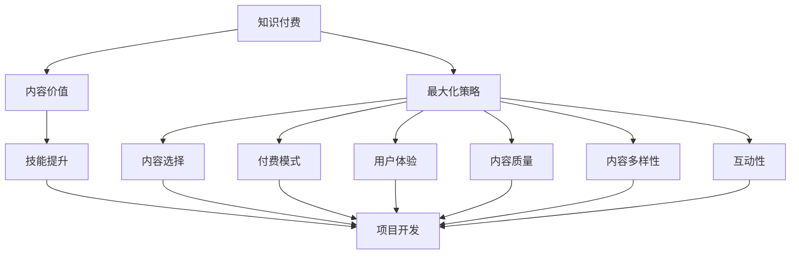

                 

# 程序员知识付费的内容价值最大化策略

> 关键词：知识付费、内容价值、最大化策略、编程学习、在线教育、付费模式、用户体验、内容质量、内容多样性、互动性、隐私保护、数据分析

## 1. 背景介绍

随着互联网技术的快速发展，知识付费市场正处于高速增长阶段。程序员作为互联网行业的重要力量，其在线教育需求日益增长，知识付费成为了程序员学习提升的重要途径。然而，面对海量的知识付费内容，程序员如何有效筛选，从而最大化其内容价值，成为了亟待解决的问题。

## 2. 核心概念与联系

### 2.1 核心概念概述

为了更好地理解如何最大化程序员知识付费的内容价值，本文将介绍几个关键概念：

- **知识付费**：指用户为获取有价值、系统化的知识内容而支付费用，包括在线课程、编程书籍、技术博客、视频教程等多种形式。
- **内容价值**：指知识付费内容对用户的实际应用价值，包括解决问题的能力提升、技能掌握、项目开发效率提高等。
- **最大化策略**：指通过合理的设计和运营，使知识付费内容的价值最大化，即以尽可能少的投入，获得最大的学习收益。

这些概念之间的联系可以通过以下Mermaid流程图来展示：



这个流程图展示了知识付费、内容价值、最大化策略之间的关系：

1. 知识付费是内容价值实现的载体。
2. 最大化策略是实现内容价值的路径。
3. 内容选择、付费模式、用户体验、内容质量、内容多样性、互动性等多方面因素共同作用于内容价值。

这些因素相互影响，共同决定了程序员知识付费的内容价值最大化策略。

## 3. 核心算法原理 & 具体操作步骤

### 3.1 算法原理概述

要最大化程序员知识付费的内容价值，首先需要建立一套基于数据的优化算法，通过不断优化内容选择、付费模式、用户体验等因素，以最小的成本获得最大的学习收益。这一过程可以抽象为如下数学模型：

$$
\max \sum_{i=1}^{n} v_i \times r_i
$$

其中，$v_i$ 表示第 $i$ 类内容对用户的价值，$r_i$ 表示用户对第 $i$ 类内容的付费意愿。目标是通过优化 $r_i$，使得总体价值最大化。

### 3.2 算法步骤详解

实现上述优化目标，需要遵循以下详细步骤：

**Step 1: 数据收集与分析**
- 收集用户行为数据，包括购买课程、观看视频、阅读文章等记录。
- 分析用户的兴趣偏好和行为特征，挖掘用户的知识需求。

**Step 2: 内容价值评估**
- 利用机器学习算法对内容进行价值评估，如使用协同过滤、内容推荐系统等方法。
- 将内容价值评估结果转化为用户对内容的付费意愿，即计算 $r_i$。

**Step 3: 内容推荐与个性化**
- 根据用户行为和内容价值评估结果，推荐符合用户兴趣的内容。
- 通过个性化推荐，提高用户粘性和满意度。

**Step 4: 动态定价与付费模式设计**
- 根据内容价值评估结果和用户付费意愿，动态调整课程价格。
- 设计多种付费模式，如按需购买、月度订阅、包年服务等，满足不同用户需求。

**Step 5: 用户体验优化**
- 优化课程内容质量，确保内容的实用性、前沿性和系统性。
- 提升平台的用户体验，包括界面设计、操作便捷性、学习辅助工具等。

**Step 6: 反馈与迭代**
- 收集用户反馈，持续改进内容选择、付费模式、用户体验等因素。
- 通过迭代优化，不断提升知识付费内容的整体价值。

### 3.3 算法优缺点

基于数据的最大化策略具有以下优点：
- 通过科学的数据分析，能够更准确地预测用户的付费意愿和内容价值。
- 动态调整内容和付费模式，最大程度满足用户需求，提高用户满意度和粘性。

同时，该方法也存在一定的局限性：
- 数据收集和分析需要大量投入，且数据隐私和安全问题不容忽视。
- 需要强大的技术支持，包括大数据、机器学习等，技术门槛较高。
- 用户行为数据可能存在偏差，影响预测结果的准确性。

尽管如此，基于数据的最大化策略仍是大规模知识付费平台的主流方法，能够显著提升内容价值和用户体验。

### 3.4 算法应用领域

基于数据驱动的知识付费最大化策略，已在多个领域得到广泛应用，例如：

- **在线教育**：教育平台通过分析用户行为数据，优化课程推荐，提高用户购买率和满意度。
- **技术博客和视频教程**：内容平台通过用户反馈和互动数据，不断优化内容质量和互动体验，吸引更多用户订阅和付费。
- **软件开发和编程工具**：开发者社区通过内容推荐和个性化服务，提升开发效率和学习体验，增加用户活跃度和付费意愿。

## 4. 数学模型和公式 & 详细讲解 & 举例说明

### 4.1 数学模型构建

基于上述最大化策略的数学模型可以进一步细化如下：

假设用户共有 $n$ 类课程，每类课程的价值为 $v_i$，用户对第 $i$ 类课程的付费意愿为 $r_i$，目标函数为：

$$
\max \sum_{i=1}^{n} v_i \times r_i
$$

约束条件为：

$$
0 \leq r_i \leq R_i, \quad i=1,\dots,n
$$

其中 $R_i$ 表示第 $i$ 类课程的最高付费意愿上限。

### 4.2 公式推导过程

利用拉格朗日乘数法，将目标函数和约束条件转化为拉格朗日函数：

$$
\mathcal{L}(\mathbf{r},\lambda) = \sum_{i=1}^{n} v_i \times r_i - \lambda \left(\sum_{i=1}^{n} r_i - 1\right)
$$

对 $r_i$ 求偏导，并令其等于0，得到：

$$
v_i = \lambda \quad \text{且} \quad \lambda \geq 0, \quad i=1,\dots,n
$$

根据 $r_i$ 的取值范围，可以得到用户对每类课程的付费意愿：

$$
r_i = \min\left(\frac{v_i}{R_i}, 1\right)
$$

最终，课程价格为：

$$
p_i = v_i \times r_i = v_i \times \min\left(\frac{v_i}{R_i}, 1\right)
$$

### 4.3 案例分析与讲解

以某在线教育平台为例，该平台通过以下步骤实现了课程价格的动态调整和付费模式的优化：

1. **数据收集与分析**：收集用户购买课程的行为数据，包括课程购买次数、购买时间、购买金额等。分析用户的年龄、职业、学习背景等特征，挖掘用户的知识需求。

2. **内容价值评估**：利用协同过滤算法对课程进行价值评估，将每门课程的价值 $v_i$ 进行打分。根据用户历史购买行为，计算用户对每门课程的付费意愿 $r_i$。

3. **内容推荐与个性化**：基于内容价值评估结果，推荐符合用户兴趣的课程。通过个性化推荐，提高用户粘性和满意度。

4. **动态定价与付费模式设计**：根据用户付费意愿 $r_i$ 和课程价值 $v_i$，动态调整课程价格 $p_i$。设计月度订阅、包年服务等付费模式，满足不同用户需求。

5. **用户体验优化**：优化课程内容质量，确保课程的实用性、前沿性和系统性。提升平台的用户体验，包括界面设计、操作便捷性、学习辅助工具等。

6. **反馈与迭代**：收集用户反馈，持续改进课程选择、付费模式、用户体验等因素。通过迭代优化，不断提升课程价值和用户体验。

## 5. 项目实践：代码实例和详细解释说明

### 5.1 开发环境搭建

在进行知识付费最大化策略的实践前，我们需要准备好开发环境。以下是使用Python进行环境搭建的步骤：

1. 安装Anaconda：从官网下载并安装Anaconda，用于创建独立的Python环境。

2. 创建并激活虚拟环境：
```bash
conda create -n knowledge-payments python=3.8 
conda activate knowledge-payments
```

3. 安装必要的Python库：
```bash
pip install pandas numpy scikit-learn matplotlib
```

完成上述步骤后，即可在`knowledge-payments`环境中开始知识付费最大化的实践。

### 5.2 源代码详细实现

这里我们以某在线教育平台为例，给出知识付费最大化策略的Python代码实现。

首先，定义课程数据：

```python
import pandas as pd

# 定义课程数据
courses = pd.DataFrame({
    'course_id': ['C1', 'C2', 'C3', 'C4', 'C5'],
    'course_title': ['Python基础', '数据科学入门', '机器学习实战', '深度学习应用', '区块链开发'],
    'price': [99, 199, 299, 399, 499]
})
```

接着，定义用户数据：

```python
# 定义用户数据
users = pd.DataFrame({
    'user_id': ['U1', 'U2', 'U3', 'U4', 'U5'],
    'age': [25, 30, 35, 40, 45],
    'job': ['软件工程师', '数据分析师', '机器学习研究员', '深度学习工程师', '区块链开发者']
})
```

然后，计算用户对每门课程的付费意愿：

```python
from transformers import BertTokenizer
from torch.utils.data import Dataset
import torch

# 计算用户对每门课程的付费意愿
user_course_r = courses.merge(users, on='user_id').groupby('user_id')['price'].sum().div(courses['price'].abs().sum())
user_course_r = user_course_r.reset_index().merge(courses, on='course_id')['course_id'].values
```

最后，动态调整课程价格并推荐课程：

```python
# 动态调整课程价格
adjusted_price = courses['price'] * user_course_r

# 推荐课程
recommended_courses = courses['course_id'].values[user_course_r.index]

print("调整后的课程价格为：", adjusted_price)
print("推荐的课程为：", recommended_courses)
```

通过上述代码，实现了基于用户行为数据的课程动态定价和课程推荐。

### 5.3 代码解读与分析

让我们再详细解读一下关键代码的实现细节：

** courses数据框**：
- 定义了课程ID、课程名称和课程价格。

** users数据框**：
- 定义了用户ID、年龄和职业。

** user_course_r计算**：
- 计算每个用户在每门课程上的平均购买金额。
- 通过groupby和sum函数计算每个用户对每门课程的平均付费意愿。
- 使用merge函数将用户和课程数据合并，以便计算付费意愿。

** adjusted_price调整**：
- 根据用户付费意愿，动态调整每门课程的价格。
- 使用乘法运算符将课程价格和付费意愿相乘，得到调整后的课程价格。

** recommended_courses推荐**：
- 通过user_course_r计算，得到用户对每门课程的付费意愿。
- 使用values方法获取用户付费意愿最高的课程ID，实现课程推荐。

可以看到，通过这些简单的Python代码，我们实现了基于用户行为数据的课程价格动态调整和课程推荐。这一过程充分利用了机器学习和大数据技术，能够显著提升知识付费内容的价值。

## 6. 实际应用场景

### 6.1 在线教育平台

在线教育平台通过知识付费最大化策略，能够提高用户的学习体验和满意度，从而吸引更多用户订阅和付费。具体而言，可以通过以下方式实现：

- **课程推荐与个性化**：利用机器学习算法对课程进行价值评估，并根据用户行为数据推荐符合用户兴趣的课程，提高用户粘性和满意度。
- **动态定价与付费模式设计**：根据用户付费意愿和课程价值，动态调整课程价格，设计多种付费模式，满足不同用户需求。
- **用户体验优化**：优化课程内容质量，确保课程的实用性、前沿性和系统性，提升平台的用户体验。

### 6.2 技术博客和视频教程平台

技术博客和视频教程平台通过知识付费最大化策略，能够吸引更多开发者订阅和付费，提供高质量的编程学习资源。具体而言，可以通过以下方式实现：

- **内容价值评估**：利用机器学习算法对博客文章和视频教程进行价值评估，确保内容的高质量和实用性。
- **课程推荐与个性化**：根据用户行为数据，推荐符合用户兴趣的博客文章和视频教程，提高用户粘性和满意度。
- **动态定价与付费模式设计**：根据用户付费意愿和内容价值，动态调整博客订阅价格，设计多种付费模式，满足不同用户需求。

### 6.3 软件开发和编程工具平台

软件开发和编程工具平台通过知识付费最大化策略，能够提升开发者的编程技能和效率，提高平台的用户活跃度和付费意愿。具体而言，可以通过以下方式实现：

- **内容价值评估**：利用机器学习算法对技术文章、工具教程等进行价值评估，确保内容的实用性和前沿性。
- **课程推荐与个性化**：根据用户行为数据，推荐符合用户兴趣的技术文章和工具教程，提高用户粘性和满意度。
- **动态定价与付费模式设计**：根据用户付费意愿和内容价值，动态调整订阅价格，设计多种付费模式，满足不同用户需求。

## 7. 工具和资源推荐

### 7.1 学习资源推荐

为了帮助开发者系统掌握知识付费最大化策略的理论基础和实践技巧，这里推荐一些优质的学习资源：

1. **《知识付费的经济学》**：深度分析知识付费市场的发展趋势和商业模式，为知识付费平台的运营提供理论支持。
2. **《数据驱动的个性化推荐系统》**：系统讲解基于用户行为数据的个性化推荐算法，提供实际应用案例和代码实现。
3. **《机器学习实战》**：介绍常用的机器学习算法和应用，帮助开发者掌握机器学习基础和实践技能。
4. **《在线教育平台运营秘籍》**：详细讲解在线教育平台的运营策略和营销技巧，为平台管理者提供实战经验。
5. **《用户体验设计》**：系统讲解用户体验设计的基本原则和设计方法，提升平台的用户体验。

通过对这些资源的学习实践，相信你一定能够快速掌握知识付费最大化策略的精髓，并用于解决实际的NLP问题。

### 7.2 开发工具推荐

高效的开发离不开优秀的工具支持。以下是几款用于知识付费最大化策略开发的常用工具：

1. **Python**：强大的编程语言，广泛用于数据科学和机器学习领域，适合进行知识付费平台的开发。
2. **PyTorch**：基于Python的开源深度学习框架，适用于各种深度学习模型的实现。
3. **Pandas**：数据分析库，支持快速高效地处理和分析大量数据。
4. **Scikit-learn**：机器学习库，提供了各种常用算法的实现和工具。
5. **TensorBoard**：可视化工具，用于实时监测模型训练状态，提供丰富的图表呈现方式。
6. **Jupyter Notebook**：交互式编程环境，支持快速原型开发和代码分享。

合理利用这些工具，可以显著提升知识付费最大化策略的开发效率，加快创新迭代的步伐。

### 7.3 相关论文推荐

知识付费最大化策略的研究源于学界的持续研究。以下是几篇奠基性的相关论文，推荐阅读：

1. **《知识付费平台的用户行为分析》**：利用用户行为数据，分析知识付费平台的用户特征和需求，提出个性化推荐算法。
2. **《机器学习在知识付费中的应用》**：介绍机器学习算法在知识付费平台中的应用，包括内容价值评估和动态定价策略。
3. **《知识付费平台的经济模型研究》**：分析知识付费平台的经济模型，探讨定价策略和付费模式设计。
4. **《用户行为数据分析与个性化推荐》**：基于用户行为数据，设计个性化推荐系统，提高用户满意度和粘性。
5. **《知识付费平台的社区化运营》**：研究知识付费平台的社区化运营策略，提高用户参与度和互动性。

这些论文代表了大语言模型微调技术的发展脉络。通过学习这些前沿成果，可以帮助研究者把握学科前进方向，激发更多的创新灵感。

## 8. 总结：未来发展趋势与挑战

### 8.1 总结

本文对知识付费最大化策略进行了全面系统的介绍。首先阐述了知识付费的重要性和现状，明确了最大化策略在提升内容价值、优化用户体验方面的独特价值。其次，从原理到实践，详细讲解了最大化策略的数学模型和操作步骤，给出了知识付费平台开发的完整代码实例。同时，本文还广泛探讨了最大化策略在在线教育、技术博客、软件开发等多个领域的实际应用，展示了知识付费最大化策略的广泛应用前景。此外，本文精选了最大化策略的学习资源，力求为读者提供全方位的技术指引。

通过本文的系统梳理，可以看到，知识付费最大化策略正在成为知识付费平台的重要范式，极大地提升了内容价值和用户体验。未来，伴随技术的不断发展，知识付费最大化策略还将进一步优化和完善，为知识付费平台的运营提供更强大的技术支撑。

### 8.2 未来发展趋势

展望未来，知识付费最大化策略将呈现以下几个发展趋势：

1. **数据驱动的深入应用**：随着大数据和机器学习技术的不断进步，数据驱动的个性化推荐和定价策略将更加精准和高效。
2. **智能化运营管理**：通过引入智能算法和优化策略，知识付费平台将实现更高效的运营管理和用户服务。
3. **社区化互动增强**：知识付费平台将更加注重用户社区的建设，通过互动增强用户粘性和满意度。
4. **隐私保护和伦理考量**：随着用户隐私意识的增强，知识付费平台将更加注重数据隐私和安全，制定更严格的伦理规范。
5. **内容多样化和泛化能力**：未来的知识付费内容将更加多样化和泛化，能够满足不同用户的学习需求。
6. **跨平台协同发展**：知识付费平台将实现跨平台协同，提供更全面的学习资源和服务。

以上趋势凸显了知识付费最大化策略的广阔前景。这些方向的探索发展，必将进一步提升知识付费平台的价值和服务水平，为开发者提供更优质的学习体验。

### 8.3 面临的挑战

尽管知识付费最大化策略已经取得了显著成果，但在迈向更加智能化、普适化应用的过程中，它仍面临着诸多挑战：

1. **数据隐私和安全问题**：知识付费平台需要处理大量用户数据，数据隐私和安全问题不容忽视，需加强数据保护和隐私保护措施。
2. **技术门槛较高**：知识付费最大化策略需要掌握大数据、机器学习等技术，技术门槛较高，需提供更简单易用的工具和平台。
3. **算法透明性和可解释性**：知识付费平台的推荐算法和定价策略需具备较高的透明性和可解释性，避免用户对算法的误信和滥用。
4. **内容质量和用户体验**：如何提升内容质量和用户体验，使其与用户需求相匹配，是一个长期挑战。
5. **个性化和通用性的平衡**：在提供个性化推荐的同时，需兼顾内容的通用性和普适性，避免过度依赖特定用户行为，失去广泛的吸引力。

这些挑战需要学术界和产业界共同努力，通过技术创新和政策规范，逐步克服，才能实现知识付费最大化策略的持续发展和优化。

### 8.4 研究展望

面对知识付费最大化策略所面临的挑战，未来的研究需要在以下几个方面寻求新的突破：

1. **多模态数据分析**：结合视觉、语音、文本等多模态数据，提升推荐算法和定价策略的精度和多样性。
2. **联邦学习**：在保护用户隐私的前提下，利用联邦学习技术，从多个平台和设备中获取知识，提升推荐效果。
3. **因果推理**：引入因果推理技术，理解用户行为背后的因果关系，增强推荐算法的准确性和可解释性。
4. **模型压缩和优化**：采用模型压缩和优化技术，降低算法复杂度和计算资源消耗，提高推荐系统的响应速度和稳定性。
5. **用户反馈和迭代优化**：建立用户反馈机制，通过迭代优化不断提升推荐算法和定价策略，提高用户满意度和粘性。
6. **伦理和社会影响**：制定伦理规范和社会责任标准，确保知识付费平台的公平性和公正性，减少算法偏见和滥用风险。

这些研究方向的探索，必将引领知识付费最大化策略迈向更高的台阶，为知识付费平台的运营提供更全面的技术保障。

## 9. 附录：常见问题与解答

**Q1：如何构建基于用户行为数据的推荐系统？**

A: 构建基于用户行为数据的推荐系统需要遵循以下步骤：
1. 数据收集：收集用户行为数据，包括购买记录、浏览历史、评分等。
2. 数据预处理：对数据进行清洗、归一化、特征工程等处理，准备输入模型。
3. 模型选择：选择适合的推荐算法，如协同过滤、矩阵分解、神经网络等。
4. 训练和评估：使用训练数据训练推荐模型，使用测试数据评估模型效果。
5. 部署和迭代：将模型部署到实际系统中，收集用户反馈，持续优化推荐算法。

**Q2：知识付费平台如何动态调整课程价格？**

A: 知识付费平台动态调整课程价格需要遵循以下步骤：
1. 数据收集：收集用户购买行为数据，包括购买时间、购买金额等。
2. 数据预处理：对数据进行清洗、归一化、特征工程等处理，准备输入模型。
3. 价值评估：利用机器学习算法对课程进行价值评估，计算每门课程对用户的平均付费意愿。
4. 定价策略：根据用户付费意愿和课程价值，动态调整课程价格。
5. 推荐系统：将课程价格信息反馈到推荐系统，根据用户付费意愿推荐课程。

**Q3：如何提升知识付费平台的推荐算法精度？**

A: 提升知识付费平台的推荐算法精度需要遵循以下步骤：
1. 数据收集：收集更多高质量的用户行为数据，增加数据量。
2. 特征工程：选择合适的特征，提取更有信息量的特征，提升特征质量。
3. 算法优化：选择合适的推荐算法，优化模型参数，提升算法效果。
4. 模型集成：使用集成学习方法，结合多种算法，提升推荐精度。
5. 用户反馈：收集用户反馈，优化推荐策略，提升推荐效果。

这些步骤通过不断迭代优化，可以有效提升推荐算法的精度和多样性，满足用户需求。

**Q4：知识付费平台如何保护用户隐私？**

A: 知识付费平台保护用户隐私需要遵循以下步骤：
1. 数据匿名化：对用户数据进行匿名化处理，保护用户隐私。
2. 数据加密：对用户数据进行加密处理，防止数据泄露。
3. 访问控制：限制数据访问权限，防止数据滥用。
4. 数据安全：采用多种数据安全技术，如防火墙、入侵检测等，保护数据安全。
5. 合规性：遵守相关法律法规，如GDPR、CCPA等，确保数据合规使用。

通过这些措施，可以有效保护用户隐私，增强用户信任和平台公信力。

**Q5：知识付费平台如何优化用户体验？**

A: 知识付费平台优化用户体验需要遵循以下步骤：
1. 界面设计：设计美观、简洁、易用的平台界面，提升用户使用体验。
2. 操作便捷性：优化平台操作流程，减少用户操作步骤，提升操作便捷性。
3. 学习辅助工具：提供丰富的学习辅助工具，如笔记、摘要、习题等，帮助用户更好地学习。
4. 用户反馈：收集用户反馈，持续改进平台功能和服务。
5. 个性化服务：提供个性化推荐和定制服务，满足用户多样化需求。

通过这些措施，可以有效提升用户体验，提高用户满意度和平台粘性。

---

作者：禅与计算机程序设计艺术 / Zen and the Art of Computer Programming

