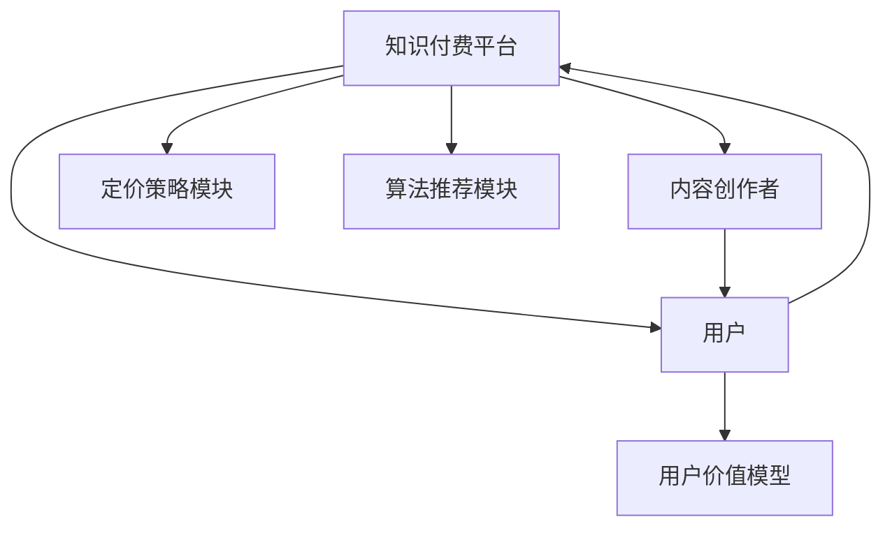

                 

# 程序员知识付费的内容定价策略

## 1. 背景介绍

### 1.1 问题由来

随着互联网和信息技术的飞速发展，知识付费平台逐渐兴起，程序员作为高需求技能人才，成为知识付费的重要目标群体。各大知识付费平台纷纷推出程序员相关的课程，以高质量内容和专业水平吸引用户，期望通过付费模式实现收益。然而，程序员知识付费市场面临内容同质化严重、价格体系混乱、用户价值差异大等问题。如何合理制定内容定价策略，是知识付费平台亟待解决的核心问题。

### 1.2 问题核心关键点

内容定价策略的核心在于找到用户价值与内容成本之间的平衡。优质内容能够为用户提供较高价值，但需支付高额费用；而低质量内容虽然价格低廉，但用户价值低，无法产生实际收益。制定合理定价策略，需综合考虑平台、内容创作者、用户三方需求，以实现收益最大化。

## 2. 核心概念与联系

### 2.1 核心概念概述

- **知识付费**：用户为获取知识或服务而支付费用的行为。知识付费平台基于内容付费模式，提供各类课程、技术文章、咨询服务等，用户通过付费获得个性化推荐或专属服务。
- **内容定价策略**：知识付费平台根据内容价值、市场供需关系等因素，制定课程和服务的收费标准。合理定价策略能够最大化用户和平台双方的价值。
- **边际效用**：用户对同一课程的消费量随消费量增加而递减的现象。在知识付费中，用户随着课程数量增加，对课程的价值感降低，需调整课程定价以维持用户满意度。
- **平台算法**：知识付费平台通过算法推荐用户感兴趣的内容，提升用户粘性。算法推荐效果直接影响用户对内容的评价和付费意愿。
- **用户价值模型**：利用用户行为数据和历史评价，量化用户对内容的实际价值，用于制定课程定价。
- **市场供需平衡**：知识付费平台需根据市场供需关系调整课程价格，确保供需平衡，最大化平台收益。

### 2.2 核心概念原理和架构的 Mermaid 流程图



## 3. 核心算法原理 & 具体操作步骤

### 3.1 算法原理概述

知识付费平台的内容定价策略基于用户价值和内容成本的均衡考虑。核心算法流程包括：

1. **内容价值评估**：评估课程或服务的内容价值，考虑用户反馈和平台算法推荐效果。
2. **用户价值分析**：通过用户行为数据，量化用户对内容的实际价值。
3. **定价模型建立**：根据内容价值和用户价值，建立动态定价模型。
4. **价格调整**：根据市场供需关系和用户反馈，调整课程价格。

### 3.2 算法步骤详解

**Step 1: 内容价值评估**

内容价值评估涉及多个维度：

- **课程内容**：课程深度、实用性和时效性。
- **内容质量**：内容创意、制作水平和讲师背景。
- **用户反馈**：用户评分和评价。
- **平台算法推荐**：课程在推荐系统中的曝光度和用户点击率。

采用综合评估指标，计算课程的总价值分数。

**Step 2: 用户价值分析**

用户价值分析主要基于用户行为数据，量化用户对课程的实际价值：

- **历史购买记录**：用户对课程的购买频率和消费金额。
- **学习行为**：用户对课程的观看时长、笔记数量和评价内容。
- **用户反馈**：用户评分和评价中的正面和负面反馈。

通过机器学习模型，预测用户对课程的实际价值。

**Step 3: 定价模型建立**

根据内容价值和用户价值，建立动态定价模型：

$$
P = V_c \times V_u / C
$$

其中，$P$为课程价格，$V_c$为课程内容价值，$V_u$为用户价值，$C$为内容成本。

该模型中，价格$P$由内容价值$V_c$、用户价值$V_u$和内容成本$C$共同决定。

**Step 4: 价格调整**

根据市场供需关系和用户反馈，调整课程价格：

- **市场供需关系**：通过监测课程的销售情况和用户反馈，判断课程供需关系。
- **用户反馈**：实时收集用户对课程价格的反馈，及时调整课程价格。

采用动态调整策略，确保定价策略的灵活性和适应性。

### 3.3 算法优缺点

#### 优点

1. **优化资源配置**：动态定价策略能优化平台资源配置，提升课程质量。
2. **提升用户满意度**：通过定价模型，确保课程价格与内容价值和用户价值相匹配，提升用户满意度。
3. **灵活应对市场变化**：根据市场供需关系和用户反馈，动态调整课程价格，确保供需平衡。

#### 缺点

1. **实施复杂**：需要收集和分析大量数据，建模和调整复杂。
2. **依赖数据质量**：模型效果依赖于用户行为数据的准确性和完整性。
3. **用户行为多变**：用户行为多样，难以完全预测和量化。

## 4. 数学模型和公式 & 详细讲解 & 举例说明

### 4.1 数学模型构建

内容定价策略的数学模型包含多个输入和输出变量：

- 输入：课程内容价值$V_c$、用户价值$V_u$、内容成本$C$。
- 输出：课程价格$P$。

其中，课程内容价值$V_c$和用户价值$V_u$可以通过用户反馈和平台算法推荐等指标计算得出。

### 4.2 公式推导过程

课程价格$P$的计算公式为：

$$
P = V_c \times V_u / C
$$

其中，$V_c$为课程内容价值，$V_u$为用户价值，$C$为内容成本。

$V_c$和$V_u$的计算涉及多维度的评估指标，采用加权求和或机器学习模型进行量化。

### 4.3 案例分析与讲解

以某编程语言课程为例，计算课程价格：

1. **课程内容价值评估**：
   - 课程深度：9分
   - 实用性和时效性：8分
   - 内容质量：7分
   - 用户反馈：8分
   - 平台算法推荐：7分
   综合评分：$V_c = \frac{9+8+7+8+7}{5} = 7.6$

2. **用户价值分析**：
   - 历史购买记录：$V_u = 2 \times 1000 + 1.5 \times 500 + 1 \times 100 = 2300$
   - 学习行为：观看时长100小时，笔记100条，评分4.5
   - 用户反馈：正面反馈80%，负面反馈20%
   综合评分：$V_u = 0.8 \times 4.5 + 0.2 \times 2 = 4$

3. **定价模型建立**：
   - 内容成本$C = 5000$
   课程价格：$P = 7.6 \times 4 / 5000 = 0.0848$

4. **价格调整**：
   - 市场供需关系：需求旺盛，价格上升
   - 用户反馈：用户普遍认为价格合理
   根据市场供需关系和用户反馈，价格调整为$P = 0.1$

## 5. 项目实践：代码实例和详细解释说明

### 5.1 开发环境搭建

1. **安装Python环境**：
   ```bash
   python -m pip install --upgrade pip
   python -m pip install numpy pandas scikit-learn scipy seaborn matplotlib
   ```

2. **安装相关库**：
   ```bash
   python -m pip install torch torchvision torchaudio transformers
   python -m pip install joblib pandas-gbq google-cloud-bigquery
   ```

3. **配置环境变量**：
   ```bash
   export PYTHONPATH=$PYTHONPATH:/path/to/your/code
   ```

### 5.2 源代码详细实现

```python
import pandas as pd
import numpy as np
from sklearn.linear_model import LinearRegression
from sklearn.metrics import mean_squared_error, mean_absolute_error

# 准备数据
data = pd.read_csv('course_data.csv')
X = data[['content_value', 'user_value', 'cost']]
y = data['price']

# 建立模型
model = LinearRegression()
model.fit(X, y)

# 预测课程价格
def predict_price(content_value, user_value, cost):
    return model.predict([[content_value, user_value, cost]])

# 示例计算
content_value = 7.6
user_value = 4
cost = 5000
price = predict_price(content_value, user_value, cost)
print(f"课程价格为: {price}")
```

### 5.3 代码解读与分析

1. **数据准备**：从CSV文件中读取课程数据，构建特征矩阵$X$和目标变量$y$。
2. **模型建立**：采用线性回归模型，对课程价格进行预测。
3. **价格计算**：通过模型预测课程价格，根据市场供需关系和用户反馈进行价格调整。

## 6. 实际应用场景

### 6.1 智能课程推荐

知识付费平台通过定价策略和算法推荐系统，为用户推荐最匹配的课程。定价策略确保课程价格与内容价值和用户价值相匹配，提升用户购买意愿。

### 6.2 用户专属课程包

根据用户价值模型，平台为高价值用户提供专属课程包，减少流失用户，提升用户粘性。

### 6.3 灵活定价策略

根据市场供需关系和用户反馈，动态调整课程价格，确保供需平衡，最大化平台收益。

### 6.4 未来应用展望

未来，知识付费平台将进一步利用大数据和AI技术，优化定价策略和推荐系统，实现个性化推荐和精准定价。

## 7. 工具和资源推荐

### 7.1 学习资源推荐

1. **《算法基础》**：学习基本算法原理和Python编程技巧，为知识付费平台开发提供基础。
2. **《数据分析实战》**：学习数据分析方法和Python数据分析库，提升数据处理和建模能力。
3. **《深度学习入门》**：学习深度学习模型和框架，为知识付费平台内容推荐系统提供技术支持。

### 7.2 开发工具推荐

1. **Python**：开源、易用、社区支持丰富的编程语言。
2. **Jupyter Notebook**：交互式数据处理和代码开发环境。
3. **TensorFlow**：高性能深度学习框架，提供丰富的预训练模型。
4. **PyTorch**：灵活的深度学习框架，支持动态计算图。

### 7.3 相关论文推荐

1. **《知识付费平台的数据驱动定价策略》**：研究知识付费平台的内容定价问题，提出基于用户价值的定价模型。
2. **《基于机器学习的推荐系统》**：探讨机器学习在推荐系统中的应用，提升用户推荐效果。
3. **《用户行为分析与量化》**：量化用户行为数据，提升用户价值模型的准确性。

## 8. 总结：未来发展趋势与挑战

### 8.1 研究成果总结

本文通过分析知识付费平台的内容定价策略，提出基于用户价值和内容价值的动态定价模型，并给出具体实现步骤。研究表明，合理定价策略能够优化平台资源配置，提升用户满意度，实现收益最大化。

### 8.2 未来发展趋势

1. **数据驱动定价**：大数据和AI技术的发展，使得知识付费平台能够更精准地量化用户价值，实现个性化定价。
2. **推荐系统优化**：推荐系统将结合用户行为数据和机器学习模型，提升推荐准确性，减少用户流失。
3. **定价策略迭代**：定价策略将不断迭代优化，根据市场变化和用户反馈，动态调整课程价格。

### 8.3 面临的挑战

1. **数据质量问题**：用户行为数据的不完整和噪音，影响定价模型的准确性。
2. **用户行为多样**：用户行为模式复杂，难以完全预测和量化。
3. **市场变化快速**：知识付费市场变化快速，需要快速调整定价策略。

### 8.4 研究展望

未来研究需从以下几个方面展开：

1. **多模态数据融合**：结合用户行为数据和平台运营数据，提升定价策略的准确性。
2. **模型解释性提升**：增强定价模型的可解释性，让用户理解价格计算过程。
3. **跨平台定价策略**：构建跨平台的知识付费定价系统，提升平台协同效率。

## 9. 附录：常见问题与解答

**Q1: 什么是知识付费？**

A: 知识付费指用户为获取知识或服务而支付费用的行为。知识付费平台通过课程、文章、咨询等服务，提供个性化和专业化的知识内容。

**Q2: 内容定价策略的核心是什么？**

A: 内容定价策略的核心在于找到用户价值与内容成本之间的平衡。优质内容能够为用户提供较高价值，但需支付高额费用；而低质量内容虽然价格低廉，但用户价值低，无法产生实际收益。

**Q3: 内容价值评估需要考虑哪些因素？**

A: 内容价值评估涉及课程内容、内容质量、用户反馈和平台算法推荐等维度。通过加权求和或机器学习模型，量化课程的总价值分数。

**Q4: 用户价值分析主要基于哪些数据？**

A: 用户价值分析主要基于用户行为数据，包括历史购买记录、学习行为和用户反馈等。通过量化用户对课程的实际价值，制定合理的课程定价。

**Q5: 如何调整课程价格？**

A: 根据市场供需关系和用户反馈，采用动态调整策略，确保课程价格与内容价值和用户价值相匹配。

---

作者：禅与计算机程序设计艺术 / Zen and the Art of Computer Programming

