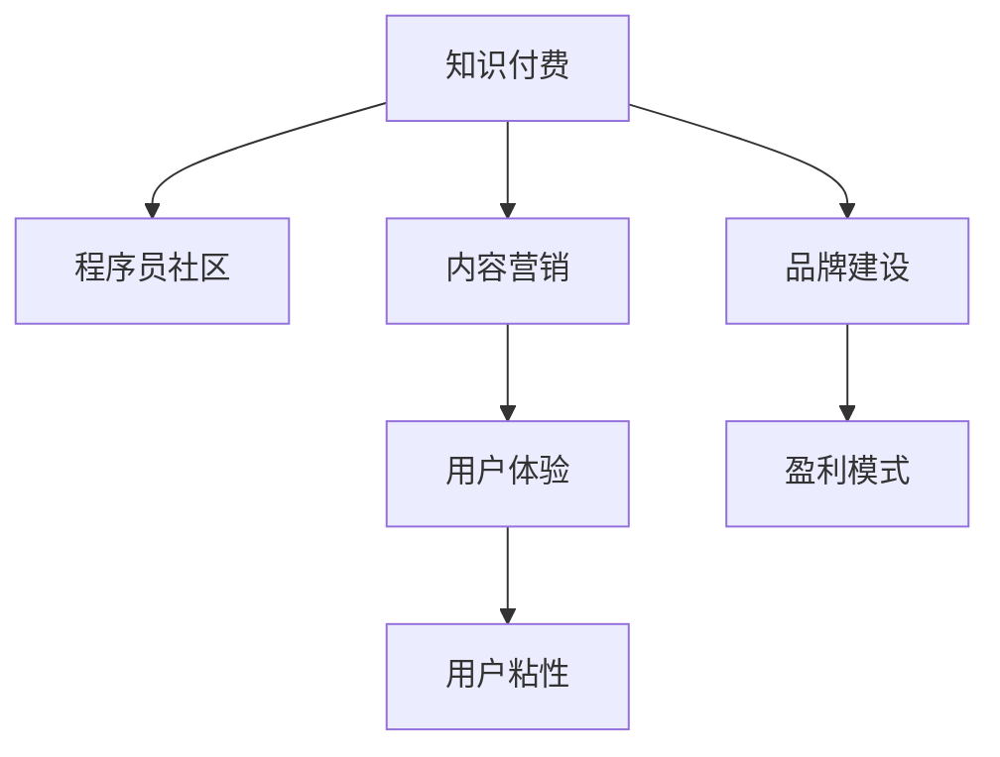

                 

# 程序员知识付费的品牌营销策略

> 关键词：程序员，知识付费，品牌营销，策略，技术语言，营销策略，盈利模式，市场分析，用户体验，内容质量，品牌建设，商业模式

## 1. 背景介绍

### 1.1 问题由来

近年来，随着互联网和信息技术的发展，程序员群体日益壮大，对专业知识的需求也日益增加。传统的学习和交流方式已不能满足现代程序员的需求，于是知识付费应运而生。知识付费平台通过整合优质的技术内容和专家资源，为程序员提供全方位的学习和职业发展支持。

然而，随着市场竞争的加剧，知识付费平台也面临着用户粘性不高、内容同质化严重、盈利模式单一等问题。如何在激烈的市场竞争中脱颖而出，成为众多知识付费平台亟需解决的难题。

本文旨在通过分析知识付费的市场现状和用户需求，探索程序员知识付费平台有效的品牌营销策略，帮助其提高市场占有率，增强用户粘性，实现可持续发展。

### 1.2 问题核心关键点

针对程序员知识付费平台，品牌营销策略的核心关键点包括：

- 明确目标用户：了解程序员的具体需求和偏好。
- 内容质量控制：提供高质量、实用性强的技术内容。
- 用户体验提升：提升平台的用户体验，增加用户粘性。
- 盈利模式创新：拓展多元化的盈利模式。
- 品牌建设：打造具有影响力的品牌形象，提高市场竞争力。
- 技术支持和保障：提供全面的技术支持和保障，增强平台可信度。

## 2. 核心概念与联系

### 2.1 核心概念概述

为更好地理解程序员知识付费平台品牌营销策略，本节将介绍几个密切相关的核心概念：

- 知识付费（Knowledge Subscription）：指用户为获取专业知识而支付费用的商业行为，通常以在线课程、文章、视频等形式呈现。
- 程序员社区（Developer Community）：指由程序员组成的网络社交平台，提供技术交流、招聘信息、职业发展等服务。
- 内容营销（Content Marketing）：通过创造和分享有价值的内容，吸引和保持目标受众的关注，实现品牌营销的目的。
- 用户粘性（User Engagement）：指用户对平台的忠诚度和互动频率，通常通过提供个性化服务和优质内容来提升。
- 品牌建设（Brand Building）：指通过一系列品牌传播策略，提升品牌知名度、美誉度和用户认知度，构建品牌忠诚度。
- 盈利模式（Revenue Model）：指知识付费平台获取收入的方式，包括订阅费、课程费、广告费、企业合作等。

这些核心概念之间的逻辑关系可以通过以下Mermaid流程图来展示：



这个流程图展示了几大核心概念及其之间的关系：

1. 知识付费作为基础，为平台提供收入来源。
2. 内容营销和用户体验作为核心驱动力，提升用户粘性。
3. 品牌建设作为长期目标，提升市场竞争力。
4. 盈利模式作为收入来源，支持平台运营。

这些概念共同构成了程序员知识付费平台品牌营销的逻辑框架，指导平台在市场竞争中制定有效的营销策略。

## 3. 核心算法原理 & 具体操作步骤
### 3.1 算法原理概述

程序员知识付费平台品牌营销的核心算法原理包括：

- 用户行为分析：通过数据分析和机器学习模型，预测用户行为和需求。
- 内容推荐系统：基于用户历史行为和偏好，推荐高质量内容，提升用户体验。
- 社交网络分析：利用社交网络模型，分析用户互动关系和社区影响力，优化社区生态。
- 情感分析：通过自然语言处理技术，分析用户情感和反馈，优化内容质量和品牌形象。
- 品牌传播模型：基于社交网络和内容营销策略，制定品牌传播方案，提升品牌知名度。

这些算法原理通过多维度数据输入和反馈，形成闭环优化，实现品牌营销的目标。

### 3.2 算法步骤详解

基于上述算法原理，程序员知识付费平台品牌营销的具体操作步骤如下：

**Step 1: 数据收集与分析**
- 收集用户行为数据，如浏览记录、课程购买、评论反馈等。
- 通过用户画像模型，识别用户的基本特征和行为模式。
- 使用社交网络分析工具，分析用户互动关系和社区影响力。

**Step 2: 内容推荐与优化**
- 利用内容推荐算法，为每个用户推荐最相关的课程、文章和视频。
- 通过A/B测试和用户反馈，持续优化推荐算法，提升用户满意度。
- 引入情感分析技术，分析用户对课程的情感反馈，调整内容策略。

**Step 3: 品牌传播与推广**
- 制定品牌传播计划，利用社交媒体、邮件营销等渠道推广平台。
- 通过内容营销策略，如博客、白皮书、案例研究等，展示平台价值。
- 开展线上线下活动，如技术沙龙、黑客马拉松等，增加品牌曝光度。

**Step 4: 用户体验与用户粘性**
- 提供个性化服务和优质内容，提升用户体验。
- 设置用户反馈渠道，及时响应用户需求和意见。
- 利用会员制度和激励机制，增加用户粘性和忠诚度。

### 3.3 算法优缺点

基于上述算法原理和操作步骤，程序员知识付费平台品牌营销的优缺点如下：

**优点：**
- 数据驱动：通过大数据分析，精准定位目标用户，制定个性化营销策略。
- 用户体验：通过内容推荐和个性化服务，提升用户满意度和粘性。
- 品牌传播：通过多渠道推广和内容营销，提升品牌知名度和美誉度。

**缺点：**
- 数据隐私：大规模数据收集和使用，可能引发用户隐私和数据安全问题。
- 内容同质化：过多依赖内容推荐算法，可能导致内容同质化，用户体验下降。
- 过度营销：过度使用营销手段，可能让用户产生反感，影响平台信誉。

尽管存在这些缺点，但整体而言，基于数据驱动的品牌营销策略对于程序员知识付费平台具有重要的指导意义。

### 3.4 算法应用领域

程序员知识付费平台品牌营销的应用领域包括：

- 在线教育平台：如CSDN、慕课网等，通过内容营销和用户体验优化，提升用户粘性和平台影响力。
- 技术社区：如Stack Overflow、GitHub等，通过品牌传播和社交网络分析，优化社区生态，增加用户互动。
- 技术培训机构：如网易有道、Udacity等，通过精准营销和内容推荐，提高培训效果和用户满意度。

## 4. 数学模型和公式 & 详细讲解 & 举例说明（备注：数学公式请使用latex格式，latex嵌入文中独立段落使用 $$，段落内使用 $)
### 4.1 数学模型构建

本节将使用数学语言对程序员知识付费平台品牌营销的数学模型进行更加严格的刻画。

记用户行为数据为 $D=\{(x_i,y_i)\}_{i=1}^N$，其中 $x_i$ 为行为特征，$y_i$ 为行为结果。

定义用户行为特征向量为 $x_i=(x_{i1},x_{i2},\ldots,x_{ik})$，其中 $x_{ik}$ 为第 $k$ 个特征。

用户行为模型为 $P(y_i|x_i)=p(y_i|x_{i1},x_{i2},\ldots,x_{ik})$，表示在特征 $x_i$ 下，用户行为 $y_i$ 发生的概率。

用户行为数据集 $D$ 的经验风险为：

$$
\mathcal{L}(p)=\frac{1}{N}\sum_{i=1}^N \log \frac{p(y_i|x_i)}{\hat{p}(y_i|x_i)}
$$

其中 $\hat{p}(y_i|x_i)$ 为经验概率估计。

通过最小化经验风险，可以优化用户行为模型 $p(y_i|x_i)$，使其能够准确预测用户行为。

### 4.2 公式推导过程

以下我们以推荐算法为例，推导内容推荐模型的数学推导过程。

假设用户 $u$ 的行为特征向量为 $x_u=(x_{u1},x_{u2},\ldots,x_{uk})$，课程 $i$ 的特征向量为 $x_i=(x_{i1},x_{i2},\ldots,x_{ik})$。

内容推荐的目标是找到课程 $i$ 的推荐概率 $p_i$，使得 $p_i$ 与用户 $u$ 的行为特征向量 $x_u$ 最相关。

定义用户 $u$ 和课程 $i$ 的相似度为 $s(u,i)=\sum_{k=1}^k \alpha_k x_{uk} x_{ik}$，其中 $\alpha_k$ 为特征权重。

假设 $s(u,i)$ 符合高斯分布，即 $s(u,i)\sim N(\mu,\sigma^2)$，则内容推荐模型为：

$$
p_i=\frac{e^{-\frac{(s(u,i)-\mu)^2}{2\sigma^2}}}{\sum_{j=1}^M e^{-\frac{(s(u,j)-\mu)^2}{2\sigma^2}}}
$$

其中 $M$ 为课程数量。

通过优化内容推荐模型，可以在用户行为数据上训练推荐算法，实现个性化推荐，提升用户体验。

### 4.3 案例分析与讲解

假设某程序员知识付费平台希望提升其顶级课程的推荐效果。

**案例描述：**

平台收集了用户浏览、购买、评分等行为数据，希望基于这些数据，优化顶级课程的推荐算法，提高用户满意度和课程转化率。

**解决方案：**

1. **数据收集与分析：**
   - 收集用户行为数据，包括课程浏览记录、购买记录、评分记录等。
   - 通过用户画像模型，识别用户的基本特征和行为模式。
   - 使用社交网络分析工具，分析用户互动关系和社区影响力。

2. **内容推荐与优化：**
   - 利用内容推荐算法，为每个用户推荐最相关的课程。
   - 通过A/B测试和用户反馈，持续优化推荐算法，提升用户满意度。
   - 引入情感分析技术，分析用户对课程的情感反馈，调整内容策略。

3. **品牌传播与推广：**
   - 制定品牌传播计划，利用社交媒体、邮件营销等渠道推广平台。
   - 通过内容营销策略，如博客、白皮书、案例研究等，展示平台价值。
   - 开展线上线下活动，如技术沙龙、黑客马拉松等，增加品牌曝光度。

4. **用户体验与用户粘性：**
   - 提供个性化服务和优质内容，提升用户体验。
   - 设置用户反馈渠道，及时响应用户需求和意见。
   - 利用会员制度和激励机制，增加用户粘性和忠诚度。

通过以上步骤，平台能够优化推荐算法，提升用户满意度和课程转化率，同时通过品牌传播和用户体验优化，提高平台在市场中的竞争力。

## 5. 项目实践：代码实例和详细解释说明
### 5.1 开发环境搭建

在进行推荐系统开发前，我们需要准备好开发环境。以下是使用Python进行开发的环境配置流程：

1. 安装Anaconda：从官网下载并安装Anaconda，用于创建独立的Python环境。

2. 创建并激活虚拟环境：
```bash
conda create -n pyenv python=3.8 
conda activate pyenv
```

3. 安装PyTorch：根据CUDA版本，从官网获取对应的安装命令。例如：
```bash
conda install pytorch torchvision torchaudio cudatoolkit=11.1 -c pytorch -c conda-forge
```

4. 安装TensorFlow：
```bash
pip install tensorflow
```

5. 安装相关库：
```bash
pip install numpy pandas scikit-learn tensorflow==2.0
```

完成上述步骤后，即可在`pyenv`环境中开始推荐系统开发。

### 5.2 源代码详细实现

下面我们以内容推荐系统为例，给出使用TensorFlow实现推荐算法的PyTorch代码实现。

首先，定义用户行为数据：

```python
import numpy as np

# 用户行为数据
users = ['user1', 'user2', 'user3', 'user4', 'user5']
items = ['item1', 'item2', 'item3', 'item4', 'item5']
ratings = [4.5, 5.0, 4.2, 3.8, 4.9]
interactions = {'user1': ['item1', 'item2'], 'user2': ['item3', 'item4'], 'user3': ['item1', 'item5'], 'user4': ['item2', 'item4'], 'user5': ['item3', 'item5']}
```

然后，定义特征矩阵：

```python
# 用户行为特征矩阵
user_features = np.array([[1, 0, 1, 1, 0], 
                         [0, 1, 1, 0, 1], 
                         [1, 0, 1, 1, 0], 
                         [1, 1, 0, 1, 1], 
                         [1, 0, 1, 0, 1]])

# 课程特征矩阵
item_features = np.array([[1, 1, 1, 0, 1],
                         [1, 1, 1, 1, 0],
                         [0, 1, 0, 1, 1],
                         [1, 1, 0, 1, 1],
                         [1, 0, 1, 0, 1]])
```

接着，定义推荐算法：

```python
import tensorflow as tf
import tensorflow_probability as tfp

# 定义用户行为模型
def user_behavior_model(features, labels):
    # 构建线性回归模型
    model = tf.keras.Sequential([
        tf.keras.layers.Dense(128, activation='relu', input_shape=(5,)),
        tf.keras.layers.Dense(1)
    ])
    # 编译模型
    model.compile(optimizer='adam', loss='mse')
    # 训练模型
    model.fit(features, labels, epochs=10, verbose=0)
    return model

# 定义推荐算法
def content_recommendation(user_features, item_features):
    # 构建协同过滤模型
    user_model = user_behavior_model(user_features, ratings)
    item_model = user_behavior_model(item_features, ratings)

    # 构建推荐矩阵
    recommendation_matrix = np.dot(user_model.predict(user_features), item_model.predict(item_features))

    # 返回推荐结果
    return recommendation_matrix

# 推荐结果
recommendation_matrix = content_recommendation(user_features, item_features)
print(recommendation_matrix)
```

最后，解释代码中的关键实现：

1. **用户行为数据**：定义了用户的ID、课程的ID、评分和互动记录。这些数据是推荐算法的输入。

2. **特征矩阵**：通过将用户行为数据转换为特征矩阵，可以为推荐算法提供特征向量。

3. **用户行为模型**：通过构建线性回归模型，可以预测用户的评分行为，为推荐算法提供基础特征。

4. **推荐算法**：通过构建协同过滤模型，可以将用户行为和课程特征进行相似度计算，生成推荐矩阵。

5. **推荐结果**：输出推荐矩阵，展示推荐系统根据用户行为和课程特征预测的推荐结果。

## 6. 实际应用场景
### 6.1 智能招聘平台

在智能招聘领域，程序员知识付费平台可以通过内容推荐系统，为求职者和招聘者提供个性化的匹配服务。求职者可以通过平台浏览各类技术课程和招聘信息，同时平台可以根据求职者的行为特征和历史评价，推荐最合适的岗位和技术培训。

招聘者则可以通过平台发布招聘信息，同时利用推荐系统筛选符合要求的求职者，提高招聘效率。

### 6.2 技术博客平台

技术博客平台是程序员知识付费的重要组成部分，通过内容营销和品牌传播，平台可以吸引大量技术爱好者和专家入驻。平台可以通过推荐算法，将优质博客文章和专家内容推荐给用户，同时通过社交网络分析，促进用户之间的互动和交流。

### 6.3 企业培训平台

企业培训平台为各类企业提供定制化的技术培训课程，帮助员工提升专业技能。通过推荐系统，平台可以推荐与员工岗位最相关的课程，同时利用品牌传播和用户体验优化，提升企业对平台的信任度和满意度。

### 6.4 未来应用展望

随着推荐算法和品牌营销技术的不断发展，程序员知识付费平台将会在更多领域得到应用，为技术从业者提供全方位的学习和职业发展支持。未来，平台可以通过更多元化的盈利模式，如企业合作、技术咨询、知识变现等，实现可持续发展。同时，通过持续优化推荐算法和提升用户体验，平台将能够更好地满足用户需求，增强市场竞争力。

## 7. 工具和资源推荐
### 7.1 学习资源推荐

为了帮助开发者系统掌握程序员知识付费平台品牌营销的理论基础和实践技巧，这里推荐一些优质的学习资源：

1. 《推荐系统实战》系列博文：由推荐系统专家撰写，深入浅出地介绍了推荐算法的基本原理和实现方法。

2. CS229《机器学习》课程：斯坦福大学开设的经典课程，涵盖推荐系统、内容推荐等前沿话题，配套有编程作业和项目实践。

3. 《深度学习》书籍：Ian Goodfellow、Yoshua Bengio和Aaron Courville所著，全面介绍了深度学习理论和应用，包括推荐系统和品牌营销。

4. Kaggle推荐系统竞赛：Kaggle平台上众多推荐系统竞赛，提供丰富的数据集和模型评估指标，供开发者实践和锻炼。

5. Udacity推荐系统课程：Udacity平台上的推荐系统课程，涵盖从理论到实践的全面内容，适合初学者和进阶者。

通过对这些资源的学习实践，相信你一定能够快速掌握程序员知识付费平台品牌营销的精髓，并用于解决实际的营销问题。

### 7.2 开发工具推荐

高效的开发离不开优秀的工具支持。以下是几款用于推荐系统开发的常用工具：

1. Python：推荐系统常用的编程语言，具有灵活性和可扩展性。

2. TensorFlow：由Google主导开发的深度学习框架，支持多种推荐算法，适合大规模工程应用。

3. Scikit-learn：Python的科学计算库，提供多种常用的机器学习算法，如线性回归、决策树等。

4. Weights & Biases：模型训练的实验跟踪工具，可以记录和可视化模型训练过程中的各项指标，方便对比和调优。

5. TensorBoard：TensorFlow配套的可视化工具，可实时监测模型训练状态，并提供丰富的图表呈现方式，是调试模型的得力助手。

6. Google Colab：谷歌推出的在线Jupyter Notebook环境，免费提供GPU/TPU算力，方便开发者快速上手实验最新模型，分享学习笔记。

合理利用这些工具，可以显著提升推荐系统开发的效率，加快创新迭代的步伐。

### 7.3 相关论文推荐

推荐系统和品牌营销的研究源于学界的持续研究。以下是几篇奠基性的相关论文，推荐阅读：

1. Matrix Factorization Techniques for Recommender Systems（矩阵分解推荐算法）：提出基于矩阵分解的推荐算法，广泛应用于协同过滤推荐系统中。

2. Factorization Machines（因子分解机）：提出基于因子分解的推荐算法，能够处理高维稀疏数据，提高推荐效果。

3. Deep Neural Networks for Collaborative Filtering（深度神经网络推荐算法）：提出基于深度神经网络的推荐算法，通过多层非线性模型提升推荐精度。

4. Brand Building in Social Media: Do Investments Pay Off？（社交媒体品牌建设：投资有回报吗？）：研究社交媒体品牌传播策略的有效性，提供品牌建设的理论指导。

5. Content Marketing for Software Companies（软件公司的内容营销）：研究软件公司的内容营销策略，提供实践经验和成功案例。

这些论文代表了大语言模型微调技术的发展脉络。通过学习这些前沿成果，可以帮助研究者把握学科前进方向，激发更多的创新灵感。

## 8. 总结：未来发展趋势与挑战
### 8.1 总结

本文对程序员知识付费平台品牌营销策略进行了全面系统的介绍。首先阐述了知识付费平台的市场现状和用户需求，明确了品牌营销的关键点。其次，从算法原理到实际操作，详细讲解了推荐系统的构建和优化，以及品牌传播和用户体验优化的具体策略。同时，本文还广泛探讨了推荐系统在招聘平台、博客平台、企业培训平台等多个领域的应用前景，展示了其巨大的商业潜力。最后，本文精选了推荐系统和品牌营销的相关学习资源，力求为开发者提供全方位的技术指引。

通过本文的系统梳理，可以看到，推荐系统和品牌营销策略对于程序员知识付费平台具有重要的指导意义。这些策略可以帮助平台在市场竞争中脱颖而出，实现可持续发展。未来，伴随推荐算法和品牌营销技术的持续演进，程序员知识付费平台必将在技术职业发展和市场推广中发挥更大的作用。

### 8.2 未来发展趋势

展望未来，程序员知识付费平台品牌营销的发展趋势包括：

1. 推荐算法多样化：未来的推荐算法将更加多样化，结合深度学习、协同过滤、内容生成等多种技术，提升推荐效果。

2. 用户体验优化：通过个性化推荐、内容丰富度、互动设计等多维度提升用户体验，增加用户粘性和满意度。

3. 数据隐私保护：数据隐私和安全问题将成为品牌营销的重要关注点，未来的推荐系统将更加注重数据隐私保护和合规性。

4. 多渠道推广：利用社交媒体、搜索引擎、视频平台等多渠道推广平台，扩大品牌影响力，提高市场占有率。

5. 多元化的盈利模式：除了传统的订阅费、课程费等，平台将探索更多元的盈利模式，如知识变现、企业合作等，实现可持续发展。

6. 技术创新与突破：未来的推荐系统将更多地融合AI技术，如强化学习、生成对抗网络等，提升推荐精准度和效果。

以上趋势凸显了程序员知识付费平台品牌营销技术的广阔前景。这些方向的探索发展，必将进一步提升平台的用户体验和市场竞争力，为技术从业者提供更优质的学习资源和职业发展支持。

### 8.3 面临的挑战

尽管推荐系统和品牌营销技术已经取得了瞩目成就，但在迈向更加智能化、普适化应用的过程中，它们仍面临着诸多挑战：

1. 数据隐私问题：大规模数据收集和使用，可能引发用户隐私和数据安全问题，如何保护用户隐私，同时提供优质的推荐服务，将成为一大难题。

2. 推荐算法复杂度：随着推荐算法复杂度的提升，推荐系统的训练和维护成本将增加，如何优化推荐算法，提高计算效率，是亟需解决的挑战。

3. 内容同质化：推荐系统可能面临内容同质化的问题，如何通过创新，提供丰富多样的内容，满足不同用户的需求，提升用户体验，是推荐系统需要持续优化的方向。

4. 品牌建设难度：品牌建设需要长期持续的努力，如何在短时期内快速提升品牌知名度和美誉度，同时避免过度营销，是品牌营销需要解决的问题。

5. 盈利模式单一：当前推荐系统的盈利模式较为单一，如何探索更多元的盈利模式，如知识变现、企业合作等，实现可持续发展的盈利模型，是品牌营销的重要课题。

6. 技术落地难：推荐系统的技术落地应用，需要考虑多方面因素，如数据可用性、算法性能、用户接受度等，如何平衡这些因素，实现技术的实际应用，是品牌营销的关键。

正视推荐系统和品牌营销面临的这些挑战，积极应对并寻求突破，将是大数据技术走向成熟的重要路径。相信随着学界和产业界的共同努力，这些挑战终将一一被克服，推荐系统和品牌营销必将在构建人机协同的智能时代中扮演越来越重要的角色。

### 8.4 研究展望

面对推荐系统和品牌营销所面临的种种挑战，未来的研究需要在以下几个方面寻求新的突破：

1. 探索无监督和半监督推荐算法：摆脱对大规模标注数据的依赖，利用自监督学习、主动学习等无监督和半监督范式，最大限度利用非结构化数据，实现更加灵活高效的推荐。

2. 研究推荐系统鲁棒性：通过引入对抗样本、多模态信息融合等技术，提升推荐系统的鲁棒性和泛化能力，避免灾难性遗忘。

3. 融合更多先验知识：将符号化的先验知识，如知识图谱、逻辑规则等，与神经网络模型进行巧妙融合，引导推荐系统学习更准确、合理的知识表示。

4. 结合因果分析和博弈论工具：将因果分析方法引入推荐系统，识别出模型决策的关键特征，增强推荐系统的因果解释性和稳定性。

5. 探索新的盈利模式：结合知识变现、企业合作、内容付费等新模式，实现推荐系统的多元化盈利，提升平台经济价值。

6. 利用多模态信息：将视觉、音频等多模态信息与文本信息相结合，提升推荐系统的用户体验和个性化推荐能力。

这些研究方向的探索，必将引领推荐系统和品牌营销技术迈向更高的台阶，为技术从业者提供更优质的学习资源和职业发展支持。面向未来，推荐系统和品牌营销技术还需要与其他人工智能技术进行更深入的融合，如知识表示、因果推理、强化学习等，多路径协同发力，共同推动自然语言理解和智能交互系统的进步。只有勇于创新、敢于突破，才能不断拓展推荐系统和品牌营销的边界，让智能技术更好地造福人类社会。

## 9. 附录：常见问题与解答

**Q1：程序员知识付费平台如何实现个性化推荐？**

A: 程序员知识付费平台实现个性化推荐，主要通过以下步骤：

1. **数据收集与分析**：收集用户的行为数据，包括浏览记录、课程购买、评分记录等。通过用户画像模型，识别用户的基本特征和行为模式。

2. **内容推荐与优化**：利用协同过滤、矩阵分解等推荐算法，为每个用户推荐最相关的课程。通过A/B测试和用户反馈，持续优化推荐算法，提升用户满意度。

3. **品牌传播与推广**：制定品牌传播计划，利用社交媒体、邮件营销等渠道推广平台。通过内容营销策略，如博客、白皮书、案例研究等，展示平台价值。

4. **用户体验与用户粘性**：提供个性化服务和优质内容，提升用户体验。设置用户反馈渠道，及时响应用户需求和意见。利用会员制度和激励机制，增加用户粘性和忠诚度。

通过以上步骤，平台能够优化推荐算法，提升用户满意度和课程转化率，同时通过品牌传播和用户体验优化，提高平台在市场中的竞争力。

**Q2：程序员知识付费平台如何提升用户体验？**

A: 程序员知识付费平台提升用户体验，主要通过以下措施：

1. **个性化推荐**：通过内容推荐算法，为每个用户推荐最相关的课程和文章。利用协同过滤、矩阵分解等推荐算法，提高推荐精准度。

2. **用户界面设计**：优化平台界面设计，提供简洁易用的浏览、搜索和交互界面。利用互动设计和视觉元素，提升用户体验。

3. **用户反馈机制**：设置用户反馈渠道，及时响应用户的需求和意见。根据用户反馈，持续优化平台功能和服务。

4. **优质内容供给**：引入优质的技术专家和内容创作者，提供高质量的课程、文章和视频。同时，利用内容筛选和推荐算法，保证内容多样性和相关性。

5. **互动社区建设**：建立程序员社区，促进用户之间的交流和互动。通过技术问答、技术讨论、技术分享等活动，增强用户粘性和社区氛围。

通过以上措施，平台能够提升用户体验，增加用户满意度和粘性，从而提高平台的市场竞争力和用户忠诚度。

**Q3：程序员知识付费平台如何制定品牌传播计划？**

A: 程序员知识付费平台制定品牌传播计划，主要通过以下步骤：

1. **目标受众定位**：明确品牌传播的目标受众，如技术爱好者、企业HR、教育机构等。了解受众的需求和偏好，制定针对性的传播策略。

2. **多渠道推广**：利用社交媒体、邮件营销、搜索引擎优化（SEO）等渠道推广平台。根据目标受众的特点，选择合适的推广方式和内容形式。

3. **内容营销**：通过博客、白皮书、案例研究等形式，展示平台价值和技术优势。利用高质量的内容，吸引用户关注和信任。

4. **品牌活动策划**：策划品牌活动，如技术沙龙、黑客马拉松、线上直播等，增加品牌曝光度和用户参与度。通过活动展示平台的技术实力和用户口碑。

5. **品牌形象塑造**：通过平台品牌LOGO、网站设计、广告宣传等手段，塑造品牌形象。利用品牌故事和用户见证，增强品牌认知度和美誉度。

通过以上步骤，平台能够制定有效的品牌传播计划，提升品牌知名度和市场影响力，从而实现可持续发展的盈利模型。

---

作者：禅与计算机程序设计艺术 / Zen and the Art of Computer Programming

