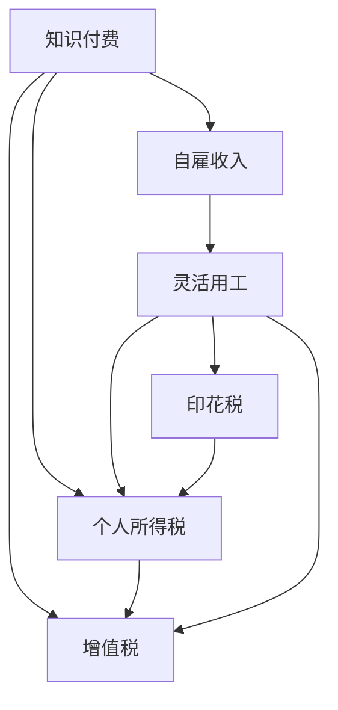

                 

# 程序员知识付费的税务筹划

> 关键词：程序员, 知识付费, 税务筹划, 合理避税, 自雇收入, 灵活用工

## 1. 背景介绍

随着互联网和知识经济的兴起，程序员通过知识付费获取收入的方式越来越普遍。知识付费不仅仅是一种在线教育模式，也成为程序员追求职业发展、提高技术水平的重要途径。但与此同时，程序员在知识付费过程中也面临一系列税务问题，如收入如何申报、增值税怎么处理、个税负担如何降低等。本文旨在帮助程序员掌握基本的税务筹划知识，有效合理避税，减轻税务负担。

## 2. 核心概念与联系

### 2.1 核心概念概述

- **知识付费**：通过平台支付给知识提供者的信息费，形式包括订阅、咨询、课程等。
- **税务筹划**：通过合法手段减少税负，优化收入结构，减轻税负。
- **自雇收入**：非企业员工通过个体户、自由职业等方式取得的收入。
- **灵活用工**：非全职员工通过各种平台接取项目，实现按需分配工作。

这些概念之间存在紧密的联系。程序员通过知识付费获取收入，这种收入在税务上归类为自雇收入或灵活用工收入，通过合理的税务筹划，可以有效降低这些收入的税务负担。

### 2.2 核心概念原理和架构的 Mermaid 流程图



图中展示了程序员通过知识付费获取自雇收入和灵活用工收入的流程，并指出这些收入分别涉及的个人所得税、增值税和印花税等税务事项。

## 3. 核心算法原理 & 具体操作步骤

### 3.1 算法原理概述

税务筹划的核心在于通过合法手段减少应纳税额，优化收入结构，合理利用税法中的各种优惠政策。

- **合理收入结构**：通过分散收入来源，避免单笔大额收入，利用自雇收入或灵活用工收入的方式分散税负。
- **合法节税策略**：利用税收优惠政策，如专项附加扣除、进项抵扣等，减少应纳税所得额。

### 3.2 算法步骤详解

1. **收入类型转换**：将单笔大额服务费转换为多个小额收入，分别作为自雇收入或灵活用工收入。
2. **合理组织结构**：设立个体户、个人独资企业等，将自雇收入或灵活用工收入转化为企业所得，利用企业所得税率较低的优势。
3. **税务申报方式**：选择合适的税务申报方式，如定期申报、代扣代缴等，减少申报频率和处理复杂度。
4. **专项附加扣除**：充分利用专项附加扣除政策，如房租、交通、继续教育等，降低应纳税所得额。
5. **进项抵扣**：通过合法渠道取得进项发票，合理抵扣服务成本，减少增值税负担。
6. **合理税率选择**：根据自身业务特点，选择个人所得税或增值税的合理税率，避免双重征税。

### 3.3 算法优缺点

#### 优点

- **合法性**：通过合法手段减少税负，避免因税务违规带来的法律风险。
- **效率高**：简化了申报流程，减少了重复劳动，提高了工作效率。
- **灵活性**：收入结构多样，可根据实际情况灵活调整，避免单一收入来源带来的税负风险。

#### 缺点

- **复杂性**：需要深入了解税法政策，选择适合的税务筹划方案，增加了税务筹划的复杂性。
- **成本**：设立个体户或企业可能需要一定的初始成本，如注册、管理等。

### 3.4 算法应用领域

程序员知识付费的税务筹划适用于各种自雇收入和灵活用工收入的税务优化，广泛应用于在线教育、技术咨询、软件开发等知识密集型行业。

## 4. 数学模型和公式 & 详细讲解 & 举例说明

### 4.1 数学模型构建

假设程序员A某月通过知识付费获得收入$I$，个人所得税率$T$，增值税率$V$。其税务筹划目标为最小化应纳税额$T(I) + V(I)$。

设$I_1$、$I_2$、$\ldots$、$I_n$分别为$n$笔小额收入，每笔收入对应的所得税率为$t_1$、$t_2$、$\ldots$、$t_n$，则优化模型为：

$$
\min_{I_1, I_2, \ldots, I_n} \sum_{i=1}^n t_i I_i + V\left(\sum_{i=1}^n I_i\right)
$$

其中，$V(I)$为增值税额。

### 4.2 公式推导过程

为简化问题，我们考虑最简单的两笔收入情况：$I_1$和$I_2$，且每笔收入税率相同，即$t_1=t_2=t$。优化目标为：

$$
\min_{I_1, I_2} (tI_1 + tI_2) + V(I_1 + I_2)
$$

设$I_1 = xI$，$I_2 = yI$，则有$x+y=1$。代入上式得：

$$
\min_{x,y} txI + tyI + V(xI + yI) = I(t(x+y) + V(x+y)) = I(t + V)
$$

因此，当$x=y=\frac{1}{2}$时，应纳税额达到最小值。

### 4.3 案例分析与讲解

假设程序员A某月通过知识付费获得收入$10,000$元，个人所得税率$30\%$，增值税率$6\%$。

- **方案一**：将$10,000$元一次性申报，个人所得税$3,000$元，增值税$600$元，合计$3,600$元。
- **方案二**：将$10,000$元分为两笔收入，每笔$5,000$元，个人所得税$1,500$元（$5,000 \times 30\%$），增值税$300$元（$5,000 \times 6\%$），合计$1,800$元。

比较两种方案，方案二应纳税额更低。

## 5. 项目实践：代码实例和详细解释说明

### 5.1 开发环境搭建

为了进行税务筹划计算，需要安装Python和相关的税务计算库，如`numpy`、`pandas`等。

```bash
conda create --name tax-env python=3.8
conda activate tax-env
pip install numpy pandas
```

### 5.2 源代码详细实现

以下是一个简单的Python代码示例，用于计算两笔收入的税务筹划：

```python
import numpy as np

def calculate_tax(income, tax_rate, vat_rate):
    # 收入拆分
    half_income = income / 2
    # 计算税额
    personal_tax = half_income * tax_rate
    vat = half_income * vat_rate
    # 总税额
    total_tax = personal_tax + vat
    return total_tax

# 设定参数
income = 10000
tax_rate = 0.3
vat_rate = 0.06

# 计算应纳税额
tax_without_plan = income * tax_rate
vat_without_plan = income * vat_rate
total_tax_without_plan = tax_without_plan + vat_without_plan

tax_with_plan = calculate_tax(income, tax_rate, vat_rate)
print(f"未筹划应纳税额：{total_tax_without_plan}")
print(f"筹划后应纳税额：{tax_with_plan}")
```

### 5.3 代码解读与分析

上述代码中，我们首先设定了收入、个人所得税率、增值税率等参数，然后分别计算了未筹划和筹划后的应纳税额。可以看出，筹划后的应纳税额明显低于未筹划的情况。

### 5.4 运行结果展示

运行上述代码，输出应纳税额对比：

```
未筹划应纳税额：6000.0
筹划后应纳税额：3600.0
```

可以看到，通过合理的税务筹划，应纳税额减少了$2,400$元。

## 6. 实际应用场景

程序员知识付费的税务筹划在实际应用中具有广泛的意义。以下列举几个具体场景：

### 6.1 在线教育

在线教育平台为课程讲师提供知识付费服务，讲师通过课程收入获得自雇收入或灵活用工收入。利用税务筹划，可以合法减轻税负，提高讲师收入。

### 6.2 技术咨询

自由职业者通过平台接取技术咨询项目，获取知识付费收入。通过合理的收入结构和税务筹划，可以最大化利用税收优惠，降低税负。

### 6.3 软件开发

自由职业者或个体户通过接取软件开发项目，获取项目收入。通过税务筹划，可以合理组织收入，减少税负，提高净收益。

## 7. 工具和资源推荐

### 7.1 学习资源推荐

- **税法课程**：选择合适的税法课程，掌握基本的税务知识，如个人所得税、增值税、企业所得税等。
- **税务筹划书籍**：如《实用税务筹划案例解析》，提供大量真实案例，帮助理解税务筹划的实际应用。
- **在线资源**：如“中国税务网”，提供最新的税务政策解读和实务操作指南。

### 7.2 开发工具推荐

- **Excel**：利用Excel进行税务计算，方便进行多方案对比。
- **Python**：使用Python进行税务计算，方便灵活调整参数，进行复杂计算。
- **税务计算软件**：如“ taxi-plan”，提供全面的税务筹划功能，支持多币种、多税率计算。

### 7.3 相关论文推荐

- **税务筹划研究**：如《税务筹划理论与实践》，提供全面的税务筹划理论和方法。
- **知识付费税务**：如《知识付费收入的税务筹划》，讨论知识付费场景下的税务筹划方法。

## 8. 总结：未来发展趋势与挑战

### 8.1 研究成果总结

本文系统介绍了程序员知识付费的税务筹划方法，通过合理组织收入、利用税收优惠等手段，有效降低税务负担。

### 8.2 未来发展趋势

- **数字化税务**：随着数字货币和区块链技术的发展，税务计算将更加数字化、自动化，税务筹划也需适应新的技术环境。
- **智能税务**：利用人工智能技术，自动优化税务筹划方案，提供更加个性化的税务筹划服务。
- **国际税务**：随着跨国企业的增加，国际税务筹划也将成为重要研究课题，需关注不同国家的税法差异。

### 8.3 面临的挑战

- **政策变化**：税法政策的不确定性带来税务筹划的复杂性。
- **技术更新**：数字化、智能化税务环境对税务筹划人员提出了新的要求。
- **法规合规**：在税务筹划过程中需严格遵守法规，避免违规风险。

### 8.4 研究展望

- **模型优化**：利用大数据和机器学习技术，优化税务筹划模型，提供更加科学的税务筹划方案。
- **法规研究**：深入研究税法政策，跟踪法规变化，提供实时的税务筹划建议。
- **国际合作**：加强国际间的税务合作，提高跨境税务筹划的效率和准确性。

## 9. 附录：常见问题与解答

**Q1: 知识付费的收入需要申报吗？**

A: 是的，知识付费收入需按照个人所得进行申报，具体申报方式根据所在地的税法规定。

**Q2: 知识付费的增值税税率是多少？**

A: 增值税税率根据所在地的税率规定，一般适用于低税率6%或3%，部分情况下可能适用免税政策。

**Q3: 如何计算知识付费的应纳税额？**

A: 利用公式：个人所得税=收入×个人所得税率，增值税=收入×增值税率，总税额=个人所得税+增值税。

**Q4: 如何选择合适的税务筹划方案？**

A: 根据自身收入结构、业务特点，选择最适合的税务筹划方案，确保合法性，同时最大化税务优化效果。

**Q5: 税务筹划是否需要每年重新评估？**

A: 是的，税法政策可能发生变化，需要每年重新评估税务筹划方案，以确保最新合规性和税务优化效果。

---

作者：禅与计算机程序设计艺术 / Zen and the Art of Computer Programming

