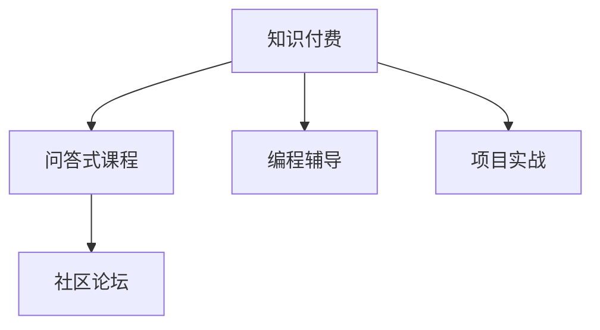

                 

# 程序员知识付费：打造问答式课程

## 1. 背景介绍

### 1.1 问题由来

随着互联网和教育技术的快速发展，知识付费模式已经成为一种流行且有效的教育方式。无论是在线教育平台，还是社区论坛、知识问答网站，都涌现出大量高质量的付费课程。而作为知识付费的主要供给者，程序员的知识经验被越来越多地转化为付费产品，满足了市场需求。

这一趋势的背后，是程序员社区对高质量技术内容、实践经验和项目经验的高度需求。很多程序员愿意通过付费方式获取权威、深入且实用的技术知识和实践指导，以加速自身技术成长，应对日益复杂的业务需求。

### 1.2 问题核心关键点

当下，程序员知识付费的趋势主要体现在以下几方面：

- 知识产品多样化：从传统的视频教程、电子书，到在线编程练习、编程辅导、项目实战等，知识付费产品覆盖了从基础到进阶的各个技术领域。
- 服务对象精准：知识付费平台往往根据特定编程语言、技术栈或职业需求，定制高质量课程，满足用户个性化学习需求。
- 内容更新快速：随着新技术的不断涌现，知识付费产品的内容更新速度加快，确保用户能够掌握最新技术动态和应用实践。
- 互动性增强：除了单向视频和图文教程，越来越多的课程加入了互动元素，如实时问答、代码审查、项目评审等，提升了用户的学习体验。
- 课程质量提升：付费用户对课程质量的期望不断提高，开发者需要通过深入浅出的讲解、实用高效的项目案例，才能赢得用户口碑。

### 1.3 问题研究意义

研究程序员知识付费模式，对于开发者提升自身价值、拓宽知识传播途径、推动技术普及具有重要意义：

- 提升个人价值：高质量的付费课程，有助于程序员系统学习先进技术，提升解决实际问题的能力，增加职场竞争力。
- 拓宽知识传播：知识付费平台为程序员提供了一个新的技术分享平台，知识付费模式大大降低了知识传播的门槛，促进了技术交流和社区建设。
- 加速技术普及：随着知识付费模式的发展，越来越多的程序员愿意通过付费方式获取高质量技术内容，加速了新技术的普及和应用。

## 2. 核心概念与联系

### 2.1 核心概念概述

为更好地理解基于问答式课程的程序员知识付费模式，本节将介绍几个关键概念：

- 知识付费(Knowledge As A Service, KaaS)：以知识付费为核心的商业模式，提供高质量、权威性的技术知识、项目经验和实战指导。
- 问答式课程(Question and Answer Course)：以问答互动为基础的教学模式，教师通过解答学生的技术疑问，实现知识的传授和交流。
- 编程辅导(Programming Mentorship)：类似于传统的师徒制辅导，学生通过与教师的实时互动，获得个性化的技术指导和项目反馈。
- 项目实战(Project-Based Learning)：以实际项目为驱动，学生通过完成特定任务，掌握综合技术应用和实际项目管理能力。
- 社区论坛(Community Forum)：提供交流学习的平台，程序员可以分享问题、讨论技术，构建互帮互助的开发者社区。

这些核心概念之间的逻辑关系可以通过以下Mermaid流程图来展示：



这个流程图展示了几类关键知识付费模式及其联系：

1. 知识付费是各类知识产品的基础，涵盖问答式课程、编程辅导、项目实战等形式。
2. 问答式课程是知识付费的重要组成部分，通过实时互动解答学生的技术问题，实现知识的传递。
3. 编程辅导是问答式课程的补充，类似于传统师徒制，提供个性化的技术指导。
4. 项目实战是知识付费的高级形态，结合实际项目进行实战练习，提升综合应用能力。
5. 社区论坛是知识付费的辅助手段，促进知识交流和社群建设，增强知识传播的广度和深度。

## 3. 核心算法原理 & 具体操作步骤
### 3.1 算法原理概述

基于问答式课程的知识付费模式，本质上是一种实时互动的教育方式。其核心思想是：通过教师对学生技术问题的及时解答，帮助学生掌握知识、解决问题，同时实现知识的系统化传递。

形式化地，假设教师和学生共同构成一个教学系统。设教师的知识库为 $K$，学生的技术问题为 $Q$，则教学系统 $S$ 可以表示为：

$$
S = f(Q, K)
$$

其中 $f$ 是教学系统的映射函数，将学生问题 $Q$ 映射到教师知识库 $K$，生成适合学生的教学内容 $A$。

知识付费模式下的问答式课程，通常以问题和解答的互动问答形式呈现，即：

$$
A = g(Q, K)
$$

其中 $g$ 表示问题解答的生成函数。

在实际操作中，问答式课程通常由一系列交互问答组成，教师通过实时回应学生的问题，生成动态的教学内容，学生则通过不断提问和反馈，实现知识的掌握。

### 3.2 算法步骤详解

基于问答式课程的知识付费模式，具体实现步骤主要包括：

**Step 1: 准备教学资源**
- 收集整理相关领域的知识和项目案例，创建教师知识库 $K$。
- 根据知识库构建课程框架，设计问题-解答对，确保知识体系的完整性和连贯性。

**Step 2: 构建互动界面**
- 开发用户界面(UI)和知识展示界面(UI)，提供学生提问和教师回答的平台。
- 实现问题的提交、展示、分类和筛选功能，确保问题回答的效率和质量。

**Step 3: 设计教学模型**
- 根据教学需求设计合适的教学模型，如专家知识图谱、神经网络等，用于自动生成解答。
- 根据课程难度和知识点，设计互动问答的逻辑，确保问题的难易梯度和教学目标的达成。

**Step 4: 执行教学过程**
- 学生通过界面提交问题，系统自动匹配教师知识库，生成初步答案。
- 教师接收到问题，实时解答并修正初步答案，生成最终教学内容。
- 系统将教学内容返回给学生，学生根据解答进行下一步学习和反馈。

**Step 5: 评估与反馈**
- 通过问答互动，教师不断调整和优化教学内容，确保课程质量。
- 学生根据互动情况进行反馈，课程系统根据反馈进行优化和改进。

### 3.3 算法优缺点

基于问答式课程的知识付费模式，具有以下优点：

- 高效互动：教师通过实时互动解答学生问题，提高了学习效率，促进了知识传递。
- 针对性指导：教师根据学生的具体问题进行个性化指导，确保教学内容的针对性和有效性。
- 知识传递：问答式课程通过互动问答，使知识传递更为系统化和连贯化，降低了学习的难度。
- 实战经验：结合项目实战，学生通过完成具体项目任务，提升了综合技术应用能力。
- 自我提升：学生在学习过程中，不断总结和反思，实现自我提升和知识内化。

同时，该模式也存在一定的局限性：

- 教师资源有限：高质量教师资源稀缺，课程质量可能受到限制。
- 学生主动性依赖：问答式课程依赖学生主动提问，学生如果不够积极，教学效果可能不佳。
- 互动效率受限：教师解答速度较慢时，互动效率受影响，课程进展可能受阻。
- 课程规模受限：当前课程往往规模较小，难以满足大规模、大范围的知识传播需求。
- 知识体系固化：课程设计基于固定的知识体系，可能难以适应技术快速变化的需求。

尽管存在这些局限性，但问答式课程模式在提升知识传递效率和个性化教学效果方面具有独特的优势，广泛应用于程序员知识付费的各个场景。

### 3.4 算法应用领域

基于问答式课程的知识付费模式，广泛应用于程序员社区和在线教育平台。以下是几个典型的应用领域：

1. **在线编程练习平台**：如LeetCode、HackerRank等，通过问答式课程提供编程练习和实时指导，帮助用户解决技术问题，提升编程技能。

2. **技术问答社区**：如Stack Overflow、Github Issue等，通过问答式课程实现技术交流和问题解答，构建互帮互助的开发者社区。

3. **专业编程辅导**：如Codecademy、Coursera等，通过问答式课程提供专业的编程辅导，帮助学生掌握先进技术和实践经验。

4. **项目实战平台**：如Github、Bitbucket等，通过问答式课程提供项目实战练习和反馈，提升综合应用能力。

## 4. 数学模型和公式 & 详细讲解 & 举例说明
### 4.1 数学模型构建

本节将使用数学语言对基于问答式课程的知识付费模式进行更加严格的刻画。

设教师知识库为 $K=\{k_1, k_2, \dots, k_n\}$，其中 $k_i$ 表示第 $i$ 条知识点，$k_i=(x_i, y_i)$，$x_i$ 为问题描述，$y_i$ 为解答内容。假设学生的技术问题为 $Q=\{q_1, q_2, \dots, q_m\}$，其中 $q_j$ 表示第 $j$ 个技术问题，$k_j=(p_j, a_j)$，$p_j$ 为问题文本，$a_j$ 为问题答案。

知识付费模式下的问答式课程，可以表示为：

$$
A = \{a_1, a_2, \dots, a_m\}
$$

其中 $a_j$ 表示学生问题 $q_j$ 的解答内容。

### 4.2 公式推导过程

在基于问答式课程的知识付费模式中，知识库 $K$ 和学生问题 $Q$ 的映射关系可以表示为：

$$
f(Q, K) = \{(p_1, y_1), (p_2, y_2), \dots, (p_m, y_m)\}
$$

其中 $y_j$ 表示学生问题 $q_j$ 在教师知识库 $K$ 中找到的最佳解答。

问题解答生成函数 $g$ 可以表示为：

$$
g(Q, K) = \{a_1, a_2, \dots, a_m\}
$$

其中 $a_j$ 表示通过问题解答生成函数 $g$ 生成的最终解答内容。

问题解答生成函数 $g$ 可以进一步分解为多个步骤，包括：

1. 问题匹配：将学生问题 $p_j$ 与知识库 $K$ 中的问题 $x_i$ 进行匹配，找出最相似的问题。
2. 解答融合：将匹配到的知识库中的答案 $y_i$ 与学生问题 $p_j$ 进行融合，生成最终的解答 $a_j$。
3. 动态调整：根据学生反馈，调整匹配和融合策略，不断优化解答生成函数 $g$。

### 4.3 案例分析与讲解

以一个简单的技术问答课程为例，展示问答式课程的实现过程。假设教师知识库 $K$ 包含以下知识点：

- $k_1=(问题：怎么调用API？, 解答：通过requests库进行HTTP请求) $
- $k_2=(问题：如何实现数据持久化？, 解答：使用SQLite数据库进行本地存储) $
- $k_3=(问题：如何优化代码性能？, 解答：使用异步I/O减少阻塞) $

学生提出以下问题：

- $q_1=(问题：怎么优化MySQL性能？) $

根据问题匹配算法，找到知识库中与问题最相似的 $k_1$ 和 $k_3$，生成初步解答 $y_1=使用索引优化查询性能$ 和 $y_3=使用连接池提高效率$。教师接收到学生问题后，结合实际经验和知识库，生成最终解答 $a_1=使用索引优化查询性能, 使用连接池提高效率$。

问题解答生成函数 $g$ 可以表示为：

$$
g(Q, K) = \{a_1, a_2, \dots, a_m\} = \{y_1 \oplus y_3, \dots\}
$$

其中 $\oplus$ 表示解答的融合操作。

这个案例展示了问答式课程的基本实现过程，通过教师知识库和问题匹配，生成适合学生的解答内容，实现了知识的传递和交流。

## 5. 项目实践：代码实例和详细解释说明
### 5.1 开发环境搭建

在进行知识付费模式开发前，我们需要准备好开发环境。以下是使用Python进行Flask开发的环境配置流程：

1. 安装Anaconda：从官网下载并安装Anaconda，用于创建独立的Python环境。

2. 创建并激活虚拟环境：
```bash
conda create -n flask-env python=3.8 
conda activate flask-env
```

3. 安装Flask：
```bash
pip install flask
```

4. 安装其他必要库：
```bash
pip install flask_sqlalchemy flask_login flask_wtf flask_login flask_bcrypt flask_principal
```

5. 安装数据库：
```bash
pip install mysqlclient
```

完成上述步骤后，即可在`flask-env`环境中开始知识付费平台开发。

### 5.2 源代码详细实现

这里以一个简单的问答平台为例，展示如何使用Flask开发知识付费课程。

首先，创建SQLite数据库并创建相关表：

```python
from flask_sqlalchemy import SQLAlchemy
from flask_login import UserMixin

db = SQLAlchemy()

class User(UserMixin, db.Model):
    id = db.Column(db.Integer, primary_key=True)
    username = db.Column(db.String(80), unique=True)
    password = db.Column(db.String(80))

    def __init__(self, username, password):
        self.username = username
        self.password = password
```

然后，实现用户认证和登录功能：

```python
from flask import render_template, request, redirect, url_for
from flask_login import login_user, logout_user, login_required

@app.route('/')
def index():
    if not current_user.is_authenticated:
        return redirect(url_for('login'))
    else:
        return render_template('index.html')

@app.route('/login', methods=['GET', 'POST'])
def login():
    if request.method == 'POST':
        username = request.form['username']
        password = request.form['password']
        user = User.query.filter_by(username=username).first()
        if user and user.password == password:
            login_user(user)
            return redirect(url_for('index'))
        else:
            flash('Invalid username or password')
            return redirect(url_for('login'))
    else:
        return render_template('login.html')

@app.route('/logout')
@login_required
def logout():
    logout_user()
    return redirect(url_for('index'))
```

接着，实现课程管理功能：

```python
class Course(db.Model):
    id = db.Column(db.Integer, primary_key=True)
    title = db.Column(db.String(120))
    description = db.Column(db.Text)
    tasks = db.relationship('Task', backref='course', lazy=True)

class Task(db.Model):
    id = db.Column(db.Integer, primary_key=True)
    course_id = db.Column(db.Integer, db.ForeignKey('course.id'))
    title = db.Column(db.String(120))
    question = db.Column(db.Text)
    answer = db.Column(db.Text)
    created_at = db.Column(db.DateTime, default=datetime.utcnow)
    updated_at = db.Column(db.DateTime, default=datetime.utcnow, onupdate=datetime.utcnow)

@app.route('/courses', methods=['GET', 'POST'])
@login_required
def courses():
    if request.method == 'POST':
        title = request.form['title']
        description = request.form['description']
        course = Course(title=title, description=description)
        db.session.add(course)
        db.session.commit()
        flash('Course created successfully')
        return redirect(url_for('courses'))
    else:
        courses = Course.query.all()
        return render_template('courses.html', courses=courses)
```

最后，实现问题提交和解答功能：

```python
@app.route('/tasks', methods=['GET', 'POST'])
@login_required
def tasks():
    course_id = request.args.get('course_id')
    course = Course.query.get(course_id)
    if request.method == 'POST':
        question = request.form['question']
        answer = request.form['answer']
        task = Task(course_id=course_id, question=question, answer=answer)
        db.session.add(task)
        db.session.commit()
        flash('Task created successfully')
        return redirect(url_for('tasks', course_id=course_id))
    else:
        tasks = Task.query.filter_by(course_id=course_id).all()
        return render_template('tasks.html', course=course, tasks=tasks)

@app.route('/task_details', methods=['GET', 'POST'])
@login_required
def task_details():
    task_id = request.args.get('task_id')
    task = Task.query.get(task_id)
    if request.method == 'POST':
        answer = request.form['answer']
        task.answer = answer
        db.session.commit()
        flash('Answer updated successfully')
        return redirect(url_for('task_details', task_id=task_id))
    else:
        return render_template('task_details.html', task=task)
```

### 5.3 代码解读与分析

让我们再详细解读一下关键代码的实现细节：

**Flask应用初始化**：
```python
from flask import Flask
app = Flask(__name__)

app.config['SECRET_KEY'] = 'secret'
app.config['SQLALCHEMY_DATABASE_URI'] = 'sqlite:////tmp/test.db'
app.config['SQLALCHEMY_TRACK_MODIFICATIONS'] = False
db.init_app(app)

@app.route('/')
def index():
    return render_template('index.html')
```

**数据库初始化**：
```python
from flask_sqlalchemy import SQLAlchemy
db = SQLAlchemy()
```

**用户认证模块**：
```python
from flask_login import UserMixin, login_user, logout_user, login_required
from flask import render_template, request, redirect, url_for

class User(UserMixin, db.Model):
    id = db.Column(db.Integer, primary_key=True)
    username = db.Column(db.String(80), unique=True)
    password = db.Column(db.String(80))

    def __init__(self, username, password):
        self.username = username
        self.password = password

@app.route('/')
def index():
    if not current_user.is_authenticated:
        return redirect(url_for('login'))
    else:
        return render_template('index.html')

@app.route('/login', methods=['GET', 'POST'])
def login():
    if request.method == 'POST':
        username = request.form['username']
        password = request.form['password']
        user = User.query.filter_by(username=username).first()
        if user and user.password == password:
            login_user(user)
            return redirect(url_for('index'))
        else:
            flash('Invalid username or password')
            return redirect(url_for('login'))
    else:
        return render_template('login.html')

@app.route('/logout')
@login_required
def logout():
    logout_user()
    return redirect(url_for('index'))
```

**课程管理模块**：
```python
class Course(db.Model):
    id = db.Column(db.Integer, primary_key=True)
    title = db.Column(db.String(120))
    description = db.Column(db.Text)
    tasks = db.relationship('Task', backref='course', lazy=True)

class Task(db.Model):
    id = db.Column(db.Integer, primary_key=True)
    course_id = db.Column(db.Integer, db.ForeignKey('course.id'))
    title = db.Column(db.String(120))
    question = db.Column(db.Text)
    answer = db.Column(db.Text)
    created_at = db.Column(db.DateTime, default=datetime.utcnow)
    updated_at = db.Column(db.DateTime, default=datetime.utcnow, onupdate=datetime.utcnow)

@app.route('/courses', methods=['GET', 'POST'])
@login_required
def courses():
    if request.method == 'POST':
        title = request.form['title']
        description = request.form['description']
        course = Course(title=title, description=description)
        db.session.add(course)
        db.session.commit()
        flash('Course created successfully')
        return redirect(url_for('courses'))
    else:
        courses = Course.query.all()
        return render_template('courses.html', courses=courses)
```

**问题提交和解答模块**：
```python
@app.route('/tasks', methods=['GET', 'POST'])
@login_required
def tasks():
    course_id = request.args.get('course_id')
    course = Course.query.get(course_id)
    if request.method == 'POST':
        question = request.form['question']
        answer = request.form['answer']
        task = Task(course_id=course_id, question=question, answer=answer)
        db.session.add(task)
        db.session.commit()
        flash('Task created successfully')
        return redirect(url_for('tasks', course_id=course_id))
    else:
        tasks = Task.query.filter_by(course_id=course_id).all()
        return render_template('tasks.html', course=course, tasks=tasks)

@app.route('/task_details', methods=['GET', 'POST'])
@login_required
def task_details():
    task_id = request.args.get('task_id')
    task = Task.query.get(task_id)
    if request.method == 'POST':
        answer = request.form['answer']
        task.answer = answer
        db.session.commit()
        flash('Answer updated successfully')
        return redirect(url_for('task_details', task_id=task_id))
    else:
        return render_template('task_details.html', task=task)
```

可以看到，Flask框架提供了一个简洁而强大的编程环境，可以帮助开发者快速开发基于问答式课程的知识付费平台。结合SQLAlchemy、Flask-Login等第三方库，可以实现用户认证、课程管理和问题提交等核心功能。

### 5.4 运行结果展示

运行上述代码后，可以在本地启动Flask应用，通过访问`http://127.0.0.1:5000`查看效果。登录后，可以在课程列表中创建新课程，进入课程后，学生可以提交问题并查看解答。教师可以回答学生的问题并更新答案，课程系统根据学生的反馈进行优化。

## 6. 实际应用场景
### 6.1 在线编程练习平台

在线编程练习平台通过问答式课程，帮助学生解决实际编程问题，提升编程技能。教师可以通过实时互动，进行代码审查和项目指导，确保课程内容的准确性和实用性。

例如，LeetCode平台利用问答式课程，为学生提供编程题目的解答和讨论，教师通过实时解答学生的疑问，帮助其掌握解题思路和算法优化方法。学生通过不断提问和反馈，实现知识的巩固和提升。

### 6.2 技术问答社区

技术问答社区通过问答式课程，促进技术交流和知识共享，构建互帮互助的开发者社区。学生可以通过提问和解答，获得个性化的技术指导，提升问题解决能力。

例如，Stack Overflow平台利用问答式课程，为程序员提供技术问题和解答的互动交流，教师和专家可以通过实时回答学生的问题，帮助其解决实际编程问题。社区成员还可以参与讨论，分享经验，构建一个活跃的技术生态。

### 6.3 专业编程辅导

专业编程辅导通过问答式课程，提供高质量的技术指导和项目实战练习，帮助学生掌握先进技术和实践经验。教师可以通过实时互动，进行个性化指导和项目评审，确保课程内容的高质量和实用价值。

例如，Coursera平台利用问答式课程，为学生提供专业的编程辅导和项目实战练习，教师通过实时回答学生的疑问，帮助其掌握编程技巧和项目管理能力。学生通过完成具体项目任务，提升综合技术应用能力。

### 6.4 项目实战平台

项目实战平台通过问答式课程，结合实际项目进行实战练习，提升学生的综合技术应用能力。教师可以通过实时互动，进行项目指导和代码评审，确保课程内容的实际性和有效性。

例如，Github平台利用问答式课程，为学生提供项目实战练习和反馈，教师可以通过实时解答学生的问题，帮助其完成具体项目任务。学生通过不断提问和反馈，提升项目管理和技术应用能力。

## 7. 工具和资源推荐
### 7.1 学习资源推荐

为了帮助开发者系统掌握知识付费模式的技术基础和实践技巧，这里推荐一些优质的学习资源：

1. 《Python Web Development with Flask》系列博文：由Flask官方文档编写者撰写，详细介绍了Flask框架的使用和开发技巧。

2. 《Flask Web Development》书籍：由Miguel Grinberg撰写，全面介绍了Flask框架的核心功能和使用技巧，适合Flask开发的入门和进阶。

3. 《Python Data Science Handbook》书籍：由Jake VanderPlas撰写，涵盖Python数据科学生态系统的全面介绍，适合Python开发者的学习参考。

4. 《Flask Cookbook》书籍：由Patrick Smith撰写，提供Flask框架的具体实现案例和解决方案，帮助开发者快速上手实践。

5. Kaggle平台：提供大量的编程练习和数据科学竞赛，可以帮助开发者提升技术水平和解决问题的能力。

通过对这些资源的学习实践，相信你一定能够快速掌握知识付费模式的技术实现细节，并用于解决实际的NLP问题。
###  7.2 开发工具推荐

高效的开发离不开优秀的工具支持。以下是几款用于知识付费平台开发的常用工具：

1. Flask：基于Python的开源Web框架，提供了简洁的开发体验和灵活的扩展能力。

2. SQLAlchemy：基于Python的ORM框架，提供了强大的数据库访问和对象映射功能，支持多种数据库系统。

3. MySQL：开源的关系型数据库，支持高并发和高可用性，适合存储大规模结构化数据。

4. HTML/CSS/JavaScript：常用的Web开发技术栈，适合开发动态的交互式Web应用。

5. Jupyter Notebook：交互式的编程和数据可视化工具，适合进行技术实验和数据探索。

合理利用这些工具，可以显著提升知识付费平台的开发效率，加快创新迭代的步伐。

### 7.3 相关论文推荐

知识付费模式的发展源于学界的持续研究。以下是几篇奠基性的相关论文，推荐阅读：

1. A Study on Knowledge Sharing Based on Platform：探讨了基于平台的知识共享机制，分析了知识共享的障碍和解决方案。

2. A Survey on Online Learning Management Systems：全面综述了在线学习管理系统的特点和功能，提供了丰富的实现案例。

3. Knowledge-Based Artificial Intelligence in Software Engineering：讨论了基于知识的AI技术在软件开发中的应用，提供了多方面的技术支持。

4. Online Learning in Higher Education：分析了在线学习在高等教育中的应用现状和前景，提供了丰富的教学实践案例。

这些论文代表了大规模知识付费平台的发展脉络。通过学习这些前沿成果，可以帮助研究者把握学科前进方向，激发更多的创新灵感。

## 8. 总结：未来发展趋势与挑战
### 8.1 总结

本文对基于问答式课程的知识付费模式进行了全面系统的介绍。首先阐述了知识付费模式的背景和意义，明确了问答式课程在提升学习效率、个性化指导和实战练习方面的独特价值。其次，从原理到实践，详细讲解了知识付费模式的数学原理和核心步骤，给出了知识付费平台开发的完整代码实例。同时，本文还广泛探讨了知识付费模式在在线编程练习、技术问答社区、专业编程辅导、项目实战平台等多个领域的应用前景，展示了知识付费模式的巨大潜力。最后，本文精选了知识付费模式的学习资源、开发工具和相关论文，力求为开发者提供全方位的技术指引。

通过本文的系统梳理，可以看到，基于问答式课程的知识付费模式在提升知识传递效率和个性化教学效果方面具有独特的优势，广泛应用于程序员社区和在线教育平台。未来，伴随知识付费模式的发展和技术的演进，基于知识付费的教育模式必将进一步深入人心，为教育领域带来深远影响。

### 8.2 未来发展趋势

展望未来，知识付费模式将呈现以下几个发展趋势：

1. 课程内容多样化：知识付费平台将不断丰富课程内容，涵盖从基础到进阶的各个技术领域，满足不同学习者的需求。

2. 教学方式创新化：通过引入AI技术、虚拟现实等新技术，知识付费平台将提供更加互动和沉浸式的学习体验，提升学习效果。

3. 学习场景社交化：知识付费平台将构建更加开放和互动的学习社区，促进知识共享和社交网络的形成。

4. 课程评价体系化：知识付费平台将建立完善的课程评价和反馈机制，根据学生的评价数据不断优化课程内容，提升课程质量。

5. 知识付费个性化：知识付费平台将利用大数据和推荐算法，提供个性化推荐和精准匹配，提升用户的学习体验和满意度。

6. 学习行为分析化：知识付费平台将引入行为分析技术，实时监控和分析用户的学习行为，提供个性化的学习路径和建议。

以上趋势凸显了知识付费模式的广阔前景。这些方向的探索发展，必将进一步提升知识付费平台的服务质量和用户满意度，为教育领域带来更加丰富和高效的学习体验。

### 8.3 面临的挑战

尽管知识付费模式已经取得了瞩目成就，但在迈向更加智能化、普适化应用的过程中，它仍面临着诸多挑战：

1. 课程内容质量参差不齐：高质量课程资源的稀缺，导致课程质量不稳定。如何保证课程内容的权威性和实用性，是一个重要的挑战。

2. 教学互动效率受限：尽管问答式课程提供了互动交流的机会，但教师和学生的时间限制，可能影响教学互动的效率。如何提高教学互动效率，是亟需解决的难题。

3. 技术门槛较高：知识付费模式的技术实现涉及多方面知识，如Web开发、数据库管理、数据分析等，对开发者提出了较高的技术要求。

4. 用户付费意愿不一：部分用户对知识付费模式的接受度不高，可能导致平台的收入不稳定。如何提高用户付费意愿，增强平台的盈利能力，是需要持续优化的方向。

5. 平台监管难度大：知识付费平台需要保证内容的质量和安全性，避免虚假宣传、侵犯版权等问题。如何构建有效的平台监管机制，是亟需解决的问题。

尽管存在这些挑战，但知识付费模式在提升知识传递效率和个性化教学效果方面具有独特的优势，广泛应用于程序员社区和在线教育平台。未来，伴随知识付费模式的发展和技术的演进，知识付费教育模式必将进一步深入人心，为教育领域带来深远影响。

### 8.4 研究展望

面向未来，知识付费模式的研究需要在以下几个方面寻求新的突破：

1. 高质量课程的构建：探索通过专家评测、用户评分等方式，筛选和推荐高质量课程内容，提升课程质量。

2. 教学互动的优化：引入AI技术，如自然语言处理、机器学习等，优化问答式课程的匹配和解答过程，提高教学互动效率。

3. 多平台融合：探索知识付费平台与其他在线教育平台的融合，形成更加完整的学习生态系统，提升用户体验。

4. 智能推荐系统：引入推荐算法，根据用户的学习行为和偏好，提供个性化的课程推荐和路径规划，提升学习效果。

5. 多模态融合：探索将知识付费模式与其他模态，如视觉、语音等，进行融合，提供更加丰富和互动的学习体验。

这些研究方向的探索，必将引领知识付费模式的发展方向，推动知识付费平台的创新和进步。面向未来，知识付费模式需要在技术、市场、用户等方面持续优化和创新，才能更好地服务于用户，实现教育和技术的深度融合。

## 9. 附录：常见问题与解答

**Q1：知识付费模式的核心价值是什么？**

A: 知识付费模式的核心价值在于高效、个性化、实战化的知识传递。通过实时互动的问答式课程，教师能够根据学生的具体问题，提供个性化的指导和实战化的练习，提升学生的学习效果和实践能力。

**Q2：开发知识付费平台有哪些技术难点？**

A: 开发知识付费平台的技术难点主要集中在以下几个方面：

1. 实时互动：需要构建高效的问答系统，确保教师和学生能够实时互动。
2. 课程管理：需要设计合理的课程框架和任务管理机制，确保课程内容的连贯性和系统性。
3. 用户认证：需要实现用户注册、登录、权限管理等功能，确保平台的安全性和可靠性。
4. 问题解答：需要构建有效的匹配和融合机制，确保问题解答的准确性和实用性。
5. 数据分析：需要引入数据分析技术，实时监控和分析用户的学习行为，提供个性化的学习路径和建议。

这些技术难点需要开发者综合考虑，并采用合适的技术手段进行解决。

**Q3：知识付费平台如何提高用户付费意愿？**

A: 知识付费平台提高用户付费意愿，可以从以下几个方面入手：

1. 高质量课程：提供高质量、权威性的技术知识和实践经验，确保课程内容的高效和实用。
2. 个性化服务：通过用户调研和行为分析，提供个性化的课程推荐和学习路径，提升用户的学习体验。
3. 交互式学习：引入AI技术，如自然语言处理、机器学习等，优化问答式课程的匹配和解答过程，提高教学互动效率。
4. 社区交流：构建开放和互动的学习社区，促进知识共享和社交网络的形成，提升用户的学习动力和参与度。
5. 价格优惠：提供多样化的付费选项和优惠活动，降低用户的学习成本，吸引更多的用户参与。

通过这些措施，知识付费平台可以提高用户付费意愿，增强平台的盈利能力，推动平台的发展和创新。

**Q4：知识付费平台的监管难点有哪些？**

A: 知识付费平台的监管难点主要集中在以下几个方面：

1. 内容审核：需要构建有效的内容审核机制，避免虚假宣传、侵权行为等问题的发生。
2. 用户管理：需要设计合理的用户管理机制，确保平台的安全性和可靠性。
3. 知识产权保护：需要建立知识产权保护机制，防止盗版和侵权行为。
4. 平台运营：需要构建高效的平台运营机制，及时处理用户投诉和反馈，提升平台的用户体验。

这些监管难点需要开发者在设计平台初期进行充分考虑，并采用合适的技术手段进行解决。

---

作者：禅与计算机程序设计艺术 / Zen and the Art of Computer Programming

