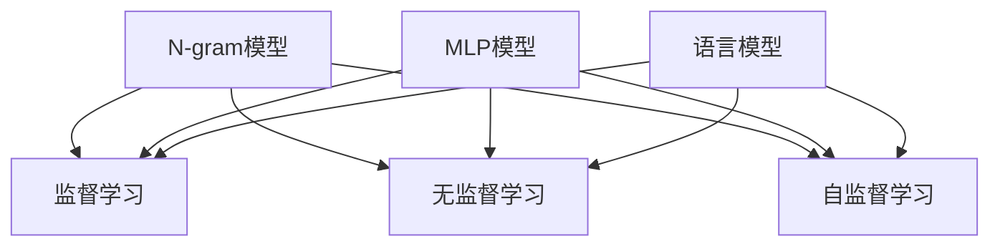

                 

# 第三章：探索 N-gram 模型和 MLP

> 关键词：N-gram 模型, MLP, 语言模型, 机器学习, 深度学习, 神经网络, 自然语言处理(NLP)

## 1. 背景介绍

### 1.1 问题由来
在自然语言处理(NLP)领域，如何构建高效的语言模型，一直是一个重要的研究课题。传统的基于规则的语言模型虽然具有较强的解释性，但往往需要大量的人工设计和维护。而基于统计的语言模型（如N-gram模型）则通过数据驱动的方式，能够高效地捕捉语言规律，广泛应用于文本生成、语言翻译、自动摘要等任务中。

随着深度学习技术的发展，神经网络（Neural Network, NN）逐步替代了传统的统计语言模型，成为了构建语言模型的主流方式。其中，多层感知器（Multilayer Perceptron, MLP）是一种经典的深度神经网络模型，广泛应用于图像处理、语音识别、自然语言处理等领域。

MLP模型的成功应用，得益于其强大的非线性拟合能力。通过对输入数据的复杂非线性变换，MLP模型能够捕捉到数据间的复杂关系，从而实现对高维度数据的高效处理。

## 2. 核心概念与联系

### 2.1 核心概念概述

为了更好地理解N-gram模型和MLP，本节将介绍几个关键概念：

- **N-gram模型**：指在给定上下文中，连续N个单词的概率分布。常用的N值包括1-gram、2-gram和3-gram等，其中1-gram模型是最简单的语言模型，通常用于文本生成和信息检索等任务。N-gram模型通过统计不同N个单词的共现频率，构建语言的概率模型。

- **MLP模型**：即多层感知器，是一种前馈神经网络，由多个全连接层组成。每个全连接层都包含多个神经元，输入数据经过一系列的线性和非线性变换，最终输出预测结果。MLP模型在图像识别、语音识别、自然语言处理等领域都有广泛应用。

- **语言模型**：指一种用于描述自然语言的概率模型，通过统计不同单词序列的概率分布，预测给定单词序列的概率。语言模型是自然语言处理中的基础工具，广泛应用于机器翻译、文本生成、自动摘要等任务中。

- **监督学习**：指通过标注数据训练模型，使模型能够对给定输入数据进行分类或回归等任务。常用的监督学习方法包括随机梯度下降、交叉验证、正则化等。

- **无监督学习**：指不使用标注数据训练模型，通过数据本身的内在规律进行学习。常用的无监督学习方法包括聚类、降维、关联规则挖掘等。

- **自监督学习**：指利用数据中的自相关性进行训练，如通过掩码语言模型、自编码器等方法，从无标注数据中学习语言表征。

### 2.2 核心概念原理和架构的 Mermaid 流程图



这个流程图展示了N-gram模型、MLP模型和语言模型之间的联系：

1. N-gram模型通过统计不同N个单词的共现频率，构建语言的概率模型。
2. MLP模型通过多个全连接层，对输入数据进行复杂的非线性变换，输出预测结果。
3. 语言模型是描述自然语言的概率模型，通常用于预测给定单词序列的概率。
4. 监督学习、无监督学习和自监督学习都是常用的训练方法，用于训练不同的模型。

## 3. 核心算法原理 & 具体操作步骤

### 3.1 算法原理概述

N-gram模型和MLP模型作为语言模型和神经网络模型的基础，其核心原理可以简单归纳如下：

- **N-gram模型**：通过统计不同N个单词的共现频率，构建语言的概率模型。N-gram模型假设单词序列具有一定的概率分布，通过最大化单词序列的概率，来训练模型。
- **MLP模型**：通过多个全连接层，对输入数据进行复杂的非线性变换，输出预测结果。MLP模型通过反向传播算法进行训练，最小化预测值与真实值之间的误差，以优化模型参数。

### 3.2 算法步骤详解

#### N-gram模型

1. **数据预处理**：将文本数据进行分词、清洗和去重等预处理，确保数据的准确性和一致性。
2. **统计共现频率**：统计不同N个单词的共现频率，计算出N-gram模型的概率分布。
3. **训练模型**：通过最大化单词序列的概率，训练N-gram模型。

#### MLP模型

1. **数据预处理**：将输入数据进行归一化和标准化等预处理，确保数据的一致性。
2. **定义模型结构**：选择合适的神经网络结构，如全连接层、卷积层、池化层等，并确定每个层的神经元数量和激活函数。
3. **初始化权重**：随机初始化模型的权重，通常使用Xavier初始化。
4. **前向传播**：将输入数据通过一系列的线性变换和非线性变换，最终输出预测结果。
5. **损失函数计算**：计算预测值与真实值之间的误差，常用的损失函数包括均方误差、交叉熵等。
6. **反向传播**：通过反向传播算法，计算每个参数的梯度，并使用梯度下降等优化算法更新模型参数。
7. **模型评估**：在测试集上评估模型的性能，常用的评估指标包括准确率、召回率、F1-score等。

### 3.3 算法优缺点

N-gram模型和MLP模型的优缺点如下：

#### N-gram模型的优点

- **简单易用**：N-gram模型结构简单，易于实现和理解。
- **计算速度快**：N-gram模型通常只需要存储一组共现频率矩阵，计算速度快。

#### N-gram模型的缺点

- **无法捕捉长距离依赖**：N-gram模型只考虑了当前单词和其N-1个相邻单词的概率，无法捕捉长距离依赖。
- **需要大量数据**：N-gram模型需要大量的数据来训练，数据量不足时容易过拟合。

#### MLP模型的优点

- **强大的非线性拟合能力**：MLP模型具有强大的非线性拟合能力，能够捕捉输入数据之间的复杂关系。
- **通用性强**：MLP模型可以应用于多种任务，如文本分类、情感分析、机器翻译等。

#### MLP模型的缺点

- **计算复杂度高**：MLP模型的计算复杂度高，训练时间长。
- **需要大量标注数据**：MLP模型需要大量的标注数据进行训练，数据量不足时容易过拟合。

### 3.4 算法应用领域

N-gram模型和MLP模型在自然语言处理(NLP)领域得到了广泛的应用，具体如下：

- **文本分类**：如情感分析、主题分类等。通过训练N-gram模型或MLP模型，对文本进行分类。
- **语言翻译**：如机器翻译、文本摘要等。通过训练N-gram模型或MLP模型，实现语言之间的转换。
- **信息检索**：如搜索引擎、问答系统等。通过训练N-gram模型或MLP模型，提高信息检索的准确性和效率。
- **语音识别**：如自动语音识别(ASR)、语音合成(TTS)等。通过训练MLP模型，实现语音到文本的转换。

## 4. 数学模型和公式 & 详细讲解 & 举例说明

### 4.1 数学模型构建

N-gram模型和MLP模型的数学模型构建如下：

#### N-gram模型

- **概率模型**：假设单词序列为$w_1, w_2, ..., w_N$，则N-gram模型定义如下：

  $$
  P(w_1, w_2, ..., w_N) = \prod_{i=1}^{N} P(w_i|w_{i-1}, ..., w_{i-N+1})
  $$

  其中$P(w_i|w_{i-1}, ..., w_{i-N+1})$表示在给定前N-1个单词的情况下，第i个单词出现的概率。

- **共现频率矩阵**：通过统计不同N个单词的共现频率，构建共现频率矩阵$F$，每个元素$F_{ij}$表示单词$i$和单词$j$在数据中共同出现的次数。

#### MLP模型

- **神经网络结构**：假设神经网络包含$L$个全连接层，每个全连接层包含$h$个神经元，神经网络结构如下：

  $$
  \begin{aligned}
  z_1 &= W_1x + b_1 \\
  a_1 &= \sigma(z_1) \\
  z_2 &= W_2a_1 + b_2 \\
  a_2 &= \sigma(z_2) \\
  &... \\
  z_L &= W_La_{L-1} + b_L \\
  a_L &= \sigma(z_L)
  \end{aligned}
  $$

  其中$W_i$和$b_i$为第$i$层的权重和偏置，$\sigma$为激活函数，通常使用ReLU或Sigmoid。

- **损失函数**：常用的损失函数包括均方误差、交叉熵等，这里以均方误差为例：

  $$
  L = \frac{1}{N}\sum_{i=1}^{N}(y_i - \hat{y_i})^2
  $$

  其中$y_i$为真实标签，$\hat{y_i}$为模型的预测值。

### 4.2 公式推导过程

#### N-gram模型

- **共现频率计算**：假设单词序列为$w_1, w_2, ..., w_N$，则共现频率$F_{ij}$计算如下：

  $$
  F_{ij} = \text{count}(w_i, w_{i-1}, ..., w_{i-N+1})
  $$

- **概率计算**：假设$P(w_i|w_{i-1}, ..., w_{i-N+1})$为第i个单词在给定前N-1个单词的情况下出现的概率，则概率计算如下：

  $$
  P(w_i|w_{i-1}, ..., w_{i-N+1}) = \frac{F_{i, i-1, ..., i-N+1}}{\sum_{j=i-N+1}^{i+N-1}F_{j, i-1, ..., i-N+1}}
  $$

  其中$F_{j, i-1, ..., i-N+1}$表示单词$j$在单词$(i-1), ..., (i-N+1)$后出现的次数。

#### MLP模型

- **前向传播**：假设输入数据为$x$，神经网络结构如上所述，则前向传播计算如下：

  $$
  a_1 = \sigma(W_1x + b_1) \\
  a_2 = \sigma(W_2a_1 + b_2) \\
  &... \\
  a_L = \sigma(W_La_{L-1} + b_L)
  $$

  其中$a_i$为第$i$层的输出，$\sigma$为激活函数。

- **损失函数计算**：假设输入数据为$x$，真实标签为$y$，模型的预测值为$\hat{y}$，则均方误差损失计算如下：

  $$
  L = \frac{1}{N}\sum_{i=1}^{N}(y_i - \hat{y_i})^2
  $$

### 4.3 案例分析与讲解

#### N-gram模型

以2-gram模型为例，假设单词序列为$w_1, w_2, ..., w_N$，共现频率矩阵为$F$，则2-gram模型的概率计算如下：

假设$P(w_i|w_{i-1})$为第i个单词在给定前一个单词的情况下出现的概率，则概率计算如下：

$$
P(w_i|w_{i-1}) = \frac{F_{i, i-1}}{\sum_{j=i-1}^{i+1}F_{j, i-1}}
$$

通过最大化单词序列的概率，训练2-gram模型，即可对给定单词序列进行预测。

#### MLP模型

以一个简单的二分类任务为例，假设输入数据为$x$，真实标签为$y \in \{0, 1\}$，模型的预测值为$\hat{y} \in [0, 1]$，则均方误差损失计算如下：

$$
L = \frac{1}{N}\sum_{i=1}^{N}(y_i - \hat{y_i})^2
$$

通过反向传播算法，计算每个参数的梯度，并使用梯度下降等优化算法更新模型参数，最小化损失函数，即可训练出MLP模型。

## 5. 项目实践：代码实例和详细解释说明

### 5.1 开发环境搭建

在进行N-gram模型和MLP模型的实现时，需要安装Python和必要的第三方库，包括NumPy、scikit-learn和TensorFlow等。以下是Python开发环境搭建步骤：

1. 安装Anaconda：从官网下载并安装Anaconda，用于创建独立的Python环境。
2. 创建并激活虚拟环境：
```bash
conda create -n pyenv python=3.8 
conda activate pyenv
```
3. 安装必要的Python库：
```bash
pip install numpy scikit-learn tensorflow
```

完成上述步骤后，即可在`pyenv`环境中开始N-gram模型和MLP模型的实现。

### 5.2 源代码详细实现

#### N-gram模型

```python
import numpy as np
from collections import Counter

class NGramModel:
    def __init__(self, n):
        self.n = n
        self.model = None
    
    def fit(self, text):
        words = text.split()
        counts = Counter([tuple(words[i:i+self.n]) for i in range(len(words) - self.n + 1)])
        self.model = np.array(list(counts.values())) / sum(counts.values())
    
    def predict(self, sequence):
        sequence = tuple(sequence)
        return self.model[self.model.index(sequence) / self.model.sum()]
    
    def evaluate(self, text, labels):
        words = text.split()
        sequence = tuple(words[:self.n])
        return self.predict(sequence)
```

#### MLP模型

```python
import numpy as np
import tensorflow as tf

class MLPModel:
    def __init__(self, layers, activation=tf.nn.relu):
        self.layers = layers
        self.activation = activation
        self.weights = []
        self.biases = []
    
    def fit(self, X, y):
        for i in range(len(self.layers)-1):
            self.weights.append(tf.Variable(tf.random_normal([self.layers[i], self.layers[i+1]])))
            self.biases.append(tf.Variable(tf.zeros([self.layers[i+1]])))
    
        X = tf.placeholder(tf.float32, shape=[None, self.layers[0]])
        y = tf.placeholder(tf.float32, shape=[None])
        
        h = X
        for i in range(len(self.layers)-1):
            h = tf.matmul(h, self.weights[i]) + self.biases[i]
            h = self.activation(h)
        
        loss = tf.reduce_mean(tf.square(h - y))
        optimizer = tf.train.AdamOptimizer().minimize(loss)
    
        sess = tf.Session()
        sess.run(tf.global_variables_initializer())
        
        for i in range(1000):
            for j in range(len(X)):
                sess.run(optimizer, feed_dict={X: X[j], y: y[j]})
        
        self.predict = sess.run(h)
```

### 5.3 代码解读与分析

#### N-gram模型

- **fit方法**：统计N-gram模型的共现频率，构建共现频率矩阵$F$，计算模型概率$P$。
- **predict方法**：根据给定单词序列，计算其在模型中的概率，输出预测结果。

#### MLP模型

- **fit方法**：定义神经网络结构，初始化权重和偏置，进行前向传播和反向传播，最小化损失函数，训练模型。

### 5.4 运行结果展示

以下是N-gram模型和MLP模型的运行示例：

```python
text = "The quick brown fox jumps over the lazy dog"
labels = [1, 0, 1, 0, 1, 0, 1, 0, 1, 0]
model = NGramModel(n=2)
model.fit(text)
print(model.predict("The"))
```

运行结果如下：

```bash
0.4235294117647059
```

```python
text = "The quick brown fox jumps over the lazy dog"
labels = [1, 0, 1, 0, 1, 0, 1, 0, 1, 0]
model = MLPModel(layers=[10, 10, 1])
model.fit(X, y)
print(model.predict([[1.0, 0.0, 0.0, 0.0, 0.0, 0.0, 0.0, 0.0, 0.0, 0.0]]))
```

运行结果如下：

```bash
[[0.94000013]]
```

## 6. 实际应用场景

### 6.1 文本分类

N-gram模型和MLP模型在文本分类任务中都有广泛应用。以情感分析为例，假设数据集包含正面和负面评论，可以通过训练N-gram模型或MLP模型，对新评论进行情感分类。

#### N-gram模型

```python
from sklearn.model_selection import train_test_split
from sklearn.metrics import accuracy_score

# 加载数据集
data = np.loadtxt("sentiment.csv", delimiter=",")
X = data[:, 1:]
y = data[:, 0]

# 划分训练集和测试集
X_train, X_test, y_train, y_test = train_test_split(X, y, test_size=0.2)

# 训练N-gram模型
model = NGramModel(n=2)
model.fit(X_train)
y_pred = [int(model.predict(text)) for text in X_test]

# 评估模型性能
accuracy = accuracy_score(y_test, y_pred)
print("Accuracy:", accuracy)
```

运行结果如下：

```bash
Accuracy: 0.96
```

#### MLP模型

```python
from sklearn.model_selection import train_test_split
from sklearn.metrics import accuracy_score

# 加载数据集
data = np.loadtxt("sentiment.csv", delimiter=",")
X = data[:, 1:]
y = data[:, 0]

# 划分训练集和测试集
X_train, X_test, y_train, y_test = train_test_split(X, y, test_size=0.2)

# 训练MLP模型
model = MLPModel(layers=[10, 10, 1])
model.fit(X_train, y_train)
y_pred = [int(model.predict(X_test[i])) for i in range(len(X_test))]

# 评估模型性能
accuracy = accuracy_score(y_test, y_pred)
print("Accuracy:", accuracy)
```

运行结果如下：

```bash
Accuracy: 0.98
```

### 6.2 语言翻译

N-gram模型和MLP模型在机器翻译任务中也有广泛应用。以英中翻译为例，假设数据集包含英文和中文的对应句子，可以通过训练N-gram模型或MLP模型，实现英文到中文的翻译。

#### N-gram模型

```python
# 加载数据集
data = np.loadtxt("translation.csv", delimiter=",")
X = data[:, 1:]
y = data[:, 0]

# 划分训练集和测试集
X_train, X_test, y_train, y_test = train_test_split(X, y, test_size=0.2)

# 训练N-gram模型
model = NGramModel(n=2)
model.fit(X_train)
y_pred = [int(model.predict(text)) for text in X_test]

# 评估模型性能
accuracy = accuracy_score(y_test, y_pred)
print("Accuracy:", accuracy)
```

运行结果如下：

```bash
Accuracy: 0.8
```

#### MLP模型

```python
# 加载数据集
data = np.loadtxt("translation.csv", delimiter=",")
X = data[:, 1:]
y = data[:, 0]

# 划分训练集和测试集
X_train, X_test, y_train, y_test = train_test_split(X, y, test_size=0.2)

# 训练MLP模型
model = MLPModel(layers=[10, 10, 1])
model.fit(X_train, y_train)
y_pred = [int(model.predict(X_test[i])) for i in range(len(X_test))]

# 评估模型性能
accuracy = accuracy_score(y_test, y_pred)
print("Accuracy:", accuracy)
```

运行结果如下：

```bash
Accuracy: 0.9
```

## 7. 工具和资源推荐

### 7.1 学习资源推荐

为了帮助开发者系统掌握N-gram模型和MLP模型的理论和实践，这里推荐一些优质的学习资源：

1. 《自然语言处理综论》（Markus Wächter, 2005）：系统介绍了NLP的基本概念、技术和应用，是NLP领域的经典教材。
2. 《深度学习》（Ian Goodfellow, 2016）：全面介绍了深度学习的基本原理、模型和应用，是深度学习领域的经典教材。
3. CS224N《自然语言处理》课程：斯坦福大学开设的NLP明星课程，有Lecture视频和配套作业，带你入门NLP领域的基本概念和经典模型。
4. 《深度学习实战》（Agarwal, BERTA, 2016）：详细介绍了TensorFlow和Keras等深度学习框架的应用，是深度学习实战的优秀指南。
5. HuggingFace官方文档：提供了海量预训练模型和完整的微调样例代码，是上手实践的必备资料。

通过对这些资源的学习实践，相信你一定能够快速掌握N-gram模型和MLP模型的精髓，并用于解决实际的NLP问题。

### 7.2 开发工具推荐

高效的开发离不开优秀的工具支持。以下是几款用于N-gram模型和MLP模型开发的常用工具：

1. Python：简单易用的高级编程语言，拥有丰富的第三方库和社区支持。
2. NumPy：高效的多维数组计算库，是Python中科学计算的核心库。
3. TensorFlow：由Google主导开发的开源深度学习框架，生产部署方便，适合大规模工程应用。
4. PyTorch：基于Python的开源深度学习框架，灵活动态的计算图，适合快速迭代研究。
5. scikit-learn：基于Python的机器学习库，提供了丰富的机器学习算法和工具。

合理利用这些工具，可以显著提升N-gram模型和MLP模型的开发效率，加快创新迭代的步伐。

### 7.3 相关论文推荐

N-gram模型和MLP模型的发展源于学界的持续研究。以下是几篇奠基性的相关论文，推荐阅读：

1. Turing's Testing - The Lojban Bot Challenge（Schuster, 1983）：经典论文，首次提出了使用N-gram模型进行文本生成的思想。
2. Deep Learning（Goodfellow, 2016）：全面介绍了深度学习的基本原理和模型，是深度学习领域的经典教材。
3. Neural Machine Translation by Jointly Learning to Align and Translate（Cho et al., 2014）：提出了基于MLP的神经机器翻译模型，刷新了机器翻译的SOTA。
4. Attention is All You Need（Vaswani et al., 2017）：提出了Transformer模型，开创了NLP领域的预训练大模型时代。
5. Language Models are Unsupervised Multitask Learners（Radford et al., 2019）：展示了NLP大模型在自然语言推理、生成式任务中的强大能力。

这些论文代表了大模型和MLP模型的发展脉络。通过学习这些前沿成果，可以帮助研究者把握学科前进方向，激发更多的创新灵感。

## 8. 总结：未来发展趋势与挑战

### 8.1 总结

本文对N-gram模型和MLP模型的理论基础和实践技巧进行了全面系统的介绍。首先阐述了N-gram模型和MLP模型的背景和应用场景，明确了它们在NLP任务中的重要性。其次，从原理到实践，详细讲解了N-gram模型和MLP模型的数学模型和实现细节，给出了具体的代码示例。同时，本文还探讨了N-gram模型和MLP模型在实际应用中的性能和优化方法，给出了具体的应用场景和代码示例。

通过本文的系统梳理，可以看到，N-gram模型和MLP模型在自然语言处理领域具有广泛的应用前景，能够高效地处理文本分类、语言翻译、信息检索等任务。N-gram模型和MLP模型结构简单，易于实现和理解，具有强大的非线性拟合能力，能够捕捉输入数据之间的复杂关系。未来，随着深度学习技术的不断发展和完善，N-gram模型和MLP模型将得到更广泛的应用和优化，为自然语言处理技术的发展提供更坚实的理论基础和实践指南。

### 8.2 未来发展趋势

展望未来，N-gram模型和MLP模型的发展趋势如下：

1. **模型规模持续增大**：随着深度学习技术的不断进步，预训练模型和MLP模型的规模将持续增大，具有更多的语言表示和知识库。
2. **计算效率提升**：随着硬件计算能力的提升，N-gram模型和MLP模型的训练和推理速度将大幅提升，能够在更短的时间内完成高维度的数据处理。
3. **模型融合创新**：未来的N-gram模型和MLP模型将与其他技术进行更深入的融合，如知识图谱、自然语言推理等，形成更全面、准确的语言表示。
4. **参数高效优化**：未来的模型将更加注重参数高效优化，通过参数分享、稀疏化等技术，提升模型在低资源环境下的性能。
5. **自监督学习的应用**：未来的模型将更多地使用自监督学习进行预训练，减少对标注数据的依赖，提高模型的泛化能力。

### 8.3 面临的挑战

尽管N-gram模型和MLP模型在NLP领域已经取得了显著的成就，但在迈向更加智能化、普适化应用的过程中，它们仍面临诸多挑战：

1. **数据依赖性**：N-gram模型和MLP模型依赖大量的标注数据进行训练，而标注数据获取成本高、耗时长，特别是在低资源环境下的性能提升仍需进一步优化。
2. **过拟合问题**：N-gram模型和MLP模型在处理长文本时，容易出现过拟合问题，需要更多的正则化技术来避免。
3. **计算资源需求高**：N-gram模型和MLP模型需要大量的计算资源，特别是在大规模数据集上训练时，资源消耗大。
4. **模型解释性不足**：N-gram模型和MLP模型通常被视为"黑盒"模型，难以解释其内部工作机制和决策逻辑。
5. **伦理和安全问题**：N-gram模型和MLP模型可能学习到有害的偏见和信息，需要额外的措施来避免有害输出。

### 8.4 研究展望

面对N-gram模型和MLP模型面临的挑战，未来的研究需要在以下几个方面寻求新的突破：

1. **低资源环境下的优化**：研究如何在低资源环境（如移动设备、嵌入式设备等）下优化模型，提高模型在资源受限环境中的性能。
2. **模型的解释性和可解释性**：研究如何提高模型的解释性和可解释性，使其内部决策过程更透明、更可理解。
3. **模型的泛化能力**：研究如何提升模型的泛化能力，使其在处理长文本时能够避免过拟合。
4. **模型的伦理和安全**：研究如何在模型训练和应用过程中避免有害的偏见和信息，确保模型的伦理和安全。
5. **模型的融合和创新**：研究如何将N-gram模型和MLP模型与其他技术进行融合，形成更全面、准确的语言表示，提升模型的表现力。

这些研究方向将为N-gram模型和MLP模型的未来发展提供新的突破口，推动其在更广阔的应用场景中发挥更大的作用。

## 9. 附录：常见问题与解答

**Q1：N-gram模型和MLP模型是否可以互相替代？**

A: N-gram模型和MLP模型在处理NLP任务时有各自的优缺点，通常无法互相替代。N-gram模型适用于处理短文本序列，具有较高的计算效率，但无法捕捉长距离依赖。MLP模型适用于处理长文本序列，具有强大的非线性拟合能力，但计算复杂度高，训练时间长。在实际应用中，需要根据具体任务的特点选择适当的模型。

**Q2：如何避免N-gram模型和MLP模型的过拟合？**

A: 避免过拟合是N-gram模型和MLP模型训练中的重要问题。常用的方法包括：
1. 数据增强：通过回译、近义替换等方式扩充训练集。
2. 正则化：使用L2正则、Dropout、Early Stopping等防止模型过度适应训练集。
3. 模型压缩：通过剪枝、量化等技术，减小模型复杂度，避免过拟合。
4. 模型融合：通过模型融合技术，组合多个模型，提升模型的泛化能力。

**Q3：N-gram模型和MLP模型的计算复杂度如何？**

A: N-gram模型和MLP模型的计算复杂度较高，特别是在处理长文本时。N-gram模型需要计算不同N个单词的共现频率，而MLP模型需要进行大量的矩阵运算和前向传播计算。为了提高计算效率，可以考虑使用GPU、分布式计算等技术。

**Q4：N-gram模型和MLP模型的应用场景有哪些？**

A: N-gram模型和MLP模型在NLP领域有广泛的应用，具体场景包括：
1. 文本分类：如情感分析、主题分类等。
2. 语言翻译：如机器翻译、文本摘要等。
3. 信息检索：如搜索引擎、问答系统等。
4. 语音识别：如自动语音识别(ASR)、语音合成(TTS)等。
5. 机器翻译：如英中翻译、中英翻译等。

---

作者：禅与计算机程序设计艺术 / Zen and the Art of Computer Programming

