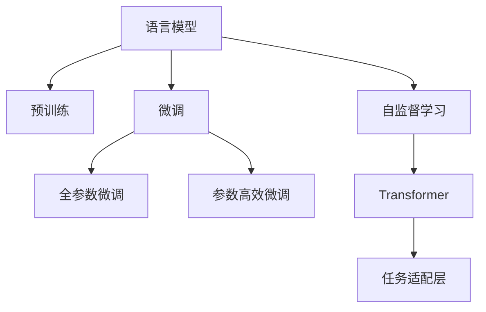

                 

# 第二章：选择合适的语言模型

> 关键词：语言模型,Transformer,预训练,微调,自然语言处理(NLP)

## 1. 背景介绍

### 1.1 问题由来
在自然语言处理(Natural Language Processing, NLP)领域，选择合适的语言模型是构建高质量NLP系统的首要任务。语言模型在NLP中扮演了基础的角色，用于建模文本数据的概率分布，提供基于概率的预测。一个好的语言模型不仅能更好地捕捉语言的统计规律，还能提高后续下游任务的表现。

随着深度学习技术的发展，基于Transformer架构的预训练大语言模型（如BERT、GPT、XLNet等）在多项NLP任务上取得了显著的进步。这些模型通常先在大规模无标签数据上进行预训练，然后在特定任务上通过微调(Fine-tuning)进行优化，从而提升模型的性能。但面对海量的预训练模型和微调方法，如何选择适合特定任务的语言模型变得尤为重要。

### 1.2 问题核心关键点
选择语言模型的过程涉及多个核心关键点：

- **预训练模型选择**：根据任务特点和数据规模选择合适的预训练语言模型。
- **微调策略**：在预训练模型的基础上进行微调时，如何调整学习率、正则化等超参数，以及是否需要保留预训练层等。
- **模型参数**：在模型规模、层数和参数量之间进行权衡，选择适合任务的模型架构。
- **性能评估**：通过验证集和测试集评估模型性能，选择最优模型。

这些关键点在实际应用中需要综合考虑，以实现任务目标的最佳性能和资源效率。

## 2. 核心概念与联系

### 2.1 核心概念概述

为更好地理解选择语言模型的过程，本节将介绍几个核心概念：

- **语言模型**：用于建模文本序列的概率分布，常用于自然语言处理任务，如文本生成、翻译、分类等。
- **预训练模型**：在大规模无标签数据上训练的语言模型，具有丰富的语言知识和语义理解能力。
- **微调**：在预训练模型的基础上，使用下游任务的少量标注数据进行优化，提升模型在特定任务上的性能。
- **Transformer**：一种常用的神经网络架构，用于构建预训练大语言模型。
- **参数高效微调**：在微调过程中，只更新少部分模型参数，避免不必要的计算资源浪费。
- **自监督学习**：利用无标签数据进行预训练，提高模型的泛化能力和鲁棒性。
- **任务适配层**：针对特定任务设计的输出层和损失函数，用于微调模型。

这些核心概念通过Mermaid流程图展示其逻辑关系：



这个流程图展示了预训练语言模型如何通过微调获得针对特定任务的性能提升，以及Transformer和任务适配层在其中的作用。

## 3. 核心算法原理 & 具体操作步骤

### 3.1 算法原理概述

选择语言模型时，关键在于平衡模型性能和计算资源。主要考虑以下几个方面：

- **模型规模**：模型参数量越大，通常性能越好，但计算资源需求也越大。
- **预训练数据**：更多数据通常能训练出更强大的模型，但数据获取成本高，且数据质量会影响模型的泛化能力。
- **微调策略**：适当的微调策略能显著提升模型在特定任务上的性能，但策略不当可能导致过拟合。
- **自监督学习**：在无标签数据上进行预训练，可以提高模型的泛化能力和鲁棒性，但需要更多计算资源。

### 3.2 算法步骤详解

以下是选择语言模型的一般步骤：

**Step 1: 选择预训练模型**

根据任务类型和数据规模，选择合适的预训练模型。常见的大语言模型包括BERT、GPT、XLNet等。

- **BERT**：适合文本分类、问答、情感分析等任务，以其双向语言模型著称。
- **GPT**：适合文本生成、对话系统等任务，以其自回归结构著称。
- **XLNet**：结合了自回归和自编码的特点，适合复杂序列建模任务。

**Step 2: 调整微调策略**

在预训练模型的基础上进行微调，选择适合任务的学习率、正则化等超参数，并决定是否需要保留预训练层。

- **学习率**：通常比从头训练时要小，以保证微调过程中的稳定性和避免过拟合。
- **正则化**：使用L2正则、Dropout等技术，防止模型在微调过程中过拟合训练集。
- **预训练层保留**：通常只微调顶层，保留预训练层，以充分利用预训练知识。

**Step 3: 性能评估**

通过验证集和测试集评估模型性能，选择最优模型。

- **验证集**：用于调整模型超参数，评估模型在新数据上的泛化能力。
- **测试集**：用于最终评估模型性能，选择最佳模型。

### 3.3 算法优缺点

选择语言模型时，需要考虑以下优缺点：

**优点**：

- **泛化能力强**：预训练模型通过大规模无标签数据学习到丰富的语言知识，有助于提升模型在特定任务上的性能。
- **计算效率高**：使用微调策略，只需少量标注数据，即可快速提升模型性能。
- **灵活性高**：微调策略可以根据具体任务进行调整，灵活性高。

**缺点**：

- **依赖标注数据**：微调过程需要大量的标注数据，标注成本高。
- **过拟合风险**：微调过程中可能出现过拟合，模型在验证集和测试集上的性能不稳定。
- **模型复杂度**：大型预训练模型参数量大，计算资源需求高。

## 4. 数学模型和公式 & 详细讲解 & 举例说明

### 4.1 数学模型构建

选择合适的语言模型时，需要考虑模型的数学模型构建。以BERT为例，其数学模型构建如下：

- **输入表示**：将输入文本转换为token embedding，每个token都有一个对应的embedding。
- **Transformer层**：使用自注意力机制对token embedding进行编码，得到上下文表示。
- **池化层**：将上下文表示进行平均池化，得到固定长度的向量表示。
- **分类层**：将池化后的向量表示输入到分类器，输出预测结果。

### 4.2 公式推导过程

以BERT为例，推导其分类任务的损失函数：

假设输入为$x$，其对应的BERT表示为$h(x)$，分类器的输出为$y$，则分类任务的损失函数为：

$$
\mathcal{L}(x, y) = -\log \sigma(y h(x))
$$

其中$\sigma$为sigmoid函数，$h(x)$为BERT模型输出的上下文表示。

### 4.3 案例分析与讲解

以情感分析任务为例，说明如何选择适合的BERT模型：

假设数据集为IMDB电影评论数据集，包含25,000条电影评论及其情感标签（正面或负面）。预训练模型为BERT-base。

1. **选择合适的预训练模型**：选择BERT-base模型，因为它在情感分析任务上表现优异，参数规模适中。
2. **调整微调策略**：设置学习率为2e-5，使用Adam优化器，微调时只保留最后几层，避免过拟合。
3. **性能评估**：在验证集上设置Early Stopping策略，选择最优超参数，然后在测试集上评估模型性能。

## 5. 项目实践：代码实例和详细解释说明

### 5.1 开发环境搭建

在开始微调之前，需要搭建开发环境。以下是使用Python和PyTorch搭建环境的步骤：

1. 安装Anaconda：
```bash
conda create -n pytorch-env python=3.8 
conda activate pytorch-env
```

2. 安装PyTorch和Transformer库：
```bash
conda install pytorch torchvision torchaudio transformers
```

3. 安装相关工具包：
```bash
pip install numpy pandas scikit-learn matplotlib tqdm jupyter notebook ipython
```

### 5.2 源代码详细实现

以下是在情感分析任务上使用BERT模型进行微调的代码实现：

```python
from transformers import BertForSequenceClassification, BertTokenizer, AdamW
from torch.utils.data import DataLoader
from sklearn.metrics import classification_report

# 初始化模型和分词器
model = BertForSequenceClassification.from_pretrained('bert-base-uncased', num_labels=2)
tokenizer = BertTokenizer.from_pretrained('bert-base-uncased')

# 加载数据集
train_data = ...
val_data = ...
test_data = ...

# 定义训练函数
def train(model, train_loader, optimizer, device, num_epochs):
    model.train()
    for epoch in range(num_epochs):
        for batch in train_loader:
            input_ids, attention_mask, labels = batch
            input_ids, attention_mask, labels = input_ids.to(device), attention_mask.to(device), labels.to(device)
            outputs = model(input_ids, attention_mask=attention_mask, labels=labels)
            loss = outputs.loss
            optimizer.zero_grad()
            loss.backward()
            optimizer.step()

# 定义评估函数
def evaluate(model, val_loader, device):
    model.eval()
    preds, labels = [], []
    with torch.no_grad():
        for batch in val_loader:
            input_ids, attention_mask, labels = batch
            input_ids, attention_mask, labels = input_ids.to(device), attention_mask.to(device), labels.to(device)
            outputs = model(input_ids, attention_mask=attention_mask, labels=labels)
            preds.append(outputs.logits.argmax(dim=1).cpu().numpy())
            labels.append(labels.cpu().numpy())
    return classification_report(labels, preds)

# 设置超参数
num_epochs = 5
learning_rate = 2e-5
batch_size = 16

# 加载数据集
train_loader = DataLoader(train_data, batch_size=batch_size, shuffle=True)
val_loader = DataLoader(val_data, batch_size=batch_size, shuffle=False)
test_loader = DataLoader(test_data, batch_size=batch_size, shuffle=False)

# 初始化优化器
optimizer = AdamW(model.parameters(), lr=learning_rate)

# 开始训练
device = 'cuda' if torch.cuda.is_available() else 'cpu'
model.to(device)
train(model, train_loader, optimizer, device, num_epochs)

# 评估模型
preds = evaluate(model, val_loader, device)
print(preds)
```

### 5.3 代码解读与分析

以上代码实现中，我们首先初始化了BERT模型和分词器。接着，加载数据集，定义了训练和评估函数，设置超参数，加载数据集，并初始化优化器。最后，在GPU上训练模型，并在验证集上评估模型性能。

在实际应用中，可以通过调整超参数、数据增强、正则化等技术，进一步提升模型性能。例如，在训练函数中引入数据增强，增加输入文本的多样性：

```python
from transformers import AutoTokenizer

# 数据增强
def data_augmentation(text):
    # 随机删除、插入、替换等操作
    # ...

# 在训练函数中使用数据增强
for batch in train_loader:
    input_ids, attention_mask, labels = batch
    input_ids, attention_mask, labels = input_ids.to(device), attention_mask.to(device), labels.to(device)
    inputs = tokenizer(input_ids, attention_mask=attention_mask, padding=True, truncation=True, return_tensors='pt')
    inputs = data_augmentation(inputs['input_ids'])
    inputs['attention_mask'] = inputs['attention_mask'].to(device)
    outputs = model(**inputs, labels=labels)
    loss = outputs.loss
    optimizer.zero_grad()
    loss.backward()
    optimizer.step()
```

## 6. 实际应用场景

### 6.1 智能客服系统

智能客服系统是选择语言模型的一个重要应用场景。智能客服系统可以处理大量的客户咨询，提升客户满意度，降低企业运营成本。

在智能客服系统中，可以使用预训练的对话模型，如GPT系列模型，进行微调，以适应具体企业的业务需求。微调后的模型能够理解客户的意图，并提供个性化的回复。

### 6.2 金融舆情监测

金融舆情监测是另一个重要的应用场景。金融行业需要实时监测市场舆情，以便及时应对突发事件。

可以使用预训练的语言模型，如BERT，进行微调，以识别市场舆情中的情感倾向和主题信息。微调后的模型能够自动分析新闻、评论等文本数据，提供实时的舆情报告，帮助金融分析师做出决策。

### 6.3 个性化推荐系统

个性化推荐系统是语言模型的另一个重要应用。推荐系统能够根据用户的兴趣和行为，推荐个性化的商品、内容等。

可以使用预训练的语言模型，如BERT，进行微调，以理解用户的兴趣点。微调后的模型能够根据用户的历史行为数据，预测用户可能感兴趣的内容，并提供个性化的推荐。

### 6.4 未来应用展望

未来，语言模型将在更多的应用场景中发挥作用。以下是几个可能的发展方向：

1. **多模态学习**：语言模型可以与其他模态的数据（如图像、语音等）进行联合学习，提高模型的泛化能力和鲁棒性。
2. **联邦学习**：在分布式环境中，多个设备可以联合训练模型，共享模型参数，提升模型的性能。
3. **跨语言学习**：语言模型可以学习多语言的语言表示，提高模型的跨语言理解能力。
4. **知识图谱**：语言模型可以与知识图谱结合，增强模型的常识推理能力。

## 7. 工具和资源推荐

### 7.1 学习资源推荐

选择语言模型时，需要了解相关的学习资源，以深入理解模型的原理和应用方法。以下是一些推荐的资源：

1. 《深度学习入门》：适合初学者，介绍了深度学习的基本概念和应用。
2. 《自然语言处理入门》：介绍了自然语言处理的基本概念和常用模型。
3. 《Transformers: From Theory to Practice》：介绍Transformer架构的原理和应用。
4. 《自然语言处理与Transformers》：介绍Transformers库的使用方法。
5. HuggingFace官方文档：提供了大量预训练模型的样例代码和文档。

### 7.2 开发工具推荐

选择语言模型时，需要使用一些常用的开发工具，以提高开发效率。以下是一些推荐的工具：

1. PyTorch：深度学习框架，支持GPU加速，适合构建复杂的神经网络模型。
2. TensorFlow：深度学习框架，支持分布式计算，适合大规模工程应用。
3. Transformers库：提供了丰富的预训练语言模型和微调接口，适合快速开发NLP应用。
4. Weights & Biases：模型训练的实验跟踪工具，可以记录和可视化模型训练过程中的各项指标。
5. TensorBoard：可视化工具，可以实时监测模型训练状态，并提供丰富的图表呈现方式。

### 7.3 相关论文推荐

选择语言模型时，需要阅读相关的论文，以了解最新的研究成果。以下是一些推荐的论文：

1. Attention is All You Need：介绍Transformer架构的基本原理。
2. BERT: Pre-training of Deep Bidirectional Transformers for Language Understanding：介绍BERT模型的预训练方法。
3. GPT-2：介绍GPT系列模型的预训练和微调方法。
4. Parameter-Efficient Transfer Learning for NLP：介绍参数高效微调方法。
5. Prefix-Tuning: Optimizing Continuous Prompts for Generation：介绍Prefix-Tuning方法。

## 8. 总结：未来发展趋势与挑战

### 8.1 研究成果总结

语言模型选择是一个复杂的过程，涉及模型的选择、微调策略、性能评估等多个方面。通过合理选择语言模型，可以在保证模型性能的同时，最大限度地利用计算资源，提高模型的泛化能力和鲁棒性。

### 8.2 未来发展趋势

未来，语言模型选择将呈现以下几个发展趋势：

1. **更强大的模型**：随着计算资源的增加，预训练模型的参数量将不断增大，模型的性能也将进一步提升。
2. **多样化的微调方法**：未来的微调方法将更加多样，包括参数高效微调、自监督学习等，提升模型的泛化能力和鲁棒性。
3. **更广泛的应用场景**：语言模型将应用到更多的领域，如医疗、教育、金融等，为各个领域带来新的变革。

### 8.3 面临的挑战

尽管语言模型选择已经取得了一定的进展，但仍面临一些挑战：

1. **数据依赖**：微调需要大量的标注数据，获取高质量的数据成本高。
2. **过拟合风险**：微调过程中可能出现过拟合，模型在新数据上的性能不稳定。
3. **计算资源**：大型预训练模型的计算资源需求高，硬件成本较高。

### 8.4 研究展望

未来的研究需要在以下几个方面进行探索：

1. **自监督学习**：利用无标签数据进行预训练，提高模型的泛化能力和鲁棒性。
2. **参数高效微调**：开发更加高效的微调方法，减小计算资源消耗。
3. **多模态学习**：将语言模型与其他模态的数据进行联合学习，提升模型的综合能力。
4. **跨语言学习**：学习多语言的语言表示，提高模型的跨语言理解能力。

## 9. 附录：常见问题与解答

**Q1：如何选择预训练语言模型？**

A: 选择预训练语言模型时，需要考虑以下几个因素：

- **任务类型**：选择与任务类型匹配的语言模型，如BERT适合文本分类，GPT适合文本生成。
- **数据规模**：根据数据规模选择适当的模型，数据规模越大，选择更大规模的模型。
- **计算资源**：根据计算资源选择适当的模型，计算资源有限时，选择参数量较小的模型。

**Q2：微调过程中如何设置学习率？**

A: 设置学习率时，通常使用较小的学习率，避免破坏预训练权重。一般从1e-5开始调参，逐步减小学习率，直至收敛。也可以使用warmup策略，在开始阶段使用较小的学习率，再逐渐过渡到预设值。

**Q3：如何选择任务适配层？**

A: 选择任务适配层时，需要考虑任务的复杂度、模型的规模和数据量。对于分类任务，通常使用线性分类器；对于生成任务，通常使用解码器。任务适配层的选择取决于具体任务和数据特点。

**Q4：微调过程中如何避免过拟合？**

A: 避免过拟合的方法包括：

- **数据增强**：通过回译、近义替换等方式扩充训练集。
- **正则化**：使用L2正则、Dropout等技术。
- **早停策略**：在验证集上评估模型性能，根据性能指标决定是否停止训练。
- **参数高效微调**：只调整少部分模型参数，避免不必要的计算资源浪费。

这些方法需要根据具体任务和数据特点进行灵活组合。只有在数据、模型、训练、推理等各环节进行全面优化，才能最大限度地发挥大语言模型的潜力。

---

作者：禅与计算机程序设计艺术 / Zen and the Art of Computer Programming

