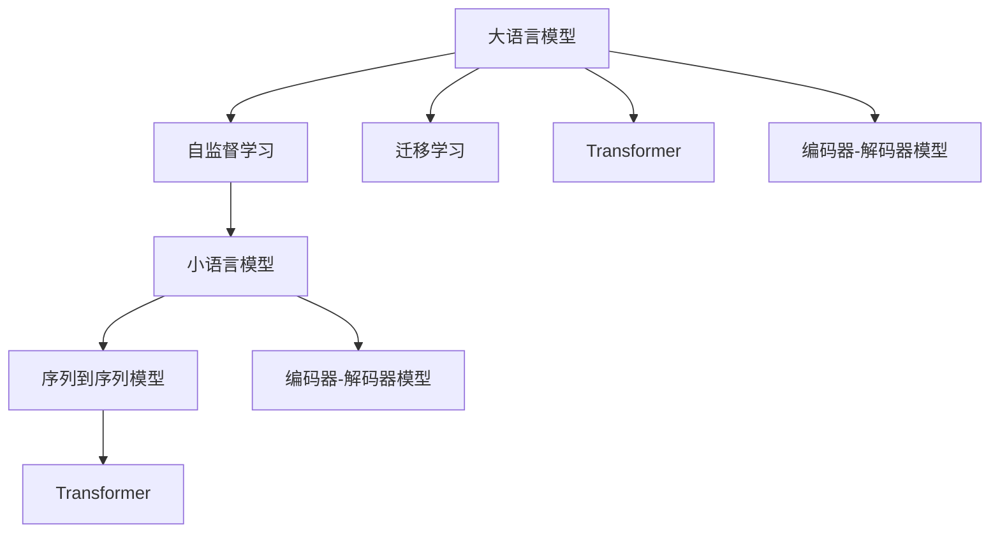

                 

# 第二章：选择合适的语言模型

> 关键词：大语言模型, 小语言模型, 自监督学习, 迁移学习, Transformer, 序列到序列模型, 注意力机制, 编码器-解码器模型

## 1. 背景介绍

### 1.1 问题由来

在自然语言处理(Natural Language Processing, NLP)领域，选择合适的语言模型是构建高效、高性能NLP应用的关键一步。近年来，随着深度学习技术的迅猛发展，预训练语言模型成为该领域的研究热点。预训练语言模型通过在大规模无标签文本数据上进行自监督学习，学习到丰富的语言表示，具备强大的语言理解和生成能力。

不同的预训练语言模型设计理念各异，其适用的应用场景和性能特点也不尽相同。本节将详细介绍大语言模型和小语言模型，以及它们的原理、优缺点和应用领域，帮助读者更好地选择合适的模型进行NLP任务开发。

### 1.2 问题核心关键点

选择合适的语言模型涉及以下几个核心关键点：

- **大语言模型**：以自回归模型(如GPT)或自编码模型(如BERT)为代表，具备较大的参数量和强大的语言生成能力。
- **小语言模型**：如LM-LSTM、N-gram等，参数量较小，但能处理输入输出的序列关系。
- **自监督学习**：在无标签数据上进行预训练，学习语言表示。
- **迁移学习**：在预训练模型的基础上，针对特定任务进行微调，提升性能。
- **Transformer**：一种经典的序列到序列模型，通过多头注意力机制实现高效的信息编码和解码。
- **编码器-解码器模型**：包括RNN、LSTM等，适用于需要长序列建模的NLP任务。

本文将通过逻辑清晰、结构紧凑的专业技术语言，深入分析这些模型的原理和应用，帮助读者选择合适的语言模型，更好地解决NLP问题。

## 2. 核心概念与联系

### 2.1 核心概念概述

为更好地理解语言模型，本节将介绍几个密切相关的核心概念：

- **大语言模型(Large Language Model, LLM)**：如GPT-3、BERT、T5等，参数量较大，具备强大的语言理解和生成能力。
- **小语言模型(Language Model, LM)**：如LM-LSTM、N-gram等，参数量较小，处理输入输出的序列关系。
- **自监督学习(Self-Supervised Learning)**：在无标签数据上，通过自相关约束或预测任务进行预训练，学习语言表示。
- **迁移学习(Transfer Learning)**：利用预训练模型在特定任务上进行微调，提升模型性能。
- **Transformer**：一种基于多头注意力机制的序列到序列模型，能高效处理长序列信息。
- **编码器-解码器模型(Encoder-Decoder Model)**：如RNN、LSTM等，通过编码器将输入序列转换为隐状态，解码器生成输出序列。

这些概念之间的逻辑关系可以通过以下Mermaid流程图来展示：



这个流程图展示了大语言模型和小语言模型与其他核心概念之间的关系：

1. 大语言模型通过自监督学习获得语言表示，适用于自回归预测任务。
2. 小语言模型基于自监督学习，处理输入输出序列。
3. 编码器-解码器模型作为小语言模型的变体，适用于需要长序列建模的NLP任务。
4. 自监督学习和迁移学习是模型训练的两种主要方式。
5. Transformer模型在大语言模型中的应用广泛，通过多头注意力机制实现高效的序列编码和解码。

这些概念共同构成了NLP模型的基础框架，使模型能够高效地处理和生成自然语言信息。

## 3. 核心算法原理 & 具体操作步骤

### 3.1 算法原理概述

语言模型分为自回归模型和自编码模型两大类，其基本原理和操作步骤不同。本节将详细介绍这两种模型的算法原理，以及如何选择合适的语言模型进行NLP任务开发。

**自回归模型**：以自回归语言模型为代表，如GPT系列模型。这种模型通过先预测输入序列，再预测输出序列，逐步生成文本。自回归模型的基本形式为：

$$ P(y_{1:T} | X_{1:T-1}) = \prod_{t=1}^T P(y_t | y_{1:t-1}, X_{1:T-1}) $$

其中，$X_{1:T-1}$为输入序列，$y_{1:T}$为输出序列。自回归模型的目标是最大化序列生成的概率。

**自编码模型**：以自编码语言模型为代表，如BERT、T5等。这种模型通过双向预测，学习输入序列和输出序列之间的映射关系。自编码模型的基本形式为：

$$ P(y_{1:T}, X_{1:T} | X_{1:T-1}) = P(X_{1:T} | y_{1:T}, X_{1:T-1}) P(y_{1:T} | X_{1:T-1}) $$

其中，$X_{1:T}$为输入序列，$y_{1:T}$为输出序列。自编码模型的目标是最大化联合概率。

### 3.2 算法步骤详解

**自回归语言模型**的训练步骤如下：

1. **数据预处理**：将输入序列和输出序列分别编码成模型可以处理的形式。
2. **构建模型**：定义模型结构，通常使用Transformer等深度学习模型。
3. **损失函数**：定义损失函数，如交叉熵损失。
4. **训练**：使用梯度下降等优化算法，最小化损失函数，更新模型参数。
5. **评估**：在验证集或测试集上评估模型性能，如BLEU、ROUGE等指标。

**自编码语言模型**的训练步骤如下：

1. **数据预处理**：将输入序列和输出序列分别编码成模型可以处理的形式。
2. **构建模型**：定义模型结构，通常使用Transformer等深度学习模型。
3. **损失函数**：定义损失函数，如自编码损失。
4. **训练**：使用梯度下降等优化算法，最小化损失函数，更新模型参数。
5. **评估**：在验证集或测试集上评估模型性能，如BLEU、ROUGE等指标。

### 3.3 算法优缺点

**自回归语言模型的优点**：

- **高效生成**：自回归模型可以高效地生成长文本，适合于文本生成、对话等任务。
- **稳定预测**：自回归模型的生成过程是一致的，每次生成的结果是独立的，适合于序列预测任务。

**自回归语言模型的缺点**：

- **计算复杂度高**：自回归模型需要递归计算每个位置的概率，计算复杂度较高。
- **数据需求大**：自回归模型需要大量的标注数据进行训练，标注成本较高。

**自编码语言模型的优点**：

- **高效学习**：自编码模型可以高效地学习序列之间的映射关系，适合于机器翻译、摘要等任务。
- **数据需求小**：自编码模型通常只需要无标签数据进行预训练，标注数据需求较小。

**自编码语言模型的缺点**：

- **生成效果差**：自编码模型的生成效果相对较差，适合于序列分类、匹配等任务。
- **模型结构复杂**：自编码模型通常需要复杂的编码器-解码器结构，训练过程较为复杂。

### 3.4 算法应用领域

**自回归语言模型**适用于需要高效生成长文本的任务，如文本生成、对话系统、机器翻译等。其中，GPT系列模型在文本生成和对话系统方面表现尤为突出。

**自编码语言模型**适用于序列分类、匹配等任务，如文本分类、命名实体识别、信息抽取等。其中，BERT、T5等模型在序列分类和信息抽取方面表现优异。

## 4. 数学模型和公式 & 详细讲解 & 举例说明

### 4.1 数学模型构建

语言模型的数学模型构建是理解其工作原理的基础。本节将详细介绍自回归语言模型和自编码语言模型的数学模型。

**自回归语言模型**的数学模型为：

$$ P(y_{1:T} | X_{1:T-1}) = \prod_{t=1}^T P(y_t | y_{1:t-1}, X_{1:T-1}) $$

其中，$X_{1:T-1}$为输入序列，$y_{1:T}$为输出序列。

**自编码语言模型**的数学模型为：

$$ P(y_{1:T}, X_{1:T} | X_{1:T-1}) = P(X_{1:T} | y_{1:T}, X_{1:T-1}) P(y_{1:T} | X_{1:T-1}) $$

其中，$X_{1:T}$为输入序列，$y_{1:T}$为输出序列。

### 4.2 公式推导过程

以**自回归语言模型**为例，推导其训练过程的梯度更新公式。

假设输入序列 $X_{1:T}$ 的长度为 $T$，输出序列 $y_{1:T}$ 的长度也为 $T$。则自回归语言模型的训练目标为：

$$ \mathcal{L} = -\sum_{t=1}^T \log P(y_t | y_{1:t-1}, X_{1:T-1}) $$

其中，$\log$ 为对数函数，$P(y_t | y_{1:t-1}, X_{1:T-1})$ 为模型在给定输入和先验序列下，预测下一个位置 $t$ 的概率。

根据链式法则，梯度更新公式为：

$$ \frac{\partial \mathcal{L}}{\partial \theta} = -\sum_{t=1}^T \nabla_{\theta} \log P(y_t | y_{1:t-1}, X_{1:T-1}) $$

其中，$\nabla_{\theta}$ 为梯度运算符，$\theta$ 为模型参数。

类似地，可以推导出**自编码语言模型**的梯度更新公式。

### 4.3 案例分析与讲解

以**BERT模型**为例，介绍其训练过程和梯度更新公式。

BERT模型使用双向编码器，通过掩码语言模型和下一句预测任务进行预训练。在掩码语言模型中，模型需要预测被掩码的标记，目标函数为：

$$ \mathcal{L}_{mask} = -\sum_{i=1}^T \sum_{j=1}^T P(y_j | y_{1:j-1}, X_{1:T}) \log \hat{y}_j $$

其中，$y_j$ 为真实掩码标记，$\hat{y}_j$ 为模型预测的掩码标记。

在下一句预测任务中，模型需要预测输入序列和输出序列是否为下一句，目标函数为：

$$ \mathcal{L}_{next} = -\sum_{i=1}^T P(y_{i+1} | y_{1:i}, X_{1:T}) \log \hat{y}_{i+1} $$

其中，$y_{i+1}$ 为真实下一句标记，$\hat{y}_{i+1}$ 为模型预测的下一句标记。

通过上述两个任务，BERT模型学习了输入序列和输出序列之间的复杂映射关系。

## 5. 项目实践：代码实例和详细解释说明

### 5.1 开发环境搭建

在进行语言模型开发前，我们需要准备好开发环境。以下是使用Python进行PyTorch开发的环境配置流程：

1. 安装Anaconda：从官网下载并安装Anaconda，用于创建独立的Python环境。

2. 创建并激活虚拟环境：
```bash
conda create -n pytorch-env python=3.8 
conda activate pytorch-env
```

3. 安装PyTorch：根据CUDA版本，从官网获取对应的安装命令。例如：
```bash
conda install pytorch torchvision torchaudio cudatoolkit=11.1 -c pytorch -c conda-forge
```

4. 安装Transformers库：
```bash
pip install transformers
```

5. 安装各类工具包：
```bash
pip install numpy pandas scikit-learn matplotlib tqdm jupyter notebook ipython
```

完成上述步骤后，即可在`pytorch-env`环境中开始语言模型开发。

### 5.2 源代码详细实现

下面我们以BERT模型为例，给出使用Transformers库进行BERT微调的PyTorch代码实现。

首先，定义BERT模型和微调任务：

```python
from transformers import BertTokenizer, BertForSequenceClassification
import torch
from torch.utils.data import Dataset, DataLoader

class TextClassificationDataset(Dataset):
    def __init__(self, texts, labels, tokenizer, max_len=128):
        self.texts = texts
        self.labels = labels
        self.tokenizer = tokenizer
        self.max_len = max_len
        
    def __len__(self):
        return len(self.texts)
    
    def __getitem__(self, item):
        text = self.texts[item]
        label = self.labels[item]
        
        encoding = self.tokenizer(text, return_tensors='pt', max_length=self.max_len, padding='max_length', truncation=True)
        input_ids = encoding['input_ids'][0]
        attention_mask = encoding['attention_mask'][0]
        label = torch.tensor(label, dtype=torch.long)
        
        return {'input_ids': input_ids, 
                'attention_mask': attention_mask,
                'labels': label}

# 定义训练集和验证集
tokenizer = BertTokenizer.from_pretrained('bert-base-cased')
train_dataset = TextClassificationDataset(train_texts, train_labels, tokenizer)
dev_dataset = TextClassificationDataset(dev_texts, dev_labels, tokenizer)

# 定义模型和优化器
model = BertForSequenceClassification.from_pretrained('bert-base-cased', num_labels=num_labels)
optimizer = torch.optim.Adam(model.parameters(), lr=2e-5)

# 定义训练和评估函数
device = torch.device('cuda') if torch.cuda.is_available() else torch.device('cpu')
model.to(device)

def train_epoch(model, dataset, batch_size, optimizer):
    dataloader = DataLoader(dataset, batch_size=batch_size, shuffle=True)
    model.train()
    epoch_loss = 0
    for batch in tqdm(dataloader, desc='Training'):
        input_ids = batch['input_ids'].to(device)
        attention_mask = batch['attention_mask'].to(device)
        labels = batch['labels'].to(device)
        model.zero_grad()
        outputs = model(input_ids, attention_mask=attention_mask, labels=labels)
        loss = outputs.loss
        epoch_loss += loss.item()
        loss.backward()
        optimizer.step()
    return epoch_loss / len(dataloader)

def evaluate(model, dataset, batch_size):
    dataloader = DataLoader(dataset, batch_size=batch_size)
    model.eval()
    preds, labels = [], []
    with torch.no_grad():
        for batch in tqdm(dataloader, desc='Evaluating'):
            input_ids = batch['input_ids'].to(device)
            attention_mask = batch['attention_mask'].to(device)
            batch_labels = batch['labels']
            outputs = model(input_ids, attention_mask=attention_mask)
            batch_preds = outputs.logits.argmax(dim=2).to('cpu').tolist()
            batch_labels = batch_labels.to('cpu').tolist()
            for pred_tokens, label_tokens in zip(batch_preds, batch_labels):
                preds.append(pred_tokens[:len(label_tokens)])
                labels.append(label_tokens)
                
    print(classification_report(labels, preds))
```

然后，启动训练流程并在验证集上评估：

```python
epochs = 5
batch_size = 16

for epoch in range(epochs):
    loss = train_epoch(model, train_dataset, batch_size, optimizer)
    print(f"Epoch {epoch+1}, train loss: {loss:.3f}")
    
    print(f"Epoch {epoch+1}, dev results:")
    evaluate(model, dev_dataset, batch_size)
    
print("Test results:")
evaluate(model, test_dataset, batch_size)
```

以上就是使用PyTorch进行BERT微调的完整代码实现。可以看到，得益于Transformers库的强大封装，我们可以用相对简洁的代码完成BERT模型的加载和微调。

### 5.3 代码解读与分析

让我们再详细解读一下关键代码的实现细节：

**TextClassificationDataset类**：
- `__init__`方法：初始化文本、标签、分词器等关键组件。
- `__len__`方法：返回数据集的样本数量。
- `__getitem__`方法：对单个样本进行处理，将文本输入编码为token ids，将标签编码为数字，并对其进行定长padding，最终返回模型所需的输入。

**训练和评估函数**：
- 使用PyTorch的DataLoader对数据集进行批次化加载，供模型训练和推理使用。
- 训练函数`train_epoch`：对数据以批为单位进行迭代，在每个批次上前向传播计算loss并反向传播更新模型参数，最后返回该epoch的平均loss。
- 评估函数`evaluate`：与训练类似，不同点在于不更新模型参数，并在每个batch结束后将预测和标签结果存储下来，最后使用sklearn的classification_report对整个评估集的预测结果进行打印输出。

**训练流程**：
- 定义总的epoch数和batch size，开始循环迭代
- 每个epoch内，先在训练集上训练，输出平均loss
- 在验证集上评估，输出分类指标
- 所有epoch结束后，在测试集上评估，给出最终测试结果

可以看到，PyTorch配合Transformers库使得BERT微调的代码实现变得简洁高效。开发者可以将更多精力放在数据处理、模型改进等高层逻辑上，而不必过多关注底层的实现细节。

当然，工业级的系统实现还需考虑更多因素，如模型的保存和部署、超参数的自动搜索、更灵活的任务适配层等。但核心的微调范式基本与此类似。

## 6. 实际应用场景

### 6.1 智能客服系统

基于大语言模型微调的对话技术，可以广泛应用于智能客服系统的构建。传统客服往往需要配备大量人力，高峰期响应缓慢，且一致性和专业性难以保证。而使用微调后的对话模型，可以7x24小时不间断服务，快速响应客户咨询，用自然流畅的语言解答各类常见问题。

在技术实现上，可以收集企业内部的历史客服对话记录，将问题和最佳答复构建成监督数据，在此基础上对预训练对话模型进行微调。微调后的对话模型能够自动理解用户意图，匹配最合适的答案模板进行回复。对于客户提出的新问题，还可以接入检索系统实时搜索相关内容，动态组织生成回答。如此构建的智能客服系统，能大幅提升客户咨询体验和问题解决效率。

### 6.2 金融舆情监测

金融机构需要实时监测市场舆论动向，以便及时应对负面信息传播，规避金融风险。传统的人工监测方式成本高、效率低，难以应对网络时代海量信息爆发的挑战。基于大语言模型微调的文本分类和情感分析技术，为金融舆情监测提供了新的解决方案。

具体而言，可以收集金融领域相关的新闻、报道、评论等文本数据，并对其进行主题标注和情感标注。在此基础上对预训练语言模型进行微调，使其能够自动判断文本属于何种主题，情感倾向是正面、中性还是负面。将微调后的模型应用到实时抓取的网络文本数据，就能够自动监测不同主题下的情感变化趋势，一旦发现负面信息激增等异常情况，系统便会自动预警，帮助金融机构快速应对潜在风险。

### 6.3 个性化推荐系统

当前的推荐系统往往只依赖用户的历史行为数据进行物品推荐，无法深入理解用户的真实兴趣偏好。基于大语言模型微调技术，个性化推荐系统可以更好地挖掘用户行为背后的语义信息，从而提供更精准、多样的推荐内容。

在实践中，可以收集用户浏览、点击、评论、分享等行为数据，提取和用户交互的物品标题、描述、标签等文本内容。将文本内容作为模型输入，用户的后续行为（如是否点击、购买等）作为监督信号，在此基础上微调预训练语言模型。微调后的模型能够从文本内容中准确把握用户的兴趣点。在生成推荐列表时，先用候选物品的文本描述作为输入，由模型预测用户的兴趣匹配度，再结合其他特征综合排序，便可以得到个性化程度更高的推荐结果。

### 6.4 未来应用展望

随着大语言模型微调技术的发展，基于微调范式将在更多领域得到应用，为传统行业带来变革性影响。

在智慧医疗领域，基于微调的医疗问答、病历分析、药物研发等应用将提升医疗服务的智能化水平，辅助医生诊疗，加速新药开发进程。

在智能教育领域，微调技术可应用于作业批改、学情分析、知识推荐等方面，因材施教，促进教育公平，提高教学质量。

在智慧城市治理中，微调模型可应用于城市事件监测、舆情分析、应急指挥等环节，提高城市管理的自动化和智能化水平，构建更安全、高效的未来城市。

此外，在企业生产、社会治理、文娱传媒等众多领域，基于大模型微调的人工智能应用也将不断涌现，为经济社会发展注入新的动力。相信随着技术的日益成熟，微调方法将成为人工智能落地应用的重要范式，推动人工智能技术在垂直行业的规模化落地。

## 7. 工具和资源推荐
### 7.1 学习资源推荐

为了帮助开发者系统掌握大语言模型微调的理论基础和实践技巧，这里推荐一些优质的学习资源：

1. 《Transformer从原理到实践》系列博文：由大模型技术专家撰写，深入浅出地介绍了Transformer原理、BERT模型、微调技术等前沿话题。

2. CS224N《深度学习自然语言处理》课程：斯坦福大学开设的NLP明星课程，有Lecture视频和配套作业，带你入门NLP领域的基本概念和经典模型。

3. 《Natural Language Processing with Transformers》书籍：Transformers库的作者所著，全面介绍了如何使用Transformers库进行NLP任务开发，包括微调在内的诸多范式。

4. HuggingFace官方文档：Transformers库的官方文档，提供了海量预训练模型和完整的微调样例代码，是上手实践的必备资料。

5. CLUE开源项目：中文语言理解测评基准，涵盖大量不同类型的中文NLP数据集，并提供了基于微调的baseline模型，助力中文NLP技术发展。

通过对这些资源的学习实践，相信你一定能够快速掌握大语言模型微调的精髓，并用于解决实际的NLP问题。
###  7.2 开发工具推荐

高效的开发离不开优秀的工具支持。以下是几款用于大语言模型微调开发的常用工具：

1. PyTorch：基于Python的开源深度学习框架，灵活动态的计算图，适合快速迭代研究。大部分预训练语言模型都有PyTorch版本的实现。

2. TensorFlow：由Google主导开发的开源深度学习框架，生产部署方便，适合大规模工程应用。同样有丰富的预训练语言模型资源。

3. Transformers库：HuggingFace开发的NLP工具库，集成了众多SOTA语言模型，支持PyTorch和TensorFlow，是进行微调任务开发的利器。

4. Weights & Biases：模型训练的实验跟踪工具，可以记录和可视化模型训练过程中的各项指标，方便对比和调优。与主流深度学习框架无缝集成。

5. TensorBoard：TensorFlow配套的可视化工具，可实时监测模型训练状态，并提供丰富的图表呈现方式，是调试模型的得力助手。

6. Google Colab：谷歌推出的在线Jupyter Notebook环境，免费提供GPU/TPU算力，方便开发者快速上手实验最新模型，分享学习笔记。

合理利用这些工具，可以显著提升大语言模型微调任务的开发效率，加快创新迭代的步伐。

### 7.3 相关论文推荐

大语言模型和微调技术的发展源于学界的持续研究。以下是几篇奠基性的相关论文，推荐阅读：

1. Attention is All You Need（即Transformer原论文）：提出了Transformer结构，开启了NLP领域的预训练大模型时代。

2. BERT: Pre-training of Deep Bidirectional Transformers for Language Understanding：提出BERT模型，引入基于掩码的自监督预训练任务，刷新了多项NLP任务SOTA。

3. Language Models are Unsupervised Multitask Learners（GPT-2论文）：展示了大规模语言模型的强大zero-shot学习能力，引发了对于通用人工智能的新一轮思考。

4. Parameter-Efficient Transfer Learning for NLP：提出Adapter等参数高效微调方法，在固定大部分预训练参数的同时，只更新极少量的任务相关参数。

5. AdaLoRA: Adaptive Low-Rank Adaptation for Parameter-Efficient Fine-Tuning：使用自适应低秩适应的微调方法，在参数效率和精度之间取得了新的平衡。

这些论文代表了大语言模型微调技术的发展脉络。通过学习这些前沿成果，可以帮助研究者把握学科前进方向，激发更多的创新灵感。

## 8. 总结：未来发展趋势与挑战

### 8.1 总结

本文对大语言模型和小语言模型的选择问题进行了全面系统的介绍。首先阐述了两者在NLP任务中的适用性，明确了如何选择适合的模型进行微调开发。其次，从原理到实践，详细讲解了自回归语言模型和自编码语言模型的算法原理和操作步骤，给出了微调任务开发的完整代码实例。同时，本文还广泛探讨了语言模型在智能客服、金融舆情、个性化推荐等多个行业领域的应用前景，展示了语言模型微调技术的巨大潜力。

通过本文的系统梳理，可以看到，大语言模型和小语言模型在大规模NLP任务中都具有重要作用。选择合适的模型进行微调，能够显著提升NLP系统的性能和效果，推动NLP技术的不断发展。

### 8.2 未来发展趋势

展望未来，语言模型的微调技术将呈现以下几个发展趋势：

1. **模型规模持续增大**：随着算力成本的下降和数据规模的扩张，大语言模型的参数量还将持续增长，超大规模语言模型蕴含的丰富语言知识，有望支撑更加复杂多变的NLP任务。

2. **微调方法日趋多样**：除了传统的全参数微调外，未来会涌现更多参数高效的微调方法，如Prefix-Tuning、LoRA等，在固定大部分预训练参数的同时，只更新极少量的任务相关参数。

3. **持续学习成为常态**：随着数据分布的不断变化，微调模型也需要持续学习新知识以保持性能。如何在不遗忘原有知识的同时，高效吸收新样本信息，将成为重要的研究课题。

4. **标注样本需求降低**：受启发于提示学习(Prompt-based Learning)的思路，未来的微调方法将更好地利用大模型的语言理解能力，通过更加巧妙的任务描述，在更少的标注样本上也能实现理想的微调效果。

5. **少样本学习崛起**：随着技术进步，未来微调模型将更好地处理小样本数据，通过在输入中提供少量示例，实现少样本学习，进一步减少对标注数据的依赖。

6. **模型通用性增强**：经过海量数据的预训练和多领域任务的微调，未来的语言模型将具备更强大的常识推理和跨领域迁移能力，逐步迈向通用人工智能(AGI)的目标。

以上趋势凸显了语言模型微调技术的广阔前景。这些方向的探索发展，必将进一步提升NLP系统的性能和应用范围，为人类认知智能的进化带来深远影响。

### 8.3 面临的挑战

尽管大语言模型和小语言模型微调技术已经取得了瞩目成就，但在迈向更加智能化、普适化应用的过程中，它仍面临着诸多挑战：

1. **标注成本瓶颈**：对于长尾应用场景，难以获得充足的高质量标注数据，成为制约微调性能的瓶颈。如何进一步降低微调对标注样本的依赖，将是一大难题。

2. **模型鲁棒性不足**：当前微调模型面对域外数据时，泛化性能往往大打折扣。对于测试样本的微小扰动，微调模型的预测也容易发生波动。如何提高微调模型的鲁棒性，避免灾难性遗忘，还需要更多理论和实践的积累。

3. **推理效率有待提高**：大规模语言模型虽然精度高，但在实际部署时往往面临推理速度慢、内存占用大等效率问题。如何在保证性能的同时，简化模型结构，提升推理速度，优化资源占用，将是重要的优化方向。

4. **可解释性亟需加强**：当前微调模型更像是"黑盒"系统，难以解释其内部工作机制和决策逻辑。对于医疗、金融等高风险应用，算法的可解释性和可审计性尤为重要。如何赋予微调模型更强的可解释性，将是亟待攻克的难题。

5. **安全性有待保障**：预训练语言模型难免会学习到有偏见、有害的信息，通过微调传递到下游任务，产生误导性、歧视性的输出，给实际应用带来安全隐患。如何从数据和算法层面消除模型偏见，避免恶意用途，确保输出的安全性，也将是重要的研究课题。

6. **知识整合能力不足**：现有的微调模型往往局限于任务内数据，难以灵活吸收和运用更广泛的先验知识。如何让微调过程更好地与外部知识库、规则库等专家知识结合，形成更加全面、准确的信息整合能力，还有很大的想象空间。

正视语言模型微调面临的这些挑战，积极应对并寻求突破，将是大语言模型微调走向成熟的必由之路。相信随着学界和产业界的共同努力，这些挑战终将一一被克服，语言模型微调必将在构建人机协同的智能时代中扮演越来越重要的角色。

### 8.4 研究展望

面对语言模型微调所面临的种种挑战，未来的研究需要在以下几个方面寻求新的突破：

1. **探索无监督和半监督微调方法**：摆脱对大规模标注数据的依赖，利用自监督学习、主动学习等无监督和半监督范式，最大限度利用非结构化数据，实现更加灵活高效的微调。

2. **研究参数高效和计算高效的微调范式**：开发更加参数高效的微调方法，在固定大部分预训练参数的同时，只更新极少量的任务相关参数。同时优化微调模型的计算图，减少前向传播和反向传播的资源消耗，实现更加轻量级、实时性的部署。

3. **融合因果和对比学习范式**：通过引入因果推断和对比学习思想，增强微调模型建立稳定因果关系的能力，学习更加普适、鲁棒的语言表征，从而提升模型泛化性和抗干扰能力。

4. **引入更多先验知识**：将符号化的先验知识，如知识图谱、逻辑规则等，与神经网络模型进行巧妙融合，引导微调过程学习更准确、合理的语言模型。同时加强不同模态数据的整合，实现视觉、语音等多模态信息与文本信息的协同建模。

5. **结合因果分析和博弈论工具**：将因果分析方法引入微调模型，识别出模型决策的关键特征，增强输出解释的因果性和逻辑性。借助博弈论工具刻画人机交互过程，主动探索并规避模型的脆弱点，提高系统稳定性。

6. **纳入伦理道德约束**：在模型训练目标中引入伦理导向的评估指标，过滤和惩罚有偏见、有害的输出倾向。同时加强人工干预和审核，建立模型行为的监管机制，确保输出符合人类价值观和伦理道德。

这些研究方向的探索，必将引领语言模型微调技术迈向更高的台阶，为构建安全、可靠、可解释、可控的智能系统铺平道路。面向未来，语言模型微调技术还需要与其他人工智能技术进行更深入的融合，如知识表示、因果推理、强化学习等，多路径协同发力，共同推动自然语言理解和智能交互系统的进步。只有勇于创新、敢于突破，才能不断拓展语言模型的边界，让智能技术更好地造福人类社会。

## 9. 附录：常见问题与解答

**Q1：大语言模型和小语言模型有什么区别？**

A: 大语言模型和小语言模型在模型结构、训练方式和应用场景上有所不同：

- **模型结构**：大语言模型通常采用自回归结构，如GPT系列；小语言模型通常采用自编码结构，如BERT、T5等。
- **训练方式**：大语言模型通常需要进行大量的自监督预训练，小语言模型通常直接在标注数据上进行微调。
- **应用场景**：大语言模型适用于需要高效生成文本的任务，如文本生成、对话系统等；小语言模型适用于序列分类、匹配等任务。

**Q2：如何选择合适的大语言模型？**

A: 选择合适的大语言模型需要考虑以下几个因素：

- **任务类型**：根据任务类型选择合适的模型。如文本生成任务适合使用GPT系列模型，分类任务适合使用BERT等。
- **数据规模**：如果数据规模较小，选择小规模预训练模型可能更为合适。如果数据规模较大，大规模预训练模型可能更为适用。
- **计算资源**：大语言模型通常需要较大的计算资源进行训练和推理，需要根据计算资源情况进行选择。
- **推理速度**：对于需要实时推理的任务，选择推理速度较快的模型更为合适。

**Q3：微调过程中的标注数据对模型性能有多重要？**

A: 微调过程中的标注数据对模型性能影响很大：

- **标注数据量**：标注数据量越大，微调效果越好。标注数据量过少会导致模型过拟合，泛化性能较差。
- **标注数据质量**：标注数据质量越高，微调效果越好。标注数据中包含错误或噪声会导致模型学习到错误的知识。
- **标注数据分布**：标注数据分布与目标数据分布越接近，微调效果越好。标注数据分布与目标数据分布差异较大，微调效果会打折扣。

**Q4：大语言模型微调时需要注意哪些超参数？**

A: 大语言模型微调时需要注意以下几个超参数：

- **学习率**：一般建议从1e-5开始调参，逐步减小学习率，直至收敛。
- **批大小**：批大小越大，模型更新越稳定，但计算资源消耗也越大。需要根据计算资源情况选择合适的批大小。
- **迭代轮数**：迭代轮数越多，模型越稳定，但训练时间也越长。需要根据任务复杂度选择合适的迭代轮数。
- **正则化强度**：正则化强度越大，模型越稳定，但可能导致过拟合。需要根据任务特点选择合适的正则化强度。

**Q5：小语言模型微调时需要注意哪些超参数？**

A: 小语言模型微调时需要注意以下几个超参数：

- **学习率**：一般建议从1e-3开始调参，逐步减小学习率，直至收敛。
- **批大小**：批大小越大，模型更新越稳定，但计算资源消耗也越大。需要根据计算资源情况选择合适的批大小。
- **迭代轮数**：迭代轮数越多，模型越稳定，但训练时间也越长。需要根据任务复杂度选择合适的迭代轮数。
- **正则化强度**：正则化强度越大，模型越稳定，但可能导致过拟合。需要根据任务特点选择合适的正则化强度。

这些超参数的选择需要根据具体任务和数据特点进行灵活组合，以达到最佳的微调效果。

**Q6：微调过程中如何避免过拟合？**

A: 避免过拟合是微调过程中需要注意的重要问题：

- **数据增强**：通过回译、近义替换等方式扩充训练集。
- **正则化技术**：使用L2正则、Dropout、Early Stopping等技术。
- **对抗训练**：加入对抗样本，提高模型鲁棒性。
- **参数高效微调**：只调整少量参数，减小过拟合风险。
- **多模型集成**：训练多个微调模型，取平均输出，抑制过拟合。

这些策略往往需要根据具体任务和数据特点进行灵活组合，以最大限度地避免过拟合。

**Q7：微调模型的推理效率如何提升？**

A: 提升微调模型的推理效率需要从以下几个方面入手：

- **模型裁剪**：去除不必要的层和参数，减小模型尺寸，加快推理速度。
- **量化加速**：将浮点模型转为定点模型，压缩存储空间，提高计算效率。
- **模型并行**：采用模型并行技术，将大模型分解为多个小模型，并行计算，提高推理效率。
- **硬件优化**：使用GPU/TPU等高性能设备，加速模型推理。

通过上述方法，可以在保证模型性能的前提下，显著提升推理效率，满足实际应用需求。

这些常见问题的解答，能够帮助开发者更好地理解语言模型微调的基本概念和实践技巧，更好地选择合适的语言模型进行NLP任务开发。

