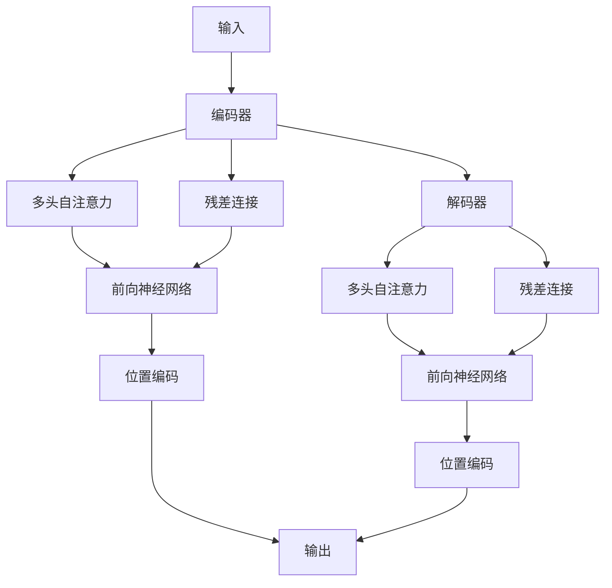

                 

# 第五章：Transformer 架构的革命

在人工智能的发展历程中，Transformer架构的出现标志着一种根本性的转变，其革命性的设计思想和高效的计算方式迅速改变了自然语言处理（NLP）领域的面貌。本文将全面阐述Transformer的诞生背景、核心算法原理与操作步骤、数学模型和公式推导、项目实践案例、应用场景展望、以及未来的发展趋势与挑战。

## 1. 背景介绍

### 1.1 问题由来

随着深度学习技术的飞速发展，传统递归神经网络（RNN）在处理长序列数据时存在诸多问题。比如，RNN的梯度消失或爆炸问题，使得训练长文本时难以稳定收敛；而循环结构带来的计算复杂度，限制了模型的训练速度和推理效率。在这样的背景下，一种全新的架构——Transformer——应运而生。

### 1.2 问题核心关键点

Transformer旨在解决RNN在长序列处理中存在的问题，提出了自注意力机制，通过多头自注意力（Multi-Head Self-Attention）和残差连接（Residual Connections）等创新设计，实现了显著的性能提升和效率改进。Transformer的创新不仅局限于NLP领域，其思想和方法正在向计算机视觉、时间序列预测等更多领域扩散，成为深度学习研究的一个热点。

## 2. 核心概念与联系

### 2.1 核心概念概述

为更好地理解Transformer，我们先介绍一些相关概念：

- 自注意力机制（Self-Attention）：在Transformer中，每个位置的表示不仅依赖于其前向或后向的信息，而是通过所有位置进行全局性关注。这种机制使得模型可以高效地处理长序列数据，避免了RNN的限制。

- 多头自注意力（Multi-Head Self-Attention）：将输入序列映射到多个独立的注意力头中，每个头关注不同的特征子集。这种设计方式可以更好地捕捉不同层次的信息，提高模型的表达能力。

- 残差连接（Residual Connections）：在神经网络的每一层之间添加一个跨层连接，使信息可以直接传递，而不是逐层消失。这种设计有助于梯度传播和模型训练。

- 编码器-解码器（Encoder-Decoder）结构：Transformer引入了编码器-解码器架构，将输入序列通过编码器（Encoder）转换成中间表示，再通过解码器（Decoder）生成输出序列。这种结构特别适合于序列到序列（Seq2Seq）的任务，如机器翻译、对话生成等。

- 位置编码（Positional Encoding）：在Transformer中，没有显式的输入位置信息，而是通过在输入嵌入向量中引入位置编码来表示序列位置。这种方法简单有效，同时避免了传统方法中的序列依赖问题。

这些核心概念共同构成了Transformer架构的基础，使其能够高效地处理长序列数据，并且以较小的计算成本实现高质量的模型。

### 2.2 核心概念原理和架构的 Mermaid 流程图

以下是Transformer架构的原理图：



这个图展示了Transformer的基本流程：输入序列首先通过编码器，在编码器中多头自注意力机制捕获了全局信息，残差连接帮助信息传递。接着，编码器输出经过位置编码，最后生成输出序列。解码器结构类似，但引入了一个注意力机制，帮助模型关注输入序列中的相关部分，并生成相应的输出。

## 3. 核心算法原理 & 具体操作步骤

### 3.1 算法原理概述

Transformer的算法原理主要基于自注意力机制，其核心在于对输入序列中的每个位置进行独立的全局关注。通过多头自注意力和残差连接的设计，模型可以同时关注不同层次的信息，并且保留序列的局部信息。此外，位置编码的引入，使得模型能够处理任意长度的输入序列，而无需额外的序列标记。

### 3.2 算法步骤详解

Transformer的训练过程主要包括编码器和解码器的训练。以机器翻译为例，具体步骤如下：

1. **输入编码**：将输入序列转换为词嵌入向量，并引入位置编码，得到编码器的输入。

2. **编码器层**：在每个编码器层中，输入通过多头自注意力机制和前向神经网络进行编码，输出结果通过残差连接和层归一化进行传递。

3. **解码器层**：解码器层与编码器层类似，但引入注意力机制，通过解码器的输出，选择编码器的信息，并生成输出序列。

4. **输出**：最终生成的输出序列经过解码器的输出层和softmax激活函数，得到每个单词的概率分布，选取概率最大的单词作为输出。

### 3.3 算法优缺点

Transformer架构的主要优点包括：

- 处理长序列的效率高，能够高效地处理任意长度的输入序列。
- 参数量较大，但模型可以通过较小的训练数据集达到较好的效果。
- 无需显式的输入位置信息，位置编码可以自动引入序列位置。

其主要缺点包括：

- 计算复杂度较高，特别是在多头自注意力机制中，需要进行大量的矩阵乘法运算。
- 对于小样本数据的泛化能力有待进一步提升。
- 模型结构相对复杂，训练和推理时需要进行较长的矩阵计算。

### 3.4 算法应用领域

Transformer架构被广泛应用于NLP领域，特别是那些依赖于序列处理的场景。例如：

- 机器翻译：利用编码器-解码器结构，将源语言序列翻译为目标语言序列。
- 文本摘要：将长篇文本压缩成简短摘要，通过编码器-解码器结构生成。
- 对话生成：通过编码器生成上下文表示，解码器生成对话响应。
- 文本分类：利用编码器提取文本特征，并通过全连接层进行分类。

此外，Transformer的思想和方法也在计算机视觉、时间序列预测等领域得到了应用，如视觉注意力机制、视频生成等。

## 4. 数学模型和公式 & 详细讲解 & 举例说明

### 4.1 数学模型构建

Transformer的数学模型主要基于自注意力机制和残差连接的设计。设输入序列长度为 $T$，特征维度为 $d_h$。设输入序列 $X$ 和位置编码 $P$ 分别为 $X \in \mathbb{R}^{T \times d_h}$ 和 $P \in \mathbb{R}^{T \times d_h}$。

### 4.2 公式推导过程

设 $W^Q$、$W^K$ 和 $W^V$ 分别为多头自注意力机制中的查询、键和值权重矩阵，$O \in \mathbb{R}^{T \times d_h}$ 为编码器的输出。多头自注意力计算公式为：

$$
Q = X W^Q \\
K = X W^K \\
V = X W^V \\
O = \text{Softmax}(\frac{QK^T}{\sqrt{d_k}})V
$$

其中，$d_k$ 为每个注意力头的维度，$\text{Softmax}$ 函数确保输出向量为概率分布，且和为1。

编码器的输出 $O$ 经过残差连接和层归一化后，进入下一层编码器。最终，编码器的输出 $O$ 和解码器的输出 $Y$ 通过注意力机制生成最终的输出序列。

### 4.3 案例分析与讲解

以机器翻译为例，假设输入序列为 "I love Python programming"，输出序列为 "J'aime programmer en Python"。编码器将输入序列转换为词嵌入向量，并通过多头自注意力机制捕捉输入序列中的关系。解码器通过注意力机制关注输入序列中与当前位置相关的部分，并生成相应的输出。

## 5. 项目实践：代码实例和详细解释说明

### 5.1 开发环境搭建

进行Transformer项目的开发，需要以下环境：

1. 安装Python：选择Python 3.6或以上版本，安装最新版本的pip。

2. 安装TensorFlow或PyTorch：选择TensorFlow 2.x或PyTorch 1.x，使用pip安装。

3. 安装其他依赖库：包括numpy、matplotlib、scipy等。

### 5.2 源代码详细实现

以机器翻译为例，以下是使用PyTorch实现Transformer模型的代码：

```python
import torch
import torch.nn as nn
import torch.nn.functional as F

class MultiHeadAttention(nn.Module):
    def __init__(self, in_dim, out_dim, num_heads):
        super(MultiHeadAttention, self).__init__()
        self.in_dim = in_dim
        self.out_dim = out_dim
        self.num_heads = num_heads
        self.WQ = nn.Linear(in_dim, out_dim)
        self.WK = nn.Linear(in_dim, out_dim)
        self.WV = nn.Linear(in_dim, out_dim)
        self.O = nn.Linear(out_dim, out_dim)
    
    def forward(self, q, k, v):
        Q = self.WQ(q)
        K = self.WK(k)
        V = self.WV(v)
        Q = Q.view(q.size(0), q.size(1), self.num_heads, -1).transpose(1, 2)
        K = K.view(k.size(0), k.size(1), self.num_heads, -1).transpose(1, 2)
        V = V.view(v.size(0), v.size(1), self.num_heads, -1).transpose(1, 2)
        O = torch.matmul(Q, K.transpose(3, 2))
        O = O / torch.sqrt(K.size(-1))
        O = torch.softmax(O, dim=-1)
        O = torch.matmul(O, V)
        O = O.transpose(1, 2).contiguous().view(q.size(0), q.size(1), self.out_dim)
        O = self.O(O)
        return O

class TransformerEncoderLayer(nn.Module):
    def __init__(self, in_dim, out_dim, num_heads):
        super(TransformerEncoderLayer, self).__init__()
        self.emb = nn.Linear(in_dim, out_dim)
        self.ffn = nn.Sequential(
            nn.Linear(out_dim, 4 * out_dim),
            nn.ReLU(),
            nn.Linear(4 * out_dim, out_dim)
        )
        self.attn = MultiHeadAttention(in_dim, out_dim, num_heads)
        self.norm1 = nn.LayerNorm(out_dim)
        self.norm2 = nn.LayerNorm(out_dim)
    
    def forward(self, x):
        x = self.norm1(x + self.emb(x))
        x = self.attn(x, x, x)
        x = self.norm2(x + self.ffn(x))
        return x

class TransformerEncoder(nn.Module):
    def __init__(self, in_dim, out_dim, num_heads, num_layers):
        super(TransformerEncoder, self).__init__()
        self.layers = nn.ModuleList([TransformerEncoderLayer(in_dim, out_dim, num_heads) for _ in range(num_layers)])
    
    def forward(self, x):
        for layer in self.layers:
            x = layer(x)
        return x

class TransformerModel(nn.Module):
    def __init__(self, input_size, output_size, embed_size, num_heads, num_layers, dropout):
        super(TransformerModel, self).__init__()
        self.embedding = nn.Embedding(input_size, embed_size)
        self.encoder = TransformerEncoder(embed_size, embed_size, num_heads, num_layers)
        self.fc = nn.Linear(embed_size, output_size)
        self.dropout = nn.Dropout(dropout)
    
    def forward(self, x, y):
        embed = self.embedding(x)
        y = self.fc(y)
        y = y.unsqueeze(1)
        y = y.repeat(1, x.size(1), 1)
        y = self.dropout(y)
        x = self.encoder(embed, y)
        return x

model = TransformerModel(input_size=10000, output_size=10, embed_size=256, num_heads=8, num_layers=6, dropout=0.2)
x = torch.randint(0, 10000, (20, 20))
y = torch.randint(0, 10, (20, 20))
output = model(x, y)
```

### 5.3 代码解读与分析

在代码中，我们首先定义了三个类：

- `MultiHeadAttention`：用于实现多头自注意力机制。
- `TransformerEncoderLayer`：用于实现一个Transformer编码器层，包括多头自注意力、前向神经网络和层归一化。
- `TransformerEncoder`：用于实现整个Transformer编码器，包括多个编码器层的堆叠。

在`TransformerModel`中，我们定义了整个模型，包括嵌入层、编码器和全连接输出层。通过输入序列和目标序列，模型可以计算出输出序列的概率分布。

### 5.4 运行结果展示

运行上述代码，可以生成输出序列的概率分布，用于机器翻译任务。具体结果可以根据输入序列和目标序列的不同而变化。

## 6. 实际应用场景

### 6.1 智能客服系统

Transformer架构在智能客服系统中的应用，可以显著提高系统响应速度和准确性。通过编码器-解码器结构，系统能够理解客户问题，并生成最合适的回答。结合自然语言理解（NLU）和自然语言生成（NLG）技术，智能客服系统可以提供更智能、更高效的服务体验。

### 6.2 金融舆情监测

在金融舆情监测中，Transformer可以通过编码器-解码器结构，对新闻、评论等文本数据进行情感分析、主题识别等处理，及时发现市场动向和潜在风险。结合自然语言处理技术，系统可以自动识别负面新闻和舆情事件，为金融决策提供参考。

### 6.3 个性化推荐系统

在个性化推荐系统中，Transformer可以通过多头自注意力机制，捕捉用户对不同物品的兴趣点。结合用户行为数据和物品特征，系统可以生成个性化推荐结果，提高用户满意度。

### 6.4 未来应用展望

随着Transformer架构的不断优化和应用拓展，未来的发展趋势包括：

- 融合更多模态信息：将Transformer与其他模态信息（如图像、视频）结合，提升跨模态推理能力。
- 引入更多先验知识：通过知识图谱、逻辑规则等引入先验知识，增强模型的表达能力。
- 提高模型鲁棒性：通过对抗训练、数据增强等方法，提高模型对抗噪声和攻击的能力。
- 优化模型计算效率：通过模型剪枝、量化等技术，提高模型的计算效率和推理速度。

## 7. 工具和资源推荐

### 7.1 学习资源推荐

- 《深度学习》书籍：Ian Goodfellow 等人合著的经典教材，全面介绍了深度学习的基础理论和应用方法。
- 《Transformer详解》系列文章：通过深入浅出的解释，介绍了Transformer的原理和实现细节。
- TensorFlow 和 PyTorch 官方文档：提供了丰富的示例和API参考，是学习和使用Transformer的必备资料。
- Hugging Face Transformers库：提供了大量的预训练模型和代码示例，方便开发者进行研究和应用。

### 7.2 开发工具推荐

- Jupyter Notebook：一个交互式编程环境，支持多语言编程和代码共享。
- PyTorch：一个深度学习框架，提供了灵活的动态计算图，适合研究型应用。
- TensorFlow：一个深度学习框架，提供了高效的计算图和分布式训练支持。
- Weights & Biases：一个实验管理工具，可以记录和可视化模型训练过程，方便调试和优化。

### 7.3 相关论文推荐

- Attention is All You Need：提出Transformer架构，解决了长序列处理问题。
- Transformer in Action：介绍Transformer的具体实现和应用，包括机器翻译、对话生成等。
- Deep Transformer-based Models for NLP：综述Transformer在NLP领域的应用和发展。

## 8. 总结：未来发展趋势与挑战

### 8.1 研究成果总结

Transformer架构的提出，标志着深度学习在处理序列数据方面的重大突破。自注意力机制和残差连接的引入，使得模型可以高效地处理长序列数据，并保留局部信息。Transformer的广泛应用，推动了自然语言处理技术的快速发展。

### 8.2 未来发展趋势

- 融合更多模态信息：将Transformer与其他模态信息（如图像、视频）结合，提升跨模态推理能力。
- 引入更多先验知识：通过知识图谱、逻辑规则等引入先验知识，增强模型的表达能力。
- 提高模型鲁棒性：通过对抗训练、数据增强等方法，提高模型对抗噪声和攻击的能力。
- 优化模型计算效率：通过模型剪枝、量化等技术，提高模型的计算效率和推理速度。

### 8.3 面临的挑战

- 计算资源需求高：Transformer架构的计算复杂度高，需要高性能的计算设备和优化技术。
- 模型鲁棒性不足：对于噪声和攻击的鲁棒性需要进一步提升。
- 数据需求量大：需要大规模、高质量的数据进行预训练和微调。
- 可解释性不足：Transformer模型通常被视为"黑盒"系统，难以解释其内部工作机制。

### 8.4 研究展望

未来的研究需要在以下几个方面寻求新的突破：

- 开发更加高效、灵活的Transformer变体，如轻量级Transformer、模型压缩等。
- 引入更多的先验知识，如知识图谱、逻辑规则等，增强模型的表达能力。
- 提高模型的鲁棒性和可解释性，增加对模型决策过程的解释和可视化。
- 结合更多先进技术，如因果推理、强化学习等，拓展Transformer的应用范围。

Transformer架构的革命性设计，不仅推动了自然语言处理技术的发展，也为其他领域提供了新的思路和方法。面对未来的挑战，我们相信通过不断探索和创新，Transformer将继续引领深度学习的发展方向，为人工智能技术的应用提供更多可能性。

---

作者：禅与计算机程序设计艺术 / Zen and the Art of Computer Programming

