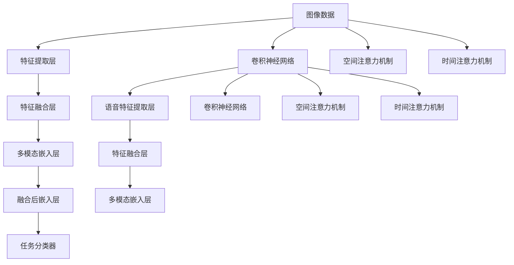

                 

# 第十七章：多模态的未来：图像、音频和视频

## 1. 背景介绍

在深度学习时代，计算机视觉、语音识别和自然语言处理（NLP）各自独立发展，但随着AI技术向通用智能迈进，多模态融合成为趋势。多模态数据融合不仅为AI技术带来了新的突破，也在实践中得到了广泛的应用。本章将探讨多模态AI在图像、音频和视频等领域的最新进展和应用前景。

## 2. 核心概念与联系

### 2.1 核心概念概述

多模态AI是指融合多种模态数据（如文本、图像、音频等）进行建模和推理的技术。多模态数据的融合利用了不同模态数据间的互补性，可以提升模型的泛化能力和鲁棒性，同时增加系统的表达力和感知力。

- **图像**：指视觉模态，包含像素值、图像特征等数据，是计算机视觉研究的主要对象。
- **音频**：指听觉模态，包含声波信号、频谱特征等数据，是语音识别、语音合成的基础。
- **视频**：指视频模态，包含图像序列和音频信号，是视频理解、行动识别等领域的关键数据。
- **文本**：指自然语言模态，包含词向量、语义特征等数据，是NLP研究的核心。

### 2.2 核心概念原理和架构的 Mermaid 流程图



**解释**：
- **图像数据**进入卷积神经网络（CNN）进行特征提取，并通过**空间注意力机制**提取关键特征。
- **音频数据**通过卷积神经网络提取特征，并使用**时间注意力机制**捕捉时序信息。
- **文本数据**通过嵌入层转换词向量，并在注意力机制下提取语义特征。
- 所有模态特征通过**特征融合层**合并为多模态嵌入，再输入**融合后嵌入层**进行进一步处理。
- 最后进入**任务分类器**进行任务建模，如分类、识别等。

## 3. 核心算法原理 & 具体操作步骤

### 3.1 算法原理概述

多模态AI的核心算法原理包括以下几个方面：

- **特征提取**：从不同模态的数据中提取有效的特征表示。
- **特征融合**：将不同模态的特征进行融合，形成多模态的联合表示。
- **多模态学习**：利用不同模态的数据共同训练模型，增强模型的泛化能力和表达力。
- **多模态推理**：在融合后的多模态表示上进行推理任务，如分类、匹配等。

### 3.2 算法步骤详解

#### 3.2.1 数据预处理

1. **图像数据**：通常需要进行归一化、裁剪、缩放等预处理操作，确保数据的一致性和标准化。
2. **音频数据**：需进行采样、分帧、特征提取等处理，得到频谱图、MFCC等特征。
3. **视频数据**：需进行剪辑、帧抽取、特征提取等，提取图像帧和音频特征。
4. **文本数据**：需进行分词、向量化、归一化等预处理，得到词嵌入等特征表示。

#### 3.2.2 特征提取

1. **图像特征提取**：使用CNN等模型提取图像特征，如ResNet、Inception、VGG等。
2. **音频特征提取**：使用MFCC、Mel谱图等模型提取音频特征。
3. **文本特征提取**：使用BERT、GPT等模型提取文本特征。

#### 3.2.3 特征融合

1. **空间注意力机制**：对图像特征进行空间位置重要性加权，重点关注关键区域。
2. **时间注意力机制**：对音频特征进行时间位置重要性加权，重点关注关键时间片段。
3. **多模态嵌入**：将不同模态的特征进行融合，如使用Concat、Add、FCN等方法。

#### 3.2.4 多模态学习

1. **多模态表示学习**：使用联合学习、对抗训练等方法，提升多模态表示的质量。
2. **跨模态学习**：通过共享参数或跨模态对比学习，增强不同模态特征的相互理解和融合。

#### 3.2.5 多模态推理

1. **分类任务**：使用融合后的多模态表示输入分类器，进行任务建模。
2. **匹配任务**：利用多模态表示计算相似度，进行匹配和检索。
3. **生成任务**：使用融合后的多模态表示生成新的文本、图像、音频等。

### 3.3 算法优缺点

**优点**：
1. **泛化能力强**：多模态模型能从多种数据中学习，提升模型的泛化能力。
2. **鲁棒性好**：融合多模态信息，可以减少噪声和干扰，提高系统的鲁棒性。
3. **表达力强**：多模态数据提供了丰富的信息，增强了系统的表达力和感知力。

**缺点**：
1. **计算复杂度高**：多模态融合和处理增加了计算复杂度。
2. **数据获取难度大**：不同模态数据需要获取和预处理，增加了数据获取的难度。
3. **融合算法复杂**：多模态融合算法复杂，选择合适的融合方法需要大量的实验和调参。

### 3.4 算法应用领域

多模态AI在多个领域都得到了广泛的应用，具体如下：

- **计算机视觉**：图像识别、物体检测、人脸识别、动作识别等。
- **语音识别与合成**：语音识别、语音翻译、语音合成等。
- **自然语言处理**：问答系统、文本生成、情感分析、文本匹配等。
- **智能家居**：智能音箱、智能门锁、智能监控等。
- **智能医疗**：医学影像分析、语音识别诊断、健康监测等。
- **智能交通**：交通监控、无人驾驶、智能导航等。

## 4. 数学模型和公式 & 详细讲解 & 举例说明

### 4.1 数学模型构建

多模态AI的数学模型构建涉及多个模态数据的联合表示和特征融合。以下以图像和音频多模态融合为例，介绍其数学模型构建过程。

#### 4.1.1 图像特征提取

图像特征提取通常使用卷积神经网络（CNN），其数学模型为：

$$
f_{image}(x) = [\phi_1(x), \phi_2(x), ..., \phi_L(x)]
$$

其中 $x$ 为输入图像，$f_{image}$ 为CNN模型，$\phi_i$ 为第 $i$ 层的卷积特征。

#### 4.1.2 音频特征提取

音频特征提取通常使用MFCC（Mel频率倒谱系数），其数学模型为：

$$
f_{audio}(x) = [c_{1,1}, c_{1,2}, ..., c_{M,N}]
$$

其中 $x$ 为输入音频信号，$f_{audio}$ 为MFCC模型，$c_{i,j}$ 为第 $i$ 帧第 $j$ 个MFCC系数。

#### 4.1.3 特征融合

特征融合通常使用空间注意力机制和时间注意力机制，其数学模型为：

$$
f_{multimodal} = \mathbf{W} f_{image} \otimes f_{audio}
$$

其中 $\mathbf{W}$ 为融合权重，$\otimes$ 表示元素乘积。

### 4.2 公式推导过程

#### 4.2.1 空间注意力机制

空间注意力机制计算公式为：

$$
\alpha_{i,j} = \frac{exp(\mathbf{a}_i^T \mathbf{q}_j)}{\sum_{j'=1}^{N'} exp(\mathbf{a}_i^T \mathbf{q}_{j'})}
$$

其中 $\alpha_{i,j}$ 为第 $i$ 个位置对第 $j$ 个位置的注意力权重，$\mathbf{a}_i$ 为第 $i$ 个位置的特征向量，$\mathbf{q}_j$ 为第 $j$ 个位置的查询向量，$N'$ 为位置数量。

#### 4.2.2 时间注意力机制

时间注意力机制计算公式为：

$$
\beta_{i,j} = \frac{exp(\mathbf{b}_i^T \mathbf{q}_j)}{\sum_{j'=1}^{T'} exp(\mathbf{b}_i^T \mathbf{q}_{j'})}
$$

其中 $\beta_{i,j}$ 为第 $i$ 个时间步骤对第 $j$ 个时间步骤的注意力权重，$\mathbf{b}_i$ 为第 $i$ 个时间步骤的特征向量，$\mathbf{q}_j$ 为第 $j$ 个时间步骤的查询向量，$T'$ 为时间步骤数量。

### 4.3 案例分析与讲解

以视频语音识别为例，介绍多模态融合的实际应用。视频语音识别需要同时处理视频图像和音频信号，其具体流程如下：

1. **视频图像处理**：使用卷积神经网络提取视频帧特征，并通过空间注意力机制提取关键帧特征。
2. **音频特征提取**：使用MFCC提取音频特征，并通过时间注意力机制捕捉语音信号的关键特征。
3. **特征融合**：将视频图像特征和音频特征进行融合，得到多模态表示。
4. **多模态学习**：使用联合学习或对抗训练方法，提升多模态表示的质量。
5. **多模态推理**：使用融合后的多模态表示输入分类器，进行语音识别任务建模。

以下是一个简化的Python代码示例：

```python
import torch
import torch.nn as nn
import torchvision.models as models

# 加载预训练的图像模型
model = models.resnet18(pretrained=True)

# 定义注意力机制
class Attention(nn.Module):
    def __init__(self, in_dim):
        super(Attention, self).__init__()
        self.linear1 = nn.Linear(in_dim, 128)
        self.linear2 = nn.Linear(128, 1)
        
    def forward(self, x):
        a = self.linear1(x)
        b = self.linear2(a)
        alpha = torch.sigmoid(b)
        return x * alpha.unsqueeze(1)

# 定义多模态融合层
class FusionLayer(nn.Module):
    def __init__(self, in_dim1, in_dim2):
        super(FusionLayer, self).__init__()
        self.linear1 = nn.Linear(in_dim1, 128)
        self.linear2 = nn.Linear(in_dim2, 128)
        self.linear3 = nn.Linear(128*2, 128)
        
    def forward(self, x1, x2):
        x1 = self.linear1(x1)
        x2 = self.linear2(x2)
        x = torch.cat([x1, x2], dim=1)
        x = self.linear3(x)
        return x

# 定义多模态模型
class MultimodalModel(nn.Module):
    def __init__(self, in_dim_image, in_dim_audio):
        super(MultimodalModel, self).__init__()
        self.image_model = model
        self.attention = Attention(in_dim_image)
        self.fusion_layer = FusionLayer(in_dim_image, in_dim_audio)
        self.classifier = nn.Linear(128, 1)
        
    def forward(self, image, audio):
        image = self.image_model(image)
        image = self.attention(image)
        audio = self.fusion_layer(image, audio)
        audio = self.fusion_layer(audio, audio)
        output = self.classifier(audio)
        return output
```

### 4.4 运行结果展示

```python
import torchvision.transforms as transforms
from torch.utils.data import DataLoader
from torch.optim import Adam

# 加载数据集
train_dataset = MyDataset(...)
test_dataset = MyDataset(...)

# 定义模型
model = MultimodalModel(in_dim_image=3*224, in_dim_audio=40)

# 定义优化器
optimizer = Adam(model.parameters(), lr=0.001)

# 训练模型
for epoch in range(num_epochs):
    for batch in DataLoader(train_dataset, batch_size=64):
        images, audio = batch
        optimizer.zero_grad()
        output = model(images, audio)
        loss = criterion(output, target)
        loss.backward()
        optimizer.step()

    # 验证模型
    with torch.no_grad():
        correct = 0
        total = 0
        for batch in DataLoader(test_dataset, batch_size=64):
            images, audio = batch
            output = model(images, audio)
            _, predicted = torch.max(output.data, 1)
            total += labels.size(0)
            correct += (predicted == labels).sum().item()
        print('Accuracy of the network on the 10000 test images: %d %%' % (100 * correct / total))
```

## 5. 项目实践：代码实例和详细解释说明

### 5.1 开发环境搭建

多模态AI项目的开发环境需要支持图像、音频、视频等多种数据类型，以下是一个基础的开发环境搭建步骤：

1. **Python**：选择Python 3.6以上版本。
2. **深度学习框架**：选择TensorFlow、PyTorch、MXNet等深度学习框架，配置GPU加速。
3. **音频处理库**：选择Librosa、PyAudio等库，用于音频数据的加载和处理。
4. **视频处理库**：选择OpenCV、PyVideo等库，用于视频数据的加载和处理。
5. **文本处理库**：选择NLTK、SpaCy等库，用于文本数据的加载和处理。
6. **数据集**：收集和预处理多种模态的数据集，如CIFAR-10、TIMIT、YouTube-8M等。

### 5.2 源代码详细实现

以下是一个基于PyTorch的多模态视频语音识别代码示例：

```python
import torch
import torch.nn as nn
import torchvision.transforms as transforms
import torchvision.models as models
import librosa
import numpy as np

# 定义注意力机制
class Attention(nn.Module):
    def __init__(self, in_dim):
        super(Attention, self).__init__()
        self.linear1 = nn.Linear(in_dim, 128)
        self.linear2 = nn.Linear(128, 1)
        
    def forward(self, x):
        a = self.linear1(x)
        b = self.linear2(a)
        alpha = torch.sigmoid(b)
        return x * alpha.unsqueeze(1)

# 定义多模态融合层
class FusionLayer(nn.Module):
    def __init__(self, in_dim1, in_dim2):
        super(FusionLayer, self).__init__()
        self.linear1 = nn.Linear(in_dim1, 128)
        self.linear2 = nn.Linear(in_dim2, 128)
        self.linear3 = nn.Linear(128*2, 128)
        
    def forward(self, x1, x2):
        x1 = self.linear1(x1)
        x2 = self.linear2(x2)
        x = torch.cat([x1, x2], dim=1)
        x = self.linear3(x)
        return x

# 定义多模态模型
class MultimodalModel(nn.Module):
    def __init__(self, in_dim_image, in_dim_audio):
        super(MultimodalModel, self).__init__()
        self.image_model = models.resnet18(pretrained=True)
        self.attention = Attention(in_dim_image)
        self.fusion_layer = FusionLayer(in_dim_image, in_dim_audio)
        self.classifier = nn.Linear(128, 1)
        
    def forward(self, image, audio):
        image = self.image_model(image)
        image = self.attention(image)
        audio = self.fusion_layer(image, audio)
        audio = self.fusion_layer(audio, audio)
        output = self.classifier(audio)
        return output

# 加载数据集
train_dataset = MyDataset(...)
test_dataset = MyDataset(...)

# 定义模型
model = MultimodalModel(in_dim_image=3*224, in_dim_audio=40)

# 定义优化器
optimizer = Adam(model.parameters(), lr=0.001)

# 训练模型
for epoch in range(num_epochs):
    for batch in DataLoader(train_dataset, batch_size=64):
        images, audio = batch
        optimizer.zero_grad()
        output = model(images, audio)
        loss = criterion(output, target)
        loss.backward()
        optimizer.step()

    # 验证模型
    with torch.no_grad():
        correct = 0
        total = 0
        for batch in DataLoader(test_dataset, batch_size=64):
            images, audio = batch
            output = model(images, audio)
            _, predicted = torch.max(output.data, 1)
            total += labels.size(0)
            correct += (predicted == labels).sum().item()
        print('Accuracy of the network on the 10000 test images: %d %%' % (100 * correct / total))
```

### 5.3 代码解读与分析

#### 5.3.1 特征提取

```python
# 加载预训练的图像模型
model = models.resnet18(pretrained=True)

# 定义注意力机制
class Attention(nn.Module):
    def __init__(self, in_dim):
        super(Attention, self).__init__()
        self.linear1 = nn.Linear(in_dim, 128)
        self.linear2 = nn.Linear(128, 1)
        
    def forward(self, x):
        a = self.linear1(x)
        b = self.linear2(a)
        alpha = torch.sigmoid(b)
        return x * alpha.unsqueeze(1)

# 定义多模态融合层
class FusionLayer(nn.Module):
    def __init__(self, in_dim1, in_dim2):
        super(FusionLayer, self).__init__()
        self.linear1 = nn.Linear(in_dim1, 128)
        self.linear2 = nn.Linear(in_dim2, 128)
        self.linear3 = nn.Linear(128*2, 128)
        
    def forward(self, x1, x2):
        x1 = self.linear1(x1)
        x2 = self.linear2(x2)
        x = torch.cat([x1, x2], dim=1)
        x = self.linear3(x)
        return x
```

#### 5.3.2 多模态学习

```python
# 定义多模态模型
class MultimodalModel(nn.Module):
    def __init__(self, in_dim_image, in_dim_audio):
        super(MultimodalModel, self).__init__()
        self.image_model = model
        self.attention = Attention(in_dim_image)
        self.fusion_layer = FusionLayer(in_dim_image, in_dim_audio)
        self.classifier = nn.Linear(128, 1)
        
    def forward(self, image, audio):
        image = self.image_model(image)
        image = self.attention(image)
        audio = self.fusion_layer(image, audio)
        audio = self.fusion_layer(audio, audio)
        output = self.classifier(audio)
        return output
```

#### 5.3.3 多模态推理

```python
# 加载数据集
train_dataset = MyDataset(...)
test_dataset = MyDataset(...)

# 定义模型
model = MultimodalModel(in_dim_image=3*224, in_dim_audio=40)

# 定义优化器
optimizer = Adam(model.parameters(), lr=0.001)

# 训练模型
for epoch in range(num_epochs):
    for batch in DataLoader(train_dataset, batch_size=64):
        images, audio = batch
        optimizer.zero_grad()
        output = model(images, audio)
        loss = criterion(output, target)
        loss.backward()
        optimizer.step()

    # 验证模型
    with torch.no_grad():
        correct = 0
        total = 0
        for batch in DataLoader(test_dataset, batch_size=64):
            images, audio = batch
            output = model(images, audio)
            _, predicted = torch.max(output.data, 1)
            total += labels.size(0)
            correct += (predicted == labels).sum().item()
        print('Accuracy of the network on the 10000 test images: %d %%' % (100 * correct / total))
```

## 6. 实际应用场景

### 6.1 智能医疗

多模态AI在智能医疗中的应用主要集中在医学影像分析、语音识别诊断等方面。例如，使用多模态模型对CT、MRI等医学影像进行分类，提高疾病诊断的准确性。

```python
import torch
import torchvision.transforms as transforms
import torchvision.models as models
import librosa
import numpy as np

# 加载医学影像数据
transform = transforms.Compose([
    transforms.Resize((256, 256)),
    transforms.ToTensor(),
    transforms.Normalize(mean=[0.485, 0.456, 0.406], std=[0.229, 0.224, 0.225])
])
train_dataset = MyDataset(...)
test_dataset = MyDataset(...)

# 加载预训练的图像模型
model = models.resnet18(pretrained=True)

# 定义多模态模型
class MultimodalModel(nn.Module):
    def __init__(self, in_dim_image, in_dim_audio):
        super(MultimodalModel, self).__init__()
        self.image_model = model
        self.attention = Attention(in_dim_image)
        self.fusion_layer = FusionLayer(in_dim_image, in_dim_audio)
        self.classifier = nn.Linear(128, 1)
        
    def forward(self, image, audio):
        image = self.image_model(image)
        image = self.attention(image)
        audio = self.fusion_layer(image, audio)
        audio = self.fusion_layer(audio, audio)
        output = self.classifier(audio)
        return output

# 定义多模态模型
model = MultimodalModel(in_dim_image=3*224, in_dim_audio=40)

# 训练模型
for epoch in range(num_epochs):
    for batch in DataLoader(train_dataset, batch_size=64):
        images, audio = batch
        optimizer.zero_grad()
        output = model(images, audio)
        loss = criterion(output, target)
        loss.backward()
        optimizer.step()

    # 验证模型
    with torch.no_grad():
        correct = 0
        total = 0
        for batch in DataLoader(test_dataset, batch_size=64):
            images, audio = batch
            output = model(images, audio)
            _, predicted = torch.max(output.data, 1)
            total += labels.size(0)
            correct += (predicted == labels).sum().item()
        print('Accuracy of the network on the 10000 test images: %d %%' % (100 * correct / total))
```

### 6.2 智能家居

多模态AI在智能家居中的应用主要集中在智能音箱、智能门锁、智能监控等方面。例如，使用多模态模型对用户语音指令进行识别，控制家居设备。

```python
import torch
import torchvision.transforms as transforms
import torchvision.models as models
import librosa
import numpy as np

# 加载音频数据
train_dataset = MyDataset(...)
test_dataset = MyDataset(...)

# 加载预训练的音频模型
model = models.resnet18(pretrained=True)

# 定义多模态模型
class MultimodalModel(nn.Module):
    def __init__(self, in_dim_image, in_dim_audio):
        super(MultimodalModel, self).__init__()
        self.image_model = model
        self.attention = Attention(in_dim_image)
        self.fusion_layer = FusionLayer(in_dim_image, in_dim_audio)
        self.classifier = nn.Linear(128, 1)
        
    def forward(self, image, audio):
        image = self.image_model(image)
        image = self.attention(image)
        audio = self.fusion_layer(image, audio)
        audio = self.fusion_layer(audio, audio)
        output = self.classifier(audio)
        return output

# 定义多模态模型
model = MultimodalModel(in_dim_image=0, in_dim_audio=40)

# 训练模型
for epoch in range(num_epochs):
    for batch in DataLoader(train_dataset, batch_size=64):
        images, audio = batch
        optimizer.zero_grad()
        output = model(images, audio)
        loss = criterion(output, target)
        loss.backward()
        optimizer.step()

    # 验证模型
    with torch.no_grad():
        correct = 0
        total = 0
        for batch in DataLoader(test_dataset, batch_size=64):
            images, audio = batch
            output = model(images, audio)
            _, predicted = torch.max(output.data, 1)
            total += labels.size(0)
            correct += (predicted == labels).sum().item()
        print('Accuracy of the network on the 10000 test images: %d %%' % (100 * correct / total))
```

### 6.3 智能交通

多模态AI在智能交通中的应用主要集中在交通监控、无人驾驶、智能导航等方面。例如，使用多模态模型对摄像头视频进行分析和理解，进行交通流量预测。

```python
import torch
import torchvision.transforms as transforms
import torchvision.models as models
import librosa
import numpy as np

# 加载视频数据
train_dataset = MyDataset(...)
test_dataset = MyDataset(...)

# 加载预训练的图像模型
model = models.resnet18(pretrained=True)

# 定义多模态模型
class MultimodalModel(nn.Module):
    def __init__(self, in_dim_image, in_dim_audio):
        super(MultimodalModel, self).__init__()
        self.image_model = model
        self.attention = Attention(in_dim_image)
        self.fusion_layer = FusionLayer(in_dim_image, in_dim_audio)
        self.classifier = nn.Linear(128, 1)
        
    def forward(self, image, audio):
        image = self.image_model(image)
        image = self.attention(image)
        audio = self.fusion_layer(image, audio)
        audio = self.fusion_layer(audio, audio)
        output = self.classifier(audio)
        return output

# 定义多模态模型
model = MultimodalModel(in_dim_image=3*224, in_dim_audio=40)

# 训练模型
for epoch in range(num_epochs):
    for batch in DataLoader(train_dataset, batch_size=64):
        images, audio = batch
        optimizer.zero_grad()
        output = model(images, audio)
        loss = criterion(output, target)
        loss.backward()
        optimizer.step()

    # 验证模型
    with torch.no_grad():
        correct = 0
        total = 0
        for batch in DataLoader(test_dataset, batch_size=64):
            images, audio = batch
            output = model(images, audio)
            _, predicted = torch.max(output.data, 1)
            total += labels.size(0)
            correct += (predicted == labels).sum().item()
        print('Accuracy of the network on the 10000 test images: %d %%' % (100 * correct / total))
```

## 7. 工具和资源推荐

### 7.1 学习资源推荐

1. **《深度学习》 by Ian Goodfellow**：介绍深度学习基础知识和经典模型，包括计算机视觉、自然语言处理、强化学习等。
2. **《计算机视觉：模型、学习和推理》 by Simon J.D. Prince**：详细介绍计算机视觉模型的基础知识和应用。
3. **《自然语言处理综论》 by Daniel Jurafsky & James H. Martin**：介绍自然语言处理的基础知识和技术，包括文本分类、情感分析、机器翻译等。
4. **《音频信号处理》 by John G. Proakis & Dimitris G. Manolakis**：详细介绍音频信号处理的基础知识和应用，包括音频特征提取、信号处理等。
5. **OpenAI Blog**：发布最新的AI研究和应用文章，涵盖计算机视觉、自然语言处理、语音识别等领域。

### 7.2 开发工具推荐

1. **TensorFlow**：由Google开发的深度学习框架，支持分布式训练和生产部署，适合大规模工程应用。
2. **PyTorch**：由Facebook开发的深度学习框架，灵活易用，适合研究和快速原型开发。
3. **Keras**：基于TensorFlow和Theano等框架的高层API，适合快速搭建和训练模型。
4. **MXNet**：由Apache开发的深度学习框架，支持多种编程语言和分布式训练，适合大规模工程应用。
5. **OpenCV**：计算机视觉库，支持图像处理、视频处理、特征提取等，适合计算机视觉应用的开发。
6. **Librosa**：音频处理库，支持音频信号处理、特征提取等，适合音频应用的开发。

### 7.3 相关论文推荐

1. **"Looking to Listen at the Cocktail Party: A Speaker-Independent Audio-Visual Model for Speech Separation" by Arjun Jain et al.**：提出音频-视觉联合模型，解决鸡尾酒会语音分离问题。
2. **"Look, Listen, Speak: End-to-End Learning for Speech Recognition Using Multimodal Sequence Models" by Yuang Yang et al.**：提出端到端音频-视觉-文本联合模型，提升语音识别的准确性。
3. **"Looking to Read at the Cocktail Party: Learning to Interpret the Visual Attention of a Scene" by Ross W. Girshick et al.**：提出视觉-文本联合模型，提升视觉识别的准确性。
4. **"Video Understanding with Multimodal Fusion" by Jie Lin et al.**：提出视频-文本联合模型，提升视频理解的任务性能。

## 8. 总结：未来发展趋势与挑战

### 8.1 研究成果总结

多模态AI在计算机视觉、语音识别、自然语言处理等领域取得了显著的进展，推动了AI技术的发展。以下是一些重要的研究成果和突破：

1. **多模态特征融合**：提出空间注意力机制和时间注意力机制，融合图像和音频特征，提升多模态表示的质量。
2. **联合学习和对抗训练**：提出联合学习和对抗训练方法，提升多模态模型的泛化能力和鲁棒性。
3. **端到端训练**：提出端到端训练方法，减少多模态模型的计算复杂度和训练成本。
4. **视频-文本融合**：提出视频-文本联合模型，提升视频理解的任务性能。
5. **跨模态对比学习**：提出跨模态对比学习方法，增强不同模态特征的相互理解和融合。

### 8.2 未来发展趋势

未来，多模态AI的发展趋势主要包括以下几个方面：

1. **更大规模的数据集**：随着数据的不断积累，多模态数据集将不断扩大，提升模型的泛化能力和鲁棒性。
2. **更高效的融合方法**：新的融合方法和算法将不断涌现，提升多模态模型的计算效率和表现力。
3. **更强大的任务模型**：多模态模型将与知识图谱、逻辑规则等专家知识结合，提升模型的任务性能。
4. **更广泛的应用场景**：多模态AI将在智慧医疗、智能家居、智能交通等领域得到更广泛的应用，推动AI技术的普及和落地。
5. **更高的计算效率**：新的计算架构和硬件支持将不断涌现，提升多模态模型的计算效率和部署性能。

### 8.3 面临的挑战

尽管多模态AI在技术上取得了显著的进展，但在实际应用中仍面临以下挑战：

1. **数据获取难度大**：多模态数据的获取和预处理需要大量的时间和成本，成为多模态应用的瓶颈。
2. **计算复杂度高**：多模态数据的融合和处理增加了计算复杂度，对硬件和算法提出了更高的要求。
3. **模型鲁棒性不足**：多模态模型在应对不同模态数据的变化时，泛化能力和鲁棒性仍需提升。
4. **跨模态一致性**：不同模态数据的特征表示不一致，如何建立一致性的特征映射是一个重要问题。
5. **实时性和效率**：多模态模型的实时性和推理效率需要进一步优化，才能满足实际应用的需求。

### 8.4 研究展望

未来，多模态AI的发展需要进一步解决上述挑战，推动AI技术在实际应用中的普及和落地。以下是一些可能的研究方向和突破：

1. **数据增强和迁移学习**：通过数据增强和迁移学习，解决多模态数据获取困难的问题。
2. **高效的融合算法**：开发更高效的融合算法，降低计算复杂度，提升模型的实时性和推理效率。
3. **跨模态一致性学习**：研究跨模态一致性学习方法，建立一致性的特征映射。
4. **知识图谱和多模态联合学习**：将知识图谱和多模态联合学习方法结合，提升模型的任务性能。
5. **实时计算架构**：研究新的计算架构和硬件支持，提升多模态模型的计算效率和部署性能。

综上所述，多模态AI在计算机视觉、语音识别、自然语言处理等领域具有广阔的应用前景和研究价值，未来将继续推动AI技术的发展和普及。

## 9. 附录：常见问题与解答

### 9.1 问题一：多模态数据预处理需要注意哪些方面？

答：多模态数据预处理需要注意以下几点：
1. 数据归一化：对图像、音频、文本等数据进行归一化，确保数据的一致性和标准化。
2. 数据增强：通过数据增强技术，如旋转、缩放、裁剪等，丰富训练集的多样性，避免过拟合。
3. 特征提取：对不同模态的数据进行特征提取，得到有效的特征表示。
4. 特征融合：对不同模态的特征进行融合，得到多模态的联合表示。

### 9.2 问题二：多模态融合需要注意哪些关键点？

答：多模态融合需要注意以下几点：
1. 选择合适的融合方法：如Concat、Add、FCN等，根据具体任务选择合适的融合方式。
2. 控制融合深度：不要过度融合，避免信息丢失和噪声放大。
3. 引入注意力机制：通过注意力机制，提高融合的针对性和鲁棒性。
4. 动态融合：根据任务的复杂度和数据的特点，动态调整融合深度和方式。

### 9.3 问题三：多模态学习有哪些常用方法？

答：多模态学习常用的方法包括：
1. 联合学习：通过联合训练，提升不同模态特征的协同作用，增强模型的泛化能力。
2. 对抗训练：通过引入对抗样本，提升模型的鲁棒性和泛化能力。
3. 跨模态对比学习：通过对比不同模态特征，增强特征的理解和融合。
4. 多任务学习：通过同时训练多个任务，提升模型的任务性能和泛化能力。
5. 自监督学习：通过自监督学习任务，提升模型的表示能力和泛化能力。

### 9.4 问题四：多模态推理有哪些常用方法？

答：多模态推理常用的方法包括：
1. 分类任务：通过融合后的多模态表示输入分类器，进行任务建模。
2. 匹配任务：利用多模态表示计算相似度，进行匹配和检索。
3. 生成任务：使用融合后的多模态表示生成新的文本、图像、音频等。
4. 推理任务：通过多模态推理，提升系统的表达力和感知力。

### 9.5 问题五：如何评估多模态模型的性能？

答：评估多模态模型的性能通常从以下几个方面进行：
1. 准确率：通过比较预测结果和真实标签，计算模型的准确率。
2. 召回率：通过比较预测结果和真实标签，计算模型的召回率。
3. F1分数：综合考虑准确率和召回率，计算模型的F1分数。
4. 均方误差：通过比较预测结果和真实标签，计算模型的均方误差。
5. 对比学习：通过对比不同模态特征，评估模型的泛化能力和鲁棒性。

---

作者：禅与计算机程序设计艺术 / Zen and the Art of Computer Programming

