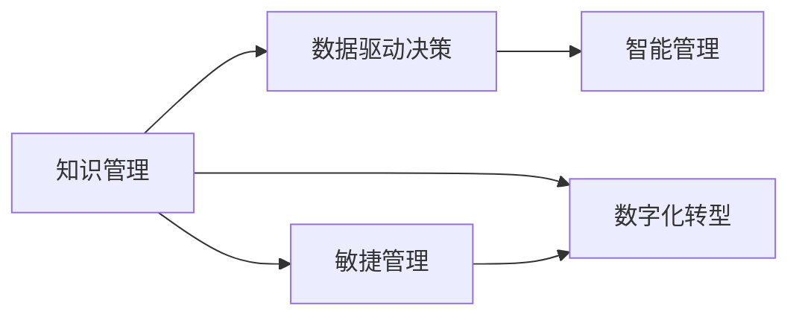

                 

## 1. 背景介绍

在当今这个快速变化的数字化时代，知识和技术在以惊人的速度迭代更新。无论是金融、医疗、制造还是互联网，各个行业都面临着前所未有的挑战和机遇。在这样的背景下，管理者如何保持敏捷性、提升决策能力，成为其能否在竞争中脱颖而出的关键。本文将从管理者的视角出发，探讨如何应对知识快速迭代，包括技术、方法、工具等多个层面。

### 1.1 问题由来
技术的迅猛发展使得旧有的知识迅速过时，管理者的知识储备和决策方法必须不断更新以适应新的技术环境。例如，人工智能、区块链、云计算等新兴技术的发展，对传统行业的管理模式造成了深远的影响。同时，疫情的全球蔓延进一步加速了企业向数字化转型的进程，对管理者的适应能力提出了更高的要求。

### 1.2 问题核心关键点
- **知识更新速度**：技术迭代速度超出了大多数管理者的知识更新能力。
- **决策质量**：快速变化的国内外环境要求管理者能迅速做出高质量的决策。
- **组织灵活性**：快速变化的市场需求需要组织具备快速响应能力。
- **跨领域融合**：新技术的应用往往涉及多个领域知识的融合，管理者的知识结构需要具备跨领域能力。

## 2. 核心概念与联系

### 2.1 核心概念概述

要应对知识快速迭代，管理者需掌握以下核心概念：

- **知识管理（Knowledge Management）**：通过组织、共享和利用知识，提高决策效率和质量。
- **敏捷管理（Agile Management）**：通过快速迭代和持续改进，提升组织对变化环境的适应能力。
- **数字化转型（Digital Transformation）**：通过技术手段重构业务流程，实现业务效率提升。
- **数据驱动决策（Data-Driven Decision Making）**：基于数据分析和洞察，做出科学决策。
- **智能管理（Intelligent Management）**：利用人工智能技术辅助决策，提升管理效率和精准度。

这些概念之间存在密切的联系，共同构成了一个动态的知识管理框架，帮助管理者应对知识快速迭代带来的挑战。

### 2.2 核心概念原理和架构的 Mermaid 流程图



该流程图展示了知识管理的不同维度及其相互作用，反映了知识管理的动态性和复杂性。

## 3. 核心算法原理 & 具体操作步骤

### 3.1 算法原理概述

管理者在应对知识快速迭代时，需要借助多种算法和模型来提升决策的科学性和效率。以下是几种常见的算法：

- **预测模型（Predictive Modeling）**：通过历史数据预测未来趋势，辅助管理者进行决策。
- **优化算法（Optimization Algorithm）**：优化资源配置、流程优化等，提升管理效率。
- **聚类分析（Clustering Analysis）**：识别关键用户群体，制定针对性策略。
- **自然语言处理（NLP）**：分析文本数据，提取有价值信息。

### 3.2 算法步骤详解

管理者应对知识快速迭代的算法步骤一般包括以下几个关键步骤：

1. **数据收集与清洗**：从各类数据源收集数据，并进行初步清洗和预处理。
2. **数据建模**：选择合适的算法和模型进行建模，如回归、分类、聚类等。
3. **模型训练与验证**：利用历史数据训练模型，并在验证集上验证模型性能。
4. **模型应用与迭代**：在实际管理场景中应用模型，并根据结果持续优化模型。
5. **结果监控与反馈**：实时监控模型结果，收集反馈用于模型改进。

### 3.3 算法优缺点

**预测模型的优点**：
- **数据驱动**：能够基于历史数据和趋势预测未来，提升决策科学性。
- **高效性**：模型训练和预测速度快，适合处理大数据。

**预测模型的缺点**：
- **数据依赖**：模型的准确性高度依赖于数据质量和量级。
- **模型过拟合**：模型在训练集上表现良好，但可能对新数据泛化能力不足。

**优化算法的优点**：
- **结果可控**：通过优化目标函数，可以灵活控制资源配置和流程优化。
- **广泛应用**：适用于多个场景，如供应链优化、资源调度等。

**优化算法的缺点**：
- **复杂度较高**：优化过程涉及多个变量和约束条件，计算复杂度高。
- **参数调优**：需要大量时间调整算法参数，以获得最佳结果。

**聚类分析的优点**：
- **识别群体**：能够自动发现用户群体特征，制定针对性策略。
- **灵活性**：能够处理多维度数据，适用于多种场景。

**聚类分析的缺点**：
- **结果解释性差**：聚类结果的解释性较差，需要进一步分析。
- **敏感性**：数据中的噪声和异常值可能影响聚类结果。

**NLP的优点**：
- **信息提取**：能够从文本中提取有价值信息，如情感分析、主题建模等。
- **自动化**：处理大量文本数据，提升信息处理效率。

**NLP的缺点**：
- **语言依赖**：不同语言的数据处理难度不同，需要额外的资源支持。
- **歧义处理**：处理自然语言时，歧义和语义理解可能存在问题。

### 3.4 算法应用领域

管理者应对知识快速迭代的技术和算法可以应用于多个领域：

- **企业战略规划**：通过预测模型分析市场趋势，制定战略规划。
- **供应链优化**：利用优化算法优化资源配置和库存管理。
- **客户关系管理**：通过聚类分析识别不同客户群体，制定个性化营销策略。
- **人力资源管理**：通过NLP技术分析员工反馈，提升员工满意度。

## 4. 数学模型和公式 & 详细讲解

### 4.1 数学模型构建

管理者在应对知识快速迭代时，常用的数学模型包括线性回归、逻辑回归、聚类分析等。

### 4.2 公式推导过程

以线性回归为例，其公式推导过程如下：

1. 假设数据集为 $\{(x_i, y_i)\}_{i=1}^N$，其中 $x$ 为自变量，$y$ 为因变量。
2. 假设 $y$ 与 $x$ 之间存在线性关系，即 $y=\theta_0+\theta_1x+\epsilon$，其中 $\epsilon$ 为误差项。
3. 利用最小二乘法，求解 $\theta_0$ 和 $\theta_1$，使得预测值与实际值之间的误差最小。

最小二乘法公式为：

$$\theta_0, \theta_1 = \arg\min_{\theta_0, \theta_1} \sum_{i=1}^N (y_i-\theta_0-\theta_1x_i)^2$$

### 4.3 案例分析与讲解

假设某公司希望通过销售数据预测未来销售额，可以采用线性回归模型：

```python
from sklearn.linear_model import LinearRegression

# 假设数据集已准备就绪，分别为自变量和因变量
X = df['sales'].values.reshape(-1, 1)
y = df['future_sales'].values

# 建立线性回归模型
model = LinearRegression()
model.fit(X, y)

# 预测未来销售额
future_sales = model.predict(X)
```

通过上述代码，可以建立线性回归模型，并利用已有数据进行预测。

## 5. 项目实践：代码实例和详细解释说明

### 5.1 开发环境搭建

要进行上述数据建模和预测，首先需要搭建好开发环境。以下是在Python中使用Scikit-learn进行开发的示例：

1. 安装Python和Scikit-learn：
   ```bash
   sudo apt-get update
   sudo apt-get install python3 python3-pip
   pip3 install scikit-learn
   ```

2. 准备数据集：
   ```python
   import pandas as pd
   df = pd.read_csv('sales_data.csv')
   ```

### 5.2 源代码详细实现

```python
from sklearn.linear_model import LinearRegression

# 假设数据集已准备就绪，分别为自变量和因变量
X = df['sales'].values.reshape(-1, 1)
y = df['future_sales'].values

# 建立线性回归模型
model = LinearRegression()
model.fit(X, y)

# 预测未来销售额
future_sales = model.predict(X)
```

### 5.3 代码解读与分析

上述代码展示了使用Scikit-learn进行线性回归模型的简单实现。具体解释如下：

1. 导入线性回归模型。
2. 准备数据集，将自变量和因变量分别存储在X和y变量中。
3. 建立线性回归模型，并使用已有数据进行训练。
4. 利用模型进行未来销售额的预测。

运行结果将输出预测值，可进一步用于决策支持。

## 6. 实际应用场景

管理者应对知识快速迭代的技术和算法在实际应用中具有广泛的应用前景：

### 6.1 企业战略规划

通过预测模型，企业可以分析市场趋势和客户需求变化，及时调整战略规划，提升决策的科学性和前瞻性。

### 6.2 供应链优化

利用优化算法，企业可以优化物流、库存等资源配置，降低成本，提高效率。

### 6.3 客户关系管理

通过聚类分析，企业可以识别不同客户群体，制定针对性的营销策略，提升客户满意度和忠诚度。

### 6.4 未来应用展望

未来，随着技术的不断进步，管理者应对知识快速迭代将更加智能化和高效化。例如：

- **人工智能辅助决策**：利用AI技术进行决策支持和自动化分析，提升决策速度和精准度。
- **大数据分析**：通过分析海量数据，提取有价值的商业洞察，辅助决策制定。
- **跨领域知识融合**：结合不同领域的专业知识，制定更加综合的战略和方案。

## 7. 工具和资源推荐

### 7.1 学习资源推荐

1. **在线课程**：
   - Coursera上的《Data Science》系列课程。
   - Udacity上的《Machine Learning》课程。

2. **书籍**：
   - 《Python数据科学手册》。
   - 《机器学习实战》。

3. **网站**：
   - Kaggle数据科学竞赛平台。
   - Scikit-learn官方文档。

### 7.2 开发工具推荐

1. **Python环境**：
   - Anaconda或Miniconda。
   - Jupyter Notebook。

2. **数据处理工具**：
   - Pandas。
   - NumPy。

3. **机器学习库**：
   - Scikit-learn。
   - TensorFlow。

4. **可视化工具**：
   - Matplotlib。
   - Seaborn。

### 7.3 相关论文推荐

1. **预测模型**：
   - Friedman, J.H. (2001). "Greedy Function Approximation: A Gradient Boosting Machine." The Annals of Statistics, 29(5), 1189-1232.

2. **优化算法**：
   - Nelder, J.A. and Mead, R. (1965). "A Simplex Method for Function Minimization." Computer Journal, 7(4), 308-313.

3. **聚类分析**：
   - MacQueen, J.B. (1967). "Some Methods for Classification and Analysis of Multivariate Observations." Proceedings of the Fifth Berkeley Symposium on Mathematical Statistics and Probability, 1(4), 281-297.

4. **NLP技术**：
   - Collobert, R., Weston, J., Bottou, L., Karlen, M., Kavukcuoglu, K., and Farabet, C. (2011). "Natural Language Processing (almost) from Scratch." Journal of Machine Learning Research, 12(8), 2493-2537.

## 8. 总结：未来发展趋势与挑战

### 8.1 研究成果总结

本文系统介绍了管理者应对知识快速迭代的技术和方法。通过预测模型、优化算法、聚类分析等技术和算法，管理者能够提升决策的科学性和效率。

### 8.2 未来发展趋势

未来的管理者应对知识快速迭代的趋势将更加智能化、高效化。大数据、人工智能等技术的应用将进一步提升决策的准确性和速度。

### 8.3 面临的挑战

管理者在应对知识快速迭代过程中仍面临诸多挑战：

1. **数据隐私与安全**：数据处理和分析过程中，需要严格遵守数据隐私和安全法规。
2. **模型复杂性**：复杂的模型和算法需要更多的资源和时间进行训练和调试。
3. **人才缺乏**：缺乏具备多领域知识的专业人才，制约了新技术的落地应用。

### 8.4 研究展望

未来的研究将更多关注以下方向：

1. **自动化与智能化**：利用自动化工具和智能化算法，简化数据处理和模型训练过程。
2. **跨领域融合**：推动不同领域知识的融合，提升管理决策的全面性和精准度。
3. **模型解释性**：提高模型的可解释性，增强决策的透明度和可理解性。

## 9. 附录：常见问题与解答

**Q1: 什么是知识管理（Knowledge Management）？**

A: 知识管理是一种系统化的管理方式，通过组织、共享和利用知识，提升组织效率和创新能力。

**Q2: 如何选择合适的预测模型？**

A: 应根据数据特点和业务需求选择合适的预测模型，如线性回归、决策树、随机森林等。

**Q3: 如何在管理中应用人工智能技术？**

A: 人工智能技术可以用于决策支持、自动化流程、智能分析等多个方面，提升管理效率和决策质量。

**Q4: 如何处理大数据？**

A: 大数据处理需采用分布式存储和计算框架，如Hadoop、Spark等，以提高处理效率。

**Q5: 如何提高模型的可解释性？**

A: 采用可解释性更高的模型，如决策树、逻辑回归等，并在模型训练中加入解释性指标。

---

作者：禅与计算机程序设计艺术 / Zen and the Art of Computer Programming

