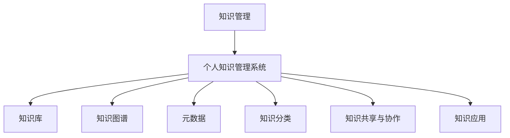

                 

# 管理者如何建立个人知识管理系统

## 1. 背景介绍

在当今知识爆炸的时代，信息过载成为每一个管理者日常面临的挑战。如何从海量信息中快速筛选、整理、应用知识，决定着管理者决策的准确性和效率。构建一个高效、智能的个人知识管理系统，成为每一个管理者的迫切需求。本文将详细介绍个人知识管理系统的核心概念、关键技术和实际应用，帮助管理者系统掌握知识管理的全流程，提升个人和组织的知识利用率。

## 2. 核心概念与联系

### 2.1 核心概念概述

为更好地理解个人知识管理系统的构建，本节将介绍几个关键概念：

- **知识管理(Knowledge Management, KM)**：通过组织、整理、共享和应用知识，提升组织和个人绩效。

- **个人知识管理系统(Personal Knowledge Management System, PKMS)**：帮助个人高效收集、整理、应用知识的软件工具或系统。

- **知识库(Knowledge Base)**：集中存储和管理知识的容器，支持文本、图片、视频等多种格式。

- **知识图谱(Knowledge Graph)**：基于图结构的知识表示方式，便于知识关联和查询。

- **元数据(Metadata)**：描述知识资源的属性信息，如创建者、更新时间、标签等，方便知识检索和管理。

- **知识分类(Knowledge Classification)**：根据知识的属性、主题等维度对知识进行归类，便于快速查找。

- **知识共享与协作(Knowledge Sharing & Collaboration)**：通过知识共享平台或协作工具，促进知识在团队中的流通。

- **知识应用(Knowledge Application)**：将知识直接或间接转化为决策、行动或产品，实现知识的价值。

这些核心概念共同构成了个人知识管理系统的理论基础，帮助管理者系统地梳理、整合和应用个人知识资源。

### 2.2 核心概念原理和架构的 Mermaid 流程图



这个流程图展示了个人知识管理系统的核心模块和数据流向。知识管理是个人知识管理系统的目标，通过知识库、知识图谱、元数据、知识分类等模块对知识进行高效整理和存储。知识共享与协作功能促进知识的流通，知识应用则将知识转化为实际价值。

## 3. 核心算法原理 & 具体操作步骤

### 3.1 算法原理概述

个人知识管理系统的工作原理可以简单概括为以下几个步骤：

1. **知识收集**：从不同渠道收集知识资源，如文档、网页、图片、视频等。
2. **知识整理**：对收集到的知识进行分类、命名、标注等处理，便于存储和检索。
3. **知识存储**：将整理好的知识资源存储到知识库或知识图谱中。
4. **知识检索**：提供快速有效的检索功能，帮助用户快速找到所需知识。
5. **知识应用**：将知识转化为决策、行动或产品，实现知识的应用和转化。
6. **知识共享与协作**：通过共享平台或协作工具，促进知识的交流和创新。

### 3.2 算法步骤详解

下面详细描述每个步骤的具体操作：

#### 3.2.1 知识收集

知识收集是个人知识管理的第一步，可以通过以下方式进行：

- **手动输入**：通过文本编辑器、笔记软件等工具，手动输入和记录知识。
- **导入文件**：将现有的文档、PDF、图片等文件直接导入知识管理系统中。
- **网页抓取**：使用爬虫工具抓取互联网上的知识资源。
- **数据同步**：从已有的知识管理工具（如Evernote、OneNote等）中同步知识。

#### 3.2.2 知识整理

知识整理的核心是分类和标注，可以使用以下方法：

- **分类体系**：建立科学的分类体系，如主题、领域、项目等。
- **标签系统**：使用标签系统对知识进行细致的分类和检索。
- **命名规范**：制定统一的命名规范，便于知识检索和共享。
- **结构化处理**：对结构化数据（如表格、文档等）进行结构化处理，便于分析和应用。

#### 3.2.3 知识存储

知识存储是个人知识管理的核心，可以使用以下方式：

- **本地存储**：将知识资源存储在本地电脑或外部存储设备中。
- **云存储**：将知识资源存储在云端，便于随时访问和共享。
- **数据库存储**：使用关系型数据库或NoSQL数据库存储知识资源，支持复杂查询和分析。
- **知识图谱存储**：使用知识图谱工具（如Neo4j、YAGO等）进行知识存储和关联。

#### 3.2.4 知识检索

知识检索是个人知识管理的灵魂，可以通过以下方法：

- **全文检索**：使用全文检索引擎（如Elasticsearch、Solr等）进行快速检索。
- **标签检索**：根据标签进行关键词检索，快速找到相关知识。
- **分类检索**：根据分类体系进行检索，定位到具体领域或主题。
- **关键词检索**：使用关键词进行精确检索，快速找到相关内容。

#### 3.2.5 知识应用

知识应用是将知识转化为实际价值的过程，可以通过以下方式：

- **决策支持**：利用知识库中的数据和分析结果，辅助管理决策。
- **项目管理**：在项目管理中应用知识库中的模板、工具和技巧。
- **创新设计**：使用知识库中的灵感和案例，进行新产品设计和创新。
- **培训学习**：从知识库中提取有价值的内容，进行内部培训和知识共享。

#### 3.2.6 知识共享与协作

知识共享与协作是个人知识管理的延伸，可以通过以下方式：

- **文档分享**：在知识库中分享文档和资料，方便团队协作。
- **协作编辑**：使用协作工具（如Google Docs、Microsoft OneNote等）进行实时编辑和讨论。
- **任务分配**：在任务管理工具（如Trello、Asana等）中使用知识库中的文档和模板，分配任务和责任。
- **讨论区**：建立讨论区或论坛，促进团队知识交流和经验分享。

### 3.3 算法优缺点

个人知识管理系统具有以下优点：

- **高效性**：通过科学的分类体系和标签系统，可以快速检索和应用知识，提升工作效率。
- **灵活性**：支持本地和云存储，方便随时访问和更新知识。
- **协作性**：支持协作编辑和知识共享，促进团队知识流通和创新。
- **结构化**：支持结构化数据处理和分析，提升知识的应用价值。

同时，个人知识管理系统也存在一些局限性：

- **复杂性**：需要投入时间和精力进行知识整理和分类，对初学者有一定门槛。
- **依赖性**：依赖工具和系统，一旦系统故障，可能导致知识丢失或访问受限。
- **数据隐私**：云存储可能存在数据隐私和安全问题，需要采取相应措施保护数据安全。
- **知识孤岛**：如果知识系统缺乏有效的交互和协作，可能导致知识孤岛和重复劳动。

### 3.4 算法应用领域

个人知识管理系统可以应用于多个领域，如：

- **项目管理**：在项目管理中应用知识库中的文档和模板，提高项目管理的效率和质量。
- **决策支持**：利用知识库中的数据和分析结果，辅助管理决策，提升决策的科学性和准确性。
- **团队协作**：通过知识共享和协作工具，促进团队知识的流通和创新，提升团队协作效率。
- **创新设计**：使用知识库中的灵感和案例，进行新产品设计和创新，提升产品竞争力。
- **个人学习**：从知识库中提取有价值的内容，进行自我学习和技能提升，促进个人成长。
- **业务分析**：利用知识库中的数据进行业务分析和预测，提升业务决策的准确性。

## 4. 数学模型和公式 & 详细讲解

### 4.1 数学模型构建

为了更好地理解和应用个人知识管理系统，我们可以从数学角度对知识管理流程进行建模。

假设知识库中存储了 $N$ 个知识点 $K=\{k_1, k_2, \dots, k_N\}$，每个知识点 $k_i$ 的属性包括分类 $c_i$、标签 $t_i$、创建时间 $t_i$、更新时间 $u_i$、文本内容 $C_i$ 等。

### 4.2 公式推导过程

我们以知识检索为例，进行数学模型的推导。假设我们要检索与关键词 $w$ 相关的知识点，使用倒排索引模型（Inverted Index Model）进行推导：

$$
P_k(w) = \frac{1}{N} \sum_{i=1}^{N} \delta_{k_i, k} \cdot I(c_i \cap t_i \cap C_i, w)
$$

其中 $P_k(w)$ 表示知识点 $k$ 被检索到的概率，$I(c_i \cap t_i \cap C_i, w)$ 表示知识点 $k_i$ 的文本内容与关键词 $w$ 的匹配度。

匹配度的计算可以使用布尔检索模型（Boolean Retrieval Model）：

$$
I(c_i \cap t_i \cap C_i, w) = \sum_{j=1}^{M} I(c_i \cap t_i \cap C_i, k_j) \cdot P(k_j|w)
$$

其中 $M$ 表示索引库中的文档数量，$I(c_i \cap t_i \cap C_i, k_j)$ 表示知识点 $k_i$ 的文本内容与索引库中的文档 $k_j$ 的匹配度，$P(k_j|w)$ 表示文档 $k_j$ 被检索到的概率。

### 4.3 案例分析与讲解

假设我们要检索与“项目管理”相关的知识点，使用上述模型进行计算。首先，在知识库中查找所有包含“项目管理”的知识点，然后计算这些知识点的文本内容与“项目管理”的匹配度，最后计算这些知识点的总匹配度。

假设知识库中共有 1000 个知识点，其中有 100 个知识点包含“项目管理”，其文本内容与“项目管理”的匹配度为 0.8。那么，检索到的知识点数为：

$$
P_k(\text{项目管理}) = \frac{100}{1000} \cdot (1 + 0.8) = 0.16
$$

这意味着，在检索“项目管理”时，有 16% 的知识点被检索到。

## 5. 项目实践：代码实例和详细解释说明

### 5.1 开发环境搭建

在进行个人知识管理系统开发前，我们需要准备好开发环境。以下是使用Python进行Flask开发的环境配置流程：

1. 安装Anaconda：从官网下载并安装Anaconda，用于创建独立的Python环境。

2. 创建并激活虚拟环境：
```bash
conda create -n pkms python=3.8 
conda activate pkms
```

3. 安装Flask：根据Flask版本，从官网获取对应的安装命令。例如：
```bash
pip install flask==2.0.2
```

4. 安装Flask-RESTful、Flask-SQLAlchemy、Flask-Login、Flask-WTF等常用工具包：
```bash
pip install flask-restful flask-sqlalchemy flask-login flask-wtf
```

5. 安装数据库驱动，如SQLite、MySQL、PostgreSQL等：
```bash
pip install flask-sqlalchemy
```

6. 安装SQLAlchemy：
```bash
pip install sqlalchemy
```

完成上述步骤后，即可在`pkms`环境中开始开发实践。

### 5.2 源代码详细实现

下面我们以基于SQLite数据库的简单知识管理系统为例，给出使用Flask进行知识管理的PyTorch代码实现。

首先，定义知识库的模型类：

```python
from flask_sqlalchemy import SQLAlchemy
from flask_login import UserMixin
from werkzeug.security import generate_password_hash, check_password_hash

db = SQLAlchemy()
db.init_app(app)

class Knowledge(db.Model, UserMixin):
    id = db.Column(db.Integer, primary_key=True)
    title = db.Column(db.String(100), unique=True)
    content = db.Column(db.Text)
    category = db.Column(db.String(50))
    created_at = db.Column(db.DateTime)
    updated_at = db.Column(db.DateTime)
    user_id = db.Column(db.Integer, db.ForeignKey('user.id'))
    user = db.relationship('User', backref=db.backref('knowledges', lazy='dynamic'))

class User(db.Model):
    id = db.Column(db.Integer, primary_key=True)
    username = db.Column(db.String(50), unique=True)
    password_hash = db.Column(db.String(255))
    knowledges = db.relationship('Knowledge', backref='user')
```

然后，定义知识管理系统的视图和控制器：

```python
from flask import render_template, request, redirect, url_for
from flask_login import login_required, current_user

@app.route('/knowledge')
@login_required
def knowledge():
    knowledges = db.session.query(Knowledge).all()
    return render_template('knowledge.html', knowledges=knowledges)

@app.route('/knowledge/add', methods=['GET', 'POST'])
@login_required
def add_knowledge():
    if request.method == 'POST':
        title = request.form['title']
        content = request.form['content']
        category = request.form['category']
        new_knowledge = Knowledge(title=title, content=content, category=category, created_at=datetime.now(), updated_at=datetime.now(), user=current_user)
        db.session.add(new_knowledge)
        db.session.commit()
        flash('知识添加成功！', 'success')
        return redirect(url_for('knowledge'))
    else:
        return render_template('add_knowledge.html')

@app.route('/knowledge/edit/<int:id>', methods=['GET', 'POST'])
@login_required
def edit_knowledge(id):
    knowledge = Knowledge.query.get_or_404(id)
    if request.method == 'POST':
        knowledge.title = request.form['title']
        knowledge.content = request.form['content']
        knowledge.category = request.form['category']
        knowledge.updated_at = datetime.now()
        db.session.commit()
        flash('知识更新成功！', 'success')
        return redirect(url_for('knowledge'))
    else:
        return render_template('edit_knowledge.html', knowledge=knowledge)

@app.route('/knowledge/delete/<int:id>', methods=['POST'])
@login_required
def delete_knowledge(id):
    knowledge = Knowledge.query.get_or_404(id)
    db.session.delete(knowledge)
    db.session.commit()
    flash('知识删除成功！', 'success')
    return redirect(url_for('knowledge'))
```

最后，定义用户认证系统：

```python
from flask_login import LoginManager, login_user, logout_user, login_required

login_manager = LoginManager()
login_manager.init_app(app)

@login_manager.user_loader
def load_user(user_id):
    return User.query.get(int(user_id))

@app.route('/login', methods=['GET', 'POST'])
def login():
    if request.method == 'POST':
        username = request.form['username']
        password = request.form['password']
        user = User.query.filter_by(username=username).first()
        if user is None or not check_password_hash(user.password_hash, password):
            flash('用户名或密码错误！', 'error')
            return redirect(url_for('login'))
        login_user(user)
        return redirect(url_for('knowledge'))
    else:
        return render_template('login.html')

@app.route('/logout')
def logout():
    logout_user()
    return redirect(url_for('index'))
```

### 5.3 代码解读与分析

让我们再详细解读一下关键代码的实现细节：

**Knowledge类**：
- `__init__`方法：初始化知识点属性，包括标题、内容、分类、创建时间、更新时间、所属用户。
- `__repr__`方法：返回知识点的字符串表示，方便调试和输出。

**User类**：
- `__init__`方法：初始化用户属性，包括用户名、密码、创建的知识点。
- `__repr__`方法：返回用户的字符串表示，方便调试和输出。

**视图和控制器**：
- `knowledge`方法：显示所有知识点的列表，需要用户登录后才能访问。
- `add_knowledge`方法：添加新知识点，需要用户登录后才能提交表单。
- `edit_knowledge`方法：编辑现有知识点，需要用户登录后才能修改。
- `delete_knowledge`方法：删除知识点，需要用户登录后才能提交表单。
- `login`方法：用户登录视图，验证用户名和密码后登录系统。
- `logout`方法：用户登出视图，结束当前用户的登录状态。

代码实现中，使用了Flask的路由、视图、模板、表单等技术，构建了一个基本的知识管理系统。这个系统支持用户登录、注册、知识添加、编辑和删除等功能，是一个功能完整的个人知识管理系统。

## 6. 实际应用场景

### 6.1 个人知识管理

个人知识管理系统可以帮助管理者系统整理和应用个人知识，提高工作和学习效率。例如，一位项目经理可以收集项目相关的文档、案例、模板等，通过分类和标签系统进行整理，方便快速检索和应用。

**实际应用场景**：
- 项目计划管理：收集和整理项目计划、进度、里程碑等文档，方便项目跟踪和调整。
- 项目管理模板：保存和分享项目管理模板，提升项目管理效率。
- 知识学习：记录和管理学习笔记、文档、视频等资源，便于后续查询和应用。
- 个人总结：保存和管理个人总结、反思、经验等文本资源，提升个人成长。

### 6.2 团队知识管理

团队知识管理系统可以帮助团队成员协作共享知识，提升团队协作效率。例如，一个软件开发团队可以共享代码、文档、测试报告等资源，通过协作编辑和讨论区进行知识交流和经验分享。

**实际应用场景**：
- 代码共享与协作：保存和分享代码片段、API文档、技术规范等资源，方便团队协作开发。
- 知识库维护：维护一个统一的团队知识库，便于团队成员快速查找和应用知识。
- 文档管理：保存和分享项目文档、技术文档、产品文档等资源，便于团队成员协作编写。
- 讨论区交流：建立团队讨论区或论坛，促进团队知识交流和经验分享。

### 6.3 企业知识管理

企业知识管理系统可以帮助企业系统整理和应用知识，提升企业绩效。例如，一个大型企业可以整合各部门的知识资源，通过知识分类和检索系统进行管理和应用。

**实际应用场景**：
- 知识分类：建立科学的知识分类体系，方便企业知识管理和应用。
- 知识检索：提供快速有效的知识检索功能，提升知识应用效率。
- 知识共享：通过知识共享平台或协作工具，促进知识在企业中的流通和应用。
- 知识应用：将知识转化为实际价值，提升企业决策和产品设计水平。

## 7. 工具和资源推荐

### 7.1 学习资源推荐

为了帮助管理者系统掌握知识管理的全流程，这里推荐一些优质的学习资源：

1. 《知识管理的科学与艺术》系列博文：由知识管理专家撰写，深入浅出地介绍了知识管理的原理、方法和案例。

2. 《知识管理的最佳实践》课程：清华大学开设的知识管理课程，涵盖知识管理的理论基础和实践技巧，适合知识管理从业者学习。

3. 《知识管理的科学与技术》书籍：全面介绍了知识管理的理论、方法和技术，适合深度学习和实践。

4. 《知识管理的成功案例》报告：收录了多个成功应用知识管理系统的企业案例，值得借鉴和学习。

5. 《知识管理的最新趋势》报告：探讨了知识管理的最新发展趋势和技术应用，帮助管理者了解未来方向。

通过对这些资源的学习实践，相信你一定能够系统掌握知识管理的全流程，构建高效、智能的个人知识管理系统。

### 7.2 开发工具推荐

高效的开发离不开优秀的工具支持。以下是几款用于知识管理系统开发的常用工具：

1. Flask：基于Python的开源Web框架，灵活、高效，适合构建知识管理系统的后端。

2. SQLAlchemy：Python ORM框架，支持多种数据库，方便知识数据的存储和检索。

3. Flask-RESTful：Flask扩展，提供RESTful API接口，方便知识管理系统与其他系统的集成。

4. Flask-Login：Flask扩展，提供用户认证和授权功能，保证知识系统的安全性。

5. Flask-WTF：Flask扩展，提供表单处理功能，方便知识管理系统的前端开发。

6. SQLAlchemy-Summary：SQLAlchemy扩展，提供数据库表的可视化展示，方便知识管理的系统调试和维护。

合理利用这些工具，可以显著提升知识管理系统的开发效率，加快创新迭代的步伐。

### 7.3 相关论文推荐

知识管理领域的研究始于学界，近年来得到了快速发展。以下是几篇奠基性的相关论文，推荐阅读：

1. "Knowledge Management: A Process-Focused Perspective"（《知识管理：一个过程导向视角》）：探讨了知识管理的定义、目标和过程，是知识管理研究的开山之作。

2. "Managing Organizational Knowledge: From Knowledge Creation to Exploitation"（《管理组织知识：从知识创造到利用》）：讨论了知识管理的五个阶段：知识创造、集成、存储、检索和应用，并提出了相关模型。

3. "Knowledge Sharing in Organizations: A Review and Research Directions"（《组织知识共享：综述和研究方向》）：总结了知识共享的理论和实践，提出了知识共享的多种方式和策略。

4. "Knowledge Base Engineering: A Survey"（《知识库工程：综述》）：全面介绍了知识库的构建、管理和应用，提供了知识库工程的具体方法和工具。

5. "Knowledge Graphs: Concepts, Approaches, and Challenges"（《知识图谱：概念、方法与挑战》）：探讨了知识图谱的理论和应用，提供了知识图谱的构建方法和应用场景。

这些论文代表了大知识管理领域的核心成果，通过学习这些前沿成果，可以帮助管理者更好地理解知识管理的理论基础和实践技巧。

## 8. 总结：未来发展趋势与挑战

### 8.1 总结

本文对个人知识管理系统的核心概念、关键技术和实际应用进行了全面系统的介绍。首先阐述了知识管理系统的目标和意义，明确了知识管理系统构建的重要性和可行性。其次，从原理到实践，详细讲解了知识管理系统的数学模型和关键操作，提供了知识管理系统的代码实现和应用场景。同时，本文还广泛探讨了知识管理系统的学习资源和开发工具，为知识管理的系统构建和实践提供了全面的技术指引。

通过本文的系统梳理，可以看到，个人知识管理系统在知识管理领域具有重要价值，可以帮助管理者高效整理、检索和应用个人知识，提升个人和组织的知识利用率。未来，伴随知识管理系统的不断演进，知识管理技术将在更多领域得到应用，为知识管理和信息社会的数字化转型提供新的技术路径。

### 8.2 未来发展趋势

展望未来，知识管理系统将呈现以下几个发展趋势：

1. **智能化**：引入人工智能和机器学习技术，智能推荐、智能检索、智能分类等功能将进一步提升知识管理系统的智能化水平。

2. **云化**：知识管理系统将向云端迁移，通过云计算服务提供高效的存储、检索和协作功能，支持海量知识资源的实时访问和共享。

3. **社交化**：知识管理系统将引入社交网络的功能，通过知识共享和讨论，促进知识在团队中的流通和创新。

4. **可视化**：知识管理系统将引入可视化工具，通过图表、地图等形式，直观展示知识资源的关联和应用，提升知识管理的直观性和易用性。

5. **实时化**：知识管理系统将实现实时更新和同步，支持知识管理的动态化和即时性。

6. **多模态化**：知识管理系统将引入多媒体资源，如图片、视频、音频等，支持多模态知识的整合和管理。

以上趋势凸显了知识管理系统的未来发展方向，为知识管理的进一步应用和优化提供了新的思路。

### 8.3 面临的挑战

尽管知识管理系统已经取得了显著进展，但在向更智能化、实时化、社会化方向演进的过程中，仍然面临诸多挑战：

1. **数据隐私和安全**：知识管理系统中涉及大量敏感数据，如何保护数据隐私和安全是一个重要问题。

2. **知识标准化**：不同组织和领域的知识管理方式不同，需要制定统一的知识分类、标注、存储标准。

3. **用户接受度**：知识管理系统往往复杂度高，用户接受度和使用率较低，如何提升用户体验和接受度需要更多探索。

4. **技术集成**：知识管理系统需要与其他系统集成，如CRM、ERP等，如何实现系统集成和数据同步是一个技术难题。

5. **系统可扩展性**：知识管理系统需要支持海量知识资源和实时更新，如何提升系统的可扩展性和性能是一个技术挑战。

6. **系统可持续性**：知识管理系统需要长期维护和更新，如何保持系统的可持续性和稳定性是一个重要问题。

正视知识管理系统面临的这些挑战，积极应对并寻求突破，将是大知识管理系统的成熟之路。相信随着技术的发展和应用的推广，知识管理系统将进一步优化，为知识管理和信息社会的数字化转型提供更高效、更智能、更安全的技术支持。

### 8.4 研究展望

面向未来，知识管理系统需要在以下几个方面进行深入研究：

1. **引入AI和ML技术**：利用AI和ML技术提升知识推荐的精准性、智能检索的效率和智能化分类功能。

2. **建立知识生态系统**：通过知识共享和协作平台，建立知识生态系统，促进知识在更大范围内的流通和应用。

3. **引入元数据标注**：利用元数据标注提升知识检索和应用的效果，提高知识管理系统的标准化和易用性。

4. **多模态知识管理**：引入多模态知识管理技术，支持图像、视频、音频等多种格式的知识存储和应用。

5. **知识图谱融合**：将知识图谱技术引入知识管理系统，实现知识的深度整合和高效检索。

6. **知识管理工具**：开发更多易于使用的知识管理工具，提升知识管理的普及率和应用效果。

这些研究方向的探索，将推动知识管理系统的进一步发展和优化，为知识管理的实际应用和推广提供更多技术支持和创新路径。

## 9. 附录：常见问题与解答

**Q1：知识管理系统与文档管理系统有何区别？**

A: 知识管理系统与文档管理系统有相似之处，但两者有所不同：
- **知识管理**：更注重知识的整理、检索、应用和创新，通过知识分类、标签系统、知识图谱等手段提升知识管理效率。
- **文档管理**：更注重文档的存储、共享和访问，通过文档分类、权限控制、版本控制等手段提升文档管理效率。

两者在功能上有所重叠，但知识管理更强调知识的利用和创新，文档管理更强调文档的检索和共享。

**Q2：知识管理系统如何实现知识分类？**

A: 知识分类是知识管理系统的核心功能之一，可以通过以下方法实现：
- **人工分类**：通过人工对知识资源进行分类，建立分类体系和标签系统。
- **自动分类**：利用机器学习算法对知识资源进行分类，建立自动分类器。
- **混合分类**：结合人工和自动分类，提升知识分类的准确性和效率。

知识分类需要根据知识管理系统的具体需求和应用场景，选择合适的方法和工具。

**Q3：知识管理系统如何保护数据隐私？**

A: 知识管理系统中涉及大量敏感数据，需要采取以下措施保护数据隐私：
- **数据加密**：对敏感数据进行加密存储，防止数据泄露。
- **访问控制**：采用权限控制机制，限制对敏感数据的访问。
- **数据匿名化**：对敏感数据进行匿名化处理，防止数据关联和泄露。
- **审计日志**：记录和监控数据的访问和使用情况，及时发现和处理数据泄露事件。

通过这些措施，可以有效保护知识管理系统中的数据隐私。

**Q4：知识管理系统如何提高用户接受度？**

A: 提高知识管理系统的用户接受度，需要从以下方面入手：
- **界面设计**：设计简洁、易用的用户界面，提升用户体验。
- **功能丰富**：提供丰富的功能，如智能推荐、智能检索、协作编辑等，提升系统的实用性和吸引力。
- **培训和支持**：提供系统的培训和支持，帮助用户快速上手和使用知识管理系统。
- **反馈机制**：建立反馈机制，及时收集和处理用户的意见和建议，不断优化和改进系统。

通过这些措施，可以有效提高知识管理系统的用户接受度，提升系统的使用率和应用效果。

**Q5：知识管理系统如何与现有系统集成？**

A: 知识管理系统需要与现有系统集成，如CRM、ERP等，可以通过以下方法实现：
- **API接口**：开发系统的API接口，支持与其他系统的数据交互和信息共享。
- **数据同步**：利用数据同步工具，实现知识管理系统与其他系统的数据同步和更新。
- **集成平台**：开发集成平台，提供统一的管理和协作接口，方便知识管理系统的集成和应用。

通过这些方法，可以有效实现知识管理系统与其他系统的集成和数据同步，提升系统的应用效果和用户体验。

---

作者：禅与计算机程序设计艺术 / Zen and the Art of Computer Programming

