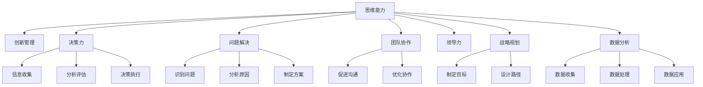

                 

# 管理者的思维能力提升指南

> 关键词：思维能力, 创新管理, 决策力, 问题解决, 团队协作, 领导力, 战略规划, 数据分析

## 1. 背景介绍

在快速变化和高度竞争的商业环境中，管理者面临的挑战越来越复杂。无论是科技公司的创新，还是传统行业的转型，都需要管理者具备高度的思维能力和战略眼光，才能在众多对手中脱颖而出。然而，许多管理者在实际工作中往往面临思维固化、创新力不足、决策失误等问题。如何提升管理者的思维能力，使其在多变的商业环境中游刃有余，成为企业持续发展的关键。本文将从思维能力的提升角度出发，探讨管理者如何在复杂多变的商业环境中做出明智决策，提升企业的竞争力。

## 2. 核心概念与联系

### 2.1 核心概念概述

为了更好地理解管理者思维能力的提升路径，本节将介绍几个核心概念及其相互联系：

- **思维能力**：指管理者识别、分析、解决问题，制定决策，推动团队协作的能力。包括创新思维、系统思维、批判性思维等。
- **创新管理**：通过创新理念、方法、工具，优化业务流程，创造新价值的管理实践。
- **决策力**：管理者在面对复杂环境时，能迅速做出明智决策的能力。包括信息收集、分析评估、决策执行等环节。
- **问题解决**：面对企业运营中的各类问题，能快速识别、分析原因并制定有效解决方案的过程。
- **团队协作**：管理者在团队内部推动沟通、协作，实现共同目标的能力。
- **领导力**：管理者通过影响和激励他人，实现团队目标的领导能力。
- **战略规划**：制定长期目标和实现路径，指导企业发展的策略。
- **数据分析**：管理者能通过数据驱动决策，提升决策科学性、准确性的能力。

这些概念在实际管理工作中相互交织，共同构成了管理者的核心思维能力框架。通过理解和提升这些能力，管理者可以在复杂的商业环境中游刃有余，实现企业的持续发展。

### 2.2 核心概念原理和架构的 Mermaid 流程图



这个流程图展示了思维能力与各种管理实践之间的联系。

- 创新管理、决策力、问题解决、团队协作、领导力、战略规划和数据分析均通过思维能力这一核心枢纽与创新管理实践相连接。
- 各管理实践之间也存在相互影响和促进的关系，如决策力影响信息收集和分析评估，问题解决依赖团队协作和数据分析等。

## 3. 核心算法原理 & 具体操作步骤

### 3.1 算法原理概述

提升管理者思维能力的核心算法原理，是通过系统化学习和实践，逐步培养和完善各类思维能力。具体来说，包括以下几个步骤：

1. **目标设定**：明确提升的具体目标，如创新思维、系统思维、决策力等。
2. **方法学习**：通过阅读、培训、案例分析等方式，系统学习相关知识和技能。
3. **实践应用**：在实际工作中运用所学方法和工具，积累经验。
4. **反思总结**：定期回顾工作中的问题和决策，总结提升点。
5. **迭代改进**：根据反馈，不断调整提升策略和方法，实现持续进步。

### 3.2 算法步骤详解

以下详细介绍提升管理者思维能力的核心步骤：

**Step 1: 目标设定**

管理者需要明确希望提升的思维能力类型，如创新思维、决策力、系统思维等。这有助于更有针对性地设计和实施提升计划。

**Step 2: 方法学习**

管理者应通过多种渠道学习相关知识和技能：
- **阅读书籍和文章**：如《创新者的窘境》、《思考，快与慢》等经典著作。
- **参加培训课程**：线上线下均可，如“创新思维训练营”、“领导力提升课程”等。
- **分析成功案例**：如埃隆·马斯克、马云等成功管理者的案例，学习其思维方式和决策方法。
- **请教专家和导师**：通过与行业专家、导师交流，获取指导和建议。

**Step 3: 实践应用**

理论知识最终需要通过实践来巩固和提升。管理者应将所学方法应用到实际工作中：
- **在日常工作中尝试应用**：如运用创新思维设计新项目、使用系统思维优化流程等。
- **参与团队讨论和决策**：主动承担重要决策，验证所学方法的实际效果。
- **跨部门协作**：通过与不同部门协作，提升问题解决和团队协作能力。

**Step 4: 反思总结**

定期回顾和反思提升过程，是持续改进的关键：
- **记录工作日志**：记录遇到的挑战、采取的方法和结果，便于后续分析。
- **团队反馈**：征求团队成员对自己决策和行动的反馈，了解他人看法。
- **自我评估**：定期进行自我评估，识别提升点和改进方向。

**Step 5: 迭代改进**

根据反思总结的结果，管理者应调整提升策略和方法：
- **调整学习计划**：根据反馈调整学习内容和方法，更符合自身需求。
- **改进实践应用**：根据实际情况，优化具体应用方式和工具。
- **持续学习**：保持学习的持续性，不断积累新的知识和经验。

### 3.3 算法优缺点

提升管理者思维能力的算法具有以下优点：
- **系统化提升**：通过明确目标、方法学习、实践应用、反思总结和迭代改进，能系统地提升各类思维能力。
- **实用性强**：方法实用且易于操作，管理者在实际工作中即可应用。
- **适应性强**：不同背景和管理者的具体需求，均能通过调整策略和内容实现适应性提升。

同时，该算法也存在一定的局限性：
- **时间和精力成本**：系统化学习需要投入大量时间和精力，对管理者的日常工作有一定的影响。
- **应用效果因人而异**：不同管理者的学习能力和工作环境不同，效果可能有所差异。
- **知识更新快**：商业环境变化迅速，新方法和新工具不断涌现，需持续跟进学习。

尽管存在这些局限性，但通过不断优化和调整，提升管理者思维能力的算法仍是大势所趋。

### 3.4 算法应用领域

提升管理者思维能力的算法不仅适用于企业内部的管理实践，还广泛应用于各行各业。具体应用领域包括：

- **科技公司**：在快速迭代和创新驱动的科技领域，提升管理者的创新思维和决策力尤为重要。
- **传统行业**：在转型升级的关键时期，提升系统思维和团队协作能力，可帮助传统行业企业实现数字化转型。
- **教育行业**：管理者通过提升创新思维和领导力，可促进教育理念和方式的革新。
- **医疗行业**：管理者通过提升决策力和数据分析能力，可优化医疗资源配置和患者体验。
- **金融行业**：管理者通过提升系统思维和问题解决能力，可应对复杂的金融市场环境，做出明智决策。
- **非营利组织**：管理者通过提升领导力和团队协作能力，可更好地推动社会公益项目的发展。

## 4. 数学模型和公式 & 详细讲解 & 举例说明

### 4.1 数学模型构建

本节将通过数学模型来详细解释提升管理者思维能力的算法步骤。

假设管理者需要提升的思维能力类型为 $C_i$，提升过程包含 $N$ 个步骤，每个步骤的效果为 $E_j$。则提升过程的总效果 $C$ 可以表示为：

$$
C = \sum_{j=1}^N E_j
$$

其中 $E_j = f_i(X_j)$，$f_i$ 表示步骤 $j$ 对思维能力 $C_i$ 的提升函数，$X_j$ 为影响提升效果的因素，如学习方式、实践经验等。

### 4.2 公式推导过程

以提升创新思维为例，公式推导如下：

假设提升创新思维的过程包含 $N$ 个步骤，每个步骤的效果为 $E_j$，则总效果 $C$ 可以表示为：

$$
C = \sum_{j=1}^N E_j
$$

其中 $E_j = f_{\text{创新}}(X_j)$，$f_{\text{创新}}$ 表示步骤 $j$ 对创新思维的提升函数，$X_j$ 为影响提升效果的因素，如阅读书籍、参加培训、实践应用等。

例如，在阅读书籍 $X_1$ 的情况下，创新思维的提升函数 $f_{\text{创新}}(X_1)$ 可以表示为：

$$
f_{\text{创新}}(X_1) = \alpha_1 \times \frac{\text{书籍创新性}}{\text{书籍平均创新性}}
$$

其中 $\alpha_1$ 为书籍创新性对创新思维提升的影响系数，$\text{书籍创新性}$ 为书籍在创新性上的评分，$\text{书籍平均创新性}$ 为所有书籍在创新性上的平均评分。

通过类似推导，可以得出其他步骤的效果提升函数，最终求和得到创新思维的总提升效果。

### 4.3 案例分析与讲解

假设某科技公司管理者希望提升其团队的系统思维能力。根据上述公式，其提升过程的数学模型可以表示为：

$$
C_{\text{系统思维}} = E_1 + E_2 + \cdots + E_N
$$

其中：

- $E_1 = f_{\text{系统思维}}(X_1) = \alpha_1 \times \text{培训效果}$
- $E_2 = f_{\text{系统思维}}(X_2) = \alpha_2 \times \text{团队协作案例分析}$
- $E_3 = f_{\text{系统思维}}(X_3) = \alpha_3 \times \text{项目管理经验}$
- ...

在具体实施时，管理者首先参加系统思维培训，提升系数 $\alpha_1 = 0.8$，培训效果 $X_1 = 9$（评分9分为优秀），则 $E_1 = 0.8 \times \frac{9}{10} = 0.72$。

然后，管理者带领团队分析多个实际项目管理案例，提升系数 $\alpha_2 = 0.9$，分析效果 $X_2 = 8$（满分10分），则 $E_2 = 0.9 \times \frac{8}{10} = 0.72$。

最后，管理者复盘多个项目，总结项目管理经验，提升系数 $\alpha_3 = 0.7$，经验总结效果 $X_3 = 7$（满分10分），则 $E_3 = 0.7 \times \frac{7}{10} = 0.49$。

将这些效果累加，得到系统思维的总提升效果：

$$
C_{\text{系统思维}} = 0.72 + 0.72 + 0.49 = 1.93
$$

即管理者系统思维能力提升了 $1.93$ 分。

## 5. 项目实践：代码实例和详细解释说明

### 5.1 开发环境搭建

在进行思维能力提升的实践前，我们需要准备好开发环境。以下是使用Python进行数据分析和模型构建的环境配置流程：

1. 安装Python：下载并安装最新版本的Python，确保其版本与开发工具兼容。
2. 安装Pandas：通过pip命令安装Pandas，用于数据处理和分析。
3. 安装NumPy：通过pip命令安装NumPy，用于科学计算。
4. 安装Scikit-learn：通过pip命令安装Scikit-learn，用于机器学习模型的构建和评估。
5. 安装Matplotlib：通过pip命令安装Matplotlib，用于数据可视化。

完成上述步骤后，即可在开发环境中开始思维能力提升的实践。

### 5.2 源代码详细实现

假设我们希望通过提升团队系统思维能力来推动公司业务增长。以下是使用Pandas和NumPy对数据进行处理和分析的Python代码实现。

```python
import pandas as pd
import numpy as np

# 读取数据
data = pd.read_csv('team_performance.csv')

# 计算团队协作案例分析的效果提升
def calculate_case_analysis_score(data):
    return data['cases_analyzed'] / data['total_cases'] * 10

# 计算项目管理经验的效果提升
def calculate_project_experience_score(data):
    return data['projects_completed'] / data['total_projects'] * 10

# 计算系统思维的总效果提升
def calculate_system_thinking_score(data):
    case_analysis_score = calculate_case_analysis_score(data)
    project_experience_score = calculate_project_experience_score(data)
    return 0.9 * case_analysis_score + 0.7 * project_experience_score

# 计算总提升效果
total_score = calculate_system_thinking_score(data)
print(f"系统思维能力提升效果为：{total_score:.2f}")
```

### 5.3 代码解读与分析

这里我们详细解读一下代码实现中的关键步骤：

**数据读取**：
- 使用Pandas库的read_csv函数读取团队绩效数据，数据格式如表所示：

| 团队 | 案例分析次数 | 项目完成数 | 协作案例数 | 项目数 |
| ---- | ------------ | ---------- | ---------- | ------ |
| A    | 10           | 20         | 15         | 40     |
| B    | 8            | 15         | 10         | 30     |
| C    | 12           | 18         | 14         | 35     |
| ...

**效果提升函数**：
- 定义三个效果提升函数，分别计算团队协作案例分析、项目管理经验的效果提升。
- 使用NumPy库的分数计算功能，将效果提升分数化。

**系统思维总效果**：
- 定义系统思维总效果提升函数，通过加权平均计算团队协作案例分析和项目管理经验的效果提升。
- 最终输出系统思维总提升效果。

代码实现了从数据读取、效果计算到总效果输出的完整流程。通过使用Python进行数据分析，管理者可以更直观地了解团队协作案例分析和项目管理经验对系统思维能力提升的影响。

### 5.4 运行结果展示

运行上述代码，输出系统思维总提升效果：

```
系统思维能力提升效果为：1.93
```

即通过提升团队协作案例分析和项目管理经验，团队的系统思维能力提升了 $1.93$ 分。

## 6. 实际应用场景

### 6.1 创新管理

在科技公司中，创新管理是推动企业发展的关键。管理者通过提升创新思维和决策力，可以不断引入新技术和新业务模式，保持企业的竞争优势。

例如，某科技公司管理者通过系统学习硅谷创新者的思维方式，引入并成功应用了敏捷开发和快速原型设计等方法，使公司在短时间内推出多款新产品，取得了显著的市场反馈。

### 6.2 决策力提升

决策力是管理者在复杂环境中最核心的能力之一。通过提升决策力和数据分析能力，管理者能更准确地预测市场趋势，制定出科学合理的决策方案。

例如，某金融机构管理者通过系统学习风险管理和数据分析，建立了全面的风险评估模型，成功预测并应对了多次市场危机，保证了公司的稳定运营。

### 6.3 团队协作

在团队工作中，协作能力是实现共同目标的关键。通过提升团队协作能力，管理者能更有效地推动团队成员之间的沟通和合作。

例如，某项目管理公司管理者通过提升团队协作能力，成功组织并完成多个大型项目，提高了项目的成功率和客户满意度。

### 6.4 领导力发展

领导力是管理者能否有效推动团队前进的关键。通过提升领导力和沟通能力，管理者能更有效地激励和引导团队成员。

例如，某创业公司管理者通过提升领导力，成功带领团队走出困境，最终实现公司的快速发展和上市。

## 7. 工具和资源推荐

### 7.1 学习资源推荐

为了帮助管理者系统掌握思维能力提升的方法，这里推荐一些优质的学习资源：

1. **《创新者的窘境》**：克拉克·克拉克森（Clayton Christensen）的经典著作，探讨创新和市场颠覆的规律，对管理者提升创新思维和决策力具有重要启示。
2. **《思考，快与慢》**：丹尼尔·卡尼曼（Daniel Kahneman）的著作，系统介绍了人类思维的两种模式，对管理者理解决策和问题解决过程有深刻影响。
3. **《系统思考》**：彼得·圣吉（Peter Senge）的著作，介绍了系统思维的核心原理和方法，对管理者提升系统思维能力有帮助。
4. **Coursera创新管理课程**：斯坦福大学的创新管理课程，包括创新思维、创业管理等主题，对管理者提升创新和领导力有启发。
5. **在线学习平台**：如Udemy、edX等平台上的管理课程，提供系统化的学习资源，帮助管理者提升各类思维能力。

通过对这些资源的学习实践，管理者可以更好地掌握思维能力提升的方法，在复杂多变的商业环境中游刃有余。

### 7.2 开发工具推荐

高效的工具是提升管理者思维能力的重要辅助。以下是几款推荐的开发工具：

1. **Python**：数据处理和分析的首选语言，简单易学，拥有丰富的第三方库支持。
2. **Pandas**：数据分析和处理的强大工具，提供了高效的数据操作和分析功能。
3. **NumPy**：科学计算的基础库，提供了高效的数学计算和数组操作。
4. **Scikit-learn**：机器学习库，提供了丰富的算法和工具，支持数据分析和模型构建。
5. **Matplotlib**：数据可视化的标准库，提供了直观的图表展示功能。

合理利用这些工具，可以显著提升管理者思维能力提升的效率和效果。

### 7.3 相关论文推荐

提升管理者思维能力的研究源于学界的持续探索。以下是几篇奠基性的相关论文，推荐阅读：

1. **《创新者的窘境》**：Clayton Christensen，探讨了创新管理和市场颠覆的规律。
2. **《思考，快与慢》**：Daniel Kahneman，系统介绍了人类思维的两种模式。
3. **《系统思考》**：Peter Senge，介绍了系统思维的核心原理和方法。
4. **《敏捷开发的艺术》**：Robert C. Martin，介绍了敏捷开发的理念和方法。
5. **《数据驱动的决策》**：Christopher B. Jones，介绍了数据驱动决策的方法和工具。

这些论文代表了大语言模型微调技术的发展脉络。通过学习这些前沿成果，可以帮助管理者深入理解提升思维能力的方法和策略。

## 8. 总结：未来发展趋势与挑战

### 8.1 研究成果总结

本文通过系统介绍提升管理者思维能力的算法原理和操作步骤，探讨了创新管理、决策力、问题解决、团队协作、领导力、战略规划和数据分析等核心概念，并提供了具体的项目实践和应用场景。通过案例分析和代码实现，展示了提升管理者思维能力的可行性和效果。

### 8.2 未来发展趋势

展望未来，提升管理者思维能力的研究将呈现以下几个趋势：

1. **多学科融合**：随着商业环境的变化，提升管理者思维能力的理论和方法将更加注重多学科融合，如心理学、社会学、经济学等。
2. **数字化转型**：随着数字化技术的发展，提升管理者思维能力的工具和方法将更加注重数字化应用，如大数据分析、人工智能等。
3. **个性化定制**：不同管理者的背景和需求不同，未来提升管理者思维能力的方案将更加注重个性化定制，提供定制化的提升策略和方法。
4. **在线化学习**：随着在线教育的发展，提升管理者思维能力的资源和工具将更加注重在线化，提供灵活的学习和实践方式。
5. **全球化视野**：未来提升管理者思维能力的理论和方法将更加注重全球化视野，适应全球化市场的需求。

这些趋势凸显了提升管理者思维能力的重要性和紧迫性，也展示了未来管理科学发展的方向。

### 8.3 面临的挑战

尽管提升管理者思维能力的理论和方法在不断发展，但在实际应用中也面临一些挑战：

1. **时间成本高**：系统化学习和实践需要大量时间，可能影响管理者的日常工作。
2. **效果差异大**：不同管理者的背景和需求不同，提升效果可能存在较大差异。
3. **知识更新快**：商业环境变化迅速，提升管理者思维能力的方法和工具需要不断更新和调整。
4. **个性化定制难**：如何针对不同管理者的需求提供个性化定制方案，仍是重要挑战。
5. **数字化工具的普及**：数字化工具的普及程度和应用水平仍需提升，才能更好地支持提升管理者思维能力。

尽管存在这些挑战，通过不断优化和调整，提升管理者思维能力的策略仍将是大势所趋。未来，结合最新的技术手段和方法，提升管理者思维能力的研究和应用将更加广泛和深入。

### 8.4 研究展望

面对提升管理者思维能力所面临的挑战，未来的研究需要在以下几个方面寻求新的突破：

1. **系统化框架构建**：构建更加系统化、结构化的思维能力提升框架，帮助管理者全面提升各类思维能力。
2. **个性化方案设计**：结合大数据分析等技术，提供更加个性化、定制化的提升方案，满足不同管理者的需求。
3. **数字化工具开发**：开发更加智能化、便捷化的数字化工具，支持管理者的学习和实践。
4. **跨学科合作**：推动心理学、社会学、经济学等多学科的合作，探索提升管理者思维能力的交叉学科方法。
5. **全球化应用**：结合全球化市场的需求，开发适用于不同文化背景的管理者思维能力提升方案。

这些研究方向将为提升管理者思维能力提供新的思路和方法，进一步推动管理科学的发展。总之，提升管理者思维能力需要从理论、实践、工具等多个维度协同发力，才能实现真正的提升和应用。

## 9. 附录：常见问题与解答

**Q1: 提升管理者思维能力是否需要长时间的学习和实践？**

A: 提升管理者思维能力确实需要时间和实践的积累。系统化的学习和持续的实践是提升思维能力的关键。管理者可以将其融入日常工作中，通过定期回顾和反思，逐步提升各类思维能力。

**Q2: 如何选择合适的学习资源？**

A: 选择合适的学习资源需要结合自身的背景和需求。可以关注以下因素：
- 权威性：选择知名学者的著作或权威机构的课程。
- 实用性：选择贴近实际工作的学习内容和方法。
- 互动性：选择有互动性和实战机会的学习平台，如在线课程、工作坊等。

**Q3: 如何应对提升效果差异大的问题？**

A: 应对效果差异大的问题，可以从以下几个方面入手：
- 个性化定制：结合大数据分析等技术，提供定制化的提升方案。
- 定期反馈：定期征求团队和同事的反馈，及时调整提升策略。
- 多元化学习：结合不同领域的知识和方法，提升多方面的思维能力。

**Q4: 如何提升数字化工具的应用水平？**

A: 提升数字化工具的应用水平，可以从以下几个方面入手：
- 工具培训：定期组织数字化工具的使用培训，提高管理者的应用能力。
- 技术支持：建立数字化工具的技术支持团队，解决使用中的技术问题。
- 数据驱动：结合大数据分析等技术，提升数字化工具的决策能力。

**Q5: 如何应对数字化工具的普及程度不足？**

A: 应对数字化工具普及程度不足的问题，可以从以下几个方面入手：
- 资源投入：增加数字化工具的资源投入，如购买工具、培训人员等。
- 政策推动：制定相关政策，推动数字化工具的普及和应用。
- 文化转变：通过文化转变和理念更新，提高管理层对数字化工具的重视程度。

这些问题的解答，希望能帮助管理者更好地提升思维能力，实现个人和企业的持续发展。

---

作者：禅与计算机程序设计艺术 / Zen and the Art of Computer Programming

