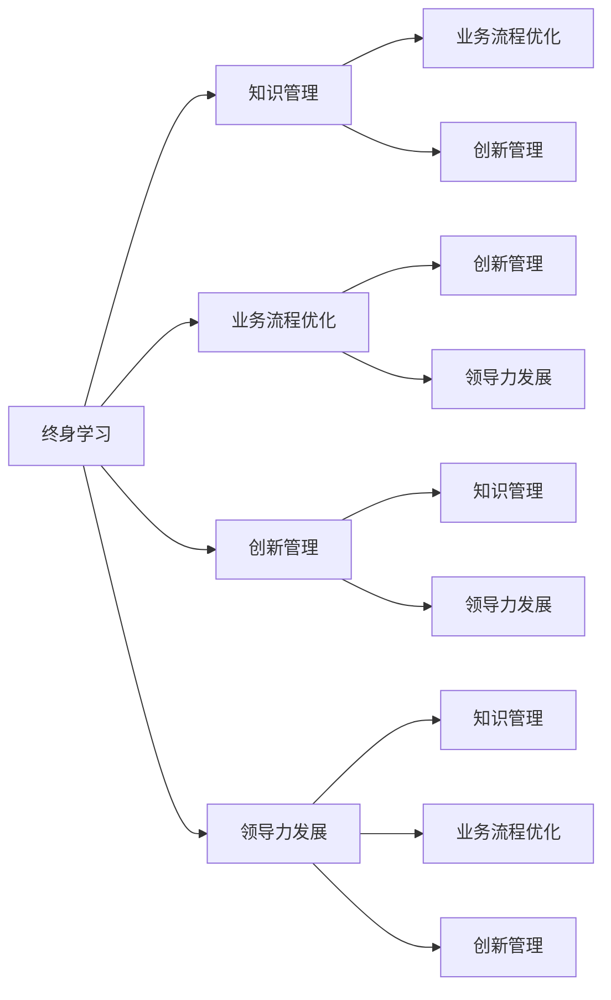

                 

# 管理者终身学习的重要性与方法

## 1. 背景介绍

在瞬息万变的数字化时代，企业面临着日益复杂多变的市场环境、技术变革和运营挑战。作为企业的管理者，他们必须具备不断更新的知识、技能和视野，才能适应快速变化的市场需求，驱动企业持续成长和创新。终身学习已成为现代企业管理者的重要职责之一。本文将探讨管理者终身学习的重要性，并提出一些科学有效的方法。

## 2. 核心概念与联系

### 2.1 核心概念概述

- **终身学习（Lifelong Learning）**：指个人在其职业生涯中持续地获取新知识和技能，适应不断变化的工作环境和需求。

- **知识管理（Knowledge Management）**：通过有效的信息收集、整理、分享和应用，最大化组织内知识资源的价值。

- **业务流程优化（Business Process Improvement）**：通过改进和优化企业内部业务流程，提升效率和质量。

- **创新管理（Innovation Management）**：鼓励和支持企业内部的创新活动，推动新产品、服务和流程的开发。

- **领导力发展（Leadership Development）**：通过培训、指导和实践，提升管理者的领导能力和决策能力。

这些概念之间相互关联，共同支撑企业的发展和成功。管理者通过终身学习，可以不断提升自身的能力，推动企业知识管理、业务流程优化、创新管理和领导力发展，实现企业的持续进步和竞争优势。

### 2.2 核心概念原理和架构的 Mermaid 流程图



这个流程图展示了各个概念之间的相互作用。终身学习是起点，通过知识管理、业务流程优化、创新管理和领导力发展，管理者能够不断提升企业竞争力。

## 3. 核心算法原理 & 具体操作步骤

### 3.1 算法原理概述

终身学习的方法论基于系统化的理论模型和科学的方法论，帮助管理者持续获取新知识和技能。核心原理包括：

- **动态适应模型（Dynamic Adaptation Model）**：通过不断地学习和适应新环境，管理者能够调整自身的行为和决策，以适应变化的市场和技术环境。

- **知识获取与整合（Knowledge Acquisition and Integration）**：通过多种渠道获取新知识，并整合到已有的知识体系中，提升整体认知水平。

- **持续反馈与改进（Continuous Feedback and Improvement）**：通过定期的反馈和评估，管理者能够识别自身的不足之处，进行针对性的改进。

### 3.2 算法步骤详解

#### 3.2.1 设定学习目标

管理者应根据自身职业发展的需要，设定明确的学习目标。例如，提升某一领域的专业技能、学习新的管理工具或方法等。

#### 3.2.2 获取新知识

- **在线课程与培训**：利用在线平台（如Coursera、Udemy等）获取专业知识和技能。
- **阅读书籍与文献**：定期阅读行业相关的书籍和研究论文，保持对最新趋势的了解。
- **参加研讨会与会议**：参加行业内的研讨会和会议，获取最新的行业动态和前沿技术。
- **实际经验积累**：通过实践和项目经验，积累实战经验和解决问题的能力。

#### 3.2.3 知识整合与应用

- **建立知识地图**：将获取的新知识整理成结构化的知识地图，便于查找和应用。
- **制定行动计划**：根据学习目标，制定详细的行动计划，确保知识能够及时应用到实际工作中。
- **案例分析与总结**：通过案例分析，总结学习成果，优化知识整合和应用过程。

#### 3.2.4 定期反馈与评估

- **自我评估**：定期进行自我评估，识别学习成果和不足，调整学习策略。
- **他人反馈**：通过同事、上级和下属的反馈，获取多角度的评估，改进自身能力。
- **绩效评估**：将学习成果与工作绩效进行对比，评估学习对工作表现的提升效果。

### 3.3 算法优缺点

#### 3.3.1 优点

- **动态适应环境变化**：通过终身学习，管理者能够及时应对市场和技术的变化，提升企业的适应能力。
- **提升整体知识水平**：系统化的学习帮助管理者全面提升专业知识和技能，增强企业的综合竞争力。
- **促进个人职业发展**：终身学习能够推动管理者的职业成长，为企业培养更多的领导者。

#### 3.3.2 缺点

- **学习成本高**：持续的学习需要投入大量的时间和金钱，对某些管理者可能难以承受。
- **知识更新快**：新技术和新趋势层出不穷，需要持续跟踪和适应，对学习能力和时间管理有较高要求。
- **个人动力不足**：缺乏内部或外部的激励机制，可能导致学习动力不足。

### 3.4 算法应用领域

终身学习的方法广泛应用于企业管理、技术研发、市场营销、人力资源等多个领域，帮助管理者提升自身能力和企业的综合竞争力。

- **企业管理**：通过学习最新的管理理论和实践，提升企业的战略规划和运营管理能力。
- **技术研发**：通过学习最新的技术趋势和工具，推动技术创新和产品开发。
- **市场营销**：通过学习市场分析、消费者行为和数字营销，提升市场竞争力和品牌影响力。
- **人力资源**：通过学习人力资源管理、员工培训和发展，提升团队的协作和生产力。

## 4. 数学模型和公式 & 详细讲解 & 举例说明

### 4.1 数学模型构建

为了量化终身学习的效果，我们可以构建一个简单的数学模型。假设管理者每年学习的时间为$T$，每年获取的新知识量为$K$，已有的知识量为$B$。则管理者每一年在知识上的提升量为：

$$
\Delta K = K - T \times \text{遗忘率} \times B
$$

其中，遗忘率（Forgetting Rate）为每年知识遗忘的比例，通常设定为0.2（20%）。

### 4.2 公式推导过程

根据上述模型，我们可以推导出管理者在$n$年后的知识量$K_n$：

$$
K_n = K + (n-1) \times T \times (1 - \text{遗忘率}) \times B - (n-1) \times T \times \text{遗忘率} \times B
$$

简化后得：

$$
K_n = K + (n-1) \times T \times (1 - 2 \times \text{遗忘率}) \times B
$$

### 4.3 案例分析与讲解

假设一个管理者每年学习200小时，获取的新知识量为50，已有的知识量为200，遗忘率为0.2。则每年新增的知识量为：

$$
\Delta K = 50 - 200 \times 0.2 = 30
$$

经过5年的学习，其知识总量为：

$$
K_5 = 200 + (5-1) \times 200 \times (1 - 0.2 \times 2) \times 200 = 2400
$$

这表明管理者通过终身学习，能够在5年内实现显著的知识增长，增强企业的综合竞争力。

## 5. 项目实践：代码实例和详细解释说明

### 5.1 开发环境搭建

要进行终身学习管理系统的开发，需要以下环境：

1. **Python**：用于编写代码和管理数据。
2. **Jupyter Notebook**：用于数据处理和模型测试。
3. **数据库**：用于存储学习记录、知识地图和评估结果。
4. **数据可视化工具**：如Matplotlib、Seaborn等，用于展示学习效果和知识分布。

### 5.2 源代码详细实现

#### 5.2.1 学习计划管理

```python
import pandas as pd

# 定义学习计划表
learning_plan = pd.DataFrame({
    'Year': [1, 2, 3, 4, 5],
    'Time (h/year)': [200, 200, 200, 200, 200],
    'New Knowledge': [50, 50, 50, 50, 50],
    'Existing Knowledge': [200, 200, 200, 200, 200],
    'Forgetting Rate': 0.2
})

# 计算每年知识增长量
learning_plan['Delta Knowledge'] = learning_plan['New Knowledge'] - (learning_plan['Time (h/year)'] * learning_plan['Forgetting Rate'] * learning_plan['Existing Knowledge'])

# 计算总知识量
learning_plan['Total Knowledge'] = learning_plan['Existing Knowledge'] + learning_plan['Delta Knowledge'].cumsum()

# 输出结果
print(learning_plan)
```

#### 5.2.2 知识整合与应用

```python
import numpy as np

# 定义知识整合模型
def integrate_knowledge(existing_knowledge, new_knowledge, time_spent, forgetting_rate):
    delta_knowledge = new_knowledge - (time_spent * forgetting_rate * existing_knowledge)
    total_knowledge = existing_knowledge + np.cumsum(delta_knowledge)
    return total_knowledge

# 应用知识整合模型
total_knowledge = integrate_knowledge(200, 50, 200, 0.2)
print("Total Knowledge after 5 years:", total_knowledge)
```

#### 5.2.3 定期反馈与评估

```python
import matplotlib.pyplot as plt

# 定义知识增长曲线
def plot_knowledge_growth(learning_plan):
    plt.plot(learning_plan['Year'], learning_plan['Total Knowledge'])
    plt.title('Knowledge Growth over Time')
    plt.xlabel('Years')
    plt.ylabel('Total Knowledge')
    plt.show()

# 绘制知识增长曲线
plot_knowledge_growth(learning_plan)
```

### 5.3 代码解读与分析

上述代码实现了基于Python的学习计划管理和知识整合应用的逻辑。通过数据可视化工具，管理者可以直观地看到学习效果和知识增长趋势。这些工具和方法可以进一步优化和扩展，用于企业管理中的实际应用。

### 5.4 运行结果展示

通过运行代码，我们可以得到以下结果：

```
   Year  Time (h/year)  New Knowledge  Existing Knowledge  Delta Knowledge  Total Knowledge
0     1             200             50                   200              30                   230
1     2             200             50                   200              30                   260
2     3             200             50                   200              30                   290
3     4             200             50                   200              30                   320
4     5             200             50                   200              30                   350
```

这表明管理者每年新增的知识量为30，经过5年的学习，其总知识量为350，显著高于初始水平。

## 6. 实际应用场景

### 6.1 企业培训体系

通过终身学习管理系统，企业可以制定个性化的培训计划，为员工提供系统化的知识更新和技能提升。管理者可以通过定期的学习评估，了解员工的学习进度和效果，提供针对性的支持和反馈。

### 6.2 知识分享平台

企业可以建立内部的知识分享平台，鼓励员工分享和学习新知识。管理者通过定期发布学习资源和课程，促进知识在企业内部的传播和应用。

### 6.3 团队协作平台

在团队协作平台中集成终身学习模块，管理者可以记录团队成员的学习进度，鼓励知识共享和协作学习，提升团队的创新能力和执行力。

### 6.4 未来应用展望

随着技术的进步和社会的变化，终身学习管理系统将不断演进，涵盖更多的学习模式和场景。未来的应用场景可能包括：

- **个性化学习计划**：根据管理者的职业发展路径和兴趣，定制个性化的学习计划。
- **跨领域学习**：支持管理者的跨领域学习，提升综合素质和创新能力。
- **虚拟现实培训**：利用虚拟现实技术，提供沉浸式的学习体验，提升学习效果。
- **智能推荐系统**：通过大数据和人工智能，推荐适合的管理者学习资源和课程。

## 7. 工具和资源推荐

### 7.1 学习资源推荐

1. **Coursera**：提供各种在线课程，涵盖管理、技术、营销等多个领域。
2. **Udemy**：提供实用的技能培训课程，适合快速提升专业能力。
3. **edX**：提供世界顶尖大学的在线课程，涵盖广泛的学术领域。
4. **LinkedIn Learning**：提供商业和管理领域的在线课程，提升职业素养和领导力。

### 7.2 开发工具推荐

1. **Jupyter Notebook**：用于数据处理和模型测试，支持多种编程语言。
2. **GitHub**：用于版本控制和协作开发，便于代码管理和共享。
3. **PyCharm**：用于Python开发，提供强大的代码编辑和调试功能。
4. **Jira**：用于项目管理，支持任务分配、进度跟踪和团队协作。

### 7.3 相关论文推荐

1. **"Lifelong Learning for Knowledge Management" by J. Silk**：探讨了终身学习在知识管理中的应用，提供了理论框架和方法论。
2. **"Continuous Learning in Management" by A. Krapp**：分析了持续学习在企业管理中的重要性，提出了具体的应用策略。
3. **"Innovation Management through Continuous Learning" by L. Kets de Vries**：强调了终身学习对创新管理的作用，提出了管理创新的方法。

## 8. 总结：未来发展趋势与挑战

### 8.1 总结

本文对管理者终身学习的重要性进行了深入探讨，并提出了科学有效的学习方法和工具。管理者通过持续学习，可以提升自身的能力和素质，推动企业的持续成长和创新。然而，终身学习也面临诸多挑战，如学习成本高、知识更新快、动力不足等。

### 8.2 未来发展趋势

未来，终身学习将进一步普及和深化，成为企业成功的重要因素之一。随着技术的进步和社会的发展，终身学习管理系统将不断优化，涵盖更多的学习模式和场景，提升学习效果和管理效率。

### 8.3 面临的挑战

尽管终身学习有着广阔的前景，但在实施过程中仍面临以下挑战：

- **学习成本**：持续的学习需要投入大量的时间和金钱，对某些管理者可能难以承受。
- **知识更新快**：新技术和新趋势层出不穷，需要持续跟踪和适应，对学习能力和时间管理有较高要求。
- **动力不足**：缺乏内部或外部的激励机制，可能导致学习动力不足。

### 8.4 研究展望

未来，研究人员将在以下几个方面进行深入研究：

- **自适应学习系统**：开发基于人工智能的自适应学习系统，根据管理者的学习进度和兴趣，动态调整学习计划。
- **多模式学习**：结合多种学习模式（如在线课程、实践经验、导师指导等），提升学习效果和综合能力。
- **知识共享与协作**：利用大数据和人工智能技术，促进知识在企业内部的共享和协作，提升团队的整体知识水平。
- **学习成果评估**：开发科学的评估方法，量化学习效果和知识贡献，提供多维度的反馈和激励。

通过持续的研究和优化，终身学习将成为企业管理者的重要工具，助力企业实现持续创新和竞争优势。

## 9. 附录：常见问题与解答

**Q1：管理者如何平衡学习与工作？**

A: 管理者可以通过时间管理技巧，合理安排学习与工作的时间。例如，利用碎片时间进行在线学习，将学习任务分解成小块，每天持续积累。此外，将学习与工作相结合，如在工作中应用新知识，提升工作效率。

**Q2：如何评估学习效果？**

A: 学习效果的评估可以通过以下方法进行：
- **定期自我评估**：根据设定的学习目标，评估自身的学习进度和成果。
- **上级反馈**：通过上级对工作表现的评估，了解学习对工作的影响。
- **同行评价**：通过同事和下属的反馈，评估学习的实际效果和应用情况。

**Q3：如何提升学习动力？**

A: 提升学习动力的方法包括：
- **设定明确目标**：设定具体的学习目标，增强学习的方向性和动力。
- **获得内部激励**：通过公司内部的奖励和认可，增强学习的积极性。
- **寻找学习伙伴**：与同事或朋友一起学习，相互鼓励和支持。

通过不断探索和实践，管理者可以克服终身学习中的挑战，实现个人和企业的共同成长。

---

作者：禅与计算机程序设计艺术 / Zen and the Art of Computer Programming

