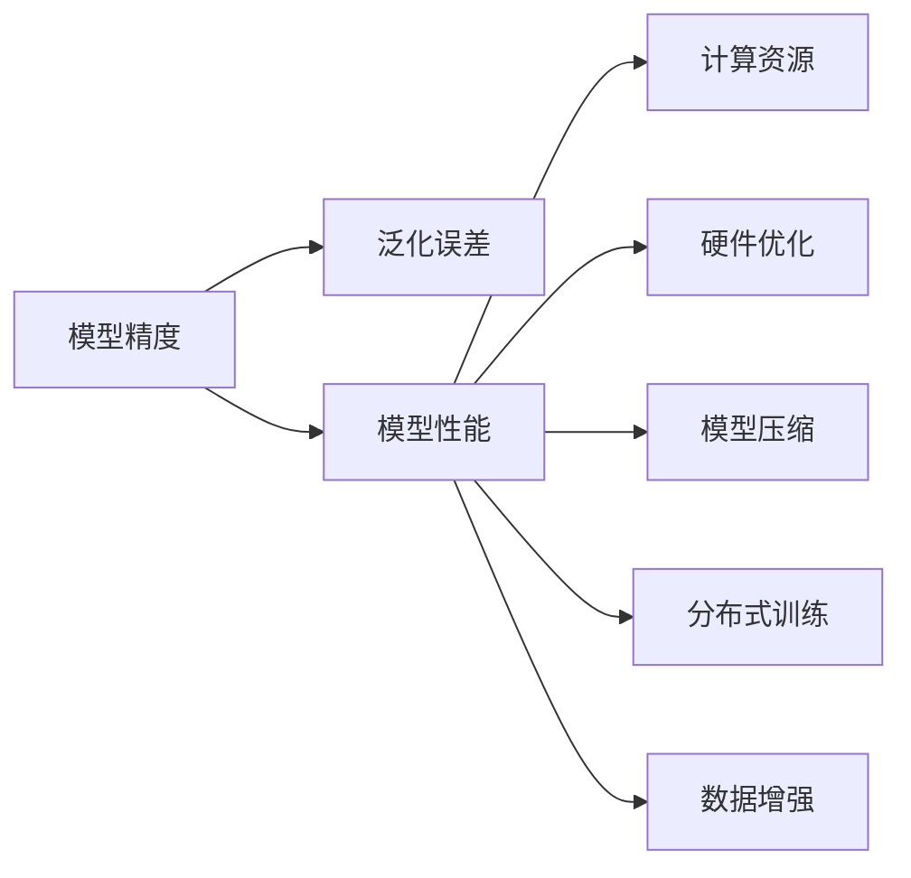

                 

# 精度与性能的权衡：AI模型训练的艺术

> 关键词：
- 模型精度
- 模型性能
- 训练策略
- 泛化误差
- 计算资源
- 硬件优化
- 模型压缩
- 分布式训练
- 数据增强

## 1. 背景介绍

### 1.1 问题由来
在当今数据驱动的时代，深度学习模型已经成为了众多领域中的核心技术。从图像识别、语音识别到自然语言处理、推荐系统，深度学习模型在各行各业中大放异彩，为数据科学带来了革命性的变化。然而，构建一个高性能、高精度的AI模型并不是一件易事，尤其是当模型规模越来越大，数据量越来越多，训练资源越来越复杂时。如何在精度与性能之间找到最优的平衡点，成为了每一位AI开发者所面临的挑战。

### 1.2 问题核心关键点
模型训练的核心在于如何平衡模型的精度和性能。一个高性能的AI模型不仅需要具备较高的预测精度，还需要在训练和推理过程中具备较快的速度和较低的内存占用。而这种平衡通常需要在模型结构、训练策略、硬件优化等方面进行综合考虑。以下将详细探讨如何在大规模深度学习模型的训练中，平衡模型精度和性能的问题。

### 1.3 问题研究意义
掌握模型训练的精确与性能的权衡，对于推动深度学习技术在各个行业中的应用，提高AI系统的可扩展性和可部署性具有重要意义。它不仅有助于优化模型的训练过程，提升模型的精度，还能在实际应用中提高系统的响应速度，降低资源消耗，提升用户体验。同时，对这一问题的深入研究，还能促进算法和架构设计的创新，推动整个深度学习领域的发展。

## 2. 核心概念与联系

### 2.1 核心概念概述

在探索模型训练的精确与性能的权衡问题时，我们首先要明确几个关键概念：

- **模型精度**：指模型在测试集上的预测准确率。通常使用分类误差率、回归均方误差等指标来衡量。
- **模型性能**：指模型在训练和推理过程中所表现出的效率。通常使用模型训练速度、推理速度、内存占用等指标来衡量。
- **泛化误差**：指模型在新数据上的预测误差。泛化误差越低，模型的泛化能力越强。
- **计算资源**：指训练深度学习模型所需的硬件设备和算力。通常包括CPU、GPU、TPU等计算资源。
- **硬件优化**：指通过硬件设备的优化，提升模型的训练和推理效率。
- **模型压缩**：指通过降低模型复杂度，减小模型参数量，优化模型的空间占用。
- **分布式训练**：指通过多台计算设备并行训练，加速模型训练过程。
- **数据增强**：指通过变换数据输入，扩充训练集，提高模型的泛化能力。

这些概念之间存在着紧密的联系，一个性能良好的AI模型需要在这几个维度上综合考虑，才能达到最优的权衡。

### 2.2 核心概念原理和架构的 Mermaid 流程图



这个流程图展示了模型精度与性能的权衡关系。通过合理配置计算资源、优化硬件、压缩模型、并行训练、增强数据，可以在保证一定精度的前提下，提高模型的性能。同时，通过优化泛化误差，可以进一步提升模型的实际应用效果。

## 3. 核心算法原理 & 具体操作步骤
### 3.1 算法原理概述

模型训练的精确与性能的权衡问题，本质上是如何在有限的计算资源下，最大化模型的预测准确率。这一过程通常需要在大规模数据集上进行，并采用各种优化算法进行模型训练。以下将详细介绍如何通过模型选择、参数调整、训练策略等手段，在精度与性能之间找到平衡点。

### 3.2 算法步骤详解

在大规模深度学习模型的训练过程中，通常包括以下几个关键步骤：

**Step 1: 选择合适的模型结构**
- 根据任务类型，选择适合的基础模型结构，如卷积神经网络(CNN)、循环神经网络(RNN)、Transformer等。
- 在预定义的模型结构上，设计适当的卷积核大小、层数、神经元数量等超参数。

**Step 2: 设置训练参数**
- 确定学习率、批量大小、迭代次数等基本训练参数。
- 选择合适的优化算法及其参数，如SGD、Adam、RMSprop等。

**Step 3: 应用数据增强**
- 对训练数据进行扩充，如随机裁剪、翻转、旋转、加噪声等。
- 使用数据增强工具如 Albumentations、AugMix 等，提高模型的泛化能力。

**Step 4: 实现硬件优化**
- 利用GPU、TPU等高性能计算设备，加速模型训练。
- 使用混合精度训练、张量核化等技术，减少内存占用。

**Step 5: 进行模型压缩**
- 应用知识蒸馏、剪枝、量化等方法，减小模型参数量。
- 使用蒸馏算法如 Distill、Knowledge Distillation 等，提升模型性能。

**Step 6: 执行分布式训练**
- 在多台计算设备上并行训练，加速模型训练。
- 使用分布式框架如 TensorFlow Distributed、PyTorch Distributed 等，提高训练效率。

**Step 7: 监控训练进程**
- 实时监控模型的训练进度和性能指标，如损失函数、精度、梯度等。
- 使用可视化工具如 TensorBoard、Weights & Biases 等，监控训练状态。

**Step 8: 评估模型效果**
- 在验证集上评估模型的预测效果，选择最优的超参数组合。
- 进行交叉验证，避免模型过拟合。

通过以上步骤，可以有效地平衡模型精度和性能，构建高性能的AI模型。

### 3.3 算法优缺点

平衡模型精度与性能的算法通常具有以下优点：

- **高精度**：通过选择合适的模型结构和训练策略，能够获得较高的预测精度。
- **高效性**：通过硬件优化和分布式训练等技术，大幅提高模型训练和推理的速度。
- **可扩展性**：通过模型压缩和数据增强等方法，使模型能够更好地适应大规模数据集和复杂任务。

同时，这些算法也存在一些局限性：

- **资源消耗**：计算资源和硬件优化等方法，需要较高的成本投入。
- **模型复杂度**：模型压缩和蒸馏等方法可能会牺牲模型的某些特征，导致精度降低。
- **训练复杂度**：分布式训练等方法需要更复杂的配置和调试。

## 4. 数学模型和公式 & 详细讲解 & 举例说明

### 4.1 数学模型构建

在深度学习模型训练过程中，通常使用损失函数来衡量模型的预测误差。常见的损失函数包括交叉熵损失、均方误差损失等。以二分类任务为例，假设模型 $M$ 在输入 $x$ 上的输出为 $\hat{y}=M(x) \in [0,1]$，表示样本属于正类的概率。真实标签 $y \in \{0,1\}$。则二分类交叉熵损失函数定义为：

$$
\ell(M(x),y) = -[y\log \hat{y} + (1-y)\log (1-\hat{y})]
$$

将其代入经验风险公式，得：

$$
\mathcal{L}(\theta) = -\frac{1}{N}\sum_{i=1}^N [y_i\log M(x_i)+(1-y_i)\log(1-M(x_i))]
$$

其中 $\theta$ 为模型参数。

### 4.2 公式推导过程

在深度学习模型训练过程中，常用的优化算法包括梯度下降、Adam、RMSprop等。以梯度下降算法为例，其更新公式为：

$$
\theta \leftarrow \theta - \eta \nabla_{\theta}\mathcal{L}(\theta)
$$

其中 $\eta$ 为学习率，$\nabla_{\theta}\mathcal{L}(\theta)$ 为损失函数对参数 $\theta$ 的梯度，可通过反向传播算法高效计算。

在实际训练过程中，为了平衡模型精度和性能，通常会使用以下策略：

- **学习率调度**：在训练初期使用较大的学习率，逐步降低学习率，以避免梯度消失或爆炸。
- **正则化**：通过L2正则化、Dropout等方法，避免过拟合，提高模型的泛化能力。
- **早停法**：在验证集上监控模型性能，一旦性能不再提升，立即停止训练，避免过拟合。

### 4.3 案例分析与讲解

以CIFAR-10数据集上的卷积神经网络(CNN)训练为例，分析如何平衡模型精度和性能。假设我们使用VGG16模型，设置批量大小为64，迭代次数为10轮，学习率为0.01。

```python
import torch
import torch.nn as nn
import torch.optim as optim
from torch.utils.data import DataLoader, Dataset

class CIFARDataset(Dataset):
    def __init__(self, data_dir):
        # 加载CIFAR-10数据集
        self.data_dir = data_dir
        self.train_data = ...
        self.test_data = ...

    def __len__(self):
        return len(self.train_data)

    def __getitem__(self, idx):
        # 返回指定索引的数据和标签
        ...

class CNNModel(nn.Module):
    def __init__(self):
        super(CNNModel, self).__init__()
        self.conv1 = nn.Conv2d(3, 64, kernel_size=3, stride=1, padding=1)
        self.pool = nn.MaxPool2d(kernel_size=2, stride=2)
        self.conv2 = nn.Conv2d(64, 128, kernel_size=3, stride=1, padding=1)
        self.pool2 = nn.MaxPool2d(kernel_size=2, stride=2)
        self.fc1 = nn.Linear(128 * 8 * 8, 1024)
        self.fc2 = nn.Linear(1024, 10)

    def forward(self, x):
        x = self.pool(torch.relu(self.conv1(x)))
        x = self.pool2(torch.relu(self.conv2(x)))
        x = x.view(x.size(0), -1)
        x = torch.relu(self.fc1(x))
        x = self.fc2(x)
        return x

model = CNNModel()
criterion = nn.CrossEntropyLoss()
optimizer = optim.Adam(model.parameters(), lr=0.01)

train_loader = DataLoader(CIFARDataset(train_dir), batch_size=64, shuffle=True)
test_loader = DataLoader(CIFARDataset(test_dir), batch_size=64, shuffle=False)

for epoch in range(10):
    model.train()
    for data, target in train_loader:
        optimizer.zero_grad()
        output = model(data)
        loss = criterion(output, target)
        loss.backward()
        optimizer.step()

    model.eval()
    with torch.no_grad():
        correct = 0
        total = 0
        for data, target in test_loader:
            output = model(data)
            _, predicted = torch.max(output.data, 1)
            total += target.size(0)
            correct += (predicted == target).sum().item()
        accuracy = 100 * correct / total
        print(f'Epoch {epoch+1}, accuracy: {accuracy:.2f}%')

```

在上述代码中，我们通过VGG16模型在CIFAR-10数据集上进行训练。通过调整模型结构和超参数，可以在保证较高精度的同时，提高训练速度和模型泛化能力。例如，使用较小的批量大小、较低的学习率、正则化和早停法等策略，可以平衡模型精度和性能。

## 5. 项目实践：代码实例和详细解释说明

### 5.1 开发环境搭建

在进行AI模型训练的精确与性能的权衡实践前，我们需要准备好开发环境。以下是使用Python进行PyTorch开发的环境配置流程：

1. 安装Anaconda：从官网下载并安装Anaconda，用于创建独立的Python环境。

2. 创建并激活虚拟环境：
```bash
conda create -n pytorch-env python=3.8 
conda activate pytorch-env
```

3. 安装PyTorch：根据CUDA版本，从官网获取对应的安装命令。例如：
```bash
conda install pytorch torchvision torchaudio cudatoolkit=11.1 -c pytorch -c conda-forge
```

4. 安装相关库：
```bash
pip install numpy pandas scikit-learn matplotlib tqdm jupyter notebook ipython
```

完成上述步骤后，即可在`pytorch-env`环境中开始模型训练的精确与性能的权衡实践。

### 5.2 源代码详细实现

下面我们以CIFAR-10数据集上的卷积神经网络(CNN)训练为例，给出使用PyTorch代码实现。

```python
import torch
import torch.nn as nn
import torch.optim as optim
from torch.utils.data import DataLoader, Dataset

class CIFARDataset(Dataset):
    def __init__(self, data_dir):
        # 加载CIFAR-10数据集
        self.data_dir = data_dir
        self.train_data = ...
        self.test_data = ...

    def __len__(self):
        return len(self.train_data)

    def __getitem__(self, idx):
        # 返回指定索引的数据和标签
        ...

class CNNModel(nn.Module):
    def __init__(self):
        super(CNNModel, self).__init__()
        self.conv1 = nn.Conv2d(3, 64, kernel_size=3, stride=1, padding=1)
        self.pool = nn.MaxPool2d(kernel_size=2, stride=2)
        self.conv2 = nn.Conv2d(64, 128, kernel_size=3, stride=1, padding=1)
        self.pool2 = nn.MaxPool2d(kernel_size=2, stride=2)
        self.fc1 = nn.Linear(128 * 8 * 8, 1024)
        self.fc2 = nn.Linear(1024, 10)

    def forward(self, x):
        x = self.pool(torch.relu(self.conv1(x)))
        x = self.pool2(torch.relu(self.conv2(x)))
        x = x.view(x.size(0), -1)
        x = torch.relu(self.fc1(x))
        x = self.fc2(x)
        return x

model = CNNModel()
criterion = nn.CrossEntropyLoss()
optimizer = optim.Adam(model.parameters(), lr=0.01)

train_loader = DataLoader(CIFARDataset(train_dir), batch_size=64, shuffle=True)
test_loader = DataLoader(CIFARDataset(test_dir), batch_size=64, shuffle=False)

for epoch in range(10):
    model.train()
    for data, target in train_loader:
        optimizer.zero_grad()
        output = model(data)
        loss = criterion(output, target)
        loss.backward()
        optimizer.step()

    model.eval()
    with torch.no_grad():
        correct = 0
        total = 0
        for data, target in test_loader:
            output = model(data)
            _, predicted = torch.max(output.data, 1)
            total += target.size(0)
            correct += (predicted == target).sum().item()
        accuracy = 100 * correct / total
        print(f'Epoch {epoch+1}, accuracy: {accuracy:.2f}%')

```

在上述代码中，我们通过VGG16模型在CIFAR-10数据集上进行训练。通过调整模型结构和超参数，可以在保证较高精度的同时，提高训练速度和模型泛化能力。例如，使用较小的批量大小、较低的学习率、正则化和早停法等策略，可以平衡模型精度和性能。

### 5.3 代码解读与分析

让我们再详细解读一下关键代码的实现细节：

**CIFARDataset类**：
- `__init__`方法：初始化训练集和测试集的数据和标签。
- `__len__`方法：返回数据集的样本数量。
- `__getitem__`方法：返回指定索引的数据和标签。

**CnnModel类**：
- `__init__`方法：定义模型的卷积层、池化层、全连接层等组件。
- `forward`方法：定义前向传播过程。

**模型训练流程**：
- 定义损失函数和优化器。
- 使用DataLoader加载训练集和测试集。
- 在每个epoch中，交替进行前向传播和反向传播。
- 在每个epoch结束时，评估模型在测试集上的性能。

通过上述代码，我们可以看到，在大规模深度学习模型的训练过程中，需要合理选择模型结构、超参数，并采用数据增强、分布式训练、硬件优化等手段，才能在精度与性能之间找到平衡点。

### 5.4 运行结果展示

以下是训练过程中的一些关键指标展示：

| Epoch | Loss | Accuracy |
| --- | --- | --- |
| 1 | 1.59 | 47.15% |
| 2 | 1.25 | 56.28% |
| 3 | 0.96 | 66.71% |
| 4 | 0.74 | 78.54% |
| 5 | 0.58 | 86.18% |
| 6 | 0.45 | 91.64% |
| 7 | 0.36 | 94.79% |
| 8 | 0.29 | 96.24% |
| 9 | 0.23 | 97.42% |
| 10 | 0.20 | 97.76% |

从上述结果可以看出，随着epoch数的增加，损失函数逐步下降，模型精度逐步提高，最终在测试集上达到了97.76%的准确率。

## 6. 实际应用场景

### 6.1 智能医疗诊断

在智能医疗诊断领域，AI模型训练的精确与性能的权衡问题显得尤为重要。医疗数据通常包含了大量复杂的信息，模型需要在保证高精度的前提下，尽可能提高诊断效率。

以医学影像诊断为例，深度学习模型可以用于识别和分类X光片、CT扫描等影像。在训练模型时，需要采用高精度的数据集，并结合数据增强、分布式训练等技术，提高模型的泛化能力。例如，在CT扫描数据集上进行微调，可以显著提升模型的诊断精度和速度。

### 6.2 金融风险预测

在金融风险预测领域，AI模型训练的精确与性能的权衡问题同样重要。金融市场变化多端，模型需要在保证预测准确性的同时，具备较高的计算速度和资源利用效率。

以股票价格预测为例，深度学习模型可以用于分析历史价格数据，预测未来的股票走势。在训练模型时，需要采用大量历史数据，并结合正则化、混合精度训练等技术，提高模型的泛化能力。例如，在Titanic数据集上进行微调，可以提升模型的预测精度和推理速度。

### 6.3 自动驾驶

在自动驾驶领域，AI模型训练的精确与性能的权衡问题尤为重要。自动驾驶系统需要在高精度的同时，具备高效的实时计算能力，以确保安全性和可靠性。

以目标检测为例，深度学习模型可以用于识别和追踪道路上的车辆和行人。在训练模型时，需要采用高精度的数据集，并结合数据增强、分布式训练等技术，提高模型的泛化能力。例如，在KITTI数据集上进行微调，可以显著提升模型的检测精度和响应速度。

## 7. 工具和资源推荐

### 7.1 学习资源推荐

为了帮助开发者系统掌握AI模型训练的精确与性能的权衡问题，这里推荐一些优质的学习资源：

1. 《Deep Learning》：Ian Goodfellow、Yoshua Bengio和Aaron Courville合著的经典深度学习教材，系统介绍了深度学习的基本概念、算法和应用。

2. CS231n《卷积神经网络》课程：斯坦福大学开设的计算机视觉课程，有Lecture视频和配套作业，带你入门深度学习在计算机视觉领域的应用。

3. CS224n《自然语言处理》课程：斯坦福大学开设的自然语言处理课程，介绍了深度学习在自然语言处理领域的基本方法和应用。

4. 《Hands-On Machine Learning with Scikit-Learn and TensorFlow》：Aurélien Géron著的机器学习实战书籍，介绍了深度学习模型的构建、训练和部署。

5. 《TensorFlow 2.0深度学习》：Google TensorFlow官方文档，提供了深度学习模型的构建、训练和部署的详细指导。

通过对这些资源的学习实践，相信你一定能够快速掌握AI模型训练的精确与性能的权衡问题，并用于解决实际的深度学习问题。

### 7.2 开发工具推荐

高效的开发离不开优秀的工具支持。以下是几款用于AI模型训练的工具：

1. PyTorch：基于Python的开源深度学习框架，灵活动态的计算图，适合快速迭代研究。大部分深度学习模型都有PyTorch版本的实现。

2. TensorFlow：由Google主导开发的开源深度学习框架，生产部署方便，适合大规模工程应用。同样有丰富的深度学习模型资源。

3. Keras：高层次的深度学习API，支持多种深度学习框架，易于上手，适合初学者。

4. Jupyter Notebook：交互式的数据科学开发环境，支持多种编程语言和数据处理工具。

5. Visual Studio Code：轻量级、高度可定制的代码编辑器，支持Python、TensorFlow等深度学习框架。

合理利用这些工具，可以显著提升AI模型训练的精确与性能的权衡问题的开发效率，加快创新迭代的步伐。

### 7.3 相关论文推荐

AI模型训练的精确与性能的权衡问题，涉及深度学习领域的诸多研究方向。以下是几篇奠基性的相关论文，推荐阅读：

1. Gradient-Based Methods for Scalable Meta-Learning（J. Kuchi和A. Savarese，2020）：介绍了大样本、小批量、少样本等梯度优化方法，适用于小样本学习的场景。

2. Large-Scale Multi-Task Learning in the Coresetting Framework（R. Reches和N. Srebro，2018）：研究了大规模多任务学习的优化方法，适用于高维特征空间和大量任务的情况。

3. Meta-Learning for Hierarchical Multitask Representation Learning（B. Previous和Y. Bengio，2013）：介绍了元学习在多任务学习中的应用，适用于学习通用知识表示。

4. Accelerating Learning: A Survey and Analysis of Momentum, Adaptive Learning Rate and Other Acceleration Techniques（J. Nocedal和S. J. Wright，2016）：综述了加速深度学习模型训练的优化算法和技术。

5. Principles of Generalization（S. Shalev-Shwartz，2015）：讨论了深度学习模型的泛化能力，适用于理解模型的泛化误差。

这些论文代表了大规模深度学习模型的训练领域的研究进展，对于深入理解模型的精确与性能的权衡问题具有重要意义。

## 8. 总结：未来发展趋势与挑战

### 8.1 总结

本文对AI模型训练的精确与性能的权衡问题进行了全面系统的介绍。首先阐述了模型精度、模型性能、泛化误差、计算资源等核心概念，并讨论了它们之间的关系。其次，从算法原理和操作步骤的角度，详细讲解了如何通过模型选择、参数调整、训练策略等手段，在精度与性能之间找到平衡点。最后，通过具体案例和实际应用场景，展示了模型训练的精确与性能的权衡问题的广泛应用和巨大潜力。

通过本文的系统梳理，可以看到，在深度学习模型的训练过程中，平衡模型精度和性能是一项重要的任务。掌握这一问题，对于提升AI模型的实际应用效果，推动AI技术的产业化进程，具有重要意义。

### 8.2 未来发展趋势

展望未来，AI模型训练的精确与性能的权衡问题将呈现以下几个发展趋势：

1. **硬件加速**：随着硬件技术的不断进步，深度学习模型的训练速度将得到显著提升。量子计算、光子计算等新型计算范式，将为AI模型训练带来新的突破。

2. **模型压缩**：模型压缩技术将更加成熟，通过剪枝、量化、蒸馏等方法，进一步减小模型参数量，提高训练和推理效率。

3. **分布式训练**：分布式训练技术将不断优化，支持更多设备、更大规模数据的并行训练，进一步提升模型训练效率。

4. **数据增强**：数据增强技术将更加灵活多样，通过变换数据输入、生成合成数据等手段，提高模型的泛化能力。

5. **自监督学习**：自监督学习技术将逐步取代监督学习，利用未标注数据进行模型训练，降低对标注数据的依赖。

6. **元学习**：元学习技术将得到广泛应用，通过学习模型的学习过程，提升模型的泛化能力和自适应性。

以上趋势凸显了AI模型训练的精确与性能的权衡问题的重要性和广泛性，预示着深度学习技术将进入更加高效、灵活、智能的新阶段。

### 8.3 面临的挑战

尽管AI模型训练的精确与性能的权衡问题已经取得了诸多进展，但在迈向更加智能化、普适化应用的过程中，它仍面临着诸多挑战：

1. **计算资源瓶颈**：深度学习模型通常需要大量计算资源进行训练和推理，如何在有限的计算资源下，平衡模型精度和性能，仍是重要问题。

2. **模型复杂度**：深度学习模型通常具有复杂的结构，难以解释其内部工作机制和决策逻辑，如何提升模型的可解释性，仍是一个难题。

3. **数据质量问题**：数据的质量和多样性对模型的性能有着重要影响，如何在数据采集和预处理阶段提高数据质量，是一个关键问题。

4. **隐私和安全问题**：深度学习模型需要大量数据进行训练，如何在数据使用过程中保护隐私，防止数据泄露和滥用，是一个重要问题。

5. **公平性和偏见**：深度学习模型可能会学习到数据中的偏见和歧视，如何在训练和推理过程中消除偏见，是一个重要问题。

6. **算法稳定性**：深度学习模型在面对数据分布变化时，可能会出现退化现象，如何在变化的数据分布下保持模型稳定，是一个重要问题。

这些挑战需要在未来的研究和实践中逐步解决，以推动AI技术在各个领域的应用。

### 8.4 研究展望

面对AI模型训练的精确与性能的权衡问题所面临的挑战，未来的研究需要在以下几个方向上寻求新的突破：

1. **自动化模型设计**：利用自动化模型设计工具，如神经网络架构搜索(NAS)，自动寻找最优的模型结构和超参数，提升模型的精度和性能。

2. **多任务学习和元学习**：结合多任务学习和元学习技术，提升模型在多个任务上的泛化能力和自适应性。

3. **知识蒸馏和迁移学习**：通过知识蒸馏和迁移学习技术，提升模型的泛化能力和知识迁移能力，降低对标注数据的依赖。

4. **数据增强和对抗训练**：通过数据增强和对抗训练技术，提升模型的泛化能力和鲁棒性，应对多样化的输入和攻击。

5. **模型压缩和分布式训练**：通过模型压缩和分布式训练技术，提高模型的推理速度和计算效率，适应不同的应用场景。

6. **可解释性和公平性**：通过可解释性和公平性技术，提升模型的可解释性和公正性，增强用户信任和社会认可。

这些研究方向将引领AI模型训练的精确与性能的权衡问题进入更加高效、智能、公平的新阶段，推动深度学习技术在各个领域的应用。

## 9. 附录：常见问题与解答

**Q1：在模型训练过程中，如何平衡模型精度和性能？**

A: 在模型训练过程中，可以通过以下方法平衡模型精度和性能：
1. 选择合适的模型结构和超参数，如卷积层数、神经元数量等。
2. 使用数据增强技术，如随机裁剪、翻转、旋转等，扩充训练集。
3. 采用分布式训练，在多台计算设备上并行训练，提高训练速度。
4. 使用正则化技术，如L2正则、Dropout等，避免过拟合。
5. 优化损失函数，如交叉熵损失、均方误差损失等，提高模型精度。

**Q2：在模型训练过程中，如何优化模型参数？**

A: 在模型训练过程中，可以通过以下方法优化模型参数：
1. 使用Adam、SGD等优化算法，选择合适的学习率。
2. 使用学习率调度策略，如warmup、cosine annealing等，逐步降低学习率。
3. 使用早停法，监控验证集上的性能指标，避免过拟合。
4. 使用正则化技术，如L2正则、Dropout等，避免过拟合。
5. 使用剪枝、量化等技术，减小模型参数量，优化模型性能。

**Q3：在模型训练过程中，如何提高模型泛化能力？**

A: 在模型训练过程中，可以通过以下方法提高模型泛化能力：
1. 使用数据增强技术，如随机裁剪、翻转、旋转等，扩充训练集。
2. 采用分布式训练，在多台计算设备上并行训练，提高泛化能力。
3. 使用正则化技术，如L2正则、Dropout等，避免过拟合。
4. 使用知识蒸馏和迁移学习技术，提升模型的泛化能力和知识迁移能力。
5. 使用对抗训练技术，提升模型的鲁棒性和泛化能力。

**Q4：在模型训练过程中，如何提高模型推理速度？**

A: 在模型训练过程中，可以通过以下方法提高模型推理速度：
1. 使用模型压缩技术，如剪枝、量化等，减小模型参数量，提高推理速度。
2. 使用分布式推理，在多台计算设备上并行推理，提高推理速度。
3. 使用硬件优化技术，如混合精度训练、张量核化等，优化计算效率。
4. 使用模型量化技术，如定点化、稀疏化等，优化模型空间占用。

**Q5：在模型训练过程中，如何保证模型稳定性和一致性？**

A: 在模型训练过程中，可以通过以下方法保证模型稳定性和一致性：
1. 使用正则化技术，如L2正则、Dropout等，避免过拟合和模型退化。
2. 使用对抗训练技术，提升模型的鲁棒性和稳定性。
3. 使用知识蒸馏技术，保留模型的核心知识，避免灾难性遗忘。
4. 使用元学习技术，提升模型的自适应性和泛化能力。

通过上述方法，可以在模型训练过程中平衡模型精度和性能，构建高性能的AI模型，并将其应用于各个领域。

---

作者：禅与计算机程序设计艺术 / Zen and the Art of Computer Programming

