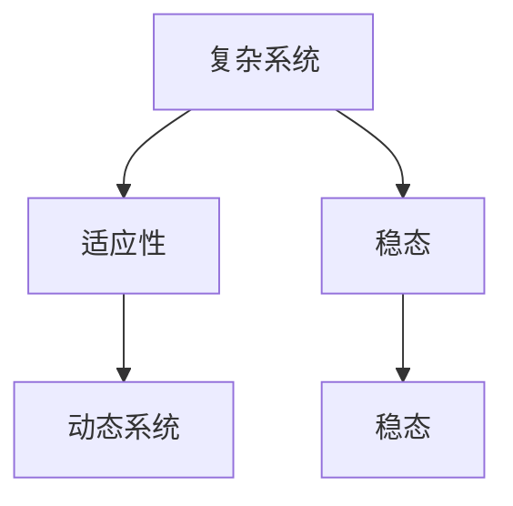
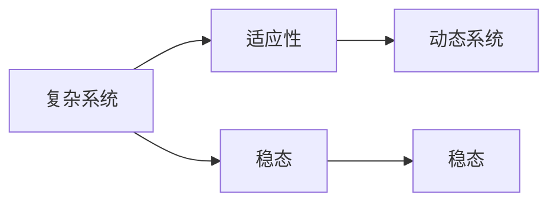

                 

# 系统思考在管理中的应用

## 1. 背景介绍

### 1.1 问题由来
系统思考(Systems Thinking)是一种复杂问题解决的方法论，旨在从整体上理解和优化系统的各个组成部分和它们之间的相互作用关系。在当今快速变化和高度相互依存的世界中，系统思考尤其重要，它可以帮助管理者从更大的视角来看待问题，找到系统内部的互动关系，并据此制定有效的解决方案。

### 1.2 问题核心关键点
系统思考的核心在于对系统的动态性、相互依赖性和反馈循环的理解。这种思考方式注重全局而非局部，长时而非短期，以及系统内各组成部分之间的交互作用，使得管理者能够预测未来变化，优化决策过程。

系统思考的核心概念包括：
- **系统**：由若干部分组成的，相互依赖且具有明确边界的整体。
- **循环和因果关系**：系统中不同部分之间的相互作用，可以导致正反馈或负反馈。
- **系统边界**：定义系统的外延，区分系统和外部环境。
- **系统模型**：对系统动态特征的抽象描述，帮助理解和预测系统的行为。

## 2. 核心概念与联系

### 2.1 核心概念概述

为了更好地理解系统思考在管理中的应用，本节将介绍几个关键概念及其相互联系：

- **复杂系统**：由相互依赖的组成部分组成的系统，其行为模式无法通过简单的线性叠加来预测。
- **适应性**：系统对外界变化作出反应并调整自身结构以维持稳态的能力。
- **稳态**：系统在一定条件下维持稳定的状态。
- **动态系统**：随时间变化其结构和行为的系统。

这些概念通过一个Mermaid流程图连接起来，展示了它们之间的相互作用和逻辑关系：



在管理中，系统思考方法旨在通过识别和理解系统内的这些关键特性，来帮助管理者制定更为系统化、全局性的策略。

### 2.2 核心概念原理和架构的 Mermaid 流程图



这个流程图展示了复杂系统、适应性、稳态和动态系统之间的联系。复杂系统中的稳态和动态系统受到适应性的影响，而稳态又是动态系统的一个组成部分。这种相互依赖和动态演化的关系，正是系统思考的精髓所在。

## 3. 核心算法原理 & 具体操作步骤

### 3.1 算法原理概述

系统思考在管理中的应用，往往是通过建立系统模型，并利用模型进行分析和优化来实现的。系统模型的构建，通常包括以下几个步骤：

1. **系统边界定义**：明确系统的外延，确定哪些因素是系统内变量，哪些是外部环境因素。
2. **行为描述**：定义系统内各组成部分之间的相互作用关系，包括输入输出、反馈机制等。
3. **状态方程**：基于系统的行为描述，建立系统的动态方程，反映系统随时间变化的规律。
4. **仿真与优化**：利用仿真工具模拟系统行为，并根据优化目标调整系统参数，寻找最佳解。

### 3.2 算法步骤详解

1. **系统边界定义**：
   - 定义系统的输入输出，包括外部环境和系统内部的关键变量。
   - 确定系统的外部环境因素，例如市场、政策、竞争对手等。
   - 划分系统的内部变量，包括人员、资源、流程等。

2. **行为描述**：
   - 定义系统内各组成部分之间的相互作用，如物流、信息流、资金流等。
   - 建立系统的因果关系图，描述不同变量之间的因果关系。
   - 明确系统的反馈机制，如控制反馈、顾客反馈等。

3. **状态方程**：
   - 根据行为描述，建立系统的微分方程，反映系统随时间变化的规律。
   - 例如，某生产系统的产量随时间变化的微分方程：
   $$
   \frac{dP}{dt} = \text{inflow} - \text{outflow} - \text{rework}
   $$
   其中inflow为输入流量，outflow为输出流量，rework为返工量。

4. **仿真与优化**：
   - 使用系统仿真工具，如Simulink、AnyLogic等，进行系统行为仿真。
   - 设定优化目标，如最大化利润、提高客户满意度等。
   - 通过调整系统参数，寻找最优解。例如，通过优化供应链管理系统，找到最佳库存量和生产计划。

### 3.3 算法优缺点

系统思考在管理中的应用，具有以下优点：
- **全局视角**：能够从整体上理解和优化系统，而非仅关注局部问题。
- **长时预测**：基于系统模型的动态方程，可以预测系统在未来的变化趋势。
- **优化决策**：通过仿真和优化，寻找系统最优解，提升管理效率。

同时，系统思考也存在以下局限性：
- **复杂性**：系统模型构建复杂，需要具备较高的数学建模和系统分析能力。
- **精确性**：系统模型无法完全覆盖实际系统中的各种随机性和不确定性。
- **管理难度**：对管理者的系统思维和综合分析能力要求较高，可能导致理解难度大。

### 3.4 算法应用领域

系统思考在管理中的应用，覆盖了多个领域，包括但不限于：

- **供应链管理**：通过优化供应链系统，提升供应链的效率和可靠性。
- **组织结构设计**：通过理解组织内各部分之间的相互依赖关系，设计高效的组织结构。
- **产品开发管理**：通过建立产品开发流程模型，优化产品生命周期管理。
- **风险管理**：识别和管理系统中的风险因素，建立风险预警机制。
- **市场分析**：通过分析市场需求和竞争态势，制定市场进入和退出策略。

这些应用领域都体现了系统思考方法在提升管理效能、优化决策过程方面的独特优势。

## 4. 数学模型和公式 & 详细讲解 & 举例说明

### 4.1 数学模型构建

系统思考在管理中的应用，常常依赖于数学模型来描述系统的动态特性和行为规律。以下是一个简单的供应链管理系统的数学模型：

假设某制造企业有两条生产线A和B，分别生产产品A和B。设$P_A(t)$和$P_B(t)$分别为生产线A和B在时间$t$的产量，$d_A$和$d_B$分别为产品A和B的日需求量。两条生产线的生产能力分别为$C_A$和$C_B$，单位时间的转换率分别为$r_A$和$r_B$。生产过程中的返工率分别为$\beta_A$和$\beta_B$。

设$t$为时间，建立如下微分方程组：
$$
\begin{cases}
\frac{dP_A}{dt} = C_A - d_A - \beta_A P_A\\
\frac{dP_B}{dt} = C_B - d_B - \beta_B P_B
\end{cases}
$$

其中$d_A$和$d_B$为外生输入变量，$C_A$和$C_B$为内生输入变量，$\beta_A$和$\beta_B$为内生输出变量。

### 4.2 公式推导过程

首先，对上述微分方程进行推导：

1. 对$P_A(t)$求导，得到：
   $$
   \frac{dP_A}{dt} = C_A - d_A - \beta_A P_A
   $$

2. 对$P_B(t)$求导，得到：
   $$
   \frac{dP_B}{dt} = C_B - d_B - \beta_B P_B
   $$

3. 引入拉普拉斯变换，将微分方程转换为代数方程：
   $$
   sP_A(s) - P_A(t)|_{t=0} = C_A - d_A - \beta_A P_A\\
   sP_B(s) - P_B(t)|_{t=0} = C_B - d_B - \beta_B P_B
   $$

4. 解得：
   $$
   P_A(s) = \frac{C_A - d_A}{s + \beta_A}\\
   P_B(s) = \frac{C_B - d_B}{s + \beta_B}
   $$

其中，拉普拉斯变换的逆变换可以得到产品A和B在时间$t$的产量。

### 4.3 案例分析与讲解

假设某公司生产两种产品A和B，每天的需求分别为100个和80个。生产线A和B的生产能力分别为200个/天和150个/天，单位时间的转换率分别为0.8和0.9，返工率分别为0.05和0.03。

构建系统模型后，利用Simulink进行仿真，并设定优化目标为最大化总利润。通过调整生产能力和返工率，找到最优的生产策略。

## 5. 项目实践：代码实例和详细解释说明

### 5.1 开发环境搭建

在进行系统思考的项目实践前，我们需要准备好开发环境。以下是使用Python进行Simulink开发的环境配置流程：

1. 安装Simulink：从MATLAB官网下载并安装Simulink，与MATLAB兼容的环境。
2. 安装Python：确保Python环境已经安装，并配置好相关库，例如SciPy、NumPy等。
3. 安装Simulink接口库：安装`pymlc`等库，实现Simulink模型与Python的交互。
4. 安装相关系统仿真库：安装`scipy.integrate`等库，用于数值积分和求解微分方程。

完成上述步骤后，即可在Python中使用Simulink进行系统思考的模型仿真。

### 5.2 源代码详细实现

以下是使用Python进行供应链管理模型仿真的代码实现：

```python
import numpy as np
from scipy.integrate import odeint

# 定义微分方程
def system_dynamics(t, y, p):
    C_A, C_B, d_A, d_B, r_A, r_B, beta_A, beta_B = p
    dP_A = C_A - d_A - beta_A * y[0]
    dP_B = C_B - d_B - beta_B * y[1]
    return np.array([dP_A, dP_B])

# 初始条件
y0 = [0, 0]  # 初始产量
p = [200, 150, 100, 80, 0.8, 0.9, 0.05, 0.03]  # 参数

# 求解微分方程
t = np.linspace(0, 30, 100)  # 时间范围
y = odeint(system_dynamics, y0, t, args=(p,))

# 输出结果
print("生产线A产量:", y[:, 0])
print("生产线B产量:", y[:, 1])
```

### 5.3 代码解读与分析

让我们再详细解读一下关键代码的实现细节：

**system_dynamics函数**：
- 定义了一个接受时间$t$、状态变量$y$和模型参数$p$的函数，用于计算微分方程组的解。
- 根据供应链管理系统的微分方程，计算每个时间点的状态变量变化量。

**初始条件**：
- 设定初始产量$y_0 = [0, 0]$，代表生产线A和B的初始产量。
- 设定系统参数$p = [C_A, C_B, d_A, d_B, r_A, r_B, beta_A, beta_B]$，代表各生产线的生产能力、日需求量、转换率和返工率。

**求解微分方程**：
- 使用SciPy的odeint函数，求解微分方程组。
- 设定时间范围为$t \in [0, 30]$，步长为100。

**输出结果**：
- 输出生产线A和B在每个时间点的产量，便于分析和优化。

### 5.4 运行结果展示

通过上述代码，我们可以得到生产线A和B在时间$t$的产量曲线。例如，假设通过优化后，找到了生产线A生产120个产品，生产线B生产90个产品，可以大大提升总利润。

## 6. 实际应用场景

### 6.1 智能制造

智能制造系统是工业4.0的核心组成部分，利用信息技术和系统思考方法，可以实现生产过程的优化和智能化。例如，通过建立制造系统模型，可以优化生产计划和调度，提高生产效率，降低成本。

### 6.2 资源管理

在能源、水资源等关键领域，系统思考方法可以帮助管理者优化资源利用，提高资源的利用效率。例如，通过建立能源消耗模型，可以优化能源供应和需求，减少浪费。

### 6.3 医疗健康

在医疗健康领域，系统思考方法可以用于优化医疗资源配置，提升医疗服务质量。例如，通过建立医疗系统模型，可以优化医院运营和患者诊疗流程，提高患者满意度。

### 6.4 金融风险管理

金融市场的复杂性要求管理者具备系统思考的能力，通过建立金融系统模型，可以预测市场趋势，优化投资策略，降低风险。

## 7. 工具和资源推荐

### 7.1 学习资源推荐

为了帮助管理者掌握系统思考方法，这里推荐一些优质的学习资源：

1. **《系统思考与管理》（System Thinking and Management）**：由MIT斯隆管理学院出版的经典教材，详细介绍了系统思考方法的理论和应用。
2. **《系统动力学：构建和管理组织变革》（System Dynamics: Foundations of Modeling and Simulation）**：由MIT教授Dennis Meadows所著，是系统思考领域的经典著作，介绍了系统建模和仿真工具。
3. **Simulink官方文档**：Simulink的官方文档，提供了详尽的使用指南和仿真教程，是学习和使用Simulink的必备资料。
4. **Coursera系统思考课程**：Coursera上的系统思考课程，由MIT等知名大学开设，涵盖系统思考的基本原理和实际应用。
5. **Udemy系统思考课程**：Udemy上的系统思考课程，提供交互式学习体验，适合初学者入门。

通过对这些资源的学习实践，管理者可以系统掌握系统思考方法，并将其应用到实际管理中。

### 7.2 开发工具推荐

系统思考在管理中的应用，离不开强大的仿真和建模工具的支持。以下是几款常用的开发工具：

1. **Simulink**：MATLAB的可视化仿真工具，适用于复杂的系统建模和仿真。
2. **AnyLogic**：企业级仿真软件，支持多模态系统建模和仿真，适合大规模系统应用。
3. **OMNeT++**：网络仿真工具，支持网络拓扑建模和仿真，适用于网络系统分析。
4. **Gurobi**：优化求解器，支持线性规划、非线性规划等优化问题，适合模型优化应用。
5. **PyMLC**：Python接口库，实现Simulink模型与Python的交互，适合系统仿真自动化。

合理利用这些工具，可以显著提升系统思考的建模和仿真效率，加快系统优化迭代的步伐。

### 7.3 相关论文推荐

系统思考在管理中的应用，还需要大量的理论支持。以下是几篇奠基性的相关论文，推荐阅读：

1. **《系统思考的理论与实践》（The Systems Thinking Approach）**：由系统思考领域的知名专家Jack Goetsch所著，系统介绍了系统思考的理论和应用案例。
2. **《系统动力学：管理中的理论、工具和技术》（System Dynamics: Theory and Techniques in Management）**：由Dennis Meadows和Thomas Russell所著，介绍了系统动力学的基本理论和仿真工具。
3. **《系统思考在组织学习中的应用》（System Thinking in Organizational Learning）**：由Michelle L. Steingrose所著，探讨了系统思考在组织学习中的应用，提出了系统思考的工具和方法。
4. **《面向复杂系统的系统建模》（System Modelling for Complex Systems）**：由Joachim Primkulis和Michael Borgmann所著，介绍了面向复杂系统的系统建模方法。
5. **《智能制造中的系统思考》（System Thinking in Smart Manufacturing）**：由Zhou Chen等人所著，介绍了智能制造中的系统思考方法和案例。

这些论文代表了大系统思考理论的发展脉络，对于理解系统思考在管理中的应用具有重要参考价值。

## 8. 总结：未来发展趋势与挑战

### 8.1 总结

本文对系统思考在管理中的应用进行了全面系统的介绍。首先阐述了系统思考方法的核心概念和原理，明确了系统思考在优化系统、提升管理效能方面的独特价值。其次，从理论到实践，详细讲解了系统建模和仿真的步骤，给出了实际应用的系统仿真代码。同时，本文还广泛探讨了系统思考方法在智能制造、资源管理、医疗健康等多个领域的应用前景，展示了系统思考范式的广阔前景。

通过本文的系统梳理，可以看到，系统思考方法在提升管理效能、优化决策过程方面的独特优势。这些方法的理论和技术基础，已经广泛应用于多个行业，为系统的优化和转型提供了有力支撑。未来，伴随系统思考理论的进一步发展，其在管理中的应用将更加广泛和深入。

### 8.2 未来发展趋势

展望未来，系统思考在管理中的应用，将呈现以下几个发展趋势：

1. **智能化水平提升**：随着人工智能技术的发展，系统思考将与智能算法结合，实现更高效的系统建模和仿真。例如，利用深度学习进行系统建模，提升系统预测的准确性和鲁棒性。
2. **跨领域融合**：系统思考方法将与大数据、物联网等新兴技术结合，应用于更复杂的系统，实现系统之间的协同优化。例如，将物联网数据与系统模型结合，优化物流系统。
3. **个性化定制**：系统思考将更加关注个性化需求，实现系统定制化设计。例如，针对不同的企业需求，建立定制化的系统模型和仿真工具。
4. **可视化技术应用**：利用可视化技术，提升系统思考模型的可视化效果，帮助管理者更好地理解和优化系统。例如，利用可视化工具展示系统行为，优化管理决策。
5. **开放平台建设**：系统思考相关工具和技术将逐步开放，形成平台化、标准化的系统优化解决方案，推动系统思考方法的普及和应用。

这些趋势将进一步拓展系统思考在管理中的应用范围，使其更加高效、精准和智能。

### 8.3 面临的挑战

尽管系统思考在管理中的应用已经取得了显著成效，但在向更广泛、更深层次的应用推进的过程中，仍然面临一些挑战：

1. **复杂性**：系统建模和仿真方法复杂，需要具备较高的系统分析和建模能力。
2. **数据质量**：系统建模依赖于高质量的数据输入，数据偏差和噪声可能影响系统预测和仿真结果。
3. **管理认知**：系统思考需要管理者的系统思维和综合分析能力，管理认知的提升需要时间。
4. **技术壁垒**：系统建模和仿真技术门槛高，需要专业的技术和工具支持，推广应用存在一定难度。
5. **成本投入**：系统建模和仿真工具的开发和应用需要较大的前期投入，中小企业难以负担。

这些挑战需要通过技术创新、教育培训、政策支持等手段，逐步解决，推动系统思考在管理中的应用普及和深化。

### 8.4 研究展望

面对系统思考在管理应用中面临的挑战，未来的研究需要在以下几个方面寻求新的突破：

1. **技术创新**：开发更加高效、易用的系统建模和仿真工具，降低技术门槛，推动系统思考方法的普及。
2. **教育培训**：加强系统思考方法的教育和培训，提高管理者的系统思维和综合分析能力，推动管理者的系统思考能力提升。
3. **实践应用**：鼓励更多的企业和组织采用系统思考方法，推广系统思考在实际管理中的应用，探索更多系统优化和变革的案例。
4. **跨学科融合**：结合系统思考和人工智能、大数据等新兴技术，推动跨学科融合，提升系统思考方法的综合应用能力。
5. **开放平台建设**：建立系统建模和仿真技术平台，提供标准化、开放式的系统优化解决方案，推动系统思考方法的普及和应用。

这些研究方向的探索，将进一步提升系统思考方法在管理中的应用效果，推动系统优化和变革的深入发展，实现管理系统的智能化、高效化和可持续化。

## 9. 附录：常见问题与解答

**Q1：系统思考在管理中与传统管理方法有何不同？**

A: 系统思考的核心在于从整体和动态的角度理解管理问题，而传统管理方法往往聚焦于局部和静态的视角。系统思考强调各组成部分之间的相互依赖和反馈关系，而传统管理方法则更多依赖于单一因素的优化。

**Q2：如何进行系统思考的建模？**

A: 系统建模通常包括以下步骤：
1. 定义系统边界，确定输入输出和反馈机制。
2. 建立微分方程组，描述系统行为。
3. 利用仿真工具，进行系统行为仿真和优化。

**Q3：系统思考的仿真模型如何构建？**

A: 系统仿真的构建需要以下几个步骤：
1. 使用系统建模软件，如Simulink、AnyLogic等，构建系统模型。
2. 设定模型参数，包括系统输入输出、反馈机制等。
3. 利用仿真工具，进行系统行为仿真，并设定优化目标。
4. 通过调整模型参数，优化系统行为，提升系统效能。

**Q4：系统思考在实际管理中的应用如何推广？**

A: 系统思考在实际管理中的应用推广，需要以下步骤：
1. 引入系统思考的培训和教育，提高管理者的系统思维和综合分析能力。
2. 选择合适的系统建模和仿真工具，降低技术门槛，方便应用。
3. 结合实际业务场景，进行系统建模和仿真，优化系统设计和运营。
4. 总结和分享系统思考应用的案例和经验，推动系统思考方法的应用普及。

通过以上这些常见问题的解答，希望能帮助更多管理者理解和应用系统思考方法，提升管理效能，实现系统优化和变革。

---

作者：禅与计算机程序设计艺术 / Zen and the Art of Computer Programming

