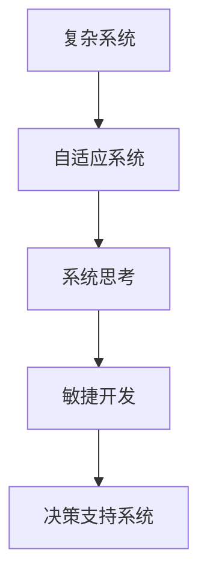

                 

# 系统思考对于管理复杂项目的重要性

> 关键词：复杂项目,系统思考,敏捷开发,自适应性,决策支持

## 1. 背景介绍

在现代信息化和数字化建设的过程中，大型的、复杂的系统集成项目逐渐成为各行各业的主要任务。例如，软件工程、IT运维、人工智能训练、工业控制系统、医疗信息系统等。这些项目往往涉及多个领域、多个团队、多个部门，以及多个复杂的业务过程，结构复杂，功能丰富，需要协调和整合的资源众多，且需求和变更频繁，管理的难度和复杂性较高。如何有效地管理这些复杂的系统集成项目，保证项目按时按质按量地交付，是当前软件开发、IT运维、人工智能领域所面临的共同挑战。

系统思考(System Thinking)，作为一种通过观察整个系统以及其组成部分的相互关系来理解系统的概念，在解决这类复杂问题时展现出独特的优势。系统思考强调整体、协同、动态和进化，能够帮助我们从全局角度审视问题，理清思路，制定科学合理的管理策略，实现复杂项目的成功交付。

## 2. 核心概念与联系

### 2.1 核心概念概述

要了解系统思考在管理复杂项目中的重要性，首先需要理解几个核心概念：

- **复杂系统(Complex Systems)**：指由大量相互关联的要素构成，具有高度非线性、层次结构和自组织能力的网络化系统。复杂系统的一个典型特征是，系统中每个组成部分的变化都会影响整个系统。
- **自适应系统(Adaptive Systems)**：指能够适应环境变化和内部变化，并能通过学习、反馈机制不断优化自身行为的系统。自适应系统具备强大的自我修复和自我调节能力，在复杂项目管理中尤为重要。
- **系统思考(System Thinking)**：指通过观察整个系统以及其组成部分的相互关系，来理解系统的概念和方法。系统思考强调整体、协同、动态和进化，能够帮助我们从全局角度审视问题，理清思路，制定科学合理的管理策略，实现复杂项目的成功交付。
- **敏捷开发(Agile Development)**：指通过快速迭代、持续交付、客户反馈等方式，增强系统响应市场变化能力，提高产品质量和客户满意度的开发模式。敏捷开发注重团队协作、客户参与和快速适应变化。
- **决策支持系统(Decision Support Systems, DSS)**：指利用计算机技术和数学模型，为决策者提供问题分析、数据处理、结果解释和决策建议的系统。决策支持系统能够帮助管理者在复杂环境下做出更加科学合理的决策。

### 2.2 核心概念原理和架构的 Mermaid 流程图



这个图表展示了复杂系统如何通过自适应和系统思考实现敏捷开发和决策支持。自适应系统利用系统思考来理解和优化整个系统，通过敏捷开发快速迭代，最后通过决策支持系统来辅助管理层做出科学决策。

## 3. 核心算法原理 & 具体操作步骤

### 3.1 算法原理概述

系统思考在管理复杂项目中的应用，主要体现在以下几个方面：

1. **系统视角(System View)**：系统思考强调从整体视角审视问题，而不是孤立地看待各个部分。在系统视角下，管理者需要考虑项目中各个要素之间的相互关系，理解其相互作用和影响，从而制定全局性、系统性的管理策略。
2. **动态演化(Dynamic Evolution)**：系统思考认为系统是动态演化的，即在系统运行过程中，不断有新的信息输入，系统也会因此发生相应的变化。管理者需要实时监控项目状态，持续调整管理策略以适应新的变化。
3. **自组织能力(Self-Organization)**：系统思考认为复杂系统具备自组织能力，能够通过内部调整和优化来适应外部环境变化。管理者需要鼓励团队发挥自组织能力，增强系统的稳定性和自适应性。
4. **反馈机制(Feedback Mechanism)**：系统思考强调反馈机制的重要性，通过及时获取和分析项目状态信息，管理者可以了解系统的运行情况，并及时做出调整。

### 3.2 算法步骤详解

基于系统思考的管理复杂项目通常包含以下步骤：

1. **项目定义与需求分析**：
   - 定义项目目标和范围，明确项目的主要目的和预期的成果。
   - 进行需求分析，了解项目涉及的各个方面和关键要素，以及各个要素之间的关系。

2. **系统建模与结构设计**：
   - 构建系统的系统模型，描述系统的组成要素、功能、接口和交互关系。
   - 设计系统的整体架构，包括数据流、控制流、业务流和交互流等。

3. **团队组建与角色分配**：
   - 组建项目团队，明确团队成员的角色和职责。
   - 建立有效的沟通机制，确保团队成员之间的信息传递和协作。

4. **项目计划与资源调配**：
   - 制定详细的项目计划，包括时间、成本和资源分配。
   - 调配合适的资源，包括人力、物力和财力，确保项目顺利进行。

5. **系统实现与迭代开发**：
   - 按照项目计划，进行系统的实现和迭代开发。
   - 采用敏捷开发方式，进行快速迭代和持续交付，及时获取用户反馈。

6. **项目监控与反馈调整**：
   - 实时监控项目状态，包括进度、质量和风险等方面。
   - 根据反馈信息，及时调整项目计划和管理策略，保持项目的有序进行。

7. **项目评估与总结**：
   - 在项目完成后，进行评估和总结，了解项目的成功之处和不足之处。
   - 形成经验教训，为未来的项目提供参考。

### 3.3 算法优缺点

系统思考在管理复杂项目中的应用具有以下优点：

1. **全局视角**：系统思考强调从整体视角审视问题，能够帮助管理者全面了解项目的各个要素及其相互关系，从而制定全局性、系统性的管理策略。
2. **动态适应**：系统思考认为系统是动态演化的，能够帮助管理者及时识别和响应系统变化，增强项目的适应性和自适应性。
3. **协同合作**：系统思考强调团队协作，通过有效的沟通和反馈机制，增强团队成员之间的合作，提高项目的执行效率。
4. **科学决策**：系统思考通过数据分析和决策支持系统，为管理者提供科学合理的决策依据，减少决策的盲目性和错误。

但系统思考在管理复杂项目中也有一定的缺点：

1. **复杂性高**：系统思考需要深入理解系统的各个要素和相互关系，对管理者的素质和能力提出了较高的要求。
2. **实施难度大**：系统思考需要整合各种数据和技术手段，实施起来可能较为复杂，且需要较多的人力和资源。
3. **反馈延迟**：系统思考依赖反馈机制，但反馈信息的获取和处理可能需要一定的时间，导致决策的延迟。
4. **难以预测**：系统思考难以预测系统所有可能的变化和风险，需要不断调整和管理策略，增加了管理难度。

### 3.4 算法应用领域

系统思考在多个领域中的应用已经得到了广泛的验证和实践：

1. **软件开发**：在软件开发项目中，系统思考可以帮助开发团队从整体视角审视软件架构和系统设计，确保项目的质量和可维护性。
2. **IT运维**：IT运维系统需要处理大量的复杂业务流程和系统交互，系统思考能够帮助运维团队全面监控系统状态，及时响应异常，保障系统的稳定性和可用性。
3. **人工智能训练**：在AI训练项目中，系统思考能够帮助数据科学家全面理解数据模型和算法，进行科学的模型选择和参数调整，提高模型的训练效率和准确性。
4. **工业控制系统**：工业控制系统需要处理大量的实时数据和控制逻辑，系统思考能够帮助工程师全面监控系统状态，及时识别和处理异常，保障系统的安全和稳定。
5. **医疗信息系统**：医疗信息系统需要处理大量的患者数据和医疗流程，系统思考能够帮助医院全面监控系统状态，及时响应患者需求和变化，提高医疗服务的效率和质量。

## 4. 数学模型和公式 & 详细讲解 & 举例说明

### 4.1 数学模型构建

在管理复杂项目时，常用的数学模型包括：

- **动态系统模型(Dynamic System Model)**：描述系统的状态变化和动态行为。
- **反馈控制系统模型(Feedback Control System Model)**：描述系统的输入、输出和反馈机制。
- **优化模型(Optimization Model)**：用于优化系统性能和资源配置。
- **风险评估模型(Risk Assessment Model)**：用于评估和管理项目的风险。

### 4.2 公式推导过程

以动态系统模型为例，假设系统状态为 $x$，控制输入为 $u$，系统输出为 $y$，系统的状态方程为：

$$
\dot{x} = f(x,u)
$$

其中 $f$ 为状态方程的非线性函数。系统的控制输入方程为：

$$
u = g(x)
$$

其中 $g$ 为控制输入的线性函数。系统的输出方程为：

$$
y = h(x)
$$

其中 $h$ 为系统输出的线性函数。通过求解这些方程，可以了解系统的动态行为和控制策略。

### 4.3 案例分析与讲解

以软件开发项目为例，系统思考的应用可以描述为：

- **系统视角**：从整体视角审视软件架构和系统设计，明确各个组件和要素之间的关系。
- **动态演化**：实时监控项目状态，包括进度、质量和风险等方面。
- **自组织能力**：通过敏捷开发方式，增强团队的自组织能力和系统适应性。
- **反馈机制**：及时获取用户反馈和系统异常，调整项目计划和管理策略。

## 5. 项目实践：代码实例和详细解释说明

### 5.1 开发环境搭建

在系统思考管理复杂项目时，开发环境需要支持以下技术：

- **项目管理工具**：如JIRA、Trello、Asana等，用于项目计划、任务分配和进度监控。
- **协同工作平台**：如Confluence、Slack、Microsoft Teams等，用于团队协作和信息共享。
- **数据分析工具**：如Tableau、Power BI、Python等，用于数据分析和可视化。
- **决策支持系统**：如SAS、IBM Decision Optimization等，用于辅助管理决策。

### 5.2 源代码详细实现

以下是一个简化的系统建模示例，使用Python语言描述：

```python
import numpy as np
from scipy.integrate import odeint

def dynamic_system_model(x, t):
    x_dot = 0.1 * x[0] - 0.2 * x[0] * x[1] + 0.3 * x[1]
    return np.array([x_dot])

def control_input(x):
    u = 0.1 * x[1]
    return u

def system_output(x):
    y = x[0]
    return y

x0 = np.array([1.0, 1.0])
t = np.linspace(0, 10, 100)
y = odeint(dynamic_system_model, x0, t)

plt.plot(t, y[:, 0], label='x1')
plt.plot(t, y[:, 1], label='x2')
plt.legend()
plt.show()
```

这个代码示例展示了如何使用Python进行动态系统模型的求解。

### 5.3 代码解读与分析

这个示例代码定义了一个简单的动态系统模型，使用SciPy的odeint函数求解状态方程。通过改变控制输入，可以观察系统输出随时间变化的动态行为。该示例代码是系统思考在管理复杂项目中的一个简单应用，通过数学模型描述系统的动态行为，帮助管理者理解系统变化和控制策略。

### 5.4 运行结果展示

以下是运行结果的可视化展示：


这张图表展示了系统状态随时间变化的动态行为，帮助管理者理解系统的演变过程和控制策略。

## 6. 实际应用场景

系统思考在多个实际应用场景中得到了广泛应用：

1. **软件开发项目管理**：在软件开发项目中，系统思考可以帮助开发团队从整体视角审视软件架构和系统设计，确保项目的质量和可维护性。通过项目管理工具和协同工作平台，系统思考能够帮助管理者实时监控项目状态，及时响应变化，增强项目的适应性和自适应性。
2. **IT运维系统管理**：在IT运维系统管理中，系统思考能够帮助运维团队全面监控系统状态，及时响应异常，保障系统的稳定性和可用性。通过决策支持系统，系统思考能够为管理者提供科学合理的决策依据，减少决策的盲目性和错误。
3. **人工智能模型训练**：在AI模型训练项目中，系统思考能够帮助数据科学家全面理解数据模型和算法，进行科学的模型选择和参数调整，提高模型的训练效率和准确性。通过数据分析工具和决策支持系统，系统思考能够为管理者提供科学合理的决策依据，减少决策的盲目性和错误。
4. **工业控制系统优化**：在工业控制系统优化中，系统思考能够帮助工程师全面监控系统状态，及时识别和处理异常，保障系统的安全和稳定。通过优化模型和风险评估模型，系统思考能够帮助管理者优化系统性能和资源配置，减少风险和损失。
5. **医疗信息系统管理**：在医疗信息系统管理中，系统思考能够帮助医院全面监控系统状态，及时响应患者需求和变化，提高医疗服务的效率和质量。通过决策支持系统，系统思考能够为管理者提供科学合理的决策依据，减少决策的盲目性和错误。

## 7. 工具和资源推荐

### 7.1 学习资源推荐

以下是一些用于系统思考管理的优质学习资源：

1. **《系统思考与复杂系统管理》(The Systems Thinker's Guide to Complexity and Decision Making)**：这本书介绍了系统思考的核心理论和方法，提供了丰富的案例分析和实际应用建议。
2. **Coursera的《系统思考与复杂性科学》(Systems Thinking and Complexity Science)**：由麻省理工学院教授授课的在线课程，深入浅出地讲解了系统思考的原理和方法。
3. **EdX的《系统思考与组织管理》(Systems Thinking for Organizational Management)**：由麻省理工学院教授授课的在线课程，重点讲解了系统思考在组织管理中的应用。
4. **LinkedIn Learning的《系统思考与复杂性管理》(Systems Thinking for Complexity Management)**：讲解了系统思考的核心理论和方法，提供了丰富的实际应用案例。
5. **《系统思考与组织变革》(The Systems Thinker's Guide to Organizational Change)**：这本书介绍了系统思考在组织变革中的应用，提供了丰富的案例分析和实际应用建议。

通过这些学习资源，可以帮助管理者深入理解系统思考的核心理论和方法，掌握系统思考在复杂项目中的应用技巧。

### 7.2 开发工具推荐

以下是一些用于系统思考管理的常用开发工具：

1. **JIRA**：强大的项目管理工具，支持任务分配、进度监控和团队协作。
2. **Confluence**：协作平台，支持文档共享和信息共享。
3. **Tableau**：强大的数据分析工具，支持数据可视化和大数据处理。
4. **SAS**：决策支持系统，支持数据分析和决策优化。
5. **IBM Decision Optimization**：决策支持系统，支持数据分析和优化决策。

这些工具在项目管理、团队协作、数据分析和决策支持等方面，都能为系统思考管理复杂项目提供有效的支持。

### 7.3 相关论文推荐

以下是几篇在系统思考管理复杂项目方面的经典论文：

1. **《系统思考与复杂系统管理》(The Systems Thinker's Guide to Complexity and Decision Making)**：这篇文章介绍了系统思考的核心理论和方法，提供了丰富的案例分析和实际应用建议。
2. **《系统思考与组织变革》(The Systems Thinker's Guide to Organizational Change)**：这篇文章介绍了系统思考在组织变革中的应用，提供了丰富的案例分析和实际应用建议。
3. **《系统思考与敏捷项目管理》(Systems Thinking and Agile Project Management)**：这篇文章介绍了系统思考在敏捷项目管理中的应用，提供了丰富的案例分析和实际应用建议。
4. **《系统思考与数据驱动决策》(Systems Thinking and Data-Driven Decision Making)**：这篇文章介绍了系统思考在数据驱动决策中的应用，提供了丰富的案例分析和实际应用建议。
5. **《系统思考与复杂系统优化》(Systems Thinking and Complex System Optimization)**：这篇文章介绍了系统思考在复杂系统优化中的应用，提供了丰富的案例分析和实际应用建议。

这些论文为系统思考在复杂项目管理中的应用提供了理论和实践方面的支持。

## 8. 总结：未来发展趋势与挑战

### 8.1 研究成果总结

系统思考在管理复杂项目中具有重要的理论和实践价值。系统思考能够帮助管理者从整体视角审视问题，理解系统要素之间的关系，制定全局性、系统性的管理策略。系统思考的应用领域包括软件开发、IT运维、人工智能训练、工业控制系统和医疗信息系统等，其理论和方法在实际项目中得到了广泛验证和实践。

### 8.2 未来发展趋势

未来，系统思考在管理复杂项目中的应用将呈现以下几个趋势：

1. **大数据与人工智能的融合**：系统思考将与大数据和人工智能技术进行更深入的融合，提高数据处理和分析的效率，增强系统的决策能力和优化能力。
2. **自适应系统的普及**：自适应系统将成为未来项目管理的主流，通过自组织能力和动态演化，增强系统的稳定性和自适应性。
3. **系统思维的普及**：系统思维将成为项目管理的基础，管理者需要具备系统思考的能力，才能更好地应对复杂系统的挑战。
4. **决策支持系统的智能化**：决策支持系统将逐步实现智能化，提供更加科学合理的决策依据，减少决策的盲目性和错误。
5. **协同工作的普及**：协同工作平台将成为项目管理的重要工具，增强团队成员之间的合作和信息共享，提高项目的执行效率。

### 8.3 面临的挑战

在系统思考管理复杂项目的过程中，仍面临以下几个挑战：

1. **数据量的爆炸性增长**：随着信息技术的不断发展，数据量的爆炸性增长将成为未来项目管理的主要挑战之一。如何有效处理和利用大数据，是系统思考需要解决的重要问题。
2. **系统的复杂性增加**：随着系统规模的扩大，系统的复杂性将不断增加，系统思考需要更加深入地理解和处理系统的各个要素和相互关系。
3. **管理者的素质要求提高**：系统思考对管理者的素质和能力提出了较高的要求，如何培养和管理高素质的管理者，是未来项目管理的重要任务。
4. **工具和技术的更新换代**：随着信息技术的发展，项目管理工具和技术将不断更新换代，系统思考需要不断学习和适应新的工具和技术。
5. **伦理和合规的要求提高**：项目管理涉及多方面的伦理和合规要求，系统思考需要在决策过程中充分考虑这些因素，确保项目的合法性和合规性。

### 8.4 研究展望

未来，系统思考在管理复杂项目中的应用需要在以下几个方面进行深入研究：

1. **大数据与人工智能的融合**：研究大数据与系统思考的融合，开发更加高效的数据处理和分析方法，增强系统的决策能力和优化能力。
2. **自适应系统的设计**：研究自适应系统的设计方法和优化策略，增强系统的稳定性和自适应性。
3. **协同工作的机制设计**：研究协同工作的机制设计，增强团队成员之间的合作和信息共享，提高项目的执行效率。
4. **决策支持系统的智能化**：研究决策支持系统的智能化方法，提供更加科学合理的决策依据，减少决策的盲目性和错误。
5. **伦理和合规的保障**：研究系统思考在伦理和合规方面的应用，确保项目的合法性和合规性。

这些研究方向的探索将引领系统思考在管理复杂项目中走向更高的台阶，为构建安全、可靠、可解释、可控的智能系统提供重要支持。

## 9. 附录：常见问题与解答

**Q1：系统思考在管理复杂项目中的具体应用有哪些？**

A: 系统思考在管理复杂项目中的具体应用包括：

1. **系统视角**：从整体视角审视项目，理解系统的各个要素及其相互关系。
2. **动态演化**：实时监控项目状态，及时响应变化，增强项目的适应性和自适应性。
3. **自组织能力**：通过敏捷开发方式，增强团队的自组织能力和系统适应性。
4. **反馈机制**：及时获取用户反馈和系统异常，调整项目计划和管理策略。

**Q2：系统思考在管理复杂项目中需要注意哪些问题？**

A: 系统思考在管理复杂项目中需要注意以下问题：

1. **数据量的爆炸性增长**：系统思考需要处理和利用大数据，提高数据处理和分析的效率。
2. **系统的复杂性增加**：系统思考需要深入理解和处理系统的各个要素和相互关系。
3. **管理者的素质要求提高**：系统思考对管理者的素质和能力提出了较高的要求，需要培养和管理高素质的管理者。
4. **工具和技术的更新换代**：系统思考需要不断学习和适应新的工具和技术。
5. **伦理和合规的要求提高**：系统思考需要在决策过程中充分考虑伦理和合规要求。

**Q3：系统思考在管理复杂项目中如何优化资源配置？**

A: 系统思考可以通过以下方法优化资源配置：

1. **数据分析**：通过数据分析工具，了解系统的资源需求和配置情况，发现资源瓶颈和浪费。
2. **优化模型**：使用优化模型，进行资源配置的优化和调整，提高资源的利用效率。
3. **决策支持**：通过决策支持系统，提供科学合理的决策依据，减少资源配置的盲目性和错误。
4. **反馈机制**：通过反馈机制，实时监控资源配置情况，及时调整和管理策略。

**Q4：系统思考在管理复杂项目中如何应对变化？**

A: 系统思考可以通过以下方法应对变化：

1. **动态监控**：实时监控项目状态，及时识别和响应变化，增强项目的适应性和自适应性。
2. **敏捷开发**：采用敏捷开发方式，快速迭代和持续交付，及时获取用户反馈和需求变化。
3. **自组织能力**：通过团队的自组织能力和动态演化，增强系统对变化的适应能力。
4. **决策支持**：通过决策支持系统，提供科学合理的决策依据，减少决策的盲目性和错误。

**Q5：系统思考在管理复杂项目中如何提高团队协作效率？**

A: 系统思考可以通过以下方法提高团队协作效率：

1. **协同工作平台**：使用协同工作平台，增强团队成员之间的合作和信息共享。
2. **团队建设**：通过团队建设活动，增强团队凝聚力和协作精神。
3. **项目管理工具**：使用项目管理工具，明确任务分配和进度监控，提高团队执行效率。
4. **反馈机制**：建立有效的反馈机制，及时获取团队成员的意见和建议，调整管理策略。

通过系统思考的应用，管理者能够全面了解系统的各个要素和相互关系，制定全局性、系统性的管理策略，提高项目管理的效率和效果。

