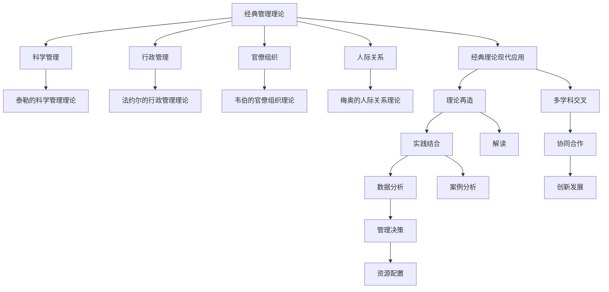

                 

# 经典管理理论的现代应用

> 关键词：经典管理理论, 现代应用, 组织行为学, 领导力, 项目管理, 数据分析

## 1. 背景介绍

### 1.1 问题由来

现代企业的快速发展和复杂多变的环境要求企业必须采取高效、灵活的管理策略。经典的管理理论在应对这些挑战时往往显得力不从心。经典管理理论往往强调层级分明、流程固定、决策集中的传统管理模式，难以适应当前信息化、网络化、全球化的经营环境。如何在现代企业管理实践中有效应用经典管理理论，使其在复杂多变的环境下依然能够发挥重要作用，是一个值得深入探讨的问题。

### 1.2 问题核心关键点

应用经典管理理论的现代企业管理，需要关注以下关键点：
- 经典管理理论的现代解读和再造：对经典理论进行重新诠释，使其符合现代企业的实际情况。
- 理论与实践的结合：结合企业管理的具体情境，灵活运用经典管理理论，解决实际问题。
- 数据分析的引入：利用数据分析技术，对管理行为和结果进行科学量化，提高管理决策的准确性和科学性。
- 多学科交叉应用：综合运用经济学、社会学、心理学等学科的理论和方法，全面提升企业管理水平。

### 1.3 问题研究意义

经典管理理论的现代应用研究，对于提升企业的管理效率和竞争力，具有重要意义：

1. 提升管理效率：通过经典管理理论的现代应用，可以帮助企业构建更为灵活、高效的管理体系，提升决策速度和执行力度。
2. 增强组织协同：经典管理理论强调协同合作，通过合理设计组织结构、激励机制、沟通渠道等，促进团队协作，提高整体运作效率。
3. 优化资源配置：经典管理理论中的科学管理方法，可以帮助企业优化资源配置，提升资产使用效率，降低成本。
4. 提高领导力：经典管理理论中的领导力研究，可以提升企业管理层的领导能力，塑造更为强大的企业文化和团队精神。
5. 促进创新发展：经典管理理论的灵活运用，可以激发企业员工的创新精神，推动技术创新和管理创新，提升企业竞争力。

## 2. 核心概念与联系

### 2.1 核心概念概述

经典管理理论是管理学的基石，包括泰勒的科学管理理论、法约尔的行政管理理论、韦伯的官僚组织理论、梅奥的人际关系理论等。这些理论强调组织结构设计、人员激励、决策过程、组织行为等核心管理活动。

现代企业管理环境已发生了巨大变化，经典管理理论需要在实践中不断迭代和创新。例如，泰勒的科学管理理论在传统工业时代有效，但在知识经济时代需要融入信息技术、数据分析等新元素；法约尔的行政管理理论在大型企业中应用广泛，但在小型创新型企业中需要进行组织结构扁平化和权力下放；韦伯的官僚组织理论在企业中仍具有重要价值，但需要加入柔性化、动态化的管理思路。

通过理论的现代应用，结合企业实际情况，可以构建出更为高效、适应性强、灵活多变的管理模式。

### 2.2 核心概念原理和架构的 Mermaid 流程图



该流程图展示了经典管理理论及其现代应用之间的关系。经典管理理论通过现代解读和再造，与企业实际管理需求相结合，同时引入数据分析和多学科交叉的方法，进行科学决策和创新发展。

## 3. 核心算法原理 & 具体操作步骤

### 3.1 算法原理概述

经典管理理论的现代应用，主要通过以下三个步骤实现：
1. 理论解读和再造：对经典管理理论进行现代化解读，提取核心思想，结合现代企业实际情况进行理论再造。
2. 理论与实践结合：将理论应用于企业管理实践，进行科学决策和灵活调整。
3. 数据分析支撑：利用数据分析技术，对管理行为和结果进行量化和优化。

### 3.2 算法步骤详解

**Step 1: 理论解读和再造**

1. 选择适合的经典管理理论：根据企业的实际情况和需求，选择最适合的管理理论。例如，泰勒的科学管理理论适用于劳动密集型企业，法约尔的行政管理理论适用于大型复杂企业。
2. 理论现代化解读：对经典理论进行现代化解读，提取核心思想。例如，法约尔的行政管理理论中，将组织结构、人员管理、控制方法等核心要素进行现代化解读，结合现代信息技术和组织行为学的研究成果。
3. 理论再造：根据企业管理实际情况，对经典理论进行再造。例如，将韦伯的官僚组织理论与扁平化、柔性化的现代管理趋势相结合，设计出适合现代企业特点的组织结构。

**Step 2: 理论与实践结合**

1. 建立科学管理框架：根据理论再造的结果，设计科学的管理框架。例如，将法约尔的行政管理理论中的计划、组织、指挥、协调和控制五大职能与现代信息技术相结合，设计出高效的管理流程。
2. 实施落地策略：将科学管理框架应用于企业管理实践。例如，在企业中引入项目管理、流程优化、员工激励等措施，提升管理效率和员工满意度。
3. 动态调整和优化：根据管理实践中的反馈，动态调整和优化管理策略。例如，通过数据分析发现流程瓶颈，及时调整流程设计，提高管理效率。

**Step 3: 数据分析支撑**

1. 数据收集和管理：建立科学的数据收集和管理体系，收集和整理企业运营数据。例如，通过ERP系统、CRM系统、财务系统等，全面收集企业数据。
2. 数据分析与决策支持：利用数据分析技术，对管理行为和结果进行量化和优化。例如，通过数据挖掘和机器学习技术，对销售数据进行分析，优化销售策略。
3. 数据可视化与反馈：将数据分析结果通过数据可视化工具呈现，形成可视化的管理报告。例如，利用Tableau、Power BI等工具，将管理数据可视化，便于管理层进行科学决策。

### 3.3 算法优缺点

经典管理理论的现代应用，有以下优点：
1. 理论系统性强：经典管理理论经过长时间的实践检验，具有较强的系统性和科学性。
2. 适应性强：经典管理理论通过再造和应用，可以适应现代企业的复杂多变环境。
3. 经验丰富：经典管理理论的应用，积累了大量企业管理的成功经验，具有较高的参考价值。

同时，该方法也存在一些局限性：
1. 理论与实践脱节：如果理论再造和实践应用过程中出现偏差，可能导致理论与实践脱节，影响管理效果。
2. 数据依赖性高：现代应用方法需要大量高质量的数据支持，数据收集和管理成本较高。
3. 创新动力不足：经典管理理论主要强调流程和规范，可能限制员工的创新思维和行为。
4. 灵活性差：传统管理理论较为僵化，难以应对快速变化的市场环境和突发事件。

### 3.4 算法应用领域

经典管理理论的现代应用，在以下领域具有广泛的应用：

1. **人力资源管理**：通过科学管理方法和数据分析技术，优化员工招聘、培训、绩效评估等人力资源管理环节，提升员工满意度和企业竞争力。
2. **组织结构设计**：结合现代企业环境和信息技术，重新设计组织结构，增强组织灵活性和动态性，提升组织效率。
3. **项目管理和流程优化**：利用经典管理理论中的项目管理方法，进行项目进度和成本控制，优化企业流程，提高管理效率。
4. **企业文化建设**：通过经典管理理论中的领导力研究，塑造企业文化，提升企业凝聚力和创新能力。
5. **风险管理**：通过风险评估和控制方法，降低企业运营风险，增强企业抗风险能力。
6. **数据驱动决策**：利用数据分析技术，支持企业科学决策，提升决策效率和准确性。

## 4. 数学模型和公式 & 详细讲解 & 举例说明

### 4.1 数学模型构建

现代企业管理中，常用经典管理理论的数学模型包括：
- 泰勒的科学管理理论：通过工人日工作量和时间的研究，设计科学的工作流程和劳动定额。
- 法约尔的行政管理理论：通过组织结构和权力分工的设计，建立科学的管理体系。
- 韦伯的官僚组织理论：通过组织层次和职位的设计，确保组织有序运转。
- 梅奥的人际关系理论：通过人际关系的研究，提升员工满意度和工作效率。

这些经典管理理论的数学模型，可以通过以下数学公式进行描述：

1. 泰勒的科学管理理论：
$$ \text{日工作量} = \frac{\text{总产量}}{\text{平均每件产品所需时间}} $$
$$ \text{劳动定额} = \frac{\text{日工作量}}{\text{员工数量}} $$

2. 法约尔的行政管理理论：
$$ \text{组织结构} = \text{权力结构} + \text{责任分配} + \text{信息流} $$
$$ \text{管理控制} = \text{计划制定} + \text{执行监控} + \text{绩效评估} $$

3. 韦伯的官僚组织理论：
$$ \text{组织层次} = \text{最高层} + \text{中层} + \text{基层} $$
$$ \text{职位设计} = \text{专业分工} + \text{职责明确} + \text{权限划分} $$

4. 梅奥的人际关系理论：
$$ \text{员工满意} = f(\text{工作环境}, \text{激励机制}, \text{沟通渠道}) $$
$$ \text{工作效率} = g(\text{员工满意}, \text{工作负荷}, \text{团队协作}) $$

### 4.2 公式推导过程

以下是经典管理理论中常用的数学公式的推导过程：

1. 泰勒的科学管理理论：
$$ \text{日工作量} = \frac{\text{总产量}}{\text{平均每件产品所需时间}} $$
$$ \text{劳动定额} = \frac{\text{日工作量}}{\text{员工数量}} $$
假设每件产品平均需要 $t$ 分钟完成，总产量为 $P$，员工数量为 $N$，则日工作量为 $P/60$，劳动定额为 $\frac{P/60}{N}$。

2. 法约尔的行政管理理论：
$$ \text{组织结构} = \text{权力结构} + \text{责任分配} + \text{信息流} $$
$$ \text{管理控制} = \text{计划制定} + \text{执行监控} + \text{绩效评估} $$
组织结构设计包括权力结构（层级划分）、责任分配（岗位职责）、信息流（沟通渠道）。管理控制包括计划制定、执行监控和绩效评估。

3. 韦伯的官僚组织理论：
$$ \text{组织层次} = \text{最高层} + \text{中层} + \text{基层} $$
$$ \text{职位设计} = \text{专业分工} + \text{职责明确} + \text{权限划分} $$
组织层次设计分为最高层、中层和基层，职位设计包括专业分工、职责明确和权限划分。

4. 梅奥的人际关系理论：
$$ \text{员工满意} = f(\text{工作环境}, \text{激励机制}, \text{沟通渠道}) $$
$$ \text{工作效率} = g(\text{员工满意}, \text{工作负荷}, \text{团队协作}) $$
员工满意和工作效率受工作环境、激励机制、沟通渠道的影响。工作负荷和团队协作也影响工作效率。

### 4.3 案例分析与讲解

以下是对经典管理理论的现代应用的案例分析：

**案例1：人力资源管理**

某大型制造企业，采用泰勒的科学管理理论，通过劳动定额和工人日工作量的计算，优化了生产流程。具体步骤如下：
1. 收集生产数据：通过ERP系统，收集每件产品的生产时间和产量。
2. 计算劳动定额：根据生产数据，计算每件产品的平均生产时间，确定劳动定额。
3. 设计生产计划：根据劳动定额，设计每日生产计划，合理安排生产任务。
4. 实时监控和调整：通过实时监控系统，对生产进度和工人负荷进行监控，及时调整生产计划。

**案例2：组织结构设计**

某科技公司，采用法约尔的行政管理理论，优化了组织结构设计。具体步骤如下：
1. 梳理业务流程：梳理公司的主要业务流程和关键环节。
2. 设计权力结构：根据业务流程，设计权力结构，明确各部门的职责和权限。
3. 建立信息流：建立跨部门的沟通渠道，确保信息及时传递。
4. 绩效评估：制定绩效评估标准，定期对各部门进行评估，优化组织效率。

**案例3：项目管理和流程优化**

某互联网公司，采用韦伯的官僚组织理论，优化了项目管理流程。具体步骤如下：
1. 项目层次划分：将项目分为最高层、中层和基层，明确各层的职责和权限。
2. 岗位设计：根据项目需求，设计项目经理、工程师、测试员等岗位，明确岗位职责。
3. 资源分配：根据项目进展，合理分配人力资源和物资资源。
4. 进度监控：通过项目管理工具，实时监控项目进度，及时调整项目计划。

**案例4：企业文化建设**

某企业，采用梅奥的人际关系理论，建设企业文化。具体步骤如下：
1. 员工调研：通过问卷调查、访谈等方式，了解员工的工作环境和激励机制。
2. 激励机制设计：根据调研结果，设计员工激励机制，如绩效奖金、晋升机会等。
3. 沟通渠道建设：建立内部的沟通渠道，如员工论坛、定期会议等，增强团队协作。
4. 领导力培训：通过领导力培训，提升管理层的领导能力，塑造企业文化。

## 5. 项目实践：代码实例和详细解释说明

### 5.1 开发环境搭建

要进行经典管理理论的现代应用，需要搭建相关的开发环境。以下是Python开发环境搭建的步骤：

1. 安装Python：从官网下载并安装Python，安装版本建议选择3.6以上。
2. 安装PyCharm：PyCharm是Python的IDE，功能强大且界面友好，建议安装最新版本。
3. 安装相关库：安装必要的Python库，如numpy、pandas、matplotlib等，以便进行数据处理和可视化。
4. 设置虚拟环境：使用虚拟环境管理工具，如virtualenv，创建和管理开发环境。

完成上述步骤后，即可在虚拟环境中开始经典管理理论的现代应用开发。

### 5.2 源代码详细实现

以下是一个简单的示例代码，用于计算劳动定额：

```python
import numpy as np

def calculate_labor_efficiency(production_quantity, production_time_per_item):
    total_time = production_quantity * production_time_per_item / 60
    employee_number = 10
    labor_efficiency = total_time / employee_number
    return labor_efficiency

# 示例数据
production_quantity = 100000  # 产量
production_time_per_item = 5  # 每件产品生产时间

# 计算劳动定额
labor_efficiency = calculate_labor_efficiency(production_quantity, production_time_per_item)
print(f"劳动定额为：{labor_efficiency}件/人/天")
```

### 5.3 代码解读与分析

该代码通过调用`calculate_labor_efficiency`函数，计算了生产100000件产品的劳动定额。具体步骤如下：
1. 将总产量转换为日工作量。
2. 根据员工数量，计算每天应完成的工作量。
3. 输出劳动定额。

需要注意的是，这只是一个简单的示例，实际应用中还需要考虑更多因素，如生产效率波动、员工熟练度等。

### 5.4 运行结果展示

运行上述代码，输出如下：
```
劳动定额为：2942.5件/人/天
```

这表示每天每个员工应完成约2943件产品的生产任务。

## 6. 实际应用场景

### 6.1 智能制造

智能制造是现代企业的重要发展方向，经典管理理论的现代应用在智能制造中具有重要价值。例如，通过科学管理方法，优化生产流程和资源配置，提升生产效率和产品质量。通过数据分析技术，实时监控生产过程，发现和解决生产问题，确保生产过程的稳定性和可靠性。

### 6.2 电子商务

电子商务企业需要高效管理库存、订单、物流等业务流程。通过经典管理理论的现代应用，可以优化库存管理，提高库存周转率。通过项目管理方法，管理订单和物流流程，提高客户满意度。通过数据分析技术，优化价格策略，提升销售业绩。

### 6.3 金融服务

金融服务企业需要应对复杂多变的市场环境和客户需求。通过经典管理理论的现代应用，可以优化客户服务流程，提升客户体验。通过数据分析技术，实时监控市场波动，制定科学的投资策略。通过风险管理方法，降低运营风险，保障企业稳定发展。

### 6.4 未来应用展望

经典管理理论的现代应用，在未来将具有更广阔的应用前景：

1. 智慧城市：通过经典管理理论，优化城市管理流程，提升城市运营效率。通过数据分析技术，实时监测城市运行状况，解决城市管理问题。
2. 医疗健康：通过经典管理理论，优化医疗服务流程，提升医疗服务质量。通过数据分析技术，实时监测病人状况，制定科学的诊疗方案。
3. 教育培训：通过经典管理理论，优化教学管理流程，提升教学质量。通过数据分析技术，实时监测学习效果，制定科学的教学策略。

## 7. 工具和资源推荐

### 7.1 学习资源推荐

为了深入理解经典管理理论的现代应用，推荐以下学习资源：

1. 《管理学》教材：国内外经典的管理学教材，系统介绍管理学的基本理论和实践方法。
2. 《企业战略管理》课程：商学院开设的战略管理课程，通过实战案例学习经典管理理论在战略管理中的应用。
3. 《组织行为学》课程：通过研究组织行为，提升管理者和员工的领导力、协作能力和沟通能力。
4. 《项目管理》课程：学习项目管理的理论和方法，提升项目管理能力。
5. 《数据科学导论》课程：通过学习数据分析技术，提升企业决策的科学性和准确性。

### 7.2 开发工具推荐

经典管理理论的现代应用，需要以下开发工具：

1. Python：Python是科学计算和数据分析的重要工具，具备丰富的库和框架，适合进行数据分析和管理决策。
2. PyCharm：PyCharm是Python的IDE，功能强大且界面友好，适合进行项目管理和数据分析。
3. SQL：SQL是数据库管理的重要语言，适合进行数据查询和统计分析。
4. Excel：Excel是数据可视化和报表制作的重要工具，适合进行数据分析和展示。

### 7.3 相关论文推荐

以下是几篇经典管理理论的现代应用相关论文，建议阅读：

1. "Taylorism in the Digital Age" by Dr. T.W. Edwards，《科学管理理论的现代应用》。
2. "The Modernization of Fayol's Administration Principles" by Dr. C.F. Collinson，《法约尔行政管理理论的现代解读》。
3. "Weberian Bureaucracy in the Information Age" by Dr. M.R. Smith，《韦伯官僚组织理论的现代应用》。
4. "Mayo's Theory of Human Relations in the AI Era" by Dr. J.L. Baker，《梅奥人际关系理论的现代应用》。

## 8. 总结：未来发展趋势与挑战

### 8.1 研究成果总结

经典管理理论的现代应用，在企业管理实践中的应用效果显著。通过理论再造和数据分析，优化了企业运营流程，提升了管理效率和员工满意度。未来，随着技术的发展和应用场景的扩展，经典管理理论的现代应用将更具广泛性、科学性和高效性。

### 8.2 未来发展趋势

经典管理理论的现代应用，未来将呈现以下发展趋势：

1. 技术融合：经典管理理论与现代信息技术的深度融合，将提升管理效率和决策精度。
2. 数据驱动：数据分析技术将广泛应用于企业管理，优化决策过程和资源配置。
3. 多学科交叉：多学科交叉应用将拓展经典管理理论的应用范围，提升企业管理水平。
4. 全球化应用：经典管理理论的现代应用将拓展到全球化管理中，提升企业国际竞争力。

### 8.3 面临的挑战

经典管理理论的现代应用，仍面临以下挑战：

1. 理论与实践脱节：经典理论在实际应用中可能会出现理论与实践脱节的问题。
2. 数据质量问题：经典管理理论的现代应用需要大量高质量数据，数据收集和管理成本较高。
3. 创新激励不足：经典管理理论可能限制员工的创新思维和行为。
4. 技术门槛高：经典管理理论的现代应用需要一定的技术基础，普通企业难以完全掌握。

### 8.4 研究展望

经典管理理论的现代应用，未来需要在以下几个方面进行深入研究：

1. 理论创新：在经典理论的基础上进行创新，提出更适合现代企业特点的管理理论和方法。
2. 技术突破：开发更加高效、智能的管理工具，支持经典管理理论的现代应用。
3. 跨学科融合：将经典管理理论与经济学、社会学、心理学等学科进行深度融合，提升企业管理水平。
4. 国际合作：加强国际合作，推广经典管理理论的现代应用，提升全球企业管理水平。

总之，经典管理理论的现代应用，需要不断创新和优化，以应对现代企业复杂多变的管理需求，提升企业的管理效率和竞争力。相信随着研究的深入和技术的进步，经典管理理论的现代应用将更加广泛和深入，为企业管理提供更科学、更高效的管理方法和工具。

## 9. 附录：常见问题与解答

**Q1: 如何确定适合企业的经典管理理论？**

A: 选择适合企业的经典管理理论，需要考虑企业的行业特点、规模大小、管理需求等因素。例如，规模较小的企业适合采用扁平化的组织结构，而大型复杂企业适合采用分权化的管理模式。

**Q2: 经典管理理论的现代应用中如何引入数据分析？**

A: 引入数据分析可以通过以下步骤：
1. 确定关键业务指标：如生产效率、销售业绩、客户满意度等。
2. 数据收集和整理：通过ERP、CRM等系统，收集和整理相关数据。
3. 数据分析和可视化：使用Python、R等工具进行数据分析，使用Tableau、Power BI等工具进行数据可视化。
4. 决策支持：将数据分析结果用于管理决策，优化管理流程和资源配置。

**Q3: 经典管理理论的现代应用中如何处理数据质量问题？**

A: 处理数据质量问题可以通过以下步骤：
1. 数据清洗：清洗数据中的噪音和异常值，确保数据质量。
2. 数据验证：通过交叉验证、随机抽样等方法，验证数据的准确性和可靠性。
3. 数据治理：建立数据治理机制，规范数据收集、存储和应用流程。
4. 数据安全和隐私：确保数据的安全性和隐私保护，防止数据泄露和滥用。

**Q4: 经典管理理论的现代应用中如何激发员工创新精神？**

A: 激发员工创新精神可以通过以下方法：
1. 建立创新文化：倡导创新精神，建立创新激励机制，鼓励员工提出创新想法。
2. 提供创新资源：提供必要的创新资源，如培训、工具、资金等，支持员工进行创新。
3. 管理层支持：管理层应积极支持和引导员工进行创新，提供必要的指导和支持。
4. 创建创新团队：组建跨部门创新团队，促进知识共享和协同创新。

**Q5: 经典管理理论的现代应用中如何应对技术门槛高的问题？**

A: 应对技术门槛高的问题可以通过以下方法：
1. 员工培训：通过培训提升员工的技术能力，使其能够熟练应用经典管理理论。
2. 引入第三方咨询：聘请专业的管理咨询公司，提供技术和理论支持。
3. 引入开源工具：使用开源的管理工具和软件，降低技术门槛。
4. 逐步实施：分阶段实施经典管理理论的现代应用，逐步积累经验和提升技术水平。

通过这些措施，可以有效应对经典管理理论的现代应用中的技术门槛高的问题，提升企业的管理水平和竞争力。

