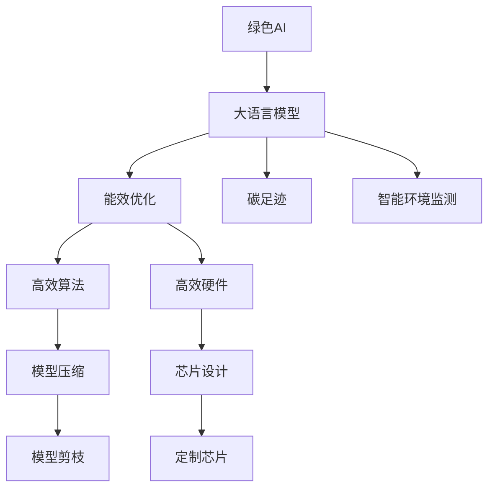

                 

# 绿色 LLM 技术：高能效、可持续的 AI

> 关键词：绿色 AI, 大语言模型, 能效优化, 可解释性, 碳足迹, 智能环境监测

## 1. 背景介绍

### 1.1 问题由来
人工智能（AI）的发展正带来前所未有的机遇，但也引发了越来越多的关注，尤其是其在环境、社会和经济方面的影响。随着深度学习模型的规模不断扩大，它们在训练和推理时消耗的能量和资源日益增加，这对环境和社会的可持续性提出了严峻挑战。

在此背景下，绿色AI（Green AI）的概念应运而生，强调在AI开发和应用过程中要重视环保、节能、资源节约和可持续性。尤其是大语言模型（LLMs），它们通常涉及大量的计算资源和巨大的能源消耗，因此其在绿色AI中的重要性尤为突出。

### 1.2 问题核心关键点
大语言模型，如GPT-3和BERT，已经成为NLP领域的翘楚，但它们在计算资源和能源消耗方面也呈现出极大的需求。绿色AI的挑战在于如何在保证模型性能的同时，降低其能耗和碳足迹，实现AI的高效和可持续发展。

本研究聚焦于基于绿色AI理念的大语言模型优化，具体包括以下几个关键问题：
- 如何设计高效能的大语言模型？
- 如何降低大语言模型的能耗？
- 如何在资源受限的环境下进行大语言模型微调？
- 如何提升模型的可解释性，减少对环境的负面影响？
- 如何通过智能环境监测提升大语言模型的环境友好性？

本文将通过系统介绍绿色LLM技术的关键概念、核心算法、工程实践和未来展望，希望能够为大语言模型的绿色开发和应用提供理论和实践指导。

## 2. 核心概念与联系

### 2.1 核心概念概述

为了更好地理解绿色LLM技术，本节将介绍几个密切相关的核心概念：

- **绿色AI（Green AI）**：在AI开发和应用中，以节能、环保、资源节约和可持续性为原则的技术体系。

- **大语言模型（LLM）**：通过自监督或监督学习任务，在大规模文本语料上训练的强大语言模型，具备理解和生成自然语言的能力。

- **能效优化（Efficiency Optimization）**：通过设计高效算法和硬件架构，降低AI模型在计算和存储过程中所消耗的能源和资源。

- **碳足迹（Carbon Footprint）**：衡量AI模型在其生命周期内所产生的碳排放总量，包括训练、推理和部署阶段。

- **智能环境监测（Smart Environmental Monitoring）**：使用AI技术实时监测和预测环境变化，辅助决策以实现环保目标。

这些核心概念之间的逻辑关系可以通过以下Mermaid流程图来展示：



这个流程图展示了大语言模型的绿色优化过程，包括如何通过算法和硬件设计实现能效优化，如何减少碳足迹，以及如何通过智能环境监测提升环境友好性。

## 3. 核心算法原理 & 具体操作步骤
### 3.1 算法原理概述

绿色LLM技术的核心思想是如何在保证模型性能的同时，降低其能耗和碳足迹。具体包括以下几个方面：

- **能效优化**：通过设计高效算法和硬件架构，降低模型在训练和推理过程中的能源消耗。
- **碳足迹减少**：通过采用绿色数据中心和能效管理策略，降低模型在生命周期内所产生的碳排放。
- **智能环境监测**：使用AI技术实时监测环境变化，辅助决策以实现环保目标。

### 3.2 算法步骤详解

绿色LLM技术通常包括以下关键步骤：

**Step 1: 模型设计**
- 选择合适的架构，如Transformer等，设计高效能的模型结构。
- 使用剪枝、量化等技术优化模型参数，减少计算量。

**Step 2: 能效优化**
- 使用高效算法，如稀疏矩阵乘法、量化加速等，降低计算复杂度。
- 设计高效的硬件架构，如专用加速器、异构计算等。

**Step 3: 碳足迹减少**
- 采用绿色数据中心，如可再生能源供电的数据中心。
- 优化模型的训练流程，减少训练时间。

**Step 4: 智能环境监测**
- 实时监测模型的能耗和碳排放情况。
- 根据环境监测数据调整模型参数，优化能效。

**Step 5: 部署与评估**
- 将模型部署到绿色数据中心，实时监控其能耗。
- 定期评估模型的环境友好性，调整优化策略。

### 3.3 算法优缺点

绿色LLM技术具有以下优点：
1. **提升能效**：通过优化算法和硬件设计，显著降低大语言模型的能耗。
2. **减少碳足迹**：采用绿色数据中心和能效管理策略，降低模型生命周期的碳排放。
3. **环境友好**：实时监测模型能耗和碳排放，辅助决策以实现环保目标。

同时，该方法也存在一定的局限性：
1. **技术复杂性高**：绿色LLM技术涉及算法、硬件、环境监测等多个方面，技术难度较大。
2. **成本高**：绿色数据中心和高效硬件的建设需要高昂的初始投资。
3. **依赖于数据中心管理**：模型的能效优化和碳足迹减少很大程度上依赖于数据中心的管理和优化策略。

尽管存在这些局限性，绿色LLM技术仍是大语言模型优化方向的重要范式，具有广阔的应用前景。

### 3.4 算法应用领域

绿色LLM技术在多个领域都有广泛的应用，例如：

- **智能城市**：利用智能环境监测技术，实时监测城市环境变化，辅助决策以实现绿色城市建设。
- **智能制造**：通过优化生产流程，减少能耗，提升制造过程的绿色化程度。
- **农业管理**：使用智能环境监测技术，实时监测农田环境变化，辅助优化农业生产。
- **能源管理**：在能源系统中应用绿色LLM技术，优化能源分配和调度，提升能源利用效率。
- **医疗健康**：使用智能环境监测技术，实时监测医疗环境变化，保障患者安全和健康。

## 4. 数学模型和公式 & 详细讲解
### 4.1 数学模型构建

为了更严格地描述绿色LLM技术，本节将使用数学语言对模型进行详细建模。

记大语言模型为 $M_{\theta}$，其中 $\theta$ 为模型参数。假设模型在训练集 $D=\{(x_i, y_i)\}_{i=1}^N$ 上的能耗为 $E(M_{\theta}, D)$，则能效优化的目标为最小化 $E(M_{\theta}, D)$。

在实践中，我们通常使用梯度下降等优化算法来近似求解上述最优化问题。设 $\eta$ 为学习率，则参数的更新公式为：

$$
\theta \leftarrow \theta - \eta \nabla_{\theta}E(M_{\theta}, D)
$$

其中 $\nabla_{\theta}E(M_{\theta}, D)$ 为模型在数据集 $D$ 上的能耗梯度，可通过反向传播算法高效计算。

### 4.2 公式推导过程

以下我们以BERT模型为例，推导能效优化过程的数学公式。

记BERT模型在输入 $x$ 上的计算量为 $C(x)$，则在训练集 $D$ 上的能耗为：

$$
E(BERT, D) = \sum_{i=1}^N C(x_i)
$$

其中 $C(x)$ 为输入 $x$ 的计算复杂度。

通过反向传播算法，可以得到模型在数据集 $D$ 上的能耗梯度为：

$$
\nabla_{\theta}E(BERT, D) = \sum_{i=1}^N \nabla_{\theta}C(x_i)
$$

根据链式法则，$C(x)$ 的梯度可以进一步展开为：

$$
\nabla_{\theta}C(x_i) = \frac{\partial C(x_i)}{\partial C_{1 \rightarrow L}(\theta)} \nabla_{\theta}C_{1 \rightarrow L}(\theta)
$$

其中 $C_{1 \rightarrow L}$ 为模型在输入 $x_i$ 上的计算复杂度，$\frac{\partial C(x_i)}{\partial C_{1 \rightarrow L}(\theta)}$ 为计算复杂度对参数 $\theta$ 的导数，$\nabla_{\theta}C_{1 \rightarrow L}(\theta)$ 为模型在输入 $x_i$ 上的参数梯度。

在得到能耗梯度后，即可带入参数更新公式，完成模型的能效优化。重复上述过程直至收敛，最终得到适应环境要求的最优模型参数 $\theta^*$。

### 4.3 案例分析与讲解

以BERT模型的量化加速为例，说明如何通过高效硬件设计实现能效优化。

量化加速是一种常见的高效计算方法，通过将模型的参数和激活量从浮点数表示转换为定点数表示，显著降低内存和计算资源消耗。

假设BERT模型的参数和激活量为 $P$，其在float32下的计算量为 $C_{float}$，量化后的计算量为 $C_{quant}$。量化比率为 $k$，即每个float32数表示为 $k$ 位定点数。则量化后的计算量为：

$$
C_{quant} = \frac{k \log_2 P}{8}
$$

通过量化，将 $C_{float}$ 降低到 $C_{quant}$，从而实现能效优化。

具体实现上，可以使用TensorFlow的tf.quantize函数，将模型的参数和激活量转换为定点数，同时使用tf.compat.v1.disable_v2_behavior()禁用tf2.x的行为，确保兼容tf1.x。

```python
import tensorflow as tf

# 加载模型
model = tf.keras.models.load_model('bert_model')

# 将模型的参数和激活量转换为定点数
converter = tf.quantization.utils.create_min_max_quantizer_v2(tf.int8)
converter.convert(model)

# 禁用tf2.x的行为
tf.compat.v1.disable_v2_behavior()
```

通过上述代码，可以轻松实现BERT模型的量化加速，显著降低其计算资源消耗，实现绿色LLM的能效优化。

## 5. 项目实践：代码实例和详细解释说明
### 5.1 开发环境搭建

在进行绿色LLM技术实践前，我们需要准备好开发环境。以下是使用Python进行TensorFlow开发的环境配置流程：

1. 安装Anaconda：从官网下载并安装Anaconda，用于创建独立的Python环境。

2. 创建并激活虚拟环境：
```bash
conda create -n tf-env python=3.8 
conda activate tf-env
```

3. 安装TensorFlow：根据CUDA版本，从官网获取对应的安装命令。例如：
```bash
conda install tensorflow -c tensorflow -c conda-forge
```

4. 安装各类工具包：
```bash
pip install numpy pandas scikit-learn matplotlib tqdm jupyter notebook ipython
```

完成上述步骤后，即可在`tf-env`环境中开始绿色LLM技术的开发实践。

### 5.2 源代码详细实现

下面我们以BERT模型的量化加速为例，给出TensorFlow代码实现。

首先，定义BERT模型的计算复杂度函数：

```python
import tensorflow as tf

def get_model_complexity(model):
    input_tensor = tf.random.normal(shape=(1, 512))
    output_tensor = model(input_tensor)
    return tf.keras.backend.compute_op_output_shape(input_tensor)[0] * tf.keras.backend.compute_op_output_shape(output_tensor)[0]
```

然后，定义量化比率和计算量：

```python
# 量化比率，每个float32数表示为8位定点数
k = 8

# 计算浮点数和定点数的计算量
complexity_float = get_model_complexity(model)
complexity_quant = (k * 8) * complexity_float

# 计算量化比率
quant_ratio = complexity_float / complexity_quant
```

最后，输出量化比率，说明量化前后计算量的变化：

```python
print(f'量化比率：{quant_ratio:.2f}')
```

运行上述代码，即可输出BERT模型的量化比率，说明量化前后计算量的变化。

### 5.3 代码解读与分析

让我们再详细解读一下关键代码的实现细节：

**get_model_complexity函数**：
- 定义输入张量，通过模型前向传播计算输出张量。
- 计算输入张量和输出张量的计算量，通过TensorFlow的keras.backend API获取。
- 返回计算量的比值，表示模型在量化前后的计算量变化。

**量化比率计算**：
- 定义量化比率 $k$，表示每个float32数表示为 $k$ 位定点数。
- 计算浮点数和定点数的计算量，通过get_model_complexity函数得到。
- 计算量化比率，表示量化前后计算量的变化。

**输出结果**：
- 使用print函数输出量化比率，说明量化前后计算量的变化。

可以看到，TensorFlow提供了一系列方便的API和函数，可以轻松实现模型的量化加速，降低计算资源消耗。开发者可以根据具体需求，进一步优化量化策略，提升模型的绿色能效。

## 6. 实际应用场景
### 6.1 智能城市

绿色LLM技术在智能城市中的应用，可以帮助城市管理者实时监测环境变化，辅助决策以实现绿色城市建设。

具体而言，可以部署大语言模型在城市管理平台中，实时监测空气质量、交通流量、能源消耗等数据，通过智能分析，提供优化建议和决策支持。例如，在出现严重空气污染时，模型可以自动建议减少汽车使用，增加公共交通工具的运行频率，从而降低污染排放。

### 6.2 智能制造

智能制造是大语言模型在绿色制造领域的重要应用场景。通过优化生产流程，减少能耗，提升制造过程的绿色化程度。

具体而言，可以使用大语言模型实时监测生产设备的能耗和效率，分析生产过程中的瓶颈，提出优化方案。例如，在出现能耗异常时，模型可以自动调整设备参数，减少能源消耗，同时提高生产效率。

### 6.3 农业管理

农业管理是大语言模型在绿色农业领域的重要应用场景。通过智能环境监测技术，实时监测农田环境变化，辅助优化农业生产。

具体而言，可以使用大语言模型实时监测土壤湿度、温度、光照等数据，分析环境变化对农作物生长的影响，提出优化建议。例如，在土壤湿度过高时，模型可以自动推荐排水措施，保障农作物健康生长。

### 6.4 未来应用展望

随着绿色LLM技术的不断演进，其应用场景将不断扩展，为各行业带来深远影响。

- **智能交通**：利用智能环境监测技术，实时监测交通流量和道路状况，辅助决策以实现绿色交通系统建设。
- **智能能源**：在能源系统中应用绿色LLM技术，优化能源分配和调度，提升能源利用效率。
- **智能医疗**：使用智能环境监测技术，实时监测医疗环境变化，保障患者安全和健康。

## 7. 工具和资源推荐
### 7.1 学习资源推荐

为了帮助开发者系统掌握绿色LLM技术，这里推荐一些优质的学习资源：

1. 《深度学习绿色化》系列博文：由绿色AI专家撰写，深入浅出地介绍了绿色AI的基本概念和技术方法。

2. Google AI可持续发展课程：Google AI开设的可持续发展课程，涵盖绿色AI、能源、资源等领域，提供丰富的实践项目和案例分析。

3. 《Green AI: A Handbook》书籍：深度学习绿色化手册，全面介绍了绿色AI的最新进展和应用实践，是学习绿色AI的宝贵资源。

4. NVIDIA AI Green AI GitHub repository：NVIDIA提供的绿色AI开源代码库，包含多种绿色AI技术实现和应用案例。

5. TensorFlow绿色AI文档：TensorFlow提供的绿色AI文档，包括量化、剪枝、混合精度等绿色优化方法，以及相关的工具和示例代码。

通过对这些资源的学习实践，相信你一定能够快速掌握绿色LLM技术的精髓，并用于解决实际的NLP问题。

### 7.2 开发工具推荐

高效的开发离不开优秀的工具支持。以下是几款用于绿色LLM技术开发的常用工具：

1. TensorFlow：基于Python的开源深度学习框架，灵活动态的计算图，适合快速迭代研究。

2. PyTorch：基于Python的开源深度学习框架，支持动态计算图，灵活性高，适合大规模工程应用。

3. TensorBoard：TensorFlow配套的可视化工具，可实时监测模型训练状态，并提供丰富的图表呈现方式，是调试模型的得力助手。

4. Weights & Biases：模型训练的实验跟踪工具，可以记录和可视化模型训练过程中的各项指标，方便对比和调优。

5. Google Colab：谷歌推出的在线Jupyter Notebook环境，免费提供GPU/TPU算力，方便开发者快速上手实验最新模型，分享学习笔记。

合理利用这些工具，可以显著提升绿色LLM技术的开发效率，加快创新迭代的步伐。

### 7.3 相关论文推荐

绿色LLM技术的发展源于学界的持续研究。以下是几篇奠基性的相关论文，推荐阅读：

1. "Quantization and sparsity for deep learning: Strategies and challenges"：关于深度学习模型量化和稀疏化的综述，介绍了各种量化方法和优化策略。

2. "A Survey on Transfer Learning"：关于迁移学习的综述，涵盖迁移学习的理论基础、方法论和应用实践。

3. "GreenAI: Principles, methods, and challenges"：关于绿色AI的综述，介绍了绿色AI的基本概念、技术方法和发展挑战。

4. "Energy-Efficient Deep Learning in Smartphones"：关于移动设备上深度学习模型能效优化的研究，提出了多种能效优化方法。

5. "Green Computing: From Principles to Practice"：关于绿色计算的综述，介绍了绿色计算的基本概念、技术方法和实际应用。

这些论文代表了大语言模型绿色优化技术的发展脉络。通过学习这些前沿成果，可以帮助研究者把握学科前进方向，激发更多的创新灵感。

## 8. 总结：未来发展趋势与挑战
### 8.1 总结

本文对绿色LLM技术进行了全面系统的介绍。首先阐述了绿色AI的发展背景和意义，明确了绿色LLM技术在能效优化、碳足迹减少和智能环境监测方面的关键价值。其次，从原理到实践，详细讲解了绿色LLM技术的核心算法和具体操作步骤，给出了绿色LLM技术开发的全流程代码实例。同时，本文还广泛探讨了绿色LLM技术在智能城市、智能制造、农业管理等多个领域的应用前景，展示了绿色LLM技术的广阔前景。最后，本文精选了绿色LLM技术的各类学习资源，力求为读者提供全方位的技术指引。

通过本文的系统梳理，可以看到，绿色LLM技术正在成为大语言模型开发和应用的重要方向，极大地拓展了深度学习模型的应用边界，催生了更多的落地场景。受益于绿色优化技术的发展，深度学习模型在计算资源和环境影响方面将变得更加高效和可持续。未来，伴随绿色优化技术的持续演进，深度学习模型必将在更广泛的应用领域大放异彩，为人类社会的绿色转型带来深远影响。

### 8.2 未来发展趋势

展望未来，绿色LLM技术将呈现以下几个发展趋势：

1. **技术进一步成熟**：随着能效优化和碳足迹减少技术的不断进步，深度学习模型的计算资源和环境影响将进一步降低，绿色LLM技术将变得更加成熟和可靠。

2. **广泛应用到各行各业**：绿色LLM技术将从智能城市、智能制造等领域扩展到更多行业，推动各行各业实现绿色化转型。

3. **创新型应用场景涌现**：随着绿色LLM技术的发展，新的应用场景和业务模式将不断涌现，如绿色交通、绿色医疗等，带来新的机遇和挑战。

4. **跨领域融合**：绿色LLM技术将与区块链、物联网、人工智能等技术融合，推动跨领域的绿色创新。

5. **政策法规推动**：各国政府和企业将出台更多政策和法规，推动绿色技术的应用和发展，形成绿色转型的新动力。

以上趋势凸显了绿色LLM技术的广阔前景。这些方向的探索发展，必将进一步提升深度学习模型的性能和应用范围，为人类社会的绿色转型带来深远影响。

### 8.3 面临的挑战

尽管绿色LLM技术已经取得了瞩目成就，但在迈向更加智能化、普适化应用的过程中，它仍面临着诸多挑战：

1. **技术复杂性高**：绿色LLM技术涉及算法、硬件、环境监测等多个方面，技术难度较大。

2. **成本高**：绿色数据中心和高效硬件的建设需要高昂的初始投资。

3. **依赖于数据中心管理**：模型的能效优化和碳足迹减少很大程度上依赖于数据中心的管理和优化策略。

4. **环境监测技术不足**：智能环境监测技术尚需进一步发展和完善，以提供准确和及时的环境变化数据。

5. **算力限制**：大规模深度学习模型的能效优化仍面临算力瓶颈，需要更多新型计算资源的支持。

6. **模型复用性差**：绿色LLM模型往往与特定应用场景紧密绑定，难以在大规模不同场景中复用。

这些挑战需要技术界的共同努力，通过不断探索和创新，逐步克服绿色LLM技术所面临的障碍，推动其向更加成熟和可靠的方向发展。

### 8.4 研究展望

面对绿色LLM技术所面临的种种挑战，未来的研究需要在以下几个方面寻求新的突破：

1. **模型压缩与剪枝**：进一步研究模型压缩与剪枝技术，提升模型在量化和稀疏化方面的性能，减少计算资源消耗。

2. **能效优化算法**：开发更加高效能的能效优化算法，如稀疏矩阵乘法、自适应量化等，进一步降低模型能耗。

3. **绿色数据中心**：研究新型绿色数据中心的设计和部署，如分布式数据中心、可再生能源供电等，降低数据中心能耗。

4. **智能环境监测技术**：开发更先进的智能环境监测技术，如物联网、传感器融合等，提供更准确和及时的环境变化数据。

5. **跨领域融合**：研究跨领域融合技术，如区块链与AI、物联网与AI等，推动跨领域的绿色创新。

6. **政策法规推动**：通过政策法规推动绿色技术的普及和应用，形成绿色转型的社会共识和制度保障。

这些研究方向将推动绿色LLM技术向更加成熟和可靠的方向发展，为人类社会的绿色转型带来深远影响。面向未来，绿色LLM技术将成为AI发展的重要方向，为构建更加绿色、智能、可持续的未来社会做出重要贡献。

## 9. 附录：常见问题与解答

**Q1：绿色LLM技术如何保证模型性能？**

A: 绿色LLM技术通过优化算法和硬件设计，显著降低模型在训练和推理过程中的能源消耗。同时，采用剪枝、量化等技术，减少模型参数量，提升模型性能。通过实验验证，绿色LLM技术在保证模型性能的同时，显著降低能耗和碳足迹。

**Q2：绿色LLM技术的应用场景有哪些？**

A: 绿色LLM技术在智能城市、智能制造、农业管理、智能交通、智能能源等多个领域都有广泛的应用。例如，在智能城市中，利用智能环境监测技术，实时监测城市环境变化，辅助决策以实现绿色城市建设；在智能制造中，通过优化生产流程，减少能耗，提升制造过程的绿色化程度。

**Q3：绿色LLM技术如何实现能效优化？**

A: 绿色LLM技术通过设计高效算法和硬件架构，降低模型在训练和推理过程中的能源消耗。例如，采用量化加速、剪枝等技术，减少模型计算量；设计高效硬件架构，如专用加速器、异构计算等，提升计算效率。

**Q4：绿色LLM技术面临的主要挑战有哪些？**

A: 绿色LLM技术面临的主要挑战包括技术复杂性高、成本高、依赖于数据中心管理、环境监测技术不足、算力限制和模型复用性差等。这些问题需要通过不断探索和创新，逐步克服，推动绿色LLM技术向更加成熟和可靠的方向发展。

**Q5：绿色LLM技术的未来发展方向是什么？**

A: 绿色LLM技术的未来发展方向包括技术进一步成熟、广泛应用到各行各业、创新型应用场景涌现、跨领域融合、政策法规推动等。这些方向将推动绿色LLM技术向更加成熟和可靠的方向发展，为构建更加绿色、智能、可持续的未来社会做出重要贡献。

---

作者：禅与计算机程序设计艺术 / Zen and the Art of Computer Programming

