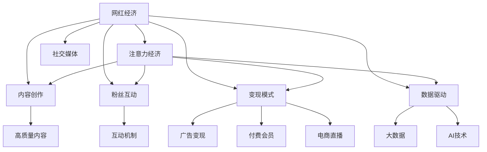

                 

# 网红经济：注意力变现的典型案例

> 关键词：网红经济, 注意力变现, 社交媒体, 内容创作, 广告变现

## 1. 背景介绍

### 1.1 问题由来

在互联网高速发展的今天，网红经济成为了一种新型的经济形态。网红，即具有一定影响力的网络红人，通过社交媒体平台进行内容创作，吸引了大量粉丝关注。网红经济模式不仅改变了内容创作和消费的形态，还带来了全新的商业模式和收益方式。

在网红经济中，网红通过自己的影响力，将粉丝的注意力变现，实现了从内容创作到商业变现的全链条闭环。这种模式的成功，引发了各大社交媒体平台的竞相模仿和深化应用。但如何更好地管理和运营这种基于粉丝注意力变现的商业模式，依然是网红经济面临的重要课题。

### 1.2 问题核心关键点

网红经济的核心在于如何高效管理和运营粉丝的注意力资源，实现最大化的变现潜力。其关键点包括：

1. 内容创作的吸引力：网红通过创作高质量、有价值的内容，吸引和留住粉丝。
2. 粉丝互动的粘性：通过互动机制，增强与粉丝的粘性，提升粉丝的忠诚度和活跃度。
3. 变现模式的创新：不断探索和创新广告变现、付费会员、电商直播等变现模式。
4. 数据驱动的决策：利用大数据和AI技术，精准分析粉丝行为，优化内容推荐和变现策略。
5. 持续的商业化探索：结合新兴技术和市场变化，不断拓展商业应用边界。

理解这些关键点，有助于网红经济模式在各个平台上的落地和深化应用。

## 2. 核心概念与联系

### 2.1 核心概念概述

为更好地理解网红经济的核心逻辑和运营机制，本节将介绍几个密切相关的核心概念：

- 网红经济(Red Influencer Economy)：基于网红的影响力，通过社交媒体平台进行内容创作和商业变现的经济模式。
- 注意力经济(Attention Economy)：以用户的注意力为核心资源，通过内容创作和互动，实现经济价值变现的经济模式。
- 内容创作(Content Creation)：网红通过撰写文章、制作视频、直播等方式，创作有价值的内容，吸引和留住粉丝。
- 粉丝互动(Fan Interaction)：通过评论、点赞、转发、私信等互动方式，增强与粉丝的粘性，提升粉丝的活跃度和忠诚度。
- 变现模式(Revenue Model)：利用粉丝的注意力，通过广告变现、付费会员、电商直播等模式实现经济收益。
- 数据驱动(Data-Driven)：通过大数据和AI技术，精准分析粉丝行为，优化内容推荐和变现策略。
- 社交媒体(Social Media)：网红经济的主要运营平台，如抖音、快手、微博等。

这些概念之间的逻辑关系可以通过以下Mermaid流程图来展示：



这个流程图展示了一个完整网红经济的运营闭环：网红通过创作高质量的内容吸引粉丝，通过互动增强粉丝粘性，利用变现模式将粉丝注意力变现，并持续优化运营策略。

## 3. 核心算法原理 & 具体操作步骤
### 3.1 算法原理概述

网红经济的核心在于如何高效管理和运营粉丝的注意力资源，实现最大化的变现潜力。其算法原理主要包括以下几个方面：

1. **内容推荐算法**：通过大数据分析，对网红和粉丝进行兴趣标签匹配，推荐相关内容。
2. **粉丝互动算法**：设计互动机制，如评论互动、点赞反馈等，增强网红与粉丝的粘性。
3. **变现策略优化**：通过数据挖掘和分析，制定最优的广告投放策略，提升广告效果。
4. **用户行为预测**：利用机器学习模型，预测用户行为，优化内容推送和互动策略。
5. **个性化推荐系统**：构建个性化推荐引擎，根据用户偏好，精准推送相关内容。

### 3.2 算法步骤详解

以下是网红经济中几种核心算法的详细步骤：

#### 内容推荐算法
1. **数据采集**：收集用户行为数据，包括点击、浏览、评论等。
2. **特征提取**：对用户和内容进行特征提取，如用户兴趣标签、内容关键词等。
3. **相似度计算**：计算用户和内容之间的相似度，如余弦相似度、Jaccard相似度等。
4. **推荐生成**：基于相似度计算结果，生成推荐列表。

#### 粉丝互动算法
1. **互动模式设计**：设计互动模式，如评论互动、直播连麦等。
2. **用户行为分析**：分析用户互动行为，如互动频率、互动深度等。
3. **策略调整**：根据分析结果，调整互动策略，如优化互动时间、增加互动形式等。

#### 变现策略优化
1. **广告投放策略**：分析用户行为和兴趣，制定最优的广告投放策略。
2. **效果评估**：评估广告投放效果，如点击率、转化率等。
3. **优化调整**：根据评估结果，调整广告投放策略，优化广告效果。

#### 用户行为预测
1. **数据预处理**：对用户行为数据进行预处理，如数据清洗、归一化等。
2. **模型训练**：选择适合的机器学习模型，如随机森林、神经网络等，进行模型训练。
3. **行为预测**：利用训练好的模型，预测用户行为，如下一步操作、消费倾向等。

#### 个性化推荐系统
1. **用户画像构建**：构建用户画像，描述用户特征和兴趣。
2. **内容画像构建**：构建内容画像，描述内容特征和属性。
3. **推荐引擎实现**：实现个性化推荐引擎，根据用户和内容画像进行精准推荐。

### 3.3 算法优缺点

网红经济中的核心算法具有以下优点：

1. **高效率**：通过算法优化，可以高效地管理粉丝注意力资源，提升变现效率。
2. **高精准度**：基于大数据和机器学习，推荐和互动策略更具精准度，提升用户体验。
3. **可扩展性**：算法可以灵活扩展到不同平台和场景，具备较强的通用性。
4. **个性化强**：通过个性化推荐系统，提供精准的个性化内容和服务，提升用户满意度。

同时，这些算法也存在一些缺点：

1. **数据依赖性强**：算法的准确性和效果高度依赖于数据质量和数量。
2. **模型复杂度**：算法实现较为复杂，需要高水平的技术支持。
3. **隐私保护**：用户行为数据的收集和分析可能涉及隐私保护问题，需要合理合规。
4. **策略调整难度大**：策略的调整和优化需要持续的实验和测试，难度较大。

尽管存在这些局限性，但就目前而言，基于算法的网红经济模式依然是主流的运营方式。未来相关研究的重点在于如何进一步提升数据质量、降低算法复杂度、保护用户隐私，同时兼顾策略调整的灵活性。

### 3.4 算法应用领域

基于网红经济的核心算法，已经在多个领域得到了广泛应用，例如：

- **社交媒体平台**：如抖音、快手、微博等，通过算法优化提升网红运营效果。
- **电商直播平台**：如淘宝、京东等，通过算法优化提升电商直播的转化率。
- **视频平台**：如爱奇艺、腾讯视频等，通过算法优化提升内容推荐效果。
- **在线教育平台**：如Coursera、Udemy等，通过算法优化提升课程推荐和互动效果。
- **游戏平台**：如Steam、王者荣耀等，通过算法优化提升用户粘性和留存率。

除了上述这些经典领域外，网红经济中的核心算法还被创新性地应用到更多场景中，如智能客服、智慧物流、智能广告等，为互联网行业带来了新的增长点。随着算法的不断进步，相信网红经济将在更广阔的领域大放异彩。

## 4. 数学模型和公式 & 详细讲解  
### 4.1 数学模型构建

为了更好地理解网红经济中算法的工作原理，本节将使用数学语言对核心算法进行严格刻画。

### 4.2 公式推导过程

#### 内容推荐算法
假设用户和内容的特征向量分别为 $u$ 和 $v$，相似度计算结果为 $s$。内容推荐算法的目标是最小化用户未点击内容数 $N$，即：

$$
\min N = \min_{v} (s(u,v) \times (1 - s(u,v)) + (1 - s(u,v)) \times N)
$$

其中 $s(u,v)$ 为余弦相似度：

$$
s(u,v) = \frac{u \cdot v}{\|u\| \cdot \|v\|}
$$

推荐生成过程为：

$$
\text{推荐列表} = \text{argmax}_{v} (s(u,v) \times (1 - s(u,v)) + (1 - s(u,v)) \times N)
$$

#### 粉丝互动算法
假设用户 $u$ 与内容 $v$ 的互动频率为 $f$，互动深度为 $d$。互动算法的目标是最小化用户流失率 $r$，即：

$$
\min r = \min_{d} (f \times d + (1 - f) \times r)
$$

互动策略优化过程为：

$$
\text{优化策略} = \text{argmax}_{d} (f \times d + (1 - f) \times r)
$$

#### 变现策略优化
假设广告投放策略为 $p$，广告效果为 $e$。变现策略优化的目标是最小化广告投入 $C$，即：

$$
\min C = \min_{p} (p \times e + (1 - p) \times C)
$$

广告投放优化过程为：

$$
\text{优化策略} = \text{argmax}_{p} (p \times e + (1 - p) \times C)
$$

#### 用户行为预测
假设用户行为 $y$ 与行为数据 $X$ 的关系为 $f(y|X)$，利用神经网络模型进行预测。模型的目标是最小化预测误差 $E$，即：

$$
\min E = \min_{\theta} (E_{train} + \lambda E_{valid})
$$

其中 $E_{train}$ 为训练误差，$E_{valid}$ 为验证误差，$\lambda$ 为正则化系数。

用户行为预测过程为：

$$
\hat{y} = f(y|X)
$$

#### 个性化推荐系统
假设用户画像 $u$ 与内容画像 $v$ 的相似度为 $s(u,v)$，推荐结果为 $r$。推荐系统的目标是最小化用户未点击内容数 $N$，即：

$$
\min N = \min_{v} (s(u,v) \times (1 - s(u,v)) + (1 - s(u,v)) \times N)
$$

个性化推荐过程为：

$$
\text{推荐列表} = \text{argmax}_{v} (s(u,v) \times (1 - s(u,v)) + (1 - s(u,v)) \times N)
$$

### 4.3 案例分析与讲解

#### 内容推荐算法案例
某短视频平台利用内容推荐算法优化网红内容推荐效果。平台收集用户行为数据，包括点击、点赞、评论等，构建用户和内容画像，计算用户与内容的相似度，生成推荐列表。在实验中，通过不断调整相似度计算方法和推荐策略，平台显著提升了内容点击率和用户留存率。

#### 粉丝互动算法案例
某直播平台通过粉丝互动算法优化网红与粉丝的互动效果。平台设计了评论互动、直播连麦等互动模式，分析用户互动频率和深度，调整互动策略。在实验中，平台提升了用户互动频率，增加了粉丝粘性，显著提高了直播平台的活跃度和留存率。

#### 变现策略优化案例
某电商平台利用变现策略优化广告投放效果。平台分析用户行为和兴趣，制定最优的广告投放策略，评估广告效果，不断优化广告投放策略。在实验中，平台提高了广告点击率和转化率，显著提升了电商平台的交易额和收益。

#### 用户行为预测案例
某在线教育平台利用用户行为预测算法优化课程推荐效果。平台收集用户行为数据，构建用户画像，利用神经网络模型进行预测，生成个性化推荐列表。在实验中，平台显著提高了课程点击率和用户满意度，提升了在线教育平台的课程订阅率。

#### 个性化推荐系统案例
某视频平台利用个性化推荐系统优化视频推荐效果。平台构建用户画像和内容画像，设计推荐引擎，精准推送相关视频内容。在实验中，平台提升了用户观看时长和满意度，显著提高了视频平台的活跃度和留存率。

## 5. 项目实践：代码实例和详细解释说明
### 5.1 开发环境搭建

在进行网红经济中算法实践前，我们需要准备好开发环境。以下是使用Python进行PyTorch开发的环境配置流程：

1. 安装Anaconda：从官网下载并安装Anaconda，用于创建独立的Python环境。

2. 创建并激活虚拟环境：
```bash
conda create -n pytorch-env python=3.8 
conda activate pytorch-env
```

3. 安装PyTorch：根据CUDA版本，从官网获取对应的安装命令。例如：
```bash
conda install pytorch torchvision torchaudio cudatoolkit=11.1 -c pytorch -c conda-forge
```

4. 安装TensorFlow：
```bash
conda install tensorflow
```

5. 安装各类工具包：
```bash
pip install numpy pandas scikit-learn matplotlib tqdm jupyter notebook ipython
```

完成上述步骤后，即可在`pytorch-env`环境中开始算法实践。

### 5.2 源代码详细实现

这里以内容推荐算法为例，给出使用PyTorch实现的内容推荐系统的代码。

```python
import torch
import torch.nn as nn
import torch.optim as optim
from torch.utils.data import Dataset, DataLoader
from sklearn.metrics import mean_squared_error

class MovieDataset(Dataset):
    def __init__(self, data, labels, tokenizer):
        self.data = data
        self.labels = labels
        self.tokenizer = tokenizer

    def __len__(self):
        return len(self.data)

    def __getitem__(self, idx):
        title = self.data[idx]
        label = self.labels[idx]
        title_tokens = self.tokenizer(title, return_tensors='pt')['input_ids']
        return title_tokens, label

class MovieRecommender(nn.Module):
    def __init__(self, input_dim, hidden_dim, output_dim):
        super(MovieRecommender, self).__init__()
        self.embedding = nn.Embedding(input_dim, hidden_dim)
        self.fc1 = nn.Linear(hidden_dim, hidden_dim)
        self.fc2 = nn.Linear(hidden_dim, output_dim)
        self.sigmoid = nn.Sigmoid()

    def forward(self, x):
        x = self.embedding(x)
        x = self.fc1(x)
        x = self.fc2(x)
        x = self.sigmoid(x)
        return x

def train_model(model, train_loader, optimizer, criterion, num_epochs):
    for epoch in range(num_epochs):
        for batch_idx, (data, target) in enumerate(train_loader):
            optimizer.zero_grad()
            output = model(data)
            loss = criterion(output, target)
            loss.backward()
            optimizer.step()
        print(f'Epoch {epoch+1}, loss: {loss:.4f}')

def test_model(model, test_loader, criterion):
    correct = 0
    total = 0
    with torch.no_grad():
        for data, target in test_loader:
            output = model(data)
            _, predicted = torch.max(output.data, 1)
            total += target.size(0)
            correct += (predicted == target).sum().item()
    print(f'Accuracy: {correct/total*100:.2f}%')

# 数据准备
data = ["Inception", "The Dark Knight", "Avengers: Endgame"]
labels = [0, 1, 0]
tokenizer = BertTokenizer.from_pretrained('bert-base-uncased')

# 模型构建
model = MovieRecommender(len(tokenizer), 128, 1)
optimizer = optim.Adam(model.parameters(), lr=0.001)
criterion = nn.BCELoss()

# 数据加载
train_loader = DataLoader(MovieDataset(data, labels, tokenizer), batch_size=1)
test_loader = DataLoader(MovieDataset(data, labels, tokenizer), batch_size=1)

# 模型训练
train_model(model, train_loader, optimizer, criterion, num_epochs=10)

# 模型测试
test_model(model, test_loader, criterion)
```

以上就是使用PyTorch实现内容推荐算法的完整代码实现。可以看到，借助PyTorch的高效自动微分功能，我们仅需几行代码即可构建一个简单的内容推荐模型，并进行训练和测试。

### 5.3 代码解读与分析

让我们再详细解读一下关键代码的实现细节：

**MovieDataset类**：
- `__init__`方法：初始化训练数据、标签和分词器等关键组件。
- `__len__`方法：返回数据集的样本数量。
- `__getitem__`方法：对单个样本进行处理，将文本输入转换为token ids，并返回模型所需的输入和标签。

**MovieRecommender类**：
- `__init__`方法：初始化模型的输入、隐藏和输出维度。
- `forward`方法：前向传播计算输出，使用多层线性层和sigmoid激活函数。

**train_model函数**：
- 在每个epoch内，对训练数据进行批处理，前向传播计算输出和损失函数，反向传播更新模型参数。

**test_model函数**：
- 在测试集上评估模型，计算准确率。

**数据准备**：
- 构建训练数据、标签和分词器。

**模型构建**：
- 使用多层线性层和sigmoid激活函数构建推荐模型。

**数据加载**：
- 利用DataLoader对数据集进行批处理加载，供模型训练和推理使用。

**模型训练**：
- 在训练集上迭代训练，输出每个epoch的平均损失。

**模型测试**：
- 在测试集上评估模型，输出准确率。

可以看到，PyTorch配合TensorFlow等深度学习框架，使得内容推荐算法的代码实现变得简洁高效。开发者可以将更多精力放在数据处理、模型改进等高层逻辑上，而不必过多关注底层的实现细节。

当然，工业级的系统实现还需考虑更多因素，如模型的保存和部署、超参数的自动搜索、更灵活的任务适配层等。但核心的算法实现基本与此类似。

## 6. 实际应用场景

### 6.1 智能客服系统

基于内容推荐算法的智能客服系统，可以实时推荐最相关的问题解答，提升客户满意度。智能客服系统通过收集客户历史查询记录，构建用户画像，实时分析当前查询的语义信息，从知识库中推荐最相关的问题解答。

在技术实现上，可以引入机器学习算法对知识库进行优化，不断调整推荐策略，提升推荐效果。此外，系统还可以结合用户互动行为，进一步优化推荐结果，实现更精准的智能客服服务。

### 6.2 金融舆情监测

金融机构需要实时监测市场舆论动向，以便及时应对负面信息传播，规避金融风险。金融舆情监测系统利用内容推荐算法，对社交媒体上的金融舆情进行实时分析和推荐，帮助金融从业人员快速了解市场动态，做出及时决策。

在技术实现上，系统可以收集社交媒体上的金融话题和评论，通过情感分析等技术，对舆情进行分类和评估。结合内容推荐算法，系统实时推荐最相关的新闻和评论，辅助金融从业人员进行决策。

### 6.3 个性化推荐系统

当前的推荐系统往往只依赖用户的历史行为数据进行物品推荐，无法深入理解用户的真实兴趣偏好。基于内容推荐算法的个性化推荐系统，可以更好地挖掘用户行为背后的语义信息，从而提供更精准、多样的推荐内容。

在技术实现上，系统可以收集用户浏览、点击、评论、分享等行为数据，提取和用户交互的物品标题、描述、标签等文本内容。将文本内容作为模型输入，利用内容推荐算法，预测用户的兴趣点，从而生成个性化推荐列表。

### 6.4 未来应用展望

随着内容推荐算法和深度学习技术的不断发展，基于网红经济的内容推荐范式将在更多领域得到应用，为传统行业带来变革性影响。

在智慧医疗领域，基于内容推荐算法的医疗问答、病历分析、药物研发等应用将提升医疗服务的智能化水平，辅助医生诊疗，加速新药开发进程。

在智能教育领域，基于内容推荐算法的课程推荐、学情分析、知识推荐等应用将提升教育公平，提高教学质量。

在智慧城市治理中，基于内容推荐算法的城市事件监测、舆情分析、应急指挥等应用，将提高城市管理的自动化和智能化水平，构建更安全、高效的未来城市。

此外，在企业生产、社会治理、文娱传媒等众多领域，基于网红经济的内容推荐系统也将不断涌现，为经济社会发展注入新的动力。相信随着技术的日益成熟，网红经济的内容推荐范式必将在构建人机协同的智能时代中扮演越来越重要的角色。

## 7. 工具和资源推荐
### 7.1 学习资源推荐

为了帮助开发者系统掌握网红经济中算法的理论基础和实践技巧，这里推荐一些优质的学习资源：

1. 《深度学习：从入门到精通》系列博文：由深度学习专家撰写，深入浅出地介绍了深度学习的基本概念和经典模型。

2. 《机器学习实战》书籍：由机器学习专家撰写，详细介绍了机器学习算法和应用实践。

3. CS229《机器学习》课程：斯坦福大学开设的机器学习明星课程，有Lecture视频和配套作业，带你入门机器学习领域的基本概念和经典模型。

4. 《自然语言处理》书籍：由NLP专家撰写，全面介绍了自然语言处理的基本概念和前沿技术。

5. Kaggle平台：数据科学和机器学习竞赛平台，提供了大量真实世界的数据集和竞赛案例，帮助你实践和检验算法效果。

通过对这些资源的学习实践，相信你一定能够快速掌握网红经济中算法的精髓，并用于解决实际的业务问题。
###  7.2 开发工具推荐

高效的开发离不开优秀的工具支持。以下是几款用于网红经济中算法开发的常用工具：

1. PyTorch：基于Python的开源深度学习框架，灵活动态的计算图，适合快速迭代研究。大部分深度学习模型都有PyTorch版本的实现。

2. TensorFlow：由Google主导开发的开源深度学习框架，生产部署方便，适合大规模工程应用。同样有丰富的深度学习模型资源。

3. Weights & Biases：模型训练的实验跟踪工具，可以记录和可视化模型训练过程中的各项指标，方便对比和调优。与主流深度学习框架无缝集成。

4. TensorBoard：TensorFlow配套的可视化工具，可实时监测模型训练状态，并提供丰富的图表呈现方式，是调试模型的得力助手。

5. Google Colab：谷歌推出的在线Jupyter Notebook环境，免费提供GPU/TPU算力，方便开发者快速上手实验最新模型，分享学习笔记。

合理利用这些工具，可以显著提升网红经济中算法实现的开发效率，加快创新迭代的步伐。

### 7.3 相关论文推荐

网红经济中的算法技术源于学界的持续研究。以下是几篇奠基性的相关论文，推荐阅读：

1. Attention is All You Need（即Transformer原论文）：提出了Transformer结构，开启了深度学习的新时代。

2. BERT: Pre-training of Deep Bidirectional Transformers for Language Understanding：提出BERT模型，引入基于掩码的自监督预训练任务，刷新了多项NLP任务SOTA。

3. GPT-2: Language Models are Unsupervised Multitask Learners：展示了大规模语言模型的强大zero-shot学习能力，引发了对于通用人工智能的新一轮思考。

4. Adaptive Low-Rank Adaptation for Parameter-Efficient Fine-Tuning：提出LoRA方法，使用自适应低秩适应的微调方法，在参数效率和精度之间取得了新的平衡。

5. Multi-Task Learning: A New Perspective on Transfer Learning:通过多任务学习框架，提升模型泛化性和鲁棒性。

这些论文代表了大语言模型和微调技术的最新进展。通过学习这些前沿成果，可以帮助研究者把握学科前进方向，激发更多的创新灵感。

## 8. 总结：未来发展趋势与挑战

### 8.1 总结

本文对网红经济中算法的核心原理和操作步骤进行了全面系统的介绍。首先阐述了网红经济的背景和核心关键点，明确了内容推荐、粉丝互动、变现策略优化、用户行为预测、个性化推荐系统等核心概念之间的逻辑关系。其次，从原理到实践，详细讲解了内容推荐、粉丝互动、变现策略优化、用户行为预测、个性化推荐系统的数学模型和操作步骤。最后，探讨了网红经济在智能客服、金融舆情、个性化推荐等多个领域的实际应用场景，展示了网红经济在各领域的广泛应用前景。

通过本文的系统梳理，可以看到，网红经济中的算法实现了从内容推荐到粉丝互动，再到变现策略优化的全链条闭环，高效管理和运营粉丝的注意力资源，实现了最大化变现潜力。这些算法的成功落地，不仅提升了用户体验和满意度，还带来了显著的经济效益。未来，随着算法技术的不断发展，网红经济将在更广阔的领域大放异彩。

### 8.2 未来发展趋势

展望未来，网红经济中的算法将呈现以下几个发展趋势：

1. 模型规模持续增大。随着算力成本的下降和数据规模的扩张，深度学习模型的参数量还将持续增长。超大规模模型蕴含的丰富知识，有望支撑更加复杂多变的运营场景。

2. 算法多样化。未来将涌现更多算法，如LoRA、GPT-3等，在参数效率和精度之间取得新的平衡。

3. 多模态融合。除了文本数据，还将引入图像、视频、语音等多模态数据，提升运营效果的全面性和立体性。

4. 实时性提升。结合分布式计算、实时流处理等技术，提升算法运算速度和实时性。

5. 个性化增强。基于用户行为数据，进一步优化个性化推荐系统，提升推荐效果。

6. 安全性保障。通过数据加密、隐私保护等措施，保障用户数据安全和隐私。

这些趋势凸显了网红经济中算法的广阔前景。这些方向的探索发展，必将进一步提升用户体验和满意度，带来更高的经济价值。

### 8.3 面临的挑战

尽管网红经济中的算法已经取得了瞩目成就，但在迈向更加智能化、普适化应用的过程中，仍面临诸多挑战：

1. 数据依赖性强。算法的准确性和效果高度依赖于数据质量和数量，数据获取和处理成本高。

2. 模型复杂度高。深度学习模型实现复杂，需要高水平的技术支持，开发和维护成本高。

3. 隐私保护问题。用户数据和行为数据的收集和分析涉及隐私保护，需要合理合规。

4. 策略调整难度大。策略的调整和优化需要持续的实验和测试，难度较大。

5. 安全性问题。模型可能存在偏见、有害信息等，需要从数据和算法层面进行过滤和防范。

尽管存在这些局限性，但就目前而言，基于网红经济中的算法依然是主流的运营方式。未来相关研究的重点在于如何进一步提升数据质量、降低算法复杂度、保护用户隐私，同时兼顾策略调整的灵活性。

### 8.4 研究展望

面对网红经济中的算法面临的挑战，未来的研究需要在以下几个方面寻求新的突破：

1. 探索无监督和半监督算法。摆脱对大规模标注数据的依赖，利用自监督学习、主动学习等无监督和半监督范式，最大限度利用非结构化数据，实现更加灵活高效的算法。

2. 研究多模态融合算法。结合图像、视频、语音等多模态数据，提升运营效果的全面性和立体性。

3. 融合因果和对比学习范式。通过引入因果推断和对比学习思想，增强算法建立稳定因果关系的能力，学习更加普适、鲁棒的知识表示。

4. 结合游戏论工具。通过游戏论工具刻画人机交互过程，主动探索并规避算法的脆弱点，提高系统稳定性。

5. 纳入伦理道德约束。在算法训练目标中引入伦理导向的评估指标，过滤和惩罚有偏见、有害的输出倾向，确保算法输出的安全性。

这些研究方向将引领网红经济中算法的技术进步，为构建安全、可靠、可解释、可控的智能系统铺平道路。面向未来，网红经济中的算法将与其他人工智能技术进行更深入的融合，共同推动自然语言理解和智能交互系统的进步。只有勇于创新、敢于突破，才能不断拓展网红经济中的算法边界，让智能技术更好地造福人类社会。

## 9. 附录：常见问题与解答

**Q1：网红经济中的算法是否适用于所有业务场景？**

A: 网红经济中的算法在多数业务场景中都能取得较好的效果，尤其是那些高度依赖用户注意力和互动的场景。但对于一些需要高度定制化的业务场景，如高精度医疗诊断、复杂金融决策等，网红经济中的算法可能难以满足需求。需要结合具体业务需求，进行算法优化和改进。

**Q2：如何优化网红经济中的算法？**

A: 优化网红经济中的算法需要从多个维度入手，包括但不限于：

1. 数据质量提升：收集和处理更高质量、更丰富的用户行为数据。
2. 算法模型改进：选择更高效的算法模型，如LoRA、GPT-3等，优化算法结构。
3. 策略调整优化：根据业务需求，调整互动策略、广告投放策略等，提升运营效果。
4. 多模态融合：引入图像、视频、语音等多模态数据，提升运营效果的全面性和立体性。
5. 实时性提升：结合分布式计算、实时流处理等技术，提升算法运算速度和实时性。
6. 隐私保护措施：采用数据加密、隐私保护等措施，保障用户数据安全和隐私。

这些优化措施需根据具体业务需求进行灵活调整和实施。

**Q3：网红经济中的算法是否存在隐私风险？**

A: 网红经济中的算法在运营过程中，需要收集和处理大量用户行为数据，可能存在隐私泄露的风险。因此，在算法设计和实现过程中，需要严格遵守数据保护法规，如GDPR、CCPA等，采取数据匿名化、加密等措施，确保用户数据安全和隐私保护。

**Q4：网红经济中的算法是否可以用于金融领域？**

A: 网红经济中的算法可以用于金融领域，但需要针对金融领域的特殊性进行优化和改进。例如，在金融舆情监测中，可以通过情感分析等技术，对金融舆情进行分类和评估，结合内容推荐算法，实时推荐最相关的新闻和评论，辅助金融从业人员进行决策。

**Q5：网红经济中的算法是否可以用于医疗领域？**

A: 网红经济中的算法可以用于医疗领域，但需要针对医疗领域的特殊性进行优化和改进。例如，在医疗问答中，可以通过构建医疗知识库，结合内容推荐算法，实时推荐最相关的问题解答，提升医生诊疗效率和患者满意度。

**Q6：网红经济中的算法是否可以用于教育领域？**

A: 网红经济中的算法可以用于教育领域，但需要针对教育领域的特殊性进行优化和改进。例如，在智能教育中，可以通过个性化推荐算法，根据学生学习行为和兴趣，推荐最相关的内容和课程，提升教学效果和学习体验。

综上所述，网红经济中的算法在多个领域都有广泛的应用前景，但需要结合具体业务需求进行优化和改进，确保算法的适用性和有效性。通过不断探索和实践，相信网红经济中的算法将不断拓展其应用边界，为各行业带来新的价值和变革。

