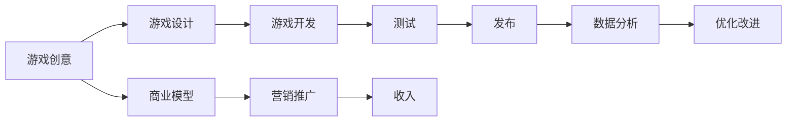

                 

# 网络游戏创业：虚拟世界的商业价值

> 关键词：网络游戏,虚拟经济,用户体验,数据驱动,游戏开发,商业模型

## 1. 背景介绍

### 1.1 问题由来
近年来，随着科技的进步和互联网的普及，网络游戏行业经历了飞速发展。据统计，全球游戏市场规模逐年增长，特别是移动游戏的兴起，让许多人投身于这一领域。然而，网络游戏创业并非易事，高昂的开发成本、严峻的市场竞争、用户流失率高等问题，使得众多创业者折戟沉沙。

如何构建一个具有强大吸引力和商业潜力的网络游戏？本文旨在通过分析虚拟世界的商业价值，探讨不同角度的创新思路，为网络游戏创业者提供可行的策略。

## 2. 核心概念与联系

### 2.1 核心概念概述

- 网络游戏（Online Game）：指玩家通过网络连接，与远端服务器互动，参与各种游戏活动的电子游戏。
- 虚拟经济（Virtual Economy）：指在虚拟世界中进行的经济活动，如购买虚拟物品、参与虚拟交易等。
- 用户体验（User Experience, UX）：指用户在使用产品时的主观感受，包括操作便捷性、视觉美观性、交互流畅性等。
- 数据驱动（Data-Driven）：指以数据为依据，通过数据分析优化产品和服务的过程。
- 游戏开发（Game Development）：指从构思到发布的全过程，包括游戏设计、程序实现、测试等环节。
- 商业模型（Business Model）：指为实现游戏盈利，采取的商业模式和运营策略。

这些概念相互关联，共同构成了游戏创业的生态体系。

### 2.2 核心概念原理和架构的 Mermaid 流程图



## 3. 核心算法原理 & 具体操作步骤
### 3.1 算法原理概述

游戏开发和运营是一个复杂且高度迭代的过程，涉及游戏设计、开发、测试、推广、数据反馈等环节。其核心算法原理主要包括以下几个方面：

1. **游戏设计**：通过用户调研和竞品分析，明确游戏目标、玩法、角色、世界观等关键要素，设计出具有竞争力的游戏。
2. **游戏开发**：采用引擎（如Unity、Unreal）和编程语言（如C#、C++），将游戏设计转化为可运行的代码和资产。
3. **测试**：通过自动化测试和用户测试，发现并修复游戏中的bug，确保游戏质量。
4. **数据分析**：收集用户行为数据，通过统计分析和机器学习，提取有价值的洞察，指导游戏优化。
5. **优化改进**：根据数据分析结果，迭代改进游戏内容和机制，提升用户体验。
6. **商业模型**：设计合理的盈利模式，如内购、广告、订阅等，确保游戏收入。
7. **营销推广**：通过社交媒体、广告、合作营销等方式，吸引和留住用户。

这些步骤是相辅相成的，每个环节都可能对最终的游戏成功产生关键影响。

### 3.2 算法步骤详解

#### 3.2.1 游戏设计

游戏设计是游戏的灵魂，需要充分考虑用户需求和市场趋势。

1. **市场调研**：了解目标用户群体，关注竞品游戏，分析用户反馈，寻找创新点。
2. **玩法设计**：确定游戏核心玩法，设计游戏规则和机制。
3. **角色和世界观**：设计游戏角色、故事线和世界观，确保游戏内容丰富、情节吸引人。
4. **迭代测试**：通过A/B测试等方法，不断优化游戏玩法和内容，确保用户满意。

#### 3.2.2 游戏开发

游戏开发是游戏实现的第一步，需要高效、可靠的技术支持。

1. **引擎选择**：选择合适的游戏引擎，如Unity、Unreal、Cocos等。
2. **编程语言**：确定编程语言，如C#、C++、Lua等。
3. **资源制作**：制作游戏角色、场景、音效等资产，确保高质量、高效率。
4. **代码优化**：优化代码性能，减少资源消耗，提升游戏运行流畅度。

#### 3.2.3 测试

测试是发现和修复游戏bug的关键环节。

1. **单元测试**：对代码和算法进行单元测试，确保功能正确。
2. **集成测试**：对系统模块进行集成测试，确保模块间协同工作。
3. **用户测试**：邀请目标用户进行测试，收集用户反馈。
4. **性能测试**：测试游戏性能，确保在高负荷下稳定运行。

#### 3.2.4 数据分析

数据分析是优化游戏的重要依据。

1. **数据收集**：通过日志、用户行为记录等方式，收集用户数据。
2. **数据清洗**：清洗和整理数据，确保数据准确性。
3. **统计分析**：使用统计方法分析用户行为，提取有价值的信息。
4. **机器学习**：使用机器学习模型预测用户行为，优化游戏内容。

#### 3.2.5 优化改进

优化改进是提升游戏品质的重要手段。

1. **UI/UX优化**：优化用户界面和交互体验，提升操作便捷性。
2. **内容更新**：定期更新游戏内容和角色，保持游戏新鲜感。
3. **系统优化**：优化游戏系统性能，提升运行效率。
4. **社区互动**：增强社区互动，提升用户粘性。

#### 3.2.6 商业模型

商业模型是游戏盈利的关键。

1. **内购模式**：通过售卖虚拟物品、道具等方式，获取收入。
2. **广告模式**：通过展示广告，获取广告收入。
3. **订阅模式**：用户购买游戏订阅服务，获取持续收入。
4. **免费模式**：提供免费版本，通过广告、内购等方式获利。

#### 3.2.7 营销推广

营销推广是吸引用户的关键。

1. **社交媒体推广**：利用社交媒体平台，吸引用户关注。
2. **广告推广**：通过搜索引擎广告、社交媒体广告等推广游戏。
3. **合作营销**：与大公司合作，扩大游戏知名度。
4. **内容营销**：通过游戏评测、用户故事等方式，提升游戏曝光度。

### 3.3 算法优缺点

#### 3.3.1 优点

1. **灵活性高**：游戏设计和开发高度灵活，可以根据市场反馈进行调整。
2. **用户粘性强**：通过不断优化内容和机制，提升用户体验，增强用户粘性。
3. **数据分析能力强**：通过大数据分析，可以精准了解用户需求，优化游戏设计。
4. **盈利模式多样**：内购、广告、订阅等多种盈利模式，可以灵活应对市场变化。

#### 3.3.2 缺点

1. **开发成本高**：游戏开发需要投入大量时间和资金，风险较大。
2. **市场竞争激烈**：市场竞争激烈，游戏失败的可能性较高。
3. **用户流失率高**：用户流失率高，需要不断吸引新用户。
4. **迭代速度快**：游戏迭代速度快，需要持续投入人力和技术支持。

### 3.4 算法应用领域

基于以上算法原理和操作步骤，游戏创业可以应用于多个领域，包括但不限于：

1. **移动游戏**：开发适合手机和平板设备的移动游戏，如卡牌、策略、射击等。
2. **PC游戏**：开发适合PC设备的游戏，如MMORPG、角色扮演等。
3. **游戏平台**：搭建游戏平台，提供游戏下载、社交互动等功能。
4. **虚拟现实游戏**：开发虚拟现实游戏，提升沉浸感。
5. **增强现实游戏**：开发增强现实游戏，增强互动性。

## 4. 数学模型和公式 & 详细讲解  
### 4.1 数学模型构建

假设一款游戏共有N个用户，每个用户每天使用游戏时间为T小时，每个用户每天消费金额为C元，则总消费金额为：

$$
\text{总消费金额} = N \times T \times C
$$

通过数据分析，可以估算不同游戏的用户数量、使用时间和消费金额，从而计算总消费金额。

### 4.2 公式推导过程

1. **用户数量估算**：通过游戏市场调研和用户行为数据，估算游戏用户数量N。
2. **使用时间估算**：通过用户行为记录和A/B测试，估算每个用户每天使用游戏时间T。
3. **消费金额估算**：通过用户消费记录和收入分成比例，估算每个用户每天消费金额C。
4. **总消费金额计算**：根据上述公式计算总消费金额。

### 4.3 案例分析与讲解

以《王者荣耀》为例，分析其用户数量、使用时间和消费金额。

- **用户数量**：根据官方数据，《王者荣耀》月活跃用户数达1亿以上。
- **使用时间**：平均每局游戏时间约为10分钟，用户每天使用时间约为2小时。
- **消费金额**：根据苹果应用市场数据，《王者荣耀》内购收入占据重要比例。

## 5. 项目实践：代码实例和详细解释说明
### 5.1 开发环境搭建

使用Python和Unity进行游戏开发。

1. **Python环境**：安装Python 3.x，并配置虚拟环境。
2. **Unity环境**：安装Unity 2019或更高版本，并创建项目。
3. **开发工具**：安装Visual Studio、VSCode、Git等开发工具。
4. **数据管理**：使用Amazon S3、AWS RDS等云服务，管理游戏数据。

### 5.2 源代码详细实现

1. **游戏设计**：使用Unity的UI设计工具，设计游戏界面和交互逻辑。
2. **游戏开发**：使用C#语言编写游戏逻辑和行为，确保游戏性能。
3. **测试**：使用Unity的测试工具，进行自动化和手动测试，发现并修复bug。
4. **数据分析**：使用Unity Analytics，收集用户数据，进行统计分析。
5. **优化改进**：根据数据分析结果，进行UI/UX优化和内容更新。
6. **商业模型**：通过Unity广告网络、Unity Asset Store等方式，获取内购和广告收入。
7. **营销推广**：使用Facebook、Google Ads等平台，推广游戏。

### 5.3 代码解读与分析

以下是使用Python和Unity进行游戏开发的示例代码：

```python
# 示例代码：Python脚本，用于统计游戏内购收入

import requests
from bs4 import BeautifulSoup

# 获取内购数据
url = 'https://store.en.gamingcircle.com/download/545/545.html'
response = requests.get(url)
soup = BeautifulSoup(response.text, 'html.parser')
data = soup.find('div', {'class': 'custom-block__content'}).text.split('\n')
income = sum([int(x.strip().replace(',', '')) for x in data[1:]])

print(f'内购收入：{income}元')
```

```csharp
// 示例代码：C#脚本，用于优化游戏UI/UX

using UnityEngine;
using UnityEngine.UI;

public class UIOptimization : MonoBehaviour
{
    public GameObject button;
    public Color normalColor;
    public Color hoverColor;
    public Color pressedColor;

    void Update()
    {
        if (Input.GetMouseButtonDown(0))
        {
            button.GetComponent<Button>().normalColor = normalColor;
            button.GetComponent<Button>().hoverColor = hoverColor;
            button.GetComponent<Button>().pressedColor = pressedColor;
        }
    }
}
```

## 6. 实际应用场景
### 6.4 未来应用展望

### 6.4.1 移动游戏

移动游戏将成为未来游戏市场的重要组成部分。通过移动平台的多样性和便利性，游戏能够覆盖更广泛的受众，吸引更多年轻用户。

### 6.4.2 PC游戏

PC游戏市场仍在持续增长，高画质和高帧率的游戏需求日益增长，未来将涌现更多高质量PC游戏。

### 6.4.3 虚拟现实游戏

虚拟现实技术的发展将推动虚拟现实游戏的普及，提升用户体验和互动性。

### 6.4.4 增强现实游戏

增强现实技术将带来新的互动方式，增强游戏的沉浸感和趣味性。

## 7. 工具和资源推荐
### 7.1 学习资源推荐

1. **《游戏开发》课程**：Coursera上的《游戏开发基础》课程，涵盖游戏设计和开发的基础知识。
2. **《Unity教程》**：Unity官网提供的大量教程，包括游戏开发、引擎使用等。
3. **《数据分析》课程**：Coursera上的《数据科学导论》课程，涵盖数据分析和统计学知识。
4. **《商业模型》书籍**：《游戏行业商业模式》一书，详细介绍游戏行业不同的商业模式和运营策略。
5. **《市场营销》课程**：Coursera上的《数字营销》课程，涵盖社交媒体、广告等营销知识。

### 7.2 开发工具推荐

1. **Unity**：全球最流行的游戏引擎之一，支持多平台开发，功能强大。
2. **Unreal Engine**：业界领先的3D游戏引擎，支持高质量渲染和复杂游戏场景。
3. **Cocos2d-x**：适用于移动平台的游戏引擎，易于上手。
4. **Git**：版本控制工具，适用于团队协作和代码管理。
5. **Visual Studio**：适用于Windows平台的游戏开发工具，支持C#编程。

### 7.3 相关论文推荐

1. **《游戏用户行为分析》**：研究游戏用户行为，分析用户流失原因，提出改进措施。
2. **《游戏收入预测模型》**：提出基于用户行为数据的收入预测模型，预测游戏未来的收入。
3. **《游戏经济系统设计》**：分析虚拟经济系统，提出游戏内经济系统设计方案。

## 8. 总结：未来发展趋势与挑战
### 8.1 研究成果总结

本文系统分析了网络游戏创业的各个环节，探讨了虚拟世界的商业价值。通过理论分析和实践经验，提出了游戏的开发、设计、测试、数据分析、优化改进、商业模型和营销推广等关键步骤。

### 8.2 未来发展趋势

1. **技术革新**：人工智能、云计算、区块链等技术将进一步推动游戏技术的发展，提升游戏体验和运营效率。
2. **用户需求多样化**：用户需求多样化，游戏开发者需要不断创新，提供多样化的游戏内容和玩法。
3. **全球化市场**：全球游戏市场潜力巨大，游戏开发者需要考虑国际化和本地化，拓展市场。
4. **跨平台游戏**：跨平台游戏将成为未来趋势，游戏开发者需要开发跨平台兼容的游戏。

### 8.3 面临的挑战

1. **市场竞争激烈**：游戏市场竞争激烈，游戏开发者需要不断创新，提升游戏质量。
2. **技术难度高**：游戏开发技术难度高，需要投入大量时间和资金。
3. **用户留存难**：用户留存率低，需要不断优化游戏内容和玩法，提升用户粘性。
4. **法律和伦理问题**：游戏内容涉及伦理和法律问题，需要严格控制。

### 8.4 研究展望

1. **人工智能在游戏中的应用**：人工智能技术将在游戏设计和开发中发挥重要作用，提升游戏体验和运营效率。
2. **游戏内容的创新**：游戏开发者需要不断创新，提供丰富多样的游戏内容，满足用户需求。
3. **全球化市场拓展**：游戏开发者需要考虑国际化和本地化，拓展全球市场。
4. **法律和伦理问题**：游戏开发者需要严格控制游戏内容，遵守相关法律法规，确保游戏安全。

## 9. 附录：常见问题与解答

**Q1：游戏创业的资金投入和风险如何控制？**

A: 游戏创业需要投入大量资金，风险较高。建议进行详细市场调研，制定合理的预算和成本控制方案，合理分配资源。

**Q2：如何评估游戏商业模型的可行性？**

A: 可以通过市场调研和用户调研，了解目标市场和用户需求，评估不同商业模型的可行性。

**Q3：如何提升游戏用户粘性？**

A: 通过优化游戏内容和玩法，提升用户体验，增加互动性，提高用户粘性。

**Q4：游戏数据分析的重要性体现在哪些方面？**

A: 数据分析可以帮助游戏开发者了解用户行为，优化游戏设计，提升游戏质量。

**Q5：游戏开发者需要具备哪些核心能力？**

A: 游戏开发者需要具备游戏设计能力、编程能力、数据分析能力、商业模型设计和运营能力。

---

作者：禅与计算机程序设计艺术 / Zen and the Art of Computer Programming

