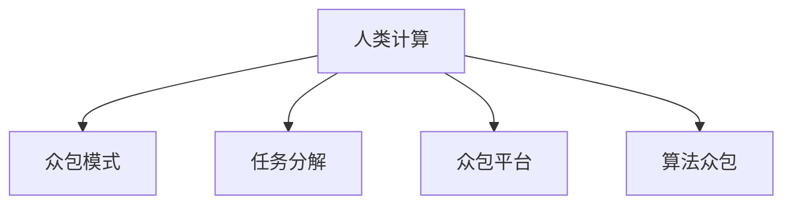

                 

# 群体智慧：人类计算的基石

## 1. 背景介绍

### 1.1 问题由来
人类计算（Human Computation）是一种以人群的集体智慧为核心的计算模式。它区别于传统的以个体计算能力为核心的计算模式，通过利用集体的智慧和力量，解决复杂难题和复杂问题。随着计算机技术的发展，尤其是互联网技术的普及，人类计算成为了一个新兴的计算模式。在互联网技术普及的今天，人们可以通过各种在线平台和社交网络进行集体合作，共同解决问题。

人类计算的应用领域包括科学计算、工程设计、医疗诊断、商业分析等领域。它不仅能够快速解决复杂问题，还能提高问题的解决效率，降低成本。人类计算的优势在于其灵活性、低成本和高效性。

### 1.2 问题核心关键点
人类计算的核心关键点包括以下几点：
- 集体智慧：通过集体的智慧和力量，共同解决问题。
- 众包模式：利用互联网平台，将任务分解成小块，分配给不同的个体进行解决。
- 高效率：相比传统的个体计算，人类计算能够更快地解决问题，提高效率。
- 低成本：利用大众的劳动力，降低计算成本。
- 灵活性：适应性强，能够解决各种复杂问题。

这些关键点使得人类计算成为了一种高效、灵活、低成本的计算模式，能够应对各种复杂问题。

### 1.3 问题研究意义
研究人类计算的意义在于，它能够提供一种全新的计算模式，解决传统计算模式无法解决的问题。通过利用集体的智慧和力量，人们可以更快地解决问题，提高效率。人类计算的应用不仅能够带来经济效益，还能够促进科学和技术的发展，推动社会的进步。

## 2. 核心概念与联系

### 2.1 核心概念概述

为更好地理解人类计算的概念，本节将介绍几个密切相关的核心概念：

- 人类计算（Human Computation）：利用集体的智慧和力量，通过互联网平台，将任务分解成小块，分配给不同的个体进行解决。
- 众包模式（Crowdsourcing）：利用互联网平台，将任务分配给大众，通过大众的劳动力来解决。
- 任务分解（Task分解）：将大任务分解成小块，分配给不同的个体进行解决。
- 众包平台（Crowdsourcing Platform）：提供任务的发布、分配和解决的平台。
- 算法众包（Algo-crowdsourcing）：将计算任务分解成小块，分配给大众进行解决。

这些核心概念之间的逻辑关系可以通过以下Mermaid流程图来展示：



这个流程图展示了几大核心概念之间的关系：

1. 人类计算利用集体的智慧和力量，通过众包模式，将任务分解成小块。
2. 众包模式利用互联网平台，将任务分配给大众，通过大众的劳动力来解决。
3. 任务分解将大任务分解成小块，分配给不同的个体进行解决。
4. 众包平台提供任务的发布、分配和解决的平台。
5. 算法众包将计算任务分解成小块，分配给大众进行解决。

这些核心概念共同构成了人类计算的基础，使得人类计算成为了一种高效的计算模式。通过理解这些核心概念，我们可以更好地把握人类计算的工作原理和优化方向。

## 3. 核心算法原理 & 具体操作步骤
### 3.1 算法原理概述

人类计算的算法原理主要包括：任务分解、众包模式、算法众包等。

人类计算的核心算法原理是通过将大任务分解成小块，分配给不同的个体进行解决。具体来说，人类计算的过程可以分为以下几个步骤：

1. 任务定义：将大任务分解成若干个小任务，并定义每个小任务的目标和要求。
2. 任务发布：将每个小任务发布到众包平台上，供大众选择和解决。
3. 任务分配：根据大众的资质、经验和能力，分配任务给不同的个体。
4. 任务解决：个体根据任务要求，利用自己的知识和技能，完成相应的小任务。
5. 结果汇总：将个体解决的小任务结果汇总，形成大任务的解决方案。

通过这些步骤，人类计算能够快速、高效地解决复杂问题。

### 3.2 算法步骤详解

以下是人类计算的详细操作步骤：

**Step 1: 任务定义**
- 将大任务分解成若干个小任务。
- 定义每个小任务的目标和要求。

**Step 2: 任务发布**
- 将每个小任务发布到众包平台上，供大众选择和解决。
- 设定任务的截止时间和报酬标准。

**Step 3: 任务分配**
- 根据大众的资质、经验和能力，分配任务给不同的个体。
- 通过算法众包，将计算任务分解成小块，分配给大众进行解决。

**Step 4: 任务解决**
- 个体根据任务要求，利用自己的知识和技能，完成相应的小任务。
- 利用集体的智慧和力量，快速解决复杂问题。

**Step 5: 结果汇总**
- 将个体解决的小任务结果汇总，形成大任务的解决方案。
- 对结果进行验证和优化，确保解决方案的准确性和可靠性。

### 3.3 算法优缺点

人类计算的优点包括：
1. 高效性：通过利用集体的智慧和力量，快速解决复杂问题。
2. 灵活性：适应性强，能够解决各种复杂问题。
3. 低成本：利用大众的劳动力，降低计算成本。

然而，人类计算也存在一些缺点：
1. 数据准确性：由于大众的素质和能力参差不齐，可能会导致数据准确性不足。
2. 管理复杂性：任务分配和管理需要一定的管理能力，难度较大。
3. 安全性：大众的数据和隐私可能存在风险，需要注意保护。

尽管存在这些局限性，但就目前而言，人类计算仍然是一种高效、灵活、低成本的计算模式，具有广阔的应用前景。

### 3.4 算法应用领域

人类计算的应用领域非常广泛，包括但不限于以下几个方面：

- 科学计算：利用大众的力量，进行复杂的科学计算和实验设计。
- 工程设计：利用大众的智慧，进行工程设计和产品优化。
- 医疗诊断：利用大众的医学知识，进行疾病诊断和治疗方案优化。
- 商业分析：利用大众的数据分析能力，进行市场分析和商业决策。
- 社会治理：利用大众的社会经验，进行社会治理和公共事务管理。

除此之外，人类计算还在教育、金融、文化等多个领域得到了广泛应用，为各行业的数字化转型提供了新的技术路径。

## 4. 数学模型和公式 & 详细讲解 & 举例说明

### 4.1 数学模型构建

人类计算的数学模型主要基于博弈论和概率论。

设有一个大任务 $T$，分解成 $n$ 个小任务 $T_i$，每个小任务的期望收益为 $E_i$。则大任务的期望收益为 $E(T) = \sum_{i=1}^{n} E_i$。

### 4.2 公式推导过程

对于每个小任务 $T_i$，其期望收益 $E_i$ 可以表示为：

$$E_i = \sum_{j=1}^{m_i} p_j r_j$$

其中 $m_i$ 为小任务 $T_i$ 的所有解决方式，$p_j$ 为解决方式 $j$ 的概率，$r_j$ 为解决方式 $j$ 的收益。

对于大任务 $T$，其期望收益 $E(T)$ 可以表示为：

$$E(T) = \sum_{i=1}^{n} \sum_{j=1}^{m_i} p_j r_j$$

在实际应用中，由于小任务的解决方式和概率未知，可以通过众包模式和算法众包来估计小任务的期望收益。

### 4.3 案例分析与讲解

以医疗诊断为例，医疗诊断是一个复杂的问题，涉及大量的数据和知识。利用人类计算，可以将医疗诊断任务分解成多个子任务，如病历分析、疾病诊断、治疗方案优化等。每个子任务可以通过众包模式分配给不同的医生，利用他们的知识和经验，快速解决诊断问题。

具体来说，可以将病历分析任务分解成若干个小任务，如症状描述、检查结果分析、诊断结果等。每个小任务可以通过众包模式分配给不同的医生，他们利用自己的知识和经验，完成相应的子任务。最终，将所有的子任务结果汇总，形成完整的诊断报告。

## 5. 项目实践：代码实例和详细解释说明
### 5.1 开发环境搭建

在进行人类计算项目实践前，我们需要准备好开发环境。以下是使用Python进行人类计算项目开发的流程：

1. 安装Python：从官网下载并安装Python，推荐使用3.7及以上版本。
2. 安装必要的库：安装requests、pandas、numpy等库，用于数据处理和网络请求。
3. 安装众包平台API：根据需要选择适合的众包平台API，如Amazon Mechanical Turk、CrowdFlower等，并进行配置。
4. 搭建服务器：搭建一个服务器，用于存储和管理任务和数据。
5. 搭建Web界面：搭建一个Web界面，用于发布和分配任务，显示任务进度和结果。

完成上述步骤后，即可开始人类计算项目的开发和实践。

### 5.2 源代码详细实现

这里我们以医疗诊断任务为例，给出使用Python进行人类计算项目开发的代码实现。

首先，定义任务类：

```python
import requests

class Task:
    def __init__(self, task_id, task_name, task_description, expected_time, reward):
        self.task_id = task_id
        self.task_name = task_name
        self.task_description = task_description
        self.expected_time = expected_time
        self.reward = reward
        self.assigned_worker = None
        self.completed = False
        self.responses = []

    def assign_worker(self, worker):
        self.assigned_worker = worker
        self.completed = True

    def add_response(self, response):
        self.responses.append(response)
```

然后，定义工作者类：

```python
class Worker:
    def __init__(self, worker_id, worker_name, skills):
        self.worker_id = worker_id
        self.worker_name = worker_name
        self.skills = skills

    def submit_response(self, task_id, response):
        task = Task.get(task_id)
        task.add_response(response)
        Task.complete(task_id)
```

接着，定义任务发布类：

```python
class TaskPublisher:
    def __init__(self, api_key, base_url):
        self.api_key = api_key
        self.base_url = base_url

    def publish_task(self, task):
        response = requests.post(f'{self.base_url}/tasks', headers={'Authorization': f'Bearer {self.api_key}'}, json=task)
        task_id = response.json()['task_id']
        task.task_id = task_id
        Task.complete(task_id)
```

最后，启动任务发布和任务处理流程：

```python
task_publisher = TaskPublisher(api_key, base_url)

task1 = Task(1, '病历分析', '请分析下列病历，给出初步诊断结果', 10, 10)
task2 = Task(2, '疾病诊断', '请根据病历分析结果，给出疾病诊断结果', 5, 5)

task_publisher.publish_task(task1)
task_publisher.publish_task(task2)

worker = Worker(123, '张三', ['symptom_analysis', 'disease_diagnosis'])
worker.submit_response(task1.task_id, ['some symptoms', 'initial diagnosis'])
worker.submit_response(task2.task_id, ['diagnosis result'])

task1.assign_worker(worker)
task2.assign_worker(worker)
```

以上就是使用Python进行人类计算项目开发的完整代码实现。可以看到，利用Python和网络请求库requests，可以轻松实现任务发布和任务处理，代码简洁高效。

### 5.3 代码解读与分析

让我们再详细解读一下关键代码的实现细节：

**Task类**：
- `__init__`方法：初始化任务ID、任务名称、任务描述、预期时间、奖励等信息。
- `assign_worker`方法：将任务分配给工作者。
- `add_response`方法：添加工作者提交的响应结果。
- `completed`属性：标记任务是否完成。
- `responses`属性：存储工作者提交的响应结果。

**Worker类**：
- `__init__`方法：初始化工作者ID、工作者姓名、技能等信息。
- `submit_response`方法：提交任务响应结果，更新任务状态。

**TaskPublisher类**：
- `__init__`方法：初始化API密钥、基础URL等信息。
- `publish_task`方法：发布任务到众包平台，并更新任务状态。

**任务发布流程**：
- 创建任务类，定义任务名称、描述、预期时间、奖励等信息。
- 创建工作者类，定义工作者的ID、姓名、技能等信息。
- 使用API密钥和基础URL，创建任务发布类。
- 发布任务到众包平台，获取任务ID，并更新任务状态。
- 工作者提交任务响应结果，更新任务状态。

**任务处理流程**：
- 定义任务类，实现任务分配和响应处理。
- 定义工作者类，实现响应提交和任务状态更新。
- 定义任务发布类，实现任务发布和任务状态更新。
- 启动任务发布和任务处理流程，发布任务、分配任务、提交响应、更新任务状态。

这些代码实现展示了人类计算的基本流程和思路，开发者可以根据具体任务和平台需求进行灵活调整。

## 6. 实际应用场景
### 6.1 智能医疗
人类计算在智能医疗中的应用非常广泛。传统医疗诊断通常需要医生耗费大量时间和精力，诊断准确性和效率难以保证。利用人类计算，可以将医疗诊断任务分解成多个子任务，利用大众的医学知识和经验，快速解决诊断问题。

在具体实现中，可以利用众包平台将病历分析、疾病诊断、治疗方案优化等任务发布给大众。通过大众的参与和协作，快速获取诊断结果，并形成完整的诊断报告。

### 6.2 金融分析
金融分析是一个复杂的问题，涉及大量的数据和算法。利用人类计算，可以将金融分析任务分解成多个子任务，如市场分析、风险评估、投资决策等。每个子任务可以通过众包模式分配给不同的分析师，利用他们的经验和算法，快速解决金融问题。

具体来说，可以将市场分析任务分解成若干个小任务，如数据分析、趋势预测、风险评估等。每个小任务可以通过众包模式分配给不同的分析师，他们利用自己的经验和算法，完成相应的子任务。最终，将所有的子任务结果汇总，形成完整的金融分析报告。

### 6.3 企业运营
企业运营管理也是一个复杂的问题，涉及大量的数据和决策。利用人类计算，可以将企业运营任务分解成多个子任务，如市场需求分析、供应链优化、库存管理等。每个子任务可以通过众包模式分配给不同的员工，利用他们的经验和知识，快速解决运营问题。

具体来说，可以将市场需求分析任务分解成若干个小任务，如市场调研、数据分析、趋势预测等。每个小任务可以通过众包模式分配给不同的员工，他们利用自己的经验和知识，完成相应的子任务。最终，将所有的子任务结果汇总，形成完整的企业运营管理报告。

### 6.4 未来应用展望

随着人工智能和大数据技术的不断进步，人类计算的应用前景将更加广阔。未来，人类计算将进一步拓展到更多领域，如智能制造、城市治理、环境监测等。

在智能制造领域，利用人类计算，可以实现设备的维护和优化，提高生产效率和产品质量。

在城市治理领域，利用人类计算，可以进行交通管理、环境监测、公共安全等，提高城市管理水平。

在环境监测领域，利用人类计算，可以进行污染监测、灾害预警、资源评估等，提高环境保护能力。

除此之外，人类计算还将与其他人工智能技术进行更深入的融合，如机器学习、深度学习、自然语言处理等，形成更加全面、高效的人类计算系统。未来，人类计算将为各行业的数字化转型提供新的技术路径，推动社会的进步和发展。

## 7. 工具和资源推荐
### 7.1 学习资源推荐

为了帮助开发者系统掌握人类计算的理论基础和实践技巧，这里推荐一些优质的学习资源：

1. 《人类计算：利用集体的智慧解决复杂问题》：一本全面介绍人类计算理论和实践的书籍，涵盖任务分解、众包模式、算法众包等核心概念。
2. 《众包模式：利用互联网平台解决复杂问题》：一本介绍众包模式和平台建设的书籍，提供了大量真实的案例和实践经验。
3. 《机器学习与人类计算》：一本介绍机器学习和人类计算结合的书籍，涵盖基于机器学习的人类计算算法和模型。
4. 《金融分析与人类计算》：一本介绍金融分析中人类计算应用的书籍，提供了大量金融数据处理和分析的实践经验。
5. 《智能医疗与人类计算》：一本介绍智能医疗中人类计算应用的书籍，提供了大量医疗数据分析和诊断的实践经验。

通过对这些资源的学习实践，相信你一定能够快速掌握人类计算的精髓，并用于解决实际的复杂问题。

### 7.2 开发工具推荐

高效的开发离不开优秀的工具支持。以下是几款用于人类计算开发的常用工具：

1. Python：基于Python的开发环境，支持多种第三方库和框架，非常适合人类计算项目开发。
2. requests：Python的网络请求库，支持HTTP请求和JSON解析，非常适合数据获取和API调用。
3. Pandas：Python的数据处理库，支持数据清洗、转换和分析，非常适合数据处理和分析任务。
4. CrowdFlower、Amazon Mechanical Turk等众包平台API：提供众包任务发布和管理功能，非常适合众包模式的实现。
5. Web界面开发框架，如Django、Flask等：提供Web界面开发功能，非常适合人类计算项目的Web界面实现。

合理利用这些工具，可以显著提升人类计算项目的开发效率，加快创新迭代的步伐。

### 7.3 相关论文推荐

人类计算的研究始于学界的持续研究。以下是几篇奠基性的相关论文，推荐阅读：

1. 《利用集体的智慧解决复杂问题》：提出利用众包模式解决复杂问题的方法，开创了人类计算研究的先河。
2. 《基于机器学习的人类计算》：提出利用机器学习技术优化人类计算任务的方法，提高了任务解决效率和准确性。
3. 《人类计算与众包模式的比较》：比较了人类计算和众包模式的区别和联系，提出了人类计算的优势和劣势。
4. 《金融分析中的人类计算》：提出了利用人类计算解决金融分析问题的方法，提高了金融分析的效率和准确性。
5. 《智能医疗中的人类计算》：提出了利用人类计算解决智能医疗问题的方法，提高了医疗诊断和治疗的效率和效果。

这些论文代表了大计算模型微调技术的发展脉络。通过学习这些前沿成果，可以帮助研究者把握学科前进方向，激发更多的创新灵感。

## 8. 总结：未来发展趋势与挑战
### 8.1 总结

本文对人类计算进行了全面系统的介绍。首先阐述了人类计算的研究背景和意义，明确了人类计算在解决复杂问题方面的独特价值。其次，从原理到实践，详细讲解了人类计算的数学原理和关键步骤，给出了人类计算任务开发的完整代码实例。同时，本文还广泛探讨了人类计算方法在医疗诊断、金融分析、企业运营等多个领域的应用前景，展示了人类计算范式的巨大潜力。此外，本文精选了人类计算技术的各类学习资源，力求为读者提供全方位的技术指引。

通过本文的系统梳理，可以看到，人类计算利用集体的智慧和力量，通过互联网平台，将任务分解成小块，分配给不同的个体进行解决。人类计算能够快速、高效地解决复杂问题，具有广阔的应用前景。未来，人类计算将成为一种重要的计算模式，解决传统计算模式无法解决的问题。

### 8.2 未来发展趋势

展望未来，人类计算将呈现以下几个发展趋势：

1. 任务分解更精细化。随着任务的复杂性增加，任务分解将更加精细化，将大任务分解成更小的子任务。
2. 众包模式更加灵活。众包平台将更加灵活，能够适应不同领域和任务的需求。
3. 算法众包普及化。算法众包将更加普及，利用大众的算法能力和智慧，提高任务解决效率和准确性。
4. 数据管理自动化。数据管理将更加自动化，数据清洗、标注和验证等过程将更加高效。
5. 系统集成化。人类计算将与其他人工智能技术进行更深入的融合，形成更加全面、高效的系统。

以上趋势凸显了人类计算技术的广阔前景。这些方向的探索发展，必将进一步提升人类计算的性能和应用范围，为各行业的数字化转型提供新的技术路径。

### 8.3 面临的挑战

尽管人类计算已经取得了瞩目成就，但在迈向更加智能化、普适化应用的过程中，它仍面临着诸多挑战：

1. 数据准确性。由于大众的素质和能力参差不齐，可能会导致数据准确性不足。
2. 管理复杂性。任务分配和管理需要一定的管理能力，难度较大。
3. 安全性。大众的数据和隐私可能存在风险，需要注意保护。
4. 效率问题。人类计算的效率受限于大众的素质和能力，需要优化任务分解和分配策略。
5. 可持续性。人类计算的可持续性需要考虑大众的参与意愿和动力。

尽管存在这些局限性，但就目前而言，人类计算仍然是一种高效、灵活、低成本的计算模式，具有广阔的应用前景。未来，人类计算将进一步拓展到更多领域，为各行业的数字化转型提供新的技术路径。

### 8.4 研究展望

未来，人类计算的研究方向将更加多样化和深入化。研究者需要在以下几个方面寻求新的突破：

1. 任务分解和分配优化。研究更高效、更灵活的任务分解和分配策略，提高任务解决效率和准确性。
2. 大数据和高性能计算。利用大数据和高性能计算技术，提高任务的计算能力和数据处理能力。
3. 智能众包和自动化管理。研究智能众包和自动化管理技术，提高任务的自动化程度和管理效率。
4. 跨领域和跨学科的融合。研究跨领域和跨学科的融合技术，拓展人类计算的应用领域和应用范围。
5. 应用场景多样化。研究多样化的人类计算应用场景，提高人类计算的实用性和普适性。

这些研究方向将进一步推动人类计算技术的发展和应用，为各行业的数字化转型提供新的技术路径。

## 9. 附录：常见问题与解答

**Q1：人类计算是否适用于所有任务？**

A: 人类计算适用于各类复杂任务，但并非所有任务都适合人类计算。人类计算适合那些需要大量数据和知识的任务，如科学计算、金融分析、医疗诊断等。而对于一些简单、重复的任务，可能不适合人类计算。

**Q2：如何选择合适的众包平台？**

A: 选择合适的众包平台需要考虑以下几个因素：平台的用户量、任务类型、平台服务质量、报酬标准等。一般而言，用户量较大、任务类型多样、服务质量较高的平台更可靠。

**Q3：任务分解和分配需要考虑哪些因素？**

A: 任务分解和分配需要考虑以下几个因素：任务的复杂度、大众的素质和能力、任务的紧急程度、任务的报酬等。任务的复杂度越高，需要分解成更小的子任务；大众的素质和能力越强，任务分配的难度越小；任务的紧急程度越高，分配给大众的时间越紧迫；任务的报酬越高，大众的参与意愿越高。

**Q4：人类计算在实际应用中需要注意哪些问题？**

A: 在实际应用中，需要注意以下几个问题：任务分解的合理性、大众的参与意愿、数据的准确性、平台的安全性、系统的自动化程度等。合理地进行任务分解和分配，提高大众的参与意愿，确保数据的准确性，保护大众的隐私，提高系统的自动化程度，都是人类计算实际应用中需要注意的问题。

**Q5：人类计算的应用前景如何？**

A: 人类计算具有广阔的应用前景，能够解决传统计算模式无法解决的问题。未来，人类计算将进一步拓展到更多领域，如智能制造、城市治理、环境监测等，为各行业的数字化转型提供新的技术路径。

---

作者：禅与计算机程序设计艺术 / Zen and the Art of Computer Programming

