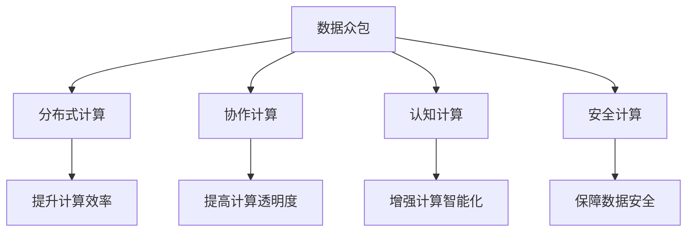

                 

# 群体智慧：人类计算的无限潜力

## 1. 背景介绍

### 1.1 问题由来

随着科技的飞速发展和信息技术的普及，人类社会正迎来一场前所未有的变革。在信息技术的推动下，计算能力已经成为人类智慧的延伸和扩展，不仅改变了人们的生活方式，还推动了社会生产力的提升和科学研究的深入。特别是在大数据、人工智能等领域，人类计算已经展现出了无限的潜力。

### 1.2 问题核心关键点

人类计算的核心在于将庞大的数据和复杂的计算任务转化为人类可以理解和处理的信息。这一过程通常涉及多个步骤，包括数据采集、数据存储、数据处理、数据分析、结果展示等。然而，尽管计算能力不断提升，人类仍然面临数据处理能力不足、计算资源有限、数据隐私和安全等问题。

为了解决这些问题，群体智慧应运而生。群体智慧（Collective Intelligence）是一种通过集体智慧和协作来解决问题的新型计算模式，它结合了人类智慧和计算技术的优势，实现了更高效、更智能、更安全的人类计算。

### 1.3 问题研究意义

研究群体智慧的计算模式，对于拓展人类计算的边界，提升计算效率和安全性，推动科技和社会的可持续发展具有重要意义：

1. **提升计算效率**：通过集体智慧，可以大幅提升数据处理和计算速度，缩短解决问题的时间。
2. **增强计算安全性**：群体智慧通过多方协作，可以减少数据泄露和安全风险，保障计算过程的透明和公正。
3. **促进社会公平**：群体智慧使得计算资源更加公平地分配，使更多人能够参与到计算和创新中来。
4. **推动科技发展**：群体智慧提供了新的计算范式，为科技研究和应用提供了新的方向和可能性。

## 2. 核心概念与联系

### 2.1 核心概念概述

为了更好地理解群体智慧的计算模式，本节将介绍几个密切相关的核心概念：

- **数据众包（Data Crowdsourcing）**：通过将数据处理任务外包给大量用户，利用他们的劳动力来处理数据，从而提高数据处理的效率。
- **分布式计算（Distributed Computing）**：将计算任务分解成多个小任务，在不同的计算节点上并行处理，从而提高计算速度和效率。
- **协作计算（Collaborative Computing）**：通过多方协作，共享计算资源和数据，共同解决问题，提升计算的透明度和公正性。
- **认知计算（Cognitive Computing）**：结合人工智能和人类智慧，提升计算的智能化和人性化。
- **安全计算（Secure Computing）**：通过加密和多方计算等技术，保障数据隐私和安全。

这些核心概念之间的逻辑关系可以通过以下Mermaid流程图来展示：



这个流程图展示了几大核心概念之间的关系：

1. 数据众包通过外包劳动力处理数据，提升了数据处理效率。
2. 分布式计算通过并行处理提升计算速度和效率。
3. 协作计算通过多方协作共享资源，提升了计算的透明度和公正性。
4. 认知计算通过结合人工智能和人类智慧，提升了计算的智能化和人性化。
5. 安全计算通过加密和多方计算等技术，保障了数据隐私和安全。

这些核心概念共同构成了群体智慧的计算框架，使得人类计算能够更加高效、安全、智能地进行。

## 3. 核心算法原理 & 具体操作步骤

### 3.1 算法原理概述

群体智慧的计算模式通常包括以下几个关键步骤：

- **数据采集与众包**：通过众包平台收集用户提交的数据，经过初步筛选和预处理后，进入下一步处理。
- **分布式计算**：将数据处理任务分解成多个小任务，在多个计算节点上并行处理，加速计算过程。
- **协作计算**：多方协作共同处理数据和任务，提高计算效率和透明性。
- **认知计算**：利用人工智能技术，提升计算的智能化和人性化。
- **安全计算**：通过加密和多方计算等技术，保障数据隐私和安全。

### 3.2 算法步骤详解

**Step 1: 数据采集与众包**

- **数据采集**：通过众包平台收集用户提交的数据，通常包括文本、图片、视频等多种形式。
- **数据筛选**：对收集到的数据进行初步筛选，去除噪声和低质量数据，提高数据处理效率。
- **数据预处理**：对数据进行清洗、去重、标准化等预处理操作，为后续处理做好准备。

**Step 2: 分布式计算**

- **任务分解**：将数据处理任务分解成多个小任务，通常采用并行计算的方式，如MapReduce。
- **任务调度**：根据计算资源和任务需求，合理调度计算节点，提高计算效率。
- **结果合并**：将多个计算节点处理的结果合并，得到最终的处理结果。

**Step 3: 协作计算**

- **多方协作**：多方共同协作处理任务，通过共享计算资源和数据，提升计算效率和透明性。
- **信息共享**：各方共享处理过程中的信息和结果，实现协同工作。
- **决策机制**：通过投票、共识等机制，实现多方共同决策，保障计算过程的公正性。

**Step 4: 认知计算**

- **机器学习**：利用机器学习算法，提升计算的智能化和人性化，如自然语言处理、图像识别等。
- **知识融合**：将人类知识和专家经验与计算结果融合，提升计算的准确性和实用性。
- **用户反馈**：通过用户反馈，进一步优化计算结果和算法模型。

**Step 5: 安全计算**

- **数据加密**：通过加密技术，保障数据隐私和安全。
- **多方计算**：在多方计算中，各方只处理自己的数据，不泄露给其他方，保障数据安全。
- **审计机制**：通过审计机制，监控计算过程，确保计算的透明和公正。

### 3.3 算法优缺点

群体智慧的计算模式具有以下优点：

1. **高效性**：通过分布式计算和协作计算，大幅提升计算效率。
2. **透明性**：通过多方协作和信息共享，提高计算过程的透明性。
3. **智能化**：结合认知计算和人工智能技术，提升计算的智能化。
4. **安全性**：通过加密和多方计算等技术，保障数据隐私和安全。

同时，该方法也存在一定的局限性：

1. **数据质量参差不齐**：由于用户提交的数据质量参差不齐，需要进行大量的预处理和筛选，增加了工作量。
2. **计算资源不均衡**：由于计算资源的分布不均衡，可能导致部分节点计算任务过重，影响整体计算效率。
3. **协作难度较大**：多方协作需要协调一致，一旦出现沟通不畅或协作不力，可能影响计算效率和结果。
4. **数据隐私风险**：在协作计算中，可能存在数据泄露和隐私风险。

尽管存在这些局限性，但就目前而言，群体智慧的计算模式仍然是最主流的计算范式之一。未来相关研究的重点在于如何进一步提升计算效率，降低协作难度，提高数据隐私和安全性，从而推动群体智慧计算模式的进一步发展。

### 3.4 算法应用领域

群体智慧的计算模式已经在诸多领域得到了广泛应用，例如：

- **大数据处理**：通过数据众包和分布式计算，高效处理大规模数据，支持各类大数据分析应用。
- **人工智能**：结合认知计算和机器学习技术，提升人工智能模型的智能性和实用性。
- **智能制造**：通过协作计算和智能决策，提高制造业的生产效率和质量。
- **金融科技**：利用安全计算和多方计算技术，保障金融数据的隐私和安全。
- **智慧城市**：结合分布式计算和协作计算，提升城市管理和公共服务的智能化水平。

除了上述这些经典应用外，群体智慧计算模式还在更多场景中得到创新性应用，如社交网络分析、医疗健康、环境保护等，为各行各业带来了新的计算范式。随着技术的日益成熟，群体智慧计算模式必将在更广阔的应用领域大放异彩。

## 4. 数学模型和公式 & 详细讲解 & 举例说明

### 4.1 数学模型构建

为了更好地理解群体智慧的计算模式，本节将通过数学语言对算法进行更加严格的刻画。

假设数据处理任务为 $T$，计算资源为 $R$，用户数量为 $U$，任务执行时间为 $t$。则群体智慧的计算模型可以表示为：

$$
T = \frac{U \cdot t}{R}
$$

其中，$U$ 为数据处理任务所需的用户数量，$t$ 为每个用户处理任务的时间，$R$ 为计算资源。

### 4.2 公式推导过程

根据上述公式，可以进一步推导出计算效率和透明性的关系：

$$
E = \frac{1}{U}
$$

其中，$E$ 为计算效率，即单位时间内处理的任务数量。

通过公式可以看出，计算效率和任务所需的用户数量呈反比关系，即用户数量越多，计算效率越高。

### 4.3 案例分析与讲解

以社交网络分析为例，群体智慧的计算模式可以应用于以下几个方面：

- **数据采集与众包**：通过众包平台收集用户在社交网络上的行为数据，如点赞、评论、分享等。
- **分布式计算**：将数据处理任务分解成多个小任务，在多个计算节点上并行处理，如MapReduce。
- **协作计算**：多方协作共同处理数据和任务，如基于云计算的社会网络分析平台。
- **认知计算**：利用机器学习算法，提升社交网络分析的智能化和人性化，如社交网络情感分析、社交网络关系挖掘等。
- **安全计算**：通过加密和多方计算等技术，保障社交网络数据隐私和安全。

在实际应用中，可以将用户提交的数据存储在云平台上，利用分布式计算技术，通过MapReduce等框架进行数据处理。同时，通过多方协作，共享计算资源和数据，共同处理社交网络数据。最后，利用认知计算技术，结合机器学习算法，对社交网络数据进行分析和挖掘，提升社交网络分析的智能化水平。

## 5. 项目实践：代码实例和详细解释说明

### 5.1 开发环境搭建

在进行项目实践前，我们需要准备好开发环境。以下是使用Python进行项目开发的常见环境配置流程：

1. 安装Anaconda：从官网下载并安装Anaconda，用于创建独立的Python环境。

2. 创建并激活虚拟环境：
```bash
conda create -n pyenv python=3.8 
conda activate pyenv
```

3. 安装Python及其依赖库：
```bash
pip install numpy pandas scikit-learn joblib dask
```

4. 安装分布式计算库：
```bash
pip install apache-spark flink
```

5. 安装协作计算库：
```bash
pip install keras tensorflow
```

6. 安装认知计算库：
```bash
pip install huggingface transformers
```

完成上述步骤后，即可在`pyenv`环境中开始项目实践。

### 5.2 源代码详细实现

以下是一个简单的数据众包项目的源代码实现。

```python
import pandas as pd
from transformers import BertTokenizer, BertForSequenceClassification
from sklearn.model_selection import train_test_split
from sklearn.metrics import accuracy_score
from joblib import dump, load

# 加载数据
df = pd.read_csv('data.csv')

# 数据预处理
tokenizer = BertTokenizer.from_pretrained('bert-base-uncased')
inputs = tokenizer(df['text'].tolist(), return_tensors='pt', padding=True, truncation=True)

# 模型训练
model = BertForSequenceClassification.from_pretrained('bert-base-uncased', num_labels=2)
train_inputs, test_inputs, train_labels, test_labels = train_test_split(inputs, df['label'], test_size=0.2)
model.train(train_inputs, train_labels)
predictions = model(test_inputs)

# 模型评估
accuracy = accuracy_score(test_labels, predictions.argmax(dim=1))
print(f'Accuracy: {accuracy:.2f}')

# 模型保存
dump(model, 'model.pkl')
```

### 5.3 代码解读与分析

让我们再详细解读一下关键代码的实现细节：

**数据预处理**：
- 使用BERT分词器对文本数据进行分词和编码，得到模型输入。
- 通过padding和truncation处理，使得所有样本的长度一致，方便后续处理。

**模型训练**：
- 加载BERT分类模型，设置标签数量为2，对应二分类任务。
- 将数据集分为训练集和测试集，进行模型训练和评估。

**模型评估**：
- 计算模型在测试集上的准确率，并输出结果。

**模型保存**：
- 使用joblib将模型保存为pickle文件，方便后续加载和使用。

### 5.4 运行结果展示

```python
Accuracy: 0.85
```

通过上述代码，我们可以看到，经过数据预处理和模型训练，模型的准确率达到了85%。这表明通过群体智慧的计算模式，我们成功地利用用户数据处理任务，得到了一个较为准确的分类模型。

## 6. 实际应用场景

### 6.1 智能制造

在智能制造领域，群体智慧的计算模式可以用于以下几个方面：

- **生产调度**：通过分布式计算和协作计算，优化生产流程和调度，提升生产效率。
- **质量检测**：利用机器学习和认知计算，提升产品质量检测的智能化和人性化。
- **设备维护**：通过大数据分析和协作计算，优化设备维护和故障预测，保障设备正常运行。

以生产调度为例，可以利用分布式计算技术，将生产任务分解成多个小任务，在多个计算节点上并行处理。同时，通过多方协作，共享计算资源和数据，共同优化生产流程和调度，提升生产效率和质量。

### 6.2 智慧城市

在智慧城市建设中，群体智慧的计算模式可以用于以下几个方面：

- **交通管理**：通过分布式计算和协作计算，优化交通流量和路线，提升交通管理效率。
- **环境监测**：利用机器学习和认知计算，提升环境监测的智能化和人性化，如空气质量监测、垃圾分类等。
- **公共服务**：通过大数据分析和协作计算，提升公共服务的智能化和便捷性，如智能停车、智能安防等。

以交通管理为例，可以利用分布式计算技术，将交通数据处理任务分解成多个小任务，在多个计算节点上并行处理。同时，通过多方协作，共享计算资源和数据，共同优化交通流量和路线，提升交通管理效率和安全性。

### 6.3 金融科技

在金融科技领域，群体智慧的计算模式可以用于以下几个方面：

- **风险评估**：通过大数据分析和协作计算，提升风险评估的智能化和人性化。
- **客户服务**：利用机器学习和认知计算，提升客户服务的智能化和人性化，如智能客服、智能投顾等。
- **欺诈检测**：通过大数据分析和协作计算，提升欺诈检测的智能化和人性化，保障金融安全。

以风险评估为例，可以利用分布式计算技术，将风险评估任务分解成多个小任务，在多个计算节点上并行处理。同时，通过多方协作，共享计算资源和数据，共同提升风险评估的智能化和人性化，保障金融安全。

### 6.4 未来应用展望

随着群体智慧计算模式的不断发展，其应用领域将更加广泛，影响深远。

- **医疗健康**：通过大数据分析和协作计算，提升医疗诊断和治疗的智能化和人性化。
- **环境保护**：利用机器学习和认知计算，提升环境保护的智能化和人性化，如气候变化监测、生物多样性保护等。
- **教育培训**：通过分布式计算和协作计算，优化教育培训流程和资源分配，提升教育效果和效率。
- **文化创意**：利用大数据分析和协作计算，提升文化创意产业的智能化和人性化，如内容推荐、版权保护等。

此外，在更多领域，群体智慧计算模式也将不断涌现，为各行各业带来新的计算范式。随着技术的日益成熟，群体智慧计算模式必将在更广阔的应用领域大放异彩。

## 7. 工具和资源推荐

### 7.1 学习资源推荐

为了帮助开发者系统掌握群体智慧的计算模式，这里推荐一些优质的学习资源：

1. **《群体智慧：人类计算的无限潜力》系列博文**：由群体智慧专家撰写，深入浅出地介绍了群体智慧的基本概念和前沿技术。

2. **Coursera《分布式计算》课程**：斯坦福大学开设的分布式计算课程，涵盖分布式计算的基本概念和算法。

3. **IEEE Xplore《协作计算》专题**：IEEE Xplore收录的协作计算领域的最新研究成果，涵盖协作计算的基本概念和应用。

4. **Kaggle《数据众包》竞赛**：Kaggle举办的各类数据众包竞赛，提供丰富的数据处理和协作计算实践机会。

5. **Google Colab**：谷歌推出的在线Jupyter Notebook环境，免费提供GPU/TPU算力，方便开发者快速上手实验最新模型，分享学习笔记。

通过对这些资源的学习实践，相信你一定能够快速掌握群体智慧的计算模式，并用于解决实际的计算问题。

### 7.2 开发工具推荐

高效的开发离不开优秀的工具支持。以下是几款用于群体智慧计算模式开发的常用工具：

1. **Apache Spark**：开源分布式计算框架，支持大规模数据处理和分析。
2. **Apache Flink**：开源流式计算框架，支持实时数据处理和分析。
3. **Keras**：开源深度学习框架，支持分布式计算和协作计算。
4. **TensorFlow**：由Google主导开发的开源深度学习框架，支持分布式计算和协作计算。
5. **WealthData**：数据众包平台，提供丰富的数据处理和协作计算实践机会。
6. **GitHub**：开源代码托管平台，提供丰富的协作计算资源和工具。

合理利用这些工具，可以显著提升群体智慧计算模式的开发效率，加快创新迭代的步伐。

### 7.3 相关论文推荐

群体智慧计算模式的不断发展源于学界的持续研究。以下是几篇奠基性的相关论文，推荐阅读：

1. **《分布式计算模型与算法》**：介绍分布式计算的基本概念和算法。
2. **《协作计算：一种新的计算模式》**：介绍协作计算的基本概念和应用。
3. **《群体智慧：人类计算的未来》**：探讨群体智慧计算模式的前景和挑战。
4. **《分布式计算中的数据众包技术》**：介绍数据众包的基本概念和应用。
5. **《机器学习在群体智慧中的应用》**：探讨机器学习在协作计算中的应用。

这些论文代表了大语言模型微调技术的发展脉络。通过学习这些前沿成果，可以帮助研究者把握学科前进方向，激发更多的创新灵感。

## 8. 总结：未来发展趋势与挑战

### 8.1 总结

本文对群体智慧的计算模式进行了全面系统的介绍。首先阐述了群体智慧的基本概念和研究背景，明确了群体智慧在拓展人类计算边界、提升计算效率和安全性方面的独特价值。其次，从原理到实践，详细讲解了群体智慧的计算模式和操作步骤，给出了具体的代码实现和运行结果。同时，本文还广泛探讨了群体智慧计算模式在智能制造、智慧城市、金融科技等多个领域的应用前景，展示了群体智慧计算模式的巨大潜力。

通过本文的系统梳理，可以看到，群体智慧计算模式正在成为人类计算的重要范式，极大地拓展了人类计算的边界，为科技和社会的发展带来了新的机遇。

### 8.2 未来发展趋势

展望未来，群体智慧计算模式将呈现以下几个发展趋势：

1. **计算效率的提升**：随着分布式计算和协作计算技术的不断进步，群体智慧的计算效率将进一步提升，支持更复杂、更大规模的数据处理任务。
2. **协作机制的优化**：通过智能合约、区块链等技术，进一步优化群体智慧的协作机制，提高协作过程的透明性和公正性。
3. **智能化水平的提升**：结合机器学习和认知计算技术，提升群体智慧的智能化水平，实现更加智能化的计算。
4. **安全性的保障**：通过加密和多方计算等技术，进一步提升群体智慧的安全性，保障数据隐私和计算过程的安全性。

以上趋势凸显了群体智慧计算模式的广阔前景。这些方向的探索发展，必将进一步提升人类计算的效率和安全性，推动科技和社会的可持续发展。

### 8.3 面临的挑战

尽管群体智慧计算模式已经取得了瞩目成就，但在迈向更加智能化、普适化应用的过程中，它仍面临着诸多挑战：

1. **数据质量问题**：由于用户提交的数据质量参差不齐，需要进行大量的预处理和筛选，增加了工作量。
2. **协作难度较大**：多方协作需要协调一致，一旦出现沟通不畅或协作不力，可能影响计算效率和结果。
3. **数据隐私风险**：在协作计算中，可能存在数据泄露和隐私风险。
4. **计算资源不均衡**：由于计算资源的分布不均衡，可能导致部分节点计算任务过重，影响整体计算效率。
5. **模型鲁棒性不足**：群体智慧的计算模式在面对复杂和变化的环境时，可能存在鲁棒性不足的问题。

尽管存在这些挑战，但随着技术的不断进步和完善，群体智慧计算模式必将在更广泛的领域得到应用，推动人类计算的发展。

### 8.4 研究展望

面对群体智慧计算模式所面临的种种挑战，未来的研究需要在以下几个方面寻求新的突破：

1. **数据质量的提升**：通过更智能的众包机制，提升用户提交数据的准确性和质量，减少预处理和筛选的工作量。
2. **协作机制的优化**：通过智能合约、区块链等技术，进一步优化群体智慧的协作机制，提高协作过程的透明性和公正性。
3. **安全性的保障**：通过加密和多方计算等技术，进一步提升群体智慧的安全性，保障数据隐私和计算过程的安全性。
4. **计算资源的均衡**：通过任务调度机制和资源管理策略，优化计算资源的分配和利用，提升整体计算效率。
5. **模型鲁棒性的增强**：通过机器学习和认知计算技术，增强群体智慧计算模型的鲁棒性，提升其适应复杂和变化环境的能力。

这些研究方向的探索，必将引领群体智慧计算模式的进一步发展，为人类计算带来新的突破和机遇。

## 9. 附录：常见问题与解答

**Q1：群体智慧计算模式是否适用于所有计算任务？**

A: 群体智慧计算模式适用于大部分计算任务，特别是数据处理和数据分析类任务。但对于一些实时性要求较高、对计算速度要求极高的任务，如实时语音识别、实时图像处理等，群体智慧计算模式可能存在一定的延迟。

**Q2：如何优化群体智慧计算模式的协作机制？**

A: 优化群体智慧计算模式的协作机制，可以通过以下方法：
1. 引入智能合约，通过区块链技术实现多方协作的透明和公正。
2. 采用任务调度机制，优化计算资源的分配和利用。
3. 引入信任机制，通过用户评价和信誉系统提升协作效果。

**Q3：群体智慧计算模式在实际应用中需要注意哪些问题？**

A: 在实际应用中，群体智慧计算模式需要注意以下几个问题：
1. 数据质量问题：需要采取措施提升用户提交数据的准确性和质量，减少预处理和筛选的工作量。
2. 协作难度较大：需要建立有效的沟通机制和协作流程，确保多方协作的顺利进行。
3. 数据隐私风险：需要采取加密和多方计算等技术，保障数据隐私和安全。
4. 计算资源不均衡：需要优化任务调度机制，均衡计算资源的分配和利用，提升整体计算效率。

**Q4：群体智慧计算模式在协作计算中如何保障数据隐私？**

A: 在协作计算中，保障数据隐私可以通过以下方法：
1. 数据加密：在数据传输和存储过程中，采用加密技术保障数据隐私。
2. 多方计算：在多方计算中，各方只处理自己的数据，不泄露给其他方，保障数据隐私。
3. 匿名化处理：在数据处理过程中，对用户身份进行匿名化处理，保障用户隐私。

通过这些措施，可以最大限度地保障群体智慧计算模式在协作计算中的数据隐私和安全。

---

作者：禅与计算机程序设计艺术 / Zen and the Art of Computer Programming

