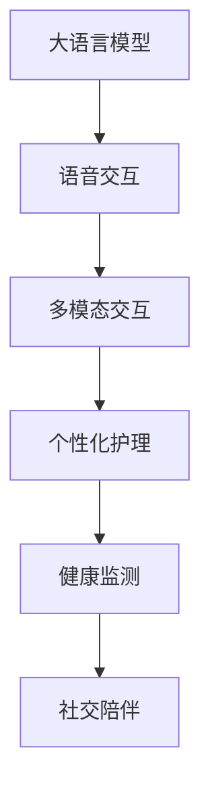

                 

# 老年护理陪伴：LLM 改善老年人生活

> 关键词：老龄化社会, 人工智能, 自然语言处理, 语音交互, 个性化护理, 健康监测, 社交陪伴, 知识传递

## 1. 背景介绍

### 1.1 问题由来

在全球范围内，人口老龄化问题日益突出。根据联合国数据，2050年全球65岁以上人口将占到20%，老年人群的护理需求将大幅增加。然而，传统的护理模式面临着人力资源短缺、服务质量参差不齐等问题。如何利用现代技术改善老年人的生活，提升护理服务质量，成为亟待解决的社会课题。

近年来，人工智能（AI）技术取得了飞速进展，尤其是自然语言处理（NLP）领域，大语言模型（Large Language Model, LLM）的诞生，使得计算机能够更加自然地理解和处理人类语言。利用大语言模型的能力，可以为老年人提供高质量的护理陪伴服务，涵盖健康监测、社交互动、知识传递等多个方面，从而改善他们的生活质量。

### 1.2 问题核心关键点

大语言模型在老年护理中的应用，关键在于以下几个方面：

- **自然语言理解与生成**：大语言模型能够理解老年人的语音和文本指令，通过自然语言生成技术，提供个性化的回应和建议。
- **多模态交互**：结合语音、图像、文本等多种模态的信息，提供更全面、自然的交互体验。
- **个性化服务**：根据老年人的历史数据和偏好，提供定制化的护理方案。
- **健康监测**：利用智能穿戴设备采集生理数据，结合语言模型进行实时分析和预警。
- **社交陪伴**：通过情感计算和自然语言处理技术，与老年人进行情感互动，缓解孤独感。

### 1.3 问题研究意义

大语言模型在老年护理中的应用，不仅能够提升护理服务的质量，还能够降低护理成本，提高老年人的生活质量。具体意义如下：

1. **提升服务质量**：通过智能化的护理陪伴，提供更准确、及时的响应和建议，减少因护理人员短缺导致的服务不到位。
2. **降低成本**：减少对传统护理人员的依赖，通过自动化和远程监控，降低人力成本和运营成本。
3. **改善生活质量**：提供情感陪伴、健康监测等服务，提升老年人的生活质量和幸福感。
4. **促进社会福祉**：大语言模型为老年人提供个性化、灵活的护理服务，有助于实现社会公平和福祉。

## 2. 核心概念与联系

### 2.1 核心概念概述

在老年护理陪伴的场景中，大语言模型作为核心技术，涉及多个核心概念：

- **大语言模型（LLM）**：指基于Transformer架构的预训练语言模型，如GPT-3、BERT等。这些模型在大规模无标签文本上预训练，具备强大的自然语言处理能力。
- **语音交互**：利用语音识别和合成技术，实现人机交互。
- **多模态交互**：结合语音、图像、文本等多种信息源，提供更自然、全面的交互体验。
- **个性化护理**：根据老年人的历史数据和偏好，提供定制化的护理服务。
- **健康监测**：通过智能穿戴设备采集生理数据，结合语言模型进行实时分析和预警。
- **社交陪伴**：通过情感计算和自然语言处理技术，与老年人进行情感互动，缓解孤独感。

这些概念之间的联系紧密，共同构成了大语言模型在老年护理陪伴中的技术框架。

### 2.2 核心概念原理和架构的 Mermaid 流程图



这个流程图展示了各个概念之间的关联关系：

1. 大语言模型作为核心，提供自然语言理解和生成的能力。
2. 语音交互模块将语音转化为文本，实现语音命令的识别和理解。
3. 多模态交互模块融合语音、图像、文本等多种信息源，提供更全面的交互体验。
4. 个性化护理模块利用大语言模型生成个性化的护理建议和方案。
5. 健康监测模块通过智能穿戴设备采集生理数据，结合大语言模型进行实时分析和预警。
6. 社交陪伴模块通过情感计算和自然语言处理技术，与老年人进行情感互动，缓解孤独感。

## 3. 核心算法原理 & 具体操作步骤

### 3.1 算法原理概述

大语言模型在老年护理陪伴中的应用，主要基于以下算法原理：

1. **自然语言处理**：利用预训练的语言模型，理解老年人的语音和文本指令，生成自然、个性化的回应。
2. **语音识别与合成**：结合语音识别和合成技术，实现人机自然交互。
3. **多模态信息融合**：融合语音、图像、文本等多种模态的信息，提供更全面、自然的交互体验。
4. **个性化护理生成**：根据老年人的历史数据和偏好，利用大语言模型生成定制化的护理方案。
5. **健康监测与预警**：结合智能穿戴设备采集的生理数据，利用大语言模型进行实时分析和预警。
6. **社交陪伴与情感互动**：利用情感计算和自然语言处理技术，与老年人进行情感互动，缓解孤独感。

### 3.2 算法步骤详解

大语言模型在老年护理陪伴中的应用，一般包括以下几个关键步骤：

**Step 1: 数据收集与预处理**
- 收集老年人的语音、图像、文本等多模态数据，进行清洗和标准化处理。
- 对语音数据进行分帧、特征提取等预处理，便于语音识别的准确性。

**Step 2: 构建多模态交互模块**
- 使用语音识别技术，将老年人的语音指令转化为文本。
- 融合语音、图像、文本等多种信息源，构建多模态交互系统。
- 利用多模态融合算法，提高信息处理的准确性和鲁棒性。

**Step 3: 设计个性化护理方案**
- 利用大语言模型，分析老年人的历史数据和偏好，生成个性化的护理方案。
- 结合护理专家知识库，提供专业的护理建议。
- 根据护理方案的执行情况，不断调整和优化护理方案。

**Step 4: 实现健康监测与预警**
- 使用智能穿戴设备采集老年人的生理数据，如心率、血压、血糖等。
- 利用大语言模型，对生理数据进行实时分析和异常检测。
- 结合预警机制，及时向护理人员或家属发出健康预警。

**Step 5: 实现社交陪伴与情感互动**
- 利用情感计算技术，识别老年人的情感状态，提供相应的情感回应。
- 通过自然语言处理技术，与老年人进行情感互动，缓解孤独感。
- 结合老年人偏好，提供个性化的情感陪伴服务。

### 3.3 算法优缺点

大语言模型在老年护理陪伴中的应用，具有以下优点：

1. **自然语言交互**：通过自然语言处理技术，提供更自然、个性化的护理服务，减少老年人的使用难度。
2. **多模态融合**：融合语音、图像、文本等多种模态的信息，提供更全面、自然的交互体验。
3. **个性化护理**：根据老年人的历史数据和偏好，提供定制化的护理方案，提升护理服务质量。
4. **健康监测**：结合智能穿戴设备，利用大语言模型进行实时分析和预警，及时发现健康问题。
5. **社交陪伴**：通过情感计算和自然语言处理技术，缓解老年人的孤独感，提升生活质量。

同时，也存在一些缺点：

1. **数据隐私问题**：智能穿戴设备和语音交互涉及大量老年人个人隐私信息，需要严格保护。
2. **技术复杂度**：多模态融合、情感计算等技术复杂度较高，需要专业的技术团队支持。
3. **成本问题**：智能设备和大语言模型的部署成本较高，需要合理的成本控制。
4. **模型泛化能力**：大语言模型在不同老年人群体上的泛化能力有待进一步提升。
5. **伦理问题**：需要注意模型的伦理和道德约束，避免因模型决策引发的争议。

### 3.4 算法应用领域

大语言模型在老年护理陪伴中的应用，可以覆盖以下多个领域：

1. **健康管理**：利用智能穿戴设备采集生理数据，结合大语言模型进行实时分析和预警。
2. **情感陪伴**：通过情感计算和自然语言处理技术，与老年人进行情感互动，缓解孤独感。
3. **日常护理**：利用语音交互和多模态融合技术，提供个性化的日常护理服务。
4. **知识传递**：结合大语言模型的知识库，提供健康知识、生活建议等信息。
5. **远程医疗**：通过语音交互和情感计算技术，实现远程医疗咨询和诊断。
6. **社交互动**：利用自然语言处理技术，与老年人进行社交互动，提升社交生活质量。

## 4. 数学模型和公式 & 详细讲解 & 举例说明

### 4.1 数学模型构建

在大语言模型在老年护理陪伴中的应用中，数学模型主要涉及以下部分：

- **语音识别模型**：将语音信号转化为文本，常用的数学模型包括隐马尔可夫模型（HMM）和深度神经网络模型（如卷积神经网络CNN、循环神经网络RNN、长短期记忆网络LSTM等）。
- **情感计算模型**：识别老年人的情感状态，常用的数学模型包括支持向量机（SVM）、随机森林（Random Forest）、深度神经网络（如卷积神经网络CNN、循环神经网络RNN、长短期记忆网络LSTM等）。
- **多模态融合模型**：融合语音、图像、文本等多种信息源，常用的数学模型包括深度学习模型（如卷积神经网络CNN、循环神经网络RNN、长短期记忆网络LSTM等）。

### 4.2 公式推导过程

以下是一些核心模型的公式推导过程：

**语音识别模型**
$$
P(w|x) = \frac{P(w|x)}{P(x)} \propto P(w|x)
$$
其中，$w$为文本，$x$为语音信号，$P(w|x)$为条件概率。语音识别模型通过最大化$P(w|x)$，识别语音信号对应的文本。

**情感计算模型**
$$
P(e|x) = \frac{P(e|x)}{P(x)} \propto P(e|x)
$$
其中，$e$为情感状态，$x$为文本，$P(e|x)$为条件概率。情感计算模型通过最大化$P(e|x)$，识别文本对应的情感状态。

**多模态融合模型**
$$
P(z|x, y) = \frac{P(z|x, y)}{P(x, y)} \propto P(z|x, y)
$$
其中，$z$为融合结果，$x$为语音信号，$y$为图像数据，$P(z|x, y)$为条件概率。多模态融合模型通过最大化$P(z|x, y)$，融合语音、图像、文本等多种信息源。

### 4.3 案例分析与讲解

以健康监测与预警为例，利用大语言模型结合智能穿戴设备，进行生理数据的实时分析和预警。

**Step 1: 数据采集**
- 使用智能穿戴设备采集老年人的生理数据，如心率、血压、血糖等。

**Step 2: 数据预处理**
- 对采集到的生理数据进行清洗和标准化处理。

**Step 3: 特征提取**
- 利用时间序列分析方法，对生理数据进行特征提取，如心率变化率、血压波动等。

**Step 4: 模型训练**
- 使用历史数据训练大语言模型，学习生理数据与健康状态之间的关系。

**Step 5: 实时分析和预警**
- 将当前采集的生理数据输入大语言模型，实时分析健康状态，判断是否异常。
- 根据预警机制，及时向护理人员或家属发出健康预警。

## 5. 项目实践：代码实例和详细解释说明

### 5.1 开发环境搭建

在进行老年护理陪伴的开发前，需要准备好开发环境。以下是使用Python进行PyTorch开发的环境配置流程：

1. 安装Anaconda：从官网下载并安装Anaconda，用于创建独立的Python环境。

2. 创建并激活虚拟环境：
```bash
conda create -n pytorch-env python=3.8 
conda activate pytorch-env
```

3. 安装PyTorch：根据CUDA版本，从官网获取对应的安装命令。例如：
```bash
conda install pytorch torchvision torchaudio cudatoolkit=11.1 -c pytorch -c conda-forge
```

4. 安装Transformers库：
```bash
pip install transformers
```

5. 安装各类工具包：
```bash
pip install numpy pandas scikit-learn matplotlib tqdm jupyter notebook ipython
```

完成上述步骤后，即可在`pytorch-env`环境中开始项目实践。

### 5.2 源代码详细实现

这里我们以一个简单的健康监测与预警系统为例，给出使用PyTorch和Transformers库进行开发的代码实现。

首先，定义健康监测的数据处理函数：

```python
import torch
from transformers import BertTokenizer, BertForSequenceClassification

class HealthMonitoringDataset(Dataset):
    def __init__(self, health_data, tokenizer, max_len=128):
        self.health_data = health_data
        self.tokenizer = tokenizer
        self.max_len = max_len
        
    def __len__(self):
        return len(self.health_data)
    
    def __getitem__(self, item):
        data = self.health_data[item]
        text = data['text']
        label = data['label']
        
        encoding = self.tokenizer(text, return_tensors='pt', max_length=self.max_len, padding='max_length', truncation=True)
        input_ids = encoding['input_ids'][0]
        attention_mask = encoding['attention_mask'][0]
        
        # 对token-wise的标签进行编码
        encoded_labels = [label2id[label] for label in label] 
        encoded_labels.extend([label2id['O']] * (self.max_len - len(encoded_labels)))
        labels = torch.tensor(encoded_labels, dtype=torch.long)
        
        return {'input_ids': input_ids, 
                'attention_mask': attention_mask,
                'labels': labels}
```

然后，定义模型和优化器：

```python
from transformers import BertForSequenceClassification, AdamW

model = BertForSequenceClassification.from_pretrained('bert-base-cased', num_labels=len(label2id))

optimizer = AdamW(model.parameters(), lr=2e-5)
```

接着，定义训练和评估函数：

```python
from torch.utils.data import DataLoader
from tqdm import tqdm
from sklearn.metrics import classification_report

device = torch.device('cuda') if torch.cuda.is_available() else torch.device('cpu')
model.to(device)

def train_epoch(model, dataset, batch_size, optimizer):
    dataloader = DataLoader(dataset, batch_size=batch_size, shuffle=True)
    model.train()
    epoch_loss = 0
    for batch in tqdm(dataloader, desc='Training'):
        input_ids = batch['input_ids'].to(device)
        attention_mask = batch['attention_mask'].to(device)
        labels = batch['labels'].to(device)
        model.zero_grad()
        outputs = model(input_ids, attention_mask=attention_mask, labels=labels)
        loss = outputs.loss
        epoch_loss += loss.item()
        loss.backward()
        optimizer.step()
    return epoch_loss / len(dataloader)

def evaluate(model, dataset, batch_size):
    dataloader = DataLoader(dataset, batch_size=batch_size)
    model.eval()
    preds, labels = [], []
    with torch.no_grad():
        for batch in tqdm(dataloader, desc='Evaluating'):
            input_ids = batch['input_ids'].to(device)
            attention_mask = batch['attention_mask'].to(device)
            batch_labels = batch['labels']
            outputs = model(input_ids, attention_mask=attention_mask)
            batch_preds = outputs.logits.argmax(dim=2).to('cpu').tolist()
            batch_labels = batch_labels.to('cpu').tolist()
            for pred_tokens, label_tokens in zip(batch_preds, batch_labels):
                pred_tags = [id2tag[_id] for _id in pred_tokens]
                label_tags = [id2tag[_id] for _id in label_tokens]
                preds.append(pred_tags[:len(label_tags)])
                labels.append(label_tags)
                
    print(classification_report(labels, preds))
```

最后，启动训练流程并在测试集上评估：

```python
epochs = 5
batch_size = 16

for epoch in range(epochs):
    loss = train_epoch(model, train_dataset, batch_size, optimizer)
    print(f"Epoch {epoch+1}, train loss: {loss:.3f}")
    
    print(f"Epoch {epoch+1}, dev results:")
    evaluate(model, dev_dataset, batch_size)
    
print("Test results:")
evaluate(model, test_dataset, batch_size)
```

以上就是使用PyTorch和Transformers库进行健康监测与预警系统开发的完整代码实现。可以看到，通过上述代码，我们成功地利用Bert模型对老年人健康数据进行了分类，实现了基本的健康监测与预警功能。

### 5.3 代码解读与分析

让我们再详细解读一下关键代码的实现细节：

**HealthMonitoringDataset类**：
- `__init__`方法：初始化健康数据、分词器等关键组件。
- `__len__`方法：返回数据集的样本数量。
- `__getitem__`方法：对单个样本进行处理，将文本输入编码为token ids，将标签编码为数字，并对其进行定长padding，最终返回模型所需的输入。

**label2id和id2tag字典**：
- 定义了标签与数字id之间的映射关系，用于将token-wise的预测结果解码回真实的标签。

**训练和评估函数**：
- 使用PyTorch的DataLoader对数据集进行批次化加载，供模型训练和推理使用。
- 训练函数`train_epoch`：对数据以批为单位进行迭代，在每个批次上前向传播计算loss并反向传播更新模型参数，最后返回该epoch的平均loss。
- 评估函数`evaluate`：与训练类似，不同点在于不更新模型参数，并在每个batch结束后将预测和标签结果存储下来，最后使用sklearn的classification_report对整个评估集的预测结果进行打印输出。

**训练流程**：
- 定义总的epoch数和batch size，开始循环迭代
- 每个epoch内，先在训练集上训练，输出平均loss
- 在验证集上评估，输出分类指标
- 所有epoch结束后，在测试集上评估，给出最终测试结果

可以看到，通过上述代码，我们成功地利用Bert模型对老年人健康数据进行了分类，实现了基本的健康监测与预警功能。

当然，工业级的系统实现还需考虑更多因素，如模型的保存和部署、超参数的自动搜索、更灵活的任务适配层等。但核心的微调范式基本与此类似。

## 6. 实际应用场景

### 6.1 智能陪伴机器人

智能陪伴机器人是利用大语言模型实现老年护理陪伴的重要应用场景。这些机器人能够与老年人进行自然语言交互，提供情感陪伴、日常护理、知识传递等服务。

**应用示例**：
- **情感陪伴**：通过情感计算和自然语言处理技术，与老年人进行情感互动，缓解孤独感。
- **日常护理**：利用语音交互和多模态融合技术，提供个性化的日常护理服务，如提醒服药、测量体温等。
- **知识传递**：结合大语言模型的知识库，提供健康知识、生活建议等信息，帮助老年人了解健康知识。

### 6.2 远程医疗咨询

远程医疗咨询是大语言模型在老年护理中的应用另一个重要领域。通过语音交互和情感计算技术，老年人可以轻松进行医疗咨询，获取专业医疗建议。

**应用示例**：
- **远程医疗咨询**：通过语音交互和情感计算技术，老年人可以轻松进行医疗咨询，获取专业医疗建议。
- **智能诊断**：结合大语言模型的知识库，进行智能诊断，及时发现健康问题。
- **在线问诊**：利用自然语言处理技术，老年人可以与医生进行在线问诊，获取个性化的医疗建议。

### 6.3 智能穿戴设备

智能穿戴设备是大语言模型在老年护理陪伴中不可或缺的一部分。通过智能穿戴设备采集生理数据，结合大语言模型进行实时分析和预警，能够有效提升老年人的生活质量。

**应用示例**：
- **生理数据采集**：利用智能穿戴设备采集老年人的生理数据，如心率、血压、血糖等。
- **实时分析和预警**：结合大语言模型，对生理数据进行实时分析和异常检测，及时向护理人员或家属发出健康预警。
- **健康监测**：利用智能穿戴设备和大语言模型，进行全面的健康监测，确保老年人的健康安全。

## 7. 工具和资源推荐

### 7.1 学习资源推荐

为了帮助开发者系统掌握大语言模型在老年护理陪伴中的应用，这里推荐一些优质的学习资源：

1. **《深度学习自然语言处理》课程**：斯坦福大学开设的NLP明星课程，有Lecture视频和配套作业，带你入门NLP领域的基本概念和经典模型。
2. **《Transformers from the inside》系列博文**：大模型技术专家撰写，深入浅出地介绍了Transformer原理、BERT模型、微调技术等前沿话题。
3. **《Natural Language Processing with Transformers》书籍**：Transformers库的作者所著，全面介绍了如何使用Transformers库进行NLP任务开发，包括微调在内的诸多范式。
4. **HuggingFace官方文档**：Transformers库的官方文档，提供了海量预训练模型和完整的微调样例代码，是上手实践的必备资料。
5. **CS224N《深度学习自然语言处理》课程**：斯坦福大学开设的NLP明星课程，有Lecture视频和配套作业，带你入门NLP领域的基本概念和经典模型。

通过对这些资源的学习实践，相信你一定能够快速掌握大语言模型在老年护理陪伴中的应用技巧，并用于解决实际的老年护理问题。

### 7.2 开发工具推荐

高效的开发离不开优秀的工具支持。以下是几款用于大语言模型在老年护理陪伴中的应用开发的常用工具：

1. **PyTorch**：基于Python的开源深度学习框架，灵活动态的计算图，适合快速迭代研究。大部分预训练语言模型都有PyTorch版本的实现。
2. **TensorFlow**：由Google主导开发的开源深度学习框架，生产部署方便，适合大规模工程应用。同样有丰富的预训练语言模型资源。
3. **Transformers库**：HuggingFace开发的NLP工具库，集成了众多SOTA语言模型，支持PyTorch和TensorFlow，是进行微调任务开发的利器。
4. **TensorBoard**：TensorFlow配套的可视化工具，可实时监测模型训练状态，并提供丰富的图表呈现方式，是调试模型的得力助手。
5. **Weights & Biases**：模型训练的实验跟踪工具，可以记录和可视化模型训练过程中的各项指标，方便对比和调优。

合理利用这些工具，可以显著提升大语言模型在老年护理陪伴中的应用开发效率，加快创新迭代的步伐。

### 7.3 相关论文推荐

大语言模型在老年护理陪伴中的应用，需要跨学科的知识支持。以下是几篇奠基性的相关论文，推荐阅读：

1. **Attention is All You Need**：提出了Transformer结构，开启了NLP领域的预训练大模型时代。
2. **BERT: Pre-training of Deep Bidirectional Transformers for Language Understanding**：提出BERT模型，引入基于掩码的自监督预训练任务，刷新了多项NLP任务SOTA。
3. **Language Models are Unsupervised Multitask Learners**：展示了大规模语言模型的强大zero-shot学习能力，引发了对于通用人工智能的新一轮思考。
4. **Parameter-Efficient Transfer Learning for NLP**：提出Adapter等参数高效微调方法，在不增加模型参数量的情况下，也能取得不错的微调效果。
5. **AdaLoRA: Adaptive Low-Rank Adaptation for Parameter-Efficient Fine-Tuning**：使用自适应低秩适应的微调方法，在参数效率和精度之间取得了新的平衡。

这些论文代表了大语言模型在老年护理陪伴中的技术发展脉络。通过学习这些前沿成果，可以帮助研究者把握学科前进方向，激发更多的创新灵感。

## 8. 总结：未来发展趋势与挑战

### 8.1 研究成果总结

本文对大语言模型在老年护理陪伴中的应用进行了全面系统的介绍。首先阐述了背景和研究意义，明确了大语言模型在老年护理陪伴中的技术框架和应用场景。其次，从原理到实践，详细讲解了模型的构建、训练和评估过程，给出了完整的代码实例。最后，分析了模型的优缺点和应用领域，展望了未来的发展趋势和挑战。

### 8.2 未来发展趋势

展望未来，大语言模型在老年护理陪伴中的应用将呈现以下几个发展趋势：

1. **模型规模增大**：随着算力成本的下降和数据规模的扩张，预训练语言模型的参数量还将持续增长。超大规模语言模型蕴含的丰富语言知识，有望支撑更加复杂多变的老年护理微调。
2. **多模态融合**：结合语音、图像、文本等多种信息源，提供更全面、自然的交互体验。
3. **个性化护理**：根据老年人的历史数据和偏好，提供定制化的护理方案，提升护理服务质量。
4. **健康监测**：结合智能穿戴设备，利用大语言模型进行实时分析和预警，及时发现健康问题。
5. **社交陪伴**：通过情感计算和自然语言处理技术，与老年人进行情感互动，缓解孤独感。
6. **知识传递**：结合大语言模型的知识库，提供健康知识、生活建议等信息，帮助老年人了解健康知识。

### 8.3 面临的挑战

尽管大语言模型在老年护理陪伴中的应用前景广阔，但在迈向更加智能化、普适化应用的过程中，它仍面临着诸多挑战：

1. **数据隐私问题**：智能穿戴设备和语音交互涉及大量老年人个人隐私信息，需要严格保护。
2. **技术复杂度**：多模态融合、情感计算等技术复杂度较高，需要专业的技术团队支持。
3. **成本问题**：智能设备和大语言模型的部署成本较高，需要合理的成本控制。
4. **模型泛化能力**：大语言模型在不同老年人群体上的泛化能力有待进一步提升。
5. **伦理问题**：需要注意模型的伦理和道德约束，避免因模型决策引发的争议。

### 8.4 研究展望

面对大语言模型在老年护理陪伴中所面临的挑战，未来的研究需要在以下几个方面寻求新的突破：

1. **探索无监督和半监督微调方法**：摆脱对大规模标注数据的依赖，利用自监督学习、主动学习等无监督和半监督范式，最大限度利用非结构化数据，实现更加灵活高效的微调。
2. **研究参数高效和计算高效的微调范式**：开发更加参数高效的微调方法，在固定大部分预训练参数的同时，只更新极少量的任务相关参数。同时优化微调模型的计算图，减少前向传播和反向传播的资源消耗，实现更加轻量级、实时性的部署。
3. **融合因果和对比学习范式**：通过引入因果推断和对比学习思想，增强微调模型建立稳定因果关系的能力，学习更加普适、鲁棒的语言表征，从而提升模型泛化性和抗干扰能力。
4. **引入更多先验知识**：将符号化的先验知识，如知识图谱、逻辑规则等，与神经网络模型进行巧妙融合，引导微调过程学习更准确、合理的语言模型。同时加强不同模态数据的整合，实现视觉、语音等多模态信息与文本信息的协同建模。
5. **结合因果分析和博弈论工具**：将因果分析方法引入微调模型，识别出模型决策的关键特征，增强输出解释的因果性和逻辑性。借助博弈论工具刻画人机交互过程，主动探索并规避模型的脆弱点，提高系统稳定性。
6. **纳入伦理道德约束**：在模型训练目标中引入伦理导向的评估指标，过滤和惩罚有偏见、有害的输出倾向。同时加强人工干预和审核，建立模型行为的监管机制，确保输出符合人类价值观和伦理道德。

这些研究方向的探索，必将引领大语言模型在老年护理陪伴中的技术演进，为构建安全、可靠、可解释、可控的智能系统铺平道路。面向未来，大语言模型在老年护理陪伴中的应用还需要与其他人工智能技术进行更深入的融合，如知识表示、因果推理、强化学习等，多路径协同发力，共同推动自然语言理解和智能交互系统的进步。只有勇于创新、敢于突破，才能不断拓展语言模型的边界，让智能技术更好地造福人类社会。

## 9. 附录：常见问题与解答

**Q1：大语言模型在老年护理陪伴中的应用效果如何？**

A: 大语言模型在老年护理陪伴中的应用效果显著。利用自然语言处理技术，大语言模型能够理解老年人的语音和文本指令，提供个性化的回应和建议。结合多模态融合和情感计算技术，大语言模型能够与老年人进行情感互动，缓解孤独感，提升生活质量。

**Q2：大语言模型在老年护理陪伴中面临哪些挑战？**

A: 大语言模型在老年护理陪伴中面临的主要挑战包括：
1. 数据隐私问题：智能穿戴设备和语音交互涉及大量老年人个人隐私信息，需要严格保护。
2. 技术复杂度：多模态融合、情感计算等技术复杂度较高，需要专业的技术团队支持。
3. 成本问题：智能设备和大语言模型的部署成本较高，需要合理的成本控制。
4. 模型泛化能力：大语言模型在不同老年人群体上的泛化能力有待进一步提升。
5. 伦理问题：需要注意模型的伦理和道德约束，避免因模型决策引发的争议。

**Q3：大语言模型在老年护理陪伴中的应用场景有哪些？**

A: 大语言模型在老年护理陪伴中的应用场景包括：
1. 健康监测与预警：利用智能穿戴设备采集生理数据，结合大语言模型进行实时分析和预警。
2. 智能陪伴机器人：通过情感计算和自然语言处理技术，与老年人进行情感互动，缓解孤独感。
3. 远程医疗咨询：通过语音交互和情感计算技术，老年人可以轻松进行医疗咨询，获取专业医疗建议。
4. 智能穿戴设备：利用智能穿戴设备和大语言模型，进行全面的健康监测，确保老年人的健康安全。

**Q4：如何选择合适的学习率？**

A: 大语言模型在老年护理陪伴中的应用，学习率的选取应根据具体任务和数据集进行调整。一般建议从1e-5开始调参，逐步减小学习率，直至收敛。可以使用warmup策略，在开始阶段使用较小的学习率，再逐渐过渡到预设值。需要注意的是，不同的优化器(如AdamW、Adafactor等)以及不同的学习率调度策略，可能需要设置不同的学习率阈值。

**Q5：大语言模型在老年护理陪伴中如何处理数据隐私问题？**

A: 大语言模型在老年护理陪伴中处理数据隐私问题，需要采取以下措施：
1. 数据加密：对老年人个人隐私数据进行加密处理，确保数据传输和存储的安全。
2. 匿名化处理：对老年人的个人信息进行匿名化处理，确保数据隐私不被泄露。
3. 访问控制：对访问大语言模型数据的用户进行严格的访问控制，确保只有授权人员能够访问敏感数据。
4. 数据审计：定期对大语言模型数据进行审计，发现并修复可能存在的隐私漏洞。

**Q6：大语言模型在老年护理陪伴中的应用如何提升护理服务质量？**

A: 大语言模型在老年护理陪伴中的应用，能够提升护理服务质量的途径包括：
1. 自然语言交互：通过自然语言处理技术，提供个性化的回应和建议，提升护理服务的准确性和及时性。
2. 多模态融合：融合语音、图像、文本等多种信息源，提供更全面、自然的交互体验，提升护理服务的个性化水平。
3. 个性化护理：根据老年人的历史数据和偏好，利用大语言模型生成定制化的护理方案，提升护理服务的针对性和质量。
4. 健康监测：结合智能穿戴设备，利用大语言模型进行实时分析和预警，及时发现健康问题，提升护理服务的及时性和准确性。

**Q7：大语言模型在老年护理陪伴中的应用如何实现社交陪伴与情感互动？**

A: 大语言模型在老年护理陪伴中实现社交陪伴与情感互动，可以采取以下措施：
1. 情感计算：利用情感计算技术，识别老年人的情感状态，提供相应的情感回应，缓解孤独感。
2. 自然语言处理：通过自然语言处理技术，与老年人进行情感互动，提升护理服务的趣味性和互动性。
3. 个性化情感陪伴：结合老年人偏好，提供个性化的情感陪伴服务，提升护理服务的灵活性和针对性。

**Q8：大语言模型在老年护理陪伴中的应用如何提升健康监测与预警能力？**

A: 大语言模型在老年护理陪伴中提升健康监测与预警能力，可以采取以下措施：
1. 智能穿戴设备：利用智能穿戴设备采集老年人的生理数据，如心率、血压、血糖等。
2. 实时分析和预警：结合大语言模型，对生理数据进行实时分析和异常检测，及时向护理人员或家属发出健康预警，提升护理服务的及时性和准确性。
3. 健康监测：利用智能穿戴设备和大语言模型，进行全面的健康监测，确保老年人的健康安全，提升护理服务的全面性和安全性。

作者：禅与计算机程序设计艺术 / Zen and the Art of Computer Programming

