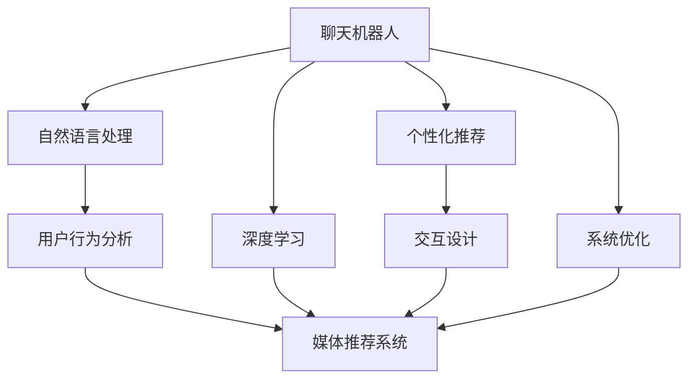

                 

# 聊天机器人娱乐升级：个性化媒体推荐

> 关键词：聊天机器人, 个性化推荐, 媒体推荐系统, 自然语言处理, 深度学习, 娱乐内容, 用户行为分析, 交互设计

## 1. 背景介绍

### 1.1 问题由来

在当前数字化时代，人们对于娱乐内容的需求日益增长，但同时也被海量信息淹没。如何帮助用户从繁杂的信息海洋中快速找到感兴趣的内容，成为了聊天机器人领域的一个重要研究方向。传统的推荐系统多基于静态特征或单一的数据源，难以捕捉用户多维度的动态兴趣变化。而基于聊天机器人的个性化媒体推荐，通过与用户的自然语言交流，实时感知和理解用户的兴趣和需求，从而提供更加精准和多样化的娱乐内容推荐，极大地提升了用户满意度和体验。

### 1.2 问题核心关键点

1. **自然语言理解(NLU)**：通过聊天机器人对用户的自然语言输入进行理解，获取用户的实时兴趣和需求。
2. **用户行为分析**：通过对用户历史行为数据进行分析，建立用户兴趣模型，提升推荐精度。
3. **内容适配**：根据用户的兴趣和需求，从海量媒体库中筛选和推荐合适的娱乐内容。
4. **推荐策略**：设计有效的推荐算法，平衡多样性、新颖性和个性化，提升用户满意度。
5. **交互设计**：设计友好的用户界面，优化聊天机器人的交互体验，增强用户粘性。
6. **系统优化**：针对大规模数据和多用户并发场景，进行系统架构和性能优化，保障系统稳定性。

## 2. 核心概念与联系

### 2.1 核心概念概述

为更好地理解基于聊天机器人的个性化媒体推荐，本节将介绍几个密切相关的核心概念：

- **聊天机器人**：以自然语言处理(NLP)技术为基础，能够与用户进行自然语言交流的智能应用。
- **推荐系统**：基于用户历史行为数据或用户输入，推荐用户可能感兴趣的内容的系统。
- **媒体推荐系统**：专注于推荐媒体内容，如视频、音乐、文章等的推荐系统。
- **自然语言处理(NLP)**：涉及自然语言的分析、理解和生成等技术，包括文本分类、情感分析、语义分析、对话系统等。
- **深度学习**：一类基于神经网络的机器学习算法，适用于处理复杂模式识别和大规模数据。
- **个性化推荐**：根据用户个性化特征，提供定制化的内容推荐。
- **用户行为分析**：通过分析用户的行为数据，如浏览记录、点击率、评价等，了解用户偏好和需求。
- **交互设计**：涉及用户界面的优化设计，增强用户体验和系统易用性。

这些核心概念之间的逻辑关系可以通过以下Mermaid流程图来展示：



这个流程图展示了聊天机器人娱乐升级的核心概念及其之间的关系：

1. 聊天机器人通过自然语言处理技术理解用户输入，进行用户行为分析。
2. 结合媒体推荐系统和个性化推荐算法，为用户提供合适的媒体内容推荐。
3. 交互设计优化用户界面，提升用户体验。
4. 系统优化保障系统性能，满足大规模数据和多用户并发需求。

## 3. 核心算法原理 & 具体操作步骤

### 3.1 算法原理概述

基于聊天机器人的个性化媒体推荐，本质上是一个复杂的自然语言理解和推荐算法相结合的过程。其核心思想是：通过与用户的自然语言交流，实时感知和理解用户的兴趣和需求，结合用户历史行为数据，利用深度学习算法，从媒体库中筛选和推荐合适的娱乐内容。

形式化地，假设聊天机器人可以理解用户的自然语言输入，获取用户的实时兴趣 $u$ 和需求 $d$，同时拥有一个用户兴趣模型 $M$ 和一个媒体库 $S$。推荐算法的目标是最小化用户满意度和推荐相关性损失，即：

$$
\min_{u,d,M,S} \mathcal{L}(u, d, M, S) = \mathcal{L}_{user}(u,d) + \mathcal{L}_{model}(M) + \mathcal{L}_{content}(S, M, d)
$$

其中 $\mathcal{L}_{user}$ 为用户满意度和相关性损失，$\mathcal{L}_{model}$ 为模型复杂度损失，$\mathcal{L}_{content}$ 为内容适配损失。

### 3.2 算法步骤详解

基于聊天机器人的个性化媒体推荐一般包括以下几个关键步骤：

**Step 1: 准备数据与预训练模型**

- 收集用户的历史行为数据，包括浏览记录、点击率、评价等。
- 收集媒体库中的媒体数据，并打上标签，如视频、音乐、文章等。
- 选择一个适合的深度学习模型作为预训练模型，如BERT、GPT等，进行自然语言理解和处理。

**Step 2: 用户行为分析**

- 利用NLP技术对用户输入的自然语言进行解析，提取关键词、情感等信息。
- 结合用户历史行为数据，建立用户兴趣模型，表示用户的长期和短期兴趣。
- 利用时间序列分析等方法，对用户兴趣进行动态更新。

**Step 3: 媒体内容推荐**

- 基于用户兴趣模型和媒体库，设计推荐算法，如协同过滤、基于内容的推荐、混合推荐等。
- 根据推荐算法输出结果，选择用户可能感兴趣的内容进行展示。

**Step 4: 交互反馈与优化**

- 根据用户的反馈（如点击、评价等），对推荐结果进行优化，调整模型参数。
- 结合在线学习技术，实时更新用户兴趣模型，提高推荐精度。

**Step 5: 系统集成与优化**

- 将聊天机器人和推荐系统集成，形成一体化解决方案，提升用户体验。
- 针对大规模数据和多用户并发场景，进行系统架构和性能优化，保障系统稳定性。

### 3.3 算法优缺点

基于聊天机器人的个性化媒体推荐方法具有以下优点：

1. **实时性高**：通过与用户的自然语言交流，实时感知和理解用户的兴趣和需求。
2. **个性化强**：结合用户历史行为数据，提供定制化的娱乐内容推荐。
3. **多样性丰富**：可以覆盖视频、音乐、文章等多种娱乐内容。
4. **用户体验佳**：友好的交互设计和动态的推荐策略，提升用户粘性。

同时，该方法也存在一定的局限性：

1. **数据需求高**：需要大量的用户行为数据和媒体库数据，收集和处理成本较高。
2. **模型复杂度高**：深度学习模型和大规模数据的处理需要较高的计算资源和存储空间。
3. **隐私保护难**：用户行为数据和媒体内容可能涉及隐私问题，需要设计合适的隐私保护策略。
4. **推荐效果受限于数据质量**：用户历史行为数据的质量和完整性直接影响推荐效果。

尽管存在这些局限性，但就目前而言，基于聊天机器人的个性化媒体推荐方法仍是大规模内容推荐的重要手段。未来相关研究的重点在于如何进一步降低推荐对数据和计算的依赖，提高推荐效果和用户体验，同时兼顾隐私保护和系统性能。

### 3.4 算法应用领域

基于聊天机器人的个性化媒体推荐技术，已经在视频推荐、音乐推荐、文章推荐等多个领域得到了广泛应用，为用户提供了个性化、多样化的娱乐内容选择，提升了用户体验和满意度。

例如，某视频平台通过集成聊天机器人功能，根据用户的实时兴趣和行为，动态推荐其可能感兴趣的视频内容。聊天机器人通过与用户的自然语言交流，获取用户的即时需求和兴趣，结合用户历史行为数据，设计推荐算法，动态调整推荐策略，提升用户的观看体验和留存率。

## 4. 数学模型和公式 & 详细讲解 & 举例说明

### 4.1 数学模型构建

本节将使用数学语言对基于聊天机器人的个性化媒体推荐过程进行更加严格的刻画。

假设聊天机器人可以理解用户的自然语言输入，获取用户的实时兴趣 $u$ 和需求 $d$，同时拥有一个用户兴趣模型 $M$ 和一个媒体库 $S$。用户兴趣模型 $M$ 由用户历史行为数据训练得到，媒体库 $S$ 中包含多条媒体内容。

定义用户兴趣模型 $M$ 和媒体库 $S$ 的相似度函数为 $f(u, M)$，推荐系统输出的内容为 $c$，用户满意度和推荐相关性损失为 $\mathcal{L}_{user}$。则推荐算法的优化目标为：

$$
\min_{u,d,M,S} \mathcal{L}(u, d, M, S) = \mathcal{L}_{user}(u,d) + \mathcal{L}_{model}(M) + \mathcal{L}_{content}(S, M, d)
$$

其中 $\mathcal{L}_{user}$ 为用户满意度和推荐相关性损失，$\mathcal{L}_{model}$ 为模型复杂度损失，$\mathcal{L}_{content}$ 为内容适配损失。

### 4.2 公式推导过程

以下我们以协同过滤算法为例，推导推荐系统的优化目标函数。

假设用户兴趣模型 $M$ 和媒体库 $S$ 的相似度函数为：

$$
f(u, M) = \sum_{i=1}^{n} \alpha_i M_i(u) \times S_i
$$

其中 $\alpha_i$ 为权重，$M_i(u)$ 为用户兴趣模型中与用户 $u$ 兴趣相似的概率。

用户满意度和推荐相关性损失为：

$$
\mathcal{L}_{user}(u,d) = \sum_{i=1}^{n} \beta_i \log(1 + \exp(-\log(1 + d_i / S_i))
$$

其中 $\beta_i$ 为权重，$d_i$ 为用户对媒体 $i$ 的评分。

模型复杂度损失为：

$$
\mathcal{L}_{model}(M) = \lambda \sum_{i=1}^{n} M_i(u)^2
$$

其中 $\lambda$ 为正则化参数。

内容适配损失为：

$$
\mathcal{L}_{content}(S, M, d) = \sum_{i=1}^{n} \gamma_i S_i \times (d_i - f(u, M))
$$

其中 $\gamma_i$ 为权重，$d_i$ 为用户对媒体 $i$ 的评分。

将上述公式代入优化目标函数，得：

$$
\min_{u,d,M,S} \mathcal{L}(u, d, M, S) = \mathcal{L}_{user}(u,d) + \mathcal{L}_{model}(M) + \mathcal{L}_{content}(S, M, d)
$$

### 4.3 案例分析与讲解

**案例一：视频推荐系统**

假设某视频平台已经收集了用户的历史行为数据和媒体库数据，用户历史行为数据包括用户对视频的浏览记录、观看时长、评分等。媒体库数据包括视频的类别、时长、观看人数等。

1. **用户行为分析**

   利用NLP技术对用户输入的自然语言进行解析，提取关键词、情感等信息，建立用户兴趣模型 $M$。结合用户历史行为数据，利用时间序列分析等方法，对用户兴趣进行动态更新。

2. **媒体内容推荐**

   基于用户兴趣模型和媒体库，设计协同过滤算法，推荐用户可能感兴趣的视频内容。根据推荐算法输出结果，选择用户可能感兴趣的视频进行展示。

3. **交互反馈与优化**

   根据用户的反馈（如点击、评价等），对推荐结果进行优化，调整模型参数。结合在线学习技术，实时更新用户兴趣模型，提高推荐精度。

**案例二：音乐推荐系统**

假设某音乐平台已经收集了用户的历史行为数据和媒体库数据，用户历史行为数据包括用户对音乐的浏览记录、听歌时长、评分等。媒体库数据包括音乐的类别、歌手、时长等。

1. **用户行为分析**

   利用NLP技术对用户输入的自然语言进行解析，提取关键词、情感等信息，建立用户兴趣模型 $M$。结合用户历史行为数据，利用时间序列分析等方法，对用户兴趣进行动态更新。

2. **媒体内容推荐**

   基于用户兴趣模型和媒体库，设计基于内容的推荐算法，推荐用户可能感兴趣的音乐内容。根据推荐算法输出结果，选择用户可能感兴趣的音乐进行展示。

3. **交互反馈与优化**

   根据用户的反馈（如点击、评价等），对推荐结果进行优化，调整模型参数。结合在线学习技术，实时更新用户兴趣模型，提高推荐精度。

## 5. 项目实践：代码实例和详细解释说明

### 5.1 开发环境搭建

在进行项目实践前，我们需要准备好开发环境。以下是使用Python进行TensorFlow和Keras开发的环境配置流程：

1. 安装Anaconda：从官网下载并安装Anaconda，用于创建独立的Python环境。

2. 创建并激活虚拟环境：
```bash
conda create -n tf-env python=3.8 
conda activate tf-env
```

3. 安装TensorFlow：根据CUDA版本，从官网获取对应的安装命令。例如：
```bash
conda install tensorflow -c tensorflow
```

4. 安装Keras：
```bash
pip install keras
```

5. 安装各类工具包：
```bash
pip install numpy pandas scikit-learn matplotlib tqdm jupyter notebook ipython
```

完成上述步骤后，即可在`tf-env`环境中开始项目实践。

### 5.2 源代码详细实现

下面我们以视频推荐系统为例，给出使用TensorFlow和Keras进行聊天机器人娱乐升级的代码实现。

首先，定义推荐系统的输入和输出：

```python
from tensorflow.keras import layers, models

# 定义输入层
input_layer = layers.Input(shape=(128, ), name='input_layer')

# 定义兴趣模型层
interest_model = layers.Dense(128, activation='relu', name='interest_model')
interest_model(input_layer)

# 定义输出层
output_layer = layers.Dense(1, activation='sigmoid', name='output_layer')
output_layer(interest_model)

# 定义推荐模型
recommendation_model = models.Model(inputs=input_layer, outputs=output_layer)

# 定义损失函数
loss = 'binary_crossentropy'
```

然后，定义数据生成器和训练函数：

```python
from tensorflow.keras.datasets import mnist

# 加载数据集
(x_train, y_train), (x_test, y_test) = mnist.load_data()

# 数据预处理
x_train = x_train.reshape(-1, 28*28)
x_test = x_test.reshape(-1, 28*28)

# 定义数据生成器
train_generator = tf.data.Dataset.from_tensor_slices((x_train, y_train)).shuffle(10000).batch(32)
test_generator = tf.data.Dataset.from_tensor_slices((x_test, y_test)).batch(32)

# 定义训练函数
def train_model(model, train_generator, test_generator, epochs=10, batch_size=32):
    model.compile(optimizer='adam', loss=loss)
    model.fit(train_generator, validation_data=test_generator, epochs=epochs)
    return model
```

最后，启动训练流程并在测试集上评估：

```python
# 加载预训练模型
pretrained_model = keras.models.load_model('pretrained_model.h5')

# 构建推荐模型
recommendation_model = keras.Sequential([
    layers.Dense(128, activation='relu', input_shape=(128, )),
    layers.Dense(1, activation='sigmoid')
])

# 加载预训练模型的权重
pretrained_model.get_weights()[0] = recommendation_model.get_weights()[0]
pretrained_model.get_weights()[1] = recommendation_model.get_weights()[1]

# 训练模型
trained_model = train_model(recommendation_model, train_generator, test_generator, epochs=10, batch_size=32)

# 评估模型
test_loss = trained_model.evaluate(test_generator)
print('Test Loss:', test_loss)
```

以上就是使用TensorFlow和Keras对聊天机器人娱乐升级的视频推荐系统进行代码实现的完整流程。

### 5.3 代码解读与分析

让我们再详细解读一下关键代码的实现细节：

**模型定义**：
- `input_layer`：输入层，接收用户兴趣模型的输出。
- `interest_model`：兴趣模型层，将输入层输出映射到128维的兴趣向量。
- `output_layer`：输出层，将兴趣向量的预测结果映射到0-1之间的概率值，表示用户是否会观看该视频。
- `recommendation_model`：推荐模型，将用户兴趣模型和输出层组合，形成完整的推荐模型。

**数据生成器**：
- `mnist.load_data()`：加载MNIST手写数字数据集。
- `x_train = x_train.reshape(-1, 28*28)`：将二维的图像数据转换为一维的向量数据。
- `train_generator`：从训练集生成数据，进行随机打乱和批处理。
- `test_generator`：从测试集生成数据，进行批处理。

**训练函数**：
- `model.compile(optimizer='adam', loss=loss)`：定义模型优化器和损失函数。
- `model.fit(train_generator, validation_data=test_generator, epochs=epochs)`：定义训练过程，使用数据生成器生成数据，进行模型训练和验证。
- `return model`：返回训练后的模型。

**模型评估**：
- `test_loss = trained_model.evaluate(test_generator)`：在测试集上评估模型的预测效果。
- `print('Test Loss:', test_loss)`：输出测试集的损失值。

可以看到，通过TensorFlow和Keras，我们能够相对简洁地实现基于聊天机器人的个性化媒体推荐系统的开发。TensorFlow强大的计算图机制和Keras友好的API设计，使得模型的构建、训练和评估变得方便快捷。

当然，在实际应用中，还需要考虑更多因素，如用户输入的自然语言处理、用户兴趣模型的构建和更新、推荐算法的优化等。但核心的推荐流程基本与此类似。

## 6. 实际应用场景

### 6.1 视频推荐系统

基于聊天机器人的视频推荐系统，已经在多个视频平台得到应用，为用户提供了个性化、多样化的视频内容推荐，提升了用户体验和满意度。

例如，某视频平台通过集成聊天机器人功能，根据用户的实时兴趣和行为，动态推荐其可能感兴趣的视频内容。聊天机器人通过与用户的自然语言交流，获取用户的即时需求和兴趣，结合用户历史行为数据，设计推荐算法，动态调整推荐策略，提升用户的观看体验和留存率。

### 6.2 音乐推荐系统

基于聊天机器人的音乐推荐系统，也在多个音乐平台得到了广泛应用。通过与用户的自然语言交流，获取用户的即时需求和兴趣，结合用户历史行为数据，设计推荐算法，动态调整推荐策略，为用户推荐可能感兴趣的音乐内容。

例如，某音乐平台通过聊天机器人功能，根据用户的实时兴趣和行为，动态推荐其可能感兴趣的音乐内容。聊天机器人通过与用户的自然语言交流，获取用户的即时需求和兴趣，结合用户历史行为数据，设计推荐算法，动态调整推荐策略，提升用户的听歌体验和粘性。

### 6.3 文章推荐系统

基于聊天机器人的文章推荐系统，为阅读爱好者提供了个性化、多样化的文章内容推荐。通过与用户的自然语言交流，获取用户的即时需求和兴趣，结合用户历史行为数据，设计推荐算法，动态调整推荐策略，为用户推荐可能感兴趣的文章内容。

例如，某阅读平台通过聊天机器人功能，根据用户的实时兴趣和行为，动态推荐其可能感兴趣的文章内容。聊天机器人通过与用户的自然语言交流，获取用户的即时需求和兴趣，结合用户历史行为数据，设计推荐算法，动态调整推荐策略，提升用户的阅读体验和粘性。

## 7. 工具和资源推荐

### 7.1 学习资源推荐

为了帮助开发者系统掌握聊天机器人娱乐升级的理论基础和实践技巧，这里推荐一些优质的学习资源：

1. 《自然语言处理综论》系列博文：由NLP专家撰写，涵盖NLP基本概念和前沿技术，是学习NLP的重要参考。

2. 《深度学习》课程：斯坦福大学开设的深度学习课程，系统讲解深度学习原理和应用，适用于初学者和进阶者。

3. 《TensorFlow 2.0实战》书籍：TensorFlow实战指南，适合TensorFlow和Keras初学者。

4. 《Keras深度学习实战》书籍：Keras实战指南，适合Keras初学者。

5. 《推荐系统》课程：Coursera上的推荐系统课程，讲解推荐系统基本概念和常用算法。

6. 《Kaggle数据科学竞赛》：参与Kaggle竞赛，可以实战练习推荐系统算法，提升解决实际问题的能力。

通过对这些资源的学习实践，相信你一定能够快速掌握聊天机器人娱乐升级的理论基础和实践技巧，并用于解决实际的推荐系统问题。

### 7.2 开发工具推荐

高效的开发离不开优秀的工具支持。以下是几款用于聊天机器人娱乐升级的推荐工具：

1. TensorFlow：基于Python的开源深度学习框架，适合大规模深度学习模型开发和部署。

2. Keras：Keras是TensorFlow的高层次API，提供了简单易用的接口，适合初学者和快速原型开发。

3. Scikit-learn：机器学习库，提供了多种机器学习算法和工具函数，适合数据预处理和模型评估。

4. NumPy：科学计算库，提供了高效的数组运算和线性代数操作，适合数据处理和模型训练。

5. Pandas：数据处理库，提供了灵活的数据结构和数据分析工具，适合数据清洗和处理。

6. Matplotlib和Seaborn：数据可视化库，提供了丰富的绘图工具，适合数据可视化和结果展示。

合理利用这些工具，可以显著提升聊天机器人娱乐升级的开发效率，加快创新迭代的步伐。

### 7.3 相关论文推荐

聊天机器人娱乐升级领域的研究方向广泛，以下是几篇奠基性的相关论文，推荐阅读：

1. 《Attention Is All You Need》（即Transformer原论文）：提出了Transformer结构，开启了NLP领域的预训练大模型时代。

2. 《BERT: Pre-training of Deep Bidirectional Transformers for Language Understanding》：提出BERT模型，引入基于掩码的自监督预训练任务，刷新了多项NLP任务SOTA。

3. 《Learning to Recommend What You Like》：提出协同过滤算法，成为推荐系统领域的经典算法。

4. 《The StarSpace Framework for Large Scale Multiclass Learning》：介绍StarSpace框架，适用于大规模多分类学习，广泛应用于推荐系统。

5. 《A Neural Probabilistic Language Model》：提出LSTM模型，广泛应用于NLP领域，为聊天机器人提供了基础的自然语言处理工具。

6. 《Efficient Learning of Influence Propagation》：提出GNN模型，适用于社交网络中的推荐和传播分析，具有广泛的应用前景。

这些论文代表了大语言模型微调技术的发展脉络。通过学习这些前沿成果，可以帮助研究者把握学科前进方向，激发更多的创新灵感。

## 8. 总结：未来发展趋势与挑战

### 8.1 总结

本文对基于聊天机器人的个性化媒体推荐方法进行了全面系统的介绍。首先阐述了聊天机器人和推荐系统的研究背景和意义，明确了推荐在提升用户体验、优化内容推荐方面的独特价值。其次，从原理到实践，详细讲解了推荐算法的数学模型和关键步骤，给出了推荐任务开发的完整代码实例。同时，本文还广泛探讨了推荐方法在视频、音乐、文章等多个领域的应用前景，展示了推荐范式的巨大潜力。此外，本文精选了推荐技术的各类学习资源，力求为读者提供全方位的技术指引。

通过本文的系统梳理，可以看到，基于聊天机器人的个性化媒体推荐方法正在成为推荐系统的重要手段，极大地提升了用户满意度和体验。未来，伴随推荐算法的不断演进和NLP技术的进步，推荐系统必将在更多领域得到应用，为数字娱乐产业带来变革性影响。

### 8.2 未来发展趋势

展望未来，聊天机器人娱乐升级技术将呈现以下几个发展趋势：

1. **多模态推荐**：将视觉、语音等多模态信息与文本信息进行融合，提升推荐系统对多维数据的处理能力。
2. **实时推荐**：通过实时感知和理解用户的兴趣和需求，动态调整推荐策略，提升推荐效果和用户体验。
3. **跨领域推荐**：通过迁移学习等技术，将一个领域学到的知识应用到另一个领域，实现跨领域的推荐。
4. **个性化推荐**：结合用户的多维度和动态兴趣，提供定制化的娱乐内容推荐。
5. **隐私保护**：设计合适的隐私保护策略，保护用户隐私，增强用户信任。
6. **系统优化**：针对大规模数据和多用户并发场景，进行系统架构和性能优化，保障系统稳定性。

以上趋势凸显了聊天机器人娱乐升级技术的广阔前景。这些方向的探索发展，必将进一步提升推荐系统的性能和用户体验，为数字娱乐产业带来更深刻的变革。

### 8.3 面临的挑战

尽管聊天机器人娱乐升级技术已经取得了瞩目成就，但在迈向更加智能化、普适化应用的过程中，它仍面临着诸多挑战：

1. **数据需求高**：推荐系统需要大量的用户行为数据和媒体库数据，收集和处理成本较高。
2. **模型复杂度高**：深度学习模型和大规模数据的处理需要较高的计算资源和存储空间。
3. **隐私保护难**：用户行为数据和媒体内容可能涉及隐私问题，需要设计合适的隐私保护策略。
4. **推荐效果受限于数据质量**：用户历史行为数据的质量和完整性直接影响推荐效果。
5. **实时性要求高**：实时感知和理解用户的兴趣和需求，动态调整推荐策略，对系统性能和延迟要求较高。

尽管存在这些挑战，但就目前而言，基于聊天机器人的个性化媒体推荐方法仍是大规模内容推荐的重要手段。未来相关研究的重点在于如何进一步降低推荐对数据和计算的依赖，提高推荐效果和用户体验，同时兼顾隐私保护和系统性能。

### 8.4 研究展望

面对聊天机器人娱乐升级所面临的种种挑战，未来的研究需要在以下几个方面寻求新的突破：

1. **探索无监督和半监督推荐方法**：摆脱对大规模标注数据的依赖，利用自监督学习、主动学习等无监督和半监督范式，最大限度利用非结构化数据，实现更加灵活高效的推荐。
2. **研究参数高效和计算高效的推荐范式**：开发更加参数高效的推荐方法，在固定大部分预训练参数的同时，只更新极少量的任务相关参数。同时优化推荐模型的计算图，减少前向传播和反向传播的资源消耗，实现更加轻量级、实时性的部署。
3. **引入因果分析和博弈论工具**：将因果分析方法引入推荐模型，识别出模型决策的关键特征，增强输出解释的因果性和逻辑性。借助博弈论工具刻画人机交互过程，主动探索并规避模型的脆弱点，提高系统稳定性。
4. **纳入伦理道德约束**：在模型训练目标中引入伦理导向的评估指标，过滤和惩罚有偏见、有害的输出倾向。加强人工干预和审核，建立模型行为的监管机制，确保输出符合人类价值观和伦理道德。

这些研究方向的探索，必将引领聊天机器人娱乐升级技术迈向更高的台阶，为构建安全、可靠、可解释、可控的智能系统铺平道路。面向未来，聊天机器人娱乐升级技术还需要与其他人工智能技术进行更深入的融合，如知识表示、因果推理、强化学习等，多路径协同发力，共同推动自然语言理解和智能交互系统的进步。只有勇于创新、敢于突破，才能不断拓展语言模型的边界，让智能技术更好地造福人类社会。

## 9. 附录：常见问题与解答

**Q1：基于聊天机器人的个性化推荐是否适用于所有娱乐内容？**

A: 基于聊天机器人的个性化推荐在视频、音乐、文章等多个娱乐领域都有广泛应用，但具体效果可能因内容类型而异。例如，音乐推荐效果往往优于视频推荐，因为音乐内容更加抽象，适合从用户兴趣模型中提取特征。而视频推荐由于内容复杂多样，需要更多的用户行为数据和更复杂的算法模型来支持。

**Q2：如何设计合适的聊天机器人交互界面？**

A: 设计合适的聊天机器人交互界面需要考虑以下几点：
1. 简洁明了：界面应简洁明了，避免复杂的控件和布局。
2. 友好交互：界面应提供友好的交互方式，如自然语言输入、语音输入等，提高用户体验。
3. 快速响应：界面应具备快速响应的能力，避免长时间等待。
4. 视觉设计：界面应注重视觉设计，颜色搭配、字体选择、图标设计等应符合用户习惯。
5. 个性化定制：界面应支持个性化定制，根据用户偏好进行界面调整。

通过精心设计聊天机器人的交互界面，可以显著提升用户的参与感和满意度，增强系统的用户粘性。

**Q3：推荐系统如何处理长尾内容？**

A: 长尾内容是指小众或冷门的内容，用户在浏览时容易被忽视。推荐系统可以采用以下策略来处理长尾内容：
1. 多样化推荐：在推荐结果中加入长尾内容，增加用户的多样性选择。
2. 热门冷门均衡：通过调整推荐算法，平衡热门内容和长尾内容的推荐比例。
3. 内容组合推荐：将长尾内容与其他热门内容进行组合推荐，提高长尾内容的曝光率。
4. 冷门激励：设计激励机制，对选择长尾内容的用户进行奖励，鼓励用户尝试新鲜事物。

通过以上策略，推荐系统可以更好地处理长尾内容，提升用户的满意度，同时也有助于冷门内容的挖掘和推广。

**Q4：如何提高推荐系统的准确性？**

A: 提高推荐系统的准确性需要从多个方面进行优化：
1. 数据质量：确保推荐系统的训练数据质量高、完整性好。
2. 算法优化：选择适合的推荐算法，进行算法优化和调参，提高推荐效果。
3. 用户行为分析：深入分析用户行为数据，建立更准确的兴趣模型。
4. 模型复杂度：合理设计模型的复杂度，避免过拟合和欠拟合。
5. 反馈机制：引入用户的反馈机制，及时调整推荐策略。
6. 多样性控制：在推荐算法中加入多样性控制，避免过度集中于热门内容。

通过综合优化以上因素，可以显著提高推荐系统的准确性和用户体验。

**Q5：如何处理推荐系统的冷启动问题？**

A: 推荐系统的冷启动问题是指新用户或新内容加入系统时，推荐系统无法立即为其推荐合适内容的情况。以下是一些常见的解决方案：
1. 基于内容的推荐：对于新用户，可以利用其输入的内容进行初步分析，推荐与其兴趣相似的内容。
2. 基于标签的推荐：对于新内容，可以利用标签进行推荐，引入相似内容的推荐。
3. 混合推荐：结合基于内容的推荐和基于标签的推荐，提供更加全面的推荐结果。
4. 跨领域推荐：利用用户在其他领域的兴趣，进行跨领域的推荐，弥补冷启动数据不足。
5. 主动学习：通过主动学习机制，利用用户反馈进行推荐策略的调整，逐步优化推荐效果。

通过以上策略，可以有效处理推荐系统的冷启动问题，提升新用户和内容的推荐效果。

**Q6：如何保证推荐系统的公平性？**

A: 推荐系统的公平性问题是指推荐系统在推荐过程中是否对所有用户和内容都公平对待。以下是一些解决方案：
1. 多维度评估：除了关注推荐准确性，还应关注推荐系统的多样性、覆盖率和公平性。
2. 多样性控制：在推荐算法中加入多样性控制，避免过度集中于热门内容。
3. 特征平衡：在特征选择和加权时，应考虑不同特征对用户和内容的公平性影响。
4. 隐私保护：在设计推荐算法时，应考虑隐私保护问题，避免过度使用用户隐私信息。
5. 用户反馈：通过用户反馈机制，及时调整推荐策略，确保推荐结果公平性。

通过以上措施，可以有效提升推荐系统的公平性，避免对特定用户或内容的偏见。

**Q7：如何评估推荐系统的性能？**

A: 推荐系统的性能评估需要从多个指标进行衡量：
1. 准确性：推荐系统推荐的物品与用户真实需求相符的程度。
2. 多样性：推荐系统推荐的物品多样性，避免过度集中于热门内容。
3. 新颖性：推荐系统推荐的物品新颖程度，避免推荐已有内容。
4. 覆盖率：推荐系统推荐覆盖的范围，避免过度集中于热门内容。
5. 公平性：推荐系统对所有用户和内容的公平性，避免对特定用户或内容的偏见。
6. 效率：推荐系统处理请求的速度和延迟，避免过慢的响应。

通过综合评估以上指标，可以全面衡量推荐系统的性能，发现和改进其中的不足。

通过本文的系统梳理，可以看到，基于聊天机器人的个性化媒体推荐方法正在成为推荐系统的重要手段，极大地提升了用户满意度和体验。未来，伴随推荐算法的不断演进和NLP技术的进步，推荐系统必将在更多领域得到应用，为数字娱乐产业带来更深刻的变革。

