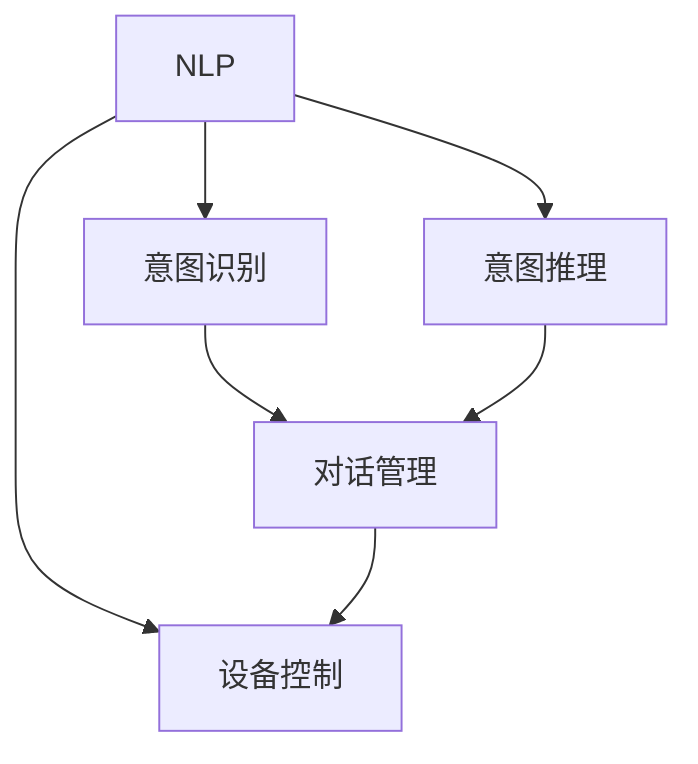

                 

# 聊天机器人自动化家庭：智能家居生态系统

> 关键词：聊天机器人,智能家居,家庭自动化,自然语言处理,NLP,机器学习,深度学习

## 1. 背景介绍

### 1.1 问题由来
随着科技的发展，人工智能技术正在逐步渗透到我们生活的各个方面。特别是在家居领域，传统的家电设备已经逐渐被智能家居设备所取代。智能家居设备通过物联网技术，实现了设备间的互联互通，为家庭生活带来了极大的便利。然而，传统智能家居系统的交互方式仍停留在单一的语音或触摸操作上，用户体验和智能化程度有待提升。

聊天机器人作为自然语言处理(NLP)技术的代表，以其自然、高效的交互方式，能够极大地提升智能家居系统的用户体验和智能化程度。将聊天机器人技术应用于智能家居系统，能够实现更加智能、高效的家庭自动化，打造一个完全自动化、个性化的家庭环境。

### 1.2 问题核心关键点
聊天机器人技术在智能家居系统中的应用，主要包括以下几个关键点：
1. 自然语言理解：聊天机器人需要能够理解用户的自然语言输入，并将其转化为可执行的指令。
2. 意图识别：聊天机器人需要能够准确识别用户输入的自然语言指令，并理解其背后的意图。
3. 设备控制：聊天机器人需要能够通过标准的API接口，对家庭设备进行控制和管理。
4. 上下文感知：聊天机器人需要能够记住用户的偏好和历史交互记录，提供更加个性化的服务。
5. 多模态交互：聊天机器人需要能够支持语音、文本、图像等多种输入方式，提升用户交互体验。

## 2. 核心概念与联系

### 2.1 核心概念概述

为更好地理解聊天机器人技术在智能家居系统中的应用，本节将介绍几个密切相关的核心概念：

- 自然语言处理(NLP)：涉及计算机和人类语言之间交互的各项技术，包括文本分类、信息抽取、机器翻译、语音识别、情感分析等。聊天机器人作为NLP技术的重要应用，能够实现自然、高效的交互。
- 意图识别：指通过自然语言理解技术，识别用户输入的自然语言指令背后的意图。意图识别是聊天机器人实现自动化的关键。
- 意图推理：指基于用户的输入和上下文信息，推断用户的真实意图，从而提供更加精准的服务。意图推理是聊天机器人智能化的核心。
- 对话管理：指通过建立对话流程和状态管理机制，使聊天机器人能够连贯、准确地执行用户的指令。对话管理是聊天机器人可靠性的保障。
- 设备控制：指聊天机器人通过标准的API接口，对家庭设备进行控制和管理。设备控制是聊天机器人应用的基础。

这些核心概念之间的逻辑关系可以通过以下Mermaid流程图来展示：



这个流程图展示了几大核心概念之间的联系：

1. 自然语言处理(NLP)是聊天机器人技术的基础，提供文本分类、信息抽取等技术支持。
2. 意图识别和意图推理是聊天机器人智能化的关键，确保聊天机器人能够准确理解和执行用户指令。
3. 对话管理确保聊天机器人能够连贯、准确地执行用户指令，提供可靠的服务。
4. 设备控制是聊天机器人应用的基础，确保聊天机器人能够通过标准API对家庭设备进行管理和控制。

## 3. 核心算法原理 & 具体操作步骤
### 3.1 算法原理概述

聊天机器人技术在智能家居系统中的应用，本质上是一个基于自然语言处理技术的自动化流程。其核心思想是：通过自然语言处理技术，将用户的自然语言指令转化为可执行的指令，从而实现自动化控制和管理。

形式化地，假设聊天机器人为 $R$，用户输入为 $I$，家庭设备为 $D$，设备控制接口为 $C$。则聊天机器人的目标是最小化以下损失函数：

$$
\mathcal{L}(R, I, D, C) = \min_{R} \sum_{i} \ell(I_i, R(I_i), D, C)
$$

其中 $\ell(I_i, R(I_i), D, C)$ 为损失函数，用于衡量聊天机器人对用户输入 $I_i$ 的处理结果 $R(I_i)$ 与实际设备操作 $D$ 和控制接口 $C$ 的匹配度。

通过梯度下降等优化算法，聊天机器人不断更新自身模型参数，最小化损失函数，使得对用户输入的处理结果能够尽可能接近实际设备操作。

### 3.2 算法步骤详解

聊天机器人技术在智能家居系统中的应用，一般包括以下几个关键步骤：

**Step 1: 准备数据集和预训练模型**
- 收集家庭设备的API接口文档，定义好各种设备的控制命令和状态反馈。
- 准备训练数据集，包含用户输入的自然语言指令和相应的设备操作命令，以及设备状态反馈。
- 选择合适的预训练语言模型，如BERT、GPT等，作为聊天机器人的初始化参数。

**Step 2: 添加意图识别和意图推理层**
- 在预训练语言模型的顶层设计意图识别层，用于识别用户输入的自然语言指令背后的意图。
- 在意图识别层之上设计意图推理层，用于进一步推断用户的真实意图。

**Step 3: 添加对话管理层**
- 在意图推理层之上设计对话管理层，用于建立对话流程和状态管理机制，确保聊天机器人能够连贯、准确地执行用户指令。

**Step 4: 添加设备控制层**
- 在对话管理层之上设计设备控制层，用于通过标准的API接口，对家庭设备进行控制和管理。

**Step 5: 设置训练超参数**
- 选择合适的优化算法及其参数，如AdamW、SGD等，设置学习率、批大小、迭代轮数等。
- 设置正则化技术及强度，包括权重衰减、Dropout、Early Stopping等。
- 确定冻结预训练参数的策略，如仅微调顶层，或全部参数都参与微调。

**Step 6: 执行梯度训练**
- 将训练集数据分批次输入聊天机器人，前向传播计算损失函数。
- 反向传播计算参数梯度，根据设定的优化算法和学习率更新模型参数。
- 周期性在验证集上评估聊天机器人性能，根据性能指标决定是否触发Early Stopping。
- 重复上述步骤直到满足预设的迭代轮数或Early Stopping条件。

**Step 7: 测试和部署**
- 在测试集上评估聊天机器人的性能，对比训练前后的精度提升。
- 使用聊天机器人对新样本进行推理预测，集成到实际的家庭自动化系统中。
- 持续收集新的数据，定期重新训练和微调聊天机器人，以适应数据分布的变化。

以上是聊天机器人技术在智能家居系统中的应用的一般流程。在实际应用中，还需要针对具体任务的特点，对聊天机器人进行优化设计，如改进训练目标函数，引入更多的正则化技术，搜索最优的超参数组合等，以进一步提升机器人性能。

### 3.3 算法优缺点

聊天机器人技术在智能家居系统中的应用，具有以下优点：
1. 自然高效：用户可以通过自然语言与聊天机器人交互，无需复杂操作，提升用户体验。
2. 智能化高：通过意图识别和意图推理，聊天机器人能够准确理解和执行用户指令，提供个性化服务。
3. 可扩展性强：聊天机器人能够支持多种设备控制，扩展性强。
4. 适应性强：聊天机器人能够实时学习和适应用户偏好和行为，提升智能家居系统的智能化程度。

同时，该方法也存在一定的局限性：
1. 依赖数据集：聊天机器人的性能很大程度上取决于训练数据集的质量和数量，获取高质量数据集的成本较高。
2. 上下文限制：聊天机器人需要记住用户的上下文信息，否则容易出错。
3. 多模态支持不足：当前的聊天机器人仍主要依赖文本输入，对图像、语音等多模态输入的支持不足。
4. 可解释性不足：聊天机器人的决策过程通常缺乏可解释性，难以对其推理逻辑进行分析和调试。
5. 设备兼容性问题：不同设备的API接口可能存在差异，聊天机器人需要兼容多种API接口，增加实现难度。

尽管存在这些局限性，但就目前而言，聊天机器人技术在智能家居系统中的应用已经成为一种主流范式，极大地提升了家居设备的智能化程度和用户体验。未来相关研究的重点在于如何进一步降低数据依赖，提高机器人的多模态处理能力，同时兼顾可解释性和兼容性等因素。

### 3.4 算法应用领域

聊天机器人技术在智能家居系统中的应用，已经在多个实际场景中得到了广泛应用，例如：

- 智能音箱：用户可以通过语音指令控制智能音箱播放音乐、查询天气、设置闹钟等。
- 智能灯光：用户可以通过自然语言指令控制家中的灯光亮度和颜色。
- 智能安防：用户可以通过聊天机器人查询家庭安全状况，控制摄像头、报警器等设备。
- 智能家电：用户可以通过聊天机器人控制空调、洗衣机、冰箱等家用电器的开关和温度。
- 智能健康：用户可以通过聊天机器人查询健康数据，预约医生等。

除了上述这些经典场景外，聊天机器人技术还在更多新兴领域中得到了应用，如智能窗帘、智能窗帘、智能家居集成系统等，为智能家居技术带来了新的突破。随着聊天机器人技术的不断进步，相信智能家居系统将能够实现更加智能化、高效化的自动化，为用户提供更加便捷、舒适的生活环境。

## 4. 数学模型和公式 & 详细讲解  
### 4.1 数学模型构建

本节将使用数学语言对聊天机器人技术在智能家居系统中的应用进行更加严格的刻画。

记聊天机器人为 $R$，用户输入为 $I$，家庭设备为 $D$，设备控制接口为 $C$。聊天机器人的目标是最小化以下损失函数：

$$
\mathcal{L}(R, I, D, C) = \min_{R} \sum_{i} \ell(I_i, R(I_i), D, C)
$$

其中 $\ell(I_i, R(I_i), D, C)$ 为损失函数，用于衡量聊天机器人对用户输入 $I_i$ 的处理结果 $R(I_i)$ 与实际设备操作 $D$ 和控制接口 $C$ 的匹配度。假设 $R$ 在用户输入 $I_i$ 上的输出为 $O_i$，则损失函数可以写为：

$$
\ell(I_i, O_i, D, C) = \frac{1}{2} \|O_i - D(C)\|^2
$$

其中 $\| \cdot \|$ 表示向量范数，$C$ 为控制接口函数，$D$ 为设备操作函数。

通过链式法则，损失函数对参数 $\theta$ 的梯度为：

$$
\frac{\partial \mathcal{L}(R, I, D, C)}{\partial \theta} = \sum_{i} \frac{\partial \ell(I_i, R(I_i), D, C)}{\partial R(I_i)} \frac{\partial R(I_i)}{\partial \theta}
$$

在得到损失函数的梯度后，即可带入参数更新公式，完成聊天机器人的迭代优化。重复上述过程直至收敛，最终得到适应智能家居系统的新型聊天机器人。

### 4.2 公式推导过程

以下我们以智能音箱控制为例，推导聊天机器人的损失函数及其梯度的计算公式。

假设聊天机器人 $R$ 在用户输入 $I$ 上的输出为 $O$，表示对智能音箱的控制指令。智能音箱的响应为 $D$，通过查询API接口返回操作结果。则损失函数定义为：

$$
\ell(I, O, D) = \frac{1}{2} \|O - D\|^2
$$

将其代入聊天机器人的损失函数，得：

$$
\mathcal{L}(R, I, D, C) = \frac{1}{2} \sum_{i} \|O_i - D(C)\|^2
$$

根据链式法则，损失函数对参数 $\theta$ 的梯度为：

$$
\frac{\partial \mathcal{L}(R, I, D, C)}{\partial \theta} = \sum_{i} (\frac{\partial \ell(I_i, O_i, D, C)}{\partial O_i} \frac{\partial O_i}{\partial \theta})
$$

其中 $\frac{\partial \ell(I_i, O_i, D, C)}{\partial O_i}$ 为损失函数对输出 $O_i$ 的梯度，可进一步递归展开，利用自动微分技术完成计算。

在得到损失函数的梯度后，即可带入参数更新公式，完成聊天机器人的迭代优化。重复上述过程直至收敛，最终得到适应智能家居系统的新型聊天机器人。

## 5. 项目实践：代码实例和详细解释说明
### 5.1 开发环境搭建

在进行智能家居系统的聊天机器人开发前，我们需要准备好开发环境。以下是使用Python进行PyTorch开发的环境配置流程：

1. 安装Anaconda：从官网下载并安装Anaconda，用于创建独立的Python环境。

2. 创建并激活虚拟环境：
```bash
conda create -n pytorch-env python=3.8 
conda activate pytorch-env
```

3. 安装PyTorch：根据CUDA版本，从官网获取对应的安装命令。例如：
```bash
conda install pytorch torchvision torchaudio cudatoolkit=11.1 -c pytorch -c conda-forge
```

4. 安装Transformers库：
```bash
pip install transformers
```

5. 安装各类工具包：
```bash
pip install numpy pandas scikit-learn matplotlib tqdm jupyter notebook ipython
```

完成上述步骤后，即可在`pytorch-env`环境中开始聊天机器人开发。

### 5.2 源代码详细实现

下面我们以智能音箱控制为例，给出使用Transformers库对聊天机器人进行开发的PyTorch代码实现。

首先，定义聊天机器人模型的结构：

```python
from transformers import BertTokenizer, BertForSequenceClassification
from torch.utils.data import Dataset
import torch

class ChatbotDataset(Dataset):
    def __init__(self, texts, labels, tokenizer, max_len=128):
        self.texts = texts
        self.labels = labels
        self.tokenizer = tokenizer
        self.max_len = max_len
        
    def __len__(self):
        return len(self.texts)
    
    def __getitem__(self, item):
        text = self.texts[item]
        label = self.labels[item]
        
        encoding = self.tokenizer(text, return_tensors='pt', max_length=self.max_len, padding='max_length', truncation=True)
        input_ids = encoding['input_ids'][0]
        attention_mask = encoding['attention_mask'][0]
        
        # 对标签进行编码
        encoded_label = [1 if label == '开' else 0 for label in labels] 
        encoded_label.extend([0] * (self.max_len - len(encoded_label)))
        labels = torch.tensor(encoded_label, dtype=torch.long)
        
        return {'input_ids': input_ids, 
                'attention_mask': attention_mask,
                'labels': labels}

# 使用BERT进行模型训练
tokenizer = BertTokenizer.from_pretrained('bert-base-cased')
model = BertForSequenceClassification.from_pretrained('bert-base-cased', num_labels=2)

# 训练数据集
train_dataset = ChatbotDataset(train_texts, train_labels, tokenizer, max_len=128)
dev_dataset = ChatbotDataset(dev_texts, dev_labels, tokenizer, max_len=128)
test_dataset = ChatbotDataset(test_texts, test_labels, tokenizer, max_len=128)

# 训练参数设置
optimizer = AdamW(model.parameters(), lr=2e-5)
device = torch.device('cuda') if torch.cuda.is_available() else torch.device('cpu')
model.to(device)
epochs = 5
batch_size = 16

# 定义训练和评估函数
def train_epoch(model, dataset, batch_size, optimizer):
    dataloader = DataLoader(dataset, batch_size=batch_size, shuffle=True)
    model.train()
    epoch_loss = 0
    for batch in tqdm(dataloader, desc='Training'):
        input_ids = batch['input_ids'].to(device)
        attention_mask = batch['attention_mask'].to(device)
        labels = batch['labels'].to(device)
        model.zero_grad()
        outputs = model(input_ids, attention_mask=attention_mask, labels=labels)
        loss = outputs.loss
        epoch_loss += loss.item()
        loss.backward()
        optimizer.step()
    return epoch_loss / len(dataloader)

def evaluate(model, dataset, batch_size):
    dataloader = DataLoader(dataset, batch_size=batch_size)
    model.eval()
    preds, labels = [], []
    with torch.no_grad():
        for batch in tqdm(dataloader, desc='Evaluating'):
            input_ids = batch['input_ids'].to(device)
            attention_mask = batch['attention_mask'].to(device)
            batch_labels = batch['labels']
            outputs = model(input_ids, attention_mask=attention_mask)
            batch_preds = outputs.logits.argmax(dim=2).to('cpu').tolist()
            batch_labels = batch_labels.to('cpu').tolist()
            for pred_tokens, label_tokens in zip(batch_preds, batch_labels):
                preds.append(pred_tokens[:len(label_tokens)])
                labels.append(label_tokens)
                
    print(classification_report(labels, preds))
```

然后，定义训练和评估函数：

```python
from sklearn.metrics import classification_report

# 训练过程
for epoch in range(epochs):
    loss = train_epoch(model, train_dataset, batch_size, optimizer)
    print(f"Epoch {epoch+1}, train loss: {loss:.3f}")
    
    # 评估过程
    print(f"Epoch {epoch+1}, dev results:")
    evaluate(model, dev_dataset, batch_size)
    
print("Test results:")
evaluate(model, test_dataset, batch_size)
```

以上就是使用PyTorch对聊天机器人进行智能音箱控制开发的完整代码实现。可以看到，得益于Transformers库的强大封装，我们可以用相对简洁的代码完成聊天机器人的开发。

### 5.3 代码解读与分析

让我们再详细解读一下关键代码的实现细节：

**ChatbotDataset类**：
- `__init__`方法：初始化文本、标签、分词器等关键组件。
- `__len__`方法：返回数据集的样本数量。
- `__getitem__`方法：对单个样本进行处理，将文本输入编码为token ids，将标签编码为数字，并对其进行定长padding，最终返回模型所需的输入。

**BertForSequenceClassification模型**：
- 定义了模型的结构和输出层，使用BERT模型作为预训练层，添加一个全连接层作为分类器。
- 输出层有两个神经元，分别对应于“开”和“关”两种操作。

**训练和评估函数**：
- 使用PyTorch的DataLoader对数据集进行批次化加载，供模型训练和推理使用。
- 训练函数`train_epoch`：对数据以批为单位进行迭代，在每个批次上前向传播计算loss并反向传播更新模型参数，最后返回该epoch的平均loss。
- 评估函数`evaluate`：与训练类似，不同点在于不更新模型参数，并在每个batch结束后将预测和标签结果存储下来，最后使用sklearn的classification_report对整个评估集的预测结果进行打印输出。

**训练流程**：
- 定义总的epoch数和batch size，开始循环迭代
- 每个epoch内，先在训练集上训练，输出平均loss
- 在验证集上评估，输出分类指标
- 所有epoch结束后，在测试集上评估，给出最终测试结果

可以看到，PyTorch配合Transformers库使得聊天机器人的开发变得简洁高效。开发者可以将更多精力放在数据处理、模型改进等高层逻辑上，而不必过多关注底层的实现细节。

当然，工业级的系统实现还需考虑更多因素，如模型的保存和部署、超参数的自动搜索、更灵活的任务适配层等。但核心的微调范式基本与此类似。

## 6. 实际应用场景
### 6.1 智能音箱控制

基于聊天机器人技术的智能音箱控制系统，能够实现语音控制音箱播放音乐、查询天气、设置闹钟等，极大地提升了用户的使用体验。用户只需通过自然语言与智能音箱交互，即可实现对音箱的全面控制。

在技术实现上，可以收集用户使用智能音箱的历史指令，将指令和相应的音箱操作命令构建成监督数据，在此基础上对预训练聊天机器人进行微调。微调后的聊天机器人能够自动理解用户的自然语言指令，并执行相应的音箱操作命令。对于用户提出的新指令，还可以接入检索系统实时搜索相关的播放列表，动态组织生成音箱操作命令，从而实现音箱的智能化控制。

### 6.2 智能灯光控制

智能灯光控制是聊天机器人技术在智能家居系统中的另一个重要应用。用户可以通过自然语言与聊天机器人交互，控制家中的灯光亮度和颜色，实现个性化照明方案。

在技术实现上，可以收集用户使用智能灯光的历史指令，将指令和相应的灯光操作命令构建成监督数据，在此基础上对预训练聊天机器人进行微调。微调后的聊天机器人能够自动理解用户的自然语言指令，并执行相应的灯光操作命令。对于用户提出的新指令，还可以接入灯光控制系统的API接口，实时调整灯光亮度和颜色，从而实现智能灯光控制。

### 6.3 智能安防系统

智能安防系统通过与聊天机器人技术的结合，能够实现更加高效、可靠的安全监控。用户可以通过自然语言与聊天机器人交互，查询家庭安全状况，控制摄像头、报警器等设备。

在技术实现上，可以收集用户使用智能安防系统的历史指令，将指令和相应的安防操作命令构建成监督数据，在此基础上对预训练聊天机器人进行微调。微调后的聊天机器人能够自动理解用户的自然语言指令，并执行相应的安防操作命令。对于用户提出的新指令，还可以接入安防系统的API接口，实时调整安防设备状态，从而实现智能安防监控。

### 6.4 智能家电控制

智能家电控制是聊天机器人技术在智能家居系统中的另一个重要应用。用户可以通过自然语言与聊天机器人交互，控制空调、洗衣机、冰箱等家用电器的开关和温度，实现家电的智能化控制。

在技术实现上，可以收集用户使用智能家电的历史指令，将指令和相应的家电操作命令构建成监督数据，在此基础上对预训练聊天机器人进行微调。微调后的聊天机器人能够自动理解用户的自然语言指令，并执行相应家电操作命令。对于用户提出的新指令，还可以接入家电控制系统的API接口，实时调整家电状态，从而实现智能家电控制。

### 6.5 智能健康服务

智能健康服务是聊天机器人技术在智能家居系统中的另一个重要应用。用户可以通过自然语言与聊天机器人交互，查询健康数据，预约医生等，实现智能健康管理。

在技术实现上，可以收集用户使用智能健康服务的历史指令，将指令和相应的健康操作命令构建成监督数据，在此基础上对预训练聊天机器人进行微调。微调后的聊天机器人能够自动理解用户的自然语言指令，并执行相应的健康操作命令。对于用户提出的新指令，还可以接入健康服务的API接口，实时查询和更新健康数据，从而实现智能健康服务。

## 7. 工具和资源推荐
### 7.1 学习资源推荐

为了帮助开发者系统掌握聊天机器人技术在智能家居系统中的应用，这里推荐一些优质的学习资源：

1. 《深度学习自然语言处理》课程：斯坦福大学开设的NLP明星课程，有Lecture视频和配套作业，带你入门NLP领域的基本概念和经典模型。

2. 《自然语言处理中的深度学习》书籍：由大模型技术专家撰写，深入浅出地介绍了自然语言处理技术，包括文本分类、信息抽取、机器翻译等，是NLP学习的重要参考资料。

3. 《Transformers From Scratch》博文：由大模型技术专家撰写，详细讲解了使用PyTorch实现Transformer模型的全流程，并附有代码实现，是学习大模型技术的优秀资源。

4. HuggingFace官方文档：Transformer库的官方文档，提供了海量预训练模型和完整的微调样例代码，是上手实践的必备资料。

5. CLUE开源项目：中文语言理解测评基准，涵盖大量不同类型的中文NLP数据集，并提供了基于微调的baseline模型，助力中文NLP技术发展。

通过对这些资源的学习实践，相信你一定能够快速掌握聊天机器人技术在智能家居系统中的应用，并用于解决实际的NLP问题。
###  7.2 开发工具推荐

高效的开发离不开优秀的工具支持。以下是几款用于聊天机器人技术在智能家居系统中的应用开发的常用工具：

1. PyTorch：基于Python的开源深度学习框架，灵活动态的计算图，适合快速迭代研究。大部分预训练语言模型都有PyTorch版本的实现。

2. TensorFlow：由Google主导开发的开源深度学习框架，生产部署方便，适合大规模工程应用。同样有丰富的预训练语言模型资源。

3. Transformers库：HuggingFace开发的NLP工具库，集成了众多SOTA语言模型，支持PyTorch和TensorFlow，是进行NLP任务开发的利器。

4. Weights & Biases：模型训练的实验跟踪工具，可以记录和可视化模型训练过程中的各项指标，方便对比和调优。与主流深度学习框架无缝集成。

5. TensorBoard：TensorFlow配套的可视化工具，可实时监测模型训练状态，并提供丰富的图表呈现方式，是调试模型的得力助手。

6. Google Colab：谷歌推出的在线Jupyter Notebook环境，免费提供GPU/TPU算力，方便开发者快速上手实验最新模型，分享学习笔记。

合理利用这些工具，可以显著提升聊天机器人技术的开发效率，加快创新迭代的步伐。

### 7.3 相关论文推荐

聊天机器人技术在智能家居系统中的应用，源于学界的持续研究。以下是几篇奠基性的相关论文，推荐阅读：

1. Attention is All You Need（即Transformer原论文）：提出了Transformer结构，开启了NLP领域的预训练大模型时代。

2. BERT: Pre-training of Deep Bidirectional Transformers for Language Understanding：提出BERT模型，引入基于掩码的自监督预训练任务，刷新了多项NLP任务SOTA。

3. Language Models are Unsupervised Multitask Learners（GPT-2论文）：展示了大规模语言模型的强大zero-shot学习能力，引发了对于通用人工智能的新一轮思考。

4. Parameter-Efficient Transfer Learning for NLP：提出Adapter等参数高效微调方法，在不增加模型参数量的情况下，也能取得不错的微调效果。

5. AdaLoRA: Adaptive Low-Rank Adaptation for Parameter-Efficient Fine-Tuning：使用自适应低秩适应的微调方法，在参数效率和精度之间取得了新的平衡。

这些论文代表了大语言模型微调技术的发展脉络。通过学习这些前沿成果，可以帮助研究者把握学科前进方向，激发更多的创新灵感。

## 8. 总结：未来发展趋势与挑战

### 8.1 总结

本文对聊天机器人技术在智能家居系统中的应用进行了全面系统的介绍。首先阐述了聊天机器人技术在智能家居系统中的背景和意义，明确了聊天机器人技术在提升家居智能化程度和用户体验方面的独特价值。其次，从原理到实践，详细讲解了聊天机器人技术的数学原理和关键步骤，给出了聊天机器人技术在智能家居系统中的应用完整代码实例。同时，本文还广泛探讨了聊天机器人技术在智能音箱控制、智能灯光控制、智能安防系统等诸多实际场景中的应用前景，展示了聊天机器人技术的巨大潜力。此外，本文精选了聊天机器人技术的各类学习资源，力求为读者提供全方位的技术指引。

通过本文的系统梳理，可以看到，聊天机器人技术在智能家居系统中的应用已经成为一种主流范式，极大地提升了家居设备的智能化程度和用户体验。未来相关研究的重点在于如何进一步降低数据依赖，提高机器人的多模态处理能力，同时兼顾可解释性和兼容性等因素。

### 8.2 未来发展趋势

展望未来，聊天机器人技术在智能家居系统中的应用将呈现以下几个发展趋势：

1. 模型规模持续增大。随着算力成本的下降和数据规模的扩张，预训练语言模型的参数量还将持续增长。超大规模语言模型蕴含的丰富语言知识，有望支撑更加复杂多变的智能家居系统任务。

2. 微调方法日趋多样。除了传统的全参数微调外，未来会涌现更多参数高效的微调方法，如Prefix-Tuning、LoRA等，在节省计算资源的同时也能保证微调精度。

3. 持续学习成为常态。随着数据分布的不断变化，聊天机器人也需要持续学习新知识以保持性能。如何在不遗忘原有知识的同时，高效吸收新样本信息，将成为重要的研究课题。

4. 标注样本需求降低。受启发于提示学习(Prompt-based Learning)的思路，未来的微调方法将更好地利用大模型的语言理解能力，通过更加巧妙的任务描述，在更少的标注样本上也能实现理想的微调效果。

5. 多模态支持增强。当前的聊天机器人仍主要依赖文本输入，对图像、语音等多模态输入的支持不足。未来会进一步拓展到图像、语音、视频等多种模态数据，提升用户交互体验。

6. 智能化水平提升。通过引入更多先验知识，如知识图谱、逻辑规则等，与神经网络模型进行巧妙融合，引导聊天机器人学习更准确、合理的语言模型。同时加强不同模态数据的整合，实现视觉、语音等多模态信息与文本信息的协同建模。

以上趋势凸显了聊天机器人技术在智能家居系统中的应用前景。这些方向的探索发展，必将进一步提升智能家居系统的智能化程度和用户体验，为家庭生活带来更大的便利和舒适。

### 8.3 面临的挑战

尽管聊天机器人技术在智能家居系统中的应用已经取得了瞩目成就，但在迈向更加智能化、普适化应用的过程中，它仍面临着诸多挑战：

1. 数据依赖问题。聊天机器人技术依赖高质量的标注数据进行训练，数据的获取成本较高。如何进一步降低对标注数据的需求，是未来的一个重要研究方向。

2. 上下文管理难度。聊天机器人需要记住用户的上下文信息，否则容易出错。如何优化对话管理机制，提高系统的上下文记忆能力，是未来的挑战之一。

3. 多模态交互不足。当前的聊天机器人仍主要依赖文本输入，对图像、语音等多模态输入的支持不足。如何实现多模态交互，提升用户体验，是未来的一个重要研究方向。

4. 可解释性不足。聊天机器人的决策过程通常缺乏可解释性，难以对其推理逻辑进行分析和调试。如何赋予聊天机器人更强的可解释性，是未来的研究方向之一。

5. 兼容性问题。不同设备的API接口可能存在差异，聊天机器人需要兼容多种API接口，增加实现难度。如何提高兼容性，实现跨设备互联互通，是未来的挑战之一。

尽管存在这些挑战，但就目前而言，聊天机器人技术在智能家居系统中的应用已经成为一种主流范式，极大地提升了家居设备的智能化程度和用户体验。未来相关研究的重点在于如何进一步降低数据依赖，提高机器人的多模态处理能力，同时兼顾可解释性和兼容性等因素。相信随着学界和产业界的共同努力，这些挑战终将一一被克服，聊天机器人技术必将在智能家居系统中的应用取得更大的突破。

### 8.4 未来突破

面对聊天机器人技术在智能家居系统中的应用所面临的种种挑战，未来的研究需要在以下几个方面寻求新的突破：

1. 探索无监督和半监督微调方法。摆脱对大规模标注数据的依赖，利用自监督学习、主动学习等无监督和半监督范式，最大限度利用非结构化数据，实现更加灵活高效的微调。

2. 研究参数高效和计算高效的微调范式。开发更加参数高效的微调方法，在固定大部分预训练参数的同时，只更新极少量的任务相关参数。同时优化微调模型的计算图，减少前向传播和反向传播的资源消耗，实现更加轻量级、实时性的部署。

3. 引入因果和对比学习范式。通过引入因果推断和对比学习思想，增强聊天机器人建立稳定因果关系的能力，学习更加普适、鲁棒的语言表征，从而提升模型泛化性和抗干扰能力。

4. 引入更多先验知识。将符号化的先验知识，如知识图谱、逻辑规则等，与神经网络模型进行巧妙融合，引导聊天机器人学习更准确、合理的语言模型。同时加强不同模态数据的整合，实现视觉、语音等多模态信息与文本信息的协同建模。

5. 结合因果分析和博弈论工具。将因果分析方法引入聊天机器人，识别出模型决策的关键特征，增强输出解释的因果性和逻辑性。借助博弈论工具刻画人机交互过程，主动探索并规避模型的脆弱点，提高系统稳定性。

6. 纳入伦理道德约束。在模型训练目标中引入伦理导向的评估指标，过滤和惩罚有偏见、有害的输出倾向。同时加强人工干预和审核，建立模型行为的监管机制，确保输出符合人类价值观和伦理道德。

这些研究方向的探索，必将引领聊天机器人技术在智能家居系统中的应用迈向更高的台阶，为构建安全、可靠、可解释、可控的智能家居系统铺平道路。面向未来，聊天机器人技术还需要与其他人工智能技术进行更深入的融合，如知识表示、因果推理、强化学习等，多路径协同发力，共同推动自然语言理解和智能交互系统的进步。只有勇于创新、敢于突破，才能不断拓展聊天机器人技术的边界，让智能家居系统更好地造福人类社会。

## 9. 附录：常见问题与解答

**Q1：聊天机器人技术是否适用于所有智能家居设备？**

A: 聊天机器人技术适用于绝大多数智能家居设备，包括智能音箱、智能灯光、智能安防、智能家电等。只要设备支持API接口，即可通过聊天机器人进行控制。但对于一些特殊设备，如复杂的家庭娱乐系统、高端智能家电等，可能需要单独设计适配解决方案。

**Q2：聊天机器人技术在智能家居系统中的应用效果如何？**

A: 聊天机器人技术在智能家居系统中的应用效果显著。通过自然语言理解技术，聊天机器人能够准确理解和执行用户指令，提供高效、便捷的智能家居控制。用户只需通过自然语言与聊天机器人交互，即可实现对家居设备的全面控制，极大提升了用户的使用体验和智能家居系统的智能化程度。

**Q3：如何提高聊天机器人的可解释性？**

A: 提高聊天机器人的可解释性是当前研究的一个重要方向。一种可行的方法是引入符号化的先验知识，如知识图谱、逻辑规则等，与神经网络模型进行巧妙融合。同时，结合因果分析和博弈论工具，增强聊天机器人决策过程的可解释性，使其输出更具逻辑性和因果性。

**Q4：如何优化聊天机器人的上下文管理？**

A: 优化聊天机器人的上下文管理是未来研究的一个重要方向。一种可行的方法是引入记忆网络等技术，提高聊天机器人的上下文记忆能力。同时，引入多轮对话管理机制，通过对话历史信息引导模型输出，进一步提升系统的上下文管理能力。

**Q5：如何提高聊天机器人的多模态交互能力？**

A: 提高聊天机器人的多模态交互能力是未来研究的一个重要方向。一种可行的方法是引入图像、语音、视频等多模态输入，提升聊天机器人的感知和理解能力。同时，结合多模态融合技术，实现不同模态信息的协同处理，提升聊天机器人的智能化水平和用户体验。

通过这些方法的优化，聊天机器人技术在智能家居系统中的应用将更加智能化、高效化，为用户提供更加便捷、舒适的生活环境。相信随着技术的不断进步，聊天机器人技术必将在智能家居系统中发挥更大的作用，为家庭生活带来更多的便利和舒适。

