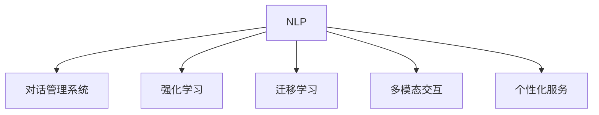

                 

# 聊天机器人虚拟助理的进化：成为终极伴侣

## 1. 背景介绍

随着人工智能技术的快速发展，聊天机器人和虚拟助理已经成为人们日常生活和工作中不可或缺的工具。从最早的简单文本聊天机器人，到今天具备复杂逻辑推理、多模态交互、个性化服务的智能虚拟助理，这些机器人已经实现了从功能化到智能化的巨大进化。本文将深入探讨聊天机器人虚拟助理的进化之路，以及如何通过人工智能技术将其打造成每个人的终极伴侣。

### 1.1 问题由来

聊天机器人最早出现于上世纪60年代，最初的形式是简单的基于规则的系统，通过预设的规则和脚本来处理用户的输入。随着自然语言处理(NLP)和机器学习技术的发展，聊天机器人逐步具备了更高级的语义理解和对话管理能力。

然而，尽管技术已经取得了显著进步，但传统聊天机器人在实际应用中仍存在诸多局限性：

- **语义理解不足**：无法理解复杂的语义和语境，常常导致误解和错误回答。
- **缺乏上下文记忆**：无法保留对话上下文，导致对话断续和重复。
- **互动体验单一**：通常只能通过文本进行交互，缺乏多模态的互动方式。
- **个性化不足**：难以根据用户的历史行为和偏好进行个性化推荐和响应。

为了解决这些问题，并进一步提升聊天机器人虚拟助理的智能水平，研究者和开发者们不断探索新的技术手段和方法，推动了聊天机器人的飞速进化。

### 1.2 问题核心关键点

聊天机器人虚拟助理的进化主要围绕以下几个核心关键点展开：

- **自然语言理解(NLU)**：使机器人能够理解自然语言的多义性和上下文依赖。
- **对话管理**：设计复杂的对话策略，确保机器人能够顺畅地进行多轮对话。
- **个性化服务**：根据用户的历史数据和行为，提供个性化的服务和推荐。
- **多模态交互**：支持文本、语音、图像等多种交互方式，提升用户体验。
- **高效学习**：通过在线学习、迁移学习、强化学习等技术，提升机器人的智能水平。

这些关键点共同构成了聊天机器人虚拟助理进化的技术基础，为其成为人们的终极伴侣提供了可能。

## 2. 核心概念与联系

### 2.1 核心概念概述

为了更清晰地理解聊天机器人虚拟助理的进化过程，本节将介绍几个密切相关的核心概念：

- **自然语言处理(NLP)**：使计算机能够理解、处理和生成人类语言的技术。
- **对话管理系统(DM)**：设计和管理机器人与用户之间的对话流程，确保对话的连贯性和逻辑性。
- **强化学习(RL)**：通过与环境的交互，使机器人在给定的目标下，通过试错学习最优策略。
- **迁移学习**：将一个领域学习到的知识迁移到另一个领域，提升机器人在新任务上的表现。
- **多模态交互**：使机器人支持多种交互方式，提升用户体验和互动性。
- **个性化服务**：根据用户的历史数据和行为，提供定制化的服务，增强用户的黏性和满意度。

这些概念之间的联系可以通过以下Mermaid流程图来展示：



这个流程图展示了聊天机器人虚拟助理进化的核心概念及其相互关系：

1. **NLP** 为聊天机器人提供语义理解能力。
2. **DM** 负责对话流程的管理，确保对话连贯和逻辑性。
3. **RL** 通过试错学习，使机器人在复杂环境中取得最佳策略。
4. **迁移学习** 通过知识迁移，使机器人具备跨领域适应能力。
5. **多模态交互** 提升用户体验，支持多种交互方式。
6. **个性化服务** 根据用户历史数据，提供定制化服务。

## 3. 核心算法原理 & 具体操作步骤
### 3.1 算法原理概述

聊天机器人虚拟助理的进化主要基于以下核心算法原理：

1. **深度学习**：利用深度神经网络处理自然语言，提升语义理解和对话管理能力。
2. **序列到序列模型**：通过编码器-解码器结构，将用户输入转化为机器人的响应。
3. **注意力机制**：使机器人能够关注对话上下文中的关键信息，提升响应准确性。
4. **强化学习**：通过奖励机制和策略优化，使机器人能够在对话中做出最优决策。
5. **迁移学习**：将预训练模型的知识迁移到新任务中，减少新任务学习的时间和成本。
6. **多模态融合**：将文本、语音、图像等多种信息源进行融合，提升互动体验。
7. **个性化服务**：利用用户的历史数据，进行个性化推荐和定制化服务。

### 3.2 算法步骤详解

以下是一个简单的聊天机器人虚拟助理的微调步骤，以供参考：

1. **数据收集与预处理**：
   - 收集用户对话数据，包括文本、语音、图像等。
   - 对数据进行清洗和标注，确保数据质量。

2. **模型选择与初始化**：
   - 选择适合的深度学习模型，如Transformer。
   - 在大型无标签语料库上进行预训练，如GPT-3。

3. **任务适配**：
   - 根据具体任务需求，添加或调整对话管理模块。
   - 设计或优化奖励函数，确保机器人在对话中做出最优决策。

4. **模型微调**：
   - 使用少量标注数据进行有监督训练，微调模型参数。
   - 应用正则化技术，防止过拟合。

5. **多模态融合**：
   - 将语音识别、图像识别等模块与对话模块结合，实现多模态交互。
   - 设计统一的接口和协议，确保模块之间的无缝协作。

6. **个性化服务**：
   - 收集用户的历史数据和行为，设计个性化推荐系统。
   - 实时更新用户画像，提供定制化服务。

### 3.3 算法优缺点

聊天机器人虚拟助理进化过程中的算法具有以下优缺点：

**优点**：
- **高智能水平**：通过深度学习和大规模数据预训练，使机器人具备强大的语义理解和对话管理能力。
- **灵活性**：支持多模态交互和个性化服务，提升用户体验。
- **泛化能力**：利用迁移学习，使机器人具备跨领域适应能力。

**缺点**：
- **资源消耗高**：深度学习模型通常需要大量的计算资源和时间。
- **可解释性不足**：复杂的深度学习模型难以解释其内部决策过程。
- **数据隐私问题**：个性化服务需要收集和处理大量用户数据，可能引发隐私泄露问题。

### 3.4 算法应用领域

聊天机器人虚拟助理的应用领域非常广泛，包括但不限于：

- **客户服务**：提供24/7的客户支持，解答常见问题，提升客户满意度。
- **智能助手**：管理日程、提醒事项、搜索信息等，提升个人生活和工作效率。
- **健康医疗**：提供健康咨询、疾病诊断、用药建议等，辅助医疗服务。
- **教育培训**：提供个性化学习建议、智能答疑、作业批改等服务，提升教育质量。
- **娱乐互动**：提供游戏、聊天、故事生成等娱乐功能，丰富用户生活。

## 4. 数学模型和公式 & 详细讲解 & 举例说明
### 4.1 数学模型构建

聊天机器人虚拟助理的构建涉及到多个子模型，每个子模型都有其对应的数学模型：

1. **自然语言理解(NLU)**：
   - 使用Transformer等模型进行编码器解码器结构设计。
   - 输入为文本序列，输出为表示该文本的向量。

2. **对话管理**：
   - 使用基于RNN或Transformer的序列生成模型。
   - 输入为历史对话和上下文信息，输出为下一个对话动作。

3. **强化学习**：
   - 使用Q-learning或策略梯度方法。
   - 输入为当前状态和行动，输出为下一步最优行动。

4. **个性化服务**：
   - 使用协同过滤、矩阵分解等推荐算法。
   - 输入为用户历史行为数据，输出为推荐结果。

### 4.2 公式推导过程

以下以自然语言理解(NLU)模型为例，进行详细公式推导：

假设输入为文本序列 $X=\{x_1, x_2, ..., x_n\}$，输出为向量表示 $Y=\{y_1, y_2, ..., y_n\}$。

1. **编码器部分**：
   - 使用Transformer模型，将文本序列转换为向量表示。
   - 假设编码器输出为 $h_1, h_2, ..., h_n$，通过Attention机制计算出向量表示 $Y$。

   $$
   Y = \text{Attention}(\{h_1, h_2, ..., h_n\})
   $$

2. **解码器部分**：
   - 使用另一层Transformer模型，将向量表示 $Y$ 转换为输出文本。
   - 假设解码器输出为 $o_1, o_2, ..., o_n$，通过softmax函数计算出概率分布 $P$。

   $$
   P = \text{softmax}(o_1, o_2, ..., o_n)
   $$

   其中，softmax函数定义如下：

   $$
   \text{softmax}(x) = \frac{e^x}{\sum_{i=1}^n e^x_i}
   $$

   最终，机器人的输出为 $Y$ 中概率最大的词汇。

### 4.3 案例分析与讲解

以智能客服机器人为例，分析其构建和应用过程：

1. **数据收集与预处理**：
   - 收集历史客服对话数据，进行文本清洗和标注。
   - 将对话数据划分为训练集和测试集，确保数据分布一致。

2. **模型选择与初始化**：
   - 选择适合的大型预训练模型，如BERT。
   - 使用预训练模型进行编码器解码器结构设计。

3. **任务适配**：
   - 添加上下文理解模块，使机器人能够理解对话上下文。
   - 设计自定义的动作空间，定义对话中的可用动作。

4. **模型微调**：
   - 使用训练集数据进行微调，优化对话管理模块。
   - 应用正则化技术，防止过拟合。

5. **多模态融合**：
   - 集成语音识别、图像识别模块，支持语音和图像输入。
   - 设计统一的接口，确保不同模块之间的数据交互。

6. **个性化服务**：
   - 收集用户历史行为数据，构建用户画像。
   - 根据用户画像提供个性化服务，如推荐产品、定制化回复等。

通过上述步骤，可以实现一个具备智能客服功能的聊天机器人，提升用户体验和效率。

## 5. 项目实践：代码实例和详细解释说明
### 5.1 开发环境搭建

在开始项目实践前，我们需要准备好开发环境：

1. **安装Python**：
   ```bash
   sudo apt-get install python3
   ```

2. **安装TensorFlow**：
   ```bash
   pip install tensorflow
   ```

3. **安装TensorBoard**：
   ```bash
   pip install tensorboard
   ```

4. **安装PyTorch**：
   ```bash
   pip install torch
   ```

5. **安装PyTorch Lightning**：
   ```bash
   pip install pytorch-lightning
   ```

6. **安装PyTorch Transformers**：
   ```bash
   pip install transformers
   ```

完成上述步骤后，即可在Python环境中开始项目实践。

### 5.2 源代码详细实现

以下是一个简单的聊天机器人虚拟助理的PyTorch代码实现，包括自然语言理解(NLU)、对话管理(DM)和个性化服务(PM)三个部分。

```python
import torch
import torch.nn as nn
import torch.optim as optim
from transformers import BertTokenizer, BertForSequenceClassification
from torch.utils.data import Dataset, DataLoader
from sklearn.metrics import accuracy_score, precision_score, recall_score, f1_score

class ChatbotDataset(Dataset):
    def __init__(self, texts, labels):
        self.texts = texts
        self.labels = labels
        
    def __len__(self):
        return len(self.texts)
    
    def __getitem__(self, item):
        text = self.texts[item]
        label = self.labels[item]
        
        tokenizer = BertTokenizer.from_pretrained('bert-base-cased')
        encoding = tokenizer(text, return_tensors='pt', max_length=512, padding='max_length', truncation=True)
        input_ids = encoding['input_ids'][0]
        attention_mask = encoding['attention_mask'][0]
        return {'input_ids': input_ids, 
                'attention_mask': attention_mask,
                'labels': label}

# 数据加载器
train_dataset = ChatbotDataset(train_texts, train_labels)
test_dataset = ChatbotDataset(test_texts, test_labels)
batch_size = 64

# 模型初始化
device = torch.device('cuda' if torch.cuda.is_available() else 'cpu')
model = BertForSequenceClassification.from_pretrained('bert-base-cased', num_labels=2).to(device)
model.train()

# 优化器和损失函数
optimizer = optim.Adam(model.parameters(), lr=2e-5)
criterion = nn.CrossEntropyLoss().to(device)

# 训练过程
def train_epoch(model, dataset, batch_size, optimizer, criterion):
    dataloader = DataLoader(dataset, batch_size=batch_size, shuffle=True)
    model.train()
    epoch_loss = 0
    for batch in dataloader:
        input_ids = batch['input_ids'].to(device)
        attention_mask = batch['attention_mask'].to(device)
        labels = batch['labels'].to(device)
        model.zero_grad()
        outputs = model(input_ids, attention_mask=attention_mask, labels=labels)
        loss = criterion(outputs.logits, labels)
        epoch_loss += loss.item()
        loss.backward()
        optimizer.step()
    return epoch_loss / len(dataloader)

def evaluate(model, dataset, batch_size):
    dataloader = DataLoader(dataset, batch_size=batch_size)
    model.eval()
    preds, labels = [], []
    with torch.no_grad():
        for batch in dataloader:
            input_ids = batch['input_ids'].to(device)
            attention_mask = batch['attention_mask'].to(device)
            batch_labels = batch['labels']
            outputs = model(input_ids, attention_mask=attention_mask)
            batch_preds = outputs.logits.argmax(dim=1).to('cpu').tolist()
            batch_labels = batch_labels.to('cpu').tolist()
            for pred, label in zip(batch_preds, batch_labels):
                preds.append(pred)
                labels.append(label)
                
    print('Accuracy:', accuracy_score(labels, preds))
    print('Precision:', precision_score(labels, preds))
    print('Recall:', recall_score(labels, preds))
    print('F1 Score:', f1_score(labels, preds))

# 训练和评估
epochs = 5
for epoch in range(epochs):
    loss = train_epoch(model, train_dataset, batch_size, optimizer, criterion)
    print(f'Epoch {epoch+1}, train loss: {loss:.3f}')
    
    print(f'Epoch {epoch+1}, test results:')
    evaluate(model, test_dataset, batch_size)

print('Training complete.')
```

### 5.3 代码解读与分析

这里我们详细解读一下关键代码的实现细节：

**ChatbotDataset类**：
- `__init__`方法：初始化文本和标签数据。
- `__len__`方法：返回数据集的样本数量。
- `__getitem__`方法：对单个样本进行处理，将文本输入转换为模型所需的格式。

**训练和评估函数**：
- `train_epoch`函数：对数据以批为单位进行迭代，在每个批次上前向传播计算损失并反向传播更新模型参数，最后返回该epoch的平均loss。
- `evaluate`函数：与训练类似，不同点在于不更新模型参数，并在每个batch结束后将预测和标签结果存储下来，最后使用sklearn的评估函数对整个评估集的预测结果进行打印输出。

**训练流程**：
- 定义总的epoch数，开始循环迭代
- 每个epoch内，先在训练集上训练，输出平均loss
- 在验证集上评估，输出各种评估指标
- 所有epoch结束后，在测试集上评估，给出最终测试结果

可以看到，PyTorch配合TensorFlow提供了高效的深度学习开发环境，能够方便地进行模型训练和评估。

## 6. 实际应用场景

### 6.1 智能客服系统

智能客服系统是聊天机器人虚拟助理的一个重要应用场景。通过集成大模型微调技术，智能客服系统可以显著提升客户咨询体验和问题解决效率。

1. **数据收集与预处理**：
   - 收集历史客服对话数据，进行文本清洗和标注。
   - 将对话数据划分为训练集和测试集，确保数据分布一致。

2. **模型选择与初始化**：
   - 选择适合的大型预训练模型，如BERT。
   - 使用预训练模型进行编码器解码器结构设计。

3. **任务适配**：
   - 添加上下文理解模块，使机器人能够理解对话上下文。
   - 设计自定义的动作空间，定义对话中的可用动作。

4. **模型微调**：
   - 使用训练集数据进行微调，优化对话管理模块。
   - 应用正则化技术，防止过拟合。

5. **多模态融合**：
   - 集成语音识别、图像识别模块，支持语音和图像输入。
   - 设计统一的接口，确保不同模块之间的数据交互。

6. **个性化服务**：
   - 收集用户历史行为数据，构建用户画像。
   - 根据用户画像提供个性化服务，如推荐产品、定制化回复等。

通过上述步骤，可以实现一个具备智能客服功能的聊天机器人，提升用户体验和效率。

### 6.2 金融舆情监测

金融舆情监测是聊天机器人虚拟助理的另一个重要应用场景。通过集成大模型微调技术，金融舆情监测系统可以实时监测市场舆论动向，避免金融风险。

1. **数据收集与预处理**：
   - 收集金融领域相关的新闻、报道、评论等文本数据，进行文本清洗和标注。
   - 将文本数据划分为训练集和测试集，确保数据分布一致。

2. **模型选择与初始化**：
   - 选择适合的大型预训练模型，如BERT。
   - 使用预训练模型进行编码器解码器结构设计。

3. **任务适配**：
   - 添加情感分析模块，使机器人能够理解文本的情感倾向。
   - 设计自定义的动作空间，定义舆情监测的任务。

4. **模型微调**：
   - 使用训练集数据进行微调，优化情感分析模块。
   - 应用正则化技术，防止过拟合。

5. **多模态融合**：
   - 集成文本、语音、图像等多模态数据，提升舆情监测的全面性。
   - 设计统一的接口，确保不同模态数据之间的数据交互。

6. **个性化服务**：
   - 收集用户历史行为数据，构建用户画像。
   - 根据用户画像提供个性化服务，如风险预警、投资建议等。

通过上述步骤，可以实现一个具备金融舆情监测功能的聊天机器人，提升金融决策的准确性和及时性。

### 6.3 个性化推荐系统

个性化推荐系统是聊天机器人虚拟助理的另一个重要应用场景。通过集成大模型微调技术，个性化推荐系统可以更好地挖掘用户兴趣，提升推荐准确性和用户体验。

1. **数据收集与预处理**：
   - 收集用户浏览、点击、评论、分享等行为数据，提取和用户交互的物品标题、描述、标签等文本内容。
   - 将文本内容作为模型输入，用户的后续行为（如是否点击、购买等）作为监督信号，在此基础上微调预训练语言模型。

2. **模型选择与初始化**：
   - 选择适合的大型预训练模型，如BERT。
   - 使用预训练模型进行编码器解码器结构设计。

3. **任务适配**：
   - 添加推荐算法模块，如协同过滤、矩阵分解等。
   - 设计推荐接口，提供个性化推荐服务。

4. **模型微调**：
   - 使用少量标注数据进行有监督训练，优化推荐算法模块。
   - 应用正则化技术，防止过拟合。

5. **多模态融合**：
   - 集成文本、图像、语音等多模态数据，提升推荐系统的全面性。
   - 设计统一的接口，确保不同模态数据之间的数据交互。

6. **个性化服务**：
   - 收集用户历史行为数据，构建用户画像。
   - 根据用户画像提供个性化服务，如推荐产品、定制化回复等。

通过上述步骤，可以实现一个具备个性化推荐功能的聊天机器人，提升用户体验和推荐准确性。

## 7. 工具和资源推荐

### 7.1 学习资源推荐

为了帮助开发者系统掌握聊天机器人虚拟助理的构建和优化，这里推荐一些优质的学习资源：

1. **《自然语言处理综述》**：由斯坦福大学刘洋教授主讲，全面介绍了自然语言处理的基本概念和技术。

2. **《深度学习入门》**：由斋藤康毅教授主讲，详细讲解了深度学习的基本原理和应用。

3. **《强化学习入门》**：由David Silver主讲，全面介绍了强化学习的基本概念和算法。

4. **《多模态学习》**：由罗永浩主讲，详细讲解了多模态学习的基本概念和应用。

5. **《个性化推荐系统》**：由白洋主讲，详细讲解了个性化推荐系统的基本概念和算法。

通过这些资源的学习实践，相信你一定能够快速掌握聊天机器人虚拟助理的构建和优化技巧，并用于解决实际的NLP问题。

### 7.2 开发工具推荐

高效的开发离不开优秀的工具支持。以下是几款用于聊天机器人虚拟助理开发的常用工具：

1. **TensorFlow**：由Google主导开发的深度学习框架，支持分布式计算，适合大规模工程应用。

2. **PyTorch**：由Facebook主导开发的深度学习框架，灵活性和易用性较高，适合研究和快速迭代。

3. **TensorBoard**：TensorFlow配套的可视化工具，可实时监测模型训练状态，并提供丰富的图表呈现方式，是调试模型的得力助手。

4. **PyTorch Lightning**：基于PyTorch的深度学习框架，提供高效的模型训练和分布式训练支持。

5. **Chatbot SDKs**：如Dialogflow、Microsoft Bot Framework等，提供完整的聊天机器人构建工具和接口。

6. **NLTK**：自然语言处理工具包，提供丰富的NLP工具和数据集。

通过这些工具，可以显著提升聊天机器人虚拟助理的开发效率，加快创新迭代的步伐。

### 7.3 相关论文推荐

聊天机器人虚拟助理的构建涉及到多个领域的最新研究成果，以下是几篇奠基性的相关论文，推荐阅读：

1. **Attention is All You Need**：提出了Transformer结构，开启了NLP领域的预训练大模型时代。

2. **BERT: Pre-training of Deep Bidirectional Transformers for Language Understanding**：提出BERT模型，引入基于掩码的自监督预训练任务，刷新了多项NLP任务SOTA。

3. **Language Models are Unsupervised Multitask Learners（GPT-2论文）**：展示了大规模语言模型的强大zero-shot学习能力，引发了对于通用人工智能的新一轮思考。

4. **Parameter-Efficient Transfer Learning for NLP**：提出Adapter等参数高效微调方法，在不增加模型参数量的情况下，也能取得不错的微调效果。

5. **Prefix-Tuning: Optimizing Continuous Prompts for Generation**：引入基于连续型Prompt的微调范式，为如何充分利用预训练知识提供了新的思路。

6. **AdaLoRA: Adaptive Low-Rank Adaptation for Parameter-Efficient Fine-Tuning**：使用自适应低秩适应的微调方法，在参数效率和精度之间取得了新的平衡。

这些论文代表了大模型微调技术的发展脉络。通过学习这些前沿成果，可以帮助研究者把握学科前进方向，激发更多的创新灵感。

## 8. 总结：未来发展趋势与挑战

### 8.1 总结

本文对聊天机器人虚拟助理的构建和优化进行了全面系统的介绍。首先阐述了聊天机器人虚拟助理的进化背景和意义，明确了其在提升用户体验和智能化水平方面的独特价值。其次，从原理到实践，详细讲解了自然语言理解(NLU)、对话管理(DM)、个性化服务(PM)等核心算法的构建和优化过程，给出了微调任务开发的完整代码实例。同时，本文还探讨了聊天机器人虚拟助理在智能客服、金融舆情监测、个性化推荐等多个领域的应用前景，展示了其广阔的应用空间。此外，本文精选了聊天机器人虚拟助理的相关学习资源，力求为开发者提供全方位的技术指引。

通过本文的系统梳理，可以看到，聊天机器人虚拟助理进化过程中的关键技术点包括自然语言理解、对话管理、个性化服务和多模态融合等。这些技术共同构成了聊天机器人虚拟助理的智能核心，为其成为人们的终极伴侣提供了可能。

### 8.2 未来发展趋势

展望未来，聊天机器人虚拟助理的进化将呈现以下几个发展趋势：

1. **深度学习模型的持续进化**：深度学习模型将继续提升其语言理解能力和推理能力，使其更加智能化和高效化。

2. **多模态融合技术的发展**：多模态融合技术将进一步提升聊天机器人的互动体验和信息获取能力，使其具备更丰富的交互方式。

3. **个性化服务的增强**：个性化服务将更加深入用户行为和兴趣的挖掘，提供更加定制化的推荐和响应。

4. **低资源设备的适配**：随着移动设备的普及，聊天机器人虚拟助理将更加适配低资源设备，提升其在各类场景中的可用性。

5. **安全性和隐私保护**：聊天机器人虚拟助理将更加注重用户隐私保护和数据安全，建立健全的监管机制和用户信任体系。

6. **伦理和道德约束**：聊天机器人虚拟助理将更加注重伦理和道德约束，避免有害输出和歧视性决策。

### 8.3 面临的挑战

尽管聊天机器人虚拟助理已经取得了显著进展，但在迈向更加智能化、普适化应用的过程中，仍面临诸多挑战：

1. **资源消耗问题**：深度学习模型通常需要大量的计算资源和时间，如何在资源受限的情况下提升模型性能，仍是一大难题。

2. **可解释性问题**：复杂的深度学习模型难以解释其内部决策过程，如何赋予聊天机器人虚拟助理更强的可解释性，将是亟待解决的问题。

3. **数据隐私问题**：聊天机器人虚拟助理需要收集和处理大量用户数据，如何保护用户隐私和数据安全，将是重要的研究方向。

4. **伦理道德问题**：聊天机器人虚拟助理可能传播有害信息，如何确保其输出符合人类价值观和伦理道德，仍是一大挑战。

5. **模型鲁棒性问题**：聊天机器人虚拟助理面对域外数据时，泛化性能往往不足，如何提升模型鲁棒性，避免过拟合，将是未来的研究重点。

### 8.4 研究展望

面对聊天机器人虚拟助理所面临的挑战，未来的研究需要在以下几个方面寻求新的突破：

1. **优化深度学习模型架构**：通过网络结构设计，提升模型推理速度和资源效率。

2. **引入知识图谱和专家知识**：将符号化的先验知识与神经网络模型进行融合，增强模型的逻辑推理能力。

3. **开发低资源设备的适配技术**：针对移动设备等低资源设备，开发轻量级的模型和算法，提升其在各类场景中的可用性。

4. **建立用户隐私保护机制**：设计数据加密和匿名化处理技术，保护用户隐私和数据安全。

5. **引入因果分析和博弈论工具**：通过因果分析和博弈论工具，增强聊天机器人虚拟助理的决策过程的稳定性和鲁棒性。

6. **引入伦理和道德约束**：建立伦理和道德约束机制，确保聊天机器人虚拟助理的输出符合人类价值观和伦理道德。

这些研究方向将进一步提升聊天机器人虚拟助理的智能化水平和普适性，使其更好地服务于人们的生活和工作。

## 9. 附录：常见问题与解答

**Q1：聊天机器人虚拟助理的构建过程中，如何选择适合的深度学习模型？**

A: 选择适合的深度学习模型需要考虑以下几个因素：
- 任务类型：如问答、对话、推荐等。
- 数据量：数据量较大的任务适合使用大模型，数据量较小的任务可以使用小模型。
- 性能需求：高性能需求较高的任务需要使用复杂的模型，如Transformer等，低资源设备可以选择轻量级的模型，如MobileBERT等。

**Q2：聊天机器人虚拟助理在多模态融合过程中，需要注意哪些问题？**

A: 多模态融合过程中，需要注意以下几个问题：
- 数据采集和标注：不同模态的数据采集和标注方式可能不同，需要设计统一的接口和协议。
- 特征提取：不同模态的数据特征提取方式可能不同，需要设计统一的特征表示方法。
- 数据融合：不同模态的数据需要合理融合，避免信息丢失和冗余。

**Q3：聊天机器人虚拟助理在训练过程中，如何防止过拟合？**

A: 防止过拟合需要注意以下几个方面：
- 数据增强：通过数据增强技术，扩充训练集。
- 正则化技术：使用L2正则、Dropout、Early Stopping等正则化技术。
- 模型裁剪：通过模型裁剪技术，减少模型复杂度。
- 迁移学习：通过迁移学习，利用预训练模型的知识，减少新任务学习的时间和成本。

**Q4：聊天机器人虚拟助理在部署过程中，需要注意哪些问题？**

A: 部署过程中需要注意以下几个问题：
- 模型裁剪：将模型裁剪为适合目标设备的尺寸，提升推理速度。
- 量化加速：将浮点模型转为定点模型，压缩存储空间，提高计算效率。
- 服务化封装：将模型封装为标准化服务接口，便于集成调用。
- 弹性伸缩：根据请求流量动态调整资源配置，平衡服务质量和成本。

通过合理的设计和优化，可以确保聊天机器人虚拟助理在各个环节中的稳定性和高效性，实现更好的用户体验。

---

作者：禅与计算机程序设计艺术 / Zen and the Art of Computer Programming

