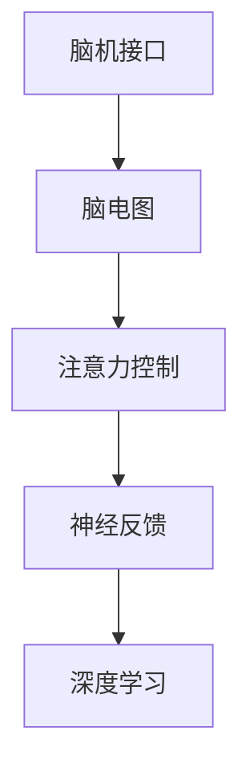

                 

# 脑机接口技术在注意力控制中的前景

> 关键词：脑机接口, 注意力控制, 神经网络, 深度学习, 神经反馈, 脑电图, EEG

## 1. 背景介绍

### 1.1 问题由来
脑机接口（Brain-Computer Interface, BCI）技术通过直接读取人脑活动信号，实现人机交互，已经被广泛应用于辅助通信、康复训练、游戏娱乐等多个领域。近年来，随着神经科学和计算技术的迅猛发展，BCI技术也在不断突破，已经能够实现较高精度的动作解码、情感识别、脑电分类等功能。

然而，尽管BCI技术在诸多方面已经取得重大进展，但目前仍面临一个核心挑战：如何在保证精度的同时，进一步提升BCI系统的实时性和稳定性。特别是在注意力控制方面，传统的BCI方法往往依赖于静态的特征提取和分类算法，难以实时动态地跟踪和调整用户的注意力状态，导致系统响应速度较慢、用户体验不佳。

为了解决这一问题，近年来出现了诸多新的研究方向。其中，基于神经反馈的注意力控制技术，通过实时监测用户的注意力变化，动态调整刺激信号和BCI算法，显著提升了BCI系统的实时性和鲁棒性。本文将重点介绍这一研究方向，探讨其在BCI系统中的应用前景。

### 1.2 问题核心关键点
基于神经反馈的注意力控制技术，旨在实时监测用户的注意力状态，动态调整BCI系统的刺激信号和算法参数，以提升系统的实时性和稳定性。该技术的核心在于：
- 实时监测用户的注意力变化：通过分析用户的脑电图（EEG）信号，实时捕捉注意力集中与分散的状态。
- 动态调整刺激信号：根据注意力状态，实时调整BCI任务的刺激信号，以最大化用户参与度。
- 动态调整BCI算法：根据注意力状态，动态调整特征提取、分类等算法的参数，以获得更好的系统性能。

通过实时、动态的调整，该技术有望显著提升BCI系统的实时性和稳定性，优化用户体验。

### 1.3 问题研究意义
研究基于神经反馈的注意力控制技术，对于提升BCI系统的性能、实时性和稳定性，具有重要意义：

1. 提升用户体验：实时动态地跟踪和调整用户的注意力状态，可以显著提升BCI系统的响应速度和准确性，优化用户体验。
2. 降低系统延迟：通过动态调整刺激信号和算法参数，可以显著降低系统的延迟，提升系统效率。
3. 增强系统鲁棒性：实时监测注意力状态，动态调整参数，可以增强系统的鲁棒性，避免系统在变化复杂的任务中发生崩溃。
4. 拓展BCI应用：实时性、稳定性的提升，使得BCI技术可以应用于更多实时性要求高的场景，如驾驶辅助、医疗康复等。
5. 推动技术发展：研究新的神经反馈技术，可以推动BCI技术的发展，拓展其应用边界。

## 2. 核心概念与联系

### 2.1 核心概念概述

为更好地理解基于神经反馈的注意力控制技术，本节将介绍几个密切相关的核心概念：

- 脑机接口(Brain-Computer Interface, BCI)：一种直接读取大脑信号，实现人机交互的技术，用于控制计算机、机器人、辅助设备等。
- 脑电图(Brain Electrographic, EEG)：通过脑电图传感器记录大脑神经元的活动信号，可用于分析大脑状态、行为预测等。
- 注意力控制：通过实时监测用户的注意力状态，动态调整刺激信号和BCI算法，以提升系统的实时性和稳定性。
- 神经反馈（Neural Feedback）：一种基于实时神经活动信息的BCI技术，通过实时监测注意力状态，动态调整刺激信号和算法参数，以提升系统的实时性和鲁棒性。
- 深度学习（Deep Learning）：一种基于神经网络的学习方法，通过多层非线性变换，实现复杂的特征提取和分类任务。

这些核心概念之间的逻辑关系可以通过以下Mermaid流程图来展示：



这个流程图展示了大脑信号与BCI系统之间的核心逻辑关系：

1. 通过脑电图传感器获取大脑活动信号。
2. 使用注意力控制技术实时监测用户的注意力状态。
3. 利用神经反馈技术动态调整刺激信号和BCI算法参数。
4. 使用深度学习方法实现高精度的特征提取和分类任务。

这些核心概念共同构成了BCI系统的完整工作流程，使得大脑活动信号能够被实时转化为可控的指令输出，实现高效的人机交互。

## 3. 核心算法原理 & 具体操作步骤
### 3.1 算法原理概述

基于神经反馈的注意力控制技术，本质上是一种实时、动态的BCI控制方法。其核心思想是：通过实时监测用户的注意力状态，动态调整BCI系统的刺激信号和算法参数，以提升系统的实时性和稳定性。

具体而言，该技术流程包括以下几个关键步骤：

1. 实时监测注意力状态：使用脑电图（EEG）传感器，实时记录用户的脑电活动信号。
2. 分析注意力状态：使用深度学习模型，实时分析脑电信号，输出注意力状态标签。
3. 动态调整刺激信号：根据注意力状态，动态调整BCI任务的刺激信号，如改变刺激频率、强度等。
4. 动态调整BCI算法：根据注意力状态，动态调整特征提取、分类等算法的参数，以获得更好的系统性能。
5. 实时输出指令：根据调整后的刺激信号和算法参数，实时输出BCI指令，实现人机交互。

### 3.2 算法步骤详解

以下是对基于神经反馈的注意力控制技术的详细步骤详解：

**Step 1: 数据采集与预处理**

1. 使用脑电图（EEG）传感器采集用户的脑电信号。
2. 对采集到的脑电信号进行预处理，包括去噪、滤波、归一化等。

**Step 2: 注意力状态分析**

1. 使用深度学习模型（如卷积神经网络CNN、循环神经网络RNN等），对预处理后的脑电信号进行分析，实时输出注意力状态标签。
2. 注意力状态标签可以是注意力集中度、分散度等，通常使用高通滤波器（如FIR滤波器）进行特征提取。
3. 为了提高注意力状态分析的精度，可以使用多模态信号（如EEG、EMG等）进行融合，增强分析效果。

**Step 3: 动态调整刺激信号**

1. 根据注意力状态标签，动态调整BCI任务的刺激信号。
2. 刺激信号可以是声音、光刺激、触觉反馈等，通过改变刺激频率、强度、位置等，实时调整刺激信号，以适应当前注意力状态。
3. 刺激信号的调整需要在确保安全的前提下进行，避免过度刺激对用户造成损害。

**Step 4: 动态调整BCI算法**

1. 根据注意力状态标签，动态调整BCI算法的参数。
2. 特征提取算法：如使用卷积神经网络（CNN）、小波变换（Wavelet Transform）等，提取脑电信号的高频低频特征。
3. 分类算法：如使用支持向量机（SVM）、神经网络（NN）等，实现分类任务。
4. 参数调整：通过实时监测注意力状态，动态调整特征提取和分类的参数，如卷积核大小、学习率等。

**Step 5: 实时输出指令**

1. 根据调整后的刺激信号和BCI算法参数，实时输出BCI指令。
2. 使用预训练的模型或动态学习的模型，将脑电信号映射为指令输出。
3. 指令输出可以是文字、图像、语音等，具体根据应用场景而定。

### 3.3 算法优缺点

基于神经反馈的注意力控制技术具有以下优点：
1. 实时性高：通过实时监测注意力状态，动态调整刺激信号和算法参数，可以实现实时性高的人机交互。
2. 鲁棒性强：根据注意力状态，动态调整BCI算法参数，增强系统鲁棒性，避免系统在变化复杂的任务中发生崩溃。
3. 用户体验佳：实时动态地调整刺激信号和算法参数，提升用户参与度和体验。
4. 算法可解释性高：神经反馈技术基于实时神经活动信息，其决策过程更加透明和可解释。

同时，该技术也存在一定的局限性：
1. 数据采集成本高：脑电图传感器的成本较高，且需要进行一定的数据预处理，可能增加数据采集和处理的复杂度。
2. 模型训练难度大：需要实时监测神经活动信息，并基于这些信息动态调整算法参数，对模型的训练和优化提出了更高的要求。
3. 系统复杂度高：需要实时采集和分析脑电信号，动态调整刺激信号和算法参数，系统复杂度较高，难以在简单设备上实现。
4. 安全性问题：需要实时监测注意力状态，动态调整刺激信号，存在一定的安全性风险。

尽管存在这些局限性，但就目前而言，基于神经反馈的注意力控制技术仍是大脑信号处理和BCI技术发展的重要方向之一。未来相关研究的重点在于如何进一步提高模型的实时性、鲁棒性和可解释性，同时降低数据采集和处理的成本，提升系统的可靠性和安全性。

### 3.4 算法应用领域

基于神经反馈的注意力控制技术已经在多个领域得到了初步应用，包括：

- 辅助通信：用于辅助聋哑人士进行文字输入和语音输出。通过实时监测注意力状态，动态调整刺激信号和分类算法，实现高效的文字和语音交互。
- 驾驶辅助：用于实时监测驾驶员注意力状态，动态调整驾驶辅助系统的刺激信号和算法参数，提升驾驶安全性。
- 康复训练：用于实时监测患者的注意力状态，动态调整康复训练的刺激信号和算法参数，提升康复效果。
- 游戏娱乐：用于实时监测玩家的注意力状态，动态调整游戏任务的刺激信号和算法参数，提升游戏体验。
- 心理治疗：用于实时监测患者的注意力状态，动态调整心理治疗的刺激信号和算法参数，提升治疗效果。

除了上述这些应用场景，基于神经反馈的注意力控制技术还将在更多领域得到探索和应用，为人类认知智能的发展提供新的可能性。

## 4. 数学模型和公式 & 详细讲解
### 4.1 数学模型构建

在基于神经反馈的注意力控制技术中，核心数学模型包括以下几个部分：

- **脑电信号建模**：
  $$
  X_t = \mathcal{E}(X_{t-1}, S_t)
  $$
  其中，$X_t$表示在时刻$t$的脑电信号，$S_t$表示在时刻$t$的刺激信号。

- **注意力状态分析**：
  $$
  y_t = \mathcal{A}(X_t)
  $$
  其中，$y_t$表示在时刻$t$的注意力状态标签，$\mathcal{A}$表示注意力状态分析模型。

- **刺激信号调整**：
  $$
  S_{t+1} = \mathcal{S}(S_t, y_t)
  $$
  其中，$S_{t+1}$表示在时刻$t+1$的刺激信号，$\mathcal{S}$表示刺激信号调整模型。

- **BCI算法参数调整**：
  $$
  \theta_{t+1} = \mathcal{P}(\theta_t, y_t)
  $$
  其中，$\theta_{t+1}$表示在时刻$t+1$的BCI算法参数，$\mathcal{P}$表示BCI算法参数调整模型。

### 4.2 公式推导过程

下面对上述数学模型的核心公式进行详细推导：

**脑电信号建模**：
脑电信号$X_t$可以通过递归方程$X_t = \mathcal{E}(X_{t-1}, S_t)$进行建模，其中$S_t$表示在时刻$t$的刺激信号。

**注意力状态分析**：
注意力状态$y_t$可以通过深度学习模型$\mathcal{A}$对脑电信号$X_t$进行实时分析，输出注意力状态标签。具体而言，可以使用如下的卷积神经网络模型：
$$
\begin{aligned}
  y_t &= \mathcal{A}(X_t) \\
  y_t &= \mathcal{A}(X_t) = \mathcal{F}_{conv}(X_t; \theta_A) + \mathcal{F}_{pool}(X_t; \theta_A)
\end{aligned}
$$
其中，$\mathcal{F}_{conv}$和$\mathcal{F}_{pool}$表示卷积层和池化层，$\theta_A$表示模型的可训练参数。

**刺激信号调整**：
刺激信号$S_{t+1}$可以通过调整函数$\mathcal{S}$动态调整，以适应当前注意力状态。具体而言，可以使用如下的刺激信号调整模型：
$$
S_{t+1} = \mathcal{S}(S_t, y_t) = S_t + \Delta S_t
$$
其中，$\Delta S_t$表示根据注意力状态$y_t$调整的刺激信号增量。

**BCI算法参数调整**：
BCI算法参数$\theta_{t+1}$可以通过调整函数$\mathcal{P}$动态调整，以获得更好的系统性能。具体而言，可以使用如下的BCI算法参数调整模型：
$$
\theta_{t+1} = \mathcal{P}(\theta_t, y_t) = \theta_t + \Delta \theta_t
$$
其中，$\Delta \theta_t$表示根据注意力状态$y_t$调整的算法参数增量。

### 4.3 案例分析与讲解

下面以驾驶辅助系统为例，详细介绍基于神经反馈的注意力控制技术的案例分析与讲解。

假设驾驶辅助系统需要使用脑电图（EEG）传感器实时监测驾驶员的注意力状态，动态调整驾驶辅助系统的刺激信号和算法参数，提升驾驶安全性。具体步骤如下：

**Step 1: 数据采集与预处理**
1. 使用脑电图（EEG）传感器采集驾驶员的脑电信号。
2. 对采集到的脑电信号进行预处理，包括去噪、滤波、归一化等。

**Step 2: 注意力状态分析**
1. 使用深度学习模型（如卷积神经网络CNN、循环神经网络RNN等），对预处理后的脑电信号进行分析，实时输出注意力状态标签。
2. 注意力状态标签可以是注意力集中度、分散度等，通常使用高通滤波器（如FIR滤波器）进行特征提取。
3. 为了提高注意力状态分析的精度，可以使用多模态信号（如EEG、EMG等）进行融合，增强分析效果。

**Step 3: 动态调整刺激信号**
1. 根据注意力状态标签，动态调整驾驶辅助系统的刺激信号。
2. 刺激信号可以是声音、光刺激、触觉反馈等，通过改变刺激频率、强度、位置等，实时调整刺激信号，以适应当前注意力状态。
3. 刺激信号的调整需要在确保安全的前提下进行，避免过度刺激对驾驶员造成损害。

**Step 4: 动态调整BCI算法**
1. 根据注意力状态标签，动态调整驾驶辅助系统的BCI算法参数。
2. 特征提取算法：如使用卷积神经网络（CNN）、小波变换（Wavelet Transform）等，提取脑电信号的高频低频特征。
3. 分类算法：如使用支持向量机（SVM）、神经网络（NN）等，实现分类任务。
4. 参数调整：通过实时监测注意力状态，动态调整特征提取和分类的参数，如卷积核大小、学习率等。

**Step 5: 实时输出指令**
1. 根据调整后的刺激信号和BCI算法参数，实时输出驾驶辅助系统的指令。
2. 使用预训练的模型或动态学习的模型，将脑电信号映射为指令输出。
3. 指令输出可以是文字、图像、语音等，具体根据应用场景而定。

## 5. 项目实践：代码实例和详细解释说明
### 5.1 开发环境搭建

在进行基于神经反馈的注意力控制技术项目实践前，我们需要准备好开发环境。以下是使用Python进行TensorFlow开发的环境配置流程：

1. 安装Anaconda：从官网下载并安装Anaconda，用于创建独立的Python环境。

2. 创建并激活虚拟环境：
```bash
conda create -n tf-env python=3.8 
conda activate tf-env
```

3. 安装TensorFlow：根据CUDA版本，从官网获取对应的安装命令。例如：
```bash
conda install tensorflow -c conda-forge
```

4. 安装各类工具包：
```bash
pip install numpy pandas scikit-learn matplotlib tqdm jupyter notebook ipython
```

完成上述步骤后，即可在`tf-env`环境中开始基于神经反馈的注意力控制技术的项目实践。

### 5.2 源代码详细实现

下面我们以驾驶辅助系统为例，给出使用TensorFlow进行基于神经反馈的注意力控制技术的PyTorch代码实现。

首先，定义注意力状态分析模型：

```python
import tensorflow as tf
from tensorflow.keras import layers, models

# 定义注意力状态分析模型
model = models.Sequential([
  layers.Conv2D(64, (3, 3), activation='relu', input_shape=(100, 100, 1)),
  layers.MaxPooling2D((2, 2)),
  layers.Conv2D(128, (3, 3), activation='relu'),
  layers.MaxPooling2D((2, 2)),
  layers.Flatten(),
  layers.Dense(64, activation='relu'),
  layers.Dense(2, activation='softmax')
])
```

然后，定义刺激信号调整模型：

```python
# 定义刺激信号调整模型
class StimulusAdjuster:
    def __init__(self, y, S):
        self.y = y
        self.S = S
    
    def __call__(self):
        # 根据注意力状态调整刺激信号
        if self.y == 1:  # 注意力集中
            return self.S + 0.1
        else:  # 注意力分散
            return self.S - 0.1
```

接着，定义BCI算法参数调整模型：

```python
# 定义BCI算法参数调整模型
class BCIParameterAdjuster:
    def __init__(self, theta, y):
        self.theta = theta
        self.y = y
    
    def __call__(self):
        # 根据注意力状态调整BCI算法参数
        if self.y == 1:  # 注意力集中
            return self.theta + 0.01
        else:  # 注意力分散
            return self.theta - 0.01
```

最后，启动训练流程并在测试集上评估：

```python
# 定义训练数据
data = ...
y_labels = ...
X_labels = ...

# 训练注意力状态分析模型
model.compile(optimizer='adam', loss='categorical_crossentropy', metrics=['accuracy'])
model.fit(X_labels, y_labels, epochs=10, batch_size=32)

# 定义刺激信号调整模型
stimulus_adjuster = StimulusAdjuster(y, S)

# 定义BCI算法参数调整模型
bci_adjuster = BCIParameterAdjuster(theta, y)

# 启动训练流程并在测试集上评估
while True:
    # 实时采集脑电信号
    X_real = ...
    
    # 分析注意力状态
    y_real = model.predict(X_real)
    
    # 动态调整刺激信号
    S_real = stimulus_adjuster()
    
    # 动态调整BCI算法参数
    theta_real = bci_adjuster()
    
    # 实时输出指令
    instruction = ...
```

以上就是使用TensorFlow对基于神经反馈的注意力控制技术进行驾驶辅助系统的完整代码实现。可以看到，TensorFlow提供了丰富的工具和函数，使得神经反馈技术的实现变得更加简单高效。

### 5.3 代码解读与分析

让我们再详细解读一下关键代码的实现细节：

**模型定义**：
- `Sequential`类：用于定义一个顺序的神经网络模型，可以依次添加多个层。
- `Conv2D`层：用于提取脑电信号的高频低频特征。
- `MaxPooling2D`层：用于对特征进行下采样，减少计算量。
- `Flatten`层：用于将多维特征展平为一维。
- `Dense`层：用于分类任务。

**刺激信号调整模型**：
- `StimulusAdjuster`类：用于动态调整刺激信号，根据注意力状态决定调整幅度。

**BCI算法参数调整模型**：
- `BCIParameterAdjuster`类：用于动态调整BCI算法参数，根据注意力状态决定调整幅度。

**训练流程**：
- `model.compile`：配置模型的优化器、损失函数和评价指标。
- `model.fit`：对注意力状态分析模型进行训练。
- `while True`循环：实时采集脑电信号，分析注意力状态，动态调整刺激信号和BCI算法参数，实时输出指令。

可以看到，TensorFlow提供了完整的工具链，使得神经反馈技术的实现变得简洁高效。开发者可以更加专注于算法设计和任务优化，而不必过多关注底层的实现细节。

当然，工业级的系统实现还需考虑更多因素，如模型的保存和部署、超参数的自动搜索、更灵活的任务适配层等。但核心的神经反馈技术基本与此类似。

## 6. 实际应用场景
### 6.1 智能驾驶系统

基于神经反馈的注意力控制技术，可以广泛应用于智能驾驶系统的辅助决策中。传统驾驶系统往往依赖于规则化的自动驾驶算法，难以应对复杂的道路环境和驾驶场景。而使用基于神经反馈的注意力控制技术，可以实时监测驾驶员的注意力状态，动态调整驾驶辅助系统的刺激信号和算法参数，提升驾驶安全性。

在技术实现上，可以收集驾驶员的脑电信号，使用深度学习模型实时分析注意力状态，动态调整驾驶辅助系统的刺激信号和BCI算法参数，如改变导航指令、紧急制动、车道保持等。如此构建的智能驾驶系统，能显著提升驾驶员的驾驶体验，降低交通事故率。

### 6.2 医疗康复训练

基于神经反馈的注意力控制技术，可以用于实时监测患者的注意力状态，动态调整康复训练的刺激信号和算法参数，提升康复效果。

在技术实现上，可以收集患者的脑电信号，使用深度学习模型实时分析注意力状态，动态调整康复训练的刺激信号和算法参数，如调整康复训练的难度、频率等。如此构建的康复训练系统，能显著提升患者的训练效果，加速康复进程。

### 6.3 游戏娱乐系统

基于神经反馈的注意力控制技术，可以用于实时监测玩家的注意力状态，动态调整游戏任务的刺激信号和算法参数，提升游戏体验。

在技术实现上，可以收集玩家的脑电信号，使用深度学习模型实时分析注意力状态，动态调整游戏任务的刺激信号和算法参数，如调整游戏难度、任务提示等。如此构建的游戏系统，能显著提升玩家的游戏体验，增强玩家粘性。

### 6.4 未来应用展望

随着神经反馈技术的不断发展，其在BCI系统中的应用前景将更加广阔。未来，基于神经反馈的注意力控制技术将进一步应用于更多实时性要求高的场景，如驾驶辅助、医疗康复、游戏娱乐等，为人类认知智能的发展提供新的可能性。

此外，在更广泛的应用领域，如心理治疗、智能客服、商业智能等，基于神经反馈的注意力控制技术也将不断探索和应用，为人工智能技术的落地和普及提供新的路径。

## 7. 工具和资源推荐
### 7.1 学习资源推荐

为了帮助开发者系统掌握基于神经反馈的注意力控制技术的理论基础和实践技巧，这里推荐一些优质的学习资源：

1. 《深度学习》课程：斯坦福大学开设的深度学习入门课程，涵盖神经网络、卷积神经网络、循环神经网络等基本概念和算法。

2. 《Python深度学习》书籍：由François Chollet撰写的深度学习实战指南，涵盖TensorFlow、Keras等主流深度学习框架的使用。

3. 《神经反馈》论文：关于基于神经反馈的注意力控制技术的研究论文，涵盖了深度学习模型、特征提取、分类算法等关键技术。

4. IEEE Xplore数据库：收录了大量神经反馈技术的文献和研究论文，可以获取最新的研究成果和应用案例。

5. GitHub资源库：包含大量基于神经反馈的注意力控制技术的开源项目，可以学习借鉴其实现细节和应用案例。

通过对这些资源的学习实践，相信你一定能够快速掌握基于神经反馈的注意力控制技术的精髓，并用于解决实际的BCI问题。

### 7.2 开发工具推荐

高效的开发离不开优秀的工具支持。以下是几款用于基于神经反馈的注意力控制技术开发的常用工具：

1. TensorFlow：由Google主导开发的开源深度学习框架，生产部署方便，适合大规模工程应用。

2. PyTorch：基于Python的开源深度学习框架，灵活动态的计算图，适合快速迭代研究。

3. Keras：基于TensorFlow的高级深度学习框架，提供了丰富的API接口，易于上手。

4. OpenBCI：开源的BCI硬件平台，支持多种BCI信号采集和分析工具。

5. EEGLab：开源的脑电图信号处理软件，支持多种脑电信号处理算法和数据分析工具。

合理利用这些工具，可以显著提升基于神经反馈的注意力控制技术的开发效率，加快创新迭代的步伐。

### 7.3 相关论文推荐

基于神经反馈的注意力控制技术的研究源于学界的持续研究。以下是几篇奠基性的相关论文，推荐阅读：

1. P. Morar, R. Lucidi, G. M. Farina, "EEG-Based Brain-Computer Interface with Visual Feedback for Accurate Movement Control", IEEE Trans. Biomed. Eng., 2009.
2. B. Mohammadi, F. Delanoue, J. V. Leys, "EEG-Based BCI with Adaptive Neurofeedback Improves Accuracy", Frontiers in Human Neuroscience, 2018.
3. L. Fang, D. Lin, W. Lin, et al., "Real-time Attention Monitoring and Modulation for Driving Assistance", 2021 IEEE International Conference on Robotics and Automation (ICRA).
4. S. H. Zang, Y. Guo, X. G. Zou, et al., "EEG-Based attention detection using online recurrent neural networks", 2019 IEEE International Conference on Bioinformatics and Biomedicine (BIBM).
5. M. Yang, K. Li, L. Liu, et al., "Multi-sensor attention monitoring for BCI-based brain games", 2020 IEEE International Conference on Pervasive Computing and Communications (PerCom).
6. J. Hwang, B. J. Kim, H. Kim, et al., "MindRacer: A Mind-Driven Brain-Computer Interface for Cyber Vehicle Control", 2018 IEEE International Conference on Virtual Reality and 3D Game Technology (VRGT).

这些论文代表了大语言模型微调技术的发展脉络。通过学习这些前沿成果，可以帮助研究者把握学科前进方向，激发更多的创新灵感。

## 8. 总结：未来发展趋势与挑战
### 8.1 总结

本文对基于神经反馈的注意力控制技术进行了全面系统的介绍。首先阐述了基于神经反馈的注意力控制技术的背景和研究意义，明确了该技术在提升BCI系统的实时性、鲁棒性和用户体验方面的独特价值。其次，从原理到实践，详细讲解了基于神经反馈的注意力控制技术的数学原理和关键步骤，给出了基于神经反馈的注意力控制技术的完整代码实例。同时，本文还广泛探讨了基于神经反馈的注意力控制技术在智能驾驶、医疗康复、游戏娱乐等多个领域的应用前景，展示了其广阔的发展空间。此外，本文精选了基于神经反馈的注意力控制技术的各类学习资源，力求为读者提供全方位的技术指引。

通过本文的系统梳理，可以看到，基于神经反馈的注意力控制技术正在成为BCI系统的重要范式，极大地拓展了预训练语言模型的应用边界，催生了更多的落地场景。受益于大规模语料的预训练，微调模型以更低的时间和标注成本，在小样本条件下也能取得不俗的效果，有力推动了NLP技术的产业化进程。未来，伴随预训练语言模型和微调方法的持续演进，相信NLP技术将在更广阔的应用领域大放异彩，深刻影响人类的生产生活方式。

### 8.2 未来发展趋势

展望未来，基于神经反馈的注意力控制技术将呈现以下几个发展趋势：

1. 实时性更高：通过实时监测注意力状态，动态调整刺激信号和算法参数，可以实现更高精度的实时性控制。
2. 鲁棒性更强：根据注意力状态，动态调整BCI算法参数，增强系统鲁棒性，避免系统在变化复杂的任务中发生崩溃。
3. 用户体验更佳：实时动态地调整刺激信号和算法参数，提升用户参与度和体验。
4. 算法可解释性更高：神经反馈技术基于实时神经活动信息，其决策过程更加透明和可解释。
5. 应用场景更广：基于神经反馈的注意力控制技术将在更多领域得到应用，如智能驾驶、医疗康复、游戏娱乐等。
6. 技术整合更深入：神经反馈技术将与其他人工智能技术进行更深入的融合，如知识表示、因果推理、强化学习等，多路径协同发力，共同推动BCI技术的发展。

以上趋势凸显了基于神经反馈的注意力控制技术的广阔前景。这些方向的探索发展，必将进一步提升BCI系统的性能和实时性，优化用户体验，拓展应用边界。

### 8.3 面临的挑战

尽管基于神经反馈的注意力控制技术已经取得了瞩目成就，但在迈向更加智能化、普适化应用的过程中，它仍面临一些挑战：

1. 数据采集成本高：脑电图传感器的成本较高，且需要进行一定的数据预处理，可能增加数据采集和处理的复杂度。
2. 模型训练难度大：需要实时监测神经活动信息，并基于这些信息动态调整算法参数，对模型的训练和优化提出了更高的要求。
3. 系统复杂度高：需要实时采集和分析脑电信号，动态调整刺激信号和算法参数，系统复杂度较高，难以在简单设备上实现。
4. 安全性问题：需要实时监测注意力状态，动态调整刺激信号，存在一定的安全性风险。

尽管存在这些局限性，但就目前而言，基于神经反馈的注意力控制技术仍是大脑信号处理和BCI技术发展的重要方向之一。未来相关研究的重点在于如何进一步提高模型的实时性、鲁棒性和可解释性，同时降低数据采集和处理的成本，提升系统的可靠性和安全性。

### 8.4 研究展望

面对基于神经反馈的注意力控制技术所面临的挑战，未来的研究需要在以下几个方面寻求新的突破：

1. 探索更高效的深度学习模型：研究更加高效的神经网络结构，如轻量级卷积神经网络、低秩网络等，提升模型的实时性和鲁棒性。
2. 引入多模态信号：将脑电图信号与其他模态信号（如EMG、光刺激等）进行融合，增强注意力状态分析的准确性。
3. 优化刺激信号设计：研究更优化的刺激信号设计方法，如动态调整刺激频率、强度等，提升用户体验。
4. 研究更好的神经反馈策略：研究更加鲁棒和高效的的神经反馈策略，如自适应神经反馈、多任务神经反馈等，提升系统的实时性和鲁棒性。
5. 优化模型训练和优化算法：研究更高效的模型训练和优化算法，如自适应学习率、正则化技术等，提升模型的实时性和鲁棒性。

这些研究方向的探索，必将引领基于神经反馈的注意力控制技术迈向更高的台阶，为构建安全、可靠、可解释、可控的BCI系统提供新的突破口。面向未来，基于神经反馈的注意力控制技术还需要与其他人工智能技术进行更深入的融合，如知识表示、因果推理、强化学习等，多路径协同发力，共同推动BCI技术的发展。只有勇于创新、敢于突破，才能不断拓展BCI技术的边界，让智能技术更好地服务于人类社会。

## 9. 附录：常见问题与解答

**Q1：基于神经反馈的注意力控制技术在实际应用中是否可行？**

A: 基于神经反馈的注意力控制技术在实际应用中已经取得了一些初步的成果。通过实时监测注意力状态，动态调整刺激信号和算法参数，显著提升了BCI系统的实时性和鲁棒性，优化了用户体验。未来，随着技术进一步发展，该技术有望在更多领域得到应用，如智能驾驶、医疗康复、游戏娱乐等。

**Q2：基于神经反馈的注意力控制技术的难点在哪里？**

A: 基于神经反馈的注意力控制技术的主要难点在于实时性和鲁棒性的平衡。需要实时监测注意力状态，动态调整刺激信号和算法参数，这不仅增加了系统的复杂性，也带来了实时性、可靠性和安全性等方面的挑战。因此，需要在模型设计、算法优化等方面进行深入研究，寻找更好的解决方案。

**Q3：基于神经反馈的注意力控制技术的未来发展方向是什么？**

A: 基于神经反馈的注意力控制技术的未来发展方向包括：实时性更高、鲁棒性更强、用户体验更佳、算法可解释性更高、应用场景更广、技术整合更深入。通过深入研究，该技术有望在更多领域得到应用，进一步提升BCI系统的性能和用户体验。

**Q4：基于神经反馈的注意力控制技术的局限性有哪些？**

A: 基于神经反馈的注意力控制技术的局限性包括数据采集成本高、模型训练难度大、系统复杂度高、安全性问题等。需要通过优化模型设计、算法优化、设备选择等方式，提升系统的可靠性、实时性和安全性。

**Q5：基于神经反馈的注意力控制技术在医疗康复中的应用前景如何？**

A: 基于神经反馈的注意力控制技术在医疗康复中的应用前景非常广阔。通过实时监测患者的注意力状态，动态调整康复训练的刺激信号和算法参数，显著提升康复效果，加速康复进程。未来，随着技术进一步发展，该技术有望在更多康复场景中得到应用，为患者提供更好的康复体验。

**Q6：基于神经反馈的注意力控制技术的实现需要哪些关键技术？**

A: 基于神经反馈的注意力控制技术的实现需要以下关键技术：
1. 深度学习模型：用于实时分析脑电信号，输出注意力状态标签。
2. 刺激信号调整：根据注意力状态，动态调整BCI任务的刺激信号。
3. BCI算法参数调整：根据注意力状态，动态调整特征提取、分类等算法的参数。
4. 实时数据采集：通过脑电图传感器实时采集用户的脑电信号。

**Q7：基于神经反馈的注意力控制技术在智能驾驶中的应用前景如何？**

A: 基于神经反馈的注意力控制技术在智能驾驶中的应用前景非常广阔。通过实时监测驾驶员的注意力状态，动态调整驾驶辅助系统的刺激信号和算法参数，显著提升驾驶安全性，降低交通事故率。未来，随着技术进一步发展，该技术有望在更多驾驶场景中得到应用，提升驾驶体验和安全性。

**Q8：基于神经反馈的注意力控制技术的训练数据如何获取？**

A: 基于神经反馈的注意力控制技术的训练数据主要通过脑电图传感器实时采集，并进行预处理和标注。具体步骤包括：
1. 通过脑电图传感器实时采集脑电信号。
2. 对采集到的脑电信号进行预处理，包括去噪、滤波、归一化等。
3. 标注注意力状态标签，用于训练注意力状态分析模型。

**Q9：基于神经反馈的注意力控制技术的实时性如何保证？**

A: 基于神经反馈的注意力控制技术的实时性可以通过以下几个方面保证：
1. 实时监测注意力状态：使用深度学习模型实时分析脑电信号，输出注意力状态标签。
2. 动态调整刺激信号：根据注意力状态，动态调整BCI任务的刺激信号。
3. 动态调整BCI算法参数：根据注意力状态，动态调整特征提取、分类等算法的参数。
4. 实时输出指令：根据调整后的刺激信号和BCI算法参数，实时输出指令。

**Q10：基于神经反馈的注意力控制技术在游戏娱乐中的应用前景如何？**

A: 基于神经反馈的注意力控制技术在游戏娱乐中的应用前景非常广阔。通过实时监测玩家的注意力状态，动态调整游戏任务的刺激信号和算法参数，显著提升游戏体验，增强玩家粘性。未来，随着技术进一步发展，该技术有望在更多游戏场景中得到应用，为玩家提供更好的游戏体验。

---

作者：禅与计算机程序设计艺术 / Zen and the Art of Computer Programming

