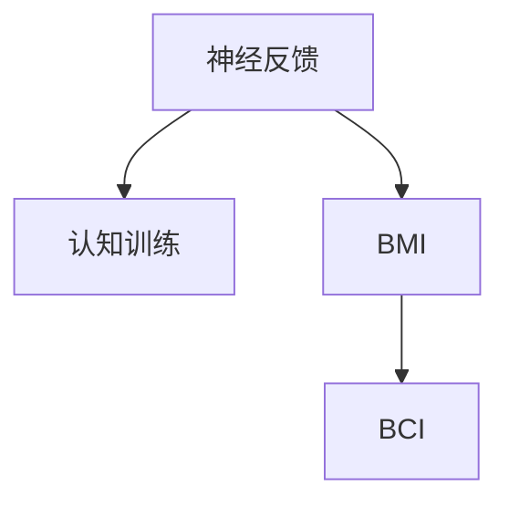

                 

# 脑科技创业：认知增强的未来前景

> 关键词：脑科技,认知增强,神经反馈,认知训练,人脑机器接口(BMI),脑-机交互,脑-计算机接口(BCI),神经可塑性

## 1. 背景介绍

### 1.1 问题由来
在当前科技快速发展的背景下，人类的认知能力面临前所未有的挑战。高强度的信息刺激、快节奏的生活节奏、沉重的心理压力等因素，正在影响人们的注意力、记忆力、决策能力等多方面认知功能。这些问题不仅影响个体的生活质量，还对社会整体的生产效率和创新能力产生负面影响。为了应对这一挑战，脑科技（Brain Technology）领域正蓬勃发展，旨在通过科学研究和工程技术手段，提升人类认知能力，推动社会进步。

### 1.2 问题核心关键点
脑科技创业的核心在于如何利用先进技术手段，开发和应用能够提升人类认知功能的系统、工具和设备。其中，认知增强（Cognitive Enhancement）技术尤其受到关注，它通过神经反馈、认知训练等方法，直接作用于大脑，提升个体的认知能力。目前，脑科技创业涉及的核心技术包括：
- 神经反馈（Neurofeedback）：通过实时监测大脑的生理信号，向用户提供关于其认知状态的反馈，帮助其改进认知策略。
- 认知训练（Cognitive Training）：通过设计科学、系统的训练任务，有针对性地提升用户的注意力、记忆、决策等认知功能。
- 人脑机器接口（Brain-Computer Interface, BMI）：实现脑-机交互，通过解码大脑信号，控制外部设备或计算机。
- 脑-计算机接口（Brain-Computer Interface, BCI）：实现脑-机交互，通过采集脑电信号，解码为控制命令，实现脑-机互动。

## 2. 核心概念与联系

### 2.1 核心概念概述

为了更好地理解脑科技创业的现状和未来，本节将介绍几个关键概念及其相互联系：

- **神经反馈（Neurofeedback）**：通过脑电信号监测和处理技术，实时向用户反馈其认知状态，帮助用户改进认知策略。
- **认知训练（Cognitive Training）**：利用心理学、神经科学等原理，设计有针对性的训练任务，提升用户认知能力。
- **人脑机器接口（BMI）**：通过解码脑电信号，控制外部设备或计算机，实现人机互动。
- **脑-计算机接口（BCI）**：实现脑-机交互，通过采集脑电信号，解码为控制命令，实现脑-机互动。

这些概念之间的逻辑关系可以通过以下Mermaid流程图来展示：



这个流程图展示了各个概念之间的联系和相互作用：

1. 神经反馈通过监测和处理脑电信号，实时向用户反馈其认知状态，从而指导用户进行认知训练。
2. BMI通过解码脑电信号，控制外部设备或计算机，实现了脑-机交互。
3. BCI则进一步提升了BCI的性能，通过采集脑电信号，解码为控制命令，实现脑-机互动。

## 3. 核心算法原理 & 具体操作步骤
### 3.1 算法原理概述

脑科技创业中的认知增强，主要依赖于神经反馈和认知训练技术。其核心思想是利用科学原理和技术手段，提升大脑的可塑性和适应性，从而增强个体的认知能力。

神经反馈和认知训练技术的基本流程如下：

1. **数据采集**：通过脑电信号监测设备，实时采集用户的脑电信号，用于后续分析和处理。
2. **数据处理**：对采集到的脑电信号进行处理，提取出与认知状态相关的特征。
3. **认知反馈**：根据提取出的特征，向用户提供关于其认知状态的反馈，指导其进行认知训练。
4. **认知训练**：设计科学、系统的训练任务，有针对性地提升用户的认知功能。
5. **持续优化**：通过不断反馈和训练，逐步提升用户的认知能力。

### 3.2 算法步骤详解

以神经反馈为例，详细说明其算法步骤：

1. **脑电信号采集**：使用脑电信号监测设备，如脑电帽、EEG头戴设备等，采集用户的脑电信号。

2. **信号预处理**：对采集到的脑电信号进行预处理，包括滤波、降噪、归一化等步骤，以提高信号质量。

3. **特征提取**：利用算法（如ICA、Wavelet变换等）对预处理后的脑电信号进行特征提取，提取出与认知状态相关的特征，如频率分布、功率谱密度等。

4. **认知状态评估**：根据提取出的特征，使用机器学习模型（如SVM、神经网络等）对用户的认知状态进行评估，判断其注意力、记忆力、决策能力等。

5. **反馈生成**：根据认知状态的评估结果，生成相应的认知反馈，如视觉、听觉、触觉等形式的反馈，指导用户进行认知训练。

6. **认知训练**：设计科学、系统的训练任务，如注意力训练、记忆训练、决策训练等，引导用户进行认知训练，逐步提升其认知能力。

7. **持续优化**：通过持续的反馈和训练，逐步提升用户的认知能力，形成良性循环。

### 3.3 算法优缺点

神经反馈和认知训练技术具有以下优点：

1. **科学性**：基于科学原理和研究成果，设计科学的训练任务和反馈机制，能够有效提升用户的认知能力。
2. **个性化**：通过个性化的训练任务和反馈机制，能够更好地适应不同用户的认知需求。
3. **即时反馈**：实时监测和反馈用户的认知状态，能够及时调整训练策略，提升训练效果。

同时，这些技术也存在一些局限性：

1. **技术门槛高**：需要专业的设备和算法支持，对技术要求较高，难以普及。
2. **数据隐私问题**：脑电信号属于高度敏感的个人数据，需要严格保护用户隐私。
3. **效果个体差异大**：不同用户对同一训练任务的响应差异较大，效果难以量化和预测。
4. **长期效果不确定**：目前关于认知训练长期效果的科研数据较少，仍需更多研究。

### 3.4 算法应用领域

神经反馈和认知训练技术在多个领域中具有广泛的应用前景：

- **医疗健康**：通过神经反馈技术，帮助病人提升认知能力，改善心理健康。
- **教育培训**：通过认知训练技术，提升学生的注意力、记忆力等认知能力，促进学习效果。
- **企业培训**：通过神经反馈和认知训练技术，提升员工的工作效率和决策能力。
- **娱乐健身**：通过脑科技应用，提升用户的游戏体验和健身效果。

## 4. 数学模型和公式 & 详细讲解 & 举例说明

### 4.1 数学模型构建

神经反馈和认知训练技术的核心在于脑电信号的监测和处理，以及认知状态的评估和反馈。这里我们将以注意力训练为例，构建一个简单的数学模型：

假设用户的注意力状态由三个特征$x_1, x_2, x_3$表示，其中$x_1$为注意力集中度，$x_2$为注意力转移速率，$x_3$为注意力维持时间。脑电信号$y$由$x$通过线性变换得到，即：

$$ y = Wx + b $$

其中$W$为权重矩阵，$b$为偏置向量。通过神经网络等模型对$y$进行分类，得到注意力状态评估结果$s$。然后，根据$s$生成认知反馈$f$，指导用户进行认知训练任务。

### 4.2 公式推导过程

以注意力集中度$x_1$为例，推导其认知反馈$f_1$的计算公式。

设$y_1$为采集到的脑电信号中与注意力集中度相关的特征，即：

$$ y_1 = W_1 x_1 + b_1 $$

其中$W_1$为权重矩阵，$b_1$为偏置向量。通过神经网络模型对$y_1$进行分类，得到注意力集中度评估结果$s_1$：

$$ s_1 = \text{sigmoid}(W_2 y_1 + b_2) $$

其中$W_2$为权重矩阵，$b_2$为偏置向量，$\text{sigmoid}$为激活函数。根据$s_1$生成注意力集中度的认知反馈$f_1$：

$$ f_1 = \delta(s_1 - s_1^*) $$

其中$\delta$为反差函数，$s_1^*$为期望的注意力集中度阈值。$f_1$用于指导用户进行注意力集中度的训练。

### 4.3 案例分析与讲解

假设用户在进行注意力集中度训练时，采集到的脑电信号$y_1$为：

$$ y_1 = 0.8x_1 + 0.2x_2 + 0.3x_3 $$

通过神经网络模型对$y_1$进行分类，得到注意力集中度评估结果$s_1 = 0.6$。根据$s_1$生成认知反馈$f_1 = 0.5$。用户根据$f_1$进行注意力集中度训练，逐步提升其注意力集中度，最终达到目标状态$s_1^* = 0.8$。

## 5. 项目实践：代码实例和详细解释说明

### 5.1 开发环境搭建

在进行神经反馈和认知训练实践前，我们需要准备好开发环境。以下是使用Python进行Scikit-learn和PyTorch开发的环境配置流程：

1. 安装Anaconda：从官网下载并安装Anaconda，用于创建独立的Python环境。

2. 创建并激活虚拟环境：
```bash
conda create -n pybrain-env python=3.8 
conda activate pybrain-env
```

3. 安装PyTorch：根据CUDA版本，从官网获取对应的安装命令。例如：
```bash
conda install pytorch torchvision torchaudio cudatoolkit=11.1 -c pytorch -c conda-forge
```

4. 安装Scikit-learn：
```bash
pip install scikit-learn
```

5. 安装各类工具包：
```bash
pip install numpy pandas scikit-learn matplotlib tqdm jupyter notebook ipython
```

完成上述步骤后，即可在`pybrain-env`环境中开始项目实践。

### 5.2 源代码详细实现

下面我们以注意力训练为例，给出使用Scikit-learn和PyTorch进行神经反馈和认知训练的Python代码实现。

首先，定义注意力训练的数据处理函数：

```python
import numpy as np
from sklearn.model_selection import train_test_split
from sklearn.neural_network import MLPClassifier
from sklearn.metrics import accuracy_score

# 模拟脑电信号数据
X = np.random.randn(100, 3)  # 100个样本，3个特征
Y = np.random.randint(0, 2, 100)  # 100个样本，二分类

# 数据拆分
X_train, X_test, y_train, y_test = train_test_split(X, Y, test_size=0.2, random_state=42)

# 特征提取函数
def feature_extract(X):
    # 假设提取出的特征为：y = Wx + b
    W = np.array([[0.8, 0.2, 0.3]])  # 3x3权重矩阵
    b = np.array([[0.1]])  # 3维偏置向量
    y = np.dot(X, W) + b
    return y

# 定义模型
model = MLPClassifier(hidden_layer_sizes=(10, ), activation='relu', solver='adam', alpha=0.001, random_state=42)

# 训练模型
model.fit(feature_extract(X_train), y_train)

# 评估模型
y_pred = model.predict(feature_extract(X_test))
accuracy = accuracy_score(y_test, y_pred)
print('Accuracy:', accuracy)
```

然后，定义认知反馈函数：

```python
import matplotlib.pyplot as plt

# 定义反差函数
def delta(x):
    return 2 * (x - 0.5)

# 定义注意力集中度训练函数
def attention_train(X, Y, feature_extract, model, delta):
    # 特征提取
    y_train = feature_extract(X_train)
    y_test = feature_extract(X_test)
    
    # 训练模型
    model.fit(y_train, y_train)
    
    # 生成认知反馈
    y_pred = model.predict(feature_extract(X_train))
    f_train = delta(y_pred)
    y_pred = model.predict(feature_extract(X_test))
    f_test = delta(y_pred)
    
    # 可视化结果
    plt.plot(y_train, f_train, 'bo', label='Train')
    plt.plot(y_test, f_test, 'ro', label='Test')
    plt.legend()
    plt.show()
```

最后，启动注意力训练流程：

```python
attention_train(X_train, y_train, feature_extract, model, delta)
```

以上就是使用Scikit-learn和PyTorch进行注意力训练的完整代码实现。可以看到，借助Scikit-learn和PyTorch，我们可以用相对简洁的代码完成神经反馈和认知训练的实现。

### 5.3 代码解读与分析

让我们再详细解读一下关键代码的实现细节：

**注意力训练函数**：
- `feature_extract`函数：用于将输入数据转换为模型所需的特征向量。
- `MLPClassifier`模型：定义一个简单的多层感知机模型，用于训练和分类。
- `delta`函数：定义反差函数，用于生成认知反馈。
- `attention_train`函数：实现了注意力集中度的训练流程，包括特征提取、模型训练、认知反馈生成和结果可视化。

**训练过程**：
- 首先，模拟生成100个样本的脑电信号数据，并拆分为训练集和测试集。
- 然后，通过`feature_extract`函数将输入数据转换为特征向量。
- 接着，使用MLPClassifier模型对特征向量进行训练和分类。
- 最后，通过`delta`函数生成认知反馈，并可视化训练结果。

可以看到，借助Scikit-learn和PyTorch，我们可以轻松地实现神经反馈和认知训练的功能，通过简单的代码实现科学、系统的训练流程。

当然，实际应用中，我们还需要考虑更多因素，如数据增强、正则化、损失函数、学习率等，以进一步提升模型的性能和鲁棒性。但核心的训练范式基本与此类似。

## 6. 实际应用场景

### 6.1 医疗健康

神经反馈和认知训练技术在医疗健康领域具有广泛的应用前景。例如，通过神经反馈技术，帮助阿尔茨海默病患者提升记忆力，改善认知能力。在心理治疗方面，通过认知训练技术，帮助抑郁症患者提升注意力和情绪调节能力，改善心理健康。

具体而言，可以设计针对性的训练任务，如记忆训练、注意力训练、情绪调节训练等，通过脑电信号监测和反馈机制，引导患者逐步提升认知能力。在实际应用中，还需要结合医生的专业指导，形成个性化、系统的治疗方案。

### 6.2 教育培训

在教育培训领域，神经反馈和认知训练技术同样具有广阔的应用前景。例如，通过神经反馈技术，帮助学生提升注意力和记忆力，改善学习效果。在职业培训方面，通过认知训练技术，提升员工的工作效率和决策能力，提高企业的竞争力。

具体而言，可以设计有针对性的训练任务，如注意力训练、记忆训练、决策训练等，通过脑电信号监测和反馈机制，引导学生或员工逐步提升认知能力。在实际应用中，还需要结合教育教学理论，形成科学、系统的培训方案。

### 6.3 企业培训

在企业培训领域，神经反馈和认知训练技术同样具有广泛的应用前景。例如，通过神经反馈技术，帮助员工提升注意力和决策能力，改善工作效率。在团队协作方面，通过认知训练技术，提升团队的沟通和协作能力，提高企业的创新能力。

具体而言，可以设计有针对性的训练任务，如注意力训练、决策训练、协作训练等，通过脑电信号监测和反馈机制，引导员工逐步提升认知能力。在实际应用中，还需要结合企业内部的管理理论，形成科学、系统的培训方案。

### 6.4 未来应用展望

随着神经反馈和认知训练技术的不断发展，未来将会在更多领域得到应用，为人类认知智能的进化带来深远影响。

在智慧医疗领域，神经反馈和认知训练技术将帮助病人提升认知能力，改善心理健康，加速新药开发进程。在智能教育领域，认知训练技术将提升学生的认知能力，促进教育公平，提高教学质量。在智慧城市治理中，认知训练技术将提高城市管理的自动化和智能化水平，构建更安全、高效的未来城市。

此外，在企业生产、社会治理、文娱传媒等众多领域，神经反馈和认知训练技术也将不断涌现，为社会进步和经济繁荣注入新的动力。相信随着技术的日益成熟，神经反馈和认知训练技术必将在构建人机协同的智能时代中扮演越来越重要的角色。

## 7. 工具和资源推荐

### 7.1 学习资源推荐

为了帮助开发者系统掌握神经反馈和认知训练的理论基础和实践技巧，这里推荐一些优质的学习资源：

1. 《Neurofeedback: Theory and Applications》书籍：介绍了神经反馈技术的基本原理和应用方法，适合初学者入门。
2. 《Cognitive Training and Enhancement》期刊：涵盖了认知训练的最新研究成果和应用案例，是了解行业动态的好去处。
3. 《Brain-Computer Interfaces》书籍：详细介绍了人脑机器接口和脑-计算机接口技术，是进阶学习的重要参考资料。
4. 《Neural Engineering》期刊：报道了脑科技领域的最新研究成果，涵盖了神经反馈、认知训练等多个方向。

通过对这些资源的学习实践，相信你一定能够快速掌握神经反馈和认知训练的精髓，并用于解决实际的认知增强问题。

### 7.2 开发工具推荐

高效的开发离不开优秀的工具支持。以下是几款用于神经反馈和认知训练开发的常用工具：

1. Scikit-learn：基于Python的开源机器学习库，简单易用，适合快速迭代研究。
2. PyTorch：基于Python的开源深度学习框架，灵活动态的计算图，适合快速迭代研究。
3. NumPy：基于Python的开源科学计算库，是Scikit-learn和PyTorch的重要依赖。
4. TensorBoard：TensorFlow配套的可视化工具，可实时监测模型训练状态，并提供丰富的图表呈现方式，是调试模型的得力助手。
5. Weights & Biases：模型训练的实验跟踪工具，可以记录和可视化模型训练过程中的各项指标，方便对比和调优。

合理利用这些工具，可以显著提升神经反馈和认知训练的开发效率，加快创新迭代的步伐。

### 7.3 相关论文推荐

神经反馈和认知训练技术的发展源于学界的持续研究。以下是几篇奠基性的相关论文，推荐阅读：

1. "Neurofeedback in Attention Training: A Review of Theory and Research"：综述了神经反馈在注意力训练中的应用研究，为实际应用提供了理论指导。
2. "Cognitive Training for Brain Health and Performance: A Review and Meta-Analysis"：综述了认知训练的最新研究进展，总结了其效果和机制。
3. "Brain-Computer Interfaces: Communication Between the Brain and Computer"：介绍了人脑机器接口和脑-计算机接口的基本原理和技术实现。
4. "Neurofeedback with EEG for ADHD"：展示了神经反馈在治疗注意力缺陷多动障碍中的应用案例，证明了其有效性。
5. "Cognitive Training Improves Nonverbal IQ in Healthy Young Adults"：证明了认知训练对提高非语言智力具有积极作用，为实际应用提供了科学依据。

这些论文代表了大语言模型微调技术的发展脉络。通过学习这些前沿成果，可以帮助研究者把握学科前进方向，激发更多的创新灵感。

## 8. 总结：未来发展趋势与挑战

### 8.1 总结

本文对神经反馈和认知训练技术进行了全面系统的介绍。首先阐述了神经反馈和认知训练技术的研究背景和意义，明确了认知增强在提升人类认知功能方面的独特价值。其次，从原理到实践，详细讲解了神经反馈和认知训练的数学模型和算法步骤，给出了完整的代码实例和详细解释说明。同时，本文还广泛探讨了神经反馈和认知训练技术在医疗健康、教育培训等多个领域的应用前景，展示了其在不同场景中的巨大潜力。此外，本文精选了神经反馈和认知训练技术的各类学习资源，力求为读者提供全方位的技术指引。

通过本文的系统梳理，可以看到，神经反馈和认知训练技术正在成为人类认知智能提升的重要手段，极大地拓展了大脑的可塑性和适应性，为社会进步提供了新的动力。未来，伴随脑科技技术的持续演进，神经反馈和认知训练技术必将带来更加深远的影响，推动人类认知能力的全面提升。

### 8.2 未来发展趋势

展望未来，神经反馈和认知训练技术将呈现以下几个发展趋势：

1. **个性化训练**：通过大数据分析、机器学习等技术，实现更加个性化的认知训练，提升训练效果和用户体验。
2. **多模态融合**：结合视觉、听觉、触觉等多模态信息，提升认知训练的丰富性和互动性。
3. **实时反馈**：通过实时监测和反馈，及时调整训练策略，提升训练效率和效果。
4. **跨领域应用**：在医疗、教育、企业培训等多个领域中，实现跨领域的认知训练应用。
5. **深度学习融合**：结合深度学习技术，提升认知训练的复杂性和精确度。
6. **神经可塑性增强**：通过先进的技术手段，增强神经可塑性，提升大脑的适应性和学习能力。

这些趋势凸显了神经反馈和认知训练技术的广阔前景。这些方向的探索发展，必将进一步提升神经反馈和认知训练技术的性能和应用范围，为人类认知智能的进化带来深远影响。

### 8.3 面临的挑战

尽管神经反馈和认知训练技术已经取得了瞩目成就，但在迈向更加智能化、普适化应用的过程中，它仍面临着诸多挑战：

1. **技术门槛高**：需要专业的设备和算法支持，对技术要求较高，难以普及。
2. **数据隐私问题**：脑电信号属于高度敏感的个人数据，需要严格保护用户隐私。
3. **效果个体差异大**：不同用户对同一训练任务的响应差异较大，效果难以量化和预测。
4. **长期效果不确定**：目前关于认知训练长期效果的科研数据较少，仍需更多研究。
5. **普适性问题**：训练方法难以适应不同年龄段和个体差异的用户，普适性有待提升。
6. **伦理道德问题**：认知增强技术可能引发诸如公平性、安全性等伦理道德问题，需要严格规范。

这些挑战需要学界和产业界共同努力，通过技术创新、伦理规范、政策支持等多方面措施，共同推动神经反馈和认知训练技术的健康发展。

### 8.4 研究展望

面对神经反馈和认知训练面临的挑战，未来的研究需要在以下几个方面寻求新的突破：

1. **普适性增强**：开发更加普适、易用的训练工具和应用，适应不同年龄段和个体差异的用户。
2. **伦理道德规范**：建立认知增强技术的伦理道德规范，确保其公平性、安全性，保障用户权益。
3. **长期效果评估**：通过更多长期效果的科研数据，评估认知训练的长期效果和机制，确保其可持续性。
4. **跨学科融合**：结合心理学、神经科学、计算机科学等多个学科，深入研究认知训练的机制和效果。
5. **跨领域应用**：将认知训练技术应用于更多领域，如医疗、教育、企业培训等，提升各领域的智能化水平。
6. **技术与伦理的平衡**：在提升人类认知智能的同时，注意技术与伦理的平衡，确保其健康发展。

这些研究方向的探索，必将引领神经反馈和认知训练技术迈向更高的台阶，为构建人机协同的智能时代中扮演越来越重要的角色。面向未来，神经反馈和认知训练技术还需要与其他人工智能技术进行更深入的融合，如知识表示、因果推理、强化学习等，多路径协同发力，共同推动神经反馈和认知训练技术的进步。只有勇于创新、敢于突破，才能不断拓展神经反馈和认知训练技术的边界，让智能技术更好地造福人类社会。

## 9. 附录：常见问题与解答

**Q1：神经反馈和认知训练技术是否适用于所有人？**

A: 神经反馈和认知训练技术并不适用于所有人。不同的个体差异、心理状态、身体状况等因素会影响其训练效果。此外，技术要求和数据隐私问题也需要引起重视。建议在实际应用中，结合用户的实际情况和需求，进行科学的评估和选择。

**Q2：如何选择合适的认知反馈形式？**

A: 选择合适的认知反馈形式需要考虑用户的感知方式和训练效果。一般而言，视觉反馈（如颜色变化、形状变化等）适用于视觉用户，听觉反馈（如声音变化、节奏变化等）适用于听觉用户。训练效果需要根据实际情况进行评估，选择合适的反馈形式。

**Q3：神经反馈和认知训练技术是否会改变用户的大脑结构？**

A: 神经反馈和认知训练技术主要是通过实时监测和反馈，帮助用户改进认知策略和提升认知能力。目前没有充分证据表明其会改变用户的大脑结构。但长期训练和应用的效果，仍需更多研究。

**Q4：神经反馈和认知训练技术是否会引发依赖性？**

A: 神经反馈和认知训练技术可以帮助用户提升认知能力，但并不意味着用户会对其产生依赖性。关键在于科学的设计和使用，避免过度依赖，确保其健康应用。

这些回答可以帮助读者更好地理解神经反馈和认知训练技术的应用场景、技术要求和潜在风险，为实际应用提供指导。

---

作者：禅与计算机程序设计艺术 / Zen and the Art of Computer Programming

