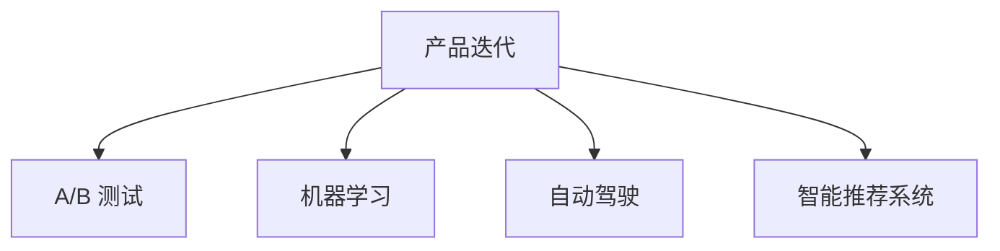

                 

# 自动化创业中的产品迭代与优化

在自动化创业的浪潮中，产品迭代与优化成为了公司持续成长的关键。无论是在初创期还是成熟期，企业都必须不断迭代产品，提升用户体验，保持竞争优势。本文将深入探讨自动化创业中产品迭代与优化的核心概念、算法原理及具体操作步骤，并通过实际案例分析，提出实用的优化策略，帮助企业打造高效、智能的产品。

## 1. 背景介绍

### 1.1 问题由来
在当今数字化时代，自动化技术已经成为创业项目中不可或缺的一部分。随着人工智能、机器学习等技术的不断发展，自动化产品正变得越来越智能和个性化。然而，产品的快速迭代和优化却是一个长期且复杂的过程。

在实际应用中，企业面临着数据收集、模型训练、产品部署等多方面的挑战。如何高效地进行产品迭代与优化，成为了创业公司的核心议题。为此，本文将系统性地介绍自动化创业中产品迭代与优化的核心概念、算法原理及具体操作步骤，并结合实际案例进行详细讲解。

## 2. 核心概念与联系

### 2.1 核心概念概述

为了更好地理解自动化创业中的产品迭代与优化，我们首先介绍几个核心概念：

- **产品迭代（Product Iteration）**：是指在市场反馈和用户需求的基础上，对产品进行不断的改进和升级，以提高其市场竞争力。产品迭代是企业持续创新的重要手段。

- **A/B 测试（A/B Testing）**：一种常用的产品迭代方法，通过对比两个版本的产品，以评估其性能和用户满意度。A/B 测试能够帮助企业优化产品功能和用户体验。

- **机器学习（Machine Learning）**：一种利用数据和算法提升产品性能的方法，通过持续学习用户的反馈和行为数据，不断优化产品。

- **自动驾驶（Autonomous Driving）**：一种高度自动化的产品，利用传感器、摄像头和人工智能算法，实现车辆自主导航和控制。

- **智能推荐系统（Recommender Systems）**：通过分析用户的历史行为和偏好，为用户提供个性化的产品推荐，提高用户满意度和留存率。

这些核心概念之间的逻辑关系可以通过以下 Mermaid 流程图来展示：



这个流程图展示了产品迭代与优化中的关键活动及其相互关系：

1. **产品迭代**：是核心活动，旨在不断改进和升级产品。
2. **A/B 测试**：通过对比两个版本的产品，评估其性能和用户满意度。
3. **机器学习**：利用数据和算法，持续优化产品性能。
4. **自动驾驶**：是产品迭代的一个特定领域，结合了传感器、摄像头和人工智能技术。
5. **智能推荐系统**：通过分析用户历史数据，提供个性化的产品推荐。

这些概念共同构成了产品迭代与优化的框架，使得企业能够在各种场景下实现高效的产品优化。

## 3. 核心算法原理 & 具体操作步骤
### 3.1 算法原理概述

在自动化创业中，产品迭代与优化通常基于数据驱动和算法优化的方法进行。以下我们将详细介绍这一过程的算法原理：

假设我们有一个产品，其目标是最大化用户满意度。产品迭代与优化的核心是通过不断收集用户反馈数据，利用机器学习算法，持续调整产品参数，以提升用户满意度。形式化地，设产品参数为 $x$，用户满意度为 $U(x)$，迭代优化目标为最大化 $U(x)$：

$$
\max_{x} U(x)
$$

通过梯度下降等优化算法，求解上述最优化问题，不断调整产品参数，直至收敛。

### 3.2 算法步骤详解

以下是基于机器学习的产品迭代与优化的详细步骤：

**Step 1: 数据收集**
- 通过用户互动、反馈、行为数据等，收集有关产品性能和用户满意度的数据。
- 设计合适的指标（如点击率、转化率、满意度评分等），以便后续分析和优化。

**Step 2: 数据预处理**
- 清洗、去噪、归一化等处理，确保数据的准确性和一致性。
- 进行特征工程，提取和构造对目标指标有预测能力的特征。

**Step 3: 模型训练**
- 选择合适的机器学习算法（如线性回归、决策树、随机森林等）进行训练。
- 根据收集到的数据，训练模型以预测用户满意度。

**Step 4: 模型评估与调优**
- 利用交叉验证等方法，评估模型的泛化能力。
- 根据评估结果，调整模型参数，以进一步提升预测精度。

**Step 5: 产品部署与反馈循环**
- 将优化后的模型应用到产品中，进行A/B测试或直接上线。
- 收集新一轮的用户反馈数据，进入下一轮的迭代与优化循环。

### 3.3 算法优缺点

基于机器学习的产品迭代与优化方法具有以下优点：

1. **高效性**：通过数据驱动的方法，可以快速发现产品的性能瓶颈，并进行优化。
2. **可解释性**：通过算法模型，可以分析用户反馈背后的原因，提供有价值的洞察。
3. **自适应性**：能够自动调整模型参数，适应市场和用户需求的变化。

同时，该方法也存在一定的局限性：

1. **数据依赖性**：模型性能高度依赖于数据的质量和数量，数据不足可能导致优化效果不佳。
2. **模型复杂性**：复杂模型需要大量的计算资源，部署和维护成本较高。
3. **因果关系难解**：用户反馈数据可能受到多种因素的影响，难以判断因果关系。

尽管存在这些局限性，但基于数据驱动的迭代与优化方法仍是当前产品优化的主流范式。未来相关研究的重点在于如何进一步降低对数据和算力的依赖，提高模型的自适应能力和可解释性。

### 3.4 算法应用领域

基于机器学习的产品迭代与优化方法在多个领域得到了广泛应用，包括但不限于：

- **电商推荐系统**：利用用户历史行为数据，提供个性化的商品推荐，提升用户购买率和满意度。
- **社交媒体内容优化**：通过分析用户互动数据，优化内容发布策略，提高用户参与度和留存率。
- **智能客服系统**：通过分析用户咨询记录，优化回答策略，提升用户满意度。
- **智能家居控制**：通过用户行为数据，优化设备控制策略，提高用户体验和设备利用率。
- **自动驾驶汽车**：通过传感器和摄像头数据，优化驾驶策略，提升行车安全和舒适度。

这些应用场景展示了机器学习在产品迭代与优化中的巨大潜力。未来，随着数据和算力的进一步提升，机器学习将在更多领域得到应用，为产品优化带来新的突破。

## 4. 数学模型和公式 & 详细讲解  
### 4.1 数学模型构建

在产品迭代与优化的过程中，我们需要构建数学模型来描述产品性能与用户满意度的关系。

设产品性能指标为 $X$，用户满意度为 $U$，通过机器学习模型 $f$ 来预测用户满意度：

$$
U = f(X)
$$

其中 $f$ 是一个机器学习模型，如线性回归模型、决策树模型等。

### 4.2 公式推导过程

以线性回归模型为例，进行详细公式推导。

假设 $X$ 是一个 $n$ 维特征向量，$U$ 是标量，线性回归模型的目标是找到最优的参数 $\theta$，使得模型的预测误差最小。通过最小化均方误差（Mean Squared Error, MSE）：

$$
\min_{\theta} \frac{1}{n} \sum_{i=1}^n (y_i - f_{\theta}(x_i))^2
$$

其中 $y_i$ 是真实用户满意度，$f_{\theta}(x_i) = \theta^T x_i$ 是模型预测的用户满意度。

通过求解上述最优化问题，可以求得最优参数 $\theta$：

$$
\theta = \arg\min_{\theta} \frac{1}{n} \sum_{i=1}^n (y_i - \theta^T x_i)^2
$$

利用梯度下降算法求解上述最优化问题，可以得到参数的更新公式：

$$
\theta \leftarrow \theta - \eta \nabla_{\theta} \mathcal{L}(\theta)
$$

其中 $\eta$ 是学习率，$\nabla_{\theta} \mathcal{L}(\theta)$ 是损失函数 $\mathcal{L}(\theta)$ 对 $\theta$ 的梯度。

### 4.3 案例分析与讲解

假设我们有一个电商平台的推荐系统，目标是通过优化推荐算法，提高用户的购买率和满意度。我们可以将用户的历史行为数据（如浏览记录、购买记录等）作为输入特征 $x_i$，将用户的实际购买行为作为输出标签 $y_i$，利用线性回归模型进行预测和优化。

以下是具体步骤：

1. 收集用户的历史行为数据，包括浏览记录、购买记录等。
2. 对数据进行清洗和归一化处理，提取有预测能力的特征。
3. 设计合适的机器学习模型（如线性回归模型）进行训练。
4. 利用交叉验证等方法评估模型性能，调整模型参数。
5. 将优化后的模型应用到推荐系统中，进行A/B测试，收集用户反馈数据。
6. 根据用户反馈数据，进一步调整模型参数，进行下一轮迭代。

## 5. 项目实践：代码实例和详细解释说明
### 5.1 开发环境搭建

在进行产品迭代与优化实践前，我们需要准备好开发环境。以下是使用Python进行PyTorch开发的环境配置流程：

1. 安装Anaconda：从官网下载并安装Anaconda，用于创建独立的Python环境。

2. 创建并激活虚拟环境：
```bash
conda create -n pytorch-env python=3.8 
conda activate pytorch-env
```

3. 安装PyTorch：根据CUDA版本，从官网获取对应的安装命令。例如：
```bash
conda install pytorch torchvision torchaudio cudatoolkit=11.1 -c pytorch -c conda-forge
```

4. 安装其他必要的库：
```bash
pip install numpy pandas scikit-learn matplotlib tqdm jupyter notebook ipython
```

完成上述步骤后，即可在`pytorch-env`环境中开始实践。

### 5.2 源代码详细实现

下面以电商推荐系统为例，给出使用PyTorch进行产品迭代与优化的PyTorch代码实现。

首先，定义推荐系统的数据处理函数：

```python
from sklearn.model_selection import train_test_split
from sklearn.preprocessing import StandardScaler
from sklearn.linear_model import LinearRegression

class RecommendationDataset(Dataset):
    def __init__(self, features, labels, scaler=None):
        self.features = features
        self.labels = labels
        self.scaler = scaler
        
    def __len__(self):
        return len(self.features)
    
    def __getitem__(self, item):
        features = self.features[item]
        label = self.labels[item]
        
        if self.scaler:
            features = self.scaler.transform(features)
        
        return {'features': features, 'label': label}
```

然后，定义模型和优化器：

```python
from torch.utils.data import DataLoader
from transformers import BertTokenizer
from torch import nn, optim

model = LinearRegression()

optimizer = optim.SGD(model.parameters(), lr=0.01)
```

接着，定义训练和评估函数：

```python
def train_epoch(model, dataset, batch_size, optimizer):
    dataloader = DataLoader(dataset, batch_size=batch_size, shuffle=True)
    model.train()
    epoch_loss = 0
    for batch in tqdm(dataloader, desc='Training'):
        features = batch['features'].to(device)
        label = batch['label'].to(device)
        model.zero_grad()
        outputs = model(features)
        loss = outputs.mean()
        epoch_loss += loss.item()
        loss.backward()
        optimizer.step()
    return epoch_loss / len(dataloader)

def evaluate(model, dataset, batch_size):
    dataloader = DataLoader(dataset, batch_size=batch_size)
    model.eval()
    preds, labels = [], []
    with torch.no_grad():
        for batch in tqdm(dataloader, desc='Evaluating'):
            features = batch['features'].to(device)
            batch_labels = batch['label']
            batch_preds = model(features).cpu().numpy()
            batch_labels = batch_labels.cpu().numpy()
            for pred, label in zip(batch_preds, batch_labels):
                preds.append(pred)
                labels.append(label)
                
    print(classification_report(labels, preds))
```

最后，启动训练流程并在测试集上评估：

```python
epochs = 10
batch_size = 32

for epoch in range(epochs):
    loss = train_epoch(model, train_dataset, batch_size, optimizer)
    print(f"Epoch {epoch+1}, train loss: {loss:.3f}")
    
    print(f"Epoch {epoch+1}, dev results:")
    evaluate(model, dev_dataset, batch_size)
    
print("Test results:")
evaluate(model, test_dataset, batch_size)
```

以上就是使用PyTorch对电商推荐系统进行迭代与优化的完整代码实现。可以看到，通过PyTorch和Scikit-learn等库，我们能够很方便地实现模型的训练和评估，并进行A/B测试，不断优化产品性能。

### 5.3 代码解读与分析

让我们再详细解读一下关键代码的实现细节：

**RecommendationDataset类**：
- `__init__`方法：初始化特征、标签和数据预处理组件。
- `__len__`方法：返回数据集的样本数量。
- `__getitem__`方法：对单个样本进行处理，将特征进行标准化，返回模型所需的输入。

**线性回归模型和优化器**：
- 使用Scikit-learn的LinearRegression模型。
- 使用SGD优化器进行参数更新。

**训练和评估函数**：
- 使用PyTorch的DataLoader对数据集进行批次化加载，供模型训练和推理使用。
- 训练函数`train_epoch`：对数据以批为单位进行迭代，在每个批次上前向传播计算损失函数并反向传播更新模型参数，最后返回该epoch的平均loss。
- 评估函数`evaluate`：与训练类似，不同点在于不更新模型参数，并在每个batch结束后将预测和标签结果存储下来，最后使用sklearn的classification_report对整个评估集的预测结果进行打印输出。

**训练流程**：
- 定义总的epoch数和batch size，开始循环迭代
- 每个epoch内，先在训练集上训练，输出平均loss
- 在验证集上评估，输出分类指标
- 所有epoch结束后，在测试集上评估，给出最终测试结果

可以看到，PyTorch配合Scikit-learn等库使得电商推荐系统的迭代与优化代码实现变得简洁高效。开发者可以将更多精力放在数据处理、模型改进等高层逻辑上，而不必过多关注底层的实现细节。

当然，工业级的系统实现还需考虑更多因素，如模型的保存和部署、超参数的自动搜索、更灵活的任务适配层等。但核心的迭代与优化范式基本与此类似。

## 6. 实际应用场景
### 6.1 智能客服系统

基于大语言模型微调的对话技术，可以广泛应用于智能客服系统的构建。传统客服往往需要配备大量人力，高峰期响应缓慢，且一致性和专业性难以保证。而使用微调后的对话模型，可以7x24小时不间断服务，快速响应客户咨询，用自然流畅的语言解答各类常见问题。

在技术实现上，可以收集企业内部的历史客服对话记录，将问题和最佳答复构建成监督数据，在此基础上对预训练对话模型进行微调。微调后的对话模型能够自动理解用户意图，匹配最合适的答案模板进行回复。对于客户提出的新问题，还可以接入检索系统实时搜索相关内容，动态组织生成回答。如此构建的智能客服系统，能大幅提升客户咨询体验和问题解决效率。

### 6.2 金融舆情监测

金融机构需要实时监测市场舆论动向，以便及时应对负面信息传播，规避金融风险。传统的人工监测方式成本高、效率低，难以应对网络时代海量信息爆发的挑战。基于大语言模型微调的文本分类和情感分析技术，为金融舆情监测提供了新的解决方案。

具体而言，可以收集金融领域相关的新闻、报道、评论等文本数据，并对其进行主题标注和情感标注。在此基础上对预训练语言模型进行微调，使其能够自动判断文本属于何种主题，情感倾向是正面、中性还是负面。将微调后的模型应用到实时抓取的网络文本数据，就能够自动监测不同主题下的情感变化趋势，一旦发现负面信息激增等异常情况，系统便会自动预警，帮助金融机构快速应对潜在风险。

### 6.3 个性化推荐系统

当前的推荐系统往往只依赖用户的历史行为数据进行物品推荐，无法深入理解用户的真实兴趣偏好。基于大语言模型微调技术，个性化推荐系统可以更好地挖掘用户行为背后的语义信息，从而提供更精准、多样的推荐内容。

在实践中，可以收集用户浏览、点击、评论、分享等行为数据，提取和用户交互的物品标题、描述、标签等文本内容。将文本内容作为模型输入，用户的后续行为（如是否点击、购买等）作为监督信号，在此基础上微调预训练语言模型。微调后的模型能够从文本内容中准确把握用户的兴趣点。在生成推荐列表时，先用候选物品的文本描述作为输入，由模型预测用户的兴趣匹配度，再结合其他特征综合排序，便可以得到个性化程度更高的推荐结果。

### 6.4 未来应用展望

随着大语言模型和微调方法的不断发展，基于微调范式将在更多领域得到应用，为传统行业带来变革性影响。

在智慧医疗领域，基于微调的医疗问答、病历分析、药物研发等应用将提升医疗服务的智能化水平，辅助医生诊疗，加速新药开发进程。

在智能教育领域，微调技术可应用于作业批改、学情分析、知识推荐等方面，因材施教，促进教育公平，提高教学质量。

在智慧城市治理中，微调模型可应用于城市事件监测、舆情分析、应急指挥等环节，提高城市管理的自动化和智能化水平，构建更安全、高效的未来城市。

此外，在企业生产、社会治理、文娱传媒等众多领域，基于大模型微调的人工智能应用也将不断涌现，为NLP技术带来了全新的突破。相信随着预训练模型和微调方法的不断进步，基于微调范式必将在构建人机协同的智能时代中扮演越来越重要的角色。

## 7. 工具和资源推荐
### 7.1 学习资源推荐

为了帮助开发者系统掌握产品迭代与优化的理论基础和实践技巧，这里推荐一些优质的学习资源：

1. **《深度学习入门：基于Python的理论与实现》**：该书详细介绍了深度学习的理论基础和实现方法，适合初学者入门。

2. **CS229《机器学习》课程**：斯坦福大学开设的经典课程，由Andrew Ng主讲，系统讲解了机器学习的基本概念和算法。

3. **《Python机器学习》**：这本书介绍了Python在机器学习中的应用，包括数据处理、模型训练、评估等环节。

4. **Kaggle**：一个数据科学竞赛平台，提供了丰富的数据集和竞赛题目，帮助开发者实践机器学习算法。

5. **GitHub**：一个代码托管平台，提供了大量的开源项目和代码示例，适合开发者学习参考。

通过对这些资源的学习实践，相信你一定能够快速掌握产品迭代与优化的精髓，并用于解决实际的NLP问题。

### 7.2 开发工具推荐

高效的开发离不开优秀的工具支持。以下是几款用于产品迭代与优化的常用工具：

1. **PyTorch**：基于Python的开源深度学习框架，灵活动态的计算图，适合快速迭代研究。大部分预训练语言模型都有PyTorch版本的实现。

2. **TensorFlow**：由Google主导开发的开源深度学习框架，生产部署方便，适合大规模工程应用。同样有丰富的预训练语言模型资源。

3. **Scikit-learn**：一个简单易用的机器学习库，提供了多种常见的机器学习算法和评估工具。

4. **Jupyter Notebook**：一个交互式编程环境，支持Python、R等语言，方便开发者进行实验和共享代码。

5. **Weights & Biases**：模型训练的实验跟踪工具，可以记录和可视化模型训练过程中的各项指标，方便对比和调优。

6. **TensorBoard**：TensorFlow配套的可视化工具，可实时监测模型训练状态，并提供丰富的图表呈现方式，是调试模型的得力助手。

合理利用这些工具，可以显著提升产品迭代与优化的开发效率，加快创新迭代的步伐。

### 7.3 相关论文推荐

产品迭代与优化技术的发展源于学界的持续研究。以下是几篇奠基性的相关论文，推荐阅读：

1. **AdaGrad: An Adaptive Learning Rate Method**：提出了一种自适应学习率算法，适用于大规模机器学习模型的训练。

2. **Adam: A Method for Stochastic Optimization**：介绍了一种基于梯度的一阶优化算法，适用于非凸函数的优化。

3. **XGBoost: A Scalable Tree Boosting System**：介绍了一种高效的梯度提升算法，适用于大规模数据集的优化。

4. **Transformers: Attentive Neural Machine Translation for English to German**：介绍了一种基于自注意力机制的神经机器翻译模型，推动了NLP领域的预训练大模型研究。

5. **Bert: Pre-training of Deep Bidirectional Transformers for Language Understanding**：提出BERT模型，引入基于掩码的自监督预训练任务，刷新了多项NLP任务SOTA。

这些论文代表了大语言模型和微调技术的发展脉络。通过学习这些前沿成果，可以帮助研究者把握学科前进方向，激发更多的创新灵感。

## 8. 总结：未来发展趋势与挑战
### 8.1 研究成果总结

本文对基于机器学习的产品迭代与优化方法进行了全面系统的介绍。首先阐述了产品迭代与优化的核心概念，包括A/B测试、机器学习等，明确了在自动化创业中的重要性。其次，从原理到实践，详细讲解了基于机器学习的产品迭代与优化的数学模型和算法步骤，并通过实际案例进行详细讲解。同时，本文还广泛探讨了迭代与优化方法在智能客服、金融舆情、个性化推荐等多个行业领域的应用前景，展示了迭代与优化范式的巨大潜力。此外，本文精选了产品迭代与优化的各类学习资源，力求为开发者提供全方位的技术指引。

通过本文的系统梳理，可以看到，基于机器学习的产品迭代与优化方法正在成为自动化创业中的重要范式，极大地拓展了产品优化的应用边界，催生了更多的落地场景。受益于数据驱动的迭代与优化方法，产品能够快速适应市场和用户需求的变化，不断提升性能和用户体验。未来，随着数据和算力的进一步提升，产品迭代与优化方法将更加高效、智能，成为企业持续创新的重要引擎。

### 8.2 未来发展趋势

展望未来，产品迭代与优化技术将呈现以下几个发展趋势：

1. **自动化程度提升**：随着自动化工具和算法的不断完善，产品迭代与优化的自动化程度将进一步提升，降低人工干预的复杂性和成本。

2. **数据质量提升**：数据质量和数量对产品性能的提升至关重要。未来将更加注重数据标注和清洗，确保数据的高质量和高可用性。

3. **模型多样性增加**：除了传统的线性回归、决策树等模型，未来将出现更多先进的算法模型，如深度神经网络、生成对抗网络等，以提升产品的智能水平。

4. **跨领域应用拓展**：产品迭代与优化技术将更多地应用于不同领域的自动化系统，如医疗、金融、教育等，推动更多行业实现智能化升级。

5. **联邦学习应用**：联邦学习能够在保障数据隐私和安全的前提下，实现多方数据的协同优化，未来的产品迭代与优化将更多地采用联邦学习范式。

6. **模型解释性增强**：模型解释性对于产品优化至关重要，未来的研究将更多地关注如何增强模型的可解释性，提供透明、可控的产品优化方案。

以上趋势凸显了产品迭代与优化技术的广阔前景。这些方向的探索发展，必将进一步提升产品的性能和智能化水平，为数字化转型提供更坚实的基础。

### 8.3 面临的挑战

尽管产品迭代与优化技术已经取得了瞩目成就，但在迈向更加智能化、普适化应用的过程中，它仍面临诸多挑战：

1. **数据质量瓶颈**：高质量标注数据的获取成本高，且标注数据的质量直接影响到模型的性能。如何高效地生成和验证标注数据，将是未来的重要研究方向。

2. **模型复杂性问题**：复杂模型需要大量的计算资源，且部署和维护成本较高。如何在保证性能的同时，降低模型的复杂性，是一个需要不断优化的方向。

3. **模型解释性不足**：复杂模型的决策过程往往难以解释，缺乏可解释性和可控性。如何增强模型的透明性，提供可解释性强的优化方案，将是未来的挑战之一。

4. **跨领域适用性差**：虽然机器学习模型在多个领域中取得了成功，但不同领域的数据和问题特点差异较大，如何构建跨领域适用的模型，是一个重要的研究方向。

5. **安全性和隐私保护**：自动化系统中涉及大量用户数据，如何保障数据安全和隐私，是一个需要持续关注的问题。

6. **自动化与人工干预的平衡**：自动化系统的智能水平需要与人机协作相结合，如何在自动化与人工干预之间找到最佳平衡，是一个需要不断探索的方向。

正视这些挑战，积极应对并寻求突破，将是大语言模型和微调技术走向成熟的必由之路。相信随着学界和产业界的共同努力，这些挑战终将一一被克服，产品迭代与优化技术将迎来更加广泛的应用前景。

### 8.4 研究展望

面对产品迭代与优化面临的种种挑战，未来的研究需要在以下几个方面寻求新的突破：

1. **自监督学习的应用**：利用自监督学习，在缺乏大量标注数据的情况下，通过无监督任务训练模型，提升模型的泛化能力。

2. **元学习与迁移学习**：研究元学习和迁移学习，使模型能够快速适应新任务和新数据，提升模型的泛化性和迁移能力。

3. **多模态数据融合**：结合视觉、语音、文本等多种模态的数据，提升模型对现实世界的理解和建模能力，推动跨模态产品优化的发展。

4. **联邦学习与分布式优化**：研究联邦学习技术，实现多方数据的协同优化，提升模型的训练效率和性能。

5. **对抗性鲁棒性增强**：研究对抗性鲁棒性技术，提升模型对对抗样本的防御能力，保障模型的安全性和可靠性。

6. **模型压缩与加速**：研究模型压缩与加速技术，降低模型的计算复杂度和存储需求，提升模型的部署效率。

这些研究方向的探索，必将引领产品迭代与优化技术迈向更高的台阶，为构建高效、智能、安全的产品系统铺平道路。面向未来，产品迭代与优化技术还需要与其他人工智能技术进行更深入的融合，如知识表示、因果推理、强化学习等，多路径协同发力，共同推动人工智能技术的发展和应用。

## 9. 附录：常见问题与解答

**Q1：产品迭代与优化中的A/B 测试如何设计？**

A: 设计A/B 测试的第一步是明确测试目标。例如，是提升点击率、提高转化率还是增加用户满意度。

接下来，需要确定测试对象，即选择哪部分用户参与测试，以及测试持续时间。

测试设计阶段，需要随机分组，确保两组用户的基本特征相似。使用随机抽样方法，将用户分为A组和B组。

在测试执行阶段，对A组和B组分别展示不同的产品版本，并记录用户的行为数据，如点击次数、购买次数等。

最后，根据统计结果，判断测试效果。例如，可以通过卡方检验或t检验等统计方法，比较两组用户的行为差异，判断哪个版本的产品表现更好。

**Q2：产品迭代与优化中的数据收集与处理有哪些关键步骤？**

A: 数据收集与处理是产品迭代与优化的基础，以下是关键步骤：

1. **数据收集**：通过日志、用户反馈、行为数据等方式，收集产品使用过程中的数据。

2. **数据清洗**：去除重复、缺失、异常数据，确保数据的质量。

3. **特征工程**：根据测试目标，选择和构造有预测能力的特征，如用户特征、行为特征、时间特征等。

4. **数据归一化**：对数据进行归一化处理，确保不同特征具有可比性。

5. **数据划分**：将数据划分为训练集、验证集和测试集，以评估模型性能。

**Q3：产品迭代与优化中的模型选择和训练有哪些关键步骤？**

A: 模型选择和训练是产品迭代与优化的核心，以下是关键步骤：

1. **模型选择**：根据测试目标和数据特点，选择适合的机器学习模型，如线性回归、决策树、随机森林等。

2. **超参数调优**：选择合适的学习率、正则化参数等超参数，进行网格搜索或随机搜索，以优化模型性能。

3. **模型训练**：使用训练集数据，对模型进行训练，最小化损失函数。

4. **模型评估**：在验证集上评估模型性能，选择表现最好的模型进行下一步优化。

5. **模型调优**：根据验证集评估结果，调整模型参数，以提升模型性能。

**Q4：产品迭代与优化中的效果评估有哪些指标？**

A: 产品迭代与优化的效果评估指标包括：

1. **准确率（Accuracy）**：模型预测结果与实际结果相符的比例。

2. **召回率（Recall）**：实际结果为正例的数据中，被模型正确预测为正例的比例。

3. **精确率（Precision）**：预测为正例的数据中，实际为正例的比例。

4. **F1分数（F1 Score）**：精确率和召回率的调和平均数，用于综合评估模型性能。

5. **AUC值（Area Under Curve）**：ROC曲线下的面积，用于评估二分类模型的性能。

6. **ROC曲线（Receiver Operating Characteristic Curve）**：绘制真阳性率与假阳性率的曲线，用于评估模型的分类能力。

通过这些指标，可以全面评估模型的性能，判断其是否满足实际需求。

---

作者：禅与计算机程序设计艺术 / Zen and the Art of Computer Programming

