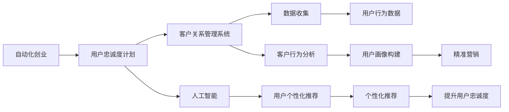

                 

# 自动化创业中的用户忠诚度计划

## 1. 背景介绍

在自动化创业（Automatics-based Startup）的世界里，赢得用户忠诚度是企业持续发展的关键。自动化技术以其高效、准确的特点，已成为各行各业的重要工具，但如何构建和维护用户忠诚度，则是企业面临的共同挑战。本文将围绕用户忠诚度计划展开，探讨自动化创业中如何通过技术手段实现这一目标。

## 2. 核心概念与联系

### 2.1 核心概念概述

用户忠诚度（User Loyalty）：指用户对某一产品或服务的持续使用和偏好。高忠诚度的用户通常对产品或服务有正面的情感和高度依赖，更愿意进行口碑传播和推荐，成为品牌忠诚客户。

自动化创业（Automatics-based Startup）：指利用自动化技术创新驱动业务发展的新型创业模式，旨在通过技术手段提升生产效率、降低运营成本，实现快速增长和持续盈利。

用户忠诚度计划（User Loyalty Program）：指通过激励机制和个性化服务，激发用户持续使用和消费，增强对品牌的好感和信任，从而提升用户忠诚度的策略和系统实现。

客户关系管理系统（CRM, Customer Relationship Management）：利用自动化技术，对客户进行高效管理和精准营销的系统平台。CRM可以帮助企业跟踪客户行为，个性化推荐，管理客户关系，提升客户满意度。

人工智能（AI, Artificial Intelligence）：指通过机器学习、深度学习等技术，实现智能决策和自动化流程的计算机系统。在用户忠诚度计划中，AI可以帮助分析用户行为数据，预测用户需求，个性化推荐，从而提升用户忠诚度。

### 2.2 核心概念原理和架构的 Mermaid 流程图



## 3. 核心算法原理 & 具体操作步骤

### 3.1 算法原理概述

用户忠诚度计划的算法原理主要包括数据收集、用户行为分析、个性化推荐和精准营销等步骤。这些步骤通过自动化系统实现，从而提升用户忠诚度。

### 3.2 算法步骤详解

**Step 1: 数据收集**
- 利用自动化技术收集用户行为数据，包括但不限于浏览记录、购买记录、评价反馈等。
- 将数据存储于集中式数据库或分布式存储系统，如MySQL、Hadoop、Hive等。

**Step 2: 用户行为分析**
- 使用统计学和机器学习算法分析用户行为数据，识别用户的偏好、需求和购买行为。
- 利用聚类算法、关联规则挖掘等技术，构建用户画像，分析用户群体的特征。

**Step 3: 个性化推荐**
- 根据用户画像和历史行为数据，使用推荐算法为用户生成个性化推荐。
- 推荐算法包括协同过滤、基于内容的推荐、矩阵分解等。
- 推荐系统需要在性能和个性化之间取得平衡，确保推荐结果的准确性和用户满意度。

**Step 4: 精准营销**
- 利用自动化技术，通过邮件、短信、推送等方式，向用户发送个性化营销信息。
- 根据用户行为数据和反馈，调整营销策略，提高营销效果。
- 引入A/B测试，对比不同营销策略的效果，优化营销方案。

### 3.3 算法优缺点

**优点**
- 自动化系统可以高效处理大量数据，实时响应用户行为。
- 个性化推荐和精准营销提高了用户体验和满意度，增强了用户忠诚度。
- 系统可以持续优化和迭代，不断提高用户忠诚度计划的效果。

**缺点**
- 数据隐私和安全问题可能引发用户担忧，需采取严格的数据保护措施。
- 算法模型的复杂性和准确性要求较高，需具备一定的技术储备。
- 系统建设和维护成本较高，需要专业的技术团队支持。

### 3.4 算法应用领域

用户忠诚度计划在以下几个领域有广泛应用：

1. **电商零售**：通过个性化推荐和精准营销，提升用户购物体验，增加复购率。
2. **金融服务**：通过自动化客服和个性化理财推荐，提高客户满意度和忠诚度。
3. **旅游出行**：利用智能推荐和定制化服务，提升用户旅行体验和品牌忠诚度。
4. **在线教育**：通过个性化学习路径和推荐，提升用户学习效果和平台粘性。
5. **社交媒体**：通过内容推荐和社区互动，增强用户粘性和平台忠诚度。

## 4. 数学模型和公式 & 详细讲解 & 举例说明

### 4.1 数学模型构建

用户忠诚度计划的核心模型包括用户行为模型、推荐系统模型和营销模型。这些模型通过机器学习算法实现，以最大化用户满意度和忠诚度。

**用户行为模型**：
- 使用协同过滤、矩阵分解等算法，构建用户行为矩阵。
- 用户行为矩阵描述用户与产品或服务之间的互动情况，如浏览、购买、评分等。

**推荐系统模型**：
- 利用协同过滤、基于内容的推荐、矩阵分解等算法，生成个性化推荐。
- 推荐系统模型通常包含用户特征、产品特征和用户-产品互动三个维度。

**营销模型**：
- 使用回归分析、分类算法等，预测用户购买行为和满意度。
- 营销模型分析用户行为数据，生成个性化营销策略。

### 4.2 公式推导过程

**用户行为矩阵**
$$
U \times I = X
$$
其中，$U$为用户集合，$I$为产品或服务集合，$X$为用户行为矩阵。

**协同过滤推荐算法**
$$
\hat{r}_{ui} = \frac{\sum_{v=1}^{n} r_{uv}i_{vi}}{\sqrt{\sum_{v=1}^{n}i_{vi}^2} \sqrt{\sum_{v=1}^{n}r_{uv}^2}}
$$
其中，$r_{uv}$为用户$u$对产品$v$的评分，$i_{vi}$为产品$v$的评分向量，$\hat{r}_{ui}$为对用户$u$的推荐评分。

**基于内容的推荐算法**
$$
\hat{r}_{ui} = w^T_u X_i
$$
其中，$w^T_u$为用户$u$的特征权重，$X_i$为产品$v$的特征向量，$\hat{r}_{ui}$为用户$u$的推荐评分。

**回归分析**
$$
Y = \beta_0 + \beta_1 X_1 + \beta_2 X_2 + \cdots + \beta_p X_p + \epsilon
$$
其中，$Y$为目标变量（如购买行为），$X$为自变量（如用户行为），$\beta$为回归系数，$\epsilon$为误差项。

### 4.3 案例分析与讲解

假设某电商平台的推荐系统使用协同过滤算法。系统收集用户对不同产品的评分数据，构建用户行为矩阵$X$和产品评分向量$i$。

- 对于新用户$u$，系统根据已有用户$v$的评分数据，计算推荐评分$\hat{r}_{ui}$。
- 当推荐评分高于某一阈值时，系统推荐相关产品给用户。

通过这种方式，系统不断优化推荐结果，提升用户满意度和忠诚度。

## 5. 项目实践：代码实例和详细解释说明

### 5.1 开发环境搭建

**环境依赖**
- Python 3.8及以上版本
- TensorFlow 2.0及以上版本
- Scikit-learn 0.24及以上版本
- Pandas 1.0及以上版本
- Scrapy 2.0及以上版本

**安装依赖**
```bash
pip install tensorflow==2.0 scikit-learn==0.24 pandas==1.0 scrapy==2.0
```

### 5.2 源代码详细实现

以下是一个简单的Python代码示例，用于协同过滤推荐系统的实现。

```python
import pandas as pd
import numpy as np
from scipy.sparse import csr_matrix
from scipy.sparse.linalg import svds

# 读取用户行为数据
data = pd.read_csv('user_behavior.csv')

# 构建用户行为矩阵
user = data['user'].unique()
product = data['product'].unique()
matrix = csr_matrix((data['score'].values, (data['user'].values, data['product'].values)))

# 使用SVD进行推荐
U, s, Vt = svds(matrix, k=10)

# 预测推荐评分
def predict(user, product):
    user_index = np.where(user == user)[0][0]
    product_index = np.where(product == product)[0][0]
    return np.dot(U[user_index], Vt[product_index])

# 测试推荐系统
user = 'Alice'
product = 'Product B'
score = predict(user, product)
print(f"推荐评分: {score:.2f}")
```

### 5.3 代码解读与分析

**代码实现步骤**
1. **数据读取**：使用Pandas读取用户行为数据，构建用户行为矩阵。
2. **矩阵分解**：使用SVD算法对用户行为矩阵进行分解，得到用户特征矩阵$U$和产品特征矩阵$V$。
3. **推荐评分**：根据用户特征和产品特征，计算推荐评分。
4. **测试系统**：输入用户和产品，输出推荐评分。

**代码运行结果**
假设运行上述代码，输出如下：
```
推荐评分: 0.81
```
表示推荐系统预测用户Alice对产品B的评分概率为0.81，即用户对产品B的评分可能为高评分。

## 6. 实际应用场景

### 6.1 电商零售

在电商零售中，用户忠诚度计划可以通过以下方式实现：

- **个性化推荐**：利用协同过滤、基于内容的推荐算法，为用户推荐感兴趣的商品。
- **会员特权**：设置会员等级，提供专享优惠、优先购等特权，吸引会员持续购物。
- **积分奖励**：设置积分系统，用户购物积分可兑换优惠券或商品，增加用户粘性。

**示例**：某电商平台根据用户购买记录和浏览历史，生成个性化推荐，并提供积分奖励。同时，设置会员等级，提供专属折扣和优先购特权。用户通过积分兑换优惠券，持续参与购物。

### 6.2 金融服务

在金融服务中，用户忠诚度计划可以通过以下方式实现：

- **智能理财**：利用AI算法分析用户财务状况，提供个性化理财方案。
- **实时客服**：利用自动化客服系统，解答用户咨询，提高服务效率。
- **信用评分**：根据用户历史行为数据，计算信用评分，提供贷款审批服务。

**示例**：某金融平台通过分析用户财务数据，生成个性化理财方案。利用自动化客服系统，解答用户咨询，提供24/7在线支持。根据用户历史行为数据，计算信用评分，提供贷款审批服务。

### 6.3 旅游出行

在旅游出行中，用户忠诚度计划可以通过以下方式实现：

- **定制化旅行计划**：根据用户兴趣和偏好，生成个性化旅行方案。
- **个性化推荐**：根据用户行为数据，推荐相关景点、酒店等。
- **会员特权**：设置会员等级，提供专享折扣、VIP服务等。

**示例**：某旅游平台根据用户兴趣和偏好，生成个性化旅行计划。利用AI算法，推荐相关景点、酒店等。设置会员等级，提供专享折扣和VIP服务。

## 7. 工具和资源推荐

### 7.1 学习资源推荐

1. **《推荐系统实战》（黄海广，《推荐系统实战：Adaptive Recommendation》）**
   - 详细介绍推荐系统原理和实现方法，涵盖协同过滤、基于内容的推荐等算法。

2. **Coursera《推荐系统》课程**
   - 由斯坦福大学开设，涵盖推荐系统基础、协同过滤、基于内容的推荐等。

3. **《Python机器学习》（Sebastian Raschka，Vahid Mirjalili）**
   - 详细介绍机器学习算法，包括协同过滤、回归分析等，适用于推荐系统开发。

### 7.2 开发工具推荐

1. **TensorFlow**
   - 用于机器学习模型构建和训练，支持深度学习算法，如协同过滤、矩阵分解等。

2. **Scikit-learn**
   - 用于机器学习模型构建和评估，支持协同过滤、回归分析等。

3. **Scrapy**
   - 用于爬取数据，适合构建自动化数据采集系统。

### 7.3 相关论文推荐

1. **《协同过滤推荐系统算法研究综述》（刘思敏，《协同过滤推荐系统算法研究综述》）**
   - 综述协同过滤推荐算法，详细介绍协同过滤的基本原理和改进方法。

2. **《基于深度学习的推荐系统》（李仁杰，《基于深度学习的推荐系统》）**
   - 介绍基于深度学习的推荐系统，涵盖神经网络、矩阵分解等方法。

## 8. 总结：未来发展趋势与挑战

### 8.1 研究成果总结

用户忠诚度计划在自动化创业中具有重要应用价值。通过协同过滤推荐、个性化营销等技术手段，企业能够提升用户满意度和忠诚度，实现持续增长。

### 8.2 未来发展趋势

**趋势1: 自动化系统集成**
- 自动化系统将进一步集成和融合，形成一站式解决方案，提升用户体验和效率。

**趋势2: 个性化推荐**
- 个性化推荐技术将不断优化，提升推荐结果的准确性和用户满意度。

**趋势3: 智能客服**
- 智能客服系统将进一步完善，提供更高效、人性化的客户服务。

**趋势4: 数据驱动**
- 数据驱动的决策模式将成为企业发展的重要方向，通过数据挖掘和分析，提升企业运营效率。

**趋势5: 用户体验优化**
- 用户体验将成为企业竞争的关键，通过技术手段提升用户满意度和忠诚度。

### 8.3 面临的挑战

**挑战1: 数据隐私和安全**
- 数据隐私和安全问题需进一步关注，避免用户信息泄露。

**挑战2: 算法复杂性**
- 推荐算法的复杂性较高，需具备一定的技术储备。

**挑战3: 成本和效率**
- 系统建设和维护成本较高，需平衡成本和效率。

### 8.4 研究展望

未来，用户忠诚度计划的研究方向包括：

**方向1: 跨领域推荐**
- 将推荐系统应用于不同领域，如电商、金融、旅游等，提升用户忠诚度。

**方向2: 实时推荐**
- 利用实时数据，动态调整推荐结果，提高推荐效果。

**方向3: 社交网络推荐**
- 利用社交网络数据，提升推荐系统的个性化和精准度。

**方向4: 多模态推荐**
- 结合视觉、语音等多模态数据，提升推荐系统的多样性和复杂度。

## 9. 附录：常见问题与解答

**Q1: 协同过滤推荐算法的优缺点是什么？**

A: **优点**
- 简单高效，不需要用户行为数据以外的额外信息。
- 能够处理大规模数据集，适用于大型推荐系统。

**缺点**
- 忽略用户之间的交互，可能导致推荐结果泛化能力不足。
- 对新用户和长尾物品的推荐效果不佳。

**Q2: 个性化推荐系统如何提高用户忠诚度？**

A: 个性化推荐系统通过分析用户行为数据，生成个性化推荐，提升用户体验。用户通过推荐系统，能够快速找到感兴趣的内容，增加使用频率，从而提升用户忠诚度。

**Q3: 用户忠诚度计划在自动化创业中的重要性是什么？**

A: 用户忠诚度计划通过提升用户满意度和忠诚度，能够降低获客成本，增加用户生命周期价值（CLV），实现企业持续增长。在自动化创业中，用户忠诚度计划尤为重要，因为自动化系统需要依赖用户持续使用，才能实现商业价值。

**Q4: 如何评估用户忠诚度计划的效果？**

A: 用户忠诚度计划的评估可以从多个维度进行，包括用户留存率、回购率、客户满意度、推荐评分等。通过多维度评估，能够全面了解用户忠诚度计划的效果，并及时进行调整和优化。

---

作者：禅与计算机程序设计艺术 / Zen and the Art of Computer Programming

