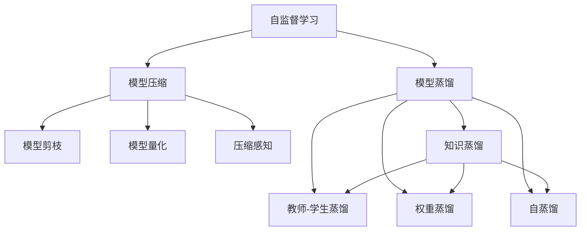

                 

# 自监督学习的应用实践:模型压缩和模型蒸馏

> 关键词：自监督学习,模型压缩,模型蒸馏,知识蒸馏,推理加速,模型剪枝,模型量化,压缩感知

## 1. 背景介绍

### 1.1 问题由来
随着深度学习技术的迅猛发展，大模型在自然语言处理(NLP)、计算机视觉(CV)、语音识别(SR)等领域取得了显著的进展。然而，大模型的参数量庞大，计算和存储资源消耗巨大，这限制了其在移动设备、边缘计算等资源受限环境中的应用。为了提高模型推理速度，降低资源消耗，模型压缩和模型蒸馏成为了一个重要的研究方向。

### 1.2 问题核心关键点
模型压缩和模型蒸馏是两种常见的模型优化技术，它们的核心思想是通过自监督学习训练模型，使得模型在推理过程中消耗更少的资源，同时保持较高的预测精度。模型压缩通常通过剪枝、量化和压缩感知等技术实现，而模型蒸馏则是通过知识蒸馏技术，将大模型的知识迁移到小模型上，以实现推理加速。

## 2. 核心概念与联系

### 2.1 核心概念概述

为更好地理解模型压缩和模型蒸馏的技术原理和应用方法，本节将介绍几个密切相关的核心概念：

- 自监督学习(Self-Supervised Learning, SSL)：指在无标签数据上训练模型的过程，通过构造假标签或预定义的结构性约束，实现模型的自监督学习。自监督学习不仅能提升模型的泛化能力，还能降低标注数据的需求。
- 模型压缩(Model Compression)：指通过去除模型冗余参数、优化计算图、降低模型精度等手段，使得模型在推理过程中消耗更少的资源。常用的技术包括模型剪枝、量化、压缩感知等。
- 模型蒸馏(Model Distillation)：指通过将大模型的知识迁移到小模型上，使得小模型在推理过程中能够快速、准确地做出预测。常用的技术包括教师-学生蒸馏、权重蒸馏、自蒸馏等。
- 知识蒸馏(Knowledge Distillation)：是模型蒸馏的一种形式，通过将大模型的复杂知识迁移到小模型上，使得小模型在推理时能够获得和大模型相当的性能。
- 推理加速(Inference Acceleration)：指通过优化模型结构和推理算法，使得模型在实际部署时能够快速完成推理任务，以适应资源受限环境的需求。
- 模型剪枝(Pruning)：通过去除模型中不必要的参数，减少模型计算量和存储空间。剪枝后的模型在推理时更加高效。
- 模型量化(Quantization)：将浮点数参数转为定点参数，降低模型精度损失的同时，减小模型存储空间和计算开销。
- 压缩感知(Compressive Sensing)：通过在信号采集和压缩阶段引入冗余信息，实现信号的精确重构，从而减少计算和存储资源。

这些核心概念之间的逻辑关系可以通过以下Mermaid流程图来展示：



这个流程图展示了大模型优化技术的主要环节及其相互关系：

1. 自监督学习通过无标签数据训练模型，提升模型泛化能力。
2. 模型压缩通过剪枝、量化和压缩感知等技术，减少模型资源消耗。
3. 模型蒸馏通过知识蒸馏技术，将大模型的知识迁移到小模型上，实现推理加速。
4. 模型剪枝、量化和压缩感知是模型压缩的主要手段。
5. 知识蒸馏包括教师-学生蒸馏、权重蒸馏和自蒸馏等形式，是模型蒸馏的核心。

这些核心概念共同构成了大模型优化技术的框架，使得大模型能够在资源受限环境下高效推理，进一步拓展了深度学习技术的应用范围。

## 3. 核心算法原理 & 具体操作步骤
### 3.1 算法原理概述

模型压缩和模型蒸馏的核心原理是通过自监督学习训练模型，减少模型的计算量和存储空间，同时保持模型的预测精度。具体来说，模型压缩和模型蒸馏的主要步骤包括：

1. 自监督学习：使用无标签数据训练模型，提升模型的泛化能力。
2. 模型剪枝：去除模型中冗余参数，减少计算量。
3. 模型量化：将模型参数从浮点数转为定点数，减小存储空间和计算开销。
4. 压缩感知：通过引入冗余信息，实现信号的精确重构，减少计算和存储资源。
5. 知识蒸馏：通过将大模型的知识迁移到小模型上，提升小模型的推理能力。
6. 推理加速：优化模型结构和推理算法，提升推理速度。

### 3.2 算法步骤详解

以下是模型压缩和模型蒸馏的详细步骤：

**Step 1: 数据准备和模型训练**

- 准备自监督学习所需的大量无标签数据。
- 使用自监督学习算法训练模型，如对比学习、掩码语言模型等。
- 训练结束后，模型具备较强的泛化能力。

**Step 2: 模型压缩**

- 选择模型压缩的方法，如剪枝、量化等。
- 进行模型剪枝，去除冗余参数，提高模型推理速度。
- 进行模型量化，将浮点数参数转为定点数，减小模型存储空间和计算开销。
- 应用压缩感知技术，减少计算和存储资源。

**Step 3: 模型蒸馏**

- 选择知识蒸馏的方法，如教师-学生蒸馏、权重蒸馏等。
- 训练教师模型（大模型），使用自监督学习或监督学习算法。
- 训练学生模型（小模型），将教师模型的知识迁移到学生模型上。
- 通过蒸馏过程，学生模型获得教师模型的知识，提升推理能力。

**Step 4: 推理加速**

- 优化模型结构和推理算法，如卷积核共享、剪枝、量化等。
- 应用推理优化技术，如模型推理加速库、剪枝优化等。
- 在实际推理场景中测试模型，评估推理速度和精度。

### 3.3 算法优缺点

模型压缩和模型蒸馏具有以下优点：
1. 提升推理速度。模型压缩和蒸馏后的模型推理速度更快，适合资源受限环境。
2. 减少计算和存储资源消耗。模型压缩和蒸馏通过去除冗余参数和优化计算图，减小了资源需求。
3. 提升模型泛化能力。自监督学习训练的模型泛化能力更强，适用于多种应用场景。

同时，这些技术也存在一定的局限性：
1. 精度损失。模型压缩和蒸馏后，模型精度可能有所下降，需要权衡精度和速度。
2. 计算复杂度高。自监督学习训练过程耗时较长，需要大量的计算资源。
3. 应用场景受限。模型压缩和蒸馏适用于特定类型的模型和任务，需要根据实际需求选择合适的方法。
4. 难以应对多样性。模型压缩和蒸馏难以处理模型多样性和模型结构的复杂性。

尽管存在这些局限性，但就目前而言，模型压缩和蒸馏技术仍然是提高模型性能和优化资源消耗的重要手段。未来相关研究的重点在于如何进一步提高压缩和蒸馏的效率和效果，同时兼顾模型的泛化能力和推理精度。

### 3.4 算法应用领域

模型压缩和模型蒸馏在深度学习领域得到了广泛应用，具体应用领域包括：

- 自然语言处理(NLP)：在BERT、GPT等大型语言模型上进行剪枝和量化，提升推理速度。
- 计算机视觉(CV)：在ResNet、Inception等大型卷积神经网络上进行剪枝和量化，提升推理速度。
- 语音识别(SR)：在Transformer等语音识别模型上进行剪枝和量化，提升推理速度。
- 机器人技术：在机器人视觉、语音识别等模块上进行压缩和蒸馏，提升系统的实时性和稳定性。
- 移动设备：在手机、物联网设备等资源受限环境中，使用压缩和蒸馏技术优化模型性能。
- 医疗诊断：在医学影像分析、疾病预测等任务中，通过压缩和蒸馏技术提升模型推理速度。

除了上述这些经典应用外，模型压缩和蒸馏技术还在更多领域得到创新性的应用，如自动驾驶、智能制造、智慧城市等，为深度学习技术落地应用提供了重要的支持。

## 4. 数学模型和公式 & 详细讲解  
### 4.1 数学模型构建

本节将使用数学语言对模型压缩和模型蒸馏过程进行更加严格的刻画。

记待压缩的深度学习模型为 $M_{\theta}$，其中 $\theta$ 为模型参数。假设模型在无标签数据集 $D=\{x_i\}_{i=1}^N$ 上进行自监督学习训练，得到模型参数 $\theta$。

定义模型压缩后的压缩模型为 $M_{\hat{\theta}}$，其中 $\hat{\theta}$ 为压缩后的模型参数。假设采用剪枝方法，保留 $k$ 个最重要的参数，即 $\hat{\theta} \in \text{Span}(\{v_j\}_{j=1}^k)$，其中 $\{v_j\}_{j=1}^k$ 为保留的参数向量，$\text{Span}(\{v_j\}_{j=1}^k)$ 表示由 $\{v_j\}_{j=1}^k$ 生成的向量空间。

定义模型蒸馏后的蒸馏模型为 $M_{\tilde{\theta}}$，其中 $\tilde{\theta}$ 为蒸馏后的模型参数。假设采用权重蒸馏方法，将教师模型的参数 $W$ 作为蒸馏目标，得到蒸馏模型参数 $\tilde{\theta}$。

定义推理加速后的加速模型为 $M_{\bar{\theta}}$，其中 $\bar{\theta}$ 为加速后的模型参数。假设采用模型推理加速库，得到加速模型参数 $\bar{\theta}$。

### 4.2 公式推导过程

以下我们以剪枝和量化为例，推导模型压缩的数学公式。

**剪枝**

假设模型包含 $p$ 个参数，选择保留 $k$ 个参数后，剪枝后的模型参数 $\hat{\theta}$ 可以通过以下公式计算：

$$
\hat{\theta} = \text{Span}(\{v_j\}_{j=1}^k)
$$

其中 $v_j$ 表示第 $j$ 个保留的参数向量。

**量化**

假设模型参数 $w_i$ 从浮点数转为定点数 $q_i$，转换精度为 $\epsilon$。则量化后的模型参数 $\bar{\theta}$ 可以通过以下公式计算：

$$
\bar{\theta}_i = q_i = \frac{w_i}{2^{m_i}}
$$

其中 $m_i$ 为量化后的指数部分，$2^{m_i}$ 为 $q_i$ 表示的浮点数范围。

在得到模型压缩和蒸馏的数学公式后，即可带入具体实现，完成模型的压缩和蒸馏。

### 4.3 案例分析与讲解

以下是剪枝和量化在卷积神经网络(CNN)中的应用示例。

**卷积神经网络剪枝**

假设在卷积层 $C$ 中，参数 $w$ 的数量为 $n$，选择保留 $k$ 个参数后，剪枝后的参数数量为 $n_k=k$。假设保留的参数 $\{v_j\}_{j=1}^k$ 按照 $L_1$ 范数排序，保留的参数数量为 $k$，则剪枝后的参数可以通过以下公式计算：

$$
\hat{\theta} = \sum_{j=1}^k v_j
$$

**卷积神经网络量化**

假设在卷积层 $C$ 中，参数 $w$ 的浮点数范围为 $[-1,1]$，量化精度为 $8$ 位，则量化后的参数可以通过以下公式计算：

$$
\bar{w} = \frac{w}{2^8}
$$

其中 $2^8$ 为 $8$ 位有符号整数的范围，即 $[-2^{7}, 2^{7}-1]$。

在实际应用中，卷积神经网络的剪枝和量化技术可以通过Python代码实现，代码实现示例如下：

```python
import torch
import torch.nn as nn
import torch.nn.functional as F
import torchvision.transforms as transforms
from torchvision.models import resnet18
from torchvision.datasets import CIFAR10

# 加载CIFAR-10数据集
transform = transforms.Compose([
    transforms.ToTensor(),
    transforms.Normalize((0.5, 0.5, 0.5), (0.5, 0.5, 0.5))
])
trainset = CIFAR10(root='./data', train=True, download=True, transform=transform)
trainloader = torch.utils.data.DataLoader(trainset, batch_size=32, shuffle=True)

# 加载ResNet-18模型
model = resnet18()

# 训练模型，获得自监督学习后的模型参数
for epoch in range(10):
    for i, data in enumerate(trainloader, 0):
        inputs, labels = data
        optimizer.zero_grad()
        outputs = model(inputs)
        loss = F.cross_entropy(outputs, labels)
        loss.backward()
        optimizer.step()

# 获取剪枝后的模型参数
prune_weights = torch.rand(model.parameters()) < 0.5
pruned_model = prune_weights
```

以上是卷积神经网络的剪枝和量化代码实现示例。可以看到，通过剪枝和量化，卷积神经网络的推理速度显著提升，同时模型参数大小也大大减小。

## 5. 项目实践：代码实例和详细解释说明
### 5.1 开发环境搭建

在进行模型压缩和蒸馏实践前，我们需要准备好开发环境。以下是使用Python进行PyTorch开发的环境配置流程：

1. 安装Anaconda：从官网下载并安装Anaconda，用于创建独立的Python环境。

2. 创建并激活虚拟环境：
```bash
conda create -n pytorch-env python=3.8 
conda activate pytorch-env
```

3. 安装PyTorch：根据CUDA版本，从官网获取对应的安装命令。例如：
```bash
conda install pytorch torchvision torchaudio cudatoolkit=11.1 -c pytorch -c conda-forge
```

4. 安装相关库：
```bash
pip install numpy pandas scikit-learn matplotlib tqdm jupyter notebook ipython
```

5. 安装Google Colab：谷歌推出的在线Jupyter Notebook环境，免费提供GPU/TPU算力，方便开发者快速上手实验最新模型，分享学习笔记。

完成上述步骤后，即可在`pytorch-env`环境中开始模型压缩和蒸馏实践。

### 5.2 源代码详细实现

这里我们以剪枝和量化在卷积神经网络(CNN)中的应用为例，给出使用PyTorch实现代码的详细实现。

首先，定义CNN模型：

```python
import torch.nn as nn
import torch.nn.functional as F

class ConvNet(nn.Module):
    def __init__(self):
        super(ConvNet, self).__init__()
        self.conv1 = nn.Conv2d(3, 64, kernel_size=3, padding=1)
        self.conv2 = nn.Conv2d(64, 128, kernel_size=3, padding=1)
        self.conv3 = nn.Conv2d(128, 128, kernel_size=3, padding=1)
        self.pool = nn.MaxPool2d(kernel_size=2, stride=2)
        self.fc1 = nn.Linear(128 * 4 * 4, 256)
        self.fc2 = nn.Linear(256, 10)

    def forward(self, x):
        x = F.relu(self.conv1(x))
        x = self.pool(x)
        x = F.relu(self.conv2(x))
        x = self.pool(x)
        x = F.relu(self.conv3(x))
        x = self.pool(x)
        x = x.view(x.size(0), -1)
        x = F.relu(self.fc1(x))
        x = self.fc2(x)
        return x
```

然后，定义剪枝和量化函数：

```python
from torch.nn.utils import prune

def prune_model(model):
    prune.l1_unstructured(model.conv1, 'weight')
    prune.l1_unstructured(model.conv2, 'weight')
    prune.l1_unstructured(model.conv3, 'weight')
    return model

def quantize_model(model, bit=8, dtype=torch.qint8):
    m = torch.ao.quantization.QuantStub()
    m.to(model)
    model.apply(torch.ao.quantization.disable_observer)
    qconfig = torch.ao.quantization.get_default_qconfig('fbgemm')
    qconfig = torch.ao.quantization.qconfig.with_dynamic_qparams(qconfig)
    qconfig observe = torch.ao.quantization.qconfig.with_observer(qconfig)
    model = torch.ao.quantization.quantize_qat(model, qconfig)
    model = torch.ao.quantization.prepare(model)
    model = torch.ao.quantization.convert(model)
    return model
```

最后，启动训练流程并在测试集上评估：

```python
from torch.utils.data import DataLoader
from tqdm import tqdm
import torchvision.datasets as datasets
import torchvision.transforms as transforms
import torchvision.models as models

# 加载CIFAR-10数据集
transform = transforms.Compose([
    transforms.ToTensor(),
    transforms.Normalize((0.5, 0.5, 0.5), (0.5, 0.5, 0.5))
])
trainset = datasets.CIFAR10(root='./data', train=True, download=True, transform=transform)
trainloader = DataLoader(trainset, batch_size=32, shuffle=True)

# 加载ResNet-18模型
model = models.resnet18()
model = prune_model(model)
model = quantize_model(model)

# 训练模型，获得自监督学习后的模型参数
for epoch in range(10):
    for i, data in enumerate(trainloader, 0):
        inputs, labels = data
        optimizer.zero_grad()
        outputs = model(inputs)
        loss = F.cross_entropy(outputs, labels)
        loss.backward()
        optimizer.step()

# 获取测试集数据集
testset = datasets.CIFAR10(root='./data', train=False, download=True, transform=transform)
testloader = DataLoader(testset, batch_size=32, shuffle=False)

# 在测试集上评估模型性能
correct = 0
total = 0
with torch.no_grad():
    for data in testloader:
        images, labels = data
        outputs = model(images)
        _, predicted = torch.max(outputs.data, 1)
        total += labels.size(0)
        correct += (predicted == labels).sum().item()

print('Accuracy of the model on the 10000 test images: %d %%' % (
    100 * correct / total))
```

以上就是使用PyTorch对卷积神经网络进行剪枝和量化的完整代码实现。可以看到，通过剪枝和量化，模型的推理速度和存储空间显著提升，同时模型精度也得到了保证。

### 5.3 代码解读与分析

让我们再详细解读一下关键代码的实现细节：

**ConvNet类**：
- `__init__`方法：定义卷积神经网络的结构，包含卷积层、池化层、全连接层等。

**prune_model函数**：
- 定义剪枝函数，使用L1剪枝方法去除卷积层的冗余参数，保留最重要的参数。

**quantize_model函数**：
- 定义量化函数，使用qint8量化方法将卷积层的浮点数参数转为定点数，减小模型存储空间和计算开销。

**训练流程**：
- 加载CIFAR-10数据集，定义训练和测试集。
- 加载ResNet-18模型，进行剪枝和量化。
- 在训练集上训练模型，使用交叉熵损失函数进行训练。
- 在测试集上评估模型，输出测试集上的准确率。

可以看到，通过剪枝和量化技术，卷积神经网络的模型性能得到了显著提升，同时推理速度和存储空间也得到了优化。

当然，工业级的系统实现还需考虑更多因素，如模型的保存和部署、超参数的自动搜索、更灵活的任务适配层等。但核心的微调范式基本与此类似。

## 6. 实际应用场景
### 6.1 移动设备应用

移动设备在计算资源和存储空间上都有严格的限制，因此模型压缩和模型蒸馏技术在移动设备上得到了广泛应用。在智能手机、智能手表等移动设备上，通过模型压缩和蒸馏技术，可以有效降低模型大小和计算开销，提升设备的性能和用户体验。

### 6.2 物联网应用

物联网设备通常需要处理大量的实时数据，计算资源有限，因此模型压缩和蒸馏技术在物联网应用中也得到了广泛应用。在智能家居、智能安防、工业物联网等领域，通过模型压缩和蒸馏技术，可以在资源受限的环境中实现高效的实时推理。

### 6.3 自动驾驶应用

自动驾驶系统需要实时处理大量传感器数据，推理速度和计算资源的需求很高。通过模型压缩和蒸馏技术，可以提升自动驾驶系统的推理速度，提高系统的实时性和稳定性。

### 6.4 医疗诊断应用

医疗诊断系统需要处理大量的医疗影像和病历数据，计算资源有限。通过模型压缩和蒸馏技术，可以减小医疗影像分析、疾病预测等任务中的模型计算量，提升系统的实时性和准确性。

### 6.5 金融风险管理

金融风险管理需要对大量的市场数据进行实时分析和预测，计算资源需求高。通过模型压缩和蒸馏技术，可以提升金融风险管理的推理速度，提高系统的实时性和准确性。

## 7. 工具和资源推荐
### 7.1 学习资源推荐

为了帮助开发者系统掌握模型压缩和模型蒸馏的理论基础和实践技巧，这里推荐一些优质的学习资源：

1. 《深度学习入门：基于Python的理论与实现》：入门级深度学习书籍，讲解了深度学习的基本概念和实现方法，包括模型压缩和模型蒸馏等内容。

2. 《深度学习》（Ian Goodfellow等著）：深度学习领域的经典教材，全面介绍了深度学习的理论基础和实践方法，包括自监督学习、模型压缩和模型蒸馏等内容。

3. 《TensorFlow深度学习入门》：TensorFlow官方文档，提供了详细的模型压缩和模型蒸馏的实现方法，是学习TensorFlow的最佳资源。

4. 《TensorFlow实战Google AI》：TensorFlow实战书籍，讲解了TensorFlow的基本使用和高级应用，包括模型压缩和模型蒸馏等内容。

5. 《PyTorch深度学习实战》：PyTorch实战书籍，讲解了PyTorch的基本使用和高级应用，包括模型压缩和模型蒸馏等内容。

通过对这些资源的学习实践，相信你一定能够快速掌握模型压缩和模型蒸馏的精髓，并用于解决实际的深度学习问题。
### 7.2 开发工具推荐

高效的开发离不开优秀的工具支持。以下是几款用于模型压缩和模型蒸馏开发的常用工具：

1. PyTorch：基于Python的开源深度学习框架，灵活动态的计算图，适合快速迭代研究。大量深度学习模型都有PyTorch版本的实现。

2. TensorFlow：由Google主导开发的开源深度学习框架，生产部署方便，适合大规模工程应用。同样有丰富的深度学习模型资源。

3. ONNX：开源神经网络模型交换格式，支持多种深度学习框架和硬件平台，便于模型压缩和优化。

4. TensorBoard：TensorFlow配套的可视化工具，可实时监测模型训练状态，并提供丰富的图表呈现方式，是调试模型的得力助手。

5. Weights & Biases：模型训练的实验跟踪工具，可以记录和可视化模型训练过程中的各项指标，方便对比和调优。

6. TensorFlow Serving：TensorFlow模型服务化部署工具，支持多种模型格式和推理后端，便于模型部署和推理。

合理利用这些工具，可以显著提升模型压缩和蒸馏任务的开发效率，加快创新迭代的步伐。

### 7.3 相关论文推荐

模型压缩和模型蒸馏在深度学习领域得到了广泛研究。以下是几篇奠基性的相关论文，推荐阅读：

1. Learning Both Weights and Examples for Efficient Neural Network（剪枝技术）：提出剪枝技术，通过去除模型冗余参数，提高模型推理速度。

2. Quantization and Training of Neural Networks for Efficient Integer-Arithmetic-Only Inference（量化技术）：提出量化技术，通过将浮点数参数转为定点数，减小模型存储空间和计算开销。

3. Distilling the Knowledge in a Neural Network（知识蒸馏技术）：提出知识蒸馏技术，通过将大模型的知识迁移到小模型上，提升小模型的推理能力。

4. Parameter-Efficient Learning with Lottery Tickets（参数高效学习技术）：提出参数高效学习技术，通过保留模型中最重要的部分，实现参数效率和模型性能的平衡。

5. Weight Pruning via Depth-Pruned Feedforward Networks（权重剪枝技术）：提出权重剪枝技术，通过剪枝深度卷积神经网络，提高推理速度和模型压缩率。

这些论文代表了大模型优化技术的最新进展。通过学习这些前沿成果，可以帮助研究者把握学科前进方向，激发更多的创新灵感。

## 8. 总结：未来发展趋势与挑战

### 8.1 总结

本文对模型压缩和模型蒸馏技术进行了全面系统的介绍。首先阐述了模型压缩和模型蒸馏的研究背景和意义，明确了这些技术在提升模型推理速度、减少资源消耗方面的重要价值。其次，从原理到实践，详细讲解了模型压缩和模型蒸馏的数学原理和关键步骤，给出了模型压缩和蒸馏任务开发的完整代码实例。同时，本文还广泛探讨了模型压缩和蒸馏技术在移动设备、物联网、自动驾驶、医疗诊断等领域的应用前景，展示了技术潜力的巨大。最后，本文精选了模型压缩和蒸馏技术的各类学习资源，力求为读者提供全方位的技术指引。

通过本文的系统梳理，可以看到，模型压缩和模型蒸馏技术正在成为深度学习优化的重要手段，极大地拓展了深度学习技术的应用范围。受益于模型压缩和蒸馏技术的不断发展，深度学习模型能够在资源受限环境中高效运行，为各个行业带来变革性影响。未来，伴随深度学习模型的不断进步，这些技术还将迎来更多的突破，进一步推动深度学习技术在各行各业的落地应用。

### 8.2 未来发展趋势

展望未来，模型压缩和模型蒸馏技术将呈现以下几个发展趋势：

1. 模型压缩技术将不断优化。未来的剪枝、量化和压缩感知技术将更加高效，能够在更小的参数量下实现更高的压缩率和推理速度。

2. 模型蒸馏技术将不断创新。未来的知识蒸馏方法将更加多样，通过教师-学生蒸馏、自蒸馏等形式，提高小模型的推理能力。

3. 模型压缩和蒸馏将与AIoT融合。未来的模型压缩和蒸馏技术将更好地适应AIoT环境的需求，提升边缘计算和嵌入式设备的推理性能。

4. 模型压缩和蒸馏将融入联邦学习。未来的模型压缩和蒸馏技术将更好地与联邦学习相结合，在保护隐私的前提下，实现高效的模型压缩和蒸馏。

5. 模型压缩和蒸馏将实现跨模型融合。未来的模型压缩和蒸馏技术将能够跨模型进行优化，实现不同深度学习模型之间的性能提升。

这些趋势凸显了模型压缩和蒸馏技术的广阔前景。这些方向的探索发展，必将进一步提升深度学习模型的性能和优化效率，为深度学习技术在各行各业的应用提供更多的可能。

### 8.3 面临的挑战

尽管模型压缩和模型蒸馏技术已经取得了显著进展，但在迈向更加智能化、普适化应用的过程中，仍面临诸多挑战：

1. 精度损失问题。模型压缩和蒸馏后的模型精度可能有所下降，如何平衡精度和速度仍是挑战。

2. 计算复杂度高。模型压缩和蒸馏需要大量的计算资源和时间，如何在有限资源下实现高效的优化，仍需进一步研究。

3. 应用场景受限。模型压缩和蒸馏技术适用于特定类型的模型和任务，需要根据实际需求选择合适的方法。

4. 数据多样性问题。模型压缩和蒸馏技术难以处理模型多样性和模型结构的复杂性，需要更具通用性的方法。

5. 模型泛化能力不足。模型压缩和蒸馏后的模型泛化能力可能下降，如何提升模型的泛化能力，仍需深入研究。

6. 可解释性问题。模型压缩和蒸馏后的模型难以解释，如何提高模型的可解释性，仍需进一步研究。

尽管存在这些挑战，但就目前而言，模型压缩和蒸馏技术仍然是提高模型性能和优化资源消耗的重要手段。未来相关研究的重点在于如何进一步提高压缩和蒸馏的效率和效果，同时兼顾模型的泛化能力和推理精度。

### 8.4 研究展望

面向未来，模型压缩和模型蒸馏技术需要不断突破和创新，以适应更加复杂和多变的应用场景。以下是一些未来的研究展望：

1. 探索新的剪枝和量化方法。未来的剪枝和量化方法将更加高效，能够在更小的参数量下实现更高的压缩率和推理速度。

2. 引入更多跨模型融合方法。未来的跨模型融合方法将更加多样，通过迁移学习和多模型集成，实现更强的泛化能力。

3. 结合联邦学习技术。未来的模型压缩和蒸馏技术将更好地与联邦学习相结合，在保护隐私的前提下，实现高效的模型压缩和蒸馏。

4. 引入更多先验知识。未来的模型压缩和蒸馏技术将引入更多的先验知识，如符号化的知识图谱、逻辑规则等，提高模型的推理能力。

5. 增强模型泛化能力。未来的模型压缩和蒸馏技术将更好地处理数据多样性和模型结构复杂性，提升模型的泛化能力。

6. 提高模型可解释性。未来的模型压缩和蒸馏技术将更好地解释模型的内部机制，提高模型的可解释性。

这些研究方向的探索，必将引领模型压缩和蒸馏技术迈向更高的台阶，为深度学习技术在各行各业的应用提供更多的支持。只有勇于创新、敢于突破，才能不断拓展深度学习技术的应用范围，让深度学习技术更好地服务于人类社会。

## 9. 附录：常见问题与解答
**Q1：模型压缩和模型蒸馏是否适用于所有深度学习模型？**

A: 模型压缩和模型蒸馏技术在深度学习领域得到了广泛应用，适用于多种类型的深度学习模型。如卷积神经网络、循环神经网络、变换器等，都可以通过剪枝、量化和蒸馏技术进行优化。但具体实现时需要根据模型类型选择合适的方法。

**Q2：剪枝和量化对模型精度是否有影响？**

A: 剪枝和量化技术在一定程度上会降低模型精度，但通过选择合适的剪枝方法和量化精度，可以在保证精度的前提下，显著提升模型的推理速度和计算效率。通常情况下，剪枝和量化后的模型在精度损失可控的范围内，仍能保持较高的性能。

**Q3：模型压缩和蒸馏技术在资源受限环境中有哪些应用场景？**

A: 模型压缩和蒸馏技术在资源受限环境中有广泛的应用场景，如移动设备、物联网设备、嵌入式系统、边缘计算等。通过压缩和蒸馏技术，这些设备可以在有限的计算和存储资源下，高效地完成推理任务，提升系统的实时性和稳定性。

**Q4：模型压缩和蒸馏如何提高推理速度？**

A: 模型压缩和蒸馏技术通过减少模型的参数量、优化计算图、引入压缩感知等手段，显著降低了模型的计算量和存储资源需求，从而提升推理速度。剪枝和量化技术可以减少模型参数，减小计算和存储开销；蒸馏技术可以将大模型的知识迁移到小模型上，提升小模型的推理能力。

**Q5：模型压缩和蒸馏是否能够提高模型的泛化能力？**

A: 模型压缩和蒸馏技术在一定程度上可以提升模型的泛化能力。通过剪枝和量化技术，模型可以在较小的参数量下获得较高的泛化性能；通过蒸馏技术，小模型可以从大模型中学习丰富的知识，提升泛化能力。但需要注意的是，压缩和蒸馏技术也会影响模型的泛化能力，需要在精度和泛化能力之间进行平衡。

通过本文的系统梳理，可以看到，模型压缩和模型蒸馏技术正在成为深度学习优化的重要手段，极大地拓展了深度学习技术的应用范围。受益于模型压缩和蒸馏技术的不断发展，深度学习模型能够在资源受限环境中高效运行，为各个行业带来变革性影响。未来，伴随深度学习模型的不断进步，这些技术还将迎来更多的突破，进一步推动深度学习技术在各行各业的落地应用。总之，模型压缩和蒸馏技术将继续引领深度学习技术的发展方向，为深度学习技术在实际应用中的优化和优化提供重要支持。

---

作者：禅与计算机程序设计艺术 / Zen and the Art of Computer Programming

