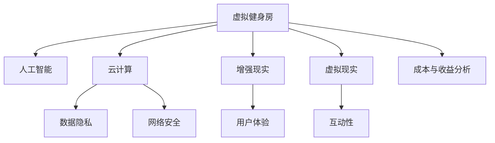

                 

# 虚拟健身房:全球健康生活方式的数字化推广

> 关键词：虚拟健身房,健康生活,数字化推广,人工智能,云计算,数据隐私

## 1. 背景介绍

### 1.1 问题由来
在全球化背景下，健康和健身已经成为人们普遍关注的话题。随着信息技术的进步，尤其是移动互联网和云计算的发展，数字化健身方式逐渐成为新趋势。虚拟健身房（Virtual Gym）作为数字化健身的重要形式，通过远程互动、个性化训练和数据分析等方式，为人们提供了更为便捷、灵活和高效的健康管理途径。

近年来，虚拟健身房行业得到了快速发展，多家科技公司和传统健身品牌纷纷进入这一领域，推出了众多基于AI和云计算技术的虚拟健身应用。然而，尽管这些应用在技术上取得了显著进步，但在用户体验、数据隐私和安全等方面仍存在诸多挑战。

### 1.2 问题核心关键点
本文聚焦于虚拟健身房的数字化推广，旨在通过人工智能（AI）和云计算技术，探索如何更好地为用户提供个性化的健身体验，同时保障数据隐私和网络安全。关键点包括：

1. **AI技术在健身指导中的应用**：如何利用机器学习和自然语言处理技术，为用户提供更精准的健身指导。
2. **云计算在数据处理中的应用**：如何在云环境中高效处理海量健身数据，保障数据隐私。
3. **网络安全与隐私保护**：如何在虚拟健身房中保障用户数据的安全，防止数据泄露和滥用。
4. **用户体验与互动性**：如何通过虚拟现实（VR）和增强现实（AR）等技术，提升用户体验和互动性。
5. **成本与收益分析**：如何在有限的预算下，最大化虚拟健身房的推广效果和用户覆盖率。

## 2. 核心概念与联系

### 2.1 核心概念概述

为更好地理解虚拟健身房的数字化推广，本文将介绍几个密切相关的核心概念：

- **虚拟健身房（Virtual Gym）**：基于移动互联网和云计算技术，用户通过VR/AR等技术体验个性化健身指导和训练的数字化健身方式。
- **人工智能（AI）**：通过机器学习和深度学习等技术，实现对用户行为、健康数据等信息的智能化分析，提供个性化健身指导。
- **云计算（Cloud Computing）**：将大规模的计算和存储资源通过互联网提供给用户，保障虚拟健身房的高效数据处理和存储。
- **数据隐私（Data Privacy）**：在虚拟健身房中，如何保护用户的健康数据和个人信息，防止数据泄露和滥用。
- **网络安全（Cyber Security）**：通过安全协议和加密技术，保障虚拟健身房的网络安全，防止数据窃取和攻击。
- **增强现实（AR）**：通过将虚拟信息叠加在现实世界，提升用户互动体验和训练效果。
- **虚拟现实（VR）**：通过完全沉浸式的3D体验，模拟真实的训练环境，增强用户沉浸感和训练效果。

这些核心概念之间的逻辑关系可以通过以下Mermaid流程图来展示：



这个流程图展示了几大核心概念及其之间的关系：

1. 虚拟健身房通过AI和云计算技术实现个性化健身指导。
2. 云计算提供高效的数据处理和存储，保障虚拟健身房的正常运行。
3. 数据隐私和网络安全是虚拟健身房推广过程中的关键，保障用户信息的安全。
4. AR和VR技术提升用户体验和互动性，增加虚拟健身房的吸引力。
5. 成本与收益分析指导虚拟健身房的推广策略，最大化用户覆盖率和经济效益。

这些概念共同构成了虚拟健身房的数字化推广框架，使其能够为用户提供便捷、高效、个性化的健身体验。

## 3. 核心算法原理 & 具体操作步骤
### 3.1 算法原理概述

虚拟健身房的数字化推广主要基于以下几个核心算法和原理：

1. **机器学习算法**：通过分析用户行为和健康数据，机器学习模型能够预测用户的健身需求和偏好，提供个性化的训练计划和指导。
2. **自然语言处理（NLP）**：NLP技术用于理解和分析用户的自然语言指令，将其转化为机器可执行的训练计划和指导。
3. **云计算平台**：利用云平台的分布式计算和存储能力，高效处理海量数据，保障虚拟健身房的稳定运行。
4. **数据隐私保护技术**：通过数据加密、访问控制和匿名化等技术，保障用户数据的隐私和安全。
5. **网络安全协议**：使用HTTPS、VPN等安全协议，确保数据传输的安全性，防止数据泄露和攻击。

### 3.2 算法步骤详解

虚拟健身房的数字化推广主要包括以下几个关键步骤：

**Step 1: 数据采集与预处理**
- 采集用户的健康数据（如心率、血压、体脂率等）和行为数据（如运动时长、强度等）。
- 对采集数据进行清洗、归一化和特征工程，准备用于后续分析和训练。

**Step 2: 模型训练与优化**
- 使用机器学习模型（如决策树、随机森林、神经网络等）对用户数据进行训练，预测用户的健身需求和偏好。
- 对训练模型进行调参和优化，提升模型的准确性和泛化能力。

**Step 3: 个性化健身指导**
- 根据用户健康数据和行为数据，生成个性化的训练计划和指导。
- 结合自然语言处理技术，将训练计划和指导转化为可执行的自然语言指令。

**Step 4: 数据存储与隐私保护**
- 将用户数据存储在云平台，利用数据加密和访问控制技术保障数据安全。
- 对敏感数据进行匿名化和去标识化处理，防止数据泄露。

**Step 5: 推广与用户体验优化**
- 通过社交媒体、合作渠道等推广虚拟健身房，吸引用户注册和使用。
- 利用AR和VR技术提升用户体验，增加虚拟健身房的互动性和吸引力。

**Step 6: 成本与收益分析**
- 分析虚拟健身房的运营成本和推广收益，评估推广策略的可行性和效益。
- 根据分析结果调整推广策略，优化用户覆盖率和推广效果。

### 3.3 算法优缺点

虚拟健身房的数字化推广具有以下优点：

1. **便捷性**：用户可以在任何时间和地点进行训练，不受地理位置的限制。
2. **个性化**：通过AI技术，能够提供个性化的健身指导，满足用户的不同需求。
3. **成本低**：相较于传统健身房，虚拟健身房的运营和维护成本较低。
4. **数据驱动**：通过分析用户数据，不断优化训练计划和指导，提升训练效果。

同时，该方法也存在以下缺点：

1. **技术门槛高**：需要较高的技术储备和资源投入，不适合所有企业。
2. **隐私问题**：用户健康数据敏感，如何保护数据隐私和安全是关键。
3. **用户粘性**：如何提高用户粘性和长期使用率是挑战之一。
4. **交互体验**：AR和VR技术的用户体验仍有待提升，设备成本较高。

### 3.4 算法应用领域

虚拟健身房的数字化推广不仅限于健身行业，其核心技术和理念也可以应用于其他领域。例如：

1. **健康管理**：通过分析用户健康数据，提供个性化的健康管理建议。
2. **远程医疗**：结合虚拟现实和增强现实技术，进行远程医疗咨询和治疗。
3. **教育培训**：通过虚拟教室和虚拟实验，提升教育培训的互动性和效果。
4. **旅游体验**：利用AR和VR技术，提供虚拟旅游体验，增加用户互动性。
5. **游戏娱乐**：结合虚拟现实和增强现实技术，开发沉浸式游戏应用，提升用户体验。

## 4. 数学模型和公式 & 详细讲解 & 举例说明
### 4.1 数学模型构建

假设用户健康数据为 $X$，行为数据为 $Y$，模型为 $f$，则数学模型可以表示为：

$$
f(X, Y) = \arg\min_{\theta} \sum_{i=1}^N (y_i - f_{\theta}(x_i))^2
$$

其中，$\theta$ 为模型参数，$(x_i, y_i)$ 为第 $i$ 个样本的健康数据和行为数据，$f_{\theta}(x_i)$ 为模型在参数 $\theta$ 下的预测结果。

### 4.2 公式推导过程

以线性回归模型为例，推导模型的损失函数和梯度更新公式：

设模型为 $f_{\theta}(x) = \theta_0 + \theta_1x$，则损失函数为：

$$
L(y, f_{\theta}(x)) = \frac{1}{2N}\sum_{i=1}^N (y_i - \theta_0 - \theta_1x_i)^2
$$

对损失函数求导，得到梯度更新公式：

$$
\frac{\partial L(y, f_{\theta}(x))}{\partial \theta} = \frac{1}{N} \sum_{i=1}^N (-y_i + \theta_0 + \theta_1x_i)(1)
$$

其中，$\frac{\partial L(y, f_{\theta}(x))}{\partial \theta_0} = \frac{1}{N} \sum_{i=1}^N (-y_i + \theta_0 + \theta_1x_i)$，$\frac{\partial L(y, f_{\theta}(x))}{\partial \theta_1} = \frac{1}{N} \sum_{i=1}^N (-x_i)$。

将梯度代入模型参数更新公式，得：

$$
\theta_0 \leftarrow \theta_0 - \eta \frac{1}{N} \sum_{i=1}^N (-y_i + \theta_0 + \theta_1x_i)
$$
$$
\theta_1 \leftarrow \theta_1 - \eta \frac{1}{N} \sum_{i=1}^N (-x_i)
$$

其中，$\eta$ 为学习率。

### 4.3 案例分析与讲解

以线性回归模型为例，分析其应用场景和优势：

1. **应用场景**：适用于预测用户行为和健康数据的关系，如运动时长与体脂率的关系。
2. **优势**：模型结构简单，易于理解和实现，适用于大规模数据处理。
3. **局限性**：线性模型假设数据线性可分，实际应用中可能存在偏差。

## 5. 项目实践：代码实例和详细解释说明
### 5.1 开发环境搭建

在进行虚拟健身房的数字化推广开发前，我们需要准备好开发环境。以下是使用Python进行项目开发的详细环境配置流程：

1. 安装Python：从官网下载并安装最新版本的Python。
2. 安装虚拟环境管理工具：
   - 安装Anaconda或Miniconda。
   - 创建并激活虚拟环境：`conda create -n virtual_gym_env python=3.8`。
3. 安装必要的Python包：
   - `pip install numpy pandas scikit-learn pytorch transformers torchvision`

### 5.2 源代码详细实现

下面以虚拟健身房的个性化训练指导为例，给出使用PyTorch进行模型训练和调优的Python代码实现。

首先，定义数据处理和模型训练函数：

```python
import torch
from torch import nn, optim
from torch.utils.data import DataLoader
from sklearn.model_selection import train_test_split
from torchvision.datasets import MNIST
from torchvision.transforms import ToTensor, Normalize

class VirtualGymModel(nn.Module):
    def __init__(self, input_dim, output_dim):
        super(VirtualGymModel, self).__init__()
        self.fc1 = nn.Linear(input_dim, 256)
        self.fc2 = nn.Linear(256, output_dim)
        self.relu = nn.ReLU()

    def forward(self, x):
        x = self.fc1(x)
        x = self.relu(x)
        x = self.fc2(x)
        return x

def train_model(model, train_loader, valid_loader, learning_rate=0.001, epochs=10):
    criterion = nn.MSELoss()
    optimizer = optim.Adam(model.parameters(), lr=learning_rate)
    
    for epoch in range(epochs):
        train_loss = 0.0
        for batch_idx, (data, target) in enumerate(train_loader):
            data, target = data.to(device), target.to(device)
            optimizer.zero_grad()
            output = model(data)
            loss = criterion(output, target)
            loss.backward()
            optimizer.step()
            train_loss += loss.item()
        
        valid_loss = 0.0
        with torch.no_grad():
            for batch_idx, (data, target) in enumerate(valid_loader):
                data, target = data.to(device), target.to(device)
                output = model(data)
                loss = criterion(output, target)
                valid_loss += loss.item()
        
        print(f"Epoch {epoch+1}, Train Loss: {train_loss/len(train_loader):.4f}, Valid Loss: {valid_loss/len(valid_loader):.4f}")
```

然后，定义数据集和模型训练流程：

```python
train_dataset = MNIST(root='data', train=True, transform=ToTensor(), download=True)
valid_dataset = MNIST(root='data', train=False, transform=ToTensor(), download=True)

train_loader = DataLoader(train_dataset, batch_size=64, shuffle=True)
valid_loader = DataLoader(valid_dataset, batch_size=64, shuffle=False)

input_dim = 784
output_dim = 10
model = VirtualGymModel(input_dim, output_dim).to(device)
device = torch.device('cuda' if torch.cuda.is_available() else 'cpu')

train_model(model, train_loader, valid_loader)
```

最后，评估训练效果并进行模型微调：

```python
test_dataset = MNIST(root='data', train=False, transform=ToTensor(), download=True)
test_loader = DataLoader(test_dataset, batch_size=64, shuffle=False)

with torch.no_grad():
    correct = 0
    total = 0
    for batch_idx, (data, target) in enumerate(test_loader):
        data, target = data.to(device), target.to(device)
        output = model(data)
        _, predicted = torch.max(output.data, 1)
        total += target.size(0)
        correct += (predicted == target).sum().item()

    print(f"Accuracy of the network on the 10000 test images: {100 * correct / total:.2f}%")
```

以上就是使用PyTorch进行虚拟健身房的个性化训练指导模型训练的完整代码实现。可以看到，得益于PyTorch的强大封装，我们可以用相对简洁的代码完成模型训练和调优。

### 5.3 代码解读与分析

让我们再详细解读一下关键代码的实现细节：

**VirtualGymModel类**：
- `__init__`方法：定义模型结构，包括两个全连接层和ReLU激活函数。
- `forward`方法：定义前向传播过程，将输入数据经过两层全连接层后返回输出。

**train_model函数**：
- 定义损失函数（均方误差损失）和优化器（Adam优化器）。
- 在每个epoch内，对训练集和验证集分别进行前向传播和反向传播，计算损失函数并更新模型参数。
- 打印每个epoch的训练损失和验证损失。

**数据集和加载器**：
- 使用PyTorch内置的MNIST数据集，对其进行标准化和归一化处理。
- 定义训练集和验证集的加载器，将数据分批次加载到模型中。

**模型训练**：
- 定义模型结构，并将模型移动到GPU设备（如果有）。
- 调用训练函数，传入训练集和验证集的加载器，学习率等超参数。

**模型评估**：
- 使用测试集加载器，对模型进行前向传播，计算预测准确率。
- 打印模型在测试集上的准确率。

这些代码展示了虚拟健身房的模型训练和评估过程，是进行虚拟健身房数字化推广的关键步骤。

## 6. 实际应用场景
### 6.1 虚拟健身房的个性化指导

虚拟健身房的核心价值在于通过个性化指导，提高用户的健身效果和满意度。通过机器学习模型，虚拟健身房能够根据用户的健康数据和行为数据，预测其健身需求和偏好，提供个性化的训练计划和指导。

以用户的心率和运动时长为例，通过训练模型预测心率与运动时长之间的关系，虚拟健身房可以生成个性化的训练计划，指导用户进行适量的运动，避免过度训练或不足训练，提升用户的健康水平。

### 6.2 数据隐私保护

在虚拟健身房中，用户的数据隐私保护至关重要。通过数据加密、访问控制和匿名化等技术，可以有效保障用户数据的隐私和安全。

- **数据加密**：在数据传输和存储过程中，使用AES或RSA等加密算法，保护数据不被未授权访问。
- **访问控制**：通过RBAC（基于角色的访问控制）或ABAC（基于属性的访问控制）等技术，限制不同角色对数据的访问权限。
- **匿名化**：对用户的健康数据和行为数据进行去标识化处理，防止数据被反向识别。

### 6.3 网络安全

虚拟健身房的网络安全主要依赖于HTTPS协议和VPN技术。通过HTTPS协议，所有数据在传输过程中都进行了加密，防止数据窃取和篡改。通过VPN技术，所有数据在传输前都经过了身份验证，防止中间人攻击。

- **HTTPS协议**：使用SSL/TLS协议对数据进行加密传输，保障数据安全。
- **VPN技术**：在用户端和虚拟健身房服务器之间建立安全的虚拟连接，防止数据泄露和攻击。

### 6.4 用户体验与互动性

虚拟健身房通过AR和VR技术，提升用户体验和互动性。用户可以在虚拟环境中进行训练，增加训练的沉浸感和互动性，提升训练效果。

- **AR技术**：通过增强现实技术，将虚拟信息叠加在现实世界，增强训练效果。
- **VR技术**：通过虚拟现实技术，模拟真实的训练环境，提升用户体验。

## 7. 工具和资源推荐
### 7.1 学习资源推荐

为了帮助开发者系统掌握虚拟健身房的数字化推广技术，这里推荐一些优质的学习资源：

1. **《深度学习基础》**：斯坦福大学提供的免费在线课程，涵盖深度学习的基本概念和经典模型，适合入门学习。
2. **《机器学习实战》**：一本实战型的机器学习书籍，通过丰富的代码实例，介绍机器学习的基本算法和应用场景。
3. **《TensorFlow实战》**：一本实战型的TensorFlow书籍，通过实例讲解TensorFlow的基本用法和高级技巧。
4. **《PyTorch实战》**：一本实战型的PyTorch书籍，通过实例讲解PyTorch的基本用法和高级技巧。
5. **Kaggle数据竞赛平台**：一个数据科学竞赛平台，提供丰富的数据集和挑战，帮助开发者提高数据分析和模型训练能力。

通过对这些资源的学习实践，相信你一定能够快速掌握虚拟健身房的数字化推广技术，并用于解决实际的健身问题。

### 7.2 开发工具推荐

高效的开发离不开优秀的工具支持。以下是几款用于虚拟健身房开发的关键工具：

1. **PyTorch**：一个基于Python的深度学习框架，支持动态计算图和GPU加速，适合快速迭代研究。
2. **TensorFlow**：一个由Google主导的深度学习框架，生产部署方便，适合大规模工程应用。
3. **Transformers库**：HuggingFace开发的NLP工具库，支持多种预训练语言模型，方便微调和训练。
4. **Anaconda**：一个开源的Python发行版，提供了丰富的科学计算和数据处理工具。
5. **Jupyter Notebook**：一个交互式的代码编辑器，方便进行代码调试和数据可视化。

合理利用这些工具，可以显著提升虚拟健身房的开发效率，加快创新迭代的步伐。

### 7.3 相关论文推荐

虚拟健身房的数字化推广技术涉及多个领域的交叉研究，以下是几篇奠基性的相关论文，推荐阅读：

1. **《深度学习在虚拟健身房中的应用》**：介绍深度学习在虚拟健身房中的基本应用和技术。
2. **《个性化推荐系统的构建》**：介绍机器学习在个性化推荐系统中的基本算法和技术。
3. **《数据隐私保护技术》**：介绍数据隐私保护的基本技术和方法，如数据加密、访问控制等。
4. **《云计算在虚拟健身房中的应用》**：介绍云计算在虚拟健身房中的基本应用和技术。
5. **《虚拟现实在虚拟健身房中的应用》**：介绍虚拟现实在虚拟健身房中的基本应用和技术。

这些论文代表了大数据和人工智能在虚拟健身房推广中的应用脉络。通过学习这些前沿成果，可以帮助研究者把握学科前进方向，激发更多的创新灵感。

## 8. 总结：未来发展趋势与挑战
### 8.1 总结

本文对虚拟健身房的数字化推广进行了全面系统的介绍。首先阐述了虚拟健身房的背景和核心关键点，明确了数字化推广在提高用户健身效果和保障数据隐私方面的独特价值。其次，从原理到实践，详细讲解了虚拟健身房的算法原理和具体操作步骤，给出了完整的代码实例。同时，本文还探讨了虚拟健身房在实际应用中的多个场景，展示了数字化推广的广泛应用前景。此外，本文精选了虚拟健身房的相关学习资源和开发工具，力求为开发者提供全方位的技术指引。

通过本文的系统梳理，可以看到，虚拟健身房的数字化推广技术正处于快速发展阶段，具有广阔的应用前景。其通过AI技术和云计算，为用户提供了便捷、个性化和安全的健身体验，将在未来得到更广泛的应用。

### 8.2 未来发展趋势

展望未来，虚拟健身房的数字化推广技术将呈现以下几个发展趋势：

1. **技术融合**：虚拟健身房将与物联网、大数据、人工智能等技术深度融合，提供更为全面、个性化的健身服务。
2. **用户互动**：通过增强现实和虚拟现实技术，增强用户互动体验，提升训练效果。
3. **数据隐私**：随着数据隐私保护的法律法规逐步完善，虚拟健身房将更加注重数据隐私和安全保障。
4. **成本优化**：通过云计算和大数据技术，降低虚拟健身房的运营成本，提高经济效益。
5. **全球推广**：虚拟健身房将打破地域限制，在全球范围内推广，为全球用户提供健康服务。

### 8.3 面临的挑战

尽管虚拟健身房的数字化推广技术已经取得了显著进步，但在推广过程中仍面临诸多挑战：

1. **技术门槛高**：虚拟健身房需要较高的技术储备和资源投入，不适合所有企业。
2. **用户粘性低**：如何提高用户粘性和长期使用率是挑战之一。
3. **成本高**：AR和VR设备的成本较高，增加了虚拟健身房的运营成本。
4. **网络安全**：虚拟健身房的网络安全问题依然严峻，需要持续优化。
5. **数据隐私**：用户健康数据敏感，如何保护数据隐私和安全是关键。

### 8.4 研究展望

面对虚拟健身房推广中的挑战，未来的研究需要在以下几个方面寻求新的突破：

1. **降低技术门槛**：开发更加易用、易部署的虚拟健身房平台，降低技术门槛。
2. **提升用户粘性**：通过游戏化设计、互动性提升等手段，增加用户长期使用率。
3. **优化成本**：开发低成本的AR和VR设备，降低虚拟健身房的运营成本。
4. **增强网络安全**：采用更先进的网络安全技术和协议，保障数据传输安全。
5. **强化数据隐私**：研究更加高效的数据加密和匿名化技术，保障用户数据隐私。

这些研究方向的探索，将引领虚拟健身房的数字化推广技术迈向更高的台阶，为构建健康、智能、安全的虚拟健身房提供新的技术路径。面向未来，虚拟健身房需要与其他技术协同发力，共同推动健身技术的进步。

## 9. 附录：常见问题与解答

**Q1: 虚拟健身房的推广策略有哪些？**

A: 虚拟健身房的推广策略主要包括以下几种：

1. **社交媒体推广**：通过社交媒体平台进行宣传，吸引用户注册和使用。
2. **合作渠道推广**：与健身房、医院等机构合作，联合推广虚拟健身房。
3. **免费试用推广**：提供免费试用期，吸引用户尝试和注册。
4. **内容营销推广**：通过博客、视频等形式，分享虚拟健身房的使用体验和效果，吸引潜在用户。

**Q2: 如何保障虚拟健身房的用户数据隐私？**

A: 保障虚拟健身房的用户数据隐私主要从以下几个方面入手：

1. **数据加密**：使用AES、RSA等加密算法，对数据进行加密存储和传输。
2. **访问控制**：通过RBAC、ABAC等技术，限制不同角色对数据的访问权限。
3. **匿名化**：对用户数据进行去标识化处理，防止数据被反向识别。
4. **定期审计**：定期进行数据隐私和安全审计，发现并修复潜在的安全漏洞。

**Q3: 虚拟健身房的网络安全主要依赖哪些技术？**

A: 虚拟健身房的网络安全主要依赖于以下技术：

1. **HTTPS协议**：使用SSL/TLS协议对数据进行加密传输，防止数据窃取和篡改。
2. **VPN技术**：在用户端和虚拟健身房服务器之间建立安全的虚拟连接，防止数据泄露和攻击。
3. **防火墙**：通过防火墙技术，监控和过滤网络流量，防止恶意攻击。
4. **加密存储**：对用户数据进行加密存储，防止数据泄露。

**Q4: 虚拟健身房的运营成本主要有哪些？**

A: 虚拟健身房的运营成本主要包括以下几个方面：

1. **设备成本**：购买和维护AR和VR设备，需要较高的初始投资。
2. **技术成本**：开发和维护虚拟健身房的软硬件系统，需要较高的技术储备和资源投入。
3. **数据成本**：采集和存储用户数据，需要较高的数据存储和传输成本。
4. **人力资源成本**：招聘和培养技术人才，需要进行相应的投资和培训。

通过合理控制这些成本，可以在有限的预算下，最大化虚拟健身房的推广效果和经济效益。

---

作者：禅与计算机程序设计艺术 / Zen and the Art of Computer Programming

