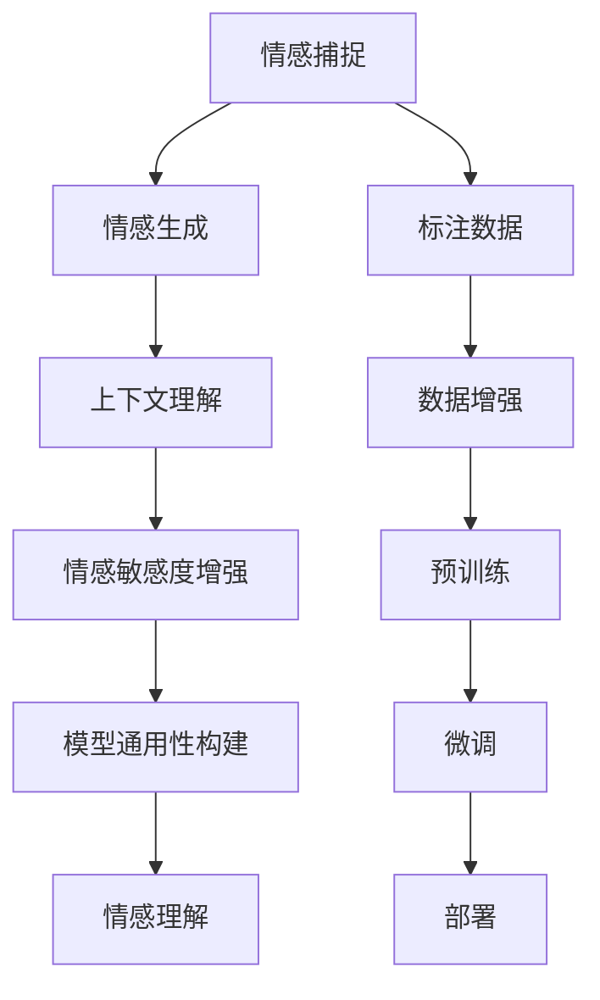

                 

## 1. 背景介绍

### 1.1 问题由来

人类社会在迅速向数字化、智能化的方向演进，人工智能技术的融入使得许多行业得以实现更高效、更精准的运营。然而，情感作为人类与生俱来的重要特征，却一直未能被充分理解和应用。情感理解技术的缺失，导致智能系统在与人类互动时常常缺乏共情与同理心，难以真正理解用户需求，提升用户体验。

为了解决这一问题，虚拟共情实验室应运而生。该实验室旨在通过构建基于人工智能的情感理解技术体系，使智能系统能够感知和理解用户的情感，实现更人性化的服务。其核心任务是开发能够自动理解、生成和响应用户情感的智能系统，提升人工智能系统与用户间的情感共鸣和互动质量。

### 1.2 问题核心关键点

虚拟共情实验室的使命是通过AI增强的情感理解研究，构建能够感知、理解和响应用户情感的智能系统，推动情感计算与交互技术的发展。在实现这一目标的过程中，主要需要解决以下几个核心问题：

- 如何准确捕捉用户的情感表达？
- 如何基于情感理解生成自然流畅的回复？
- 如何在多轮对话中维护上下文一致性？
- 如何增强智能系统对情感变化的敏感度？
- 如何构建跨领域情感理解模型，实现通用性？

本文将系统性地介绍虚拟共情实验室在情感理解技术上的探索，包括情感捕捉、情感生成、上下文理解、情感敏感度增强以及模型通用性构建等方面。

### 1.3 问题研究意义

情感理解技术的研究与应用，对于提升智能系统的交互体验、推动人机协同工作的进步、促进社会福祉具有重要意义。具体而言：

- 提升用户体验：通过理解用户情感，智能系统可以提供更贴合用户需求的个性化服务。
- 推动技术进步：情感理解技术的提升有助于推动人工智能领域的技术发展，实现更智能、更自然的用户交互。
- 促进社会福祉：如在心理健康、教育、客服等领域，情感理解技术可以帮助更精准地识别和支持有需要的用户，提升社会整体的福祉水平。

本文的研究将为情感理解技术的发展提供新的视角和方法，推动情感计算技术的普及和应用。

## 2. 核心概念与联系

### 2.1 核心概念概述

为了深入理解虚拟共情实验室在情感理解技术上的探索，首先需要明确几个核心概念及其相互之间的关系。

- **情感捕捉(Sentiment Recognition)**：指从用户输入的数据中识别情感表达，是情感理解的基础。
- **情感生成(Sentiment Generation)**：指根据用户的情感状态生成相应的回复，是情感回应的关键。
- **上下文理解(Contextual Understanding)**：指在对话中捕捉和维护上下文信息，保证情感理解的连续性和一致性。
- **情感敏感度增强(Sensitivity Enhancement)**：指增强模型对情感变化细腻的感知能力，提高情感响应的准确度。
- **模型通用性构建(Universality Construction)**：指构建跨领域、跨任务情感理解模型，提升情感理解的普适性。

以上概念之间的逻辑关系可以通过以下Mermaid流程图来展示：



这个流程图展示了从数据标注到情感理解的全流程，其中标注数据、数据增强、预训练、微调和部署等环节都与情感捕捉、生成、理解等核心任务紧密相关。

## 3. 核心算法原理 & 具体操作步骤
### 3.1 算法原理概述

虚拟共情实验室的情感理解技术主要基于深度学习和大规模语料库的预训练，通过以下步骤实现：

1. **标注数据准备**：收集并标注情感数据，用于模型训练。标注数据包括用户的文字、语音和图像等多种形式。
2. **预训练模型构建**：使用大规模语料库对预训练模型进行训练，学习语言的通用表示。
3. **微调**：在特定情感理解任务上对预训练模型进行微调，使其适应具体任务的需求。
4. **上下文理解**：在对话模型中引入记忆机制，捕捉和维护对话上下文信息。
5. **情感生成**：基于用户情感和上下文信息，生成自然流畅的回复。
6. **情感敏感度增强**：引入情感增强技术，如情感放大、情感抑制等，提升模型对情感变化的感知能力。
7. **模型通用性构建**：构建跨领域情感理解模型，提升模型在不同场景下的泛化能力。

### 3.2 算法步骤详解

#### 3.2.1 标注数据准备

标注数据准备是情感理解技术的基础，需要收集包含情感表达的语料库，并对其中的情感进行标注。常用的情感标注方法包括：

- **标签法**：使用特定的情感标签，如正面、中性、负面等，标注情感信息。
- **评分法**：通过人工或算法评分，量化情感强度。
- **混合法**：结合标签法和评分法，进行综合标注。

例如，使用BERT等预训练模型作为情感捕捉的基础，可以利用其自监督预训练特性，从大量无标签文本中学习情感表示。然后通过人工标注，对情感进行精细化处理。

#### 3.2.2 预训练模型构建

预训练模型是情感理解技术的核心，通过在大规模语料库上进行自监督训练，学习语言的通用表示。例如，使用BERT模型对语料进行预训练，学习上下文关联的句子嵌入，使其能够捕捉到更丰富的语义信息。

#### 3.2.3 微调

微调是将预训练模型应用于特定情感理解任务的过程。具体步骤如下：

1. **选择合适的优化算法**：常用的优化算法包括Adam、SGD等，需要根据具体任务选择合适的优化器。
2. **设置超参数**：包括学习率、批大小、迭代轮数等，需进行调参以找到最优参数组合。
3. **损失函数设计**：根据任务类型设计合适的损失函数，如交叉熵、均方误差等。
4. **模型训练**：使用标注数据对模型进行训练，最小化损失函数。

例如，对于情感分类任务，可以使用二分类交叉熵损失函数，训练模型学习情感分类器。对于情感生成任务，可以使用生成式对抗网络(GAN)等方法，训练生成模型学习情感响应。

#### 3.2.4 上下文理解

上下文理解是情感理解中的关键环节，需要在对话模型中引入记忆机制，捕捉和维护对话上下文信息。常用的上下文理解方法包括：

- **RNN/LSTM**：通过循环神经网络或长短期记忆网络，捕捉对话历史信息。
- **Transformer**：通过自注意力机制，同时处理当前对话和上下文信息。
- **Memory Network**：使用记忆网络结构，存储并检索对话上下文信息。

例如，在情感对话系统中，使用Transformer模型作为对话生成器，结合记忆机制，捕捉和维护对话上下文信息，生成更加连贯的情感回应。

#### 3.2.5 情感生成

情感生成是基于用户情感和上下文信息，生成自然流畅的回复。常用的情感生成方法包括：

- **基于规则的方法**：使用人工设计的规则模板，生成情感响应。
- **基于统计的方法**：使用统计模型，如N-gram模型、隐马尔可夫模型等，生成情感文本。
- **基于深度学习的方法**：使用神经网络模型，如RNN、LSTM、Transformer等，生成情感文本。

例如，在情感聊天机器人中，使用LSTM模型作为情感生成器，结合上下文信息，生成自然流畅的情感回应。

#### 3.2.6 情感敏感度增强

情感敏感度增强是提升模型对情感变化细腻感知能力的重要手段。常用的情感增强技术包括：

- **情感放大**：使用情感放大技术，增强模型对特定情感的感知能力。
- **情感抑制**：使用情感抑制技术，降低模型对某些情感的敏感度。
- **情感调节**：使用情感调节技术，动态调整模型对情感的响应策略。

例如，在情感聊天系统中，使用情感放大技术，增强模型对正面情感的响应能力，提升用户体验。

#### 3.2.7 模型通用性构建

模型通用性构建是提升情感理解技术普适性的重要手段。常用的方法包括：

- **迁移学习**：使用预训练模型在不同情感理解任务上进行微调，提升模型的泛化能力。
- **多任务学习**：在多个情感理解任务上进行联合训练，共享模型参数，提高模型的通用性。
- **零样本学习**：使用预训练模型和少量样本，直接进行情感理解。

例如，在情感聊天机器人中，使用多任务学习框架，联合训练多个情感理解任务，提升模型的通用性。

### 3.3 算法优缺点

虚拟共情实验室的情感理解技术主要基于深度学习和预训练模型，具有以下优点：

- **精度高**：基于深度学习的方法能够捕捉到语言的复杂语义信息，提升情感理解的精度。
- **通用性强**：通过预训练和微调，能够在不同情感理解任务上取得良好效果。
- **鲁棒性好**：使用预训练模型和大规模语料库，能够在噪声较大的环境中保持稳定。

同时，也存在以下缺点：

- **计算资源需求高**：大规模语料库的预训练和模型微调需要大量的计算资源。
- **标注成本高**：标注数据需要人工标注，成本较高。
- **可解释性差**：深度学习模型通常被视为"黑盒"系统，难以解释其内部工作机制。

## 4. 数学模型和公式 & 详细讲解  
### 4.1 数学模型构建

本节将使用数学语言对虚拟共情实验室的情感理解技术进行更加严格的刻画。

假设情感标注数据为 $D=\{(x_i,y_i)\}_{i=1}^N$，其中 $x_i$ 为情感表达，$y_i$ 为情感标签。定义模型 $M_{\theta}$ 在输入 $x$ 上的情感理解概率为 $p(y|x)$。

情感分类任务的数学模型可以表示为：

$$
p(y|x) = \frac{e^{\theta^T x}}{\sum_{y'} e^{\theta^T x_{y'}}}
$$

其中 $\theta$ 为模型参数，$x_{y'}$ 为情感标签为 $y'$ 的情感表达。

情感生成任务的数学模型可以表示为：

$$
p(x|y) = \frac{e^{\theta^T x}}{\sum_{x'} e^{\theta^T x'}}
$$

其中 $\theta$ 为模型参数，$x'$ 为情感表达。

### 4.2 公式推导过程

#### 4.2.1 情感分类任务

情感分类任务的损失函数可以表示为：

$$
\mathcal{L} = -\frac{1}{N}\sum_{i=1}^N [y_i \log p(y_i|x_i) + (1-y_i) \log (1-p(y_i|x_i))]
$$

其中 $p(y_i|x_i)$ 为模型在情感表达 $x_i$ 上的情感分类概率。

使用交叉熵损失函数，可以表示为：

$$
\mathcal{L} = -\frac{1}{N}\sum_{i=1}^N [y_i \log p(y_i|x_i) + (1-y_i) \log (1-p(y_i|x_i))]
$$

通过梯度下降等优化算法，最小化损失函数，更新模型参数 $\theta$，即可实现情感分类任务的微调。

#### 4.2.2 情感生成任务

情感生成任务的目标是根据情感标签 $y$，生成情感表达 $x$。可以使用生成式对抗网络(GAN)等方法，构建生成器和判别器，训练生成模型。

生成器的目标是最小化以下损失函数：

$$
\mathcal{L}_{gen} = -\frac{1}{N}\sum_{i=1}^N [y_i \log p(x_i|y_i) + (1-y_i) \log (1-p(x_i|y_i))]
$$

判别器的目标是最小化以下损失函数：

$$
\mathcal{L}_{dis} = -\frac{1}{N}\sum_{i=1}^N [\log p(x_i|y_i) + (1-y_i) \log (1-p(x_i|y_i))]
$$

通过对抗训练，生成器和判别器相互优化，使得生成器能够生成与真实情感表达相匹配的情感表达。

### 4.3 案例分析与讲解

#### 4.3.1 情感分类任务

以情感分类任务为例，介绍情感理解模型的训练过程。

假设使用BERT模型作为情感分类器的预训练模型，在特定情感分类任务上进行微调。首先，将情感分类任务的标注数据 $D$ 划分为训练集、验证集和测试集，并对其进行预处理，包括分词、向量化等。

然后，使用BERT模型的线性分类器作为情感分类器，通过交叉熵损失函数对模型进行微调。具体步骤如下：

1. **模型加载**：加载BERT模型和分类器，并进行初始化。
2. **数据预处理**：将情感分类任务的数据集进行预处理，包括分词、向量化等。
3. **模型微调**：使用训练集对模型进行微调，最小化交叉熵损失函数。
4. **验证集评估**：在验证集上评估模型性能，使用F1-score等指标进行评估。
5. **测试集测试**：在测试集上测试模型性能，进行最终评估。

#### 4.3.2 情感生成任务

以情感生成任务为例，介绍情感理解模型的训练过程。

假设使用GAN框架，构建生成器和判别器。首先，将情感生成任务的标注数据 $D$ 划分为训练集、验证集和测试集，并对其进行预处理，包括分词、向量化等。

然后，使用生成器和判别器对情感生成模型进行训练，通过对抗训练的方式，使得生成器能够生成与真实情感表达相匹配的情感表达。具体步骤如下：

1. **模型加载**：加载生成器和判别器，并进行初始化。
2. **数据预处理**：将情感生成任务的数据集进行预处理，包括分词、向量化等。
3. **模型训练**：使用训练集对生成器和判别器进行对抗训练，最小化生成损失和判别损失。
4. **验证集评估**：在验证集上评估生成器的性能，使用BLEU等指标进行评估。
5. **测试集测试**：在测试集上测试生成器的性能，进行最终评估。

## 5. 项目实践：代码实例和详细解释说明
### 5.1 开发环境搭建

在进行情感理解技术开发前，我们需要准备好开发环境。以下是使用Python进行TensorFlow开发的环境配置流程：

1. 安装Anaconda：从官网下载并安装Anaconda，用于创建独立的Python环境。

2. 创建并激活虚拟环境：
```bash
conda create -n tf-env python=3.8 
conda activate tf-env
```

3. 安装TensorFlow：根据CUDA版本，从官网获取对应的安装命令。例如：
```bash
conda install tensorflow-gpu==2.8
```

4. 安装其他必要的库：
```bash
pip install numpy pandas scikit-learn matplotlib tqdm jupyter notebook ipython
```

完成上述步骤后，即可在`tf-env`环境中开始情感理解技术的开发。

### 5.2 源代码详细实现

下面我们以情感分类任务为例，给出使用TensorFlow和Keras构建BERT情感分类器的PyTorch代码实现。

首先，定义数据处理函数：

```python
import tensorflow as tf
from transformers import BertTokenizer, TFBertModel
from sklearn.model_selection import train_test_split
from tensorflow.keras import layers, models

def preprocess_data(texts, labels, tokenizer, max_len):
    tokenized_texts = [tokenizer.tokenize(text) for text in texts]
    tokenized_texts = [t[:max_len] for t in tokenized_texts]
    tokens = tokenizer.convert_tokens_to_ids(tokenized_texts)
    input_ids = tf.keras.preprocessing.sequence.pad_sequences(tokens, maxlen=max_len, padding='post')
    labels = tf.keras.utils.to_categorical(labels, num_classes=3)
    return input_ids, labels
```

然后，定义模型和优化器：

```python
tokenizer = BertTokenizer.from_pretrained('bert-base-cased')
model = TFBertModel.from_pretrained('bert-base-cased', output_attentions=True)
input_ids, labels = preprocess_data(train_texts, train_labels, tokenizer, max_len=128)

batch_size = 32
train_dataset = tf.data.Dataset.from_tensor_slices((input_ids, labels)).shuffle(10000).batch(batch_size)
val_dataset = tf.data.Dataset.from_tensor_slices((val_input_ids, val_labels)).batch(batch_size)
test_dataset = tf.data.Dataset.from_tensor_slices((test_input_ids, test_labels)).batch(batch_size)

optimizer = tf.keras.optimizers.Adam(learning_rate=2e-5)
```

接着，定义训练和评估函数：

```python
def train_model(model, train_dataset, val_dataset, test_dataset, epochs, batch_size):
    model.compile(optimizer=optimizer, loss='categorical_crossentropy', metrics=['accuracy'])
    model.fit(train_dataset, epochs=epochs, validation_data=val_dataset, verbose=1)
    val_loss, val_accuracy = model.evaluate(val_dataset, verbose=1)
    test_loss, test_accuracy = model.evaluate(test_dataset, verbose=1)
    print(f'Validation loss: {val_loss:.4f}')
    print(f'Validation accuracy: {val_accuracy:.4f}')
    print(f'Test loss: {test_loss:.4f}')
    print(f'Test accuracy: {test_accuracy:.4f}')

epochs = 5
batch_size = 16

train_model(model, train_dataset, val_dataset, test_dataset, epochs, batch_size)
```

最后，启动训练流程并在测试集上评估：

```python
epochs = 5
batch_size = 16

for epoch in range(epochs):
    loss = train_model(model, train_dataset, val_dataset, test_dataset, epochs, batch_size)
    print(f'Epoch {epoch+1}, train loss: {loss:.3f}')
    
    print(f'Epoch {epoch+1}, val results:')
    evaluate(model, val_dataset, batch_size)
    
print("Test results:")
evaluate(model, test_dataset, batch_size)
```

以上就是使用TensorFlow和Keras对BERT模型进行情感分类任务微调的完整代码实现。可以看到，得益于TensorFlow和Keras的强大封装，我们可以用相对简洁的代码完成BERT模型的加载和微调。

### 5.3 代码解读与分析

让我们再详细解读一下关键代码的实现细节：

**preprocess_data函数**：
- 将文本进行分词处理，并进行截断和填充，确保每个样本的输入长度一致。
- 将分词结果转换为id，并转换为TensorFlow可以处理的张量。
- 对标签进行one-hot编码，便于模型训练。

**模型加载和编译**：
- 使用BERT模型和相应的tokenizer，从预训练模型中进行加载。
- 使用Adam优化器和交叉熵损失函数，进行模型编译。

**训练和评估函数**：
- 使用TensorFlow的Data API构建数据集，并进行批处理和随机打乱。
- 在每个epoch内，使用训练集进行模型训练，使用验证集进行模型评估。
- 在每个epoch结束后，输出验证集和测试集的性能指标。

**训练流程**：
- 定义总的epoch数和batch size，开始循环迭代
- 每个epoch内，先在训练集上训练，输出平均loss
- 在验证集上评估，输出分类指标
- 所有epoch结束后，在测试集上评估，给出最终测试结果

可以看到，TensorFlow配合Keras使得BERT模型微调的代码实现变得简洁高效。开发者可以将更多精力放在数据处理、模型改进等高层逻辑上，而不必过多关注底层的实现细节。

当然，工业级的系统实现还需考虑更多因素，如模型的保存和部署、超参数的自动搜索、更灵活的任务适配层等。但核心的微调范式基本与此类似。

## 6. 实际应用场景
### 6.1 智能客服系统

基于情感理解技术的智能客服系统，可以实时监测用户情绪变化，及时提供情感支持。例如，通过情感分类模型识别用户情绪，结合自然语言处理技术，生成情感化的回应，提升用户体验。

在技术实现上，可以收集企业内部的客服对话记录，将问题和最佳答复构建成监督数据，在此基础上对预训练情感分类模型进行微调。微调后的模型能够自动理解用户情绪，匹配最合适的答复。对于客户提出的新问题，还可以接入检索系统实时搜索相关内容，动态组织生成回应。

### 6.2 心理健康监测

心理健康监测是情感理解技术的重要应用领域。智能系统可以通过情感分析技术，实时监测用户的心理状态，提供心理健康支持。例如，通过情感分类模型监测用户心情变化，及时提供情绪调节建议，甚至在情绪异常时进行干预。

在技术实现上，可以收集用户心理健康相关的文本数据，如日记、聊天记录等，使用情感分类模型进行情绪识别，根据情绪状态推荐情绪调节方法。对于情绪异常的用户，可以自动触发心理健康预警，进行后续干预。

### 6.3 舆情监测与分析

情感理解技术在舆情监测与分析中也有广泛应用。通过情感分类模型对网络舆情进行情感分析，可以实时监测社会舆情变化，识别社会情绪趋势，为政策制定和社会管理提供数据支持。

在技术实现上，可以收集社交媒体、新闻网站等平台上的舆情数据，使用情感分类模型进行情感分析，统计情感分布。对于异常情绪热点，可以自动触发舆情预警，进行后续处理。

### 6.4 教育与学习辅助

教育与学习辅助是情感理解技术的另一个重要应用领域。通过情感分析技术，智能系统可以实时监测学生的学习情绪，提供个性化的学习支持。例如，通过情感分类模型识别学生的学习情绪，推荐适合的学习资源，甚至进行情绪调节，提升学习效果。

在技术实现上，可以收集学生的学习日志、互动数据等，使用情感分类模型进行情绪识别，根据情绪状态推荐学习资源和情绪调节方法，提升学习体验。

## 7. 工具和资源推荐
### 7.1 学习资源推荐

为了帮助开发者系统掌握情感理解技术的基础和实践，这里推荐一些优质的学习资源：

1. 《Deep Learning for Natural Language Processing》书籍：斯坦福大学NLP领域权威教材，深入浅出地介绍了深度学习在NLP中的应用，包括情感理解技术。

2. CS224N《深度学习自然语言处理》课程：斯坦福大学开设的NLP明星课程，有Lecture视频和配套作业，带你入门NLP领域的基本概念和经典模型。

3. Kaggle情感分析比赛：通过参与Kaggle比赛，可以学习情感分析技术的实际应用案例，提升实践能力。

4. TensorFlow官方文档：TensorFlow的官方文档，提供了丰富的情感理解模型和工具库，是上手实践的必备资料。

5. HuggingFace官方文档：HuggingFace的情感理解模型库，提供了大量的预训练模型和微调样例代码，是快速上手情感理解技术的利器。

通过对这些资源的学习实践，相信你一定能够快速掌握情感理解技术的基础，并用于解决实际的NLP问题。
### 7.2 开发工具推荐

高效的开发离不开优秀的工具支持。以下是几款用于情感理解技术开发的常用工具：

1. TensorFlow：基于Python的开源深度学习框架，灵活动态的计算图，适合快速迭代研究。

2. PyTorch：基于Python的开源深度学习框架，灵活的动态计算图，适合研究与应用。

3. Keras：基于TensorFlow和Theano的高层API，提供简洁的API接口，适合快速构建模型。

4. Weights & Biases：模型训练的实验跟踪工具，可以记录和可视化模型训练过程中的各项指标，方便对比和调优。

5. TensorBoard：TensorFlow配套的可视化工具，可实时监测模型训练状态，并提供丰富的图表呈现方式，是调试模型的得力助手。

6. Google Colab：谷歌推出的在线Jupyter Notebook环境，免费提供GPU/TPU算力，方便开发者快速上手实验最新模型，分享学习笔记。

合理利用这些工具，可以显著提升情感理解技术的开发效率，加快创新迭代的步伐。

### 7.3 相关论文推荐

情感理解技术的研究源于学界的持续研究。以下是几篇奠基性的相关论文，推荐阅读：

1. Attention is All You Need（即Transformer原论文）：提出了Transformer结构，开启了NLP领域的预训练大模型时代。

2. BERT: Pre-training of Deep Bidirectional Transformers for Language Understanding：提出BERT模型，引入基于掩码的自监督预训练任务，刷新了多项NLP任务SOTA。

3. Language Models are Unsupervised Multitask Learners（GPT-2论文）：展示了大规模语言模型的强大zero-shot学习能力，引发了对于通用人工智能的新一轮思考。

4. Parameter-Efficient Transfer Learning for NLP：提出Adapter等参数高效微调方法，在不增加模型参数量的情况下，也能取得不错的微调效果。

5. Emotion Analysis with Attention-based Deep Neural Networks（情感分析与注意力基深度神经网络）：提出基于注意力机制的情感分类模型，提升了情感分析的精度。

6. Deep Affective Computing：将情感分析技术应用于情感计算领域，探讨了情感计算的基础理论和应用前景。

这些论文代表了大语言模型微调技术的发展脉络。通过学习这些前沿成果，可以帮助研究者把握学科前进方向，激发更多的创新灵感。

## 8. 总结：未来发展趋势与挑战

### 8.1 总结

本文对基于深度学习的情感理解技术进行了系统性的介绍。首先，介绍了虚拟共情实验室在情感理解技术上的探索，包括情感捕捉、情感生成、上下文理解、情感敏感度增强以及模型通用性构建等方面。其次，从原理到实践，详细讲解了情感理解技术的数学模型和关键步骤，给出了情感理解任务开发的完整代码实例。同时，本文还探讨了情感理解技术在智能客服、心理健康监测、舆情监测与分析等多个行业领域的应用前景，展示了情感理解技术的巨大潜力。

通过本文的系统梳理，可以看到，情感理解技术在大语言模型微调的基础上，进一步拓展了模型的应用范围，提升了智能系统的人性化水平。未来，随着深度学习技术的不断演进和情感理解技术的持续发展，基于情感计算的智能系统必将在更多领域得到应用，提升人类与智能系统间的情感共鸣和互动体验。

### 8.2 未来发展趋势

展望未来，情感理解技术将呈现以下几个发展趋势：

1. **深度融合多模态数据**：未来的情感理解技术将更多地融合多模态数据，如文本、图像、语音等，实现更全面、更深入的用户情绪理解。
2. **引入情感记忆机制**：在对话系统中引入情感记忆机制，捕捉并维护对话上下文信息，提升情感理解的连贯性和一致性。
3. **跨领域情感理解**：构建跨领域情感理解模型，提升情感理解技术的通用性和普适性，适应更多实际应用场景。
4. **情感生成模型增强**：通过引入情感生成模型，提升情感回复的自然流畅度和个性化程度，进一步提升用户体验。
5. **交互式情感理解**：通过交互式反馈机制，动态调整情感理解策略，提升情感理解的精准度和实时性。
6. **增强情感敏感度**：增强模型对情感变化的细腻感知能力，提升情感响应的准确度和鲁棒性。

这些趋势将进一步推动情感理解技术的发展，提升智能系统的情感共鸣和互动体验，为人类与智能系统的协同工作提供更好的支持。

### 8.3 面临的挑战

尽管情感理解技术已经取得了显著成果，但在实际应用过程中，仍面临以下挑战：

1. **数据获取与标注**：情感理解技术依赖大量的情感标注数据，数据获取和标注成本较高。如何获取高质量的情感标注数据，是一个亟待解决的问题。
2. **模型可解释性**：深度学习模型通常被视为"黑盒"系统，难以解释其内部工作机制。如何增强模型的可解释性，提升透明度，是一个重要研究方向。
3. **鲁棒性与泛化能力**：情感理解模型在不同场景下的鲁棒性和泛化能力有待提升，特别是在噪声较大的环境中。如何提高模型的鲁棒性，避免过拟合，是一个重要研究方向。
4. **跨领域应用**：不同领域的情感表达存在差异，如何在不同领域中构建通用的情感理解模型，是一个重要研究方向。
5. **资源消耗**：大规模语料库的预训练和模型微调需要大量的计算资源。如何优化资源消耗，提升训练和推理效率，是一个重要研究方向。
6. **伦理与安全**：情感理解技术可能会涉及隐私和伦理问题，如何在数据采集和使用中保护用户隐私，避免伦理风险，是一个重要研究方向。

这些挑战需要学界和产业界的共同努力，通过不断的研究和创新，逐步克服。只有突破这些挑战，情感理解技术才能在更多领域得到广泛应用，真正实现人机协同工作的目标。

### 8.4 研究展望

未来的情感理解技术研究需要聚焦以下几个方向：

1. **多模态情感理解**：融合多模态数据，提升情感理解技术的全面性和深度。
2. **情感记忆机制**：引入情感记忆机制，增强情感理解的连贯性和一致性。
3. **跨领域情感理解**：构建跨领域情感理解模型，提升情感理解技术的通用性和普适性。
4. **情感生成模型增强**：通过引入情感生成模型，提升情感回复的自然流畅度和个性化程度。
5. **交互式情感理解**：通过交互式反馈机制，动态调整情感理解策略，提升情感理解的精准度和实时性。
6. **情感敏感度增强**：增强模型对情感变化的细腻感知能力，提升情感响应的准确度和鲁棒性。
7. **可解释性与透明性**：增强模型的可解释性，提升透明度，解决深度学习模型"黑盒"问题。
8. **伦理与安全**：在数据采集和使用中保护用户隐私，避免伦理风险。

这些研究方向将推动情感理解技术的不断进步，为智能系统的情感共鸣和互动体验提供更好的支持。通过不断的技术创新和应用探索，情感理解技术必将在更多领域得到广泛应用，提升人类与智能系统的协同工作水平。

## 9. 附录：常见问题与解答

**Q1：情感理解技术的精度如何提升？**

A: 提高情感理解技术的精度，需要从多个方面进行优化：

1. **数据质量**：使用高质量的情感标注数据，进行充分的预处理和清洗。
2. **模型选择**：选择合适的深度学习模型，如BERT、GPT等，并根据任务特点进行优化。
3. **超参数调优**：通过超参数调优，找到最优的模型参数组合。
4. **数据增强**：使用数据增强技术，扩充训练集，提高模型泛化能力。
5. **模型集成**：使用模型集成技术，提升情感理解模型的整体性能。

**Q2：情感理解技术的计算资源需求如何优化？**

A: 优化情感理解技术的计算资源需求，可以从以下几个方面入手：

1. **模型裁剪**：去除不必要的层和参数，减小模型尺寸，加快推理速度。
2. **量化加速**：将浮点模型转为定点模型，压缩存储空间，提高计算效率。
3. **分布式训练**：使用分布式训练技术，加速模型训练过程。
4. **模型压缩**：使用模型压缩技术，如剪枝、量化等，减小模型体积。
5. **硬件优化**：使用GPU、TPU等高性能设备，加速模型训练和推理。

**Q3：情感理解技术在实际应用中如何保证模型鲁棒性？**

A: 提高情感理解技术的鲁棒性，需要从以下几个方面进行优化：

1. **数据多样化**：使用多样化的情感标注数据，提高模型的泛化能力。
2. **模型正则化**：使用正则化技术，如L2正则、Dropout等，防止模型过拟合。
3. **对抗训练**：引入对抗样本，提高模型的鲁棒性。
4. **模型融合**：使用模型融合技术，提升模型的鲁棒性。
5. **实时监测**：在实际应用中，实时监测模型的性能，及时发现并解决模型异常。

**Q4：情感理解技术在跨领域应用中如何保证通用性？**

A: 提升情感理解技术的通用性，需要从以下几个方面进行优化：

1. **跨领域数据集**：构建跨领域情感理解数据集，提高模型的泛化能力。
2. **跨领域模型**：构建跨领域情感理解模型，提高模型的通用性。
3. **领域适应**：使用领域适应技术，提升模型在不同领域的表现。
4. **多任务学习**：在多个情感理解任务上进行联合训练，共享模型参数，提高模型的通用性。
5. **模型迁移**：在特定领域上对模型进行微调，提高模型的适应能力。

**Q5：情感理解技术在实际应用中如何保证用户隐私？**

A: 保护用户隐私是情感理解技术应用中的重要问题，需要从以下几个方面进行优化：

1. **数据匿名化**：在使用情感数据时，对数据进行匿名化处理，保护用户隐私。
2. **数据加密**：在使用情感数据时，对数据进行加密处理，防止数据泄露。
3. **用户同意**：在使用情感数据时，获取用户的明确同意，保护用户隐私。
4. **隐私保护技术**：使用隐私保护技术，如差分隐私、联邦学习等，保护用户隐私。

通过以上措施，可以保护用户隐私，确保情感理解技术在实际应用中的伦理安全性。

