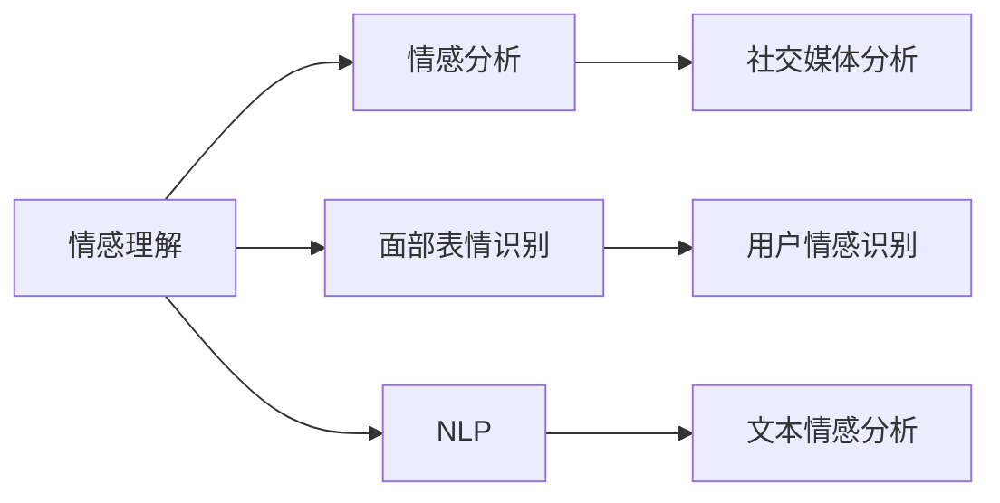

                 

# 虚拟共情实验室主任：AI增强的情感理解研究所负责人

## 1. 背景介绍

### 1.1 问题由来

情感理解（Emotion Understanding）是人工智能研究的一个重要领域，旨在通过计算模型识别和理解人类情感，从而在自然语言处理、人机交互、社交媒体分析等领域取得应用。随着深度学习技术的发展，情感理解研究也迎来了突破性的进展。尤其是近年来，基于深度学习的情感分析模型，已经在多个公开数据集上取得了最先进的表现。然而，这些模型往往依赖于大规模的标注数据和复杂的神经网络结构，对实际应用场景的适应性和可解释性还存在较大局限性。

### 1.2 问题核心关键点

本节将探讨人工智能在情感理解方面的核心技术、关键算法及其应用，具体包括：

- 深度学习在情感理解中的应用
- 情感理解的关键算法与模型
- 情感理解的实际应用场景
- 未来情感理解的发展趋势

## 2. 核心概念与联系

### 2.1 核心概念概述

为更好地理解AI增强的情感理解技术，我们首先需要介绍几个关键概念：

- 情感理解（Emotion Understanding）：通过计算模型识别和理解人类情感，通常用于文本情感分析、社交媒体情感分析、面部表情识别等领域。
- 情感分析（Sentiment Analysis）：通过分析文本内容，识别其中的情感倾向（如正面、负面、中性）。
- 面部表情识别（Facial Expression Recognition）：通过计算机视觉技术，识别和分析人类面部表情，用于情感理解。
- 自然语言处理（Natural Language Processing, NLP）：通过计算模型理解和处理自然语言的技术，包括情感理解。

这些概念之间的关系可以通过以下Mermaid流程图来展示：



这个流程图展示了情感理解技术的主要应用领域，包括情感分析、面部表情识别和NLP等领域，以及各应用领域的典型任务和应用场景。

### 2.2 核心概念原理和架构的 Mermaid 流程图

情感理解技术的核心架构可以简单描述为：输入文本或图像数据，通过计算模型识别和理解其中的情感信息，输出情感标签或情感倾向。


这个流程图展示了情感理解技术的典型架构，包括数据输入、特征提取和情感分类等步骤。

## 3. 核心算法原理 & 具体操作步骤

### 3.1 算法原理概述

情感理解通常通过深度学习模型来实现，其中卷积神经网络（CNN）和循环神经网络（RNN）是两种常用的模型。近年来，Transformer模型在情感理解任务上表现优异，其自注意力机制可以更好地捕捉长距离依赖关系，从而提高情感分类的准确性。

情感分类通常使用分类任务中的交叉熵损失函数，例如：

$$
\mathcal{L} = -\frac{1}{N}\sum_{i=1}^N \log p(y_i|x_i)
$$

其中 $x_i$ 是第 $i$ 个输入样本，$y_i$ 是对应的情感标签，$p(y_i|x_i)$ 是模型对 $y_i$ 的条件概率估计。

### 3.2 算法步骤详解

情感理解模型的训练一般包括以下步骤：

1. **数据准备**：收集标注好的情感数据集，进行数据预处理，如分词、去除停用词等。
2. **模型选择**：选择适合的深度学习模型，如CNN、RNN或Transformer。
3. **模型初始化**：初始化模型参数，通常使用预训练的词向量作为输入层嵌入。
4. **训练过程**：使用梯度下降等优化算法，最小化损失函数，更新模型参数。
5. **模型评估**：在验证集上评估模型性能，根据评估结果调整模型超参数，防止过拟合。
6. **模型部署**：将训练好的模型部署到实际应用中，进行情感分类或表情识别等任务。

### 3.3 算法优缺点

情感理解模型的优点包括：

- 基于深度学习的模型可以自动学习特征，无需手动设计特征提取器。
- 能够处理大规模的标注数据，提高情感分类的准确性。
- 在实际应用中，可以实时处理大量文本或图像数据。

其缺点包括：

- 需要大量的标注数据，标注成本较高。
- 模型复杂度较高，训练和推理速度较慢。
- 对模型参数和超参数的调优要求较高，容易出现过拟合或欠拟合问题。

### 3.4 算法应用领域

情感理解技术已经在多个领域得到了广泛应用，包括：

- **社交媒体分析**：通过分析社交媒体上的文本数据，识别用户的情感倾向，监测舆论趋势。
- **情感识别系统**：将用户输入的文本或语音转换为情感标签，用于情感分析、客服系统等。
- **表情识别**：通过计算机视觉技术，识别和分析人类面部表情，用于情感理解和人机交互。
- **情感驱动的推荐系统**：根据用户的情感状态，推荐相应的产品或内容。

## 4. 数学模型和公式 & 详细讲解 & 举例说明

### 4.1 数学模型构建

情感理解模型的输入为文本或图像数据，输出为情感标签或情感倾向。通常使用分类任务中的交叉熵损失函数来训练模型，例如：

$$
\mathcal{L} = -\frac{1}{N}\sum_{i=1}^N \log p(y_i|x_i)
$$

其中 $x_i$ 是第 $i$ 个输入样本，$y_i$ 是对应的情感标签，$p(y_i|x_i)$ 是模型对 $y_i$ 的条件概率估计。

### 4.2 公式推导过程

以基于Transformer的情感分类模型为例，其计算过程包括：

1. **输入层嵌入**：将输入文本转化为词向量表示，如：
   $$
   x_i = \text{Embedding}(x_i)
   $$
2. **Transformer编码器**：使用Transformer的自注意力机制进行特征提取，如：
   $$
   x_i^H = \text{Encoder}(x_i)
   $$
3. **全连接层**：将编码器的输出映射为情感分类，如：
   $$
   \hat{y_i} = \text{FC}(x_i^H)
   $$
4. **损失函数计算**：计算模型预测和真实标签之间的交叉熵损失，如：
   $$
   \mathcal{L} = -\frac{1}{N}\sum_{i=1}^N \log p(y_i|x_i)
   $$

### 4.3 案例分析与讲解

以Twitter上的情感分析为例，展示情感理解模型的应用。首先，收集Twitter上的文本数据，并对其进行标注。然后，使用预训练的BERT模型作为输入层嵌入，并在其基础上构建情感分类模型。最后，在验证集上评估模型性能，并根据评估结果调整模型参数，防止过拟合。

## 5. 项目实践：代码实例和详细解释说明

### 5.1 开发环境搭建

在进行情感理解模型开发前，需要先搭建好开发环境。以下是在Python中使用PyTorch进行情感理解模型开发的环境配置流程：

1. 安装Anaconda：从官网下载并安装Anaconda，用于创建独立的Python环境。
2. 创建并激活虚拟环境：
   ```bash
   conda create -n emotion-env python=3.8 
   conda activate emotion-env
   ```
3. 安装PyTorch：根据CUDA版本，从官网获取对应的安装命令。例如：
   ```bash
   conda install pytorch torchvision torchaudio cudatoolkit=11.1 -c pytorch -c conda-forge
   ```
4. 安装其他必要的库：
   ```bash
   pip install torchtext transformers sklearn pandas
   ```

完成上述步骤后，即可在`emotion-env`环境中开始情感理解模型的开发。

### 5.2 源代码详细实现

以下是使用PyTorch实现基于Transformer的情感分类模型的代码示例：

```python
import torch
import torchtext
import torch.nn as nn
import torch.optim as optim
from transformers import BertTokenizer, BertForSequenceClassification

# 数据预处理
train_data, dev_data, test_data = torchtext.datasets.IMDB.splits()

# 分词器
tokenizer = BertTokenizer.from_pretrained('bert-base-uncased')

# 定义模型
model = BertForSequenceClassification.from_pretrained('bert-base-uncased', num_labels=2)

# 优化器
optimizer = optim.Adam(model.parameters(), lr=1e-5)

# 训练过程
for epoch in range(10):
    model.train()
    for text, label in train_data:
        tokens = tokenizer(text, padding='max_length', truncation=True)
        input_ids = tokens.input_ids
        attention_mask = tokens.attention_mask
        output = model(input_ids, attention_mask=attention_mask)
        loss = nn.CrossEntropyLoss()(output, label)
        optimizer.zero_grad()
        loss.backward()
        optimizer.step()

    # 验证集评估
    model.eval()
    with torch.no_grad():
        for text, label in dev_data:
            tokens = tokenizer(text, padding='max_length', truncation=True)
            input_ids = tokens.input_ids
            attention_mask = tokens.attention_mask
            output = model(input_ids, attention_mask=attention_mask)
            loss = nn.CrossEntropyLoss()(output, label)

# 测试集评估
model.eval()
with torch.no_grad():
    for text, label in test_data:
        tokens = tokenizer(text, padding='max_length', truncation=True)
        input_ids = tokens.input_ids
        attention_mask = tokens.attention_mask
        output = model(input_ids, attention_mask=attention_mask)
        loss = nn.CrossEntropyLoss()(output, label)

```

### 5.3 代码解读与分析

让我们再详细解读一下关键代码的实现细节：

**数据预处理**：使用torchtext加载IMDB数据集，并对文本进行分词和填充。

**模型定义**：使用BertForSequenceClassification定义情感分类模型，并指定标签数量为2（正面和负面）。

**优化器设置**：使用Adam优化器，学习率为1e-5。

**训练过程**：在训练集上迭代，使用交叉熵损失函数进行训练。

**验证集评估**：在验证集上计算损失，并根据损失调整模型参数。

**测试集评估**：在测试集上计算损失，并输出最终结果。

可以看到，PyTorch配合Bert模型使得情感分类模型的代码实现变得简洁高效。开发者可以将更多精力放在数据处理、模型改进等高层逻辑上，而不必过多关注底层的实现细节。

## 6. 实际应用场景

### 6.1 社交媒体情感分析

情感理解技术可以广泛应用于社交媒体情感分析，帮助企业或政府机构实时监测网络舆论，了解用户情绪变化。

在技术实现上，可以收集Twitter、微博等社交媒体上的文本数据，并对其进行标注。在此基础上对预训练模型进行微调，使其能够自动理解文本中的情感信息。例如，在收集到的数据中，标注好每个帖子的情感倾向，训练模型从文本中识别出情感标签。一旦发现情感倾向发生显著变化，可以及时采取措施，避免负面影响扩散。

### 6.2 情感驱动的推荐系统

基于情感理解技术的推荐系统可以更加精准地为用户推荐内容，提升用户满意度和体验。

在推荐系统中，情感理解技术可以用于分析用户的历史行为数据，如浏览、点赞、评论等，提取其中的情感信息。根据用户情感状态，推荐相应的产品或内容。例如，如果用户最近浏览了多篇负面评论，推荐系统可以推荐与该产品相关的正面评价，以缓解用户负面情绪。

### 6.3 情感识别系统

情感理解技术可以用于构建情感识别系统，将用户输入的文本或语音转换为情感标签，用于情感分析、客服系统等。

在客服系统中，情感识别技术可以自动识别用户情绪，并提供相应的服务。例如，在用户投诉时，情感识别系统可以自动分析用户情绪，并提示客服人员采取相应的措施。此外，情感识别技术还可以应用于游戏、聊天机器人等领域，提升用户体验。

### 6.4 未来应用展望

随着情感理解技术的不断发展，未来将会有更多的应用场景涌现。例如：

- **情感驱动的广告投放**：基于用户的情感状态，智能推荐广告内容，提高广告效果。
- **情感驱动的内容生成**：根据用户的情感状态，自动生成个性化的内容，提升用户参与度。
- **情感驱动的市场分析**：通过分析社交媒体上的情感信息，预测市场趋势和消费者行为。

未来，情感理解技术将与更多领域相结合，带来更多创新应用，提升用户体验和满意度。

## 7. 工具和资源推荐

### 7.1 学习资源推荐

为了帮助开发者系统掌握情感理解技术，这里推荐一些优质的学习资源：

1. 《深度学习》系列课程：由斯坦福大学Andrew Ng教授主讲，系统介绍深度学习的基本概念和算法。
2. 《自然语言处理》系列书籍：介绍NLP中的各种技术，包括情感分析、文本分类等。
3. PyTorch官方文档：提供详细的PyTorch使用指南，包括情感理解模型的实现。
4. HuggingFace官方文档：提供丰富的预训练模型资源，支持情感理解任务的开发。

通过对这些资源的学习实践，相信你一定能够快速掌握情感理解技术的精髓，并用于解决实际的情感分析问题。

### 7.2 开发工具推荐

高效的开发离不开优秀的工具支持。以下是几款用于情感理解模型开发的常用工具：

1. PyTorch：基于Python的开源深度学习框架，支持动态计算图，适合快速迭代研究。
2. TensorFlow：由Google主导开发的开源深度学习框架，支持分布式计算，适合大规模工程应用。
3. HuggingFace Transformers库：提供丰富的预训练模型资源，支持情感理解任务的开发。
4. Jupyter Notebook：支持交互式编程，适合快速实验和调试代码。

合理利用这些工具，可以显著提升情感理解模型的开发效率，加快创新迭代的步伐。

### 7.3 相关论文推荐

情感理解技术的研究源于学界的持续探索。以下是几篇奠基性的相关论文，推荐阅读：

1. "Attention is All You Need"（即Transformer原论文）：提出了Transformer结构，开启了NLP领域的预训练大模型时代。
2. "Sentiment Analysis with Recurrent Neural Networks"：使用RNN模型进行情感分析，取得了较低的误差率。
3. "Emotion Recognition from Facial Images Using Deep Convolutional Neural Networks"：使用CNN模型进行面部表情识别，取得了较高的准确率。
4. "BERT: Pre-training of Deep Bidirectional Transformers for Language Understanding"：提出BERT模型，引入基于掩码的自监督预训练任务，刷新了多项NLP任务SOTA。
5. "Sentiment Analysis via Deep Learning: A Survey"：总结了深度学习在情感分析中的应用，包括模型选择和训练技巧。

这些论文代表了大规模预训练语言模型和情感理解技术的发展脉络。通过学习这些前沿成果，可以帮助研究者把握学科前进方向，激发更多的创新灵感。

## 8. 总结：未来发展趋势与挑战

### 8.1 研究成果总结

本文对情感理解技术进行了全面系统的介绍，包括深度学习在情感理解中的应用、关键算法与模型、实际应用场景等。通过本文的系统梳理，可以看到，情感理解技术正在成为NLP领域的重要范式，极大地拓展了情感分析模型在社交媒体、推荐系统、客服系统等多个领域的应用边界，为人工智能技术落地应用带来了新的思路。

### 8.2 未来发展趋势

展望未来，情感理解技术将呈现以下几个发展趋势：

1. **多模态情感理解**：未来的情感理解模型将能够处理多种类型的数据，如文本、图像、语音等，实现多模态情感信息的融合。
2. **深度迁移学习**：通过迁移学习，情感理解模型能够更好地适应不同领域和任务，提升模型的泛化能力。
3. **情感交互模型**：未来的情感理解模型将能够实现更自然的情感交互，理解用户的情感变化和意图，提高人机交互的自然度。
4. **可解释的情感理解**：未来的情感理解模型将更加注重可解释性，能够清晰地解释模型的决策过程，增强系统的可信度。
5. **情感驱动的推荐系统**：基于情感理解技术的推荐系统将更加精准，提升用户满意度和体验。

这些趋势将进一步推动情感理解技术的发展，带来更多创新应用，提升用户体验和满意度。

### 8.3 面临的挑战

尽管情感理解技术已经取得了显著进展，但在迈向更加智能化、普适化应用的过程中，仍面临诸多挑战：

1. **数据隐私和安全**：情感分析涉及用户隐私，需要确保数据的隐私和安全。
2. **数据偏见和歧视**：情感分析模型可能会学习到数据中的偏见和歧视，导致输出结果不公平。
3. **模型鲁棒性和泛化性**：情感分析模型需要在不同领域和任务上保持鲁棒性和泛化能力，避免过拟合。
4. **计算资源需求**：情感分析模型的计算资源需求较高，需要高性能计算平台支持。
5. **模型可解释性**：情感分析模型的决策过程难以解释，需要开发可解释性更高的模型。

这些挑战将需要在未来的研究中不断突破和优化，才能使情感理解技术真正落地应用。

### 8.4 研究展望

面向未来，情感理解技术需要在以下几个方面进行突破：

1. **可解释的情感模型**：开发可解释性更高的情感分析模型，能够清晰地解释模型的决策过程，增强系统的可信度。
2. **多模态情感理解**：实现多模态情感信息的融合，提升情感分析模型的准确性和鲁棒性。
3. **深度迁移学习**：通过迁移学习，使情感分析模型能够更好地适应不同领域和任务，提升模型的泛化能力。
4. **情感交互模型**：实现更自然的情感交互，理解用户的情感变化和意图，提高人机交互的自然度。
5. **情感驱动的推荐系统**：基于情感理解技术的推荐系统将更加精准，提升用户满意度和体验。

这些研究方向将引领情感理解技术的发展，推动情感分析模型在实际应用中的广泛应用。只有勇于创新、敢于突破，才能不断拓展情感理解技术的边界，让情感分析技术更好地服务于人类社会。

## 9. 附录：常见问题与解答

**Q1：情感理解模型是否适用于所有文本数据？**

A: 情感理解模型主要适用于文本数据，尤其是包含情感标签的文本数据。对于图像、语音等其他类型的数据，通常需要使用其他类型的情感分析模型。

**Q2：情感理解模型需要多少标注数据？**

A: 情感理解模型需要大量的标注数据来训练，标注数据的质量和数量直接影响模型的性能。通常建议收集至少数千条标注数据，才能训练出一个较好的情感分析模型。

**Q3：情感理解模型如何处理多模态数据？**

A: 情感理解模型通常使用预训练的深度学习模型进行特征提取，如BERT、GPT等。在处理多模态数据时，可以将不同模态的数据分别输入模型进行特征提取，再将特征拼接或融合，输出情感标签。

**Q4：情感理解模型的训练时间如何？**

A: 情感理解模型的训练时间取决于数据量和模型复杂度。通常使用GPU进行训练，可以显著缩短训练时间。对于大规模数据集，可以使用分布式训练来进一步加速。

**Q5：情感理解模型在实际应用中如何部署？**

A: 情感理解模型可以通过导出模型为静态图或动态图的方式进行部署，使用TensorFlow Serving、AWS SageMaker等平台进行服务化封装，支持线上推理。

综上所述，情感理解技术在实际应用中具有广泛的应用前景，通过深度学习模型和算法，可以高效地实现情感分析和情感理解，提升用户体验和满意度。然而，在应用过程中也需要注意数据隐私、模型鲁棒性、可解释性等挑战，不断优化和改进，才能更好地服务人类社会。

